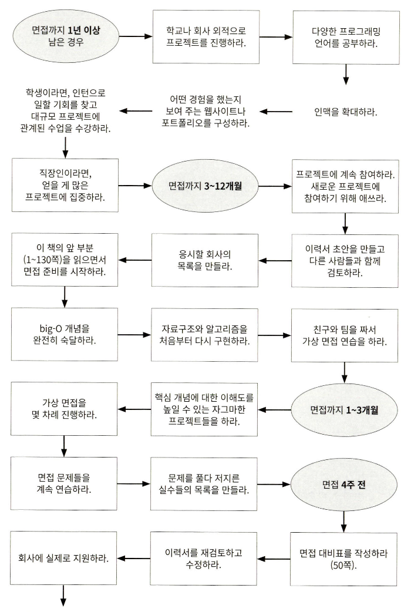
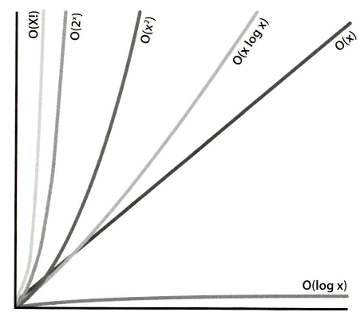
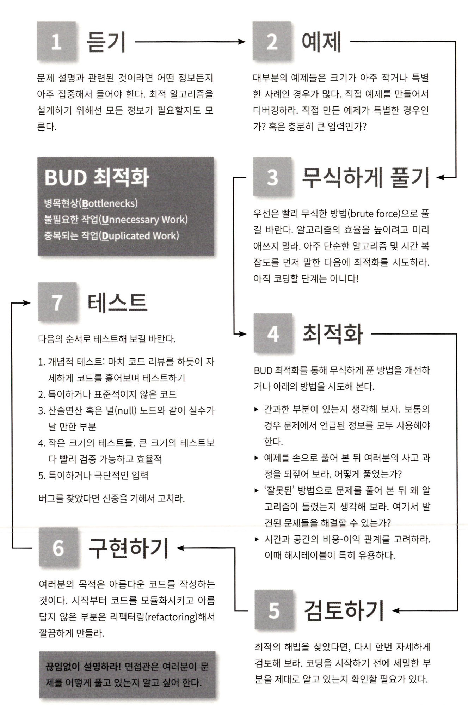
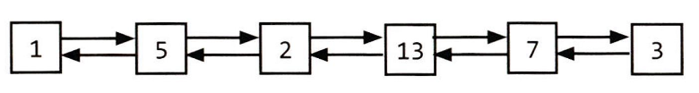
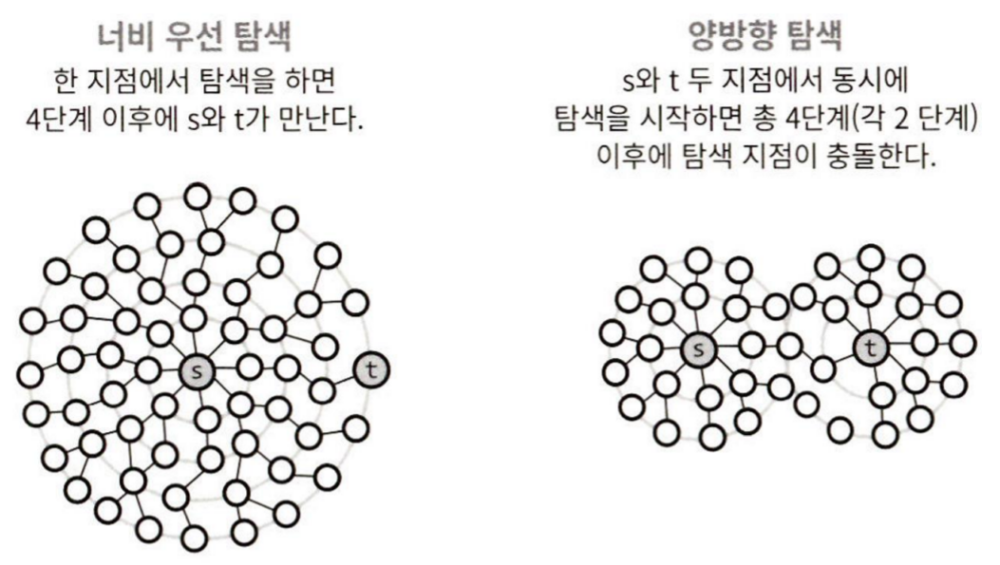

# Coding Interview

## Chapter 01. 면접과정

### 면접간 문제 풀이

- 문제를 풀어가는 사고과정을 최선을 다해 소리내어 표현해야 한다.
  - 소리 뿐 아니라 어떤 방법으로든 면접관에게 자신의 사고 과정을 전달 할 수 있어야 한다.

### 면접 평가의 지표

- 분석 능력
  - 문제를 푸는데 도움을 많이 받았는가?
  - 최적화를 얼마나 수행하는가?
  - 문제 풀이 시간이 얼마나 소요되었는가?
  - 디자인/설계시에 문제를 제대로 이해하였는가?
  - 다양한 방법에 대한 장단점을 고려하는가?
- 코딩 능력
  - 알고리즘을 적절한 코드로 표현할 수 있는가?
  - 코드는 깔끔하게 잘 구성되어 있는가?
  - 발생 가능한 에러에 대해 고려하였는가?
  - 코드 스타일은 어떤가?
- 기술적 지식 및 컴퓨터 과학 기본기
  - CS 및 관련 기술에 대한 관심과 기본기가 갖추어져 있는가?
- 경험
  - 과거에 기술적 결정을 해 본 적이 있는가?
  - 흥미롭고 도전적인 프로젝트를 경험한 적 있는가?
  - 진취성, 결단성 등 요소를 발휘한 적이 있는가?
- 컬쳐핏, 의사소통 능력
  - 성격과 가치관이 회사와 잘 맞는가?
  - 면접관과 의사소통이 원활한가?

### 면접 방식이 왜 이래야 하는가?

- 물론 현재 면접의 방식이 지원자를 완전하게 평가 할 수는 없다.
- 그러나, 위와 같은 문제에도 불구하고 이러한 방식의 면접은 필요하다.

#### 부정 오류과 긍정 오류

- 회사의 입장에서, 부정 오류보다는 긍정 오류가 더 심각하다.
- 즉, 정말 유능한 지원자를 몇 명 잃더라도, 무능한 지원자를 채용하는 것 보다는 낫다는 것이다.

#### 문제풀이는 꽤 가치 있는 능력이다

- 또한 본질적으로 어려운 문제를 풀어내는 사람이라면, 대체로 최적의 알고리즘을 개발하는 능력이 더 뛰어날 것이기 때문이다.

#### 기초적인 자료구조와 알고리즘 지식은 유용하다

- 트리, 그래프, 리스트, 정렬 등과 같은 지식은 주기적으로 이해해 둘 필요가 있다.
  - 이 요소의 존재를 알고있어야 필요한 곳에 사용할 수 있으며,
  - 존재를 알고있다면 대체로 기본적인 이해는 하고있다고 볼 수 있다.
- 또한 자료구조나 알고리즘을 안다는 것 자체가 지원자가 CS에 대해 기술적인 지식을 가지고 있던지, 스스로 공부해서 습득했다는 것을 증명하기 때문이다.

### 어떤 물제를 출제하는가

- 대다수의 회사는, '전사적 차원에서의 면접 질문' 을 가지고있지 않다.
- 대체로 면접관이 적절한 질문지를 선택한다.
- 다만, 넓은 의미에서의 '회사별 차이점'은 존재한다.
  - 어떤 회사는 알고리즘에 집중하고
  - 어떤 회사는 CS 지식에 기반한 질문을 한다.

## Chapter 02. 장막 너머

- 대체로 면접 대상자로 선별되면 아래의 절차를 밟는다
  1. 사전 면접(Screening interview)
  2. 세 번에서 여섯 번의 대면 면접
- 만약 면접 후 일주일 이상 답변이 없다면, 대체로 구인 담당자에게 연락을 해 보는 것이 좋다.

### 회사별 면접 중점

#### 각 회사별 특이사항 및 중점요소

- 마이크로소프트
  - "마이크로소프트에서 일하고 싶은 이유는?"
    - 이 질문을 통해 기술에 대한 열정 등을 알고자 한다.

- 아마존
  - 규모 확장성(Scalability) 관련 질문
  - 객체 지향 디자인(OOP)

- 구글
  - 규모 확장이 가능한 시스템(Scalable System)을 어떻게 설계하는가
  - 분석(알고리즘) 문제

- 애플
  - 면접을 진행하는 팀의 제품에 대한 적극적이고 구체적인 피드백

- 페이스북
  - 개발자의 기업가 정신
  - 빠른 시일 내에 결과를 확인 할 수 있도록 하는 자세

- 펠런티어
  - 핵심 자료구조와 알고리즘
  - 백엔드 시스템 디자인 요소

#### 회사별 중점요소를 통해 알 수 있는 것

- 면접에 다양한 전략이 있을 수 있다.
- 그러나 그중에서도 가장 기본이 되는 알고리즘과 문제 해결 능력이 다방면에서 도움이 될 수 있다.

## Chapter 03. 특별한 상황에서의 면접

### 경력자

- 경력자의 경우에도 알고리즘 문제를 물어 볼 가능성이 있음
  - 이는, 문제해결 능력은 모든 수준의 개발자에게 중요하기 때문임.
- 다만, 시스템 디자인/설계 및 이력서와 관련된 질문에 좀 더 포커스를 두게 됨.
  - 이러한 질문은 경력자의 경험에 대해 알아 볼 수 있는 질문이기에 좀 더 중요성이 부여됨.
- '가장 고치기 힘든 버그가 무엇이었나요?' 등의 질문에 인상적인 답변을 준비하자.

### 테스터 혹은 SDET(Software Design Engineer in Test)

- SDET: 실제 제품이 아닌, 테스트를 위한 코드를 작성하는 개발자.
- 준비사항
  - 테스트에 관한 질문에 대비하라: '전구를 어떻게 테스트 할 것인가?'
  - 코딩 관련 질문에 대비: 어디까지나 개발자인 이상, 코딩 능력은 필수적임.
  - 코딩 결과를 테스트하는 훈련을 해라: 테스트 코드를 작성하는 것은 코딩 능력을 향상시키는 좋은 방법임.
- 유의사항
  - 일반적으로 SDET에서 개발자로 전환하는 것은 어렵다. 그렇기에 개발자가 되는 루트 중 하나로 사용하는것은 좋지 않다.

### PM(Product Manager || Program Manager)

- 이름은 비슷하지만 회사마다 매우 다른 역할을 수행함.
- 준비사항
  - 모호성에 대한 대응: 모호한 경우에 결정하지 못하고 패닉에 빠지지 않아야 함. 어떻게든 결정하고 진행하는 모습을 보여야 함.
  - 고객에 초점을 맞추는가(태도): 고객의 입장에서 생각하고, 고객의 요구사항을 충족시키는 방법을 고민해야 함.
  - 고객에 초점을 맞추는가(기술적 능력): 고객이 사용할 제품에 대한 기술적인 이해가 있다면 더욱 좋음.
  - 다층적 의사소통: PM은 직업적 특성상 매우 많은 계층의 사람들과 협업해야 함. 따라서 유연한 의사소통 능력을 갖추어야 함.
  - 기술에 대한 열정: 자신의 일을 열정적으로 즐길 수 있는 사람이라면, 더욱 좋음.
  - 팀워크/리더십: PM은 팀을 이끌어야 하기에, 팀워크와 리더십 능력이 필수적임.

### 개발 책임자(Dev Lead)와 관리자(Dev Manager)

- 준비사항
  - 팀워크/리더십: 개발자이지만 관리직인 이상 팀을 이끌어야 하기에, 팀워크와 리더십 능력이 필수적임.
  - 우선순위: 빡빡한 데드라인 속에서 덜 중요한 부분을 어떻게 쳐낼지에 대한 기준을 갖추어야 함.
  - 소통: 윗사람, 아랫사람, 고객 등 넓은 범위의 사람들과 소통하는 능력이 필요함.
  - 책임감: 관리자로서 가장 중요한 부분은 맡은 일을 끝까지 해내는 것임. 또한, '프로젝트를 준비하는 것' 과 '프로젝트를 수행하는 것'의 균형을 잘 맞추어야 함.

### 스타트업

- 스타트업은 회사별로 지원 절차와 면접 과정이 매우 다름. 따라서 일반적인 고려 요소만 나열함

#### 지원 절차

- 구인공고 확인 이외에도, 추천이나 직접 연락을 취해보는 것도 좋음.
- 굳이 아는 사람이 아니더라도, 관심을 표하고 양해를 구하는 것 만으로도 이력서를 읽어 봐 줄 누군가를 찾을 수 있음.

#### 비자와 취업 승인

- 외국인으로서 비자가 필요하다면, 대부분의 스타트업은 취업 비자를 제공하기 어려움.
- 따라서 전문 리크루터를 찾거나, 규모가 큰 스타트업을 찾아보는 것이 나음.

### 실전성

- 스타트업의 특성상, 단순히 똑똑하고 코딩을 잘 하는 사람이 필요한 게 아니라, 여러 실제 상황에 대응 할 수 있는 사람이 필요함.
- 때로는 사업가적 자질이 요구되는 경우도 있음.
- 즉 스타트업에서 즉시 업무에 투입될 수 있는 사람을 선호함.

### 기업인수 및 인재영입

- 기업 인수나 인재영입 과정을 거쳐 채용되는 경우도 있음.
- 그러나 이 과정에서도 모두가 채용되는 경우 이외에, 면접을 거치는 경우가 있으며 이는 매우 중요함.
- 면접을 망치는 경우, 인수인계를 위해 6개월 가량의 단기 계약직으로 근무하는 경우도 있고, 바로 퇴사하는 경우도 있음.

### 면접관의 입장(에서 본 우리가 준비할 사항)

#### 여기에 있는 문제를 그대로 사용하지 말라

- 즉, 여기에 있는 문제가 그대로 나올리는 거의 없다. 비슷한 유형의 다른 문제를 많이 겪어보자.

#### 중간 이상의 어려운 문제를 출제하라

- 너무 쉬운 문제는 크게 도움되지 않는다. 중간 이상, 어려운 문제에 포커스를 하자.

#### 여러 가지 난관을 거쳐야 하는 문제를 찾으라

- 한번의 '아하'를 통해 풀리는 문제는 대체로 출제되지 않는다. 이는 지원자의 운에 의해 역량이 좌우될 가능성이 있기 때문이다.
- 여러 과정을 거쳐서 문제를 해결해야 하는 문제를 찾아보자.

#### 알기 어려운 지식이 아닌 풀기 어려운 문제를 출제하라

- 아무도 관심없고 알 수 없는 지식을 문제로 내는 경우는 없다.
- 즉, 마이너한 분야에 대한 지식을 기반으로 푸는 문제는 거의 없다.
- 따라서 잘 알려진 자료구조와 알고리즘을 위주로 공부하자.

#### 겁을 주는 문제를 피하라

- 겁을 주는 문제?
  - 수학, 확률 문제
  - 로우 레벨 지식(메모리 할당 등)
  - 시스템 디자인, 확장성
  - 영리 제품 등
- 이러한 문제가 나온다면, 대부분 수학이나 확률 등으로 푸는 문제가 아닐 가능성이 높다.
- 쫄지 말자.

#### 지원자를 긍정적으로 대하라

- 지원자도 마찬가지로, 면접관을 긍정적으로, 예의를 갖춰서 대하자.

#### 행동 질문을 철저히 하라

- 많은 지원자들이 '팀'으로서 활동해 왔기에 자신의 성취를 표현하는데에 어려움을 겪는다.
- 즉, 우리는 자신의 경험을 최대한 가감없이 구체적으로 표현해야 한다.

#### 지원자에게 조언하라

- 면접관에 대한 조언
  - 지원자가 적당한 예제를 사용하도록 조언하라.
  - 지원자가 해법을 찾기 전에 코딩을 시작하지 않고, 해법을 찾은 후에 코딩을 시작하도록 조언하라.
  - 지원자가 아무것도 하지 못한다면, 브루트 포스 등의 간단한 힌트나 해법을 제시하라.
- 지원자의 행동
  - 최대한 최적의 알고리즘을 먼저 설계한다.
  - 브루트 포스 등의 간단한 해법이 있는지 찾아본다.
  - 필요시 면접관에게 힌트를 요청해도 좋다.

#### 그들이 생각할 시간을 원한다면 생각할 시간을 주라

- 즉, 지원자가 생각할 시간이 필요하다면, 생각할 시간을 요청해라.

#### 방식을 정하라: 네 가지 면접 방식

- 새너티 테스트(Sanity check)
  - 쉬운 문제나 디자인 문제에 관한 것.
  - 최약의 지원자를 걸러내기 위한 문제.
- 수준 테스트(Quality check)
  - 좀 더 도전적인 문제.
  - 철저하게 설계되어 알고리즘, 문제풀이 능력을 테스트하는 문제.
  - 너무 쉽거나, 형편없는 문제를 출제하지 않아야 함.
- 전문가 문제(Specialist question)
  - 지원자의 전문 분야에 관한 문제.
  - 지원자의 전문 분야에 대한 지식을 테스트하는 문제.
- 프락시 지식(Proxy knowledge)
  - 지원자의 수준에서 알 법 한 문제.

## Chapter 04. 면접 전에

- 시작이 늦었더라도, 할수 있는만큼 따라잡기 위한 노력을 하자.

### 적절한 경험 쌓기

- 탄탄한 이력과 면접을 위한 기본은, 훌륭한 이력을 쌓는 것임.
- 예시
  - 큰 규모의 프로젝트 수업을 들어라.
  - 인턴 자리를 알아보자.
  - 해커톤이든 사이드든, 뭔가를 하라.
- 다른 직종에서 개발자로의 전직을 원한다면
  - 코딩을 많이 할 수 있는 업무를 하라
  - 저녁과 주말을 활용해, 개인적인 프로젝트를 진행하라
- 결론적으로, 회사는 **코딩을 할 수 있고 영리한 사람**을 뽑는다.

### 탄탄한 이력서 작성하기

- 적절한 이력서 길이: 미국에서는 경력 10년차 미만은 1페이지, 10년차 이상은 2페이지를 권장함.
  - 경우에 따라 긴 이력서는 바로 스킵당할 수 있음.
- 과거 직함을 전부 나열할 필요는 없고, 관련 이력만 나열하자.
- '무엇을', '어떻게', '결과는 어떠했나'를 중점으로 작성하자
  - 분산 캐시를 구현해서 오브젝트 렌더링 시간을 75% 줄였고, 결과적으로 로그인 시간을 10% 경감 할 수 있었다.
- 경험한 프로젝트
  - 강조할만한 프로젝트 2~4개만 기입하자.
    - 쓸모없는 프로젝트가 자리만 차지하지 않게 해라.
- 소프트웨어(툴)와 프로그래밍 언어
  - 소프트웨어는 가급적 언급하지 말자.
    - vscode를 쓸 줄 아는게 중요한가? 배우기 어려운가?
  - 프로그래밍 언어
    - 사용해본 언어를 전부 적는것은 위험하다.
    - 사용해본 언어를 적되, 언어에 대한 이해도를 적어두자.
      - JS/TS(중급), PHP(중급), Python(경험 있음)
- 오탈자를 꼭 확인하자.
- 특정 언어를 지나치게 강조하지 말자.

### 준비절차




## Chapter 05. 행동 문제

### 대비 요령

- 주로 주어지는 질문 목록 작성해보기. 3개정도의 프로젝트에 대해 아래의 질문에 답변 해 보자.
  - 가장 도전적이었던 것
  - 실수 혹은 경험담
  - 즐거웠던 것
  - 리더십
  - 팀원과의 갈등
  - 남들과 다르게 행동했던 것
- 본인의 '진짜' 단점을 언급하자.
  - 본인을 포장하기 위해 '너무 열심히 일하는 게 단점입니다.' 등의 답변은 오만해 보일 수 있다.
- 면접관에게 할 질문들
  - 순수한 질문
    - '테스터, 개발자, PM의 비율이 어떻게 되나요?'
    - '서로 어떻게 협조하나요?' 등
    - '면접관께서는 어떻게 이 회사에 오시게 되었나요?'
  - 통찰력을 보여줄 수 있는 질문
    - 'X라는 기술을 사용하고 계신데, Y 문제는 어떻게 해결하고 계신가요?'
    - '제품에 A 대신 B 기술을 사용하신 이유가 있나요? a, b, c 등의 장점이 있지만 d라는 이슈가 있어서 사용하지 않는 회사도 많다고 알고 있습니다.'
  - 열정을 보여 줄 수 있는 질문
    - '저는 규모 확장성에 흥미가 있는데, 이 회사에서 이를 배울 수 있을까요?'
    - 'X 기술을 잘은 모르지만 재미있는 해법이 될 것 같네요. 어떻게 동작하는지 설명 해 주실 수 있으실까요?'

### 기술적 프로젝트에 대한 이해

- 최소한 두세가지 이상의 프로젝트에 대해 집중적으로 깊이 알고있어야 함.
- 아래 기준이 부합하는 프로젝트라면 더욱 좋음.
  - 단순히 많이 배웠던 것을 넘어서 도전적인 요소가 있었던 프로젝트
  - 자신이 중심 역할을 수행했던 프로젝트
  - 기술적으로 깊이있는 이야기를 할 수 있는 프로젝트
- 그 외 알아두면 좋은 요소들
  - 도전적인 면
  - 일으켰던 실수
  - 기술적 결정
  - 기술의 선택과 그에 대한 실익
  - 남들과는 다르게 할 수 있었던 것
  - 이후 개선할 수 있었던 것
  - 장차 확장 방안 등

### 행동 질문에 대한 대처 요령

- 최대한 구체적으로 답하고, 오만하게 굴지 말자.
- 지나친 세부사항은 언급하지 말자.
  - 면접자는 세부사항을 정확히 모르고, 궁금하지 않을 수 있다.
  - 필요하다면 면접자가 스스로 파고 들 수 있도록, 핵심만 언급하자.
    - '가장 보편적인 사용자 행위 패턴을 검사하고 Rabin-Karp 알고리즘을 사용하여 90%정도 경우에 대해 검색시간을 O(n)에서 O(log n)으로 줄이는 알고리즘을 설계했습니다. 궁금하시다면 좀 더 자세히 말씀드리도록 하겠습니다.'
- 팀이 아닌, 자신의 성과에 대해 이야기하자.
  - '우리', '우리 팀'에 대해서만 이야기하면, 자신의 역할을 면접관에게 충분히 전달하지 못할 수 있다.
- 구조적인 답변을 내놓으라
  - 정보 우선(Nugget first)
    > '학부생들이 자기 과목을 직접 가르치도록 학교 당국을 설득했던 상황에 대해 이야기해 드리죠.  
    > 제가 다니던 학교는 처음에는...'
  - S.A.R(Situation, Action, Result)
    > 상황(S): 프로젝트에 인원 셋이 추가되었는데 한명만 유난히 성과가 적고 소극적이었다.

    > 행동(A): 그와 대화를 시도했고, 그는 자신이 코드를 작성할 자격이 없다고 생각한다는 점을 밝히고 문서작업을 희망한다고 하였다. 그런 그에게 걱정하지 말고 코드작업에 참여 할 수 있도록 직접 설계하며 겁낼 필요 없다는 점을 인지시켰다.

    > 결과(R): 그는 자신감을 되찾고 코드작업에 참여하였고, 프로젝트는 성공적으로 마무리 되었다.

- 위 접근법을 사용해, 자신의 이야기 목록을 만들어 두자.  
  | 구분 | 핵심(nugget) | 상황 | 행동 | 결과 | 말하고자 하는 것 |
  |---|---|---|---|---|---|
  | 이야기1 | 핵심 | 상황 | 1. ... <br> 2. ... <br> 3. ... | 결과 | 결론 |
  | 이야기2 | 핵심 | 상황 | 1. ... <br> 2. ... <br> 3. ... | 결과 | 결론 |

- 또한, 그 이야기를 분석해서 전달하고자 하는 부분이 제대로 전달되는지 확인하자.

### 그러니까, 당신에 대해 말해보세요

- 여러분의 이야기를 구성하는 방법
  - 기본은 시간순으로 구성하기
    - 현재 직업/상태(서두)
    - 학교
    - 졸업 후 지금까지
    - 현재 역할(자세히)
    - 업무 외에
    - 마무리
  - 취미 등은, 아래의 경우에 포함되지 않는다면 언급하지 않는 것이 좋다.
    - 굉장히 독특한 취미를 가진 경우
    - 기술적인 면이 포함된 경우
    - 긍정적인 성격적 특성을 보여주는 경우 등

## Chapter 06. big-O

### 비유하기

- 파일전송의 예제: A가 B에게 파일을 전송한다면?
  - 일반적으로는 인터넷으로 전송하는것이 가장 빠를 것임.: 100Mb/s -> 10테라 기준, 약 1.1~1.2일 정도 소요
  - 그러나 용량이 크다면(수십 테라), 데이터 저장장치를 직접 들고 비행기 등으로 운송하는 것이 더 빠를 수 있음.: 1일(용량에 상관없음. 고정)

### 시간복잡도

- 점근적 실행 시간(asymptotic running time): 입력의 크기가 무한대로 향할 때의 실행 시간
- 예시
  - 온라인 전송: O(s)
    - s: 전송할 데이터의 용량. 용량이 증가하면 시간은 선형적으로 증가함.
  - 비행기를 통한 이동: O(1)
    - 1: 비행기가 이동하는 시간. 용량이 커져도 이는 고정된 상수값임.
- 이외에도 O(log n), O(n log n), O(n^2), O(2^n) 등이 있음.
- big-Ω, big-O, big-Θ 등이 있음.
  - big-Ω: 최선의 경우
  - big-O: 최악의 경우
  - big-Θ: 평균의 경우
- 일반적으로 big-O를 사용함.
- 구체적인 예시
  - 퀵 정렬
    - 최선의 경우: O(n) -> 이미 정렬된 경우
    - 최악의 경우: O(n^2) -> 역순으로 정렬된 경우
    - 평균의 경우: O(n log n)

### 공간복잡도

- 크기가 n인 배열을 만들어야 한다면, O(n)의 공간이 필요하다.
- 크기가 n x n 크기의 2차원 배열을 만들어야 한다면, O(n^2)의 공간이 필요하다.
- 재귀 호출을 사용 시 스택 공간 또한 계산에 포함된다.
- 그러나 단순히 n번 호출했다고 해서 O(n)의 공간을 사용하는 것은 아니다.

### 상수항은 무시하라

- O(n + 1), O(2n) 등의 표기는 무의미하고, 더 정확하지도 않다.

### 지배적이지 않은 항은 무시하라

- O(n^2 + n) = O(n^2)
- big-O에서 가장 중요한 것은, '입력의 크기가 무한대로 향할 때의 실행 시간' 이다.
- 따라서 상수항이나 지배적이지 않은 항은 무시해야한다.
- 단 O(n^2 + m)과 같이, 서로 다른 입력의 크기를 가지는 경우는 무시할 수 없다.
  - m과 n의 관계를 모르는 이상 무시할 수 없다.
  


- n = 10일 때 각각의 값
  - n!: 3,628,800
  - 2^n: 1,024
  - n^2: 100
  - n log n: 33
  - n: 10
  - log n: 3

### 여러 부분으로 이루어진 알고리즘: 덧셈 vs 곱셈

- 덧셈: O(A + B)

  ```ts
  for (a of arrA) {
    print(a);
  }

  for (b of arrB) {
    print(b);
  }
  ```

- 곱셈: O(A * B)

  ```ts
  for (a of arrA) {
    for (b of arrB) {
      print(a + ',' + b);
    }
  }
  ```

### 상환 시간

- ArrayList(동적 가변크기 배열)는 일반적으로 O(1)의 시간복잡도를 가진다.
- 그러나, 배열의 크기가 커지면서 배열의 크기를 늘려야 하는 경우가 생긴다.
  - 이 경우, 2n 크기의 배열을 새로 만들고 원소 전체를 복사하는 데에 O(n)의 시간이 소요된다.
  - 하지만 이런 경우는 극히 드물다.
    - 1, 2, 4, 8, 16, 32, ... X 마다 발생하며, 이를 모두 더하면 대략 2X가 된다.
- 결과적으로 ArrayList의 삽입연산은 O(2X / X) -> O(1)의 시간복잡도를 가진다.

### log N 수행 시간

- 이진 탐색 트리의 탐색 시간은 O(log n)이다.
- 이진 탐색 트리의 높이는 log n이다.
- big-O에서는 로그의 밑을 명시하지 않는다. 이는 고려 할 필요가 없기 때문이다.

### 재귀적으로 수행 시간 구하기

```ts
function f(n: number): number {
  if (n <= 1) {
    return 1;
  }
  return f(n-1) + f(n-1);
}
```

- 이 경우는 O(2^n)이다.
- 이는 재귀 호출이 두 번 일어나기 때문에 이진 트리의 노드 수와 같다.

### 예제 및 연습문제

예제 1.
  
  ```ts
  function foo(arr: number[]) {
    let sum = 0;
    let product = 1;
    for (let i = 0; i < arr.length; i++) {
      sum += arr[i];
    }
    for (let i = 0; i < arr.length; i++) {
      product *= arr[i];
    }
    console.log(sum + ',' + product);
  }
  ```

- 답: O(n)

예제 2.

  ```ts
  function printPairs(arr: number[]) {
    for (let i = 0; i < arr.length; i++) {
      for (let j = 0; j < arr.length; j++) {
        console.log(arr[i] + ',' + arr[j]);
      }
    }
  }
  ```

- 답: O(n^2)

예제 3.

  ```ts
  function printUnorderedPairs(arr: number[]) {
    for (let i = 0; i < arr.length; i++) {
      for (let j = i + 1; j < arr.length; j++) {
        console.log(arr[i] + ',' + arr[j]);
      }
    }
  }
  ```

- 답: O(n^2) -> 2번보다 약 절반의 케이스만 다루지만, O(n^2 / 2) = O(n^2)이다.

예제 4.

  ```ts
  function printUnorderedPairs(arrA: number[], arrB: number[]) {
    for (let i = 0; i < arrA.length; i++) {
      for (let j = 0; j < arrB.length; j++) {
        if (arrA[i] < arrB[j]) {
          console.log(arrA[i] + ',' + arrB[j]);
        }
      }
    }
  }
  ```

- 답: O(ab) -> a, b의 관계를 알 수 없으므로, a, b를 모두 고려해야 한다.

예제 5.

  ```ts
  function printUnorderedPairs(arrA: number[], arrB: number[]) {
    for (let i = 0; i < arrA.length; i++) {
      for (let j = 0; j < arrB.length; j++) {
        for (let k = 0; k < 100000; k++) {
          console.log(arrA[i] + ',' + arrB[j]);
        }
      }
    }
  }
  ```

- 답: O(ab) -> 100000은 상수이므로 무시한다.

예제 6.

  ```ts
  function reverse(arr: number[]) {
    for (let i = 0; i < arr.length / 2; i++) {
      const other = arr.length - i - 1;
      const temp = arr[i];
      arr[i] = arr[other];
      arr[other] = temp;
    }
  }
  ```

- 답: O(n) -> 배열의 절반만큼만 반복하지만, O(n / 2) = O(n)이다.

예제 7. 다음 중 O(n)과 같은 것은 무엇인가?

- 보기
  1. O(n + p), p < n/2
  2. O(2n)
  3. O(n + log n)
  4. O(n + m)

- 답: 1, 2, 3 -> 4는 m과 n의 관계를 알 수 없으므로, 무시할 수 없다.

예제 8. 여러 개의 문자열로 구성된 배열이 주어졌을 때, 각각의 문자열을 정렬하고 전체 배열을 다시 정렬하는 알고리즘이 있다. 이 알고리즘의 시간복잡도는 무엇인가?

- 대표적인 오답
  - 각각의 문자열을 정렬하는데 O(n * n log n)이 소요된다.
  - 전체 배열을 다시 정렬하는데 O(n log n)이 소요된다.
  - 따라서 결과적으로 O(n^2 log n + n log n) = O(n^2 log n)이 소요된다.
- 오답인 이유
  - 두 가지 정렬은 서로 다른 입력을 가지므로, 두 가지 정렬을 합쳐서 계산할 수 없다.
  - 정렬에 필요한 비교에 소요되는 시간 복잡도를 고려하지 않았다.
- 답: O(a * s(log a + log s)) -> a: 배열의 크기, s: 문자열의 길이
  - 각각의 문자열을 정렬하는데 O(s log s)가 소요된다.
  - 전체 배열을 다시 정렬하는데 O(s * a log a)가 소요된다.
    - 각 배열의 문자열을 비교하는 시간 O(s) *비교 횟수 O(a log a) = O(s* a log a)가 소요된다.

예제 9.

  ```ts
  function sum(node: Node) {
    if (node === null) {
      return 0;
    }
    return sum(node.left) + node.value + sum(node.right);
  }
  ```

- 답: O(n) -> 이진 트리의 노드 수와 같다.
  - 두 가지 해법
    - 코드가 무엇을 의미하는가?
      - 이 코드는 트리의 각 노드를 방문한 뒤, 각 노드에서 상수 시간이 소요되는 연산을 수행한다.
      - 즉, 트리의 노드 수와 같은 시간이 소요된다.
    - 재귀호출 패턴분석
      - 재귀함수의 수행시간은 일반적으로 O(분기 ^ 깊이)이다.
      - 그렇다면 이 함수의 경우는 O(2 ^ 깊이)가 될 것이다.
      - 그런데 이 트리는 균형 이진 트리이므로, 깊이는 대략 log n이다.
      - 따라서 O(2 ^ log n) = O(n)이 된다.

예제 10.

  ```ts
  function isPrime(n: number): boolean {
    for (let x = 2; x * x <= n; x++) {
      if (n % x === 0) {
        return false;
      }
    }
    return true;
  }
  ```

- 답: O(n ^ 1/2)

예제 11.

  ```ts
  function factorial(n: number): number {
    if (n < 0) {
      return -1;
    } else if (n === 0) {
      return 1;
    } else {
      return n * factorial(n - 1);
    }
  }
  ```

- 답: O(n) -> 단순히 n번 재귀호출을 수행하므로, O(n)이다.

예제 12.

  ```ts
  function permutations(str: string) {
    permutation(str, '');
  }
  
  function permutation(str: string, prefix: string) {
    if (str.length === 0) {
      console.log(prefix);
    } else {
      for (let i = 0; i < str.length; i++) {
        const rem = str.substring(0, i) + str.substring(i + 1);
        permutation(rem, prefix + str.charAt(i));
      }
    }
  }
  ```

- 답: O(n^2 * n!)
  - 순열이 완성되는 시점에 permutation 함수가 호출되는 횟수 = n!
  - 순열이 완성되기 전까지 permutation 함수가 호출되는 횟수 = n * n! 미만
    - 말단 노드의 수는 n!개, 트리의 높이는 n이므로, 말단 노드의 수는 n * n! 미만이다.
  - 각 함수 호출을 처리하는 데에 걸리는 시간 = O(n)
  - 총 수행시간 = O(n *n!) = O(n^2* n!)

예제 13.

  ```ts
  function fib(n: number): number {
    return fib(n-1) + fib(n-2);
  }
  ```

- 답: O(2^n), O(1.6^n)
  - 재귀호출 패턴(O(분기 ^ 깊이))을 사용하면, O(2^n)이 된다.
  - 그러나 일부 말단이 단말 노드이므로 O(1.6^n)이 된다.

예제 14.

  ```ts
  function allFib(n: number) {
    for (let i = 0; i < n; i++) {
      console.log(i + ': ' + fib(i));
    }
  }

  function fib(n: number): number {
    if (n <= 0) return 0;
    else if (n === 1) return 1;
    return fib(n-1) + fib(n-2);
  }
  ```

- 오답: O(n * 2^n)
  - fib 함수의 호출 횟수는 O(2^n)이다.
  - 그러나 각 호출은 O(n)의 시간이 소요된다.
  - 따라서 총 수행시간은 O(n * 2^n)이 될 것이다.
    => n이 매 호출마다 변화되는 점을 무시한 결과
- 답: O(2^n)
  - fib(1) -> 2^1번 호출
  - fib(2) -> 2^2번 호출
  - fib(3) -> 2^3번 호출
  - ...
  - 합계는 2^1 + 2^2 + 2^3 + ... + 2^n = 2^(n+1)
  - 따라서 총 수행시간은 O(2^n)이 된다.

예제 15.

  ```ts
  function allFib(n: number) {
    const memo = new Array(n + 1).fill(-1);
    for (let i = 0; i < n; i++) {
      console.log(i + ': ' + fib(i, memo));
    }
  }

  function fib(n: number, memo: number[]): number {
    if (n <= 0) return 0;
    else if (n === 1) return 1;
    else if (memo[n] > 0) return memo[n];
    memo[n] = fib(n-1, memo) + fib(n-2, memo);
    return memo[n];
  }
  ```

- 답: O(n)
  - fib 함수의 호출 횟수는 O(n)이다.
  - 각 호출은 memo에서 값을 가져와 더하는, 상수 시간이 소요되는 연산을 수행한다.
  - 따라서 총 수행시간은 O(n)이 된다.

예제 16.

  ```ts
  function powersOf2(n: number): number {
    if (n < 1) {
      return 0;
    } else if (n === 1) {
      console.log(1);
      return 1;
    } else {
      const prev = powersOf2(Math.floor(n / 2));
      const curr = prev * 2;
      console.log(curr);
      return curr;
    }
  }
  ```

- 답: O(log n)
  - powersOf2 함수의 호출 횟수는 O(log n)이다.
  - 각 호출은 상수 시간이 소요되는 연산을 수행한다.
  - 따라서 총 수행시간은 O(log n)이 된다.

## Chapter 07. 기술적 문제

### 준비하기

1. 직접 풀도록 노력하라.
2. 코드를 종이에 적으라: 문법 강조, 자동완성이 없는 환경에 익숙해져야 한다.
3. 코드를 테스트하라: 종이 위에서도 코드를 테스트해야 한다.
4. 종이에 적은 코드를 그대로 컴퓨터로 옮긴 뒤 실제로 실행 해 보라.

### 알고 있어야 할 것들

- 핵심 자료구조, 알고리즘, 기본 개념
  - 자료구조
    - 연결 리스트
    - 트리, 트라이, 그래프
    - 스택, 큐
    - 힙
    - 벡터, 배열 리스트
    - 해시테이블
  - 알고리즘
    - 너비 우선 탐색(BFS)
    - 깊이 우선 탐색(DFS)
    - 이진 탐색
    - 병합 정렬
    - 퀵 정렬
  - 개념
    - 비트 조작
    - 메모리(스택 vs 힙)
    - 재귀
    - 동적 프로그래밍(Dynamic Programming)
    - Big-O 시간, 공간
- 위 개념들을 종이에 구현하고, 그것을 컴퓨터로 옮겨서 테스트 해 보는 것이 좋다.
- 2의 승수 표
  |X|2^X|근사치|메모리 요구량
  |---|---|---|---|
  |7|128|-|-|
  |8|256|-|-|
  |9|512|-|-|
  |10|1,024|1000|1KB|
  |16|65,536|-|64KB|
  |20|1,048,576|100만|1MB|
  |30|1,073,741,824|10억|1GB|
  |32|4,294,967,296|-|4GB|
  |40|1,099,511,627,776|1조|1TB|

### 실제 문제 살펴보기

- 원하는 것이 무엇인가?
  
  - 듣기: 문제와 관련된 모든 정보를 집중해서 잘 듣자.
    - 단순히 정확히 이해해라의 수준이 아닌, 정확히 이해했는지를 확인해야 한다.
    - 또한 불확실한 부분이 있다면, 질문을 통해 명확히 해야 한다.
  - 예제: 주어진 예제 이외에도 직접 다른 예제를 찾아보고, 적용해라.
    - 명확한 예제를 쓰고
    - 충분히 큰 예제를 쓰고
    - 특별한 예제를 지양하자.
  - 무식하게 풀기: 문제를 풀기 위해 가장 단순한 방법을 사용해라. 가장 빠르고 단순하게 시도한 뒤 최적화를 시도하라. 아직 코딩하기엔 이르다.
    - 브루트 포스가 우아하지 않다고 해서 언급조차 하지 않는것은 옳지 않다. 당신의 사고과정을 면접관과 공유해라.
    - 시간, 공간 복잡도를 설명하며, 알고리즘을 개선해 나가면 더 좋다.
  - 최적화: BUD 최적화를 통해 풀이를 개선하거나 아래와 같은 방법을 시도해라.
    - 간과한 부분이 있는지 생각 해 본다.
    - 예제를 손으로 풀어 본 뒤, 사고 과정을 되짚어보라.
    - 잘못된 방법으로 풀어 본 뒤, 왜 틀렸는지 알아보라.
    - 시간과 공간의 비용-이익 관계를 고려하라: 해시테이블의 사용여부 등 고려
  - 검토하기: 최적의 해법을 찾은 것 같다면, 다시 한 번 천천히 재검토하라.
    - 코딩은 나중에 하자.
    - 정확히 무엇을 구해야 하는 지 모른 채 코딩을 시작하면 시간이 더 오래걸릴 뿐더러, 심각한 실수를 더 많이 할 수 있다.
  - 구현하기: 시작부터 코드를 모듈화 시키고, 아름답게 만들어라.
  - 테스트
    1. 개념적 테스트: 코드리뷰를 하듯, 자세하게 코드를 검토하라.
    2. 특이하거나 표준적이지 않은 코드를 주의하라.
    3. 산술연산, 혹은 null 등 과 같은 특수한 경우를 주의하라.
    4. 작은 크기의 테스트를 진행해라.
    5. 특이하거나 극단적인 입력을 테스트해라.

### 최적화 및 문제풀이 기술 #1: BUD를 찾으라

- BDU
  - Bottlenecks(병목): 시간과 공간의 병목을 찾아라.
  - Unnecessary work(불필요한 작업): 불필요한 작업을 제거하라.
  - Duplicated work(중복 작업): 같은 작업을 반복하지 말라.

### 최적화 및 문제풀이 기술 #2: 스스로 풀어보라 DIY(Do It Yourself)

- 알고리즘을 배우지 않았더라도 사람들은 대개 문제를 푸는 방법을 알고있다.
- 따라서 스스로, 손으로 문제를 풀어보아라.

### 최적화 및 문제풀이 기술 #3: 단순화, 일반화하라

1. 자료형과 같은 제약조건을 단순화하라.
2. 단순화된 버전의 문제를 풀고,
3. 이후 복잡한 버전으로 확장하라.

### 최적화 및 문제풀이 기술 #4: 초기 사례(base case)로부터 확장하기(build)

- 초기 사례(n=1)에 대한 문제를 풀고, 이를 바탕으로 n=2, n=3, ... 등으로 확장해 나가는 방법이다.
- 이러한 문제는 자연스럽게 재귀 알고리즘으로 구현되는 경우가 많다.

### 최적화 및 문제풀이 기술 #5: 자료구조 브레인스토밍

- 자료구조를 하나씩 훑어보며, 이것으로 문제를 풀 수 있는지 적용 해 본다.
  - 연결리스트?
  - 배열?
  - 이진 트리?
  - 힙?
  - ...

### 가능한 최선의 수행 시간(Best Conceivable Runtime(BCR))

- BCR: Best Conceivable Runtime
- 문제를 풀 수 있는 최선의 수행 시간을 구하고, 이를 목표로 하라.
- BCR과 최선의 수행 시간(Best Case Runtime)은 전혀 무관하다.
- BCR 사용법에 대한 예제
  - 문제: **정렬된 배열** 두 개가 주어졌을 때, 두 배열에 **공통으로 들어있는 원소의 개수**를 찾으라. **두 배열의 길이는 같**고, 하나의 배열 안에 **중복된 원소는 존재하지 않**는다.
  - 배열
    - A: 13, 27, **35**, **40**, 49, **55**, 59
    - B: 17, **35**, 39, **40**, **55**, 58, 60
  - 무식한 방법
    - 배열 A의 각 원소별로 배열 B 전체를 순회하며 비교한다.
    - 두 배열의 길이(n)가 같으므로 O(n^2)의 시간이 소요된다.
  - BCR: O(n), 최소한 하나의 배열의 모든 원소를 한번씩은 보아야 한다.
  - 최적화 가능한 시간 복잡도: O(n), O(n log n) 등
    - 다시 말 해, 첫번째 배열의 각 원소에 대한 탐색을 O(log n)이나 O(1)로 만들 수 있다면, 전체 시간복잡도는 O(n log n)이나 O(n)이 된다.
    - O(log n)으로 줄이는 방법: 이진 탐색 활용
    - O(1)로 줄이는 방법: 해시 테이블 사용
      - 차후 '정렬되어있다' 라는 조건을 사용하면, 해시 테이블 대신, 선형 검색을 통해서도 O(1)로 줄일 수 있다.
  - 결과적으로, 시간복잡도가 BCR인 O(n)에 도달하고, 공간복잡도가 O(1)이라면, 이 알고리즘은 더이상 최적화 할 수 없다고 말 할 수 있다.

### 오답에 대한 대처법

- 면접에서는 문제 풀이에 대해, '맞다', '틀리다'로만 판단하지 않는다.
- 판단의 기준
  - 최종 답안이 얼마나 근접했는지, 풀이의 방향이 정확한지
  - 힌트를 얼마나 필요로 했는지
  - 코드가 얼마나 깔끔하지

### 알고 있던 문제가 면접에 나왔을 때

- 이미 알고있는 문제가 나왔다면, 사실대로 말하는 것이 좋다.
  - 먼저 자신에 대한 평가가 올바르게 이루어지지 않을 것이고,
  - 아는 문제임을 밝히지 않은 것이 밝혀진다면, 면접관에게 신뢰를 잃을 수 있다.

### 면접용으로 '완벽한' 언어

- 면접에서는 자신이 편한 언어를 사용하라. 다만, 아래의 조건을 갖춘다면 더욱 좋다
  - 널리 사용되는 언어: 면접관도 읽을 수 있어야 한다.
  - 언어 가독성: 면접관이 정확히 이해 할 수 없더라도, 코드를 읽을 수 있어야 한다.
  - 언어에서 발생하는 잠재적인 문제점: C++등을 사용하면, 일반적인 버그 뿐 아닌 메모리 관리와 포인터 등 알고리즘 외적인 부분도 신경써야 한다.
  - 언어가 얼마나 장황한지: 코드가 길어지면, 제한된 시간 내에 개발자가 코드를 작성하는데에 부담이 커진다.
  - 사용하기 쉬운 언어: 언어 자체에 편리한 기능이 갖추어져 있다면 문제 풀이에 집중 할 수 있다.

### 어떤 코드가 좋아 보이나

- 회사는 '좋고 깔끔한' 코드를 작성하는 개발자를 좋아한다.
- '좋고 깔끔한' 코드란?
  - 정확도: 모든 입력에 대해 코드는 예측한 결과를 내놓아야 한다.
  - 효율성: 시간, 공간 두가지 측면에서 효율성이 좋아야 한다.
  - 간략화: 동일한 기능을 100줄에서 10줄로 줄일 수 있다면, 줄여야 한다.
  - 가독성: 다른 개발자들도 코드를 쉽게 읽을 수 있어야 한다.
  - 관리 가능성: 본인 뿐 아닌 다른 사람들도 코드를 쉽게 관리할 수 있어야 한다.
- 적절히 자료구조를 사용한 코드가 좋아 보인다.
  - 자료구조를 사용하면, 코드가 간결해지고, 가독성이 좋아진다.
  - 예시: Ax^a + Bx^b + ... 와 같은 다항식을 표현한다면
    - 나쁜 구현 형태
      - 하나의 배열을 사용한 형태

        ```ts
        // 2x^3
        const arr = [0, 0, 0, 2];
        // 2x^5 + 5x^2
        const arr = [0, 0, 5, 0, 0, 2];
        // x^1000
        const arr = [0, 0, 0, ..., 0, 1];
        ```

      - 자연수가 아닌 지수를 표현 할 수 없다.
      - 지수의 크기가 커지면 공간의 낭비가 심하다.

    - 그나마 나은 구현 형태
      - 두 개의 배열을 사용한 형태

        ```ts
        // 3x^3
        const arr = [3];
        const exp = [3];
        // 2x^5 + 5x^2
        const arr = [2, 5];
        const exp = [5, 2];
        // x^1000
        const arr = [1];
        const exp = [1000];
        ```

      - 지수를 표현할 수 있으나, 여전히 공간의 낭비가 심하다.
      - 두 개의 배열을 동시에 관리해야 하므로, 코드가 복잡해진다.

    - 좋은 구현 형태

      ```ts
      class ExprTerm {
        coefficient: number;
        exponent: number;
      }
      // 3x^3
      const arr = [new ExprTerm(3, 3)];
      // 2x^5 + 5x^2
      const arr = [new ExprTerm(2, 5), new ExprTerm(5, 2)];
      // x^1000
      const arr = [new ExprTerm(1, 1000)];
      ```

      - 지수를 표현할 수 있고, 공간의 낭비가 없다.

    - 적절한 코드의 재사용
      - 문자열로 전달된 이진수와 문자열로 전달된 16진수의 값이 같은지 검사하는 함수를 작성한다고 가정하자.

        ```ts
        function convertFromBase(number: string, base: number): number {
          if (base < 2 || (base > 10 && base !== 16)) return -1;
          let value = 0;
          for (let i = number.length - 1; i >= 0; i--) {
            const digit = digitToValue(number.charAt(i));
            if (digit < 0 || digit >= base) {
              return -1;
            }
            const exp = number.length - 1 - i;
            value += digit * Math.pow(base, exp);
          }
          return value;
        }

        function compareBinToHex(binary: string, hex: string): boolean {
          const n1 = convertFromBase(binary, 2);
          const n2 = convertFromBase(hex, 16);
          if (n1 < 0 || n2 < 0) {
            return false;
          }
          return n1 === n2;
        }
        ```

    - 모듈화
      - 모듈화 된 코드를 작성한다는 것은, 관계없는 코드들을 별도 메소드로 나눈다는 것임.
      - 유지보수, 가독성을 높일 수 있음.
      - 개선 전 코드

        ```ts
        function swapMinMax(array: number[]) {
          let minIdx = 0;
          for (let i = 1; i < array.length; i++) {
            if (array[i] < array[minIdx]) {
              minIdx = i;
            }
          }
          let maxIdx = 0;
          for (let i = 1; i < array.length; i++) {
            if (array[i] > array[maxIdx]) {
              maxIdx = i;
            }
          }

          const tmp = array[minIdx];
          array[minIdx] = array[maxIdx];
          array[maxIdx] = tmp;
        }
        ```

      - 개선 후 코드

        ```ts
        function swapMinMax(array: number[]) {
          const minIdx = getMinIdx(array);
          const maxIdx = getMaxIdx(array);
          swap(array, minIdx, maxIdx);
        }

        function getMinIdx(array: number[]): number { ... }
        function getMaxIdx(array: number[]): number { ... }
        function swap(array: number[], idx1: number, idx2: number) { ... }
        ```

    - 유연하고 튼튼한 코드
      - 가능한 한, 특정 값을 직접 대입하지 않고, 최대한 일반화된 코드를 작성하라.
      - 다만 너무 복잡해지거나, 당장 그럴 필요가 없어 보인다면, 일단은 단순한 코드를 작성하라.

    - 오류 검사
      - 간단한 if문 등으로 예외를 처리하라.
      - 당장 추가 할 수가 없다면, 공간을 남겨두고 이후에 추가하겠다는 의사를 꼭 밝혀라.

### 포기하지 말라

- 까다로운 문제라고 바로 포기하지 마라.
- 포기 할 수 있는 상황에 어떻게 대처하는지도 평가가 될 수 있다.

## Chapter 08. 합격한 뒤에

### 합격 또는 거절 통지에 대처하는 요령

- 입사 결정 기한과 연장
  - 다른 회사의 면접 결과도 기다려보고 싶다면, 기한 연장을 요청해보자.
- 입사 제안 거절
  - 거절의 이유를 공격적이지 않게, 명확하게 밝혀라
- 탈락 통보 대처
  - 대다수 회사들이 자신들의 면접 방식이 완벽하지 않다는 점을 알고있다.
  - 탈락의 이유를 물어보고, 그것을 개선해 나가자.
  - 또한 이를 재지원의 기회로 만드는 것도 좋다.

### 입사 제안 평가

- 재정 관련 사항
  - 단순 연봉에 연연하지 말고, 다른 요소들도 고려해보자.
    - 사이닝 보너스, 이직 보너스 등
    - 생활비용의 차이
    - 연간 보너스
    - 스톡옵션과 증여 등
    - 그 외 기타 성장가능성과 경력발전사항 등
- 경력 개발
  - 몇 가지 고려사항
    - 이 회사의 이름이 내 이력서를 얼마나 더 보기좋게 만들어 주는가?
    - 얼마나 많이 배우게 될 것인가? 다른 분야도 배울 수 있는가?
    - 승진 계획은 어떤가? 개발자로서의 성장을 어떻게 돕는 회사인가?
    - 관리직으로 옮기고자 할 경우 회사에서 현실적인 도움을 줄 수 있는가?
    - 회사나 팀의 규모가 확대되고 있는가?
    - 회사를 떠나고 싶을 경우, 비슷한 지역에 다른 회사가 있는가?
- 회사의 안정성
  - 회사는 일반적으로, 안정적인 경우 성장이 느리다.
  - 개인의 가치관에 따라 선택이 달라진다.
- 행복의 척도
  - 제품: 내가 어떤 제품을 만들게 될 것인가?
  - 관리자와 동료: 내가 어떤 사람들과 일하게 될 것인가? 그들과 일하는 것이 즐거울 것인가?
  - 회사 문화: 회사의 문화는 어떤가? 내가 원하는 문화인가?
  - 근무 시간: 일하는 시간은 어떤가? 일하는 시간이 길어질 경우, 그에 대한 보상은 어떤가?

### 연봉 협상

- 밑져야 본전이다. 그냥 해 보아라.
- 실질적인 대안을 갖추어라: 다른 회사의 제안을 받았다면, 그것을 이용해라.
- 구체적으로 요구해라: 막연히 더 많은 연봉을 요구하는 것보다, 구체적인 수치를 제시하는 것이 더 효과적이다.
- 많이 불러라: 협상은 주고받는 과정이다. 조정이 필요하다면, 그것을 요구해라.
- 연봉 이외의 것도 고려해라: 연봉 이외에도, 다른 요소들을 고려해보자.
  - 사이닝 보너스
  - 이직 보너스
  - 연간 보너스
  - 스톡옵션과 증여 등
- 가장 좋은 협상 매체를 고르라
  - 전화통화가 어렵다면, 이메일을 통해도 좋다.

### 입사 후

- 일정 수립
  - 단기가 아닌, 장기간에 걸친 커리어의 발전을 고려하라: 5년, 10년 뒤에는 어떤 일을 하겠는가?
- 튼튼한 관계 수립
  - 다른 직원이 퇴사해도, 그 직원들과의 관계를 계속 유지하라.
- 원하는 것을 요구하라
  - 자신이 원하는 것을 관리자에게 솔직히 표현하라.
- 꾸준히 면접을 보라
  - 적극적인 이직 의사가 없더라고 적어도 일년에 한 번은 면접을 보는 것이 좋다.
  - 이를 통해 자신의 가치를 알 수 있고, 최신 면접 동햐을 알 수 있다.

## Chapter 09. 면접 문제

- 자료구조
  1. 배열과 문자열
  2. 연결 리스트
  3. 스택과 큐
  4. 트리와 그래프

### 1. 배열과 문자열

#### 해시 테이블

- 해시 테이블에 키와 값을 저장하는 과정
  1. 해시 코드 계산
  2. 해시 코드를 인덱스로 변환
  3. 해당 인덱스에 존재하는 연결 리스트에 키와 값을 저장
      - 여기서는 충돌을 해결하기 위해 연결 리스트를 사용한다.
      - 이 경우 최악의 시나리오에서 수행 시간은 O(n)이 된다. 하지만 해시가 잘 구현되어있다면, O(1)이 된다.
      - 혹은 이진 트리를 사용할 수도 있다.

#### ArrayList와 가변 크기 배열

- ArrayList는 내부적으로 배열을 사용한다.
- ArrayList의 크기를 늘리는 방법
  1. 새로운 배열을 생성한다.
  2. 기존의 배열을 새로운 배열로 복사한다.
  3. 새로운 배열에 새로운 항목을 추가한다.
- 이러한 ArrayList는 최악의 경우 O(n)의 시간이 소요된다.
  - 하지만 이런 경우는 드물기에, 상환시간을 고려했을 때 O(1)이라고 할 수 있다.

#### StringBuilder

- 길이가 x인 n개의 문자열이 주어진다고 했을 때, 이를 모두 하나로 연결하려면 수행시간은 O(xn^2)이 된다.
- 그러나 StringBuilder를 사용하면, O(xn)의 수행시간으로 해결할 수 있다.
  - StringBuilder는 내부적으로 가변 크기 배열을 사용한다.

#### 면접 문제

1.1 중복이 없는가

- 나의 풀이

  ```ts
  function hasUniqueChar(str: string): boolean {
    const set = new Set();
    for (let i = 0; i < str.length; i++) {
      if (set.has(str[i])) {
        return false;
      } else {
        set.add(str[i]);
      }
    }
    return true;
  }
  ```

- 도서의 풀이 1

  ```ts
  function isUniqueChar(str: string): boolean {
    if (str.length > 128) return false;
    const set = new Set();
    for (let i = 0; i < str.length; i++) {
      const val = str[i];
      if (set.has(val)) {
        return false;
      }
      set.add(val);
    }
    return true;
  }
  ```

- 도서의 풀이 2

  ```ts
  function isUniqueChar(str: string): boolean {
    let checker = 0;
    for (let i = 0; i < str.length; i++) {
      const val = str[i];
      const bit = val.charCodeAt(0) - 'a'.charCodeAt(0); // 0 ~ 25
      if ((checker & (1 << bit)) > 0) {
        return false;
      }
      checker |= 1 << bit; // 1, 10, 100, 1000, 10000, 100000, 1000000, 10000000, ...
    }
    return true;
  }
  ```

1.2 순열 확인

- 내 풀이

  ```ts
  function isPermutation(str1: string, str2: string): boolean {
    if (str1.length !== str2.length) return false;
    const map = new Map();
    for (let i = 0; i < str1.length; i++) {
      const char = str1[i];
      if (map.has(char)) {
        map.set(char, map.get(char) + 1);
      } else {
        map.set(char, 1);
      }
    }
    for (let i = 0; i < str2.length; i++) {
      const char = str2[i];
      if (map.has(char)) {
        map.set(char, map.get(char) - 1);
        if (map.get(char) < 0) {
          return false;
        }
      } else {
        return false;
      }
    }
  }
  ```

- 도서의 풀이 1. 정렬

  ```ts
  function sort(str: string): string {
    const arr = str.split('');
    arr.sort();
    return arr.join('');
  }

  function permutation(s: string, t: string): boolean {
    if (s.length !== t.length) return false;
    return sort(s) === sort(t);
  }
  ```

- 도서의 풀이 2. 출현횟수 확인

  ```ts
  function permutation(s: string, t: string): boolean {
    if (s.length !== t.length) return false;

    const letters = new Array(128).fill(0); // ASCII로 가정

    for (let i = 0; i < s.length; i++) {
      letters[s.charCodeAt(i)]++;
    }
    for (let i = 0; i < t.length; i++) {
      letters[t.charCodeAt(i)]--;
      if (letters[t.charCodeAt(i)] < 0) {
        return false;
      }
    }
    return true;
  }
  ```

1.3 URL화

- 내 풀이

  ```ts
  function urlize(str: string): string {
    return str.replace(/\s/g, '%20');
  }
  ```

  ```ts
  function urlize(str: string): string {
    const arr = str.split('');
    for (let i = 0; i < arr.length; i++) {
      if (arr[i] === ' ') {
        arr[i] = '%20';
      }
    }
    return arr.join('');
  }
  ```

- 도서의 풀이

  ```ts
  function replaceSpaces(str: string, trueLength: number): string {
    const arr = str.split('');

    // 최종 문자열의 길이를 계산한다.
    let spaceCount = 0;
    for (let i = 0; i < trueLength; i++) {
      if (arr[i] === ' ') {
        spaceCount++;
      }
    }
    let index = trueLength + spaceCount * 2;
    if (trueLength < str.length) {
      arr[trueLength] = '\0'; // 배열의 끝
    }

    // 문자열을 뒤에서부터 확인하며, 공백이면 %20으로 대체한다.
    for (let i = trueLength - 1; i >= 0; i--) {
      if (arr[i] === ' ') {
        arr[index - 1] = '0';
        arr[index - 2] = '2';
        arr[index - 3] = '%';
        index -= 3;
      } else {
        arr[index - 1] = arr[i];
        index--;
      }
    }
    return arr.join('');
  }
  ```

1.4 회문 순열

- 내 풀이

  ```ts
  function isPalindrome(str: string): boolean {
    const s = str.replace(/\s/g, '');
    const half = Math.floor(s.length / 2);
    for (let i = 0; i < half; i++) {
      if (s[i] !== s[s.length - 1 - i]) {
        return false;
      }
    }
    return true;
  }
  ```

- 도서의 풀이 1

  ```ts
  function isPermutationOfPalindrome(phrase: string): boolean {
    const table = buildCharFrequencyTable(phrase);
    return checkMaxOneOdd(table);
  }

  function checkMaxOneOdd(table: number[]): boolean {
    let foundOdd = false;
    for (let count of table) {
      if (count % 2 === 1) {
        if (foundOdd) {
          return false;
        }
        foundOdd = true;
      }
    }
    return true;
  }

  function buildCharFrequencyTable(phrase: string): number[] {
    const table = new Array<number>(getCharNumber('z') - getCharNumber('a') + 1).fill(0);
    for (let c of phrase) {
      const x = getCharNumber(c);
      if (x !== -1) {
        table[x]++;
      }
    }
    return table;
  }

  function getCharNumber(c: string): number {
    const a = 'a'.charCodeAt(0);
    const z = 'z'.charCodeAt(0);
    const val = c.charCodeAt(0);
    if (a <= val && val <= z) {
      return val - a;
    }
    return -1;
  }
  ```

- 도서의 풀이 2

  ```ts
  function isPermutationOfPalindrome(phrase: string): boolean {
    let countOdd = 0;
    const table = new Array<number>(getCharNumber('z') - getCharNumber('a') + 1).fill(0);
    for (const c of phrase) {
      const x = getCharNumber(c);
      if (x !== -1) {
        table[x]++;
        if (table[x] % 2 === 1) {
          countOdd++;
        } else {
          countOdd--;
        }
      }
    }
    return countOdd <= 1;
  }

  function getCharNumber(c: string): number {
    const a = 'a'.charCodeAt(0);
    const z = 'z'.charCodeAt(0);
    const val = c.charCodeAt(0);
    if (a <= val && val <= z) {
      return val - a;
    }
    return -1;
  }
  ```

  - 도서의 풀이 1과 2의 차이점
    - 도서의 풀이 1은 문자열을 두 번 순회한다.
    - 도서의 풀이 2는 문자열을 한 번 순회한다.
    - 그러나 도서의 풀이 2가 더 최적화 된 형태라고 하기는 어렵다.

- 도서의 풀이 3

  ```ts
  function isPermutationOfPalindrome(phrase: string): boolean {
    const bitVector = createBitVector(phrase);
    return bitVector === 0 || checkExactlyOneBitSet(bitVector);
  }

  function createBitVector(phrase: string): number {
    let bitVector = 0;
    const arr = phrase.split('');
    for (const c of arr) {
      const x = getCharNumber(c);
      bitVector = toggle(bitVector, x);
    }
    return bitVector;
  }

  function toggle(bitVector: number, index: number): number {
    if (index < 0) return bitVector;
    const mask = 1 << index;
    if ((bitVector & mask) === 0) { // 해당 비트가 0이면
      bitVector |= mask; // 비트를 1로 바꾼다.
    } else { // 해당 비트가 1이면
      bitVector &= ~mask; // 비트를 0으로 바꾼다.
    }
    return bitVector;
  }

  function getCharNumber(c: string): number {
    const a = 'a'.charCodeAt(0);
    const z = 'z'.charCodeAt(0);
    const val = c.charCodeAt(0);
    if (a <= val && val <= z) {
      return val - a;
    }
    return -1;
  }

  function checkExactlyOneBitSet(bitVector: number): boolean {
    return (bitVector & (bitVector - 1)) === 0; // 1을 뺀 값과 AND 연산을 했을 때 0이면 1이 하나만 있다는 뜻이다.
  }
  ```

1.5 하나 빼기

- 내 풀이

  ```ts
  function isOneEdit(str1: string, str2: string): boolean {
    if (Math.abs(str1.length - str2.length) > 1) return false;

    if (str1.length === str2.length) {
      let diff = 0;
      for (let i = 0; i < str1.length; i++) {
        if (str1[i] !== str2[i]) diff++;
        if (diff > 1) return false;
      }
      return true;
    }

    const long = str1.length > str2.length ? str1 : str2;
    const short = str1.length > str2.length ? str2 : str1;

    let diff = 0;
    for (let i = 0; i < short.length; i++) {
      if (long[i + diff] !== short[i]) {
        diff++;
        i--;
      }
      if (diff > 1) return false;
    }
    return true;
  }
  ```

- 도서의 풀이

  ```ts
  function oneEditAway(first: string, second: string): boolean {
    if (first.length === second.length){
      return oneEditReplace(first, second);
    } else if (first.length + 1 === second.length){
      return oneEditInsert(first, second);
    } else if (first.length - 1 === second.length){
      return oneEditInsert(second, first);
    }
    return false;
  }

  function oneEditReplace(s1: string, s2: string): boolean {
    let foundDifference = false;
    for (let i = 0; i < s1.length; i++) {
      if (s1.charAt(i) !== s2.charAt(i)) {
        if (foundDifference) {
          return false;
        }
        foundDifference = true;
      }
    }
    return true;
  }

  function oneEditInsert(short: string, long: string): boolean {
    let shortIdx = 0;
    let longIdx = 0;
    while (longIdx < long.length && shortIdx < short.length) {
      if (short.charAt(shortIdx) !== long.charAt(longIdx)) { // 두 철자가 다른 경우
        if (shortIdx !== longIdx) { // 철자가 다른 경우가 두 번째 이상인 경우
          return false;
        }
        longIdx++; // 철자가 다른 경우가 처음인 경우
      } else { // 두 철자가 같은 경우
        shortIdx++;
        longIdx++;
      }
    } 
    return true;
  }
  ```

- 도서의 풀이(간략화)

  ```ts
  function oneEditAway(first: string, second: string): boolean {
    if (Math.abs(first.length - second.length) > 1) {
      return false;
    }

    const longer = first.length > second.length ? first : second;
    const shorter = first.length > second.length ? second : first;

    let longerIndex = 0;
    let shorterIndex = 0;

    let foundDifference = false;
    while (shorterIndex < shorter.length && longerIndex < longer.length) {
      if (shorter[shorterIndex] !== longer[longerIndex]) { // 두 문자가 다를 때
        if (foundDifference) return false; // 이미 다른 문자가 있었다면 false
        foundDifference = true; // 첫번째 다른 문자를 찾았다고 표시
        if (shorter.length === longer.length) { // 문자열 길이가 같을 때
          shorterIndex++; // 다음 문자로 넘어감
        }
      } else { // 두 문자가 같을 때
        shorterIndex++; // 다음 문자로 넘어감
      }
      longerIndex++; // 다음 문자로 넘어감
    }
    return true;
  }
  ```

  - 위의 코드에서 oneEditReplace와 oneEditInsert를 합쳐서 작성한 코드이다.
  - 내 생각에는, 합쳐진 코드보다는 일부 코드가 중복되더라도 분리된 코드가 더 가독성이 좋다고 생각함.

1.6 문자열 압축

- 내 풀이

  ```ts
  function compress(str: string): string {
    let result = '';
    let count = 0;
    for (let i = 0; i < str.length; i++) {
      count++;
      if (str[i] !== str[i + 1]) {
        result += str[i] + count;
        count = 0;
      }
    }
    return result.length < str.length ? result : str;
  }
  ```

- 도서의 풀이 1

  ```ts
  function compressBad(str: string): string {
    let compressedString = '';
    let countConsecutive = 0;
    for (let i = 0; i < str.length; i++) {
      countConsecutive++;
      if (i + 1 >= str.length || str.charAt(i) !== str.charAt(i + 1)) {
        compressedString += str.charAt(i) + countConsecutive;
        countConsecutive = 0;
      }
    }
    return compressedString.length < str.length ? compressedString : str;
  }
  ```

- 도서의 풀이 2

  ```ts
  function compress(str: string): string {
    const finalLength = countCompression(str);
    if (finalLength >= str.length) return str;

    let compressed = '';
    let countConsecutive = 0;
    for (let i = 0; i < str.length; i++) {
      countConsecutive++;
      if (i + 1 >= str.length || str.charAt(i) !== str.charAt(i + 1)) {
        compressed += str.charAt(i) + countConsecutive;
        countConsecutive = 0;
      }
    }
    return compressed;
  }

  function countCompression(str: string): number {
    let compressedLength = 0;
    let countConsecutive = 0;
    for (let i = 0; i < str.length; i++) {
      countConsecutive++;
      if (i + 1 >= str.length || str.charAt(i) !== str.charAt(i + 1)) {
        compressedLength += 1 + countConsecutive.toString().length;
        countConsecutive = 0;
      }
    }
    return compressedLength;
  }
  ```

1.7 행렬 회전

- 내 풀이

  ```ts
  function rotate90(matrix: number[][]): number[][] {
    const n = matrix.length;
    const result = new Array(n).fill(0).map(() => new Array(n).fill(0));

    for (let i = 0; i < n; i++) {
      for (let j = 0; j < n; j++) {
        result[j][n - 1 - i] = matrix[i][j];
      }
    }

    return result;
  }
  ```

- 도서의 풀이

  ```ts
  function rotate(matrix: number[][]): number[][] {
    if (matrix.length === 0 || matrix.length !== matrix[0].length) return matrix;
    const n = matrix.length;
    for (let layer = 0; layer < n / 2; layer++) {
      const first = layer;
      const last = n - 1 - layer;
      for (let i = first; i < last; i++) {
        const offset = i - first;
        const top = matrix[first][i];
        // left -> top
        matrix[first][i] = matrix[last - offset][first];
        // bottom -> left
        matrix[last - offset][first] = matrix[last][last - offset];
        // right -> bottom
        matrix[last][last - offset] = matrix[i][last];
        // top -> right
        matrix[i][last] = top;
      }
    }
    return matrix;
  }
  ```

  - 도서의 풀이는, 행렬을 4개의 부분 행렬로 나누어서, 각 부분 행렬의 원소들을 서로 바꾸는 방식으로 행렬을 회전시킨다.
  - 시간 복잡도는 두 풀이 모두 O(n^2)이다. 그러나 n^2개의 원소를 모두 변경해야 하므로 최선의 결과이다.
  - 공간 복잡도는 내 풀이의 경우 O(n^2)이고, 도서의 풀이의 경우 O(1)이다.

1.8 0 행렬

- 내 풀이

  ```ts
  function makeZeroColRow(matrix: number[][]): number[][] {
    const m = matrix.length;
    const n = matrix[0].length;

    const zeroLocs: number[][] = [];
    for (let i = 0; i < matrix.length; i++) {
      const row = matrix[i];
      for (let j = 0; j < row.length; j++) {
        const col = row[j];
        if (col === 0) {
          zeroLocs.push([i, j]);
        }
      }
    }
    for (let i = 0; i < zeroLocs.length; i++) {
      const [row, col] = zeroLocs[i];
      for (let j = 0; j < m; j++) {
        matrix[j][col] = 0;
      }
      for (let j = 0; j < n; j++) {
        matrix[row][j] = 0;
      }
    }
    return matrix;
  }
  ```

- 도서의 풀이 1

  ```ts
  function setZeros(matrix: number[][]): number[][] {
    let row: boolean[] = new Array(matrix.length).fill(false);
    let col: boolean[] = new Array(matrix[0].length).fill(false);

    for (let i = 0; i < matrix.length; i++) {
      for (let j = 0; j < matrix[0].length; j++){
        if (matrix[i][j] === 0) {
          row[i] = true;
          col[j] = true;
        }
      }
    }

    for (let i = 0; i < row.length; i++) {
      if (row[i]) {
        nullifyRow(matrix, i);
      }
    }

    for (let j = 0; j < col.length; j++) {
      if (col[j]) {
        nullifyCol(matrix, j);
      }
    }

    return matrix;
  }

  function nullifyRow(matrix: number[][], row: number) {
    for (let j = 0; j < matrix[0].length; j++) {
      matrix[row][j] = 0;
    }
  }

  function nullifyCol(matrix: number[][], col: number) {
    for (let i = 0; i < matrix.length; i++) {
      matrix[i][col] = 0;
    }
  }
  ```

- 도서의 풀이 2

  ```ts
  function setZeros(matrix: number[][]): number[][] {
    let rowHasZero = false;
    let colHasZero = false;

    // 첫번째 행에 0이 있는지 확인
    for (let j = 0; j < matrix[0].length; j++) {
      if (matrix[0][j] === 0) {
        rowHasZero = true;
        break;
      }
    }

    // 첫번째 열에 0이 있는지 확인
    for (let i = 0; i < matrix.length; i++) {
      if (matrix[i][0] === 0) {
        colHasZero = true;
        break;
      }
    }

    // 나머지 행렬에 0이 있는지 확인
    for (let i = 1; i < matrix.length; i++) {
      for (let j = 1; j < matrix[0].length; j++) {
        if (matrix[i][j] === 0) {
          matrix[i][0] = 0; // 첫번째 열에 0을 표시
          matrix[0][j] = 0; // 첫번째 행에 0을 표시
        }
      }
    }

    // 첫번째 행을 기준으로 행을 0으로 바꿈
    for (let i = 1; i < matrix.length; i++) {
      if (matrix[i][0] === 0) {
        nullifyRow(matrix, i);
      }
    }

    // 첫번째 열을 기준으로 열을 0으로 바꿈
    for (let j = 1; j < matrix[0].length; j++) {
      if (matrix[0][j] === 0) {
        nullifyCol(matrix, j);
      }
    }

    // 첫번째 행을 0으로 바꿈
    if (rowHasZero) {
      nullifyRow(matrix, 0);
    }

    // 첫번째 열을 0으로 바꿈
    if (colHasZero) {
      nullifyCol(matrix, 0);
    }

    return matrix;
  }

  function nullifyRow(matrix: number[][], row: number) {
    for (let j = 0; j < matrix[0].length; j++) {
      matrix[row][j] = 0;
    }
  }

  function nullifyCol(matrix: number[][], col: number) {
    for (let i = 0; i < matrix.length; i++) {
      matrix[i][col] = 0;
    }
  }
  ```

1.9 문자열 회전

- 내 풀이

  ```ts
  function isSubstring(str: string, subStr: string): boolean {
    return str.includes(subStr);
  }

  function isRotated(str1: string, str2: string): boolean {
    return isSubstring(str1 + str1, str2);
  }
  ```

- 도서의 풀이

  ```ts
  function isRotation(s1: string, s2: string): boolean {
    const len = s1.length;
    if (len === s2.length && len > 0) {
      const s1s1 = s1 + s1;
      return isSubstring(s1s1, s2);
    }
    return false;
  }

  function isSubstring(s1: string, s2: string): boolean {
    return s1.includes(s2);
  }
  ```

### 2. 연결리스트



- 배열과 달리 연결 리스트에서는 특정 인덱스를 상수 시간에 접근 할 수 없다.
- 다만 중간에 노드를 삽입하거나 삭제하는 것은 상수시간에 가능하다.

#### 연결리스트 만들기

```ts
class Node {
  data: number;
  next: Node | null;

  constructor(data: number) {
    this.data = data;
    this.next = null;
  }

  appendToTail(data: number) {
    const end = new Node(data);
    let n: Node | null = this;
    while (n.next !== null) {
      n = n.next;
    }
    n.next = end;
  }
}
```

- 위의 코드에서는 head가 고정되어있음. 따라서 head가 변경되는 경우 문제가 발생 할 수 있음
- 개선된 코드: LinkedList 클래스 추가

  ```ts
  class Node {
    data: number;
    next: Node | null = null;

    constructor(data: number) {
      this.data = data;
    }
  }

  class LinkedList {
    head: Node | null = null;

    appendToTail(data: number) {
      const end = new Node(data);
      if (this.head === null) {
        this.head = end;
      } else {
        let n: Node | null = this.head;
        while (n.next !== null) {
          n = n.next;
        }
        n.next = end;
      }
    }
  }
  ```

#### 단방향 연결리스트에서 노드 삭제

- 삭제할 노드의 앞 노드를 찾아, 삭제할 노드의 다음 노드를 앞 노드의 다음 노드로 바꾸면 된다.
  - prev.next = n.next;
- 만약 삭제할 노드가 head라면, head를 다음 노드로 바꾸면 된다.
  - head = head.next;
- 양방향 리스트라면 뒤 노드의 이전 노드를 앞 노드의 이전 노드로 바꿔주어야 한다.
  - n.next.prev = n.prev;
- 이 때, 널 포인터 예외를 처리해주어야 하고,
- 필요시 메모리 해제를 해주어야 한다.
- 코드

  ```ts
  function deleteNode(head: Node, d: number): Node {
    let n: Node | null = head;

    if (n.data === d) { // 삭제할 노드가 head라면
      return head.next; // head를 다음 노드로 바꿈
    }

    while (n.next !== null) {
      if (n.next.data === d) {
        n.next = n.next.next; // 삭제할 노드의 다음 노드를 앞 노드의 다음 노드로 바꿈
        return head; // head는 그대로
      }
      n = n.next;
    }
    return head;
  }
  ```

#### Runner 기법

- 연결리스트 문제를 풀 때, 두 개의 포인터를 동시에 사용하는 기법

#### 재귀 문제

- 연결 리스트 관련 문제의 상당수는 재귀 호출에 의존함.
- 유의할 점은, 재귀 호출의 깊이만큼 시간복잡도가 증가한다는 점이다.

#### 면접 문제

2.1 중복 없애기

- 내 풀이

  ```ts
  class MyNode {
    data: number;
    next: MyNode | null = null;

    constructor(data: number) {
      this.data = data;
    }
  }

  function dropDuplicates(node: MyNode): MyNode {
    if (node === null || node.next === null) return node;

    let buffer = new Set<number>();
    let current = node;
    buffer.add(current.data);

    while (current.next !== null) {
      if (buffer.has(current.next.data)) {
        current.next = current.next.next;
      } else {
        buffer.add(current.next.data);
        current = current.next;
      }
    }
    return node;
  }
  ```

- 도서의 풀이 1

  ```ts
  function deleteDups(n: LinkedListNode | null) {
    let set = new Set();
    let previous: LinkedListNode | null = null;
    while (n !== null) {
      if (set.has(n.data)) {
        previous!.next = n.next;
      } else {
        set.add(n.data);
        previous = n;
      }
      n = n.next;
    }
  }
  ```

- 도서의 풀이 2

  ```ts
  function deleteDups(head: LinkedListNode | null) {
    let current = head;
    while (current !== null) {
      let runner = current;
      while (runner.next !== null) {
        if (runner.next.data === current.data) {
          runner.next = runner.next.next;
        } else {
          runner = runner.next;
        }
      }
      current = current.next;
    }
  }
  ```

  - 이 코드는 1번 코드와 달리 buffer를 사용하지 않지만, 시간 복잡도는 O(n^2)이다.

2.2 뒤에서 k번째 원소 구하기

- 내 풀이

  ```ts
  class MyNode {
    data: number;
    next: MyNode | null = null;

    constructor(data: number) {
      this.data = data;
    }
  }

  function kThFromBehind(node: MyNode | null, k: number): number {
    if (k < 0) return -1;
    let count = 0;
    let current = node;
    
    while (current !== null) {
      count++;
      current = current.next;
    }

    if (k > count) return -1;

    let target = count + 1 - k;
    current = node;
    while (target > 1) {
      current = current!.next;
      target--;
    }
    return current!.data;
  }
  ```

- 도서의 풀이 1

  ```ts
  function printKthToLast(head: LinkedListNode | null, k: number): number {
    if (head === null) {
      return 0;
    }

    const index = printKthToLast(head.next, k) + 1;
    if (index === k) {
      console.log(head.data);
    }
    return index;
  }
  ```

  - 단순히 뒤에서 k번째 값을 콘솔에 출력하는 방법임.

- 도서의 풀이 2(생략)

- 도서의 풀이 3

  ```ts
  class LinkedListNode {
    data: number;
    next: LinkedListNode | null = null;
    constructor(data: number) {
      this.data = data;
    }
  }

  class Index {
    value = 0;
  }

  function kthToLast(head: LinkedListNode | null, k: number): number {
    const idx = new Index();
    const node = kthToLastHelper(head, k, idx);
    if (node !== null) {
      return node.data;
    }
    return -1;
  }

  function kthToLastHelper(head: LinkedListNode | null, k: number, idx: Index): LinkedListNode | null {
    if (head === null) {
      return null;
    }
    const node = kthToLastHelper(head.next, k, idx);
    idx.value = idx.value + 1;
    if (idx.value === k) {
      return head;
    }
    return node;
  }
  ```

- runner를 사용한 풀이

  ```ts
  class LinkedListNode {
    data: number;
    next: LinkedListNode | null = null;
    constructor(data: number) {
      this.data = data;
    }
  }

  function kthToLast(head: LinkedListNode | null, k: number): number {
    let p1: LinkedListNode | null = head;
    let p2: LinkedListNode | null = head;

    while (k > 0) {
      if (p1 === null) return -1;
      p1 = p1.next;
      k--;
    }

    while (p1 !== null) {
      p1 = p1.next;
      p2 = p2!.next;
    }

    return p2!.data;
  }
  ```

2.3 중간 노드 삭제

- 내 풀이

  ```ts
  function deleteNode(node: MyNode | null) {
    if (node === null || node.next === null) return false;
    node.data = node.next.data;
    node.next = node.next.next;
  }
  ```

- 도서의 풀이

  ```ts
  function deleteNode(n: MyNode | null): boolean {
    if (n === null || n.next === null) return false;
    const next = n.next;
    n.data = next.data;
    n.next = next.next;
    return true;
  }
  ```

2.4 분할

- 내 풀이

  ```ts
  function split(head: MyNode | null, x: number) {
    let beforeHead = new MyNode(0);
    let before = beforeHead;
    let afterHead = new MyNode(0);
    let after = afterHead;
    while (head) {
      if (head.data < x) {
        before.next = head;
        before = before.next;
      } else {
        after.next = head;
        after = after.next;
      }
      head = head.next;
    }
    after.next = null;
    before.next = afterHead.next;
    return beforeHead.next;
  }
  ```

- 도서의 풀이 1

  ```ts
  function partition(node: MyNode | null, x: number): MyNode | null {
    let beforeStart: MyNode | null = null;
    let beforeEnd: MyNode | null = null;
    let afterStart: MyNode | null = null;
    let afterEnd: MyNode | null = null;

    while (node != null) {
      let next = node.next;
      node.next = null;
      if (node.data < x) {
        if (beforeStart === null) {
          beforeStart = node;
          beforeEnd = beforeStart;
        } else {
          beforeEnd!.next = node; // beforeEnd는 무조건 이전 조건에서 세팅됨
          beforeEnd = node;
        }
      } else {
        if (afterStart === null) {
          afterStart = node;
          afterEnd = afterStart;
        } else {
          afterEnd!.next = node; // afterEnd는 무조건 이전 조건에서 세팅됨
          afterEnd = node;
        }
      }
      node = next;
    }

    if (beforeStart === null) { // beforeStart가 null이면 head로 쓸 수 없으므로 afterStart를 리턴
      return afterStart;
    }
    beforeEnd!.next = afterStart; // beforeEnd는 무조건 이전 조건에서 세팅되며, afterStart는 null이어도 상관 없음
    return beforeStart;
  }
  ```

- 도서의 풀이 2

  ```ts
  function partition(node: MyNode | null, x: number): MyNode | null {
    if (!node) return null;
    let head: MyNode | null = node;
    let tail: MyNode | null = node;

    while (node !== null) {
      let next: MyNode | null = node.next;
      if (node.data < x) {
        node.next = head;
        head = node;
      } else {
        tail!.next = node;
        tail = node;
      }
      node = next;
    }
    tail.next = null;
    return head;
  }
  ```

2.5 리스트의 합

- 내 풀이

  ```ts
  function sumReverse(head1: MyNode, head2: MyNode): MyNode {
    let first = parseLinkedList(head1);
    let second = parseLinkedList(head2);
    let sum = first + second;
    return numToLinkedList(sum);
  }

  function parseLinkedList(head: MyNode): number {
    let sum = 0;
    let multiplier = 1;
    let current: MyNode | null = head;
    while (current) {
      sum += current.data * multiplier;
      multiplier *= 10;
      current = current.next;
    }
    return sum;
  }

  function numToLinkedList(num: number): MyNode {
    let head: MyNode | null = null;
    let current: MyNode | null = null;
    while (num > 0) {
      let digit = num % 10;
      num = Math.floor(num / 10);
      if (!head) {
        head = new MyNode(digit);
        current = head;
      } else {
        current!.next = new MyNode(digit);
        current = current!.next;
      }
    }
    return head!;
  }
  ```

- 도서의 풀이

  ```ts
  function addLists(l1: MyNode | null, l2: MyNode | null, carry: number): MyNode | null {
    if (l1 === null && l2 === null && carry === 0) return null;

    let result: MyNode | null = new MyNode(0);
    let value = carry;
    if (l1 !== null) {
      value += l1.data;
    }
    if (l2 !== null) {
      value += l2.data;
    }
    result.data = value % 10;

    if (l1 !== null || l2 !== null) {
      let more = addLists(
        l1 === null ? null : l1.next,
        l2 === null ? null : l2.next,
        value >= 10 ? 1 : 0);
      result.next = more;
    }
    return result;
  }
  ```

- 도서의 풀이(연관문제)

  ```ts
  class PartialSum {
    sum: MyNode | null = null;
    carry = 0;
  }

  function addLists(l1: MyNode | null, l2: MyNode | null, carry: number): MyNode | null {
    let len1 = getLength(l1);
    let len2 = getLength(l2);

    if (len1 < len2) {
      l1 = padList(l1, len2 - len1);
    } else {
      l2 = padList(l2, len1 - len2);
    }

    const sum = addListsHelper(l1, l2);

    if (sum.carry === 0) {
      return sum.sum;
    } else {
      const result = insertBefore(sum.sum, sum.carry);
      return result;
    }
  }

  function getLength(l: MyNode | null): number {
    if (!l) return 0;
    return 1 + getLength(l.next);
  }

  function padList(l: MyNode | null, padding: number): MyNode | null {
    let head = l;
    for (let i = 0; i < padding; i++) {
      head = insertBefore(head, 0);
    }
    return head;
  }

  function insertBefore(head: MyNode | null, data: number): MyNode {
    const node = new MyNode(data);
    if (head) {
      node.next = head;
    }
    return node;
  }

  function addListsHelper(l1: MyNode | null, l2: MyNode | null): PartialSum {
    if (!l1 && !l2) {
      return new PartialSum();
    }

    // main 함수임 addLists에서 addListsHelper를 호출하기 전에 l1과 l2를 padding 해주었으니 null assertion 처리
    const sum = addListsHelper(l1!.next, l2!.next);
    const val = sum.carry + l1!.data + l2!.data;
    const fullResult = insertBefore(sum.sum, val % 10);

    sum.sum = fullResult;
    sum.carry = Math.floor(val / 10);
    return sum;
  }
  ```

  - PartialSum 클래스를 만들어서, sum과 carry를 저장하도록 함.
  - addLists 함수에서는 두 리스트의 길이를 비교하여 짧은 리스트를 padding 해주고, addListsHelper를 호출함.
  - 이를 바탕으로 addListsHelper 함수는 l1과 l2의 길이가 같다고 가정하고, 두 리스트의 합을 구함.

2.6 회문

- 내 풀이

  ```ts
  function isPalindrome(head: MyNode): boolean {
    const stack: number[] = [];
    let slow = head;
    let fast = head;
    while (fast && fast.next) {
      stack.push(slow.data);
      slow = slow.next!;
      fast = fast.next.next!;
    }
    if (fast) slow = slow.next!;
    while (slow) {
      if (slow.data !== stack.pop()) return false;
      slow = slow.next!;
    }
    return true;
  }
  ```

- 도서의 풀이 1

  ```ts
  function isPalindrome(head: MyNode | null): boolean {
    const reversed = reverseAndClone(head);
    return isEqual(head, reversed);
  }

  function reverseAndClone(node: MyNode | null): MyNode | null {
    let head: MyNode | null = null;
    while (node !== null) {
      let n = new MyNode(node.data);
      n.next = head;
      head = n;
      node = node.next;
    }
    return head;
  }

  function isEqual(one: MyNode | null, two: MyNode | null): boolean {
    while (one !== null && two !== null) {
      if (one.data !== two.data) return false;
      one = one.next;
      two = two.next;
    }
    return one === null && two === null;
  }
  ```

- 도서의 풀이 2

  ```ts
  function isPalindrome(head: MyNode | null): boolean {
    let fast = head;
    let slow = head;

    const stack: number[] = [];

    while (fast !== null && fast.next !== null) {
      stack.push(slow!.data);
      slow = slow!.next!;
      fast = fast.next.next!;
    }

    // fast가 끝에 도달하지 않은 경우, 즉 전체 개수가 홀수인 경우
    if (fast !== null) {
      slow = slow!.next!;
    }

    while (slow !== null) {
      const top = stack.pop();
      if (top !== slow.data) return false;
      slow = slow.next!;
    }
    return true;
  }
  ```

- 도서의 풀이 3

  ```ts
  class Result {
    node: MyNode | null;
    result: boolean;

    constructor(node: MyNode | null, result: boolean) {
      this.node = node;
      this.result = result;
    }
  }

  function isPalindrome(head: MyNode | null): boolean {
    const length = lengthOfList(head);
    const result = isPalindromeRecurse(head, length);
    return result.result;
  }

  function lengthOfList(n: MyNode | null): number {
    let size = 0;
    while (n !== null) {
      size++;
      n = n.next;
    }
    return size;
  }

  function isPalindromeRecurse(head: MyNode | null, length: number): Result {
    if (head === null || length <= 0) {
      return new Result(head, true);
    } else if (length === 1) {
      return new Result(head.next, true);
    }

    const res = isPalindromeRecurse(head.next, length - 2);

    if (!res.result || res.node === null) {
      return res;
    }
    
    res.result = (head.data === res.node.data);

    res.node = res.node.next;

    return res;
  }
  ```

2.7 교집합

- 내 풀이

  ```ts
  function findIntersection(head1: MyNode, head2: MyNode) {
    const set = new Set();
    let current1: MyNode | null = head1;
    let current2: MyNode | null = head2;
    while (current1 !== null && current2 !== null) {
      if (current1.data === current2.data) {
        set.add(current1.data);
      }
      current1 = current1.next;
      current2 = current2.next;
    }
    return set;
  }
  ```

  - 문제를 완전히 잘못 이해했다.
  - 노드의 주소가 완전히 같은 경우를 찾아야 함.

- 도서의 풀이

  ```ts
  function findIntersection(list1: MyNode | null, list2: MyNode | null) {
    if (list1 === null || list2 === null) return null;

    const result1 = getTailAndSize(list1);
    const result2 = getTailAndSize(list2);

    if (result1.tail !== result2.tail) return null;

    let shorter: MyNode | null = result1.size < result2.size ? list1 : list2;
    let longer: MyNode | null = result1.size < result2.size ? list2 : list1;

    longer = getKthNode(longer, Math.abs(result1.size - result2.size));

    while (shorter !== longer) {
      shorter = shorter!.next;
      longer = longer!.next;
    }

    return longer;
  }

  function getTailAndSize(list: MyNode): Result {
    let size = 1;
    let current = list;
    while (current.next) {
      size++;
      current = current.next;
    }

    return new Result(current, size);
  }

  function getKthNode(head: MyNode, k: number): MyNode {
    let current = head;
    while (k > 0 && current !== null && current.next !== null) {
      current = current.next;
      k--;
    }
    return current;
  }
  ```

2.8 루프 발견

- 내 풀이

  ```ts
  function findLoop(head: MyNode): MyNode | undefined {
    const set = new Set();
    let node: MyNode | null = head;
    while (node) {
      if (set.has(node)) return node;
      set.add(node);
      node = node.next;
    }
    return;
  }
  ```

- 도서의 풀이

  ```ts
  function findBeginning(head: MyNode | null): MyNode | null {
    let slow = head;
    let fast = head;

    while (fast !== null && fast.next !== null) {
      slow = slow!.next;
      fast = fast.next.next;
      if (slow === fast) break;
    }
    if (fast === null || fast.next === null) return null;

    slow = head;
    while (slow != fast) {
      slow = slow!.next;
      fast = fast!.next;
    }

    return fast;
  }
  ```

### 3. 스택과 큐

#### 스택 구현하기

- 스택의 기본 연산
  - pop(): 스택에서 가장 위에 있는 항목을 제거한다.
  - push(item): item 하나를 스택의 가장 윗 부분에 추가한다.
  - peek(): 스택의 가장 위에 있는 항목을 반환한다.
  - isEmpty(): 스택이 비어 있을 때에 true를 반환한다.

- 스택의 구현(연결 리스트 활용)

  ```ts
  class MyNode {
    data: number;
    next: MyNode | null = null;

    constructor(data: number) {
      this.data = data;
    }
  }

  class MyStack {
    top: MyNode | null = null;

    pop(): number | null {
      if (this.top === null) throw new Error('Empty stack');
      const item = this.top.data;
      this.top = this.top.next;
      return item;
    }

    push(item: number): void {
      const t = new MyNode(item);
      t.next = this.top;
      this.top = t;
    }

    peek(): number | null {
      if (this.top === null) throw new Error('Empty stack');
      return this.top.data;
    }

    isEmpty(): boolean {
      return this.top === null;
    }
  }
  ```

#### 큐 구현하기

- 큐의 기본 연산
  - add(item): item을 큐의 끝 부분에 추가한다.
  - remove(): 큐의 첫 번째 항목을 제거한다.
  - peek(): 큐의 첫 번째 항목을 반환한다.
  - isEmpty(): 큐가 비어 있을 때에 true를 반환한다.

- 큐의 구현(연결 리스트 활용)

  ```ts
  class MyNode {
    data: number;
    next: MyNode | null = null;

    constructor(data: number) {
      this.data = data;
    }
  }

  class MyQueue {
    first: MyNode | null;
    last: MyNode | null;

    add(data: number): void {
      const t = new MyNode(data);
      if (this.last !== null) {
        this.last.next = t;
      }
      this.last = t;
      if (this.first === null) {
        this.first = this.last;
      }
    }

    remove(): number | null {
      if (this.first === null) throw new Error('Empty queue');

      const data = this.first.data;
      this.first = this.first.next;
      if (this.first === null) {
        this.last = null;
      }
      return data;
    }

    peek(): number | null {
      if (this.first === null) throw new Error('Empty queue');
      return this.first.data;
    }

    isEmpty(): boolean {
      return this.first === null;
    }
  }
  ```

#### 면접문제

3.1 한 개로 세 개

- 도서의 풀이(고정길이)

  ```ts
  class FixedMultiStack {
    numberOfStacks = 3;
    stackCapacity: number;
    values: number[];
    sizes: number[];

    constructor(stackSize: number) {
      this.stackCapacity = stackSize;
      this.values = new Array(stackSize * this.numberOfStacks).fill(0);
      this.sizes = new Array(this.numberOfStacks).fill(0);
    }

    push(stackNum: number, value: number) {
      if (this.isFull(stackNum)) throw new Error('Stack is full');

      this.sizes[stackNum]++;
      this.values[this.indexOfTop(stackNum)] = value;
    }

    pop(stackNum: number): number {
      if (this.isEmpty(stackNum)) throw new Error('Stack is empty');

      const topIndex = this.indexOfTop(stackNum);
      const value = this.values[topIndex];
      this.values[topIndex] = 0;
      this.sizes[stackNum]--;
      return value;
    }

    peek(stackNum: number): number {
      if (this.isEmpty(stackNum)) throw new Error('Stack is empty');

      return this.values[this.indexOfTop(stackNum)];
    }

    isEmpty(stackNum: number): boolean {
      return this.sizes[stackNum] === 0;
    }

    isFull(stackNum: number): boolean {
      return this.sizes[stackNum] === this.stackCapacity;
    }

    indexOfTop(stackNum: number): number {
      const offset = stackNum * this.stackCapacity;
      const size = this.sizes[stackNum];
      return offset + size - 1;
    }
  }
  ```

3.2 스택 Min

- 도서의 풀이 1

  ```ts
  class NodeWithMin {
    value: number;
    min: number;

    constructor(v: number, min: number) {
      this.value = v;
      this.min = min;
    }
  }

  class StackWithMin {
    stack: NodeWithMin[];

    constructor() {
      this.stack = [];
    }

    push(v: number): void {
      const newMin = Math.min(v, this.min());
      this.stack.push(new NodeWithMin(v, newMin));
    }

    pop(): number {
      if (this.isEmpty()) throw new Error('Stack is empty');
      return this.stack.pop()!.value;
    }

    min(): number {
      if (this.isEmpty()) {
        return Number.MAX_VALUE;
      } else {
        return this.peek().min;
      }
    }

    peek(): NodeWithMin {
      return this.stack[this.stack.length - 1];
    }

    isEmpty(): boolean {
      return this.stack.length === 0;
    }
  }
  ```

- 도서의 풀이 2

  ```ts
  class StackWithMin2 {
    s2: number[] = [];
    s1: number[] = [];
    
    push(value: number) {
      if (value <= this.min()) {
        this.s2.push(value);
      }
      this.s1.push(value);
    }

    pop() {
      if (this.isEmpty()) throw new Error('Stack is empty');
      if (this.s1.pop() === this.min()) {
        this.s2.pop();
      }
    }

    peek() {
      if (this.isEmpty()) throw new Error('Stack is empty');
      return this.s1[this.s1.length - 1];
    }

    isEmpty() {
      return this.s1.length === 0;
    }

    min() {
      if (this.isEmpty()) return Number.MAX_VALUE;
      return this.s2[this.s2.length - 1];
    }
  }
  ```

3.3 접시 무더기

- 도서의 풀이

  ```ts
  class SetOfStacks {
    stacks: number[][] = [[]];
    capacity = 3;

    getLastStack() {
      return this.stacks[this.stacks.length - 1];
    }

    push(value: number) {
      if (this.getLastStack().length === this.capacity) {
        this.stacks.push([]);
        this.getLastStack().push(value);
      } else {
        this.getLastStack().push(value);
      }
    }

    pop() {
      if (this.isEmpty()) throw new Error("Stack is empty");
      if (this.getLastStack().length === 0) {
        this.stacks.pop();
      }
      this.getLastStack().pop();
    }

    peek() {
      return this.getLastStack()[this.getLastStack().length - 1];
    }

    isEmpty() {
      return this.stacks.length === 1 && this.getLastStack().length === 0;
    }
  }
  ```

3.4 스택으로 큐

- 도서의 풀이

  ```ts
  class MyStack {
    stack: number[] = [];

    size(): number {
      return this.stack.length;
    }

    isEmpty(): boolean {
      return this.stack.length === 0;
    }

    push(value: number) {
      this.stack.push(value);
    }

    pop(): number {
      if (this.isEmpty()) throw new Error('Stack is empty');
      return this.stack.pop()!;
    }

    peek(): number {
      return this.stack[this.stack.length - 1];
    }
  }

  class MyQueue {
    stackNewest: MyStack = new MyStack();
    stackOldest: MyStack = new MyStack();

    size(): number {
      return this.stackNewest.size() + this.stackOldest.size();
    }

    add(value: number) {
      this.stackNewest.push(value);
    }

    private shiftStacks() {
      if (this.stackOldest.isEmpty()) {
        while (!this.stackNewest.isEmpty()) {
          this.stackOldest.push(this.stackNewest.pop());
        }
      }
    }

    peek(): number {
      this.shiftStacks();
      return this.stackOldest.peek();
    }

    remove(): number {
      this.shiftStacks();
      return this.stackOldest.pop();
    }
  }
  ```

3.5 스택 정렬

- 도서의 풀이

  ```ts
  function sort(s: MyStack) {
    const r = new MyStack()

    while (!s.isEmpty()) {
      const tmp = s.pop();
      while (!r.isEmpty() && r.peek() > tmp) {
        s.push(r.pop());
      }
      r.push(tmp);
    }

    while (!r.isEmpty()) {
      s.push(r.pop())
    }
  }
  ```

3.6 동물 보호소

- 도서의 풀이

  ```ts
  class LinkedListNode<T> {
    data: T;
    next: LinkedListNode<T> | null = null;

    constructor(data: T) {
      this.data = data;
    }
  }

  class LinkedList<T> {
    head: LinkedListNode<T> | null;

    constructor() {
      this.head = null;
    }

    addLast(data: T) {
      if (this.head === null) {
        this.head = new LinkedListNode(data);
      } else {
        let node = this.head;
        while (node.next !== null) {
          node = node.next;
        }
        node.next = new LinkedListNode(data);
      }
    }

    poll() {
      if (this.head === null) {
        return null;
      }
      let node = this.head;
      this.head = this.head.next;
      return node.data;
    }

    peek() {
      if (this.head === null) {
        return null;
      }
      return this.head.data;
    }

    isEmpty() {
      return this.head === null;
    }

    size() {
      let node = this.head;
      let count = 0;
      while (node !== null) {
        count++;
        node = node.next;
      }
      return count;
    }
  }

  abstract class Animal {
    private order: number | null = null;
    protected name: string;
    
    constructor(name: string) {
      this.name = name;
    }

    setOrder(ord: number) {
      this.order = ord;
    }

    getOrder() {
      if (this.order === null) throw new Error('order is null');
      return this.order;
    }

    isOlderThan(a: Animal) {
      if (this.order === null) throw new Error('order is null');
      return this.order < a.getOrder();
    }
  }

  class Dog extends Animal {
    constructor(name: string) {
      super(name);
    }
  }

  class Cat extends Animal {
    constructor(name: string) {
      super(name);
    }
  }

  class AnimalQueue {
    dogs = new LinkedList<Animal>();
    cats = new LinkedList<Animal>();

    private order = 0;

    enqueue(a: Animal) {
      a.setOrder(this.order);
      this.order++;

      if (a instanceof Dog) {
        this.dogs.addLast(a);
      } else {
        this.cats.addLast(a);
      }
    }

    dequeueAny() {
      if (this.dogs.size() === 0) {
        return this.dequeueCats();
      } else if (this.cats.size() === 0) {
        return this.dequeueDogs();
      } else {
        const dog = this.dogs.peek()!;
        const cat = this.cats.peek()!;
        if (dog.isOlderThan(cat)) {
          return this.dequeueDogs();
        } else {
          return this.dequeueCats();
        }
      }
    }

    dequeueDogs() {
      return this.dogs.poll();
    }

    dequeueCats() {
      return this.cats.poll();
    }
  }
  ```

### 4. 트리와 그래프

#### 트리의 종류

- 트리의 특징
  - 트리는 그래프의 한 종류이다.
  - 트리는 하나의 루트 노드를 갖는다.
  - 루트 노드는 0개 이상의 자식 노드를 갖는다.
  - 그 자식 또한 0개 이상의 자식 노드를 가지고, 이는 반복적으로 정의된다.
  - 트리에는 사이클이 존재 할 수 없다.
  - 트리에는 두 개 이상의 노드가 동일한 부모를 가질 수 없다.
- 트리의 종류
  - 이진 트리: 각 노드가 최대 두 개의 자식을 갖는 트리
  - 이진 탐색 트리
    - 이진 트리이면서, 각 노드의 왼쪽 자식은 해당 노드보다 작은 값을 갖고, 오른쪽 자식은 해당 노드보다 큰 값을 갖는 트리
    - '모든 왼쪽 자식들 <= n <= 모든 오른쪽 자식들'을 모든 노드 n에 대해 만족하는 이진 트리
  - 완전 이진 트리
    - 마지막 레벨을 제외하고 모든 노드가 채워져 있는 이진 트리
    - 마지막 레벨에서는 노드가 왼쪽부터 채워져 있어야 한다.
  - 전 이진 트리: 모든 노드가 0개 또는 2개의 자식 노드를 갖는 이진 트리
  - 포화 이진 트리
    - 모든 노드가 두 개의 자식 노드를 갖는 완전 이진 트리
    - 마지막 수준의 모든 노드가 채워져 있다.
    - 전체 노드의 개수가 2^k - 1개이다. (k는 트리의 높이)

#### 이진 트리 순회

- 전위 순회(pre-order traversal): 부모 노드를 먼저 방문한다.

  ```ts
  function preOrderTraversal(node: TreeNode) {
    if (node !== null) {
      visit(node);
      preOrderTraversal(node.left);
      preOrderTraversal(node.right);
    }
  }
  ```

- 중위 순회(in-order traversal): 왼쪽 자식을 방문한 다음 부모 노드를 방문한다.

  ```ts
  function inOrderTraversal(node: TreeNode) {
    if (node !== null) {
      inOrderTraversal(node.left);
      visit(node);
      inOrderTraversal(node.right);
    }
  }
  ```

- 후위 순회(post-order traversal): 자식 노드를 먼저 방문한 다음 부모 노드를 방문한다.

  ```ts
  function postOrderTraversal(node: TreeNode) {
    if (node !== null) {
      postOrderTraversal(node.left);
      postOrderTraversal(node.right);
      visit(node);
    }
  }
  ```

#### 이진 힙(최소힙과 최대힙)

- 이진 힙은 완전 이진 트리이다.
- 최소 힙은 부모 노드가 항상 자식 노드보다 작거나 같은 값을 갖는다.
- 최대 힙은 부모 노드가 항상 자식 노드보다 크거나 같은 값을 갖는다.
- insert, extract_min 두 가지의 메서드가 존재한다.
  - insert
    - 새로운 노드를 힙의 마지막 노드에 추가한다.
    - 새로운 노드를 부모 노드와 비교하여 새로운 노드가 더 작은 경우, 두 노드의 위치를 바꾼다.
    - 이 과정을 루트 노드까지 반복한다.
  - extract_min
    - 루트 노드를 제거한다.
    - 마지막 노드를 루트 노드로 이동한다.
    - 루트 노드를 자식 노드와 비교하여 자식 노드가 더 작은 경우, 두 노드의 위치를 바꾼다.
    - 이 과정을 리프 노드까지 반복한다.

#### 트라이(접두사 트리)

- 트라이는 문자열을 저장하고 효율적으로 탐색하기 위한 트리 자료구조이다.
- 트라이는 문자열의 길이가 M일 때, O(M)의 시간 복잡도로 탐색이 가능하다.
  - 해시 테이블의 경우도 사실 O(M)의 시간 복잡도를 가진다.
- 문자열의 종료를 나타내는 두 가지 방법이 존재한다.
  - 종료 문자를 사용하는 방법
    - 종료 문자를 사용하면 문자열의 중간에 종료 문자가 들어갈 수 없다.
    - 종료 문자를 사용하지 않는 방법보다 메모리를 더 사용한다.
  - 마지막 노드에 종료 플래그를 사용하는 방법
    - 마지막 노드에 종료 플래그를 사용하면 문자열의 중간에 종료 문자가 들어갈 수 있다.
    - 종료 플래그를 사용하지 않는 방법보다 메모리를 덜 사용한다.

#### 그래프

- 노드(Node)와 그 노드를 연결하는 간선(Edge)을 하나로 모아 놓은 자료구조이다.
- 그래프의 종류
  - 무방향 그래프: 간선에 방향이 없는 그래프
  - 방향 그래프: 간선에 방향이 있는 그래프
  - 가중치 그래프: 간선에 비용이나 가중치가 할당된 그래프
  - 연결 그래프: 무방향 그래프에 있는 모든 노드에 대해 항상 경로가 존재하는 그래프
  - 비연결 그래프: 무방향 그래프에서 특정 노드에 대해 경로가 존재하지 않는 그래프
  - 사이클: 단순 경로의 시작 노드와 종료 노드가 동일한 경우
  - 비순환 그래프: 사이클이 없는 그래프
  - 완전 그래프: 그래프의 모든 노드가 서로 연결되어 있는 그래프
  - 트리: 사이클이 없는 연결 그래프

- 인접 리스트(Adjacency List)
  - 그래프의 각 노드에 연결된 노드들을 리스트로 연결하여 저장하는 방식
  - 무방향 그래프의 경우, 각 노드에 연결된 노드들을 저장하는 리스트를 두 개 저장한다.
  - 방향 그래프의 경우, 각 노드에 연결된 노드들을 저장하는 리스트를 하나 저장한다.
  - 가중치 그래프의 경우, 각 노드에 연결된 노드들을 저장하는 리스트에 가중치를 저장한다.
  - 인접 리스트의 경우, 노드의 개수가 N일 때, O(N)의 메모리를 사용한다.

  ```ts
  class Graph {
    nodes: Node[];

    constructor(nodes: Node[]) {
      this.nodes = nodes;
    }
  }

  class Node {
    name: string;
    children: Node[];

    constructor(name: string, children: Node[]) {
      this.name = name;
      this.children = children;
    }
  }
  ```

- 인접 행렬(Ajacency Matrix)
  - 그래프의 각 노드에 연결된 노드들을 행렬로 연결하여 저장하는 방식
  - 무방향 그래프의 경우, 각 노드에 연결된 노드들을 저장하는 행렬을 대칭 행렬로 저장한다.
  - 방향 그래프의 경우, 각 노드에 연결된 노드들을 저장하는 행렬을 비대칭 행렬로 저장한다.
  - 인접 행렬은 인접 리스트에 비해 효율성이 떨어진다.
    - 인접 리스트에서는 특정 노드의 연결된 노드들을 쉽게 찾을 수 있지만, 인접 행렬에서는 모든 노드를 순회해야 한다.

- 그래프 탐색
  - DFS(Depth First Search)
    - 주로 모든 노드를 방문해야 하는 경우에 사용
    - 구현이 조금 더 간단한 편임.
      - 재귀를 통해 구현 가능
      - 그래프를 순회할 때, 방문여부를 반드시 확인해야 함.
        - 무한루프에 빠질 수 있음.

    ```ts
    function search(node: Node) {
      if (node === null) return;
      visit(node);
      node.visited = true;
      for (let child of node.children) {
        if (!child.visited) {
          search(child);
        }
      }
    }
    ```

  - BFS(Breadth First Search)
    - 최단경로 및 임의의 경로를 찾기위해 활용
    - 구현이 조금 더 복잡한 편임.
      - 재귀가 아닌 큐를 통해 구현 가능.

    ```ts
    function search(node: Node) {
      const queue: Node[] = [];
      node.marked = true;
      queue.push(node);

      while (queue.length > 0) {
        const r = queue.shift()!;
        visit(r);
        for (let child of r.children) {
          if (!child.marked) {
            child.marked = true;
            queue.push(child);
          }
        }
      }
    }
    ```

- 양방향 탐색

  

  - 양방향 탐색은 시작 노드와 목표 노드가 주어졌을 때, 두 노드에서 동시에 탐색을 시작하여 만나는 노드를 찾는 방법이다.
  - 일반적인 BFS보다 효율적임
    - BFS(K^d) vs 양방향 탐색(K^(d/2))
    - K: 노드의 자식 노드의 개수
    - d: 노드의 깊이(거리)

#### 면접문제

4.1 노드 사이의 경로

- 내 풀이

  ```ts
  class Vertex {
    value: string;
    constructor(value: string) {
      this.value = value;
    }
  }

  class DirectedGraph {
    vertices: Vertex[];
    edges: any;
    constructor() {
      this.vertices = [];
      this.edges = {};
    }

    addVertex(value: string) {
      const vertex = new Vertex(value);
      this.vertices.push(vertex);
      this.edges[vertex.value] = [];
    }

    addEdge(value1: string, value2: string) {
      this.edges[value1].push(value2);
    }

    removeEdge(value1: string, value2: any) {
      this.edges[value1] = this.edges[value1].filter(
        (vertex: any) => vertex !== value2
      );
    }

    removeVertex(value: string) {
      this.vertices = this.vertices.filter((vertex) => vertex.value !== value);
      delete this.edges[value];
      Object.keys(this.edges).forEach((key) => {
        this.edges[key] = this.edges[key].filter(
          (vertex: string) => vertex !== value
        );
      });
    }
  }

  function isPath(
    graph: any,
    source: string,
    destination: string,
    visited: any = {}
  ) {
    if (source === destination) return true;
    if (visited[source]) return false;
    visited[source] = true;
    return graph.edges[source].some((vertex: string) =>
      isPath(graph, vertex, destination, visited)
    );
  }
  ```

- 도서의 풀이

  ```ts
  class MyNode {
    data: number;
    state: State = State.Unvisited;
    adjacentNodes: MyNode[] = [];

    constructor(data: number) {
      this.data = data;
    }

    getAdjacentNodes() {
      return this.adjacentNodes;
    }
  }

  class DirectedGraph {
    nodes: MyNode[] = [];

    getNodes() {
      return this.nodes;
    }

    addNode(node: MyNode) {
      this.nodes.push(node);
    }
  }

  class LinkedListNode {
    data: MyNode | null;
    next: LinkedListNode | null = null;

    constructor(data: MyNode | null) {
      this.data = data;
    }
  }

  class LinkedList {
    head: LinkedListNode | null = null;
    tail: LinkedListNode | null = null;

    isEmpty() {
      return this.head === null;
    }

    add(data: MyNode) {
      const node = new LinkedListNode(data);

      if (this.isEmpty()) {
        this.head = node;
        this.tail = node;
        return;
      }

      this.tail!.next = node;
      this.tail = node;
    }

    removeFirst() {
      if (this.isEmpty()) return null;

      const node = this.head;
      this.head = this.head!.next;
      return node;
    }
  }

  const State = {
    Unvisited: 'Unvisited',
    Visited: 'Visited',
    Visiting: 'Visiting',
  };

  type State = (typeof State)[keyof typeof State];

  function search(graph: DirectedGraph, start: MyNode, end: MyNode): boolean {
    if (start === end) return true;

    const q = new LinkedList();

    graph.getNodes().forEach((u) => {
      u.state = State.Unvisited;
    });

    start.state = State.Visiting;
    q.add(start);

    while (!q.isEmpty()) {
      const u = q.removeFirst()!.data; // 그래프의 MyNode를 가져옴. while 에서 q가 비어있는지 확인했기 때문에 null이 아님.
      if (u !== null) {
        // u의 인접 노드를 모두 확인.
        for (let v of u.getAdjacentNodes()) {
          if (v.state === State.Unvisited) {
            if (v === end) {
              return true;
            } else { // 찾는 노드가 아닌 경우 Visiting으로 변경하고 큐에 넣음.
              v.state = State.Visiting;
              q.add(v);
            }
          }
        }
        // u의 인접 노드를 모두 확인했으므로 Visited로 변경.
        u.state = State.Visited;
      }
    }
    return false;
  }
  ```

4.2 최소 트리

- 내 풀이

  ```ts
  class BinaryNode {
    value: number;
    left: BinaryNode | null = null;
    right: BinaryNode | null = null;

    constructor(value: number) {
      this.value = value;
    }
  }

  function arrayToBinaryTree(arr: number[]) {
    const mid = Math.floor(arr.length / 2);
    const root = new BinaryNode(arr[mid]);
    const left = arr.slice(0, mid);
    const right = arr.slice(mid + 1);
    if (left.length) root.left = arrayToBinaryTree(left);
    if (right.length) root.right = arrayToBinaryTree(right);
    return root;
  }
  ```

- 도서의 풀이

  ```ts
  class TreeNode {
    val: number;
    left: TreeNode | null = null;
    right: TreeNode | null = null;

    constructor(val: number) {
      this.val = val;
    }
  }

  function createMinimalBST(arr: number[]) {
    return createMinimalBSTHelper(arr, 0, arr.length - 1);
  }

  function createMinimalBSTHelper(arr: number[], start: number, end: number) {
    if (end < start) {
      return null;
    }

    const mid = Math.floor((start + end) / 2);
    const node = new TreeNode(arr[mid]);
    node.left = createMinimalBSTHelper(arr, start, mid - 1);
    node.right = createMinimalBSTHelper(arr, mid + 1, end);
    return node;
  }
  ```

4.3 깊이의 리스트

- 내 풀이

  ```ts
  class BinaryNode {
    value: number;
    left: BinaryNode | null = null;
    right: BinaryNode | null = null;

    constructor(value: number) {
      this.value = value;
    }
  }

  function getDepthList(root: BinaryNode): Array<string | number>[] {
    const depthList: Array<string | number>[] = [];

    function traverse(node: BinaryNode | null, depth: number) {
      if (node === null) return;

      if (depthList[depth] === undefined) depthList[depth] = [];

      depthList[depth].push(node.value);

      traverse(node.left, depth + 1);
      traverse(node.right, depth + 1); 
    }

    traverse(root, 0);
    return depthList;
  }
  ```

- 도서의 풀이 1(DFS)

  ```ts
  class LinkedListNode {
    data: number;
    next: LinkedListNode | null = null;

    constructor(data: number) {
      this.data = data;
    }
  }

  class LinkedList {
    head: LinkedListNode | null = null;
    tail: LinkedListNode | null = null;

    isEmpty(): boolean {
      return this.head === null;
    }

    add(data: number) {
      const node = new LinkedListNode(data);

      if (this.head === null) {
        this.head = node;
        this.tail = node;
        return;
      }

      this.tail!.next = node;
      this.tail = node;
    }
  }

  class TreeNode {
    data: number;
    left: TreeNode | null = null;
    right: TreeNode | null = null;

    constructor(data: number) {
      this.data = data;
    }
  }

  function createLevelLinkedList(
    root: TreeNode,
    lists: Array<LinkedList>,
    level: number
  ) {
    if (root === null) return;

    let list: LinkedList | null = null;
    if (lists.length === level) { // 해당 레벨의 연결 리스트가 없는 경우
      list = new LinkedList();
      lists.push(list);
    } else {
      list = lists[level];
    }
    list.add(root);
    createLevelLinkedList(root.left!, lists, level + 1);
    createLevelLinkedList(root.right!, lists, level + 1);
  }
  ```

- 도서의 풀이 2(BFS)

  ```ts
  function createLevelLinkedList(root: TreeNode): Array<LinkedList> {
    const result: Array<LinkedList> = [];

    let current: LinkedList = new LinkedList();
    if (root !== null) {
      current.add(root);
    }

    while (!current.isEmpty()) {
      result.push(current);
      const parents = current;
      current = new LinkedList();
      let parent = parents.head;
      while (parent !== null) {
        if (parent.data.left !== null) {
          current.add(parent.data.left);
        }
        if (parent.data.right !== null) {
          current.add(parent.data.right);
        }
        parent = parent.next;
      }
    }
    return result;
  }
  ```

4.4 균형 확인

- 내 풀이

  ```ts
  class BinaryNode {
    value: number;
    left: BinaryNode | null = null;
    right: BinaryNode | null = null;

    constructor(value: number) {
      this.value = value;
    }
  }

  function isBalancedTree(root: BinaryNode | null): boolean {
    if (!root) return true;

    const leftHeight = getHeight(root.left);
    const rightHeight = getHeight(root.right);

    if (Math.abs(leftHeight - rightHeight) > 1) {
      return false;
    }

    return isBalancedTree(root.left) && isBalancedTree(root.right);
  }

  function getHeight(root: BinaryNode | null): number {
    if (!root) return 0;

    return Math.max(getHeight(root.left), getHeight(root.right)) + 1;
  }
  ```

- 도서의 풀이 1

  ```ts
  class TreeNode {
    data: number;
    left: TreeNode | null = null;
    right: TreeNode | null = null;

    constructor(data: number) {
      this.data = data;
    }
  }

  function getHeight(root: TreeNode | null): number {
    if (root === null) return 0;
    return Math.max(getHeight(root.left), getHeight(root.right)) + 1;
  }

  function isBalanced(root: TreeNode | null): boolean {
    if (root === null) return true;
    const heightDiff = getHeight(root.left) - getHeight(root.right);
    if (Math.abs(heightDiff) > 1) {
      return false;
    } else {
      return isBalanced(root.left) && isBalanced(root.right);
    }
  }
  ```

  - 매번 getHeight를 호출하게되어 O(N logN)의 시간 복잡도를 가지므로 효율성이 좋지 않다.

- 도서의 풀이 2

  ```ts
  function checkHeight(root: TreeNode | null): number {
    if (root === null) return -1; // 일반적으로 null Tree의 높이는 -1로 정의한다

    const leftHeight = checkHeight(root.left);
    if (leftHeight === Number.MIN_SAFE_INTEGER) return Number.MIN_SAFE_INTEGER; // 왼쪽 트리가 균형이 아니면 바로 종료

    const rightHeight = checkHeight(root.right);
    if (rightHeight === Number.MIN_SAFE_INTEGER) return Number.MIN_SAFE_INTEGER; // 오른쪽 트리가 균형이 아니면 바로 종료

    const heightDiff = leftHeight - rightHeight;
    if (Math.abs(heightDiff) > 1) return Number.MIN_SAFE_INTEGER; // 높이 차이가 1보다 크면 바로 종료))
    return Math.max(leftHeight, rightHeight) + 1; // 높이를 반환
  }

  function isBalanced(root: TreeNode | null): boolean {
    return checkHeight(root) !== Number.MIN_SAFE_INTEGER;
  }
  ```

  - checkHeight를 통해 불균형이 확인되면 즉시 에러 값(Number.MIN_SAFE_INTEGER)를 반환하여 불필요한 getHeight의 호출을 없앤다.
  - 시간 복잡도는 O(N)이고, 공간 복잡도는 O(H)이다. (H: 트리의 높이)

4.5 BST 검증

- 내 풀이

  ```ts
  class BinaryNode {
    value: number;
    left: BinaryNode | null = null;
    right: BinaryNode | null = null;

    constructor(value: number) {
      this.value = value;
    }
  }

  function isBst(
    root: BinaryNode | null,
    left = -Infinity,
    right = Infinity
  ): boolean {
    if (!root) return true;

    if (root.value < left || root.value >= right) return false;

    return (
      isBst(root.left, left, root.value) && isBst(root.right, root.value, right)
    );
  }
  ```

- 도서의 풀이 1

  ```ts
  class TreeNode {
    data: number;
    left: TreeNode | null = null;
    right: TreeNode | null = null;

    constructor(data: number) {
      this.data = data;
    }
  }

  let lastPrinted: number | null = null;
  function checkBST(n: TreeNode | null): boolean {
    if (n === null) return true;

    if (!checkBST(n.left)) return false;

    if (lastPrinted !== null && n.data <= lastPrinted) {
      return false;
    }
    lastPrinted = n.data;

    if (!checkBST(n.right)) return false;

    return true;
  }
  ```

- 도서의 풀이 2

  ```ts
  function checkBST(n: TreeNode| null): boolean {
    return checkBSTHelper(n, null, null);
  }

  function checkBSTHelper(n: TreeNode | null, min: number | null, max: number | null): boolean {
    if (n === null) return true;
    if ((min !== null && n.data <= min) || (max !== null && n.data > max)) {
      return false;
    }
    if (!checkBSTHelper(n.left, min, n.data) || !checkBSTHelper(n.right, n.data, max)) {
      return false;
    }
    return true;
  }
  ```

4.6 후속자

- 내 풀이

  ```ts
  class BinaryNode {
    value: number;
    left: BinaryNode | null = null;
    right: BinaryNode | null = null;
    root: BinaryNode | null = null;

    constructor(value: number) {
      this.value = value;
    }
  }

  function findInOrderSuccessor(root: BinaryNode | null, target: number): number {
    if (!root) return -1;

    let successor = -1;
    let current: BinaryNode | null = root;

    while (current) {
      if (current.value > target) {
        successor = current.value;
        current = current.left;
      } else {
        current = current.right;
      }
    }
    return successor;
  }
  ```

- 도서의 풀이

  ```ts
  class TreeNode {
    data: number;
    left: TreeNode | null = null;
    right: TreeNode | null = null;
    parent: TreeNode | null = null;

    constructor(data: number) {
      this.data = data;
    }
  }

  function inOrderSucc(node: TreeNode | null): TreeNode | null {
    if (node == null) return null;

    if (node.right !== null) { // 오른쪽 서브트리가 존재한다면
      return leftMostChild(node.right);
    } else {
      let tmp = node;
      let parentNode = tmp.parent;
      while (parentNode !== null && parentNode.left !== tmp) { // 왼쪽 트리의 최상위 노드까지 탐색
        tmp = parentNode;
        parentNode = parentNode.parent;
      }
      return parentNode;
    }
  }

  // 현재 트리의 가장 왼쪽 자식 노드를 찾는 함수
  function leftMostChild(node: TreeNode | null): TreeNode | null {
    if (node === null) return null;
    while (node.left !== null) {
      node = node.left;
    }
    return node;
  }
  ```

4.7 순서 정하기

- 도서의 풀이1

  ```ts
  class Graph {
    nodes: Project[] = [];
    map: Map<string, Project> = new Map();

    getNodes() {
      return this.nodes;
    }

    getOrCreateNode(name: string): Project {
      if (!this.map.has(name)) {
        const node = new Project(name);
        this.nodes.push(node);
        this.map.set(name, node);
      }
      return this.map.get(name)!;
    }

    addEdge(startName: string, endName: string) {
      const start = this.getOrCreateNode(startName);
      const end = this.getOrCreateNode(endName);
      start.addNeighbor(end);
    }
  }

  class Project {
    name: string;
    children: Project[] = [];
    dependencies = 0;
    map: Map<string, Project> = new Map();

    constructor(name: string) {
      this.name = name;
    }

    getName() {
      return this.name;
    }

    addNeighbor(node: Project) {
      if (!this.map.has(node.getName())) {
        this.children.push(node);
        this.map.set(node.getName(), node);
        node.incrementDependencies();
      }
    }

    incrementDependencies() {
      this.dependencies++;
    }

    decrementDependencies() {
      this.dependencies--;
    }

    getChildren() {
      return this.children;
    }

    getNumberDependencies() {
      return this.dependencies;
    }
  }

  function findBuildOrder(projects: string[], dependencies: string[][]): Project[] {
    const graph = buildGraph(projects, dependencies);
    return orderProjects(graph.getNodes());
  }

  function buildGraph(projects: string[], dependencies: string[][]): Graph {
    const graph = new Graph();
    projects.forEach(project => graph.getOrCreateNode(project));
    dependencies.forEach(([first, second]) => graph.addEdge(first, second));
    return graph;
  }

  function orderProjects(projects: Project[]): Project[] {
    const order: Project[] = new Array(projects.length);
    let endOfList = addNonDependent(order, projects, 0);

    let toBeProcessed = 0;
    while (toBeProcessed < order.length) {
      const current = order[toBeProcessed];

      if (!current) {
        return [];
      }

      const children = current.getChildren();
      for (const child of children) {
        child.decrementDependencies();
      }

      endOfList = addNonDependent(order, children, endOfList);
      toBeProcessed++;
    }
    return order;
  }

  function addNonDependent(order: Project[], projects: Project[], offset: number): number {
    for (const project of projects) {
      if (project.getNumberDependencies() === 0) {
        order[offset] = project;
        offset++;
      }
    }
    return offset;
  }
  ```

- 도서의 풀이2

  ```ts
  class Stack<T> {
    private data: T[] = [];

    push(item: T) {
      this.data.push(item);
    }

    pop() {
      return this.data.pop();
    }

    peek() {
      return this.data[this.data.length - 1];
    }

    isEmpty() {
      return this.data.length === 0;
    }
  }

  class Graph {
    nodes: Project[] = [];
    map: Map<string, Project> = new Map();

    getNodes() {
      return this.nodes;
    }

    getOrCreateNode(name: string): Project {
      if (!this.map.has(name)) {
        const node = new Project(name);
        this.nodes.push(node);
        this.map.set(name, node);
      }
      return this.map.get(name)!;
    }

    addEdge(startName: string, endName: string) {
      const start = this.getOrCreateNode(startName);
      const end = this.getOrCreateNode(endName);
      start.addNeighbor(end);
    }
  }

  class Project {
    name: string;
    status: 'COMPLETE' | 'PARTIAL' | 'BLANK' = 'BLANK';
    children: Project[] = [];
    map: Map<string, Project> = new Map();

    constructor(name: string) {
      this.name = name;
    }

    getName() {
      return this.name;
    }

    getStatus() {
      return this.status;
    }

    setStatus(status: 'COMPLETE' | 'PARTIAL' | 'BLANK') {
      this.status = status;
    }

    addNeighbor(node: Project) {
      if (!this.map.has(node.getName())) {
        this.children.push(node);
        this.map.set(node.getName(), node);
      }
    }

    getChildren() {
      return this.children;
    }
  }

  function findBuildOrder(projects: string[], dependencies: string[][]): Stack<Project> | null {
    const graph = buildGraph(projects, dependencies);
    return orderProjects(graph.getNodes());
  }

  function buildGraph(projects: string[], dependencies: string[][]): Graph {
    const graph = new Graph();
    projects.forEach(project => graph.getOrCreateNode(project));
    dependencies.forEach(([first, second]) => graph.addEdge(first, second));
    return graph;
  }

  function orderProjects(projects: Project[]): Stack<Project> | null {
    const stack = new Stack<Project>();
    projects.forEach(project => {
      if (project.getStatus() === 'BLANK') {
        if (!doDFS(project, stack)) {
          return null;
        }
      }
    })
    return stack
  }

  function doDFS(project: Project, stack: Stack<Project>): boolean {
    if (project.getStatus() === 'PARTIAL') { // 순환
      return false;
    }

    if (project.getStatus() === 'BLANK') {
      project.setStatus('PARTIAL');
      const children = project.getChildren();
      children.forEach(child => {
        if (!doDFS(child, stack)) {
          return false;
        }
      })
      project.setStatus('COMPLETE');
      stack.push(project);
    }
    return true;
  }
  ```

4.8 첫 번째 공통 조상

- 도서의 풀이 1(부모에 대한 링크가 있는 경우1)

  ```ts
  class TreeNode<T> {
    left: TreeNode<T> | null = null;
    right: TreeNode<T> | null = null;
    parent: TreeNode<T> | null = null;
    value: T | null;

    constructor(value: T) {
      this.value = value;
    }
  }

  function commonAncestor(p: TreeNode<any>, q: TreeNode<any>) {
    const delta = depth(p) - depth(q);
    let first: TreeNode<any> | null = delta > 0 ? q : p;
    let second: TreeNode<any> | null = delta > 0 ? p : q;
    second = goUpBy(second, Math.abs(delta));

    while (first !== null && second !== null && first !== second) {
      first = first.parent;
      second = second.parent;
    }
    return first === null || second === null ? null : first;
  }

  function depth(head: TreeNode<any> | null) {
    let depth = 0;
    while (head) {
      head = head.parent;
      depth++;
    }
    return depth;
  }

  function goUpBy(node: TreeNode<number> | null, delta: number) {
    while (delta > 0 && node) {
      node = node.parent;
      delta--;
    }
    return node;
  }
  ```

- 도서의 풀이 2(부모에 대한 링크가 있는 경우2)

  ```ts
  class TreeNode<T> {
    left: TreeNode<T> | null = null;
    right: TreeNode<T> | null = null;
    parent: TreeNode<T> | null = null;
    value: T | null;

    constructor(value: T) {
      this.value = value;
    }
  }

  function commonAncestor(root: TreeNode<any> | null, p: TreeNode<any> | null, q: TreeNode<any> | null) {
    if (!covers(root, p) || !covers(root, q)) {
      return null;
    } else if (covers(p, q)) {
      return p;
    } else if (covers(q, p)) {
      return q;
    }

    let sibling = getSibling(p);
    let parent = p!.parent;
    while (!covers(sibling, q)) {
      sibling = getSibling(parent);
      parent = parent!.parent;
    }
    return parent;
  }

  function covers(root: TreeNode<any> | null, p: TreeNode<any> | null): boolean {
    if (root === null) return false;
    if (root === p) return true;
    return covers(root.left, p) || covers(root.right, p)
  }

  function getSibling(node: TreeNode<any> | null): TreeNode<any> | null {
    if (node === null || node.parent === null) return null;
    const parent = node.parent;
    return parent.left === node ? parent.right : parent.left;
  }
  ```

- 도서의 풀이 3(부모에 대한 링크가 없는 경우)

  ```ts
  class TreeNode<T> {
    left: TreeNode<T> | null = null;
    right: TreeNode<T> | null = null;
    parent: TreeNode<T> | null = null;
    value: T | null;

    constructor(value: T) {
      this.value = value;
    }
  }

  function commonAncestor(root: TreeNode<any> | null, p: TreeNode<any> | null, q: TreeNode<any> | null) {
    if (!covers(root, p) || !covers(root, q)) {
      return null;
    }
    return ancestorHelper(root, p, q);
  }

  function ancestorHelper(root: TreeNode<any> | null, p: TreeNode<any> | null, q: TreeNode<any> | null): TreeNode<any> | null {
    if (root === null || root === p || root === q) {
      return root;
    }

    const pIsOnLeft = covers(root.left, p);
    const qIsOnLeft = covers(root.left, q);

    if (pIsOnLeft !== qIsOnLeft) {
      return root;
    }

    const childSide = pIsOnLeft ? root.left : root.right;
    return ancestorHelper(childSide, p, q);
  }

  function covers(root: TreeNode<any> | null, p: TreeNode<any> | null): boolean {
    if (root === null) return false;
    if (root === p) return true;
    return covers(root.left, p) || covers(root.right, p)
  }
  ```

- 도서의 풀이 4

  ```ts
  class TreeNode<T> {
    left: TreeNode<T> | null = null;
    right: TreeNode<T> | null = null;
    parent: TreeNode<T> | null = null;
    value: T | null;

    constructor(value: T) {
      this.value = value;
    }
  }

  class Result {
    node: TreeNode<any> | null;
    isAncestor: boolean;

    constructor(node: TreeNode<any> | null, isAncestor = false) {
      this.node = node;
      this.isAncestor = isAncestor;
    }
  }

  function commonAncestor(root: TreeNode<any> | null, p: TreeNode<any> | null, q: TreeNode<any> | null) {
    const r = commonAncestorHelper(root, p, q);
    if (r.isAncestor) {
      return r.node;
    }
    return null;
  }

  function commonAncestorHelper(root: TreeNode<any> | null, p: TreeNode<any> | null, q: TreeNode<any> | null): Result {
    if (root === null) return new Result(null, false);

    if (root === p && root === q) return new Result(root, true);

    const rx = commonAncestorHelper(root.left, p, q);
    if (rx.isAncestor) return rx;

    const ry = commonAncestorHelper(root.right, p, q);
    if (ry.isAncestor) return ry;

    if (rx.node !== null && ry.node !== null) {
      return new Result(root, true);
    } else if (root === p || root === q) {
      const isAncestor = rx.node !== null || ry.node !== null;
      return new Result(root, isAncestor);
    } else {
      return new Result(rx.node !== null ? rx.node : ry.node, false)
    }
  }
  ```

4.9 BST 수열

- 도서의 풀이

  ```ts
  class TreeNode {
    data: number;
    left: TreeNode | null = null;
    right: TreeNode | null = null;

    constructor(data: number) {
      this.data = data;
    }
  }

  class LinkedListNode {
    data: number;
    next: LinkedListNode | null = null;

    constructor(data: number) {
      this.data = data;
    }
  }

  class LinkedList {
    head: LinkedListNode | null = null;
    tail: LinkedListNode | null = null;

    isEmpty() {
      return this.head === null;
    }

    size() {
      if (this.head === null) return 0;
      let count = 0;
      let node: LinkedListNode | null = this.head;
      while (node) {
        count++;
        node = node.next;
      }
      return count;
    }

    append(data: number) {
      const node = new LinkedListNode(data);

      if (this.tail) {
        this.tail.next = node;
      }

      if (!this.head) {
        this.head = node;
      }

      this.tail = node;
    }

    appendAll(nodes: number[]) {
      if (nodes.length === 0) return;
      for (const node of nodes) {
        this.append(node);
      }
    }

    removeFirst(): number | null {
      if (!this.head) return null;
      const node = this.head;
      this.head = this.head.next;
      return node.data;
    }

    removeLast(): number | null {
      if (!this.head) return null;
      let node = this.head;
      let prev: LinkedListNode | null = null;
      while (node.next) {
        prev = node;
        node = node.next;
      }
      if (prev) {
        prev.next = null;
      }
      return node.data;
    }

    clone() {
      const clone = new LinkedList();
      let node = this.head;
      while (node) {
        clone.append(node.data);
        node = node.next;
      }
      return clone;
    }

    toArray(): number[] {
      const result = new Array<number>();
      let node = this.head;
      while (node) {
        result.push(node.data);
        node = node.next;
      }
      return result;
    }
  }

  function allSequences(node: TreeNode | null): Array<LinkedList> {
    const result = new Array<LinkedList>();

    if (node === null) {
      result.push(new LinkedList());
      return result;
    }

    const prefix = new LinkedList();
    prefix.append(node.data);

    const leftSeq = allSequences(node.left);
    const rightSeq = allSequences(node.right);

    for (const left of leftSeq) {
      for (const right of rightSeq) {
        const weaved = new Array<LinkedList>();
        weaveLists(left, right, weaved, prefix);
        result.push(...weaved);
      }
    }
    return result;
  }

  function weaveLists(first: LinkedList, second: LinkedList, results: Array<LinkedList>, prefix: LinkedList) {
    if (first.size() === 0 || second.size() === 0) {
      const result = prefix.clone();
      result.appendAll(first.toArray());
      result.appendAll(second.toArray());
      results.push(result);
      return;
    }

    const headFirst = first.removeFirst();
    prefix.append(headFirst!);
    weaveLists(first, second, results, prefix);
    prefix.removeLast();
    first.append(headFirst!);

    const headSecond = second.removeFirst();
    prefix.append(headSecond!);
    weaveLists(first, second, results, prefix);
    prefix.removeLast();
    second.append(headSecond!);
  }
  ```

4.10 하위 트리 확인

- 도서의 풀이 1

  ```ts
  class TreeNode {
    data: number;
    left: TreeNode | null = null;
    right: TreeNode | null = null;

    constructor(data: number) {
      this.data = data;
    }
  }

  function containsTree(t1: TreeNode | null, t2: TreeNode | null): boolean {
    const string1: string[] = [];
    const string2: string[] = [];

    getOrderString(t1, string1);
    getOrderString(t2, string2);

    return string1.join('').includes(string2.join(''));
  }

  function getOrderString(node: TreeNode | null, sb: string[]): void {
    if (node === null) {
      sb.push('X');
      return;
    }
    sb.push(node.data.toString());
    getOrderString(node.left, sb);
    getOrderString(node.right, sb);
  }
  ```

- 도서의 풀이 2

  ```ts
  class TreeNode {
    data: number;
    left: TreeNode | null = null;
    right: TreeNode | null = null;

    constructor(data: number) {
      this.data = data;
    }
  }

  function containsTree(t1: TreeNode | null, t2: TreeNode | null): boolean {
    if (t2 === null) return true;
    return subTree(t1, t2);
  }

  function subTree(r1: TreeNode | null, r2: TreeNode): boolean { // r2는 null이 될 수 없다.
    if (r1 === null) return false;
    else if (r1.data === r2.data && matchTree(r1, r2)) return true;
    else return subTree(r1.left, r2) || subTree(r1.right, r2);
  }

  function matchTree(r1: TreeNode | null, r2: TreeNode | null): boolean {
    if (r1 === null && r2 === null) return true; // 둘 다 null로 같으면 true
    else if (r1 === null || r2 === null) return false; // 둘 중 하나만 null이면 달라지므로 false
    else if (r1.data !== r2.data) return false; // 둘의 값이 다르면 false
    else return matchTree(r1.left, r2.left) && matchTree(r1.right, r2.right); // 재귀적으로 판단
  }
  ```

4.11 임의의 노드

- 도서의 풀이 1(매번 randomIndex 생성)

  ```ts
  class TreeNode {
    data: number;
    left: TreeNode | null = null;
    right: TreeNode | null = null;
    size = 0;

    constructor(data: number) {
      this.data = data;
      this.size = 1;
    }

    getRandomNode(): TreeNode | null {
      const leftSize = this.left === null ? 0 : this.left.size;
      const randomIndex = Math.floor(Math.random() * this.size); // 0 ~ size - 1로 랜덤 인덱스 생성
      if (randomIndex < leftSize) {
        return this.left?.getRandomNode() || null;
      } else if (randomIndex === leftSize) {
        return this;
      } else {
        return this.right?.getRandomNode() || null;
      }
    }

    insertInOrder(d: number) {
      if (d <= this.data) {
        if (this.left === null) {
          this.left = new TreeNode(d);
        } else {
          this.left.insertInOrder(d);
        }
      } else {
        if (this.right === null) {
          this.right = new TreeNode(d);
        } else {
          this.right.insertInOrder(d);
        }
      }
      this.size++;
    }

    getSize(): number {
      return this.size;
    }

    getData(): number {
      return this.data;
    }

    find(d: number): TreeNode | null {
      if (d === this.data) {
        return this;
      } else if (d <= this.data) {
        return this.left?.find(d) || null;
      } else
        return this.right?.find(d) || null;
    }
  }
  ```

- 도서의 풀이(생성된 randomIndex를 재사용)

  ```ts
  class Tree {
    root: TreeNode | null = null;

    getRandomNode(): TreeNode | null {
      if (this.root === null) return null;
      const randomIndex = Math.floor(Math.random() * this.root.getSize());
      return this.root.getIthNode(randomIndex);
    }

    insertInOrder(value: number) {
      if (this.root === null) {
        this.root = new TreeNode(value);
      } else {
        this.root.insertInOrder(value);
      }
    }
  }

  class TreeNode {
    data: number;
    left: TreeNode | null = null;
    right: TreeNode | null = null;
    size = 0;

    constructor(data: number) {
      this.data = data;
      this.size = 1;
    }

    getIthNode(i: number): TreeNode | null {
      const leftSize = this.left === null ? 0 : this.left.getSize();
      if (i < leftSize) {
        return this.left?.getIthNode(i) || null;
      } else if (i === leftSize) {
        return this;
      } else {
        // leftSize + 1만큼의 노드를 건너뛰고 i - (leftSize + 1)번째 노드를 찾는다.
        return this.right?.getIthNode(i - (leftSize + 1)) || null;
      }
    }

    insertInOrder(d: number) {
      if (d <= this.data) {
        if (this.left === null) {
          this.left = new TreeNode(d);
        } else {
          this.left.insertInOrder(d);
        }
      } else {
        if (this.right === null) {
          this.right = new TreeNode(d);
        } else {
          this.right.insertInOrder(d);
        }
      }
      this.size++;
    }

    getSize(): number {
      return this.size;
    }

    getData(): number {
      return this.data;
    }

    find(d: number): TreeNode | null {
      if (d === this.data) {
        return this;
      } else if (d <= this.data) {
        return this.left?.find(d) || null;
      } else
        return this.right?.find(d) || null;
    }
  }
  ```

4.12 합의 경로

- 도서의 풀이 1(Brute force)

  ```ts
  class TreeNode {
    data: number;
    left: TreeNode | null = null;
    right: TreeNode | null = null;

    constructor(data: number) {
      this.data = data;
    }
  }

  function countPathsWithSum(root: TreeNode | null, targetSum: number): number {
    if (root === null) return 0;

    const pathsFromRoot = countPathsWithSumFromNode(root, targetSum, 0);

    const pathsOnLeft = countPathsWithSum(root.left, targetSum);
    const pathsOnRight = countPathsWithSum(root.right, targetSum);

    return pathsFromRoot + pathsOnLeft + pathsOnRight;
  }

  function countPathsWithSumFromNode(node: TreeNode | null, targetSum: number, currentSum: number): number {
    if (node === null) return 0;

    currentSum += node.data;

    let totalPaths = 0;
    if (currentSum === targetSum) {
      totalPaths++;
    }

    totalPaths += countPathsWithSumFromNode(node.left, targetSum, currentSum);
    totalPaths += countPathsWithSumFromNode(node.right, targetSum, currentSum);

    return totalPaths;
  }
  ```

- 도서의 풀이 2

  ```ts
  class TreeNode {
    data: number;
    left: TreeNode | null = null;
    right: TreeNode | null = null;

    constructor(data: number) {
      this.data = data;
    }
  }

  function countPathsWithSum(root: TreeNode | null, targetSum: number): number {
    return countPathsWithSumHelper(root, targetSum, 0, new Map());
  }

  function countPathsWithSumHelper(node: TreeNode | null, targetSum: number, runningSum: number, pathCount: Map<number, number>): number {
    if (node === null) return 0;

    runningSum += node.data;
    const sum = runningSum - targetSum;
    let totalPaths = pathCount.get(sum) || 0;

    if (runningSum === targetSum) {
      totalPaths++;
    }

    incrementHashTable(pathCount, runningSum, 1);
    totalPaths += countPathsWithSumHelper(node.left, targetSum, runningSum, pathCount);
    totalPaths += countPathsWithSumHelper(node.right, targetSum, runningSum, pathCount);
    incrementHashTable(pathCount, runningSum, -1);

    return totalPaths;
  }

  function incrementHashTable(hashTable: Map<number, number>, key: number, delta: number) {
    const newCount = (hashTable.get(key) || 0) + delta;
    if (newCount === 0) {
      hashTable.delete(key);
    } else {
      hashTable.set(key, newCount);
    }
  }
  ```

### 5. 비트 조작

- 비트 조작은 실수하기가 쉬우니 꼭 주의할 것

#### 손으로 비트 조작 해보기

- 2진수를 손으로 계산해보면서 비트 조작에 익숙해지자
- 연습문제(^: XOR, &: AND, |: OR, ~: NOT, <<: left shift, >>: right shift)
  - 0110 + 0010 = 1000
  - 0011 + 0010 = 0101
  - 0110 - 0011 = 0011
  - 1000 - 0110 = 0010
  - 0011 * 0101 = 1111
  - 0011 * 0011 = 1001
  - 1101 >> 2 = 0011
  - 1101 ^ 0101 = 1000
- 트릭을 활용한 풀이
  - 0110 + 0110 = 1100
    - 0110 + 0110 = 0110 * 2 이므로 왼쪽으로 1비트 시프트한 1100이 된다.
  - 0100 * 0011 = 1100
    - 0100 = 4이므로, 왼쪽으로 두번 시프트한 값이 되고, 결과적으로 1100이 된다.
  - 1101 ^ (~1101) = 1111
    - (어떤 비트) ^ (!어떤 비트)는 항상 1이 된다.
  - 1011 & (~0 << 2) = 1000
    - ~0은 모든 비트가 1인것을 나타내므로, 왼쪽으로 2비트 시프트하면 11..1100이 된다.
    - 이 값을 1011과 AND 연산하면 1000이 된다.

#### 비트 조작을 할 때 알아야 할 사실들과 트릭들

- '0s'는 모든 비트가 0인 값이고, '1s'는 모든 비트가 1인 값을 나타낸다.
- x ^ 0s = x
- x & 0s = 0
- x | 0s = x
- x ^ 1s = ~x
- x & 1s = x
- x | 1s = 1s
- x ^ x = 0
- x & x = x
- x | x = x

#### 2의 보수와 음수

- 컴퓨터는 일반적으로 정수를 저장할 때 2의 보수 형태로 저장한다
  - 2의 보수: 어떤 수의 보수를 취하면 그 수와 더해서 2의 거듭제곱이 되는 수
  - 예시(4비트로 표현된 정수 -3)
    - 절대값이 3이고 2의 보수를 취하면 5가 된다. 5 + 3 = 8 = 2^3
    - 5는 이진수로 101이 되고, 부호 비트를 추가하면 1101이 된다.
  - -K를 N비트의 2진수로 표현하면, concat(1, 2^(N-1) - K)가 된다.
  - 4비트로 표현된 정수값
    - 양수
      - 7: 0111
      - 6: 0110
      - 5: 0101
      - 4: 0100
      - 3: 0011
      - 2: 0010
      - 1: 0001
      - 0: 0000
    - 음수
      - -1: 1111
      - -2: 1110
      - -3: 1101
      - -4: 1100
      - -5: 1011
      - -6: 1010
      - -7: 1001

#### 산술 우측 시프트 vs 논리 우측 시프트

- 산술 우측 시프트
  - 기본적으로 2로 나눈 결과값.
  - '>>' 연산과 같다.
- 논리 우측 시프트
  - 비트의 숫자를 옮기는 것으로 보이는 값.
  - 비트의 숫자를 옆으로 옮기고, 최상위 비트에 0을 넣는다.
  - '>>>' 연산과 같다.
- 8비트 예시에 적용 시(1011 0101, -75)
  - 산술 우측 시프트(>>)
    - 1101 1010, -38
    - 부호 비트가 1로 유지된다.
    - 2로 나누는 효과가 있다.
  - 논리 우측 시프트(>>>)
    - 0101 1010, 90
    - 부호 비트가 0으로 변경된다.
    - 따라서 양수로 바뀐다.
- 코드로 표현

  ```ts
  // 산술 우측 시프트
  function repeatedArithmeticShift(x: number, count: number): number {
    for (let i = 0; i < count; i++) {
      x >>= 1
    }
    return x;
  }

  // 논리 우측 시프트
  function repeatedLogicalShift(x: number, count: number): number {
    for (let i = 0; i < count; i++) {
      x >>>= 1
    }
    return x;
  }
  ```

#### 기본적인 비트 조작: 비트값 확인 및 채워넣기

- 반드시 이해하고있어야 하는 중요한 연산들
  - 비트값 확인

    ```ts
    // 1을 시프트 연산하여 i번째 비트의 값을 1과 비교하는 방법으로 i번째 비트의 값을 확인할 수 있다.
    function getBit(num: number, i: number): boolean {
      return (num & (1 << i)) !== 0;
    }
    ```

  - 비트값 채워넣기

    ```ts
    // 1을 시프트 연산한 값을 OR 연산하면 해당 비트를 1로 채울 수 있다.
    function setBit(num: number, i: number): number {
      return num | (1 << i);
    }
    ```

  - 비트값 삭제하기

    ```ts
    // 1을 시프트 연산한 값을 NOT 연산하면 11110111과 같은 값을 만들 수 있고, 이를 AND연산하여 해당 비트를 0으로 지울 수 있다.
    function clearBit(num: number, i: number): number {
      return num & ~(1 << i);
    }
    ```

    ```ts
    // 1을 시프트 연산한 값에서 1을 빼면, 해당 비트 미만은 모두 1로 세팅된 마스크를 얻을 수 있다(예: i가 2일 때 00000100 - 1 = 00000011).
    // 이를 활용한 AND 연산으로 최상위 비트에서 i번째 비트까지를 모두 삭제 할 수 있다.
    function clearBitMSBthroughI(num: number, i: number): number {
      const mask = (1 << i) - 1;
      return num & mask;
    }
    ```

    ```ts
    // 모든 비트가 1인 -1을 왼쪽으로 시프트한 마스크를 AND 연산하면 i번째 비트부터 최하위 비트까지를 모두 삭제할 수 있다.
    function clearIthrough0(num: number, i: number): number {
      const mask = -1 << (i + 1);
      return num & mask;
    }
    ```

  - 비트값 바꾸기

    ```ts
    // 1을 i만큼 시프트 연산한 값을 NOT 연산한 결과를 마스크로 i번째 비트를 삭제한 후, value를 OR 연산하면 i번째 비트를 value로 바꿀 수 있다.
    function updateBit(num: number, i: number, bitIs1: boolean): number {
      const value = bitIs1 ? 1 : 0;
      const mask = ~(1 << i);
      return (num & mask) | (value << i);
    }
    ```

#### 면접 문제

5.1 삽입

- 도서의 풀이

  ```ts
  function updateBits(n: number, m: number, i: number, j: number): number {
    const allOnes = ~0; // 모든 비트가 1인 수

    const left = allOnes << (j + 1);  // j 이상의 모든 비트가 1이고, 나머지는 0인 수, 11100000
    const right = ((1 << i)) - 1;     // i 이하의 모든 비트가 0이고, 나머지는 1인 수, 00000011

    const mask = left | right;  // i 이상 j 이하의 모든 비트가 0이고, 나머지는 1인 수, 11100011

    const nCleared = n & mask;  // n의 i 이상 j 이하 비트를 0으로 지운다.
    const mShifted = m << i;    // m을 i만큼 왼쪽으로 이동시킨다.

    return nCleared | mShifted; // nCleared와 mShifted를 OR 연산한다.
  }
  ```

5.2 2진수를 문자열로

- 도서의 풀이 1

  ```ts
  function printBinary(num: number): string {
    if (num >= 1 || num <= 0) return 'ERROR';

    let binary = '.';
    while (num > 0) {
      if (binary.length >= 32) return 'ERROR';

      const r = num * 2; // 2를 곱하면 자릿수를 왼쪽으로 시프트한 효과가 있다.
      if (r >= 1) {
        binary += '1';
        num = r - 1;
      } else {
        binary += '0';
        num = r;
      }
    }
    return binary;
  }
  ```

- 도서의 풀이 2

  ```ts
  function printBinary2(num: number): string {
    if (num >= 1 || num <= 0) return 'ERROR';

    let binary = '.';
    let frac = 0.5;

    while (num > 0) {
      if (binary.length > 32) return 'ERROR';

      // 1번 방법과 달리 frac을 사용해서 0.5, 0.25, 0.125 ... 값과 비교한다.
      if (num >= frac) {
        binary += '1';
        num -= frac;
      } else {
        binary += '0';
      }

      frac /= 2;
    }
    return binary;
  }
  ```

5.3 비트 뒤집기

- 도서의 풀이 1(무식한 방법)

  ```ts
  function longestSequence(n: number): number {
    if (n === -1) return 32;
    const sequences = getAlternatingSequences(n);
    return findLongestSequence(sequences);
  }

  function getAlternatingSequences(n: number): number[] {
    const sequences: number[] = [];
    let searchingFor = 0;
    let counter = 0;

    for (let i = 0; i < 32; i++) {
      if ((n & 1) !== searchingFor) {
        sequences.push(counter);
        searchingFor = n & 1; // 1을 0, 혹은 0을 1로 뒤집기
        counter = 0;
      }
      counter++;
      n >>>= 1;
    }
    sequences.push(counter);

    return sequences;
  }

  function findLongestSequence(seq: number[]): number {
    let maxSeq = 1;

    for (let i = 0; i < seq.length; i += 2) {
      const zerosSeq = seq[i];
      const onesSeqRight = i - 1 >= 0 ? seq[i - 1] : 0;
      const onesSeqLeft = i + 1 < seq.length ? seq[i + 1] : 0;

      let thisSeq = 0;
      if (zerosSeq === 1) {
        thisSeq = onesSeqLeft + 1 + onesSeqRight;
      } else if (zerosSeq > 1) {
        thisSeq = 1 + Math.max(onesSeqRight, onesSeqLeft);
      } else if (zerosSeq === 0) {
        thisSeq = Math.max(onesSeqRight, onesSeqLeft);
      }
      maxSeq = Math.max(thisSeq, maxSeq);
    }

    return maxSeq;
  }
  ```

- 도서의 풀이 2

  ```ts
  function filpBit(a: number): number {
    if (~a === 0) return 32;

    let currentLength = 0;
    let previousLength = 0;
    let maxLength = 1;  // 최소한 1이 하나는 존재한다.

    while (a !== 0) {
      if ((a & 1) === 1) {  // 현재 비트가 1이면
        currentLength++;
      } else if ((a & 1) === 0) { // 현재 비트가 0이면
        previousLength = (a & 2) === 0 ? 0 : currentLength; // 다음 비트가 0이면 0, 1이면 현재 길이를 저장
        currentLength = 0;
      }
      maxLength = Math.max(previousLength + currentLength + 1, maxLength);
      a >>>= 1;
    }
    return maxLength;
  }
  ```

5.4 다음 숫자

- 도서의 풀이1(비트 조작)

  ```ts
  function getNext(n: number): number {
    let temp = n;
    let c0 = 0; // 맨 뒤에서부터 이어지는 0의 개수
    let c1 = 0; // 맨 뒤에서부터 이어지는 1의 개수

    // temp가 0이 아닐 때, 맨 뒤에서부터 0의 개수를 센다.
    while ((temp & 1) === 0 && temp !== 0) {
      c0++;
      temp >>= 1;
    }

    // 맨 뒤에서부터 1의 개수를 센다.
    while ((temp & 1) === 1) {
      c1++;
      temp >>= 1;
    }

    // c0 + c1 === 31이면 n은 11...1100...00이고, 이보다 더 큰 수를 만들 수 없다.
    // c0 + c1 === 0이면 n은 0이고, 1이 하나도 없으므로 더 이상 큰 수를 만들 수 없다.
    if (c0 + c1 === 31 || c0 + c1 === 0) {
      return -1;
    }
    const p = c0 + c1; // 오른쪽에서부터 바꿔야 할 비트(0)의 위치

    n |= 1 << p; // p 위치의 비트(0)를 1로 바꾼다.
    n &= ~((1 << p) - 1); // p 위치의 비트보다 오른쪽에 있는 모든 비트를 0으로 바꾼다.
    n |= (1 << (c1 - 1)) - 1; // p 위치의 비트보다 오른쪽에 있는 모든 비트를 1로 바꾼다.
    return n;
  }

  function getPrev(n: number): number {
    let temp = n;
    let c0 = 0;
    let c1 = 0;

    // 맨 뒤에서부터 1의 개수를 센다.
    while ((temp & 1) === 1) {
      c1++;
      temp >>= 1;
    }
    // temp가 0이 되었다면 n은 00...0011...11이므로 더 이상 작은 수를 만들 수 없다.
    if (temp === 0) return -1;

    // temp가 0이 아닐 때, 맨 뒤에서부터 0의 개수를 센다.
    while ((temp & 1) === 0 && temp !== 0) {
      c0++;
      temp >>= 1;
    }

    let p = c0 + c1; // 오른쪽에서부터 바꿔야 할 비트(1)의 위치
    n &= ~0 << (p + 1); // p번째 비트 오른쪽을 모두 0으로 바꾼다.
    let mask = (1 << (c1 + 1)) - 1; // c1 + 1개의 비트가 연속으로 1로 켜진 mask를 만든다.
    n |= mask << (c0 - 1); // mask를 활용해 p의 바로 오른쪽(시작으로부터 c0 - 1번째)에 c1 + 1개의 비트를 켠다.
    return n;
  }
  ```

- 도서의 풀이2(수학적 풀이)

  ```ts
  function getNextArith(n: number): number {
    let temp = n;
    let c0 = 0; // 맨 뒤에서부터 이어지는 0의 개수
    let c1 = 0; // 맨 뒤에서부터 이어지는 1의 개수

    // temp가 0이 아닐 때, 맨 뒤에서부터 0의 개수를 센다.
    while ((temp & 1) === 0 && temp !== 0) {
      c0++;
      temp >>= 1;
    }

    // 맨 뒤에서부터 1의 개수를 센다.
    while ((temp & 1) === 1) {
      c1++;
      temp >>= 1;
    }

    // c0 + c1 === 31이면 n은 11...1100...00이고, 이보다 더 큰 수를 만들 수 없다.
    // c0 + c1 === 0이면 n은 0이고, 1이 하나도 없으므로 더 이상 큰 수를 만들 수 없다.
    if (c0 + c1 === 31 || c0 + c1 === 0) {
      return -1;
    }
    return n + (1 << c0) + (1 << (c1 - 1)) - 1;
  }

  function getPrevArith(n: number): number {
    let temp = n;
    let c0 = 0;
    let c1 = 0;

    // 맨 뒤에서부터 1의 개수를 센다.
    while ((temp & 1) === 1) {
      c1++;
      temp >>= 1;
    }
    // temp가 0이 되었다면 n은 00...0011...11이므로 더 이상 작은 수를 만들 수 없다.
    if (temp === 0) return -1;

    // temp가 0이 아닐 때, 맨 뒤에서부터 0의 개수를 센다.
    while ((temp & 1) === 0 && temp !== 0) {
      c0++;
      temp >>= 1;
    }
    return n - (1 << c1) - (1 << (c0 - 1)) + 1;
  }
  ```

5.5 디버거

- 도서의 풀이
  - **A & B == 0의 의미**
    - A와 B에서 1비트의 위치가 같은 곳이 하나도 없다.
    - 공통된 위치에 1이 하나도 없다.
  - **n과 비교할 때, n-1은 어떻게 생겼나?**
    - 예시(593100)를 들어 확인해보자.
      - 10진수
        - 593100 - 1 = 593099
      - 2진수
        - 11 0101 1000 - 1 = 11 0101 0111
    - 즉, n-1은 n과 비교할 때, 최하위 비트부터 그 값에 따라 0 -> 1, 1 -> 0으로 바뀐다.
  - **결과적으로 n & (n-1) == 0은 무슨 뜻인가?**
    - 위 조건이 만족하려면 n과 n-1은 공통된 비트가 하나도 없어야 한다.
    - 즉, n은 0000 1000과 같은 꼴을 띄어야 하며, 이에따라 n-1은 0000 0111과 같은 형태를 띈다.
  - 위 코드는 n이 2의 거듭제곱인지, 혹은 0인지 확인하는 코드이다.

5.6 변환

- 도서의 풀이1

  ```ts
  function bitSwapRequired(a: number, b: number): number {
    let count = 0;
    for (let c = a ^ b; c !== 0; c = c >> 1) {
      count += c & 1;
    }
    return count;
  }
  ```

- 도서의 풀이2

  ```ts
  function bitSwapRequired(a: number, b: number) {
    let count = 0;
    // c = c & (c-1)을 통해 c의 최하위 1비트를 0으로 만들 수 있다.
    for (let c = a ^ b; c !== 0; c = c & (c-1)) {
      count++;
    }
    return count;
  }
  ```

5.7 쌍끼리 맞바꾸기

- 도서의 풀이

  ```ts
  function swapOddEvenBits(x: number): number {
    return ((x & 0xaaaaaaaa) >>> 1) | ((x & 0x55555555) << 1);
  }

  function to32BitBinaryString(num: number): string {
    let binary = num.toString(2); // 이진수 문자열로 변환
    return binary.padStart(32, '0'); // 32비트 길이가 되도록 앞에 '0'을 채움
  }
  ```

5.8 선 그리기

- 도서의 풀이

  ```ts
  function drawLine(screen: number[], width: number, x1: number, x2: number, y: number) {
    const startOffset = x1 % 8;
    let firstFullByte = Math.floor(x1 / 8);
    if (startOffset !== 0) {
      firstFullByte++;
    }

    const endOffset = x2 % 8;
    let lastFullByte = Math.floor(x2 / 8);
    if (endOffset !== 7) {
      lastFullByte--;
    }

    for (let b = firstFullByte; b <= lastFullByte; b++) {
      screen[(width / 8) * y + b] = 0xFF;
    }

    const startMask = 0xFF >> startOffset;
    const endMask = ~(0xFF >> (endOffset + 1));

    if ((x1 / 8) === (x2 / 8)) {
      const mask = startMask & endMask;
      screen[(width / 8) * y + (x1 / 8)] |= mask;
    } else {
      if (startOffset !== 0) {
        const byteNumber = (width / 8) * y + firstFullByte - 1;
        screen[byteNumber] |= startMask;
      }
      if (endOffset !== 7) {
        const byteNumber = (width / 8) * y + lastFullByte + 1;
        screen[byteNumber] |= endMask;
      }
    }
  }
  ```

### 6. 수학 및 논리 퍼즐

#### 소수

- 모든 자연수는 소수의 곱으로 나타낼 수 있다
  - 84 = 2^2 *3^1* 7^1

- 가분성(divisibility)
  - 어떤 수 x로 y를 나눌 수 있으면, x를 소수의 곱으로 분할했을 때 나타난 수의 집합은 y를 소수의 곱으로 분할했을때 나타난 집합의 부분집합이다.
  - 일반화
    - x = 2^i1 *3^i2* 5^i3 *7^i4* 11^i5 * ...
    - y = 2^j1 *3^j2* 5^j3 *7^j4* 11^j5 * ...
    - x % y === 0이면, i1 >= j1, i2 >= j2, i3 >= j3, i4 >= j4, i5 >= j5, ... 이다.
  - 즉 gcd(최대공약수; greatest common divisor)는 아래와 같다.
    - gcd(x, y) = 2^min(i1, j1) *3^min(i2, j2)* 5^min(i3, j3) *7^min(i4, j4)* 11^min(i5, j5) * ...
  - lcm(최소공배수; least common multiple)는 아래와 같다.
    - lcm(x, y) = 2^max(i1, j1) *3^max(i2, j2)* 5^max(i3, j3) *7^max(i4, j4)* 11^max(i5, j5) * ...
  - gcm *lcm = 2^(i1 + j1)* 3^(i2 + j2) *5^(i3 + j3)* 7^(i4 + j4) *11^(i5 + j5)* ...
    - 즉, **gcm * lcm = x * y**가 된다.

- 소수판별
  - n이 소수인지 판단하는 가장 간단한 방법은, 2부터 n-1까지 순회하며 나누어 떨어지는지 확인하는 것이다.

    ```ts
    function primeNaive(n: number): boolean {
      if (n < 2) return false;
      for (let i = 2; i < n; i++) {
        if (n % i === 0) return false;
      }
      return true;
    }
    ```

  - 위 코드를 조금 개선하면, n이 아닌, n의 제곱근까지만 확인하면 된다. 이는 나누어 떨어지는 경우에는 항상 보수가 존재하기 때문이다.

    ```ts
    function primeSlightlyBetter(n: number): boolean {
      if (n < 2) return false;
      const sqrt = Math.sqrt(n);
      for (let i = 2; i <= sqrt; i++) {
        if (n % i === 0) return false;
      }
      return true;
    }
    ```

- 소수 목록 만들기: 에라토스테네스의 체

  ```ts
  function sieveOfEratosthenes(max: number): boolean[] {
    const flags: boolean[] = new Array(max + 1).fill(true);
    flags[0] = false;
    flags[1] = false;
    let prime = 2;

    while (prime <= Math.sqrt(max)) {
      // prime의 배수를 지운다.
      crossOff(flags, prime);

      // 다음 소수를 찾는다.
      prime = getNextPrime(flags, prime);
    }
    return flags;
  }

  function crossOff(flags: boolean[], prime: number): void {
    // k < prime인 k에 대한 k * prime은 이미 지워졌으므로 prime * prime부터 시작한다.
    for (let i = prime * prime; i < flags.length; i += prime) {
      flags[i] = false;
    }
  }

  function getNextPrime(flags: boolean[], prime: number): number {
    let next = prime + 1;
    // next가 max를 넘어가지 않고, false인 경우를 찾는다.
    while (next < flags.length && !flags[next]) {
      next++;
    }
    return next;
  }
  ```

#### 확률

- A ∩ B의 확률
  - P(A ∩ B) = P(B|A) * P(A)
  - 예를 들어, 1~10까지 수 중 하나를 뽑을 때, 5보다 작은 짝수를 뽑을 확률은 아래와 같다.
    - P(x=짝수 ∩ x<=5) = P(x=짝수|x<=5) * P(x<=5)
  - 베이즈 정리
    - P(A ∩ B) = P(B|A) *P(A) = P(A|B)* P(B)
    - 즉, P(A|B) = P(B|A) * P(A) / P(B)
- A ∪ B의 확률
  - P(A ∪ B) = P(A) + P(B) - P(A ∩ B)
- 독립성
  - A와 B가 독립사건이라면, P(B|A) = P(B)이고
  - P(A ∩ B) = P(A) * P(B)이다.
- 상호 배타성(mutual exclusivity)
  - A와 B가 상호 배타적이라면, P(A ∩ B) = 0이다.
  - 상호 배타적인 사건은 독립사건이 아니다.

#### 입을 열라

- 어려운 문제를 만나더라도 입을 닫고있지 말자. 어떤 생각을 하고있는지 말로 표현하자.

#### 규칙과 패턴을 찾으라

- 문제를 풀다가 발견하는 규칙이나 패턴을 반드시 한쪽에 적어두자.
- 예시: 끈 태우기
  - 태우는 데 한 시간이 걸리는 끈 두 개를 사용해 15분을 측정하려고 한다.
  - 밀도가 균일하지 않아, 절반을 태우는 데에 꼭 30분이 걸리는것은 아니다.
  - 발견한 규칙
    1. 태우는 데 x 분이 걸리는 끈과 y 분이 걸리는 끈이 주어지면, x + y 분을 잴 수 있다.
    2. 태우는 테 x 분이 걸리는 끈이 주어지면, x/2분을 잴 수 있다.(양쪽에 불 붙이기)
    3. 1번 끈을 태우는 데에 x분이 걸리고, 2번 끈을 태우는 데에 y분이 걸리면, 2번 끈을 태우는 시간을 (y - x)분이나 (y - x/2) 분으로 바꿀 수 있다.
  - 해답
    - 1번 끈의 양쪽과, 2번 끈의 한쪽에 불을 붙인다.
    - 30분 뒤 1번 끈이 다 타면, 2번 끈의 반대쪽에 불을 붙인다.
    - 2번 끈의 반대쪽에 불을 붙인 시점부터 15분 뒤에 2번 끈이 다 탄다.

#### 최악의 경우는?

- 나인볼 예제
  - 9개의 공이 있는데, 이 중 하나만 무게가 다르다. 저울을 두 번만 사용해서 무게가 다른 공을 찾아라.
  - 방법 1
    - 저울에 각각 4개씩 공을 올려두고, 무게가 같다면 남은 공 1개가 무게가 다르다.
    - 무게가 다르다면, 4개의 공을 2개씩 나누어서 측정하고 이를 반복한다.
    - 이 과정에서는 최선의 경우 1번, 최악의 경우 3번 저울을 사용하게 된다.
  - 방법 2
    - 저울에 각각 3개씩 공을 올려두고, 무게가 같다면 남은 공 3개가 무게가 다르다.
    - 무게가 다르다면, 3개의 공 중 1개를 제외하고 2개를 각각 저울에 올려 무게를 측정한다.
    - 이 과정에서는 최선의 경우와 최악의 경우 모두 2번 저울을 사용하게 된다.
- 이처럼, 최악과 최선이 균형을 맞추는 방법을 생각해보자.

#### 알고리즘적 접근법

- 문제를 풀다가 막혔다면, '알고리즘 문제를 푸는 접근법'을 적용 해 보자.

#### 면접 문제

6.1 무거운 알약

- 생략

6.2 농구

- 생략

6.3 도미노

- 8x8 크기의 체스판이 있는데, 대각선 반대 끝에 있는 셀 두개가 떨어져 나갔다. 2x1크기의 도미노 31개를 사용해서 이 체스판을 가득 채울 수 있을까?

- 도서의 풀이
  - 채울 수 없다.
  - 도미노는 2x1 크기이므로, 흰색과 검은색 셀을 각 하나씩 두 개 덮는다.
  - 그러나 현재 체스판에는 흰색 셀이 32개, 검은색 셀이 30개이므로, 흰색 셀을 모두 덮을 수 없다.

6.4 삼각형 위의 개미

- 개미 세 마리가 삼각형의 각 꼭지점 위에 있다. 이 개미가 각각 임의의 방향으로 움직이기 시작 할 때, 이들이 충돌할 확률을 구하라

- 도서의 풀이
  - 3/4
  - 각각의 개미가 방향을 선택하는 경우의 수는 2개씩, 3마리이므로 총 2^3 = 8가지이다.
  - 개미들이 충돌하지 않는 경우의 수는 2가지이다.
    - 모두 시계방향으로 움직이는 경우
    - 모두 반시계방향으로 움직이는 경우
  - 따라서 충돌할 확률은 1 - 2/8 = 3/4이다.
  - 이를 일반화하면, n마리의 개미가 삼각형의 각 꼭지점에 있을 때, 충돌할 확률은 1 - 2 * (1/2)^(n) = 1 - (1/2)^(n-1)이다.

6.5 물병

- 5리터짜리 물병과 3리터짜리 물병 각 1개씩을 가지고 정확히 4리터를 계량하는 방법을 찾아라. 단 물을 절반만 담거나 더는 행위는 불가능하다.

- 도서의 풀이

  |순서|5리터|3리터|설명|
  |---|---|---|---|
  |1|5|0|5리터 물병에 가득 채운다.|
  |2|2|3|5리터 물병에서 3리터 물병에 2리터를 옮긴다.|
  |3|2|0|3리터 물병을 버린다.|
  |4|0|2|5리터 물병에 남은 2리터를 3리터 물병에 옮긴다.|
  |5|5|2|5리터 물병에 가득 채운다.|
  |6|4|3|5리터 물병에서 3리터 물병에 1리터를 옮긴다.|
  |7|4|0|3리터 물병의 물을 버린다.|

6.6 푸른 눈동자의 섬

- 어떤 섬에 사는 주민들 중, 눈동자가 푸른 사람들은 매일 저녁 비행기로 섬을 떠나야 한다. 사람들은 다른 사람의 눈동자 색은 볼 수 있지만, 자신의 눈동자 색은 알 수 없으며, 눈동자 색에 대해 언급 할 수 없다. 또한 그들은 적어도 한명의 눈동자 색은 푸르다는 사실을 알지만, 총 몇 명인지는 알 수 없다.

- 도서의 풀이
  - c = 1인 경우
    - 푸른 눈을 가진 사람은 주변에 푸른 눈을 가진 사람이 없다는 것을 알고, 자신이 푸른 눈이라는 것을 알게되어 당일에 비행기를 타고 떠날 것이다.
  - c = 2인 경우
    - 푸른 눈을 가진 사람은 주변에 푸른 눈을 가진 사람이 한 명 있다는 것을 알고, c가 1인지 2인지 알 수 없다. 그러나 다음 날, 상대방이 비행기로 떠나지 않았다는 정보를 통해 상대방이 자신이 푸른눈이라고 확신 할 수 없다는 것을 알게되고 둘째 날에 비행기를 타고 떠날 것이다.
  - c > 2인 경우(일반화)
    - 3인 경우를 먼저 보면, 눈동자가 파란 사람 둘을 본 또다른 파란 눈의 사람은 c가 2인지 3인지 고민을 하게된다. 그러나 둘째날에 이들이 떠나지 않았으므로, 3일차에 떠나게 된다. 이와 같이 c명의 푸른눈을 가진 사람이 있다면, c일차에 모두 비행기를 타고 한번에 떠나게 된다.

6.7 대재앙

- 대재앙 이후 여왕은 출산율을 높이기 위해 모든 가족이 여자아이를 한 명 낳거나 어마어마한 벌금을 내도록 했다. 남자아이와 여자아이가 태어날 확률은 1:1이고, 모든 가정이 여자아이를 낳을 때까지 아이를 계속 낳는다면, 성비는 어떻게 되겠는가?

- 도서의 풀이
  - 1:1

  ```ts
  function runNFamilies(n: number): number {
    let boys = 0;
    let girls = 0;
    for (let i = 0; i < n; i++) {
      const genders = runOneFamily();
      girls += genders[0];
      boys += genders[1];
    }
    return girls / (boys + girls);
  }

  function runOneFamily(): number[] {
    let boys = 0;
    let girls = 0;
    while (girls === 0) {
      if (Math.random() < 0.5) {
        girls += 1;
      } else {
        boys += 1;
      }
    }
    const genders = [girls, boys];
    return genders;
  }
  ```

### 7. 객체 지향 설계

- 이 장의 문제들은 디자인 패턴들을 쏟아붓는 것이 아니라, 우아하고 유지보수 가능한 설계를 하는지를 확인하는 것이다.

#### 접근법

- 객체지향에 관한 질문들은 대체로 비슷한 방식으로 공략이 가능하다.

- 단계 1. 모호성의 해소
  - 객체 지향 설계(OOD)관련 문제들은 대체로 고의적인 모호성을 띄고있다.
  - 이는 개발자가 스스로 가정을 만들고, 명확히 해 나가는 과정을 알고싶어 하기 때문이다.
  - 따라서, '누가', '어떻게' 이 기능을 사용 할 것인지를 질문해야한다.
  - 필요에 따라 모든 육하원칙에 따라 모두 질문을 해야 할 수 있다.
    - 누가 이 기능을 사용할 것인가?
    - 무슨 기능을 사용할 것인가?
    - 어디서 이 기능을 사용할 것인가?
    - 언제 이 기능을 사용할 것인가?
    - 어떻게 이 기능을 사용할 것인가?
    - 왜 이 기능을 사용할 것인가?
- 단계 2. 핵심 객체의 설계
  - 식당을 예로 들자면
    - Table, Guest, Party, Order, Meal, Employee, Server, Host 등이 있다.
- 단계 3. 관계 분석
  - 핵심 객체간의 관계를 분석해야 한다.
    - 어떤 객체가 어떤 객체에 속해 있는가?(member)
    - 다른 객체로부터 상속받아야 하는 객체가 있는가?(inherit)
    - 관계는 다대다인가 일대다인가?(many to many or one to many)
  - 다시 식당을 예로 들자면
    - Party는 Guest의 배열을 가지고있다.
    - Server와 Host는 Employee를 상속받는다.
    - 각 Table은 하나의 Party를 가질 수 있으나, Party는 여러 개의 Table을 가질 수 있다.
    - Restaurant에 Host는 한 명 뿐이다.
  - 주의할 점은, 종종 틀린 가정을 세워서 사용하는 경우가 있다는 것이다.
    - 예를 들어, 하나의 Table에 여러 Party가 앉는 경우가 있다.
    - 이런 경우에 대비해 항상 면접관과 상의하여 조건을 결정할 필요가 있다.
- 단계 4. 행동 분석
  - 핵심 객체들이 행하는 상호작용인 핵심 행동을 서술해야 한다.
    - 이 과정에서 놓친 객체가 있는지, 혹은 불필요한 객체가 있는지를 확인할 수 있다.
  - 다시 식당을 예로 들어 설명하면,
    - 한 Party가 Restaurant에 입장하고, Guest가 Host에게 Table을 부탁한다.
    - Host는 Reservation을 살펴보고, 빈 Table을 찾아서 Party에게 Table을 배정한다.
    - 만약 자리가 없다면 Party는 Reservation 리스트의 마지막에 추가 될 것이다.
    - Party가 식사를 마치고 떠난다면 Table이 비게 되고, 해당 Table은 다시 빈 Table 리스트에 추가되거나, Reservation의 최상위 Party에게 배정된다.

#### 디자인 패턴

- 면접관은 여러분의 지식이 아니라 능력을 평가할 것이다.
- 그렇지만 싱글톤(Singleton)이나 팩토리 메서드(Factory method)와 같은 디자인 패턴을 알아두는 것은 유용하므로, 이를 공부해두자.
  - 그러나 어떤 문제를 해결하기 위해 항상 적합한 패턴을 찾으려는 함정에 빠지지 않도록 주의하자. 필요시에는 새로운 패턴을 만들어 사용해도 된다.

- 싱글턴 클래스(Singleton class)
  - 싱글턴 클래스는 오직 하나의 인스턴스만을 갖고, 프로그램 전반에 걸쳐서 그 객체 하나만을 사용하도록 보장하는 클래스이다.
  - 정확히 하나의 인스턴스만 생성되어야 하는 전역 객체를 구현하는 경우에 유용하다.

    ```ts
    class Restaurant {
      private static _instance: Restaurant | null = null;

      // private 생성자로 외부에서 인스턴스를 생성하는 것을 방지
      private constructor() {}

      public static getInstance(): Restaurant {
        if (this._instance === null) {
          this._instance = new Restaurant();
        }
        return this._instance;
      }
    }

    const restaurant = Restaurant.getInstance();
    console.log(restaurant);

    const anotherRestaurant = Restaurant.getInstance();
    console.log(anotherRestaurant === restaurant); // true

    // const test = new Restaurant(); // error
    ```

  - 그러나 싱글턴 패턴은 테스트하기 어렵다는 단점이 있다.
  - 이로인해 일부 개발자들은 싱글턴을 안티패턴으로 보기도 한다.

- 팩토리 메서드(Factory method)
  - 어떤 클래스의 객체를 생성하기 위한 인터페이스를 제공하되, 어떤 클래스의 인스턴스를 생성할지에 대한 결정은 서브클래스가 내리도록 하는 패턴이다.

    ```ts
    class Poker {}
    class BlackJack {}

    const GameType = {
      Poker: 'Poker',
      BlackJack: 'BlackJack',
    } as const;

    type GameType = typeof GameType[keyof typeof GameType];

    class CardGame {
      createCardGame(type: GameType) {
        if (type === GameType.Poker) {
          return new Poker();
        } else if (type === GameType.BlackJack) {
          return new BlackJack();
        }
        return null;
      }
    }
    ```

#### 면접 문제

7.1 카드 한 벌

- 카드 게임에 쓰이는 카드 한 벌을 나타내는 자료구조를 설계하라. 또한 블랙잭 게임을 구현하려면 이 자료구조의 하위클래스를 어떻게 만들어야 하는지 설명하라.

- 도서의 풀이

  ```ts
  const Suit = {
    Clubs: 0,
    Diamonds: 1,
    Hearts: 2,
    Spades: 3,
  } as const;

  type Suit = (typeof Suit)[keyof typeof Suit];

  class Deck {
    private cards: Card[] = [];
    private dealtIndex = 0;

    setDeckOfCards(deckOfCards: Card[]) {
      this.cards = deckOfCards;
    }

    shuffle() {
      let currentIndex = this.cards.length;
      let randomIndex: number;
      const newCards = Array.from(this.cards);

      while (currentIndex !== 0) {
        randomIndex = Math.floor(Math.random() * currentIndex);
        currentIndex--;

        [newCards[currentIndex], newCards[randomIndex]] = [newCards[randomIndex], newCards[currentIndex]];
      }
      this.cards = newCards;
      this.dealtIndex = 0;
    }

    remainingCards(): number {
      return this.cards.length - this.dealtIndex;
    }

    dealHand(number: number): Card[] {
      const cards = this.cards.slice(this.dealtIndex, this.dealtIndex + number);
      this.dealtIndex += number;
      return cards;
    }

    dealCard(): Card {
      return this.cards[this.dealtIndex++];
    }
  }

  abstract class Card {
    private available = true;
    protected faceValue: number;
    protected suit: Suit;

    constructor(faceValue: number, suit: Suit) {
      this.faceValue = faceValue;
      this.suit = suit;
    }

    abstract value(): number;

    getSuit() {
      return this.suit;
    }

    isAvailable() {
      return this.available;
    }

    markUnavailable() {
      this.available = false;
    }

    markAvailable() {
      this.available = true;
    }
  }

  class Hand {
    protected cards: Card[] = [];

    score() {
      let score = 0;
      for (const card of this.cards) {
        score += card.value();
      }
      return score;
    }

    addCard(card: Card) {
      this.cards.push(card);
    }
  }

  class BlackJackHand extends Hand {
    protected cards: BlackJackCard[] = [];

    score(): number {
      const scores = this.possibleScores();
      let maxUnder = -1;
      let minOver = 22;
      for (const score of scores) {
        if (score > 21 && score < minOver) {
          minOver = score;
        } else if (score <= 21 && score > maxUnder) {
          maxUnder = score;
        }
      }
      return maxUnder === -1 ? minOver : maxUnder;
    }

    private possibleScores(): number[] {
      const scores = [0];
      for (const card of this.cards) {
        this.addCardToScoreList(card, scores);
      }
      return scores;
    }

    private addCardToScoreList(card: BlackJackCard, scores: number[]) {
      const length = scores.length;
      for (let i = 0; i < length; i++) {
        const score = scores[i];
        scores[i] = score + card.value();
        if (card.value() === 1) {
          scores.push(score + 11);
        }
      }
    }

    busted(): boolean {
      return this.score() > 21;
    }

    is21(): boolean {
      return this.score() === 21;
    }

    isBlackJack(): boolean {
      if (this.cards.length !== 2) {
        return false;
      }
      const first = this.cards[0];
      const second = this.cards[1];
      return (first.isAce() && second.isFaceCard()) || (second.isAce() && first.isFaceCard());
    }
  }

  class BlackJackCard extends Card {
    constructor(faceValue: number, suit: Suit) {
      super(faceValue, suit);
    }

    value(): number {
      if (this.isAce()) return 1;
      else if (this.faceValue >= 11 && this.faceValue <= 13) return 10;
      else return this.faceValue;
    }

    minValue(): number {
      if (this.isAce()) return 1;
      else return this.value();
    }

    maxValue(): number {
      if (this.isAce()) return 11;
      else return this.value();
    }

    isAce(): boolean {
      return this.faceValue === 1;
    }

    isFaceCard(): boolean {
      return this.faceValue >= 11 && this.faceValue <= 13;
    }
  }
  ```

7.2 콜 센터

- 도서의 풀이

  ```ts
  class CallHandler {
    // 직급은 세 종류로 구성된다. 고객 응대 담당자, 관리자, 감독관
    private readonly LEVELS = 3;

    // 10명의 담당자와 4명의 관리자, 2명의 감독관으로 초기화한다.
    private readonly NUM_RESPONDENTS = 10;
    private readonly NUM_MANAGERS = 4;
    private readonly NUM_DIRECTORS = 2;

    /**
    * 직급별 직원 리스트
    * employeeLevels[0] = 고객 응대 담당자(respondents) 리스트
    * employeeLevels[1] = 관리자(managers) 리스트
    * employeeLevels[2] = 감독관(directors) 리스트
    */
    private employeeLevels: Employee[][];

    // 직급별 수신 전화 대기 큐
    private callQueues: Call[][];

    constructor() {
      this.employeeLevels = [];
      this.callQueues = [];
    }

    getHandlerForCall(call: Call): Employee | null {
      for (let level = call.getRank(); level < this.LEVELS - 1; level++) {
        const employeeLevel = this.employeeLevels[level];
        for (const employee of employeeLevel) {
          if (employee.isFree()) {
            return employee;
          }
        }
      }
      return null;
    }

    dispatchCallWrapper(caller: Caller) {
      const call = new Call(caller);
      this.dispatchCall(call);
    }

    dispatchCall(call: Call) {
      const emp = this.getHandlerForCall(call);
      if (emp !== null) {
        emp.receiveCall(call);
        call.setHandler(emp);
      } else {
        call.reply('Please wait for free employee to reply');
        this.callQueues[call.getRank()].push(call);
      }
    }

    assignCall(emp: Employee) {}
  }

  class Call {
    // 이 전화를 처리 할 수 있는 최소 직급
    private rank: Rank;

    private caller: Caller;

    private handler: Employee | null;

    constructor(caller: Caller) {
      this.rank = Rank.Responder;
      this.caller = caller;
    }

    setHandler(emp: Employee) {
      this.handler = emp;
    }

    getRank() {
      return this.rank;
    }

    setRank(rank: Rank) {
      this.rank = rank;
    }

    incrementRank() {
      if (this.rank === Rank.Responder) {
        this.rank = Rank.Manager;
      } else if (this.rank === Rank.Manager) {
        this.rank = Rank.Director;
      }
    }

    reply(message: string) {
      console.log(message);
    }

    disconnect() {
      console.log('disconnect');
    }
  }

  class Employee {
    private currentCall: Call | null;
    protected rank: Rank;

    constructor(handler: CallHandler) {
      this.currentCall = null;
      this.rank = Rank.Responder;
    }

    receiveCall(call: Call) {
      this.currentCall = call;
    }

    callCompleted() {
      if (this.currentCall !== null) {
        this.currentCall.disconnect();
        this.currentCall = null;
      }
    }

    escalateAndReassign() {
      if (this.currentCall !== null) {
        this.currentCall.incrementRank();
        this.currentCall = null;
      }
    }

    assignNewCall(): boolean {
      if (!this.isFree()) {
        return false;
      }
      return true;
    }

    isFree(): boolean {
      return this.currentCall === null;
    }

    getRank(): Rank {
      return this.rank;
    }
  }

  class Director extends Employee {
    constructor(handler: CallHandler) {
      super(handler);
      this.rank = Rank.Director;
    }
  }

  class Manager extends Employee {
    constructor(handler: CallHandler) {
      super(handler);
      this.rank = Rank.Manager;
    }
  }

  class Respondent extends Employee {
    constructor(handler: CallHandler) {
      super(handler);
      this.rank = Rank.Responder;
    }
  }

  const Rank = {
    Director: 0,
    Manager: 1,
    Responder: 2,
  } as const;

  type Rank = (typeof Rank)[keyof typeof Rank];

  class Caller {
    private name: string;

    constructor(name: string) {
      this.name = name;
    }
  }
  ```

7.3 주크박스

- 도서의 풀이

  ```ts

  ```

7.4 주차장

- 도서의 풀이

  ```ts

  ```

7.5 온라인 북 리더

- 도서의 풀이

  ```ts

  ```

7.6 직소

- 작업중...

7.7 채팅 서버

- 도서의 풀이

  ```ts
  class UserManager {
    private static instance: UserManager | null = new UserManager();

    private usersById: Map<number, User> = new Map();
    private usersByAccountName: Map<string, User> = new Map();

    private onlineUsers: Set<User> = new Set();

    private constructor() {}

    public static getInstance(): UserManager {
      if (this.instance === null) {
        this.instance = new UserManager();
      }
      return this.instance;
    }

    public addUser(fromUser: User, toAccountName: string) {}
    public approveAddRequest(req: AddRequest) {}
    public rejectAddRequest(req: AddRequest) {}
    userSignedOn(accountName: string) {}
    userSignedOff(accountName: string) {}
  }

  class User {
    constructor(
      private id: number,
      private accountName: string,
      private fullName: string
    ) {}
    private status: UserStatus | null = null;

    private privateChats: Map<number, PrivateChat> = new Map();
    private groupChats: Map<number, GroupChat> = new Map();
    // private groupChats: GroupChat[] = [];

    private receivedAddRequests: Map<number, AddRequest> = new Map();
    private sentAddRequests: Map<number, AddRequest> = new Map();

    private contacts: Map<number, User> = new Map();

    sendMessageToUser(to: User, content: String): boolean {}
    sendMessageToGroupChat(id: number, content: String): boolean {}
    setStatus(status: UserStatus) {}
    getStatus(): UserStatus {}
    addContact(user: User) {}
    receiveAddRequest(req: AddRequest) {}
    sentAddRequest(req: AddRequest) {}
    removeAddRequest(req: AddRequest) {}
    requestAddUser(accountName: string) {}
    addPrivateChat(chat: PrivateChat) {}
    addGroupChat(chat: GroupChat) {}
    getId(): number {}
    getAccountName(): string {}
    getFullName(): string {}
  }

  abstract class Conversation {
    protected participants: User[] = [];
    protected id: number;
    protected messages: Message[] = [];

    public abstract getMessage(): Message[];
    public abstract addMessage(m: Message): boolean;
    public getId(): number {
      return this.id;
    }
  }

  class GroupChat extends Conversation {
    removeParticipant(user: User) {}
    addParticipant(user: User) {}
  }

  class PrivateChat extends Conversation {
    constructor(private user1: User, private user2: User) {}
    getOtherParticipant(primary: User): User {}
  }

  class Message {
    constructor(private content: string, private date: Date) {}

    getContent(): string {}

    getDate(): Date {}
  }

  class AddRequest {
    private status: RequestStatus;
    constructor(
      private fromUser: User,
      private toUser: User,
      private date: Date,
    ) {}

    getStatus(): RequestStatus {}
    getFromUser(): User {}
    getToUser(): User {}
    getDate(): Date {}
  }

  class UserStatus {
    constructor(
      private type: UserStatusType,
      private message: string,
    ) {}

    getStatusType(): UserStatusType {}
    getMessage(): string {}
  }

  const RequestStatus = {
    Unread: 0,
    Read: 1,
    Accepted: 2,
    Rejected: 3
  } as const;

  type RequestStatus = typeof RequestStatus[keyof typeof RequestStatus];

  const UserStatusType = {
    Offline: 0,
    Away: 1,
    Idle: 2,
    Available: 3,
    Busy: 4
  } as const;

  type UserStatusType = typeof UserStatusType[keyof typeof UserStatusType];

  ```

7.8 오셀로

- 도서의 풀이

  ```ts
  const Direction = {
    Up: 1,
    Down: 2,
    Left: 3,
    Right: 4,
  } as const;

  type Direction = (typeof Direction)[keyof typeof Direction];

  const Color = {
    White: 0,
    Black: 1,
  } as const;

  type Color = (typeof Color)[keyof typeof Color];

  class Game {
    private players: Player[];
    private static instance: Game = new Game();
    private readonly ROWS = 10;
    private readonly COLUMNS = 10;
    private board: Board;

    private constructor() {
      this.board = new Board(this.ROWS, this.COLUMNS);
      this.players = [new Player(Color.White), new Player(Color.Black)];
    }

    public static getInstance(): Game {
      if (!this.instance) this.instance = new Game();
      return this.instance;
    }

    getBoard(): Board {
      return this.board;
    }
  }

  class Board {
    private blackCount = 0;
    private whiteCount = 0;
    private board: Piece[][];

    constructor(rows: number, columns: number) {
      this.board = new Array(rows)
        .fill(null)
        .map(() => new Array(columns).fill(null));
    }

    initialize(): void {}

    placeColor(row: number, column: number, color: Color): boolean {
      // ...
    }

    private flipSection(row: number, column: number, color: Color): number {
      // ...
    }

    getScoreForColor(c: Color): number {
      if (c === Color.Black) return this.blackCount;
      else return this.whiteCount;
    }

    updateScore(newColor: Color, newPieces: number): void {
      // ...
    }
  }

  class Piece {
    constructor(private color: Color) {}

    flip(): void {
      if (this.color === Color.Black) this.color = Color.White;
      else this.color = Color.Black;
    }

    getColor(): Color {
      return this.color;
    }
  }

  class Player {
    constructor(private color: Color) {}

    getScore(): number {
      // ...
    }

    playPiece(r: number, c: number): boolean {
      return Game.getInstance().getBoard().placeColor(r, c, this.color);
    }

    getColor(): Color {
      return this.color;
    }
  }
  ```

7.9 순환 배열

- 도서의 풀이

  ```ts
  class CircularArray<T> {
    private items: T[];
    private head = 0;

    constructor(capacity: number) {
      this.items = new Array(capacity);
    }

    private convert(index: number): number {
      if (index < 0) index += this.items.length;
      return (this.head + index) % this.items.length;
    }

    public rotate(shiftRight: number): void {
      this.head = this.convert(shiftRight);
    }

    public get(i: number): T {
      if (i < 0 || i >= this.items.length) {
        throw new Error('Index out of bounds');
      }
      return this.items[this.convert(i)];
    }

    public set(i: number, item: T): void {
      this.items[this.convert(i)] = item;
    }

    *[Symbol.iterator](): Iterator<T> {
      for (let i = 0; i < this.items.length; i++) {
        yield this.get(i);
      }
    }
  }
  ```

7.10 지뢰찾기

7.11 파일 시스템

7.12 해시테이블

### 8. 재귀와 동적 프로그래밍

- 해당 문제가 재귀 문제인지 확인하는 좋은 방법은, 문제를 보다 더 작은 크기의 문제로 만들 수 있는지 확인해보는 것이다.
  - 다음과 같은 문장으로 시작하는 문제는 재귀로 풀기에 적당할 가능성이 높다.
    - "n번째 ...를 계산하는 알고리즘을 설계하라"
    - "첫 n개를 나열하는 코드를 작성하라"
    - "모든 ...를 계산하는 메서드를 구현하라"
- 물론 당연하게도, 항상 그런것은 아니고, 재귀처럼 보이더라도 아닌 경우가 절반은 있다.

#### 접근법

- 재귀적 해법은 부분문제(Subproblem)에 대한 해법을 통해 완성된다.
- 가장 흔하게 사용되는 방법은 상향식(bottom-up), 하향식(top-down), 그리고 반반(half-and-half)이 있다.

##### 상향식 접근법

- 대체로 가장 직관적임.
- 가장 작은 부분부터 시작하여 확장해 나감.
- 이전에 풀었던 사례를 확장하여 다음 풀이를 찾아내는 방법임.

##### 하향식 접근법

- 다소 복잡하고 덜 명확해 보이기도 함.
- 어떻게 하면 큰 문제를 보다 작은 부분 문제로 분리 할 수 있는지 생각해야 함.
- 이 때, 분리된 부분 문제들은 서로 중복되지 않아야 함.

##### 반반 접근법

- 위 두가지 방법 외에도, 데이터를 절반으로 나누는 방법도 종종 유용하게 쓰임.
- 예시
  - 이분 탐색(Binary Search)
  - 병합 정렬(Merge Sort)

#### 재귀적 해법 vs 순환적 해법

- 재귀적 해법은 공간 효율성이 나빠질 수 있다.
  - 재귀가 발생 할 때 마다 스택에 새로운 레이어가 추가되기 때문이다.
  - 즉 재귀의 깊이가 n일 때, 공간 복잡도는 O(n)이 된다.
- 이러한 문제로 인해. 재귀 문제는 종종 순환적으로 구현하는 것이 더 나을 수 있다.
  - 모든 재귀 문제는 순환적으로 구현 할 수 있지만, 때로는 훨씬 더 복잡해 질 수 있다.

#### 동적계획법 vs 메모이제이션

- 동적 프로그래밍은 대부분이 재귀적 알고리즘과 반복적으로 호출되는 부분을 찾아내는 것이 관건이고, 이후 현재 결과를 캐시해 두면 된다.
- 처음에는 일반적인 재귀로 구현하고, 이후 캐시부분을 추가하여 최적화하는 것이 좋다.
  - 예시: 피보나치 수열
    - 기본적인 재귀

      ```ts
      function fibonacci(i: number): number {
        if (i === 0) return 0;
        if (i === 1) return 1;
        return fibonacci(i - 1) + fibonacci(i - 2);
      }
      ```

    - 하향식 동적 프로그래밍(메모이제이션)

      ```ts
      function fibonacci(i: number): number {
        const memo: number[] = new Array(i + 1).fill(0);
        return fibonacciHelper(i, memo);
      }

      function fibonacciHelper(i: number, memo: number[]): number {
        if (i === 0) return 0;
        if (i === 1) return 1;
        if (memo[i] === 0) {
          memo[i] = fibonacciHelper(i - 1, memo) + fibonacciHelper(i - 2, memo);
        }
        return memo[i];
      }
      ```

    - 상향식 동적 프로그래밍

      ```ts
      function fibonacci(n: number): number {
        if (n === 0) return 0;
        if (n === 1) return 1;
        const memo = new Array(n + 1).fill(0);
        memo[0] = 0;
        memo[1] = 1;
        for (let i = 2; i < n; i++) {
          memo[i] = memo[i - 1] + memo[i - 2];
        }
        return memo[n - 1] + memo[n - 2];
      }
      ```

    - 상향식 동적 프로그래밍(공간 최적화)

      ```ts
      function fibonacci(n: number): number {
        if (n === 0) return 0;
        let a = 0;
        let b = 1;
        for (let i = 2; i < n; i++) {
          const c = a + b;
          a = b;
          b = c;
        }
        return a + b;
      }
      ```

#### 면접 문제

8.1 트리플 스텝

- 도서의 풀이(단순 재귀)

  ```ts
  function countWays(n: number): number {
    if (n < 0) {
      return 0;
    } else if (n === 0) {
      return 1;
    } else {
      return countWays(n - 1) + countWays(n - 2) + countWays(n - 3);
    }
  }
  ```

- 도서의 풀이(메모이제이션)

  ```ts
  function countWays(n: number): number {
    const memo = new Array(n + 1).fill(-1);
    return countWaysHelper(n, memo);
  }

  function countWaysHelper(n: number, memo: number[]): number {
    if (n < 0) {
      return 0;
    } else if (n === 0) {
      return 1;
    } else if (memo[n] > -1) {
      return memo[n];
    } else {
      memo[n] =
        countWaysHelper(n - 1, memo) +
        countWaysHelper(n - 2, memo) +
        countWaysHelper(n - 3, memo);
      return memo[n];
    }
  }
  ```

8.2 격자판(grid)상의 로봇

- 도서의 풀이(단순 재귀)

  ```ts
  function getPath(maze: boolean[][]): number[][] {
    if (maze === null || maze.length === 0) return [];
    const path: number[][] = [];
    if (getPathHelper(maze, maze.length - 1, maze[0].length - 1, path)) {
      return path;
    }
    return [];
  }

  function getPathHelper(
    maze: boolean[][],
    row: number,
    col: number,
    path: number[][]
  ): boolean {
    if (col < 0 || row < 0 || !maze[row][col]) return false;

    const isAtOrigin = row === 0 && col === 0;

    if (
      isAtOrigin ||
      getPathHelper(maze, row, col - 1, path) ||
      getPathHelper(maze, row - 1, col, path)
    ) {
      path.push([row, col]);
      return true;
    }
    return false;
  }
  ```

- 도서의 풀이(메모이제이션)

  ```ts
  function getPath(maze: boolean[][]): number[][] {
    if (maze === null || maze.length === 0) return [];
    const path: number[][] = [];
    const failedPoints: Set<string> = new Set();
    if (getPathHelper(maze, maze.length - 1, maze[0].length - 1, path, failedPoints)) {
      return path;
    }
    return [];
  }

  function getPathHelper(maze: boolean[][], row: number, col: number, path: number[][], failedPoints: Set<string>): boolean {
    if (col < 0 || row < 0 || !maze[row][col]) return false;

    const point = `${row},${col}`;
    if (failedPoints.has(point)) return false;

    const isAtOrigin = (row === 0) && (col === 0);
    if (isAtOrigin || getPathHelper(maze, row, col - 1, path, failedPoints) || getPathHelper(maze, row - 1, col, path, failedPoints)) {
      path.push([row, col]);
      return true;
    }

    failedPoints.add(point);
    return false;
  }
  ```

8.3 마술 인덱스

- 도서의 풀이(무식한 방법)

  ```ts
  function magicSlow(arr: number[]): number {
    for (let i = 0; i < arr.length; i++) {
      if (arr[i] === i) {
        return i;
      }
    }
    return -1;
  }
  ```

- 도서의 풀이(이진 탐색)

  ```ts
  function magicFast(arr: number[]): number {
    return magicFastHelper(arr, 0, arr.length - 1);
  }

  function magicFastHelper(arr: number[], start: number, end: number): number {
    if (end < start) return -1;

    const mid = Math.floor((start + end) / 2);
    if (arr[mid] === mid) return mid;
    else if (arr[mid] > mid) return magicFastHelper(arr, start, mid - 1);
    else return magicFastHelper(arr, mid + 1, end);
  }
  ```

- 도서의 풀이(중복값이 가능한 경우)

  ```ts
  function magicFastWithDuplicates(arr: number[]): number {
    return magicFastWithDuplicatesHelper(arr, 0, arr.length - 1);
  }

  function magicFastWithDuplicatesHelper(arr: number[], start: number, end: number): number {
    if (end < start) return -1;

    const mid = Math.floor((start + end) / 2);
    if (arr[mid] === mid) return mid;

    // 왼쪽 탐색. 중복값이 가능하므로 왼쪽 탐색의 끝은 mid - 1과 arr[mid] 중 작은 값으로 한다.
    const leftIndex = Math.min(mid - 1, arr[mid]);
    const left = magicFastWithDuplicatesHelper(arr, start, leftIndex);
    if (left >= 0) return left;

    // 오른쪽 탐색. 중복값이 가능하므로 오른쪽 탐색의 시작은 mid + 1과 arr[mid] 중 큰 값으로 한다.
    const rightIndex = Math.max(mid + 1, arr[mid]);
    const right = magicFastWithDuplicatesHelper(arr, rightIndex, end);
    return right;
  }
  ```

8.4 부분 집합

- 도서의 풀이 1(재귀)

  ```ts
  function getSubsets(set: number[], index: number): number[][] {
    let allSubsets: number[][] = [];
    if (set.length === index) {
      allSubsets = [];
      allSubsets.push([]);
    } else {
      allSubsets = getSubsets(set, index + 1);
      const item = set[index];
      const moreSubsets: number[][] = [];
      for (const subset of allSubsets) {
        const newSubset: number[] = [];
        newSubset.push(...subset);
        newSubset.push(item);
        moreSubsets.push(newSubset);
      }
      allSubsets.push(...moreSubsets);
    }
    return allSubsets;
  }
  ```

- 도서의 풀이 2(조합론)

  ```ts
  function getSubsets2(set: number[]): number[][] {
    const allSubsets: number[][] = [];
    let max = 1 << set.length; // 2^n 계산
    for (let k = 0; k < max; k++) {
      const subset = convertIntToSet(k, set);
      allSubsets.push(subset);
    }
    return allSubsets;
  }

  function convertIntToSet(x: number, set: number[]): number[] {
    const subset: number[] = [];
    let index = 0;
    for (let k = x; k > 0; k >>= 1) {
      if ((k & 1) === 1) {
        subset.push(set[index]);
      }
      index++;
    }
    return subset;
  }
  ```

8.5 재귀 곱셈

- 도서의 풀이 1

  ```ts
  function minProduct(a: number, b: number): number {
    let bigger = a < b ? b : a;
    let smaller = a < b ? a : b;
    return minProductHelper(smaller, bigger);
  }

  function minProductHelper(smaller: number, bigger: number): number {
    if (smaller === 0) return 0;
    else if (smaller === 1) return bigger;
    
    let s = smaller >> 1; // 2로 나누기
    let side1 = minProductHelper(s, bigger);
    let side2 = side1;
    if (smaller % 2 === 1) {
      side2 = minProductHelper(smaller - s, bigger);
    }
    return side1 + side2;
  }
  ```

- 도서의 풀이 2(메모)

  ```ts
  function minProduct(a: number, b: number): number {
    let bigger = a < b ? b : a;
    let smaller = a < b ? a : b;
    const memo = new Array(smaller + 1).fill(-1);
    return minProductHelper(smaller, bigger, memo);
  }

  function minProductHelper(smaller: number, bigger: number, memo: number[]): number {
    if (smaller === 0) return 0;
    else if (smaller === 1) return bigger;
    else if (memo[smaller] > 0) return memo[smaller];
    
    let s = smaller >> 1; // 2로 나누기
    let side1 = minProductHelper(s, bigger, memo);
    let side2 = side1;
    if (smaller % 2 === 1) {
      side2 = minProductHelper(smaller - s, bigger, memo);
    }
    memo[smaller] = side1 + side2;
    return side1 + side2;
  }
  ```

- 도서의 풀이 3

  ```ts
  function minProduct(a: number, b: number): number {
    let bigger = a < b ? b : a;
    let smaller = a < b ? a : b;
    return minProductHelper(smaller, bigger);
  }

  function minProductHelper(smaller: number, bigger: number): number {
    if (smaller === 0) return 0;
    else if (smaller === 1) return bigger;

    let s = smaller >> 1; // 2로 나눔
    let halfProd = minProductHelper(s, bigger);
    if (smaller % 2 === 0) return halfProd + halfProd;
    else return halfProd + halfProd + bigger;
  }
  ```

8.6 하노이타워

- 도서의 풀이

  ```ts
  class Stack {
    private storage: number[] = [];

    public isEmpty(): boolean {
      return this.storage.length === 0;
    }

    public peek(): number {
      if (this.isEmpty()) throw new Error('Stack is empty');
      return this.storage[this.storage.length - 1];
    }

    public pop(): number {
      if (this.isEmpty()) throw new Error('Stack is empty');
      return this.storage.pop()!;
    }

    public push(value: number): void {
      this.storage.push(value);
    }
  }

  class Tower {
    private disks: Stack;
    constructor(private index: number = 0) {
      this.disks = new Stack();
    }

    public getIndex(): number {
      return this.index;
    }

    public add(d: number): void {
      if (!this.disks.isEmpty() && this.disks.peek() <= d) {
        console.log('Error placing disk ', d);
      } else {
        this.disks.push(d);
      }
    }

    public moveTopTo(t: Tower): void {
      const top = this.disks.pop();
      t.add(top);
    }

    public moveDisks(n: number, destination: Tower, buffer: Tower): void {
      if (n > 0) {
        this.moveDisks(n - 1, buffer, destination);
        this.moveTopTo(destination);
        buffer.moveDisks(n - 1, destination, this);
      }
    }
  }
  ```

8.7 중복 없는 순열

- 도서의 풀이 1

  ```ts
  function getPerms(str: string): string[] {
    if (str === null) return [];
    const permutations: string[] = [];
    if (str.length === 0) {
      permutations.push('');
      return permutations;
    }
    const first = str.charAt(0);
    const remainder = str.slice(1);
    const words = getPerms(remainder);
    for (const word of words) {
      for (let j = 0; j <= word.length; j++) {
        const s = insertCharAt(word, first, j);
        permutations.push(s);
      }
    }
    return permutations;
  }

  function insertCharAt(word: string, c: string, i: number): string {
    const start = word.slice(0, i);
    const end = word.slice(i);
    return start + c + end;
  }
  ```

- 도서의 풀이 2

  ```ts
  function getPerms(remainder: string): string[] {
    const len = remainder.length;
    const result: string[] = [];

    if (len === 0) {
      result.push('');
      return result;
    }

    for (let i = 0; i < len; i++) {
      const before = remainder.slice(0, i);
      const after = remainder.slice(i + 1, len);
      const partials = getPerms(before + after);

      for (const s of partials) {
        result.push(remainder[i] + s);
      }
    }

    return result;
  }
  ```

- 도서의 풀이 3

  ```ts
  function getPerms(str: string): string[] {
    const result: string[] = [];
    getPermsHelper('', str, result);
    return result;
  }

  function getPermsHelper(
    prefix: string,
    remainder: string,
    result: string[]
  ): void {
    if (remainder.length === 0) result.push(prefix);

    const len = remainder.length;
    for (let i = 0; i < len; i++) {
      const before = remainder.substring(0, i);
      const after = remainder.substring(i + 1, len);
      const c = remainder.charAt(i);
      getPermsHelper(prefix + c, before + after, result);
    }
  }
  ```

8.8 중복 있는 순열

- 도서의 풀이

  ```ts
  function printPerms(s: string): string[] {
    const result: string[] = [];
    const map: Map<string, number> = buildFreqTable(s);
    printPermsHelper(map, '', s.length, result);
    return result;
  }

  function buildFreqTable(s: string): Map<string, number> {
    const map: Map<string, number> = new Map();
    for (const c of s) {
      if (!map.has(c)) {
        map.set(c, 0);
      }
      map.set(c, map.get(c)! + 1);
    }
    return map;
  }

  function printPermsHelper(
    map: Map<string, number>,
    prefix: string,
    remaining: number,
    result: string[]
  ): void {
    if (remaining === 0) {
      result.push(prefix);
      return;
    }

    for (const [key, value] of map) {
      if (value > 0) {
        map.set(key, value - 1);
        printPermsHelper(map, prefix + key, remaining - 1, result);
        map.set(key, value);
      }
    }
  }
  ```

8.9 괄호

- 도서의 풀이 1

  ```ts
  function generateParens(remaining: number): Set<string> {
    const set: Set<string> = new Set();
    if (remaining === 0) {
      set.add('');
    } else {
      const prev = generateParens(remaining - 1);
      for (const str of prev) {
        for (let i = 0; i < str.length; i++) {
          if (str.charAt(i) === '(') {
            const s = insertInside(str, i);
            set.add(s);
          }
        }
        set.add('()' + str);
      }
    }
    return set;
  }

  function insertInside(str: string, leftIndex: number): string {
    const left = str.substring(0, leftIndex + 1);
    const right = str.substring(leftIndex + 1, str.length);
    return left + '()' + right;
  }
  ```

- 도서의 풀이 2

  ```ts
  function addParen(
    list: string[],
    leftRem: number,
    rightRem: number,
    str: string[],
    index: number
  ): void {
    if (leftRem < 0 || rightRem < leftRem) return; // 잘못된 경우
    if (leftRem === 0 && rightRem === 0) {
      list.push(...str);
    } else {
      str[index] = '(';
      addParen(list, leftRem - 1, rightRem, str, index + 1);

      str[index] = ')';
      addParen(list, leftRem, rightRem - 1, str, index + 1);
    }
  }

  function generateParens(count: number): string[] {
    const str = new Array(count * 2);
    const list: string[] = [];
    addParen(list, count, count, str, 0);
    return list;
  }
  ```

8.10 영역 칠하기

- 도서의 풀이

  ```ts
  const Color = {
    Black: 'Black',
    White: 'White',
    Red: 'Red',
    Yellow: 'Yellow',
    Green: 'Green',
  } as const;

  type Color = typeof Color[keyof typeof Color];

  function paintFill(screen: Color[][], r: number, c: number, nColor: Color): boolean {
    if (screen[r][c] === nColor) return false;
    return paintFillHelper(screen, r, c, screen[r][c], nColor);
  }

  function paintFillHelper(screen: Color[][], r: number, c: number, oColor: Color, nColor: Color): boolean {
    if (r < 0 || r >= screen.length || c < 0 || c >= screen[0].length) return false;
    if (screen[r][c] === oColor) {
      screen[r][c] = nColor;
      paintFillHelper(screen, r - 1, c, oColor, nColor); // 위
      paintFillHelper(screen, r + 1, c, oColor, nColor); // 아래
      paintFillHelper(screen, r, c - 1, oColor, nColor); // 왼쪽
      paintFillHelper(screen, r, c + 1, oColor, nColor); // 오른쪽
    }
    return true;
  }
  ```

8.11 코인

- 도서의 풀이 1

  ```ts
  function makeChangeHelper(amount: number, denoms: number[], index: number): number {
    if (index >= denoms.length - 1) return 1; // 마지막 denom
    let denomAmount = denoms[index];
    let ways = 0;
    for (let i = 0; i * denomAmount <= amount; i++) {
      let amountRemaining = amount - i * denomAmount;
      ways += makeChangeHelper(amountRemaining, denoms, index + 1);
    }
    return ways;
  }

  function makeChange(n: number): number {
    const denoms = [25, 10, 5, 1];
    return makeChangeHelper(n, denoms, 0);
  }
  ```

- 도서의 풀이

  ```ts
  function makeChange(n: number): number {
    const denoms = [25, 10, 5, 1];
    const map = Array.from({ length: n + 1 }, () => new Array(denoms.length).fill(0));
    // 아래와 같이 초기화하면, 레퍼런스를 공유해서 문제가 발생한다.
    // const map = new Array(n + 1).fill(new Array(denoms.length).fill(0));
    return makeChangeHelper(n, denoms, 0, map);
  }

  function makeChangeHelper(
    amount: number,
    denoms: number[],
    index: number,
    map: number[][]
  ): number {
    if (map[amount][index] > 0) return map[amount][index];
    if (index >= denoms.length - 1) return 1;
    const denomAmount = denoms[index];
    let ways = 0;
    for (let i = 0; i * denomAmount <= amount; i++) {
      const amountRemaining = amount - i * denomAmount;
      ways += makeChangeHelper(amountRemaining, denoms, index + 1, map);
    }
    map[amount][index] = ways;
    return ways;
  }
  ```

8.12 여덟 개의 퀸

- 도서의 풀이

  ```ts
  const GRID_SIZE = 8;

  function placeQueens(
    row: number,
    columns: number[],
    results: number[][]
  ): number[][] {
    if (row === GRID_SIZE) {
      results.push(columns.slice());
    } else {
      for (let col = 0; col < GRID_SIZE; col++) {
        if (checkValid(columns, row, col)) {
          columns[row] = col;
          placeQueens(row + 1, columns, results);
        }
      }
    }
    return results;
  }

  function checkValid(columns: number[], row1: number, column1: number): boolean {
    for (let row2 = 0; row2 < row1; row2++) {
      const column2 = columns[row2];
      if (column1 === column2) {
        return false;
      }
      const columnDistance = Math.abs(column2 - column1);
      const rowDistance = row1 - row2;
      if (columnDistance === rowDistance) {
        return false;
      }
    }
    return true;
  }
  ```

8.13 박스 쌓기

- 도서의 풀이 1

  ```ts
  class Box {
    public constructor(
      public height: number,
      public width: number,
      public length: number
    ) { }

    canBeAbove(box: Box): boolean {
      return (
        this.height < box.height &&
        this.width < box.width &&
        this.length < box.length
      );
    }
  }

  function createStack(boxes: Box[]): number {
    boxes.sort((a, b) => b.height - a.height);
    let maxHeight = 0;
    for (let i = 0; i < boxes.length; i++) {
      const height = createStackHelper(boxes, i);
      maxHeight = Math.max(maxHeight, height);
    }
    return maxHeight;
  }

  function createStackHelper(boxes: Box[], bottomIndex: number): number {
    const bottom: Box = boxes[bottomIndex];
    let maxHeight = 0;
    for (let i = bottomIndex + 1; i < boxes.length; i++) {
      if (boxes[i].canBeAbove(bottom)) {
        const height = createStackHelper(boxes, i);
        maxHeight = Math.max(maxHeight, height);
      }
    }
    maxHeight += bottom.height;
    return maxHeight;
  }
  ```

- 도서의 풀이 2

  ```ts
  class Box {
    public constructor(
      public height: number,
      public width: number,
      public length: number
    ) { }

    canBeAbove(box: Box): boolean {
      return (
        this.height < box.height &&
        this.width < box.width &&
        this.length < box.length
      );
    }
  }

  function createStack(boxes: Box[]): number {
    boxes.sort((a, b) => b.height - a.height);
    let maxHeight = 0;
    const stackMap: number[] = [];
    for (let i = 0; i < boxes.length; i++) {
      const height = createStackHelper(boxes, i, stackMap);
      maxHeight = Math.max(maxHeight, height);
    }
    return maxHeight;
  }

  function createStackHelper(boxes: Box[], bottomIndex: number, stackMap: number[]): number {
    if (bottomIndex < boxes.length && stackMap[bottomIndex] > 0) return stackMap[bottomIndex];
    const bottom: Box = boxes[bottomIndex];
    let maxHeight = 0;
    for (let i = bottomIndex + 1; i < boxes.length; i++) {
      if (boxes[i].canBeAbove(bottom)) {
        const height = createStackHelper(boxes, i, stackMap);
        maxHeight = Math.max(maxHeight, height);
      }
    }
    maxHeight += bottom.height;
    stackMap[bottomIndex] = maxHeight;
    return maxHeight;
  }
  ```

- 도서의 풀이 3

  ```ts
  class Box {
    public constructor(
      public height: number,
      public width: number,
      public length: number
    ) {}

    canBeAbove(box: Box): boolean {
      return (
        this.height < box.height &&
        this.width < box.width &&
        this.length < box.length
      );
    }
  }

  function createStack(boxes: Box[]): number {
    boxes.sort((a, b) => b.height - a.height);
    const stackMap: number[] = new Array(boxes.length).fill(-1);
    return createStackHelper(boxes, null, 0, stackMap);
  }

  function createStackHelper(
    boxes: Box[],
    bottom: Box | null,
    offset: number,
    stackMap: number[]
  ): number {
    if (offset >= boxes.length) return 0;
    const newBottom: Box = boxes[offset];
    let heightWithBottom = 0;
    if (bottom === null || newBottom.canBeAbove(bottom)) {
      if (stackMap[offset] === -1) {
        stackMap[offset] = createStackHelper(
          boxes,
          newBottom,
          offset + 1,
          stackMap
        );
        stackMap[offset] += newBottom.height;
      }
      heightWithBottom = stackMap[offset];
    }
    const heightWithoutBottom = createStackHelper(
      boxes,
      bottom,
      offset + 1,
      stackMap
    );
    return Math.max(heightWithBottom, heightWithoutBottom);
  }
  ```

8.14 불린값 계산

- 도서의 풀이

  ```ts
  function countEval(s: string, result: boolean): number {
    if (s.length === 0) return 0;
    if (s.length === 1) return stringToBool(s) === result ? 1 : 0;

    let ways = 0;
    for (let i = 1; i < s.length; i += 2) {
      const c = s.charAt(i);
      const left = s.substring(0, i);
      const right = s.substring(i + 1, s.length);

      const leftTrue = countEval(left, true);
      const leftFalse = countEval(left, false);
      const rightTrue = countEval(right, true);
      const rightFalse = countEval(right, false);
      const total = (leftTrue + leftFalse) * (rightTrue + rightFalse);

      let totalTrue = 0;
      if (c === '^') {
        // 필요조건: 하나 true, 하나 false
        totalTrue = leftTrue * rightFalse + leftFalse * rightTrue;
      } else if (c === '&') {
        totalTrue = leftTrue * rightTrue;
      } else if (c === '|') {
        totalTrue =
          leftTrue * rightTrue + leftFalse * rightTrue + leftTrue * rightFalse;
      }

      const subWays = result ? totalTrue : total - totalTrue;
      ways += subWays;
    }
    return ways;
  }

  function stringToBool(c: string): boolean {
    return c === '1';
  }
  ```

- 도서의 풀이 2

  ```ts
  function countEval(
    s: string,
    result: boolean,
    memo: Map<string, number>
  ): number {
    if (s.length === 0) return 0;
    if (s.length === 1) return stringToBool(s) === result ? 1 : 0;
    if (memo.has(result + s)) return memo.get(result + s)!;

    let ways = 0;

    for (let i = 1; i < s.length; i += 2) {
      const c = s.charAt(i);
      const left = s.substring(0, i);
      const right = s.substring(i + 1, s.length);
      const leftTrue = countEval(left, true, memo);
      const leftFalse = countEval(left, false, memo);
      const rightTrue = countEval(right, true, memo);
      const rightFalse = countEval(right, false, memo);
      const total = (leftTrue + leftFalse) * (rightTrue + rightFalse);

      let totalTrue = 0;
      if (c === '^') {
        totalTrue = leftTrue * rightFalse + leftFalse * rightTrue;
      } else if (c === '&') {
        totalTrue = leftTrue * rightTrue;
      } else if (c === '|') {
        totalTrue = leftTrue * rightTrue + leftFalse * rightTrue + leftTrue * rightFalse;
      }

      const subWays = result ? totalTrue : total - totalTrue;
      ways += subWays;
    }

    memo.set(result + s, ways);
    return ways;
  }

  function stringToBool(c: string): boolean {
    return c === '1' ? true : false;
  }
  ```

### 9. 시스템 설계 및 규모 확장

- 어렵게 생각하지 말고, 실제 일하듯이 질문을 하자.

#### 문제를 다루는 방법

- 소통하라
  - 시스템 설계 문제를 출제하는 가장 큰 목적은 면접자의 의사소통 능력을 평가하기 위함이다.
  - 끊임없이 의사소통하라.
  - 계속해서 질문을 던지고
  - 발생 가능한 문제점에 대한 지적을 받아들여라.
- 처음에는 포괄적으로 접근하라
  - 지엽적인 부분에 매몰되지 마라.
  - 알고리즘을 바로 작성하지 마라.
- 화이트보드를 사용하라: 그림을 그리고, 코드를 공유해라.
- 면접관이 우려하는 부분을 인정하라
  - 면접관은 문제가 될 수 있는 부분을 지적할 것이다.
  - 이를 인정하고, 적절하게 수정해라.
- 가정을 할 때 주의하라
  - 예를 들어, 데이터의 통계/분석을 위한 시스템을 설계한다고 할 때, 데이터의 신선도(freshness)에 따라 다른 설계가 필요하다.
- 본인이 생각하는 가정을 명확히 언급하라
  - 가정을 할 때에는, 면접관과 반드시 공유해야 한다.
  - 이를 통해 가정 실수를 사전에 막을 수 있다.
- 필요하다면 어림잡아 보라.
  - 많은 경우에 실제 데이터가 없다.
  - 다른 지식을 바탕으로 어림잡아 보라.
- 뛰어들라
  - 면접관과 계속 이야기하며 문제를 해결하라.
  - 장단점을 받아들이고 계속해서 개선하라.

#### 시스템 설계: 단계별 접근법

##### 1단계: 문제의 범위를 한정하라

- 설계할 시스템의 세부사항을 확실히 이해해야한다.
- TinyURL을 예로 들면
  - 원하는 형태로 URL을 만들 수 있는가? 아니면 항상 정해진 형태로 URL을 만들어야 하는가?
  - 클릭에 대한 통계 정보를 기록해야 하는가?
  - 한번 생성된 URL은 삭제할 수 있는가? 아니면 영원히 유지해야 하는가?

##### 2단계: 합리적인 가정을 만들라

- 불합리한 가정의 예시
  - 하루 100명만 사용한다
  - 메모리에 제약이 없다
- 합리적이 가정의 예시
  - 하루에 최대 백만 개의 URL을 생성한다.
  - 저장된 데이터가 대시보드에 실시간으로 반영될 필요는 없다.

##### 3단계: 중요한 부분을 먼저 그리라

- 시스템의 처음부터 마지막까지의 동작을 그림으로 그려라.
- 확장성은 배재하고, 단순히 동작한다고 가정해도 좋다.

##### 4단계: 핵심 문제점을 찾으라

- 시스템에서 발생가능한 핵심 문제에 집중하자.
- TinyURL의 경우, 특정 URL에 트래픽이 집중되는 경우가 있다.
- 이런 부분에서는 면접관이 어느정도 가이드를 해 줄 것이다. 해당 조언을 받아들이고 반영하라.

##### 5단계: 핵심 문제점을 해결할 수 있도록 다시 설계하라

- 4단계에서 확인한 문제점을 반영해서 다이어그램을 수정하라.
  - 전체 시스템을 수정해야 할 수도 있고, 일부만 수정 할 수도 있다.
- 전반적인 제약사항을 열린 마음으로 받아들여라.

#### 규모 확장을 위한 알고리즘: 단계별 접근법

- 시스템의 한 부분, 혹은 알고리즘을 설계하도록 요청받는 경우에는 반드시 규모 확장성을 고려하자.

##### 1단계: 질문하라

- 문제를 이해했는지 확인하고 구체화해야 한다.
- 의도적이든 아니든, 면접관이 언급하지 않은 세부사항이 있을 수 있다.

##### 2단계: 현실적 제약을 무시하라

- 처음에는 모든 제약사항을 무시하고 설계해보자.
- 이런 방법은 대략적인 윤곽을 잡을 수 있게 해 준다.

##### 3단계: 현실로 돌아오라

- 이후 서버의 사양과 데이터의 크기 등을 고려해야 한다.

##### 4단계: 문제를 풀어라

- 순환적으로 1, 2, 3단계를 반복하면서 문제를 해결하라.
- 필요하다면 답안 내에서 발생가능한 또다른 문제점을 발견해내라.

#### 시스템 설계의 핵심 개념

##### 수평적(horizontal) vs 수직적(vertical) 확장

- 수평적 확장
  - 노드의 개수를 늘리는 방법
  - 서버를 추가하는 방법
- 수직적 확장
  - 노드의 성능을 높이는 방법
  - 서버의 사양을 높이는 방법

##### 서버 부하 분산 장치(load balancer)

- 수평적으로 확장된 서버들의 부하를 균일하게, 혹은 특정 로직에 따라 분산시키는 장치

##### 데이터베이스 역정규화(denormalization)와 NoSQL

- 역정규화
  - 정규화의 반대 개념
  - 데이터베이스에 여분의 데이터를 추가해서 조회 등의 성능을 향상시키는 방법
- NoSQL: 생략

#### 데이터베이스 분할(샤딩)

- 수직적 분할(vertical partitioning)
  - 자료의 특성별로 분할하는 방식
- 키 혹은 해시 기반 분할(key or hash-based partitioning)
  - 특정 키를 기준으로 분할하는 방식
  - mod연산을 사용하는 방식이 대표적이다.
- 디렉터리 기반 분할
  - 조회 테이블을 별도로 유지하는 방법
  - 다만 조회 테이블이 단일장애 지점이 될 수 있고, 지속적으로 테이블을 읽는 행위가 전체 성능에 영향을 미칠 수 있다.

##### 캐싱(caching)

- 인메모리 캐싱으로 성능을 향상시킬 수 있다.
- 캐싱을 위한 서버를 별도로 두는 방법도 있다.

##### 비동기식 처리 & 큐

- 속도가 느린 연산은 일반적으로 비동기식으로 처리한다.
- 혹은 미리 연산을 수행해서 큐에 저장해 두고, 필요할 때 꺼내서 사용하는 방법도 있다.
- 일부 경우에는 작업이 끝나면 사용자에게 결과를 직접 알려주기도 한다.

##### 네트워크 성능 척도

- 대역폭(bandwidth)
  - 단위 시간당 전송할 수 있는 데이터의 최대 양
  - 최대 초당 몇 비트, 몇 기가바이트를 보낼 수 있는가
- 처리량(throughput)
  - 현재 단위 시간당 전송하는 데이터의 양
- 지연 속도(latency)
  - 발송자가 데이터를 보낸 후 수신자가 데이터를 받을 때까지 걸리는 시간

##### MapReduce

- 구글에서 개발한 방법론
- 대용량 데이터를 분산 처리하는 방법

#### 시스템 설계 시 고려할 점

- 실패(Failures): 모든 시스템에는 실패 가능성이 존재한다. 이를 고려해야 한다.
- 가용성(availability): 시스템이 사용 가능한 시간을 백분률로 나타낸 것.
- 신뢰성(reliability): 특정 시간에 시스템이 사용 가능할 확률
- 읽기 중심 vs 쓰기 중심: 쓰기가 많다면 큐를 사용하는 방법을 고려 해 보자.
- 보안(security): 상당한 피해를 초래 할 수 있기에 보안에 대해서도 잊으면 안된다.

#### '완벽한' 시스템은 없다

- 모든 시스템은 장단점이 있다.
- 서로 다른 설계를 가진 시스템 중 하나가 무조건 우수하다고 할 수 없다.
- 따라서 문제의 범위와 합리적인 가정을 바탕으로 방향을 명확히한 시스템을 설계해야 하고
- 시스템의 약점에 대해 열린 마음으로 받아들어야 한다.

#### 연습 문제

- 문제
  - 수백만 개의 문서에서, 특정 단어 리스트가 포함된 문서를 찾는 시스템을 설계하라.
  - 단어의 등장 순서는 상관 없지만, 완벽한 단어가 표시되어야 한다.
    - 즉, bookkeeper라는 단어에 book이 포함되어있더라고, book을 검색했을 때 bookkeeper가 검색되면 안된다.

##### 1단계

- 처음에는 문제의 범위를 한정하자.
  - 문서가 수십 개 수준인 경우 어떻게 풀 것인가?
    - 모든 문서에 대한 해시테이블을 만들 수 있다.
    - 복수의 단어를 검색한다면, 해당 테이블의 교집합을 구하면 된다.

##### 2단계

- 문서의 개수가 수백만개가 된다면?
- 추가 고려사항
  1. 해시테이블은 어떻게 분할할 것인가?
     1. 키워드에 따라 분리
     2. 문서별로 분리
  2. 어떤 컴퓨터에서 어떤 문서를 처리할 것인가?
  3. 어떤 컴퓨터에 어떤 데이터가 보관되어있는지 알 수 있어야 한다.

##### 3단계

- 한 컴퓨터가 특정 범위의 단어들만 통제하게 한다.
- 이렇게되면, 조회 테이블은 단순히 범위 지정만 하면 된다.
- 이후 검색시에는 해당 범위의 컴퓨터들에게 검색을 요청하고 결과를 합치면 된다.

### 10. 정렬과 탐색

#### 널리 사용되는 정렬 알고리즘

##### 버블 정렬(bubble sort) | 평균 및 최악 실행시간: O(n^2), 메모리: O(1)

- 버블 정렬은 배열의 첫 원소부터 순차적으로, 현재 원소와 다음 원소를 비교하여 현재 원소가 더 큰 경우 둘을 바꾸는 식으로 진행한다.

##### 선택 정렬(selection sort) | 평균 및 최악 실행시간: O(n^2), 메모리: O(1)

- 배열을 선형 탐색하며 가장 작은 원소를 찾고 이를 맨 앞 원소와 바꾼다. 다음으로 작은 원소를 순차적으로 탐색하여 두번째 원소와 바꾼다. 이 동작을 전체 원소에 대해 반복한다.

##### 병합 정렬(merge sort) | 평균 및 최악 실행시간: O(n log n), 메모리: 상황에 따라 다름

- 재귀적으로 배열을 반으로 나누고, 이를 정렬한다. 이후 정렬된 두 배열을 병합한다.
- 결과적으로 원소 하나짜리 배열이 만들어지고, 이를 순차적으로 병합하면서 정렬된 배열을 만들어간다.

  ```ts
  function mergeSort(array: number[]): void {
    const helper = new Array(array.length);
    mergeSortHelper(array, helper, 0, array.length - 1);
  }

  function mergeSortHelper(
    array: number[],
    helper: number[],
    low: number,
    high: number
  ): void {
    if (low < high) {
      const middle = Math.floor((low + high) / 2);
      mergeSortHelper(array, helper, low, middle);
      mergeSortHelper(array, helper, middle + 1, high);
      merge(array, helper, low, middle, high);
    }
  }

  function merge(
    array: number[],
    helper: number[],
    low: number,
    middle: number,
    high: number
  ): void {
    // helper 배열의 low부터 high까지 array에 복사한다.
    for (let i = low; i <= high; i++) {
      helper[i] = array[i];
    }

    let helperLeft = low;
    let helperRight = middle + 1;
    let current = low;

    // helper 배열을 순회하면서 왼쪽과 오른쪽을 비교하여 array에 넣는다.
    while (helperLeft <= middle && helperRight <= high) {
      if (helper[helperLeft] <= helper[helperRight]) {
        array[current] = helper[helperLeft];
        helperLeft++;
      } else {
        array[current] = helper[helperRight];
        helperRight++;
      }
      current++;
    }

    // helper 배열의 왼쪽에 남은 요소들을 array에 넣는다.
    // 오른쪽 요소들은 이미 제자리에 있다.
    const remaining = middle - helperLeft;
    for (let i = 0; i <= remaining; i++) {
      array[current + i] = helper[helperLeft + i];
    }
  }
  ```

##### 퀵 정렬(quick sort) | 평균 실행시간: O(n log n), 최악 실행시간: O(n^2), 메모리: O(log n)

- 무작위로 선정된 한 원소(피벗)를 기준으로, 보다 작은 원소는 왼쪽으로, 큰 원소는 오른쪽으로 보낸다.
- 피벗값이 정렬된 배열의 중간값이라면, 평균적으로 O(n log n)의 시간복잡도를 가진다.
- 그러나 최악의 경우에(피벗값이 최소값 혹은 최대값인 경우) O(n^2)의 시간복잡도를 가진다.

  ```ts
  function quickSort(arr: number[], left: number, right: number): void {
    const index = partition(arr, left, right);
    if (left < index - 1) {
      quickSort(arr, left, index - 1);
    }
    if (index < right) {
      quickSort(arr, index, right);
    }
  }

  function partition(arr: number[], left: number, right: number): number {
    const pivot = arr[Math.floor((left + right) / 2)]; // 분할 기준(피벗) 선정
    while (left <= right) {
      while (arr[left] < pivot) left++; // 피벗보다 큰 값을 찾을 때까지 왼쪽 포인터 이동
      while (arr[right] > pivot) right--; // 피벗보다 작은 값을 찾을 때까지 오른쪽 포인터 이동

      if (left <= right) {
        swap(arr, left, right);
        left++;
        right--;
      }
    }
    return left;
  }

  function swap(arr: number[], left: number, right: number): void {
    const temp = arr[left];
    arr[left] = arr[right];
    arr[right] = temp;
  }
  ```

##### 기수 정렬(radix sort) | 평균 및 최악 실행시간: O(kn), 메모리: O(kn)

- 데이터가 정수 등 유한한 비트로 구성된 경우에 사용
- 각 자리수를 기준으로 정렬한다.

##### 탐색 알고리즘

###### 이분탐색

```ts
// 순환적 이분탐색
function binarySearch(a: number[], x: number): number {
  let low = 0;
  let high = a.length - 1;
  let mid: number;

  while (low <= high) {
    mid = Math.floor((low + high) / 2);
    if (a[mid] < x) {
      low = mid + 1;
    } else if (a[mid] > x) {
      high = mid - 1;
    } else {
      return mid;
    }
  }
  return -1; // 에러, 찾지 못함.
}
```

```ts
// 재귀적 이분탐색
function binarySearchRecursive(
  a: number[],
  x: number,
  low: number,
  high: number
): number {
  if (low > high) return -1; // 에러, 찾지 못함.

  let mid = Math.floor((low + high) / 2);
  if (a[mid] < x) {
    return binarySearchRecursive(a, x, mid + 1, high);
  } else if (a[mid] > x) {
    return binarySearchRecursive(a, x, low, mid - 1);
  } else {
    return mid;
  }
}
```

#### 면접 문제

10.1 정렬된 병합

- 도서의 풀이

  ```ts
  function merge(a: number[], b: number[], lastA: number, lastB: number): void {
    let idxA = lastA - 1;
    let idxB = lastB - 1;
    let idxMerged = lastA + lastB - 1;


    while (idxB >= 0) { // b 배열이 끝날 때까지
      if (idxA >= 0 && a[idxA] > b[idxB]) { // a의 원소가 있고, a의 원소가 b의 원소보다 크면
        a[idxMerged] = a[idxA];
        idxA--;
      } else {
        a[idxMerged] = b[idxB];
        idxB--;
      }
      idxMerged--;
    }
  }
  ```

10.2 Anagram 묶기

- 도서의 풀이 1

  ```ts
  function sortChars(str: string) {
    return str.split('').sort().join('');
  }

  function anagramComparator(a: string, b: string): number {
    return sortChars(a).localeCompare(sortChars(b));
  }
  ```

- 도서의 풀이 2

  ```ts
  function sort(array: string[]): void {
    const mapList = new Map<string, string[]>();

    for (const s of array) {
      const key = sortChars(s);
      mapList.set(key, [...(mapList.get(key) || []), s]);
    }

    let index = 0;
    for (const key of mapList.keys()) {
      const list = mapList.get(key)!;
      for (const t of list) {
        array[index] = t;
        index++;
      }
    }
  }

  function sortChars(s: string): string {
    const content = s.split('');
    content.sort();
    return content.join('');
  }
  ```

10.3 회전된 배열에서 검색

- 도서의 풀이

  ```ts
  function search(a: number[], left: number, right: number, x: number): number {
    let mid = Math.floor((left + right) / 2);
    if (x === a[mid]) return mid;
    if (right < left) return -1;

    if (a[left] < a[mid]) { // 왼쪽이 정상적으로 정렬된 상태
      if (x >= a[left] && x < a[mid]) { // x가 왼쪽에 있을 때
        return search(a, left, mid - 1, x);
      } else {
        return search(a, mid + 1, right, x);
      }
    } else if (a[mid] < a[left]) { // 오른쪽이 정상적으로 정렬된 상태
      if (x > a[mid] && x <= a[right]) { // x가 오른쪽에 있을 때
        return search(a, mid + 1, right, x);
      } else {
        return search(a, left, mid - 1, x);
      }
    } else if (a[left] === a[mid]) { // [1,1,1,1,2]
      if (a[mid] != a[right]) { // 왼쪽은 모두 같은 값이고 오른쪽은 다른 값일 때 - [1,1,1,1,2]
        return search(a, mid + 1, right, x);
      } else { // [1,1,1,2,1]
        let result = search(a, left, mid - 1, x);
        if (result === -1) {
          return search(a, mid + 1, right, x);
        } else {
          return result;
        }
      }
    }
    return -1;
  }
  ```

10.4 크기를 모르는 정렬된 원소 탐색

- 도서의 풀이

  ```ts
  class Listy {
    private list: number[];
    constructor(list: number[]) {
      this.list = list;
    }

    elementAt(i: number): number {
      if (i >= this.list.length) {
        return -1;
      }
      return this.list[i];
    }
  }

  function search(list: Listy, value: number): number {
    let index = 1;
    while (list.elementAt(index) !== -1 && list.elementAt(index) < value) {
      index *= 2;
    }
    return binarySearch(list, value, Math.floor(index / 2), index);
  }

  function binarySearch(list: Listy, value: number, low: number, high: number): number {
    let mid: number;

    while (low <= high) {
      mid = Math.floor((low + high) / 2);
      let middle = list.elementAt(mid);
      if (middle > value || middle === -1) {
        high = mid - 1;
      } else if (middle < value) {
        low = mid + 1;
      } else {
        return mid;
      }
    }
    return -1;
  }
  ```

10.5 드문드문 탐색

- 빈 문자열이 섞여있는 정렬된 문자열 배열이 주어졌을 때, 특정 문자열의 위치를 찾는 메서드를 작성하라.
- 도서의 풀이 1(재귀)

  ```ts
  function searchHelper(
    strings: string[],
    str: string,
    first: number,
    last: number
  ): number {
    if (first > last) return -1;
    let mid = Math.floor((first + last) / 2);

    if (strings[mid] === '') {
      let left = mid - 1;
      let right = mid + 1;
      while (true) {
        if (left < first && right > last) return -1;
        else if (right <= last && strings[right] !== '') {
          mid = right;
          break;
        } else if (left >= first && strings[left] !== '') {
          mid = left;
          break;
        }
        right++;
        left--;
      }
    }

    if (strings[mid] === str) return mid;
    else if (strings[mid] < str) return searchHelper(strings, str, mid + 1, last);
    else return searchHelper(strings, str, first, mid - 1);
  }

  function search(strings: string[], str: string): number {
    if (strings === null || str === null || str === '') return -1;
    return searchHelper(strings, str, 0, strings.length - 1);
  }
  ```

- 내 풀이(순차)

  ```ts
  function search(strings: string[], str: string): number {
    let left = 0;
    let right = strings.length - 1;

    while (left <= right) {
      while (left <= right && strings[right] === '') {
        right--;
      }
      if (right < left) return -1;

      let mid = Math.floor((left + right) / 2);
      while (strings[mid] === '') {
        mid++;
      }

      if (strings[mid] === str) return mid;
      else if (strings[mid] < str) left = mid + 1;
      else right = mid - 1;
    }
    return -1;
  }
  ```

10.6 큰 파일 정렬

- 한 줄에 문자열 하나가 쓰여있는 20GB짜리 파일이 있다고 하자. 이 파일을 정렬하려면 어떻게 해야 할까?

- 도서의 풀이
  - 20GB라는 말 자체가 힌트이다.
  - 메모리에는 20GB를 담을 수 없다. (요즘은 할 수 있지만.. 더 크다고 가정하자)
  - 가용한 메모리의 크기 x로 파일을 여러 개로 나눈다.
  - 이를 개별적으로 정렬한 뒤, 하나씩 병합한다.
  - 이런 알고리즘을 외부 정렬(External sort)라고 한다.

10.7 빠트린 정수

- 음이 아닌 정수 40억개로 이루어진 입력 파일이 있다. 이 파일에 없는 정수를 생성하는 알고리즘을 작성하라. 단 메모리는 1GB만 사용 할 수 있다.

- 도서의 풀이
  - 총 40억개(2^32)개의 정수가 있고, int형으로 가정 할 시 정수의 총 수는 2^32개이다.
  - 즉, 음이 아닌 정수만 40억개라면 필연적으로 중복이 있을 것이다.
  - 메모리는 1GB(2^30)이다. 즉 80억 비트가 있다.
  - 40억 비트 크기의 Bit Vector를 생성한 후 0으로 초기화 한다.
  - 이후 모든 수를 순회하며 BV.set(num, 1)을 실행한다.
  - 마지막으로 0번 인덱스부터 BV를 순회하며, 값이 0인 인덱스를 반환한다.

  ```ts
  class BitVector {
    private readonly bits: Uint32Array;
    private readonly size: number;

    constructor(size: number) {
        this.size = size;
        this.bits = new Uint32Array(Math.ceil(size / 32));
    }

    init(): void {
        this.bits.fill(0);
    }

    setBit(position: number): void {
        if (position < 0 || position >= this.size) {
            throw new Error("Index out of bounds");
        }
        const index = Math.floor(position / 32);
        const bitPosition = position % 32;
        this.bits[index] |= 1 << bitPosition;
    }

    clearBit(position: number): void {
        if (position < 0 || position >= this.size) {
            throw new Error("Index out of bounds");
        }
        const index = Math.floor(position / 32);
        const bitPosition = position % 32;
        this.bits[index] &= ~(1 << bitPosition);
    }

    getBit(position: number): boolean {
        if (position < 0 || position >= this.size) {
            throw new Error("Index out of bounds");
        }
        const index = Math.floor(position / 32);
        const bitPosition = position % 32;
        return (this.bits[index] & (1 << bitPosition)) !== 0;
    }
  }
  ```

10.8 중복 찾기

- 1부터 N(<32,000)까지의 숫자로 이루어진 배열이 있다. 배열엔 중복된 숫자가 나타날 수 있고, N이 무엇인지는 알 수 없다. 사용 가능한 메모리가 4KB일 때, 중복된 원소를 모두 출력하려면 어떻게 해야 할까?

- 도서의 풀이

  ```ts
  class BitSet {
    private bitset: number[];

    constructor(size: number) {
      this.bitset = new Array(size);
    }

    set(pos: number): void {
      const wordNumber = pos >> 5; // 32로 나누기
      const bitNumber = pos & 0x1f; // 32로 나눈 나머지
      this.bitset[wordNumber] |= 1 << bitNumber;
    }

    get(pos: number): boolean {
      const wordNumber = pos >> 5;
      const bitNumber = pos & 0x1f;
      return (this.bitset[wordNumber] & (1 << bitNumber)) !== 0;
    }
  }

  function checkDuplicates(array: number[]): void {
    const bs = new BitSet(32000);
    for (let i = 0; i < array.length; i++) {
      const num = array[i];
      const num0 = num - 1; // 0부터 시작하므로
      if (bs.get(num0)) {
        console.log(num);
      } else {
        bs.set(num0);
      }
    }
  }
  ```

10.9 정렬된 행렬 탐색

- 각 행과 열이 오름차순으로 정렬된 M x N 행렬에서 특정 원소를 찾는 메서드를 구현하라

- 간단한 풀이는, 매 열마다 이진탐색을 진행하는 것이고, 이는 O(M log N)의 시간복잡도를 가진다.
- 도서의 풀이 1

  ```ts
  function findElement(matrix: number[][], elem: number): [number, number] {
    let row = 0;
    let col = matrix[0].length - 1;
    while (row < matrix.length && col >= 0) {
      if (matrix[row][col] === elem) {
        return [row, col];
      } else if (matrix[row][col] > elem) {
        col--;
      } else {
        row++;
      }
    }
    return [-1, -1];
  }
  ```

- 도서의 풀이 2

  ```ts
  class Coordinate {
    constructor(public row: number, public column: number) {}

    inbounds(matrix: number[][]): boolean {
      return (
        this.row >= 0 &&
        this.column >= 0 &&
        this.row < matrix.length &&
        this.column < matrix[0].length
      );
    }

    isBefore(p: Coordinate): boolean {
      return this.row <= p.row && this.column <= p.column;
    }

    clone(): Coordinate {
      return new Coordinate(this.row, this.column);
    }

    setToAverage(min: Coordinate, max: Coordinate): void {
      this.row = Math.floor((min.row + max.row) / 2);
      this.column = Math.floor((min.column + max.column) / 2);
    }
  }

  function findElementHelper(
    matrix: number[][],
    origin: Coordinate,
    dest: Coordinate,
    x: number
  ): Coordinate | null {
    if (!origin.inbounds(matrix) || !dest.inbounds(matrix)) {
      return null;
    }
    if (matrix[origin.row][origin.column] === x) {
      return origin;
    } else if (!origin.isBefore(dest)) {
      return null;
    }

    // start는 대각선 시작 지점으로 설정하고, end는 대각선 끝 지점으로 설정한다.
    // Matrix의 M, N이 다를 수 있으므로, 대각선의 길이는 더 작은 쪽을 따라가도록 한다.
    let start = origin.clone();
    const diagDist = Math.min(dest.row - origin.row, dest.column - origin.column);
    let end = new Coordinate(start.row + diagDist, start.column + diagDist);
    let p = new Coordinate(0, 0);

    while (start.isBefore(end)) {
      p.setToAverage(start, end);
      if (x > matrix[p.row][p.column]) {
        start.row = p.row + 1;
        start.column = p.column + 1;
      } else {
        end.row = p.row - 1;
        end.column = p.column - 1;
      }
    }

    return partitionAndSearch(matrix, origin, dest, start, x);
  }

  function partitionAndSearch(
    matrix: number[][],
    origin: Coordinate,
    dest: Coordinate,
    pivot: Coordinate,
    x: number
  ): Coordinate | null {
    const lowerLeftOrigin = new Coordinate(pivot.row, origin.column);
    const lowerLeftDest = new Coordinate(dest.row, pivot.column - 1);
    const upperRightOrigin = new Coordinate(origin.row, pivot.column);
    const upperRightDest = new Coordinate(pivot.row - 1, dest.column);

    const lowerLeft = findElementHelper(
      matrix,
      lowerLeftOrigin,
      lowerLeftDest,
      x
    );
    if (lowerLeft === null) {
      return findElementHelper(matrix, upperRightOrigin, upperRightDest, x);
    }
    return lowerLeft;
  }

  function findElement(matrix: number[][], x: number): Coordinate | null {
    const origin = new Coordinate(0, 0);
    const dest = new Coordinate(matrix.length - 1, matrix[0].length - 1);
    return findElementHelper(matrix, origin, dest, x);
  }
  ```

10.10 스트림에서의 순위

- 도서의 풀이

  ```ts
  class RankNode {
    leftSize = 0;
    left: RankNode | null = null;
    right: RankNode | null = null;
    data: number;

    constructor(d: number) {
      this.data = d;
    }

    insert(d: number): void {
      if (d <= this.data) {
        if (this.left !== null) this.left.insert(d);
        else this.left = new RankNode(d);
        this.leftSize++;
      } else {
        if (this.right !== null) this.right.insert(d);
        else this.right = new RankNode(d);
      }
    }

    getRank(d: number): number {
      if (d === this.data) {
        return this.leftSize;
      } else if (d < this.data) {
        if (this.left === null) return -1;
        else return this.left.getRank(d);
      } else {
        const rightRank = this.right === null ? -1 : this.right.getRank(d);
        if (rightRank === -1) return -1;
        else return this.leftSize + 1 + rightRank;
      }
    }
  }

  let root: RankNode | null = null;

  function track(num: number): void {
    if (root === null) root = new RankNode(num);
    else root.insert(num);
  }

  function getRankOfNumber(num: number): number {
    return root?.getRank(num) ?? -1;
  }
  ```

10.11 Peak과 Valley

- 도서의 풀이 1

  ```ts
  function sortValleyPeak(array: number[]): void {
    array.sort();
    for (let i = 1; i < array.length; i += 2) {
      swap(array, i - 1, i);
    }
  }

  function swap(array: number[], left: number, right: number): void {
    const temp = array[left];
    array[left] = array[right];
    array[right] = temp;
  }
  ```

- 도서의 풀이 2

  ```ts
  function sortValleyPeak(array: number[]): void {
    for (let i = 1; i < array.length; i += 2) {
      const biggestIndex = maxIndex(array, i - 1, i, i + 1);
      if (i !== biggestIndex) {
        swap(array, i, biggestIndex);
      }
    }
  }

  function maxIndex(array: number[], a: number, b: number, c: number): number {
    const len = array.length;
    const aValue = a >= 0 && a < len ? array[a] : Number.MIN_SAFE_INTEGER;
    const bValue = b >= 0 && b < len ? array[b] : Number.MIN_SAFE_INTEGER;
    const cValue = c >= 0 && c < len ? array[c] : Number.MIN_SAFE_INTEGER;

    const max = Math.max(aValue, Math.max(bValue, cValue));
    if (aValue === max) return a;
    else if (bValue === max) return b;
    else return c;
  }

  function swap(array: number[], left: number, right: number): void {
    const temp = array[left];
    array[left] = array[right];
    array[right] = temp;
  }
  ```

### 11. 테스팅

- 테스팅 관련 질문은 일반적으로 다음 범주중 하나로 좁혀진다.
  1. 실생활에서 접하는 객체(펜 등)를 테스트하라.
  2. 소프트웨어 하나를 테스트하라.
  3. 주어진 함수에 대한 테스트코드를 작성하라.
  4. 발생한 이슈에 대한 해결책을 찾아내라.
- 입력 형식이나 사용자가 예측 가능한 행동만을 할 것이라고 가정하면 안된다.

#### 면접관이 평가하는 것

- 큰 그림을 이해하고 있는가?
  - 해당 소프트웨어가 본질적으로 지향하는 바가 무엇인지 이해하고있는가?
  - 테스트 케이스간의 우선순위를 매길 수 있는가?
- 퍼즐 조각을 제대로 맞추는 방법을 아는가?
  - 개별 소프트웨어가 어떻게 동작하는지, 그리고 그 소프트웨어들이 더 큰 생태계의 일부로 어떻게 귀속되는지 이해하는가?
    - 구글 스프레드시트. 구글 스프레드시트의 동작도 중요하지만, 구글의 다른 소프트웨어와 어떻게 관계를 맺는지에 대한 이해도 중요하다.
- 조직화
  - 문제에 구조적으로 접근하는가, 아니면 아무렇게나 생각나는대로 질러보는가?
  - 구조적인 접근을 통해 더욱 풍부하고 빈 틈 없는 테스트를 구성할 수 있다.
    - 카메라에 대한 테스트
      - 사진 촬영
      - 이미지 관리
      - 설정 등..
- 실용성
  - 실제로 적용 가능한 합리적인 테스트 계획을 세울 수 있는가?

#### 실제 세계에서 객체 테스트하기

- '클립을 테스트하려면 어떻게 해야하는가?'라는 질문에 대한 답을 구성해보자.

##### 1단계: 사용자는 누구인가? 클립의 사용 목적은 무엇인가?

- 문제에 대한 파악이 우선이다.
- 사용자는 누구인가? 그리고 어떤 목적으로 사용하는가?
  - 선생님들이 종이를 묶어두기 위해 사용한다.
  - 조각가가 동물 모양으로 구부리기 위해 사용한다. 등등..

##### 2단계: 어떤 유스케이스(use case)가 있나?

- 유스케이스의 목록을 만들어서 관리하면 구조적으로 관리 할 수 있다.

##### 3단계: 한계 조건은?

- 한계 조건이란, 해당 객체가 어떤 상황에서는 동작하지 않을 수 있다는 것을 의미한다.
- 여기에서 예를 들면,
  - 한번에 30장을 영구적 손상(구부러진다거나)없이 고정 할 수 있다.
  - 31~50장은 약간에 손상이 있지만 기능한다.
  - 아주 더운 곳이나, 추운 곳에서 정상 동작하는지 등등..

##### 4단계: 스트레스 조건과 장애 조건은?

- 문제가 없는 제품은 없다.
- 장애가 발생하는 조건을 분석하는 것도 당신이 해야 할 일 중 하나이다.
- 그러므로 문제는 반드시 발생할 것이다. 다만 아래의 요소가 더 중요하다.
  - 어떤 문제를 감수 할 수 있는가?
  - 어떤 종류의 문제를 심각하게 받아들여야 하는가?
- 구체적 예시(세탁기)
  - 어떤 세탁기가 30벌의 의류를 깨끗하게 세탁 할 수 있는지(정상)
  - 어떤 세탁기가 31~45벌의 의류를 약간 덜 깨끗하게 세탁 할 수 있는지(경미한 문제)
  - 어떤 세탁기가 45벌을 초과한 의류를 세탁하려 하면 고장날 수 있다.(심각한 문제)
    - 단, 여기서 심각한 문제는 고장날 수 있다는 것이지, 그 이상의 도를 넘는 피해를 끼치는 화재 등이 아니다.

##### 5단계: 테스트는 어떻게 수행할 것인가?

- 어떤 의자가 5년간 정상적으로 사용 가능한지 테스트를 위해 5년간 써보지는 않을 것이다.
- '정상적인 사용'이 무엇인가?
  - 어느정도 무게로, 몇번, 몇 시간 앉으면 정상인가? 등

#### 소프트웨어 테스팅

- 소프트웨어의 테스트는 실세계의 객체 테스트와 비슷하다.
- 다만 성능 테스트(Performance Testing)과 같은 테스트에 좀 더 방점을 둔다는 점이 다르다.

- 수작업 테스트 vs 자동화된 테스트
  - 효율적인 테스트를 위해서는 자동화된 테스트가 필수적이다.
  - 하지만 정성적인 테스트를 위해 아직 수작업 테스트를 배재할 수는 없다.
- 블랙박스 테스트 vs 화이트박스 테스트
  - 이 테스트의 분류는 소프트웨어를 어느정도 들여다 볼 수 있는지에 따라 결정된다.
    - 블랙박스 테스트: 소프트웨어의 내부 구조를 알지 못한다.
    - 화이트박스 테스트: 소프트웨어의 내부 구조를 알고 있다.

##### 1단계: 블랙박스를 테스트 하고 있는가 아니면 화이트박스를 테스트 하고 있는가?

- 이 질문을 가능한 빨리 던지는 것이 좋다.

##### 2단계: 누가 사용할 것인가? 왜 사용하는가?

- 소프트웨어는 다수의 사용자를 전제로 한다.
- 부모가 웹 브라우저를 통제하는 소프트웨어를 예로 들면
  - 부모(차단하는 사용자)
  - 자식(차단당하는 사용자)
  - 손님(차단과 관계없는 사용자) 등..

##### 3단계: 어떤 유스케이스들이 있나?

- 위 소프트웨어를 예시로 들면,
  - 부모의 유즈케이스
    - 특정 사용자의 차단을 활성화/비활성화 할 수 있다.
    - 특정 사용자의 인터넷 사용을 제한할 수 있다.
  - 자식의 유즈케이스
    - 합법적 콘텐츠에 접근하는 경우
    - 불법적 콘텐츠에 접근하는 경우

##### 4단계: 한계 조건은?

- 웹 사이트를 차단한다는 것의 의미는?
  - 불법 콘텐츠 부분만 가리는 것인가?
  - 아니면 불법 콘텐츠가 있는 전체 페이지를 차단하는 것인가?
- 어떤 페이지를 차단하는가?
  - 블랙리스트를 사용하는가? 화이트리스트를 사용하는가?
- 어떤 콘텐츠를 학습해서 차단한다면,
  - 긍정 오류나 부정 오류는 어느정도까지 허용 가능한가?
    - 긍정 오류: 합법적인 콘텐츠를 차단하는 경우
    - 부정 오류: 불법적인 콘텐츠를 차단하지 못하는 경우

##### 5단계: 스트레스 조건과 장애 조건은?

- 장애가 발생하면, 어느정도까지 감수할 수 있는가?
  - 불법적인 콘텐츠를 차단하지 못하는 경우
  - 합법적인 콘텐츠를 차단하는 경우
    - 패스워드 등으로 선택적 해제 기능 부여

##### 6단계: 테스트 케이스는? 테스트 케이스 실행은 어떻게?

- 자동화 테스트는 강력하다. 그만큼 큰 문제를 야기할 수도 있다.
- 사람이 개입해야 하는 부분을 명확히 구분해야 한다.
- 주요 기능별로 구조적인 접근을 하자.

#### 함수 테스트

##### 1단계: 테스트 케이스 정의

- 정상적인 케이스
  - 정상적인 입력에 대해 정상적인 결과를 반환한다.
  - 배열의 길이가 홀수인 경우, 분할에 있어 문제가 발생 할 수 있다. 이를 테스트 해야한다.
- 극단적인 케이스
  - 빈 배열을 넘기면?
  - 원소가 하나 혹은 아주 작은 크기의 배열이라면?
  - 아주 큰 크기의 배열이라면?
- null이나 undefined 등 잘못된(illegal)입력이라면?
  - n번째 피보나치 수를 구하는 함수에 -1을 넘긴다면?
- 특수한 입력
  - 이미 정렬된 배열인 경우?
  - 역순으로 정렬된 배열인 경우?

##### 2단계: 예상되는 결과를 정의하라

- 올바른 경우 예상되는 출력 결과를 정의
- 정렬 알고리즘이 원본 배열을 변경하는지, 아니면 새로운 배열을 반환하는지 등

##### 3단계: 테스트 코드를 작성하라

- 생략

#### 문제 해결에 관한 문제

- 단순히 '삭제 후 재설치하라'는 답변을 하는 지원자가 많다.
- 그러나 이런 방법은 다른 비슷한 문제를 겪는 사람들에게 도움이 되지 않는다.

##### 1단계: 시나리오를 이해하라

- 현재 상황을 정확하게 이해하기 위해 가능한 많은 질문을 던져라.
  - 언제부터 이런 문제가 발생했는가?
  - 브라우저 버전은?
  - 운영체제의 종류와 버전은?
  - 발생 빈도가 어떤가? 항상 똑같은 경우에 발생하는가?
  - 오류 보고서가 표시되는가? 등..

##### 2단계: 문제를 쪼개라

- 문제를 테스트 가능한 단위로 분할하라.
  1. Windows의 시작 메뉴로 간다.
  2. 크롬 아이콘을 클릭한다.
  3. 브라우저가 시작된다.
  4. 브라우저가 설정을 읽어들인다.
  5. 홈페이지에 HTTP 요청을 보낸다.
  6. HTTP 응답을 받는다.
  7. 웹 페이지를 파싱한다.
  8. 웹 페이지를 렌더링한다.

- 이 전반적인 과정 중 문제가 발생할 수 있는 부분을 찾아내라.

##### 3단계: 구체적이고 관리 가능한 테스트를 생성하라

- 누구든 재현 가능한 테스트를 만들 수 있어야 한다.
- 자신이 직접 해 볼 수 있어야 한다.
  - 고객은 대체로 아무것도 해주지 않고 협조적이지도 않다.

#### 면접 문제

11.1 오류

- 다음 코드에서 오류를 찾아내라.

  ```java
  unsigned int i;
  for (i = 100; i >= 0; --i) {
    printf("%d\n", i);
  }
  ```

  - 오류 1: unsigned int는 음수를 표현할 수 없다. 즉 무한루프를 돌게 된다.
  - 오류 2: i가 0보다 작을 때까지 반복문을 돌게 되는데, 이는 i가 0이 되었을 때 반복문을 한번 더 돌게 된다는 것을 의미한다. 즉 0을 출력하고 반복문을 한번 더 돌게 된다.
  - 오류 3: printf의 %d는 signed int를 의미한다. 즉 unsigned int를 출력할 때는 %u를 사용해야 한다.

### 12. C와 C++

- 특정 언어로 코드를 작성 해 보라고 요구받았을 경우, 그 언어의 모든 API를 기억하지 못해도 괜찮다.

#### 클래스와 상속

- C++ 클래스는 다른 객체 지향 언어의 클래스와 비슷한 특성을 갖는다.
- C++에서 기본적으로 모든 멤버와 메서드는 private이다. 필요시 public 키워드를 사용해 공개해준다.

```cpp
#include
using namespace std;

#define NAME_SIZE 50 // 매크로 정의

class Person {
    int id; // 모든 멤버는 기본적으로 private
    char name[NAME_SIZE];

    public:
        void aboutMe() {
            cout << "I am a person.";
        }
};

class Student {
    public:
        void aboutMe() {
            cout << "I am a student.";
        }
};

int main() {
    Student * p = new Student();
    p->aboutMe(); // "I am a student" 출력
    delete p; // 할당 받은 메모리를 반환
    return 0;
}
```

#### 생성자와 소멸자

- 생성자(Constructor)는 객체가 생성되면 자동으로 호출된다.
  - 생성자가 정의되어있지 않으면, 컴파일러는 기본 생성자를 자동으로 만든다.
  - 혹은 아래와 같이 이를 사용자가 직접 정의 할 수도 있다.

    ```cpp
    Person(int a) {
        id = a;
    }

    Person(int a): id(a) {
        ...
    }
    ```

- 소멸자(Destructor)는 객체가 소멸될 때 자동으로 호출되며, 객체를 삭제하는 작업을 담당한다.
- 명시적으로 호출 할 수 없으므로, 인자를 전달 할 수 없다.

  ```cpp
  ~Person() {
    delete obj; // 클래스 안에서 할당한 메모리 반환
  }
  ```

#### 가상 함수

- 가상함수(Virtual function)는 TS의 추상 함수(Abstract function)과 비슷한 개념
  - 다만 차이점은, cpp에서 가상함수는 선택적으로 구현할 수 있고, 추상함수는 반드시 구현해야 한다는 점임.
- 앞선 예제에서, 아래와 같이 p가 Student가 아닌 Person이었다면 결과는 "I am a person"이 출력되었을 것임.

  ```cpp
  Person * p = new Student(); // 이전에 Student * p = new Student(); 였음.
  p->aboutMe();
  ```

- 여기서 출력을 Person 이 아니라 Student로 하고싶다면, Person 클래스의 aboutMe() 메서드를 가상함수로 선언하면 됨.

  ```cpp
  class Person {
    ...
    virtual void aboutMe() {
      cout << "I am a person.";
    }
  };

  class Student {
    public:
    void aboutMe() {
      cout << "I am a student.";
    }
  };
  ```

- 만약 Student 외에 Teacher 클래스를 새로 만든다고 하고, Student와 Teacher에 addCourse() 메서드를 추가하고, 이는 Person에서 사용 할 수 없다고 하면 아래와 같이 구현 할 수 있다.

  ```cpp
  class Person {
    int id;
    char name[NAME_SIZE];
    public:
      virtual void aboutMe() {
        cout << "I am a person." << end;
      }
      virtual bool addCourse(string s) = 0; // 순수 가상 함수, 추상 함수
  };

  class Student : public Person {
    public:
    void aboutMe() {
      cout << "I am a student."; << endl;
    }

    bool addCourse(string s) {
      cout << "Added course " << s << " to student" << endl;
    }
  };

  int main() {
    Person * p = new Student();
    p->aboutMe(); // "I am a student" 출력
    p->addCourse("History"); // "Added course History to student" 출력
    delete p;
  }
  ```

  - 이와 같이 구현한 경우, Person 클래스는 추상 클래스가 되며, 이는 객체를 생성할 수 없다는 것을 의미한다.

#### 가상 소멸자

```cpp
class Person {
  public:
    ~Person() {
      cout << "Deleting a person." << endl;
    }
};

class Student : public Person {
  public:
    ~Student() {
      cout << "Deleting a student." << endl;
    }
};

int main() {
  Person * p = new Student();
  delete p; // "Deleting a person" 출력
}
```

- 위처럼 가상 소멸자를 구현한 경우, 문제가 발생 할 수 있다.
  - p가 Person인 경우, Person의 소멸자만 호출되고, Student의 소멸자는 호출되지 않는다.
  - 따라서 Person의 소멸자를 가상 소멸자로 선언해야 한다.

```cpp
class Person {
  public:
    virtual ~Person() {
      cout << "Deleting a person." << endl;
    }
}

class Student : public Person {
  public:
    ~Student() {
      cout << "Deleting a student." << endl;
    }
};

int main() {
  Person * p = new Student();
  delete p; 
  // "Deleting a student"
  // "Deleting a person" 출력
}
```

#### 기본값

- 함수의 인자에 기본값을 설정할 수 있다.
- 기본값은 오른쪽에서부터 채워진다.

  ```cpp
  int func(int a, int b = 3) {
    x = a;
    y = b;
    return a + b;
  }

  w = func(4); // 7
  z = func(4, 5); // 9
  ```

#### 연산자 오버로딩

- 연산자 오버로딩을 사용하면, +, -, \*, / 등의 연산자를 사용자 정의 객체에 대해 사용할 수 있다.

  ```cpp
  BookShelf BookShelf::operator+(BookShelf & other) { ... }
  ```

#### 포인터와 참조

- 포인터(Pointer)는 변수의 메모리 주소를 담는 변수이다.
- 변수의 값을 읽거나 변경하는 등, 변수에 적용 가능한 모든 연산은 포인터를 통해서도 적용 가능하다.
- 두 포인터가 같은 주소를 가리키는 경우, 하나의 포인터의 값을 변경하면 다른 포인터의 값도 변경된다.

  ```cpp
  int * p = new int;
  *p = 7;
  int * q = p;
  *p = 8;
  cout << *q; // 8 출력
  ```

- 포인터 변수의 크기는 CPU의 아키텍처에 따라 달라진다.
  - 32비트 컴퓨터에서는 32비트, 64비트의 컴퓨터에서는 64비트가 된다.
  - 이러한 차이에 유의해야 하는 이유는, 면접관이 어떤 자료구조를 처리하기 위한 메모리의 크기를 자주 묻기 때문이다.

#### 참조(reference)

- 참조는 기존 객체에 붙은 또다른 이름이다.
- 별도의 메모리를 갖지 않는다.

  ```cpp
  int a = 5;
  int & b = a;
  b = 7;
  cout << a; // 7 출력
  ```

  - b는 a의 참조이므로, b를 변경하면 a도 변경된다.
- 참조 대상 메모리를 명시하지 않고 참조를 선언할 수 없다.
  - 다만 아래처럼 독립적인(free-standing) 참조를 만들 수는 있다.

    ```cpp
    const int & b = 12;
    ```

- 포인터와 달리 참조는 NULL을 가리킬 수 없다.
  - 따라서 참조를 사용할 때는 항상 유효한 메모리를 참조하고 있는지 확인해야 한다.
- 참조는 다른 메모리에 재할당 할 수 없다.

#### 포인터 연산

- 포인터의 덧셈 연산으로 메모리 주소를 증가시킬 수 있다.

  ```cpp
  int * p = new int[2];
  p[0] = 0;
  p[1] = 1;
  p++;
  cout << *p; // 1 출력
  ```

  - 현재는 p의 크기가 1이었고, p가 다른 타입이었다면, 해당 타입의 크기만큼 증가하게 된다.

#### 템플릿

- 템플릿은 하나의 클래스를 여러 타입에 재사용 할 수 있도록 하는 기능이다.
- 템플릿을 사용하면, 여러 타입의 객체를 저장할 수 있는 연결리스트 등을 만들 수 있다.

  ```cpp
  template class ShiftedList {
    T* array;
    int offset, size;
    public:
      ShiftedList(int sz) : offset(0), size(sz) {
        array = new T[size];
      }

      ~ShiftedList() {
        delete [] array;
      }

      void shiftBy(int n) {
        offset = (offset + n) % size;
      }

      T getAt(int i) {
        return array[convertIndex(i)];
      }

      void setAt(T item, int i) {
        array[convertIndex(i)] = item;
      }

    private:
      int convertIndex(int i) {
        int index = (i - offset) % size;
        while (index < 0) index += size;
        return index;
      }
  };
  ```

#### 면접 문제

12.3 해시 테이블 vs STL map

- 해시 테이블과 STL map을 비교하고 장단점을 논하라. 해시 테이블은 어떻게 구현되는가? 입력의 개수가 적다면 해시테이블 대신 어떤 자료구조를 활용 할 수 있겠는가?

- 도서의 풀이
  - 해시테이블(Hash Table)
    - 값(value)는 키(key)에 대한 해시 함수를 호출하여 저장한다.
    - 값은 저장한 순서대로 보관되지 않는다.
    - 저장한 인덱스를 찾기 위해 키를 사용하므로 중복된 키를 사용 할 수 없다.
    - 삽입 및 탐색 시간은 충돌이 적다는 가정 하에 분할상환(amortized)적으로 O(1)이다.
      - 충돌하는 경우에는 이 값들을 서로 연결하여(chaining) 관리한다.
    - 설계 시 유의사항
      - 키들이 잘 분배될 수 있는 성능 좋은 해시함수를 사용해야한다.
      - 충돌이 없을 수는 없으므로, 충돌을 처리할 수 있는 방법을 고려해야 한다.
      - 저장된 용량에 따라 해시 테이블의 크기를 동적으로 조절해야 한다.
  - STL map(Standard template library의 map)
    - 레드-블랙 트리(Red-Black Tree)로 구현되어 있다.
    - 이진 탐색 트리로 구현되어 있으므로, 값이 저장된 순서대로 보관된다.
    - 키를 사용하여 인덱스를 찾으므로 중복된 키를 사용 할 수 없다.
    - 충돌을 처리할 필요가 없고, 트리의 균형이 유지되므로 삽입 및 탐색 시간은 O(log n)이다.

  - 입력되는 항목의 수가 적다면 해시테이블 대신 STL map이나 이진 트리를 사용 할 수 있다.
    - 이럴 경우, O(log n)의 시간이 소요되지만, 항목의 수가 적다고 가정하였으므로 큰 문제가 되지 않는다.

12.5 얕은 복사 vs 깊은 복사

- 얕은 복사와 깊은 복사의 차이점을 설명하라. 어떤 경우에 얕은 복사를 사용하고, 어떤 경우에 깊은 복사를 사용하는가?

- 도서의 풀이
  - 얕은 복사(Shallow Copy)
    - 객체의 주소만 복사한다.
    - 객체의 주소만 복사하므로, 원본 객체와 복사본 객체가 같은 메모리를 참조하게 된다.
    - 따라서 원본 객체나 복사본 객체 중 하나라도 소멸되면, 다른 하나도 소멸된다.
  - 깊은 복사(Deep Copy)
    - 객체의 내용을 복사한다.
    - 객체의 내용을 복사하므로, 원본 객체와 복사본 객체는 서로 다른 메모리를 참조하게 된다.
    - 따라서 원본 객체나 복사본 객체 중 하나가 소멸되어도, 다른 하나는 소멸되지 않는다.
  - 결과적으로 얕은 복사보다는 대체로 깊은 복사를 사용한다.

### 13. 자바

- 대기업일수록 언어 자체에 대한 역량보다는 지원자의 재능에 대해 확인하고싶어하기에 이런 문제를 던지는 경우는 적다.
- 하지만 이런 질문을 하는 회사도 물론 없는것은 아니다.

#### 언어 자체 질문에 대한 접근법

- 언어의 특징을 명확히 알지 못해 막혔다면 아래의 접근법을 사용해보자.
  1. 예제 시나리오를 만들어보고, 어떻게 전개되어야 할 지 자문해 보라.
  2. 다른 언어에서 이 시나리오를 어떻게 처리할지 자문해 보라.
  3. 프로그래밍 언어를 설계하는 사람이라면 이 상황을 어떻게 설계할 것인지 생각해 보라. 어떤 선택이 어떤 결과로 이어지는가?

- 면접관은, 거의 반사적으로 답을 내놓는 지원자 만큼이나, 그 자리에서 답을 유도해 낼 수 있는 지원자를 (어쩌면 더욱) 선호한다.

#### 오버로딩 vs 오버라이딩

- 오버로딩(Overloading)
  - 두 메서드가 같은 이름을 가졌으나, 인자의 수나 자료형이 다른 경우

    ```java
    public double computeArea(Circle c) { ... }
    public double computeArea(Square s) { ... }
    ```

- 오버라이딩(Overriding)
  - 상위 클래스의 메서드와 같은 시그니처를 갖는 함수를 하위 클래스에 재정의하는 것

    ```java
    public abstract class Shape {
      public void printMe() {
        System.out.println("I am a shape.");
      }
      public abstract double computeArea();
    }

    public class Circle extends Shape {
      private double rad = 5;
      public void printMe() {
        System.out.println("I am a circle.");
      }
      public double computeArea() {
        return rad * rad * 3.15;
      }
    }

    public class Ambiguous extends Shape {
      private double area = 10;
      public double computeArea() {
        return area;
      }
    }

    public class IntroductionOverriding {
      public static void main(String[] args) {
        Shape[] shapes = new Shape[2];
        Circle circle = new Circle();
        Ambiguous ambiguous = new Ambiguous();

        shapes[0] = circle;
        shapes[1] = ambiguous;

        for (Shape s: shapes) {
          s.printMe();
          System.out.println(s.computeArea());
        }
      }
    }
    ```

    - 위 코드의 출력 결과는 아래와 같다.
      - I am a circle.
      - 78.75
      - I am a shape.
      - 10.0
    - 이 코드에서 Ambiguous는 printMe()를 그대로 둔 반면, Circle은 재정의 하였다.

#### 컬렉션 프레임워크

- 컬렉션 프레임워크(Collection Framework)는 자바에서 제공하는 자료구조를 표준화한 인터페이스이다.
  - ArrayList
    - 동적으로 크기가 조절되는 배열이다.
    - 배열의 크기를 초과하는 요소를 추가하면, 자동으로 크기가 조절된다.
  - Vector
    - ArrayList와 비슷하지만 동기화된다.
      - 동기화(synchronized)란, 멀티스레드 환경에서 하나의 스레드가 자원을 사용하고 있을 때, 다른 스레드가 해당 자원을 사용하지 못하도록 막는 것을 의미한다.
  - LinkedList
    - 이중 연결 리스트로 구현되어 있다.
    - 묻는 경우는 흔치않으나, 순환자(iterator)를 사용하는 방법을 알아두는 것이 좋다.
  - HashMap
    - 키와 값으로 이루어진 자료구조이다.
    - 면접이나 실제 업무 모두에서 자주 사용된다.

#### 면접 문제

13.5 TreeMap, HashMap, LinkedHashMap

- TreeMap, HashMap, LinkedHashMap의 차이점을 설명하라. 그리고 언제 무엇을 사용하는 것이 좋은지 예를 들어 설명하라.
  - 공통점
    - 키-값 쌍으로 이루어진 자료구조이다.
    - 키를 기준으로 순회 할 수 있다.
  - 차이점
    - 시간 복잡도
    - 키가 놓이는 순서
    - 비교
      - HashMap
        - 검색과 삽입에 O(1)이 소요된다.
        - 키의 순서는 무작위이다.
        - 내부적으로 연결 리스트로 이루어진 배열로 구현되어있다.
      - TreeMap
        - 검색과 삽입에 O(log n)이 소요된다.
        - 키의 순서는 정렬된다.
          - 즉, 키는 반드시 Comparable 인터페이스를 구현하고있어야 한다.
        - 레드-블랙 트리로 구현되어 있다.
      - LinkedHashMap
        - 검색과 삽입에 O(1)이 소요된다.
        - 키의 순서는 삽입된 순서를 따른다.
        - 양방향 연결 버킷(double-linked bucket)으로 구현되어있다.
    - 코드 예시와 결과

      ```java
      void insertAndPrint(AbstractMap<Integer, String> map) {
        int[] array = {1, -1, 0};
        for (int x: array) {
          map.put(x, Integer.toString(x));
        }
        for (int k : map.keySet()) {
          System.out.print(k + ", ");
        }
      }
      ```

      - 결과
        - HashMap: 무작위 순서
        - LinkedHashMap: 1, -1, 0
        - TreeMap: -1, 0, 1

  - 사용목적 제안
    - 특별한 목적이 없는 경우: HashMap
      - 오버헤드가 없고, 빠르다.
    - 정렬된 키가 필요한 경우: TreeMap
      - 키가 정렬되어 있으므로, 키를 기준으로 순회할 때 유용하다.
    - 삽입한 순서대로 순회해야 하는 경우: LinkedHashMap
      - 삽입한 순서대로 순회해야 하는 경우가 많다.
      - 예를 들어, 캐시를 구현할 때, 가장 오래된 항목을 제거하기 위해 사용

### 14. 데이터베이스

#### SQL 문법과 그 변종들

- 명시적 JOIN

  ```sql
  SELECT CourseName, TeacherName
  From Courses INNER JOIN Teachers
  ON Courses.TeacherID = Teachers.TeacherID
  ```

- 묵시적 JOIN

  ```sql
  SELECT CourseName, TeacherName
  FROM Courses, Teachers
  WHERE Courses.TeacherID = Teachers.TeacherID
  ```

#### 비정규화 vs 정규화 데이터베이스

- 정규화 데이터베이스(Normalized database): 중복을 최소화하도록 설계된 데이터베이스
  - 조회 시 JOIN이 많이 필요하다.
  - 데이터의 일관성을 유지하기 쉽다.
- 비정규화 데이터베이스(Denormalized database): 성능을 향상시키기 위해 중복을 허용한 데이터베이스
  - 조회 시 JOIN이 적게 필요하다.
  - 데이터의 일관성을 유지하기 위해 많은 노력이 필요하다.

#### SQL 문

- 간단한 데이터베이스를 가정
  - Courses: CourseID*, CourseName, TeacherID
  - Teachers: TeacherID*, TeacherName
  - Students: StudentID*, StudentName
  - StudentCourses: CourseID*, StudentID*

##### 질의 1. 학생 등록

- 모든 학생의 목록을 뽑고 각 학생이 얼마나 많은 강의를 수강하고 있는지 확인하는 질의
  - 잘못된 코드 1

    ```sql
    SELECT
        Students.StudentName,
        count(*)
    FROM Students
        INNER JOIN StudentCourses ON Students.StudentID = StudentCourses.StudentID
    GROUP BY Students.StudentID
    ```

    - 문제점
      - 강의를 하나도 수강하지 않는 학생은 목록에 포함되지 않는다. INNER JOIN이 아닌 LEFT JOIN을 사용해야 한다.
      - LEFT JOIN을 사용하더라도, 강의를 하나도 수강하지 않는 학생이 1로 표시된다. 따라서 count(*) 대신 count(StudentCourses.CourseID)를 사용해야 한다.
      - StudentID로 GROUP BY 했지만 StudentName이 명확하지 않다. 따라서 first(Students.StudentName)을 사용해야 한다.

  - 올바른 코드 1

    ```sql
    SELECT
        StudentName,
        Students.StudentID,
        Cnt
    From (
            SELECT
                Students.StudentID,
                count(StudentCourses.CourseID) as Cnt
            FROM Students
                LEFT JOIN StudentCourses ON Students.StudentID = StudentCourses.StudentID
            GROUP BY
                Students.StudentID
        ) T
        INNER JOIN Students on T.StudentID = Students.StudentID
    ```

    - 이 코드의 경우 중첩된 질의문이 불필요해 보일 수 있다. 그래서 StudentName을 내부 질의에서 조회하게되면 문제가 발생한다.

  - 잘못된 코드 2

    ```sql
    SELECT
        StudentName,
        Students.StudentID,
        count(StudentCourses.CourseID) as Cnt
    FROM Students
        LEFT JOIN StudentCourses ON Students.StudentID = StudentCourses.StudentID
    GROUP BY Students.StudentID
    ```

    - 이 코드의 경우 StudentName이 명확하지 않다.

  - 올바른 코드 2

    ```sql
    SELECT
        StudentName,
        Students.StudentID,
        count(StudentCourses.CourseID) as Cnt
    FROM Students
        LEFT JOIN StudentCourses ON Students.StudentID = StudentCourses.StudentID
    GROUP BY
        Students.StudentID,
        Students.StudentName
    ```

    - 이 코드의 경우 StudentName을 GROUP BY에 추가해서 StudentID와 StudentName이 모두 명확하다.

  - 올바른 코드 3

    ```sql
    SELECT
        max(StudentName) as StudentName,
        Students.StudentID,
        count(StudentCourses.CourseID) as Cnt
    FROM Students
        LEFT JOIN StudentCourses ON Students.StudentID = StudentCourses.StudentID
    GROUP BY Students.StudentID
    ```

    - 이 코드의 경우 StudentName을 GROUP BY에 추가하지 않았지만, max(StudentName)라는 집계함수를 사용해서 StudentName이 명확하다.

##### 질의 2. 수강생 수 구하기

- 모든 교사 목록과 각 교사가 가르치는 학생 수를 구하는 질의문
  - 만약 한 교사가 동일한 학생을 여러 강의에서 가르친다면, 그 학생은 다른 학생으로 취급한다.
  - 교사 리스트는 각 교사가 가르치는 학생 수를 기준으로 내림차순 정렬한다.

  - 올바른 코드

    ```sql
    SELECT
        TeacherName,
        count(StudentCourses.CourseID) as Number
    FROM Courses
        INNER JOIN StudentCourses ON Courses.CourseID = StudentCourses.CourseID
    GROUP BY Courses.TeacherID
    ```

  - 좀 더 올바른 코드

    ```sql
    SELECT
        TeacherName,
        isnull(StudentSize.Number, 0)
    FROM Teacher
        LEFT JOIN (
            SELECT
                TeacherID,
                count(StudentCourses.CourseID) AS Number
            FROM Courses
                INNER JOIN StudentCourses ON Courses.CourseID = StudentCourses.CourseID
            GROUP BY
                Courses.TeacherID
        ) StudentSize ON Teacher.TeacherID = StudentSize.TeacherID
    ORDER BY
        StudentSize.Number DESC
    ```

#### 소규모 데이터베이스 설계

- 면접장에서 종종 소규모 데이터베이스를 설계 해 보라는 요청을 받을 수도 있다.
- 접근법 자체는 객체지향 설계와 비슷하다.

##### 1단계: 모호성 처리

- DB 관련 문제에는 의도적이건 의도적이지 않건, 모호한 부분이 있다.
- 설계 전에, 정확히 무엇이 요구되는 것인지 이해해야 한다.
- 예를 들어, 아파트 임대 대행업자가 사용할 시스템을 설계한다고 할 때,
  - 이 업체의 대리점이 하나인지, 여러 개 인지
  - 어떤 사람이 같은 빌딩의 집을 두 채 빌리는 등, 거의 없겠지만 발생가능한 일에 대한 처리 여부를 논의해야 한다.

##### 2단계: 핵심 객체 정의

- 핵심 객체(Core objects)는 보통 하나의 테이블을 의미하며, 설계에 어떤 객체가 필요한지를 판단한다.
- 아파트 임대 업체의 경우, Property, Building, Apartment, Tenant, Manager등이 핵심 객체가 될 수 있다.

##### 3단계: 관계 분석

- 관계 분석(Relationship analysis)는 핵심 객체 간의 관계를 정의하는 것이다.
- 테이블끼리 어떤 관계가 있는지를 정의한다.
  - 다대다(many-to-many) 관계인가? 일대다(one-to-many) 관계인가? 아니면 일대인(one-to-one) 관계인가?
  - Buildings와 Apartments의 관계가 일대다 관계라면 아래와 같이 표현 할 수 있다.

    | Apartments | s |
    | --- | --- |
    | ApartmentID | int |
    | ApartmentAddress | varchar(100) |
    | **BuildingID** | int |

    | Buildings | s |
    | --- | --- |
    | **BuildingID** | int |
    | BuildingName | varchar(100) |
    | BuildingAddress | varchar(100) |

  - 한 사람이 하나 이상의 아파트를 임대 할 수 있다면, 다음과 같이 다대다 관계를 표현 할 수 있다.

    | TenantApartMents | s |
    | --- | --- |
    | **TenantID** | int |
    | *ApartmentID* | int |

    | Apartments | s |
    | --- | --- |
    | *ApartmentID* | int |
    | ApartmentAddress | varchar(100) |
    | BuildingID | int |

    | Tenants | s |
    | --- | --- |
    | **TenantID** | int |
    | TenantName | varchar(100) |
    | TenantAddress | varchar(100) |

##### 4단계: 행위 조사

- 세부적인 행위들을 채워넣어야 한다.
- 임대의 경우, 퇴거나 임대비 처리를 위한 새로운 테이블을 추가한다.

#### 대규모 데이터베이스 설계

- 대규모의, 확장성 높은 데이터베이스를 설계할 때에는 JOIN 연산은 매우 느리다.
- 따라서, 필요한 경우 비정규화를 통해 JOIN 연산을 줄이는 것이 좋다.

#### 면접 문제

14.4 JOIN

- JOIN에는 어떤 종류가 있는가? 이들이 각각 어떻게 다르고, 어떤 상황에 사용해야 하는가?
- 예시 테이블
  - 일반 음료

    | Name | Code |
    | --- | --- |
    | Budweiser | BUDWEISER |
    | Coca-Cola | COCACOLA |
    | Pepsi | PEPSI |

  - 제로칼로리 음료

    | Name | Code |
    | --- | --- |
    | Diet Coca-Cola | COCACOLA |
    | Fresca | FRESCA |
    | Diet Pepsi | PEPSI |
    | Pepsi Light | PEPSI |
    | Purified Water | WATER |

- JOIN의 종류
  - INNER JOIN
    - 두 테이블의 교집합을 반환한다.
    - 위 테이블의 경우 COCACOLA 하나와 PEPSI 두개가 반환된다.
  - OUTER JOIN
    - LEFT OUTER JOIN
      - 왼쪽 테이블의 모든 레코드가 포함된다. 오른쪽 테이블에서 일치하는 레코드가 없는 경우, NULL이 반환된다.
      - 위 테이블의 경우 COCACOLA 하나와 PEPSI 두개, BUDWEISER 하나가 반환된다.
    - RIGHT OUTER JOIN
      - 오른쪽 테이블의 모든 레코드가 포함된다. 왼쪽 테이블에서 일치하는 레코드가 없는 경우, NULL이 반환된다.
      - 위 테이블의 경우 COCACOLA 하나, FRESCA 하나, PEPSI 두개, WATER 하나가 반환된다.
    - FULL OUTER JOIN
      - 왼쪽 테이블과 오른쪽 테이블의 모든 레코드가 포함된다. 서로 일치하는 레코드가 없는 경우, NULL이 반환된다.

14.5 비정규화

- 비정규화란 무엇인가? 그 장단점을 설명하라
  - 비정규화란, 하나 이상의 테이블에 데이터를 중복해 배치하는 최적화 기법이다. 저장 공간이 낭비되지만 이를 통해 JOIN 비용을 줄일 수 있다.

  | 비정규화의 단점 | 비정규화의 장점 |
  | --- | --- |
  | 데이터의 갱신이나 삽입 비용이 높다. | 조인 비용이 줄어들기 때문에 조회 성능이 좋다. |
  | 데이터 갱신 또는 삽입 코드를 작성하기가 어렵다. | 살펴볼 테이블이 줄어들기 때문에 데이터 조회 쿼리가 간단해진다. 따라서 버그의 가능성도 줄어든다. |
  | 데이터 간의 일관성이 깨질 수 있다. | - |
  | 데이터를 중복 저장하므로 저장 공간이 낭비된다. | - |

14.7 성적 데이터베이스 설계

- 학생들의 성적을 저장하는 간단한 데이터베이스를 설계하라. 성적이 우수한 학생 목록을 반환하는 SQL 질의문을 작성하되, 학생 목록은 평균 성적에 따라 내림차순으로 정렬되어야 한다.

- 도서의 풀이
  - 최소 세 개의 테이블이 필요하다.
    - Students

      | Students | s |
      | --- | --- |
      | StudentID | int |
      | StudentName | varchar(100) |
      | Address | varchar(100) |

    - Courses

      | Courses | s |
      | --- | --- |
      | CourseID | int |
      | CourseName | varchar(100) |
      | ProfessorID | int |

    - CourseEnrollment

      | CourseEnrollment | s |
      | --- | --- |
      | CourseID | int |
      | StudentID | int |
      | Grade | int |
      | Term | int |

  - 잘못된 코드

    ```sql
    SELECT
        TOP 10 PERCENT AVG(CourseEnrollment.Grade) AS GPA,
        CourseEnrollment.StudentID
    FROM CourseEnrollment
    GROUP BY
        CourseEnrollment.StudentID
    ORDER BY
        AVG(CourseEnrollment.Grade)
    ```

    - 이 코드의 문제점은 동점자를 모두 표시하지 못한다는 점이다.

  - 올바른 코드 (상위 10%의 학점 구하기)

    ```sql
    DECLARE @GPACutOff float;
    SET @GPACutOff = (
            SELECT min(GPA) as 'GPAMin'
            FROM (
                    SELECT
                        TOP 10 PERCENT AVG(CourseEnrollment.Grade) AS GPA
                    FROM CourseEnrollment
                    GROUP BY
                        CourseEnrollment.StudentID
                    ORDER BY
                        GPA DESC
                ) as Grades
        );
    ```

  - 올바른 코드 (해당 학점 이상 학생 조회하기)

    ```sql
    SELECT StudentName, GPA
    FROM (
            SELECT
                AVG(CourseEnrollment.Grade) AS GPA,
                CourseEnrollment.StudentID
            FROM CourseEnrollment
            GROUP BY
                CourseEnrollment.StudentID
            HAVING
                AVG(CourseEnrollment.Grade) >= @GPACutOff
        ) Honers
        INNER JOIN Students ON Honers.studentID = Students.StudentID
    ```

  - 항상 가정에 대해 유의해야 한다.
    - 여기서의 문제가 될 수 있는 가정은, 한 강의의 담담 교수는 단 한 명 이라는 것이다.
  - 그럼에도 불구하고 가정은 필수적이다. 가정이 없다면 모든 경우를 가정하고 개발해야 하는데, 이는 불가능하다.
    - 유연성(flexibility)와 복잡성(complexity)의 사이에서 적절한 타협점을 찾아야 한다.
  - 중요한 것은 '어떤 가정을 했느냐' 가 아니라, **'어떤 가정을 했는지 아는 것'**이다.

### 15. 스레드와 락

- 스레드와 락에 관련된 알고리즘을 구현하는 경우는 흔치않다.
- 하지만, 교착상태(deadlock)에 대한 일반적인 이해를 요구하는 경우는 많다.

#### 자바의 스레드

- 자바의 모든 스레드는 `java.lang.Thread` 클래스의 인스턴스이다.
- 코드의 시작점인 main() 메서드를 실행하기 위해 하나의 사용자 스레드(user thread; main thread)가 자동으로 생성된다.
- 자바에서 스레드를 구현하는 방법 두 가지
  1. `java.lang.Runnable` 인터페이스를 구현하기
  2. `java.lang.Thread` 클래스를 상속받기

#### Runnable 인터페이스를 구현하는 방법

- Runnable 인터페이스의 구조

  ```java
  public interface Runnable {
    void run();
  }
  ```

- 사용방법
  - Runnable 인터페이스를 구현하는 클래스를 만든다.
  - Thread 타입의 객체를 만들 때, Thread의 생성자에 Runnable 객체를 인자로 넘긴다. 그러면 Thread 객체는 Runnable 객체를 소유하게 된다.
  - 이전 단계에서 생성한 Thread 객체의 start() 메서드를 호출한다.

- 예제

  ```java
  public class RunnableThreadExample implements Runnable {
      public int count = 0;

      public void run() {
          System.out.println('RunnableThread starting.')
          try {
              while (count < 5) {
                  Thread.sleep(500);
                  count++;
              }
          } catch (InterruptedException exc) {
              System.out.println('RunnableThread interrupted.')
          }
          System.out.println('RunnableThread terminating.')
      }
  }

  public static void main(String[] args) {
      RunnableThreadExample instance = new RunnableThreadExample();
      Thread thread = new Thread(instance);
      thread.start();

      while (instance.count != 5) {
          try {
              Thread.sleep(250);
          } catch (InterruptedException exc) {
              exc.printStackTrace();
          }
      }
  }
  ```

  - RunnableThreadExample에는 run() 메서드만 구현하면 된다.
  - 이후 실행은 thread.start()를 호출하는 것으로 시작된다.

#### Thread 클래스를 상속받는 방법

- run() 메서드를 오버라이드하고, 이 메서드 안에 스레드가 실행할 코드를 작성한다.
- 상위클래스의 생성자를 명시적으로 호출한다.

- 예제

  ```java
  public class ThreadExample extends Thread {
      int count = 0;

      public void run() {
          System.out.println("Thread starting.");
          try {
              while (count < 5) {
                  Thread.sleep(500);
                  System.out.println("In Thread, count is " + count);
                  count++;
              }
          } catch (InterruptedException exc) {
              System.out.println("Thread interrupted.");
          }
          System.out.println("Thread terminating.");
      }
  }

  public class ExampleB {
      public static void main(String args[]) {
          ThreadExample instance = new ThreadExample();
          instance.start();

          while (instance.count != 5) {
              try {
                  Thread.sleep(250);
              } catch (InterruptedException exc) {
                  exc.printStackTrace();
              }
          }
      }
  }
  ```

  - 이전 예제와 비슷하지만, 인터페이스를 구현하는 대신 Thread 클래스를 직접 상속받았고, 인스턴스 자체에서 start()메서드를 직접 호출한다.

#### Thread 상속 vs Runnable 인터페이스 구현

- 대체로 Runnable 인터페이스를 구현하는것이 선호된다.
  - 자바는 다중 상속을 지원하지 않는다. 따라서 Thread를 상속받는 경우, 다른 클래스를 상속 받을 수 없다.
    - 이에 반해 Runnable 인터페이스를 구현한 경우 별도의 클래스를 상속받을 수 있다.
  - Thread 클래스의 모든 것을 상속받는 것은 비효율적이다.

#### 동기화와 락

- 프로세스에서 생성된 스레드는 같은 메모리를 공유한다.
  - 이에따른 장단점이 존재한다.
    - 장점
      - 스레드 간의 데이터를 쉽게 공유할 수 있다.
    - 단점
      - 여러 스레드에서 데이터를 변경하는 경우 문제가 발생한다.
- 위의 단점을 해결하기위해 자바에서는 동기화(synchronization) 방법을 제공한다.
- Synchronized 와 Lock은 동기화에서 사용되는 두가지 주요 키워드이다.

##### 동기화된 메서드

- synchronized 키워드는 공유자원에 대한 접근을 제어한다.
  - 메서드 혹은 코드블록에 적용할수도 있다.
  - 여러 스레드가 같은 객체를 동시에 실행하는것을 방지한다.
- 예제

  ```java
  public class MyClass extends Thread {
      private String name;
      private MyObject myObj;

      public MyClass(MyObject obj, String n) {
          name = n;
          myObj = obj;
      }

      public void run() {
          myObj.foo(name);
      }
  }

  public class MyObject {
      public synchronized void foo(String name) {
          try {
              System.out.println("Thread " + name + ".foo(): starting");
              Thread.sleep(3000);
              System.out
          } catch (InterruptedException exc) {
              System.out.println("Thread " + name + ": interrupted.");
          }
      }
  }
  ```

  - 두 개의 스레드가 하나의 MyClass 인스턴스의 foo() 메서드를 호출할수는 없다.

    ```java
    // 둘 중 하나의 스레드는 다른 스레드가 foo() 메서드를 호출할 때까지 대기해야 한다.
    MyObject obj = new MyObject();

    MyClass thread1 = new MyClass(obj, '1');
    MyClass thread2 = new MyClass(obj, '2');

    thread1.start();
    thread2.start();
    ```

  - 하지만, 두 개의 스레드가 서로 다른 MyClass 인스턴스의 foo() 메서드를 호출하는 것은 가능하다.

    ```java
    MyObject obj1 = new MyObject();
    MyObject obj2 = new MyObject();

    MyClass thread1 = new MyClass(obj1, '1');
    MyClass thread2 = new MyClass(obj2, '2');

    thread1.start();
    thread2.start();
    ```

- 정적 메서드(static method)는 클래스 락(class lock)에 의해 동기화된다.
- 같은 클래스에 있는 동기화된 정적 메서드는, 두 스레드에서 동시에 실행될 수 없다.
  - 서로 다른 메서드를 호출하는 경우에도 불가능하다.

  ```java
  public class MyClass extends Thread {
      ...
      public void run() {
          if (name.equals("1")) MyObject.foo(name);
          else if (name.equals("2")) MyObject.bar(name);
      }
  }

  public class MyObject {
      public static synchronized void foo(String name) { ... }
      public static synchronized void bar(String name) { ... }
  }
  ```

  - 결과
    - Thread 1.foo(): starting
    - Thread 1.foo(): ending
    - Thread 2.bar(): starting
    - Thread 2.bar(): ending

##### 동기화된 블록

- 메서드와 비슷하게, 특정 코드블럭을 동기화 할 수도 있다. 이는 메서드의 동기화와 비슷하게 동작한다.
- 예시

  ```java
  public class MyClass extends Thread {
      ...
      public void run() {
          myObj.foo(name);
      }
  }

  public class MyObject {
      public void foo(String name) {
          synchronized(this) {
              ...
          }
      }
  }
  ```

  - 메서드 동기화와 비슷하게, 이 경우에도 인스턴스 하나당 하나의 스레드만 synchronized 블록 내부의 코드를 실행 할 수 있다.

##### 락(Lock)

- 좀 더 세밀하게 동기화를 제어하고 싶을 때에는 락(모니터)을 사용한다.
- 공유 자원에 붙이면 해당 자원에 대한 접근을 동기화 할 수 있다.
  - 스레드가 자원에 접근하려면 해당 락을 획득(acquire)해야 한다.
  - 특정 시점에 락을 가질 수 있는 스레드는 하나 뿐이다.
- 예시

  ```java
  public class LockedATM {
      private Lock lock;
      private int balance = 100;

      public LockedATM() {
          lock = new ReentrantLock();
      }

      public int withdraw(int value) {
          lock.lock();
          int temp = balance;
          try {
              Thread.sleep(100);
              temp = temp - value;
              Thread.sleep(100);
              balance = temp;
          } catch (InterruptedException e) { }
          lock.unlock();
          return temp;
      }

      public int deposit(int value) {
          lock.lock();
          int temp = balance;
          try {
              THread.sleep(100);
              temp = temp + value;
              Thread.sleep(300);
              balance = temp;
          } catch (InterruptedException e) { }
          lock.unlock();
          return temp;
      }
  }
  ```

#### 교착상태와 교착상태 방지

- 교착상태(deadlock)이란, 두 개 이상의 스레드가 서로 상대방의 락을 기다리는 상황을 의미한다.
  - 교착상태에 빠진 스레드들은 서로의 락이 풀리기를 기다리고있기에, 무한 대기상태에 빠진다.
  - 교착상태에 빠지려면, 아래의 네 가지 조건이 만족되어야 한다.
    1. 상호 배재(mutual exclusion): 한 번에 한 스레드만 공유 자원을 사용할 수 있다.
    2. 점유와 대기(hold and wait): 최소한 하나의 자원을 점유하고 있으면서, 다른 스레드에 의해 점유된 자원을 추가로 얻기 위해 대기하는 스레드가 존재한다.
    3. 비선점(non-preemption) / 선취(preemption) 불가능: 다른 스레드에 의해 점유된 자원을 강제로 빼앗을 수 없다.
    4. 순환 대기(circular wait): 각 스레드는 순환적으로 다음 스레드가 점유한 자원을 대기하고 있다.

  - 따라서 위 조건들 중 하나를 제거하면 교착상태를 예방 할 수 있다.
    - 대부분의 교착상태 방지 알고리즘은 4. 순환 대기 사이클의 발생을 막는데에 초점을 맞춘다.

#### 면접 문제

15.1 프로세스 vs 스레드

- 프로세스
  - 프로세스는 실행되고있는 프로그램의 인스턴스라고 볼 수 있다.
  - 프로세스는 CPU 시간이나 메모리등의 시스템 자원이 할당되는 독립적인 개체이다.
  - 각 프로세스는 별도의 메모리 공간에서 실행되며, 한 프로세스는 다른 프로세스의 변수나 자료구조에 접근할 수 없다.
    - 필요시에는 프로세스 간 통신(inter-process communication)을 통해 서로 통신할 수 있다.
    - 방법은 파이프, 파일, 소켓 등이 있다.
- 스레드
  - 스레드는 프로세스 내에서 실행되는 여러 흐름의 단위이다.
  - 프로세스의 자원(힙 공간 등)을 공유한다.
  - 같은 프로세스 안의 스레드들은 이웃 스레드(sibling thread)라고 부른다.
  - 각 스레드는 별도의 레지스터와 스택을 갖지만, 힙 메모리는 서로 공유한다.
    - 즉 한 스레드가 프로세스의 자원을 변경하면, 다른 스레드도 그 변경 결과를 즉시 볼 수 있다.

15.2 문맥 전환

- 문맥 전환(context switch)에 소요되는 시간을 측정하려면 어떻게 해야할까?

- 중요한 점은, 실제로 구할 수 있는 것은 근사치일 뿐이고, 정확한 값을 구할 수 없다는 것이다.
  - 문맥 전환은 운영체제의 스케줄러에 의해 관리되기 때문에, 운영체제의 종류에 따라 문맥 전환에 소요되는 시간이 다르다.
  - 또한, 문맥 전환에 소요되는 시간은 프로세스의 개수, 스레드의 개수, CPU의 개수, CPU의 성능 등에 따라 달라진다.
  - 따라서, 문맥 전환에 소요되는 시간을 정확히 구할 수 없다.
- 그럼에도 방법을 제시 해 보자면,
  - P1 프로세스에서 P2 프로세스로 데이터 토큰을 주고받는 파이프 등의 경로를 만들어 둘 사이의 문맥 전환을 유도한다.
  - 이후 절차는 아래와 같다
    1. P2는 P1의 데이터를 기다리며 블록된다.
    2. P1이 시작 시간을 기록한다.
    3. P1이 P2에게 토큰을 보낸다.
    4. P1은 P2가 보내는 응답 토큰을 읽으려 한다. - 이 때 문맥 전환이 발생한다.
    5. P2가 스케줄링되고 토큰을 수신한다.
    6. P2가 응답 토큰을 P1에게 보낸다.
    7. P2는 P1이 보내는 응답 토큰을 읽으려 한다. - 이 때 다시 문맥 전환이 발생한다.
    8. P1이 스케줄링되고 토큰을 수신한다.
    9. P1이 종료 시간을 기록한다.
  
  - 총 걸린 시간 T = 2 * (Td + Tc + Tr)
    - Td: 데이터 전송 시간
    - Tc: 문맥 전환 시간
    - Tr: 응답 시간
  - 이 시간을 여러 번 측정해서, 최소값을 구하면 그것이 근사치가 된다.

15.3 철학자의 만찬

- 철학자의 만찬 문제
  - 철학자들이 원탁에 앉아있다.
  - 그들 사이에 젓가락이 하나씩 놓여있다.
  - 음식을 먹으려면 젓가락이 한 쌍이 필요하다.
  - 철학자들은 무조건 왼쪽 젓가락을 먼저 집는다.
  - 이 상태에서 모든 철학자들이 동시에 음식을 먹으려고 한다면, 교착상태에 빠질 수 있다.
- 이 문제를 시뮬레이션하는 프로그램을 작성하라.
- 그리고 스레드와 락을 사용하여 이 프로그램이 교착상태에 빠지지 않도록 하라.
- 시뮬레이션 코드

  ```java
  class Chopstick {
      private Lock lock;

      public Chopstick() {
          lock = new ReentrantLock();
      }

      public void pickUp() {
          lock.lock();
      }

      public void putDown() {
          lock.unlock();
      }
  }

  class Philosopher extends Thread {
      private int bites = 10;
      private Chopstick left, right;

      public Philosopher(Chopstick left, Chopstick right) {
          this.left = left;
          this.right = right;
      }

      public void eat() {
          pickUp();
          chew();
          putDown();
      }

      public void pickUp() {
          left.pickUp();
          right.pickUp();
      }

      public void chew() { }

      public void putDown() {
          right.putDown();
          left.putDown();
      }

      public void run() {
          for (int i = 0; i < bites; i++) {
              eat();
          }
      }
  }
  ```

- 도서의 풀이 1: 전부 혹은 아무것도 아닌 것

  ```java
  class Chopstick {
      private Lock lock;

      public Chopstick() {
          lock = new ReentrantLock();
      }

      public void pickUp() {
          lock.tryLock();
      }

      public void putDown() {
          lock.unlock();
      }
  }

  class Philosopher extends Thread {
      private int bites = 10;
      private Chopstick left, right;

      public Philosopher(Chopstick left, Chopstick right) {
          this.left = left;
          this.right = right;
      }

      public void eat() {
          if (pickUp()) {
              chew();
              putDown();
          }
      }

      public void pickUp() {
          if (!left.pickUp()) {
              return false;
          }
          if (!right.pickUp()) {
              left.putDown();
              return false;
          }
          return true;
      }

      public void chew() { }

      public void putDown() {
          right.putDown();
          left.putDown();
      }

      public void run() {
          for (int i = 0; i < bites; i++) {
              eat();
          }
      }
  }
  ```

  - 그러나 이 경우 철학자들이 모두 완벽하게 동기화 된 경우 무한히 왼쪽 젓가락을 들었다 내려놓는 것을 반복하게 된다.

- 도서의 풀이 2: 젓가락에 우선순위 두기

  ```java
  class Chopstick {
      private Lock lock;
      private int number;

      public Chopstick(int n) {
          lock = new ReentrantLock();
          this.number = n;
      }

      public void pickUp() {
          lock.lock();
      }

      public void putDown() {
          lock.unlock();
      }

      public int getNumber() {
          return number;
      }
  }

  class Philosopher extends Thread {
      private int bites = 10;
      private Chopstick lower, higher;
      private int index;

      public Philosopher(int i, Chopstick left, Chopstick right) {
          index = i;
          if (left.getNumber() < right.getNumber()) {
              this.lower = left;
              this.higher = right;
          } else {
              this.lower = right;
              this.higher = left;
          }
      }

      public void eat() {
          pickUp();
          chew();
          putDown();
      }

      public void pickUp() {
          left.pickUp();
          right.pickUp();
      }

      public void chew() { }

      public void putDown() {
          right.putDown();
          left.putDown();
      }

      public void run() {
          for (int i = 0; i < bites; i++) {
              eat();
          }
      }
  }
  ```

15.4 교착상태 없는 클래스

- 도서의 풀이

  ```java
  class LockFactory {
      private static LockFactory instance;

      private int numberOfLocks = 5; // 기본값
      private LockNode[] locks;

      // 프로세스가 어떤 순서로 락을 획득 할 것이라 선언했는지에 대한 정보를 보관
      private HashMap<Integer, LinkedList<LockNode>> lockOrder;

      private lockFactory(int count) { ... }
      public static LockFactory getInstance() { return instance; }

      public static synchronized LockFactory initialize(int count) {
          if (instance == null) instance = new LockFactory(count);
          return instance;
      }

      public boolean hasCycle(HashMap<Integer, Boolean> touchedNodes, int[] resourceInOrder) {
          // 사이클 체크
          for (int resource : resourcesInOrder) {
              if (touchedNodes.get(resource) == false) {
                  LockNode n = locks[resource];
                  if (n.hasCycle(touchedNodes)) {
                      return true;
                  }
              }
          }
          return false;
      }

      // 교착상태를 방지하기 위해 프로세스가 어떤 순서로 락을 요청할지 선언하게 한다.
      // 그 순서가 교착상태를 만들어내지 않는지 확인한다.
      public boolean declare(int ownerId, int[] resourceInOrder) {
          HashMap<Integer, Boolean> touchedNodes = new HashMap<Integer, Boolean>();

          // 그래프에 노드를 추가한다.
          int index = 1;
          touchedNodes.put(resourcesInOrder[0], false);
          for (index = 1; index < resourcesInOrder.length; index++) {
              LockNode prev = locks[resourcesInOrder[index - 1]];
              LockNode curr = locks[resourcesInOrder[index]];
              prev.joinTo(curr);
              touchedNodes.put(resourcesInOrder[index], false);
          }

          // 사이클이 생겼다면, 자원 리스트를 삭제하고 false 반환
          if (hasCycle(touchedNodes, resourcesInOrder)) {
              for (int j = 1; j < resourcesInOrder.length; j++) {
                  LockNode p = locks[resourcesInOrder[j - 1]];
                  LockNode c = locks[resourcesInOrder[j]];
                  p.remove(c);
              }
              return false;
          }

          // 사이클이 탐지되지 않았다면 선언된 순서를 저장해서 나중에 프로세스가 요청한 순서대로 락을 획득할 수 있게 한다.
          LinkedList<LockNode> list = new LinkedList<LockNode>();
          for (int i = 0; i < resourcesInOrder.length; i++) {
              LockNode resource = locks[resourcesInOrder[i]];
              list.add(resource);
          }
          lockOrder.put(ownerId, list);

          return true;
      }

      // 프로세스가 선언한 순서대로 락을 요구하는지 확인한 다음 락을 획득한다.
      public Lock getLock(int ownerId, int resourceId) {
          LinkedList<LockNode> nodes = lockOrder.get(ownerId);
          if (nodes == null) return null;

          LockNode head = list.getFirst();
          if (head.getId() == resourceId) {
              list.removeFirst();
              return head.getLock();
          }
          return null;
      }
  }

  public class LockNode {
      public enum VisitState { FRESH, VISITING, VISITED };

      private ArrayList<LockNode> children;
      private int lockId;
      private Lock lock;
      private int maxLocks;

      public LockNode(int id, int max) { ... }

      // 사이클이 생기지 않는지 확인하고 this를 node에 연결
      public void joinTo(LockNode node) { children.add(node); }
      public void remove(LockNode node) { children.remove(node); }

      // 깊이 우선 탐색을 통해 사이클을 확인
      public boolean hasCycle(HashMap<Integer, Boolean> touchedNodes) {
          VisitState[] visited = new VisitState[maxLocks];
          for (int i = 0; i < maxLocks; i++) {
              visited[i] = VisitState.FRESH;
          }
          return hasCycle(visited, touchedNodes);
      }

      private boolean hasCycle(VisitState[] visited, HashMap<Integer, Boolean> touchedNodes) {
          if (touchedNodes.containsKey(lockId)) {
              touchedNodes.put(lockId, true);
          }
          if (visited[lockId] == VisitState.VISITING) {
              return true;
          } else if (visited[lockId] == VisitState.FRESH) {
              visited[lockId] = VisitState.VISITING;
              for (LockNode n : children) {
                  if (n.hasCycle(visited, touchedNodes)) {
                      return true;
                  }
              }
              visited[lockId] = VisitState.VISITED;
          }
          return false;
      }

      public Lock getLock() {
          if (lock == null) lock = new ReentrantLock();
          return lock;
      }

      public int getId() { return lockId; }
  }
  ```

15.5 순서대로 호출

- 틀린 풀이

  ```java
  public class FooBad {
      public int pauseTime = 1000;
      public ReentrantLock lock1, lock2;

      public FooBad() {
          try {
              lock1 = new ReentrantLock();
              lock2 = new ReentrantLock();
              lock1.lock();
              lock2.lock();
          } catch (...) { ... }
      }

      public void first() {
          try {
              ...
              lock1.unlock(); 
          }
      }

      public void second() {
          try {
              lock1.lock();
              lock1.unlock();
              ...
              lock2.unlock();
          } catch (...) { ... }
      }

      public void third() {
          try {
              lock2.lock();
              lock2.unlock();
              ...
          } catch (...) { ... }
      }
  }
  ```

  - 이 코드의 경우, 락을 거는 스레드와 다른 스레드가 락을 풀려고 시도하고있다.
  - 이 경우, 락의 소유권은 락을 처음 건 스레드가 가지므로, 락을 풀려는 스레드는 무한히 대기하게 된다.

- 옳은 풀이(세마포어 활용)

  ```java
  public class Foo {
      public Semaphore sem1, sem2;

      public Foo() {
          try {
              sem1 = new Semaphore(1);
              sem2 = new Semaphore(1);

              sem1.acquire();
              sem2.acquire();
          } catch (...) { ... }
      }

      public void first() {
          try {
              ..
              sem1.release();
          } catch (...) { ... }
      }

      public void second() {
          try {
              sem1.acquire();
              sem1.release();
              ...
              sem2.release();
          } catch (...) { ... }
      }

      public void third() {
          try {
              sem2.acquire();
              sem2.release();
              ...
          } catch (...) { ... }
      }
  }
  ```

  - 세마포어: 락과 비슷한 동작을 하지만, 락과 달리 락을 획득한 스레드가 아닌 다른 스레드가 락을 해제할 수 있다.

15.6 동기화된 메서드

- 동기화된 메서드 A와 일반 메서드 B가 구현된 클래스가 있다.
- 같은 프로그램에서 두개의 스레드가 존재 할 때,
  1. A를 동시에 실행 할 수 있는가?
  2. 혹은 A, B를 동시에 실행 할 수 있는가?
- 도서의 풀이 1
  - 상황에 따라 다르다.
  - 두 스레드가 같은 객체를 가지고있다면 No, 다른 객체라면 Yes이다.
- 도서의 풀이 2
  - 스레드 1이 B를 실행하는동안, 스레드 2가 A를 실행할 수 있다.
  - 이는 A만 synchronized이고 B는 synchronized가 아니기 때문이다.
  - 중요한 점은, 객체별로 synchronized 메서드 하나만 실행 가능하다는 사실이다.
    - 비-synchronized 메서드는 여러 스레드에서 동시에 실행 가능하다.

### 16. 중간 난이도 연습문제

16.1 숫자 교환

- 도서의 풀이

  ```ts
  function swap(a: number, b: number): [number, number] {
    a = a - b
    b = a + b
    a = b - a
    return [a, b]
  }

  function swap2(arr: [number, number]): [number, number] {
    a = a ^ b
    b = a ^ b
    a = a ^ b
    return [a, b]
  }
  ```

16.2 단어 출현 빈도

- 도서의 풀이 1(1회성 조회)

  ```ts
  function getFrequency(book: string[], word: string): number {
    word = word.trim().toLowerCase();
    let count = 0;
    for (const w of book) {
      if (w.trim().toLowerCase() === word) {
        count++;
      }
    }
    return count;
  }
  ```

- 도서의 풀이 2(반복 조회를 위한 전처리)

  ```ts
  function setupDictionary(book: string[]): Map<string, number> {
    const table = new Map<string, number>();
    for (let word of book) {
      word = word.toLowerCase();
      if (word.trim() !== '') {
        if (!table.has(word)) {
          table.set(word, 0);
        }
        table.set(word, table.get(word)! + 1);
      }
    }
    return table;
  }

  function getFrequency(table: Map<string, number>, word: string): number {
    if (table === null || word === null) return -1;
    word = word.toLowerCase();
    if (table.has(word)) {
      return table.get(word)!;
    }
    return 0;
  }
  ```

16.3 교차점

- 도서의 풀이

  ```ts
  class Point {
    public x: number;
    public y: number;

    constructor(x: number, y: number) {
      this.x = x;
      this.y = y;
    }

    public setLocation(x: number, y: number) {
      this.x = x;
      this.y = y;
    }
  }

  class Line {
    public slope: number;
    public yIntercept: number;

    constructor(start: Point, end: Point) {
      const deltaY = end.y - start.y;
      const deltaX = end.x - start.x;
      this.slope = deltaY / deltaX;
      this.yIntercept = end.y - this.slope * end.x;
    }
  }

  function swap(one: Point, two: Point): void {
    const x = one.x;
    const y = one.y;
    one.setLocation(two.x, two.y);
    two.setLocation(x, y);
  }

  function _isBetween(start: number, middle: number, end: number): boolean {
    if (start > end) {
      return end <= middle && middle <= start;
    } else {
      return start <= middle && middle <= end;
    }
  }

  function isBetween(start: Point, middle: Point, end: Point): boolean {
    return (
      _isBetween(start.x, middle.x, end.x) && _isBetween(start.y, middle.y, end.y)
    );
  }

  function intersection(
    start1: Point,
    end1: Point,
    start2: Point,
    end2: Point
  ): Point | null {
    // 로직 간소화를 위해 케이스를 하나로 고정
    if (start1.x > end1.x) swap(start1, end1);
    if (start2.x > end2.x) swap(start2, end2);
    if (start1.x > start2.x) {
      swap(start1, start2);
      swap(end1, end2);
    }

    const line1 = new Line(start1, end1);
    const line2 = new Line(start2, end2);

    if (line1.slope === line2.slope) {
      if (
        line1.yIntercept === line2.yIntercept &&
        isBetween(start1, start2, end1)
      ) {
        return start2;
      }
      return null;
    }

    const x = (line2.yIntercept - line1.yIntercept) / (line1.slope - line2.slope);
    const y = x * line1.slope + line1.yIntercept;
    const intersection = new Point(x, y);

    if (isBetween(start1, intersection, end1) && isBetween(start2, intersection, end2)) {
      return intersection;
    }
    return null;
  }
  ```
  
16.4 틱-택-토의 승자

- 틱택토 게임의 설계 전 확인사항
  1. hasWon이 한 번만 호출되는가? 아니면 여러번 호출 되는가?
  2. 마지막 움직임을 알고있는가?
  3. 3x3뿐 아닌, NxN게임판에 대한 해법도 구현해야 하는가?
  4. 일반적으로 코드의 길이 vs 수행시간 vs 코드 가독성 사이에 어떤 우선순위 관계가 있는가?

- 도서의 풀이 1: hasWon이 여러 번 호출된다면?
  - 3x3 게임판에서 가능한 모든 경우의 수는 3^9 = 19683가지이다.
  - 이 모든 케이스를 key로, 게임의 결과를 value로 하는 해시테이블을 만들어서 해결할 수 있다.

  ```ts
  const Piece = {
    Empty: 0,
    Red: 1,
    Blue: 2,
  } as const;

  type Piece = typeof Piece[keyof typeof Piece];

  function hasWon(board: number): Piece {
    return winnerHashTable[board];
  }

  function convertBoardToInt(board: Piece[][]): number {
    let sum = 0;
    for (let i = 0; i < board.length; i++) {
      for (let j = 0; j < board[i].length; j++) {
        const value = board[i][j].valueOf();
        sum = sum * 3 + value;
      }
    }
    return sum;
  }

  const winnerHashTable = { ... }

  ```

- 도서의 풀이 2: 마지막 움직임을 알고 있는 경우
  - 마지막 수의 위치와 Piece를 알 수 있다면, 그 위치를 기준으로 가로, 세로, 대각선을 검사하면 된다.

  ```ts
  const Piece = {
    Empty: 0,
    Red: 1,
    Blue: 2,
  } as const;

  type Piece = (typeof Piece)[keyof typeof Piece];

  function hasWon(board: Piece[][], row: number, column: number): Piece {
    if (board.length !== board[0].length) return Piece.Empty;

    const piece = board[row][column];

    if (piece === Piece.Empty) return Piece.Empty;

    if (hasWonRow(board, row) || hasWonColumn(board, column)) {
      return piece;
    }

    if (row === column && hasWonDiagonal(board, 1)) {
      return piece;
    }

    if (row === board.length - column - 1 && hasWonDiagonal(board, -1)) {
      return piece;
    }

    return Piece.Empty;
  }

  function hasWonRow(board: Piece[][], row: number): boolean {
    for (let c = 1; c < board[row].length; c++) {
      if (board[row][c] !== board[row][0]) {
        return false;
      }
    }
    return true;
  }

  function hasWonColumn(board: Piece[][], column: number): boolean {
    for (let r = 1; r < board.length; r++) {
      if (board[r][column] !== board[0][column]) {
        return false;
      }
    }
    return true;
  }

  function hasWonDiagonal(board: Piece[][], direction: number): boolean {
    let row = 0;
    let column = direction == 1 ? 0 : board.length - 1;
    let first = board[0][column];
    for (let i = 0; i < board.length; i++) {
      if (board[row][column] !== first) {
        return false;
      }
      row += 1;
      column += direction;
    }
    return true;
  }
  ```

- 도서의 풀이 3: 3x3 게임판만 고려한 설계

  ```ts
  const Piece = {
    Empty: 0,
    Red: 1,
    Blue: 2,
  } as const;

  type Piece = (typeof Piece)[keyof typeof Piece];

  function hasWon(board: Piece[][]): Piece {
    for (let i = 0; i < board.length; i++) {
      if (hasWinner(board[i][0], board[i][1], board[i][2])) {
        return board[i][0];
      }

      if (hasWinner(board[0][i], board[1][i], board[2][i])) {
        return board[0][i];
      }
    }

    if (hasWinner(board[0][0], board[1][1], board[2][2])) {
      return board[0][0];
    }

    if (hasWinner(board[0][2], board[1][1], board[2][0])) {
      return board[0][2];
    }

    return Piece.Empty;
  }

  function hasWinner(p1: Piece, p2: Piece, p3: Piece): boolean {
    if (p1 === Piece.Empty) {
      return false;
    }
    return p1 === p2 && p2 === p3;
  }
  ```

- 도서의 풀이 4: NxN 게임판을 고려한 설계
  - for 루프 사용

    ```ts
    function hasWon(board: Piece[][]): Piece {
      const size = board.length;
      if (board[0].length !== size) return Piece.Empty;
      let first: Piece;

      for (let i = 0; i < size; i++) {
        first = board[i][0];
        if (first === Piece.Empty) continue;
        for (let j = 1; j < size; j++) {
          if (board[i][j] !== first) {
            break;
          } else if (j === size - 1) {
            return first;
          }
        }
      }

      for (let i = 0; i < size; i++) {
        first = board[0][i];
        if (first === Piece.Empty) continue;
        for (let j = 1; j < size; j++) {
          if (board[j][i] !== first) {
            break;
          } else if (j === size - 1) {
            return first;
          }
        }
      }

      first = board[0][0];
      if (first !== Piece.Empty) {
        for (let i = 1; i < size; i++) {
          if (board[i][i] !== first) {
            break
          } else if (i === size - 1) {
            return first;
          }
        }
      }

      first = board[0][size - 1];
      if (first !== Piece.Empty) {
        for (let i = 1; i < size; i++) {
          if (board[i][size - i - 1] !== first) {
            break;
          } else if (i === size - 1) {
            return first;
          }
        }
      }
      
      return Piece.Empty;
    }
    ```

  - 증가 및 감소 함수

    ```ts
    class Check {
      row: number;
      column: number;
      rowIncrement: number;
      columnIncrement: number;

      constructor(row: number, column: number, rowI: number, colI: number) {
        this.row = row;
        this.column = column;
        this.rowIncrement = rowI;
        this.columnIncrement = colI;
      }

      increment(): void {
        this.row += this.rowIncrement;
        this.column += this.columnIncrement;
      }

      inBounds(size: number): boolean {
        return (
          this.row >= 0 && this.row < size && this.column >= 0 && this.column < size
        );
      }
    }

    function hasWon(board: Piece[][]): Piece {
      if (board.length !== board[0].length) return Piece.Empty;
      const size = board.length;

      const instructions = new Array<Check>();
      for (let i = 0; i < board.length; i++) {
        instructions.push(new Check(0, i, 1, 0));
        instructions.push(new Check(i, 0, 0, 1));
      }
      instructions.push(new Check(0, 0, 1, 1));
      instructions.push(new Check(0, size - 1, 1, -1));

      for (const instr of instructions) {
        const winner = hasWonHelper(board, instr);
        if (winner !== Piece.Empty) {
          return winner;
        }
      }
      return Piece.Empty;
    }

    function hasWonHelper(board: Piece[][], instr: Check): Piece {
      let first = board[instr.row][instr.column];
      while (instr.inBounds(board.length)) {
        if (board[instr.row][instr.column] !== first) {
          return Piece.Empty;
        }
        instr.increment();
      }
      return first;
    }
    ```

  - 반복자(iterator)

    ```ts
    class Position {
      constructor(public row: number, public column: number) {}
    }

    class PositionIterator implements Iterator<Position> {
      private rowIncrement: number;
      private colIncrement: number;
      private size: number;
      private current: Position;

      constructor(p: Position, rowIncrement: number, colIncrement: number, size: number) {
        this.rowIncrement = rowIncrement;
        this.colIncrement = colIncrement;
        this.size = size;
        this.current = new Position(p.row - rowIncrement, p.column - colIncrement);
      }

      hasNext(): boolean {
        return this.current.row + this.rowIncrement < this.size && this.current.column + this.colIncrement < this.size;
      }

      next(...args: [] | [undefined]): IteratorResult<Position, any> {
        const current = new Position(this.current.row + this.rowIncrement, this.current.column + this.colIncrement);
        if (current.row >= this.size || current.column >= this.size) {
          return { done: true, value: undefined };
        }
        this.current = current;
        return { done: false, value: current };
      }

      return?(value?: any): IteratorResult<Position, any> {
        if (value) {
          this.current = value;
        }
        return { done: true, value: this.current };
      }

      throw?(e?: any): IteratorResult<Position, any> {
        if (e) {
          throw e;
        }
        return { done: true, value: undefined };
      }
    }

    function hasWon(board: Piece[][]): Piece {
      if (board.length !== board[0].length) return Piece.Empty;
      const size = board.length;

      const instructions: PositionIterator[] = [];
      for (let i = 0; i < board.length; i++) {
        instructions.push(new PositionIterator(new Position(0, i), 1, 0, size));
        instructions.push(new PositionIterator(new Position(i, 0), 0, 1, size));
      }
      instructions.push(new PositionIterator(new Position(0, 0), 1, 1, size));
      instructions.push(new PositionIterator(new Position(0, size - 1), 1, -1, size));

      for (const iterator of instructions) {
        const winner = hasWonHelper(board, iterator);
        if (winner !== Piece.Empty) {
          return winner;
        }
      }
      return Piece.Empty;
    }

    function hasWonHelper(board: Piece[][], iterator: PositionIterator): Piece {
      const firstPosition = iterator.next().value;
      const first = board[firstPosition.row][firstPosition.column];
      while (iterator.hasNext()) {
        const position = iterator.next().value;
        if (board[position.row][position.column] !== first) {
          return Piece.Empty;
        }
      }
      return first;
    }
    ```

16.5 계승(factorial)의 0

- 도서의 풀이 1

  ```ts
  function factorsOf5(i: number): number {
    let count = 0;
    while (i % 5 === 0) {
      count++;
      i /= 5;
    }
    return count;
  }

  function countFactZeros(num: number): number {
    let count = 0;
    for (let i = 2; i <= num; i++) {
      count += factorsOf5(i);
    }
    return count;
  }
  ```

- 도서의 풀이 2

  ```ts
  function countFactZeros(num: number): number {
    let count = 0;
    if (num < 0) {
      return -1;
    }
    for (let i = 5; Math.floor(num / i) > 0; i *= 5) {
      count += Math.floor(num / i);
    }
    return count;
  }
  ```

16.6 최소의 차이

- 정수로 이루어진 두 개의 배열에서 각각 하나의 원소를 선택했을 때, 두 원소의 차이의 절댓값이 최소가 되는 값을 반환하는 함수를 작성하라.
- 도서의 풀이 1: 무식한 방법

  ```ts
  function findSmallestDifference(array1: number[], array2: number[]): number {
    if (array1.length === 0 || array2.length === 0) {
      return -1;
    }
    let min = Number.MAX_SAFE_INTEGER;
    for (let i = 0; i < array1.length; i++) {
      for (let j = 0; j < array2.length; j++) {
        if (Math.abs(array1[i] - array2[j]) < min) {
          min = Math.abs(array1[i] - array2[j]);
        }
      }
    }
    return min;
  }
  ```

- 도서의 풀이 2: 최적화

  ```ts
  function findSmallestDifference(array1: number[], array2: number[]): number {
    array1.sort((a, b) => a - b);
    array2.sort((a, b) => a - b);
    let a = 0;
    let b = 0;
    let difference = Number.MAX_VALUE;
    while (a < array1.length && b < array2.length) {
      if (Math.abs(array1[a] - array2[b]) < difference) {
        difference = Math.abs(array1[a] - array2[b]);
      }
      if (array1[a] < array2[b]) {
        a++;
      } else {
        b++;
      }
    }
    return difference;
  }
  ```

16.7 최대 숫자

- 주어진 두 수의 최댓값을 찾는 메서드를 작성하라.
- 단, if-else나 비교 연산자는 사용 할 수 없다.

- 도서의 풀이 1(불완전)

  ```ts
  // 32비트 정수만 가능
  function flip(bit: number): number {
    return 1 ^ bit;
  }

  function sign(a: number): number {
    return flip((a >> 31) & 0x1);
  }

  function getMaxNaive(a: number, b: number): number {
    const k = sign(a - b);
    const q = flip(k);
    return a * k + b * q;
  }
  ```

- 도서의 풀이 2(오버플로인 경우 해결)

  ```ts
  function flip(bit: number): number {
    return 1 ^ bit;
  }

  function sign(a: number): number {
    return flip((a >> 31) & 0x1);
  }

  function getMax(a: number, b: number): number {
    const c = a - b;

    const sa = sign(a); // a의 부호가 양수인가?
    const sb = sign(b); // b의 부호가 양수인가?
    const sc = sign(c); // 오버플로로 인해 불확실한 값

    const useSignOfA = sa ^ sb; // a와 b의 부호가 다른가?

    const useSignOfC = flip(sa ^ sb); // a와 b의 부호가 같은가?

    // a와 b의 부호가 다르면 k는 a의 부호를 따르고, a와 b의 부호가 같으면 k는 c의 부호를 따른다.
    const k = useSignOfA * sa + useSignOfC * sc;
    const q = flip(k); // k의 반대 부호

    return a * k + b * q;
  }
  ```

16.8 정수를 영어로

- 정수가 주어졌을 때, 이 숫자를 영어 구문으로 표현해주는 프로그램을 작성하라.
- ex) 1000 -> 'One Thousand', 234 -> 'Two Hundred Thirty Four'

- 도서의 풀이

  ```ts
  const smalls = [
    'Zero',
    'One',
    'Two',
    'Three',
    'Four',
    'Five',
    'Six',
    'Seven',
    'Eight',
    'Nine',
    'Ten',
    'Eleven',
    'Twelve',
    'Thirteen',
    'Fourteen',
    'Fifteen',
    'Sixteen',
    'Seventeen',
    'Eighteen',
    'Nineteen',
  ];

  const tens = [
    '',
    '',
    'Twenty',
    'Thirty',
    'Forty',
    'Fifty',
    'Sixty',
    'Seventy',
    'Eighty',
    'Ninety',
  ];

  const bigs = ['', 'Thousand', 'Million', 'Billion'];

  const hundred = 'Hundred';

  const negative = 'Negative';

  function convert(num: number): string {
    if (num === 0) return smalls[0];
    else if (num < 0) return negative + ' ' + convert(-1 * num);
    const parts = [] as string[];
    let chunkCount = 0;

    while (num > 0) {
      if (num % 1000 !== 0) {
        const chunk = convertChunk(num % 1000) + ' ' + bigs[chunkCount];
        parts.unshift(chunk);
      }
      num = Math.floor(num / 1000);
      chunkCount++;
    }
    return parts.join(' ');
  }

  function convertChunk(number: number): string {
    const parts = [] as string[];

    if (number >= 100) {
      parts.push(smalls[Math.floor(number / 100)]);
      parts.push(hundred);
      number %= 100;
    }

    if (number >= 10 && number <= 19) {
      parts.push(smalls[number]);
    } else if (number >= 20) {
      parts.push(tens[Math.floor(number / 10)]);
      number %= 10;
    }

    if (number >= 1 && number <= 9) {
      parts.push(smalls[number]);
    }

    return parts.join(' ');
  }
  ```

16.9 연산자

- 덧셈 연산자만을 사용해서 정수에 대한 곱셈, 뺄셈, 나눗셈 연산을 수행하는 메서드를 작성하라.
- 단, 결과는 모두 정수가 되어야 한다.

- 도서의 풀이

  ```ts
  function negate(a: number): number {
    let neg = 0;
    const newSign = a < 0 ? 1 : -1;
    let delta = newSign;
    while (a !== 0) {
      let differentSigns = (a + delta > 0) !== (a > 0);
      if (a + delta !== 0 && differentSigns) {
        delta = newSign; // delta가 너무 크다면 다시 1로 초기화
      }
      neg += delta;
      a += delta;
      delta += delta; // delta를 2배씩 증가시킴
    }
    return neg;
  }

  function minus(a: number, b: number): number {
    return a + negate(b);
  }

  function multiply(a: number, b: number): number {
    if (a < b) {
      return multiply(b, a); // b가 더 작은 경우에 알고리즘이 더 빠름.
    }
    let sum = 0;
    for (let i = abs(b); i > 0; i = minus(i, 1)) {
      sum += a;
    }
    if (b < 0) {
      sum = negate(sum);
    }
    return sum;
  }

  function abs(a: number): number {
    if (a < 0) {
      return negate(a);
    } else {
      return a;
    }
  }

  function divide(a: number, b: number): number {
    if (b === 0) {
      throw new Error('Division by zero.');
    }
    const absA = abs(a);
    const absB = abs(b);

    let product = 0;
    let x = 0;
    while (product + absB <= absA) {
      product += absB;
      x++;
    }

    if ((a < 0 && b < 0) || (a > 0 && b > 0)) {
      return x;
    } else {
      return negate(x);
    }
  }
  ```
