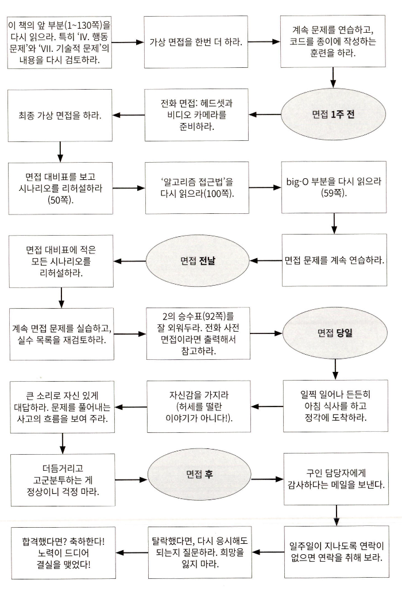

# Coding Interview

## Chapter 01. 면접과정

### 면접간 문제 풀이

- 문제를 풀어가는 사고과정을 최선을 다해 소리내어 표현해야 한다.
  - 소리 뿐 아니라 어떤 방법으로든 면접관에게 자신의 사고 과정을 전달 할 수 있어야 한다.

### 면접 평가의 지표

- 분석 능력
  - 문제를 푸는데 도움을 많이 받았는가?
  - 최적화를 얼마나 수행하는가?
  - 문제 풀이 시간이 얼마나 소요되었는가?
  - 디자인/설계시에 문제를 제대로 이해하였는가?
  - 다양한 방법에 대한 장단점을 고려하는가?
- 코딩 능력
  - 알고리즘을 적절한 코드로 표현할 수 있는가?
  - 코드는 깔끔하게 잘 구성되어 있는가?
  - 발생 가능한 에러에 대해 고려하였는가?
  - 코드 스타일은 어떤가?
- 기술적 지식 및 컴퓨터 과학 기본기
  - CS 및 관련 기술에 대한 관심과 기본기가 갖추어져 있는가?
- 경험
  - 과거에 기술적 결정을 해 본 적이 있는가?
  - 흥미롭고 도전적인 프로젝트를 경험한 적 있는가?
  - 진취성, 결단성 등 요소를 발휘한 적이 있는가?
- 컬쳐핏, 의사소통 능력
  - 성격과 가치관이 회사와 잘 맞는가?
  - 면접관과 의사소통이 원활한가?

### 면접 방식이 왜 이래야 하는가?

- 물론 현재 면접의 방식이 지원자를 완전하게 평가 할 수는 없다.
- 그러나, 위와 같은 문제에도 불구하고 이러한 방식의 면접은 필요하다.

#### 부정 오류과 긍정 오류

- 회사의 입장에서, 부정 오류보다는 긍정 오류가 더 심각하다.
- 즉, 정말 유능한 지원자를 몇 명 잃더라도, 무능한 지원자를 채용하는 것 보다는 낫다는 것이다.

#### 문제풀이는 꽤 가치 있는 능력이다

- 또한 본질적으로 어려운 문제를 풀어내는 사람이라면, 대체로 최적의 알고리즘을 개발하는 능력이 더 뛰어날 것이기 때문이다.

#### 기초적인 자료구조와 알고리즘 지식은 유용하다

- 트리, 그래프, 리스트, 정렬 등과 같은 지식은 주기적으로 이해해 둘 필요가 있다.
  - 이 요소의 존재를 알고있어야 필요한 곳에 사용할 수 있으며,
  - 존재를 알고있다면 대체로 기본적인 이해는 하고있다고 볼 수 있다.
- 또한 자료구조나 알고리즘을 안다는 것 자체가 지원자가 CS에 대해 기술적인 지식을 가지고 있던지, 스스로 공부해서 습득했다는 것을 증명하기 때문이다.

### 어떤 물제를 출제하는가

- 대다수의 회사는, '전사적 차원에서의 면접 질문' 을 가지고있지 않다.
- 대체로 면접관이 적절한 질문지를 선택한다.
- 다만, 넓은 의미에서의 '회사별 차이점'은 존재한다.
  - 어떤 회사는 알고리즘에 집중하고
  - 어떤 회사는 CS 지식에 기반한 질문을 한다.

## Chapter 02. 장막 너머

- 대체로 면접 대상자로 선별되면 아래의 절차를 밟는다
  1. 사전 면접(Screening interview)
  2. 세 번에서 여섯 번의 대면 면접
- 만약 면접 후 일주일 이상 답변이 없다면, 대체로 구인 담당자에게 연락을 해 보는 것이 좋다.

### 회사별 면접 중점

#### 각 회사별 특이사항 및 중점요소

- 마이크로소프트
  - "마이크로소프트에서 일하고 싶은 이유는?"
    - 이 질문을 통해 기술에 대한 열정 등을 알고자 한다.

- 아마존
  - 규모 확장성(Scalability) 관련 질문
  - 객체 지향 디자인(OOP)

- 구글
  - 규모 확장이 가능한 시스템(Scalable System)을 어떻게 설계하는가
  - 분석(알고리즘) 문제

- 애플
  - 면접을 진행하는 팀의 제품에 대한 적극적이고 구체적인 피드백

- 페이스북
  - 개발자의 기업가 정신
  - 빠른 시일 내에 결과를 확인 할 수 있도록 하는 자세

- 펠런티어
  - 핵심 자료구조와 알고리즘
  - 백엔드 시스템 디자인 요소

#### 회사별 중점요소를 통해 알 수 있는 것

- 면접에 다양한 전략이 있을 수 있다.
- 그러나 그중에서도 가장 기본이 되는 알고리즘과 문제 해결 능력이 다방면에서 도움이 될 수 있다.

## Chapter 03. 특별한 상황에서의 면접

### 경력자

- 경력자의 경우에도 알고리즘 문제를 물어 볼 가능성이 있음
  - 이는, 문제해결 능력은 모든 수준의 개발자에게 중요하기 때문임.
- 다만, 시스템 디자인/설계 및 이력서와 관련된 질문에 좀 더 포커스를 두게 됨.
  - 이러한 질문은 경력자의 경험에 대해 알아 볼 수 있는 질문이기에 좀 더 중요성이 부여됨.
- '가장 고치기 힘든 버그가 무엇이었나요?' 등의 질문에 인상적인 답변을 준비하자.

### 테스터 혹은 SDET(Software Design Engineer in Test)

- SDET: 실제 제품이 아닌, 테스트를 위한 코드를 작성하는 개발자.
- 준비사항
  - 테스트에 관한 질문에 대비하라: '전구를 어떻게 테스트 할 것인가?'
  - 코딩 관련 질문에 대비: 어디까지나 개발자인 이상, 코딩 능력은 필수적임.
  - 코딩 결과를 테스트하는 훈련을 해라: 테스트 코드를 작성하는 것은 코딩 능력을 향상시키는 좋은 방법임.
- 유의사항
  - 일반적으로 SDET에서 개발자로 전환하는 것은 어렵다. 그렇기에 개발자가 되는 루트 중 하나로 사용하는것은 좋지 않다.

### PM(Product Manager || Program Manager)

- 이름은 비슷하지만 회사마다 매우 다른 역할을 수행함.
- 준비사항
  - 모호성에 대한 대응: 모호한 경우에 결정하지 못하고 패닉에 빠지지 않아야 함. 어떻게든 결정하고 진행하는 모습을 보여야 함.
  - 고객에 초점을 맞추는가(태도): 고객의 입장에서 생각하고, 고객의 요구사항을 충족시키는 방법을 고민해야 함.
  - 고객에 초점을 맞추는가(기술적 능력): 고객이 사용할 제품에 대한 기술적인 이해가 있다면 더욱 좋음.
  - 다층적 의사소통: PM은 직업적 특성상 매우 많은 계층의 사람들과 협업해야 함. 따라서 유연한 의사소통 능력을 갖추어야 함.
  - 기술에 대한 열정: 자신의 일을 열정적으로 즐길 수 있는 사람이라면, 더욱 좋음.
  - 팀워크/리더십: PM은 팀을 이끌어야 하기에, 팀워크와 리더십 능력이 필수적임.

### 개발 책임자(Dev Lead)와 관리자(Dev Manager)

- 준비사항
  - 팀워크/리더십: 개발자이지만 관리직인 이상 팀을 이끌어야 하기에, 팀워크와 리더십 능력이 필수적임.
  - 우선순위: 빡빡한 데드라인 속에서 덜 중요한 부분을 어떻게 쳐낼지에 대한 기준을 갖추어야 함.
  - 소통: 윗사람, 아랫사람, 고객 등 넓은 범위의 사람들과 소통하는 능력이 필요함.
  - 책임감: 관리자로서 가장 중요한 부분은 맡은 일을 끝까지 해내는 것임. 또한, '프로젝트를 준비하는 것' 과 '프로젝트를 수행하는 것'의 균형을 잘 맞추어야 함.

### 스타트업

- 스타트업은 회사별로 지원 절차와 면접 과정이 매우 다름. 따라서 일반적인 고려 요소만 나열함

#### 지원 절차

- 구인공고 확인 이외에도, 추천이나 직접 연락을 취해보는 것도 좋음.
- 굳이 아는 사람이 아니더라도, 관심을 표하고 양해를 구하는 것 만으로도 이력서를 읽어 봐 줄 누군가를 찾을 수 있음.

#### 비자와 취업 승인

- 외국인으로서 비자가 필요하다면, 대부분의 스타트업은 취업 비자를 제공하기 어려움.
- 따라서 전문 리크루터를 찾거나, 규모가 큰 스타트업을 찾아보는 것이 나음.

### 실전성

- 스타트업의 특성상, 단순히 똑똑하고 코딩을 잘 하는 사람이 필요한 게 아니라, 여러 실제 상황에 대응 할 수 있는 사람이 필요함.
- 때로는 사업가적 자질이 요구되는 경우도 있음.
- 즉 스타트업에서 즉시 업무에 투입될 수 있는 사람을 선호함.

### 기업인수 및 인재영입

- 기업 인수나 인재영입 과정을 거쳐 채용되는 경우도 있음.
- 그러나 이 과정에서도 모두가 채용되는 경우 이외에, 면접을 거치는 경우가 있으며 이는 매우 중요함.
- 면접을 망치는 경우, 인수인계를 위해 6개월 가량의 단기 계약직으로 근무하는 경우도 있고, 바로 퇴사하는 경우도 있음.

### 면접관의 입장(에서 본 우리가 준비할 사항)

#### 여기에 있는 문제를 그대로 사용하지 말라

- 즉, 여기에 있는 문제가 그대로 나올리는 거의 없다. 비슷한 유형의 다른 문제를 많이 겪어보자.

#### 중간 이상의 어려운 문제를 출제하라

- 너무 쉬운 문제는 크게 도움되지 않는다. 중간 이상, 어려운 문제에 포커스를 하자.

#### 여러 가지 난관을 거쳐야 하는 문제를 찾으라

- 한번의 '아하'를 통해 풀리는 문제는 대체로 출제되지 않는다. 이는 지원자의 운에 의해 역량이 좌우될 가능성이 있기 때문이다.
- 여러 과정을 거쳐서 문제를 해결해야 하는 문제를 찾아보자.

#### 알기 어려운 지식이 아닌 풀기 어려운 문제를 출제하라

- 아무도 관심없고 알 수 없는 지식을 문제로 내는 경우는 없다.
- 즉, 마이너한 분야에 대한 지식을 기반으로 푸는 문제는 거의 없다.
- 따라서 잘 알려진 자료구조와 알고리즘을 위주로 공부하자.

#### 겁을 주는 문제를 피하라

- 겁을 주는 문제?
  - 수학, 확률 문제
  - 로우 레벨 지식(메모리 할당 등)
  - 시스템 디자인, 확장성
  - 영리 제품 등
- 이러한 문제가 나온다면, 대부분 수학이나 확률 등으로 푸는 문제가 아닐 가능성이 높다.
- 쫄지 말자.

#### 지원자를 긍정적으로 대하라

- 지원자도 마찬가지로, 면접관을 긍정적으로, 예의를 갖춰서 대하자.

#### 행동 질문을 철저히 하라

- 많은 지원자들이 '팀'으로서 활동해 왔기에 자신의 성취를 표현하는데에 어려움을 겪는다.
- 즉, 우리는 자신의 경험을 최대한 가감없이 구체적으로 표현해야 한다.

#### 지원자에게 조언하라

- 면접관에 대한 조언
  - 지원자가 적당한 예제를 사용하도록 조언하라.
  - 지원자가 해법을 찾기 전에 코딩을 시작하지 않고, 해법을 찾은 후에 코딩을 시작하도록 조언하라.
  - 지원자가 아무것도 하지 못한다면, 브루트 포스 등의 간단한 힌트나 해법을 제시하라.
- 지원자의 행동
  - 최대한 최적의 알고리즘을 먼저 설계한다.
  - 브루트 포스 등의 간단한 해법이 있는지 찾아본다.
  - 필요시 면접관에게 힌트를 요청해도 좋다.

#### 그들이 생각할 시간을 원한다면 생각할 시간을 주라

- 즉, 지원자가 생각할 시간이 필요하다면, 생각할 시간을 요청해라.

#### 방식을 정하라: 네 가지 면접 방식

- 새너티 테스트(Sanity check)
  - 쉬운 문제나 디자인 문제에 관한 것.
  - 최약의 지원자를 걸러내기 위한 문제.
- 수준 테스트(Quality check)
  - 좀 더 도전적인 문제.
  - 철저하게 설계되어 알고리즘, 문제풀이 능력을 테스트하는 문제.
  - 너무 쉽거나, 형편없는 문제를 출제하지 않아야 함.
- 전문가 문제(Specialist question)
  - 지원자의 전문 분야에 관한 문제.
  - 지원자의 전문 분야에 대한 지식을 테스트하는 문제.
- 프락시 지식(Proxy knowledge)
  - 지원자의 수준에서 알 법 한 문제.

## Chapter 04. 면접 전에

- 시작이 늦었더라도, 할수 있는만큼 따라잡기 위한 노력을 하자.

### 적절한 경험 쌓기

- 탄탄한 이력과 면접을 위한 기본은, 훌륭한 이력을 쌓는 것임.
- 예시
  - 큰 규모의 프로젝트 수업을 들어라.
  - 인턴 자리를 알아보자.
  - 해커톤이든 사이드든, 뭔가를 하라.
- 다른 직종에서 개발자로의 전직을 원한다면
  - 코딩을 많이 할 수 있는 업무를 하라
  - 저녁과 주말을 활용해, 개인적인 프로젝트를 진행하라
- 결론적으로, 회사는 **코딩을 할 수 있고 영리한 사람**을 뽑는다.

### 탄탄한 이력서 작성하기

- 적절한 이력서 길이: 미국에서는 경력 10년차 미만은 1페이지, 10년차 이상은 2페이지를 권장함.
  - 경우에 따라 긴 이력서는 바로 스킵당할 수 있음.
- 과거 직함을 전부 나열할 필요는 없고, 관련 이력만 나열하자.
- '무엇을', '어떻게', '결과는 어떠했나'를 중점으로 작성하자
  - 분산 캐시를 구현해서 오브젝트 렌더링 시간을 75% 줄였고, 결과적으로 로그인 시간을 10% 경감 할 수 있었다.
- 경험한 프로젝트
  - 강조할만한 프로젝트 2~4개만 기입하자.
    - 쓸모없는 프로젝트가 자리만 차지하지 않게 해라.
- 소프트웨어(툴)와 프로그래밍 언어
  - 소프트웨어는 가급적 언급하지 말자.
    - vscode를 쓸 줄 아는게 중요한가? 배우기 어려운가?
  - 프로그래밍 언어
    - 사용해본 언어를 전부 적는것은 위험하다.
    - 사용해본 언어를 적되, 언어에 대한 이해도를 적어두자.
      - JS/TS(중급), PHP(중급), Python(경험 있음)
- 오탈자를 꼭 확인하자.
- 특정 언어를 지나치게 강조하지 말자.

### 준비절차




## Chapter 05. 행동 문제

### 대비 요령

- 주로 주어지는 질문 목록 작성해보기. 3개정도의 프로젝트에 대해 아래의 질문에 답변 해 보자.
  - 가장 도전적이었던 것
  - 실수 혹은 경험담
  - 즐거웠던 것
  - 리더십
  - 팀원과의 갈등
  - 남들과 다르게 행동했던 것
- 본인의 '진짜' 단점을 언급하자.
  - 본인을 포장하기 위해 '너무 열심히 일하는 게 단점입니다.' 등의 답변은 오만해 보일 수 있다.
- 면접관에게 할 질문들
  - 순수한 질문
    - '테스터, 개발자, PM의 비율이 어떻게 되나요?'
    - '서로 어떻게 협조하나요?' 등
    - '면접관께서는 어떻게 이 회사에 오시게 되었나요?'
  - 통찰력을 보여줄 수 있는 질문
    - 'X라는 기술을 사용하고 계신데, Y 문제는 어떻게 해결하고 계신가요?'
    - '제품에 A 대신 B 기술을 사용하신 이유가 있나요? a, b, c 등의 장점이 있지만 d라는 이슈가 있어서 사용하지 않는 회사도 많다고 알고 있습니다.'
  - 열정을 보여 줄 수 있는 질문
    - '저는 규모 확장성에 흥미가 있는데, 이 회사에서 이를 배울 수 있을까요?'
    - 'X 기술을 잘은 모르지만 재미있는 해법이 될 것 같네요. 어떻게 동작하는지 설명 해 주실 수 있으실까요?'

### 기술적 프로젝트에 대한 이해

- 최소한 두세가지 이상의 프로젝트에 대해 집중적으로 깊이 알고있어야 함.
- 아래 기준이 부합하는 프로젝트라면 더욱 좋음.
  - 단순히 많이 배웠던 것을 넘어서 도전적인 요소가 있었던 프로젝트
  - 자신이 중심 역할을 수행했던 프로젝트
  - 기술적으로 깊이있는 이야기를 할 수 있는 프로젝트
- 그 외 알아두면 좋은 요소들
  - 도전적인 면
  - 일으켰던 실수
  - 기술적 결정
  - 기술의 선택과 그에 대한 실익
  - 남들과는 다르게 할 수 있었던 것
  - 이후 개선할 수 있었던 것
  - 장차 확장 방안 등

### 행동 질문에 대한 대처 요령

- 최대한 구체적으로 답하고, 오만하게 굴지 말자.
- 지나친 세부사항은 언급하지 말자.
  - 면접자는 세부사항을 정확히 모르고, 궁금하지 않을 수 있다.
  - 필요하다면 면접자가 스스로 파고 들 수 있도록, 핵심만 언급하자.
    - '가장 보편적인 사용자 행위 패턴을 검사하고 Rabin-Karp 알고리즘을 사용하여 90%정도 경우에 대해 검색시간을 O(n)에서 O(log n)으로 줄이는 알고리즘을 설계했습니다. 궁금하시다면 좀 더 자세히 말씀드리도록 하겠습니다.'
- 팀이 아닌, 자신의 성과에 대해 이야기하자.
  - '우리', '우리 팀'에 대해서만 이야기하면, 자신의 역할을 면접관에게 충분히 전달하지 못할 수 있다.
- 구조적인 답변을 내놓으라
  - 정보 우선(Nugget first)
    > '학부생들이 자기 과목을 직접 가르치도록 학교 당국을 설득했던 상황에 대해 이야기해 드리죠.  
    > 제가 다니던 학교는 처음에는...'
  - S.A.R(Situation, Action, Result)
    > 상황(S): 프로젝트에 인원 셋이 추가되었는데 한명만 유난히 성과가 적고 소극적이었다.

    > 행동(A): 그와 대화를 시도했고, 그는 자신이 코드를 작성할 자격이 없다고 생각한다는 점을 밝히고 문서작업을 희망한다고 하였다. 그런 그에게 걱정하지 말고 코드작업에 참여 할 수 있도록 직접 설계하며 겁낼 필요 없다는 점을 인지시켰다.

    > 결과(R): 그는 자신감을 되찾고 코드작업에 참여하였고, 프로젝트는 성공적으로 마무리 되었다.

- 위 접근법을 사용해, 자신의 이야기 목록을 만들어 두자.  
  | 구분 | 핵심(nugget) | 상황 | 행동 | 결과 | 말하고자 하는 것 |
  |---|---|---|---|---|---|
  | 이야기1 | 핵심 | 상황 | 1. ... <br> 2. ... <br> 3. ... | 결과 | 결론 |
  | 이야기2 | 핵심 | 상황 | 1. ... <br> 2. ... <br> 3. ... | 결과 | 결론 |

- 또한, 그 이야기를 분석해서 전달하고자 하는 부분이 제대로 전달되는지 확인하자.

### 그러니까, 당신에 대해 말해보세요

- 여러분의 이야기를 구성하는 방법
  - 기본은 시간순으로 구성하기
    - 현재 직업/상태(서두)
    - 학교
    - 졸업 후 지금까지
    - 현재 역할(자세히)
    - 업무 외에
    - 마무리
  - 취미 등은, 아래의 경우에 포함되지 않는다면 언급하지 않는 것이 좋다.
    - 굉장히 독특한 취미를 가진 경우
    - 기술적인 면이 포함된 경우
    - 긍정적인 성격적 특성을 보여주는 경우 등

## Chapter 06. big-O

### 비유하기

- 파일전송의 예제: A가 B에게 파일을 전송한다면?
  - 일반적으로는 인터넷으로 전송하는것이 가장 빠를 것임.: 100Mb/s -> 10테라 기준, 약 1.1~1.2일 정도 소요
  - 그러나 용량이 크다면(수십 테라), 데이터 저장장치를 직접 들고 비행기 등으로 운송하는 것이 더 빠를 수 있음.: 1일(용량에 상관없음. 고정)

### 시간복잡도

- 점근적 실행 시간(asymptotic running time): 입력의 크기가 무한대로 향할 때의 실행 시간
- 예시
  - 온라인 전송: O(s)
    - s: 전송할 데이터의 용량. 용량이 증가하면 시간은 선형적으로 증가함.
  - 비행기를 통한 이동: O(1)
    - 1: 비행기가 이동하는 시간. 용량이 커져도 이는 고정된 상수값임.
- 이외에도 O(log n), O(n log n), O(n^2), O(2^n) 등이 있음.
- big-Ω, big-O, big-Θ 등이 있음.
  - big-Ω: 최선의 경우
  - big-O: 최악의 경우
  - big-Θ: 평균의 경우
- 일반적으로 big-O를 사용함.
- 구체적인 예시
  - 퀵 정렬
    - 최선의 경우: O(n) -> 이미 정렬된 경우
    - 최악의 경우: O(n^2) -> 역순으로 정렬된 경우
    - 평균의 경우: O(n log n)

### 공간복잡도

- 크기가 n인 배열을 만들어야 한다면, O(n)의 공간이 필요하다.
- 크기가 n x n 크기의 2차원 배열을 만들어야 한다면, O(n^2)의 공간이 필요하다.
- 재귀 호출을 사용 시 스택 공간 또한 계산에 포함된다.
- 그러나 단순히 n번 호출했다고 해서 O(n)의 공간을 사용하는 것은 아니다.

### 상수항은 무시하라

- O(n + 1), O(2n) 등의 표기는 무의미하고, 더 정확하지도 않다.

### 지배적이지 않은 항은 무시하라

- O(n^2 + n) = O(n^2)
- big-O에서 가장 중요한 것은, '입력의 크기가 무한대로 향할 때의 실행 시간' 이다.
- 따라서 상수항이나 지배적이지 않은 항은 무시해야한다.
- 단 O(n^2 + m)과 같이, 서로 다른 입력의 크기를 가지는 경우는 무시할 수 없다.
  - m과 n의 관계를 모르는 이상 무시할 수 없다.
  


- n = 10일 때 각각의 값
  - n!: 3,628,800
  - 2^n: 1,024
  - n^2: 100
  - n log n: 33
  - n: 10
  - log n: 3

### 여러 부분으로 이루어진 알고리즘: 덧셈 vs 곱셈

- 덧셈: O(A + B)

  ```ts
  for (a of arrA) {
    print(a);
  }

  for (b of arrB) {
    print(b);
  }
  ```

- 곱셈: O(A * B)

  ```ts
  for (a of arrA) {
    for (b of arrB) {
      print(a + ',' + b);
    }
  }
  ```

### 상환 시간

- ArrayList(동적 가변크기 배열)는 일반적으로 O(1)의 시간복잡도를 가진다.
- 그러나, 배열의 크기가 커지면서 배열의 크기를 늘려야 하는 경우가 생긴다.
  - 이 경우, 2n 크기의 배열을 새로 만들고 원소 전체를 복사하는 데에 O(n)의 시간이 소요된다.
  - 하지만 이런 경우는 극히 드물다.
    - 1, 2, 4, 8, 16, 32, ... X 마다 발생하며, 이를 모두 더하면 대략 2X가 된다.
- 결과적으로 ArrayList의 삽입연산은 O(2X / X) -> O(1)의 시간복잡도를 가진다.

### log N 수행 시간

- 이진 탐색 트리의 탐색 시간은 O(log n)이다.
- 이진 탐색 트리의 높이는 log n이다.
- big-O에서는 로그의 밑을 명시하지 않는다. 이는 고려 할 필요가 없기 때문이다.

### 재귀적으로 수행 시간 구하기

```ts
function f(n: number): number {
  if (n <= 1) {
    return 1;
  }
  return f(n-1) + f(n-1);
}
```

- 이 경우는 O(2^n)이다.
- 이는 재귀 호출이 두 번 일어나기 때문에 이진 트리의 노드 수와 같다.

### 예제 및 연습문제

예제 1.
  
  ```ts
  function foo(arr: number[]) {
    let sum = 0;
    let product = 1;
    for (let i = 0; i < arr.length; i++) {
      sum += arr[i];
    }
    for (let i = 0; i < arr.length; i++) {
      product *= arr[i];
    }
    console.log(sum + ',' + product);
  }
  ```

- 답: O(n)

예제 2.

  ```ts
  function printPairs(arr: number[]) {
    for (let i = 0; i < arr.length; i++) {
      for (let j = 0; j < arr.length; j++) {
        console.log(arr[i] + ',' + arr[j]);
      }
    }
  }
  ```

- 답: O(n^2)

예제 3.

  ```ts
  function printUnorderedPairs(arr: number[]) {
    for (let i = 0; i < arr.length; i++) {
      for (let j = i + 1; j < arr.length; j++) {
        console.log(arr[i] + ',' + arr[j]);
      }
    }
  }
  ```

- 답: O(n^2) -> 2번보다 약 절반의 케이스만 다루지만, O(n^2 / 2) = O(n^2)이다.

예제 4.

  ```ts
  function printUnorderedPairs(arrA: number[], arrB: number[]) {
    for (let i = 0; i < arrA.length; i++) {
      for (let j = 0; j < arrB.length; j++) {
        if (arrA[i] < arrB[j]) {
          console.log(arrA[i] + ',' + arrB[j]);
        }
      }
    }
  }
  ```

- 답: O(ab) -> a, b의 관계를 알 수 없으므로, a, b를 모두 고려해야 한다.

예제 5.

  ```ts
  function printUnorderedPairs(arrA: number[], arrB: number[]) {
    for (let i = 0; i < arrA.length; i++) {
      for (let j = 0; j < arrB.length; j++) {
        for (let k = 0; k < 100000; k++) {
          console.log(arrA[i] + ',' + arrB[j]);
        }
      }
    }
  }
  ```

- 답: O(ab) -> 100000은 상수이므로 무시한다.

예제 6.

  ```ts
  function reverse(arr: number[]) {
    for (let i = 0; i < arr.length / 2; i++) {
      const other = arr.length - i - 1;
      const temp = arr[i];
      arr[i] = arr[other];
      arr[other] = temp;
    }
  }
  ```

- 답: O(n) -> 배열의 절반만큼만 반복하지만, O(n / 2) = O(n)이다.

예제 7. 다음 중 O(n)과 같은 것은 무엇인가?

- 보기
  1. O(n + p), p < n/2
  2. O(2n)
  3. O(n + log n)
  4. O(n + m)

- 답: 1, 2, 3 -> 4는 m과 n의 관계를 알 수 없으므로, 무시할 수 없다.

예제 8. 여러 개의 문자열로 구성된 배열이 주어졌을 때, 각각의 문자열을 정렬하고 전체 배열을 다시 정렬하는 알고리즘이 있다. 이 알고리즘의 시간복잡도는 무엇인가?

- 대표적인 오답
  - 각각의 문자열을 정렬하는데 O(n * n log n)이 소요된다.
  - 전체 배열을 다시 정렬하는데 O(n log n)이 소요된다.
  - 따라서 결과적으로 O(n^2 log n + n log n) = O(n^2 log n)이 소요된다.
- 오답인 이유
  - 두 가지 정렬은 서로 다른 입력을 가지므로, 두 가지 정렬을 합쳐서 계산할 수 없다.
  - 정렬에 필요한 비교에 소요되는 시간 복잡도를 고려하지 않았다.
- 답: O(a * s(log a + log s)) -> a: 배열의 크기, s: 문자열의 길이
  - 각각의 문자열을 정렬하는데 O(s log s)가 소요된다.
  - 전체 배열을 다시 정렬하는데 O(s * a log a)가 소요된다.
    - 각 배열의 문자열을 비교하는 시간 O(s) * 비교 횟수 O(a log a) = O(s * a log a)가 소요된다.

예제 9.

  ```ts
  function sum(node: Node) {
    if (node === null) {
      return 0;
    }
    return sum(node.left) + node.value + sum(node.right);
  }
  ```

- 답: O(n) -> 이진 트리의 노드 수와 같다.
  - 두 가지 해법
    - 코드가 무엇을 의미하는가?
      - 이 코드는 트리의 각 노드를 방문한 뒤, 각 노드에서 상수 시간이 소요되는 연산을 수행한다.
      - 즉, 트리의 노드 수와 같은 시간이 소요된다.
    - 재귀호출 패턴분석
      - 재귀함수의 수행시간은 일반적으로 O(분기 ^ 깊이)이다.
      - 그렇다면 이 함수의 경우는 O(2 ^ 깊이)가 될 것이다.
      - 그런데 이 트리는 균형 이진 트리이므로, 깊이는 대략 log n이다.
      - 따라서 O(2 ^ log n) = O(n)이 된다.

예제 10.

  ```ts
  function isPrime(n: number): boolean {
    for (let x = 2; x * x <= n; x++) {
      if (n % x === 0) {
        return false;
      }
    }
    return true;
  }
  ```

- 답: O(n ^ 1/2)

예제 11.

  ```ts
  function factorial(n: number): number {
    if (n < 0) {
      return -1;
    } else if (n === 0) {
      return 1;
    } else {
      return n * factorial(n - 1);
    }
  }
  ```

- 답: O(n) -> 단순히 n번 재귀호출을 수행하므로, O(n)이다.

예제 12.

  ```ts
  function permutations(str: string) {
    permutation(str, '');
  }
  
  function permutation(str: string, prefix: string) {
    if (str.length === 0) {
      console.log(prefix);
    } else {
      for (let i = 0; i < str.length; i++) {
        const rem = str.substring(0, i) + str.substring(i + 1);
        permutation(rem, prefix + str.charAt(i));
      }
    }
  }
  ```

- 답: O(n^2 * n!)
  - 순열이 완성되는 시점에 permutation 함수가 호출되는 횟수 = n!
  - 순열이 완성되기 전까지 permutation 함수가 호출되는 횟수 = n * n! 미만
    - 말단 노드의 수는 n!개, 트리의 높이는 n이므로, 말단 노드의 수는 n * n! 미만이다.
  - 각 함수 호출을 처리하는 데에 걸리는 시간 = O(n)
  - 총 수행시간 = O(n * n!) = O(n^2 * n!)

예제 13.

  ```ts
  function fib(n: number): number {
    return fib(n-1) + fib(n-2);
  }
  ```

- 답: O(2^n), O(1.6^n)
  - 재귀호출 패턴(O(분기 ^ 깊이))을 사용하면, O(2^n)이 된다.
  - 그러나 일부 말단이 단말 노드이므로 O(1.6^n)이 된다.

예제 14.

  ```ts
  function allFib(n: number) {
    for (let i = 0; i < n; i++) {
      console.log(i + ': ' + fib(i));
    }
  }

  function fib(n: number): number {
    if (n <= 0) return 0;
    else if (n === 1) return 1;
    return fib(n-1) + fib(n-2);
  }
  ```

- 오답: O(n * 2^n)
  - fib 함수의 호출 횟수는 O(2^n)이다.
  - 그러나 각 호출은 O(n)의 시간이 소요된다.
  - 따라서 총 수행시간은 O(n * 2^n)이 될 것이다.
    => n이 매 호출마다 변화되는 점을 무시한 결과
- 답: O(2^n)
  - fib(1) -> 2^1번 호출
  - fib(2) -> 2^2번 호출
  - fib(3) -> 2^3번 호출
  - ...
  - 합계는 2^1 + 2^2 + 2^3 + ... + 2^n = 2^(n+1)
  - 따라서 총 수행시간은 O(2^n)이 된다.

예제 15.

  ```ts
  function allFib(n: number) {
    const memo = new Array(n + 1).fill(-1);
    for (let i = 0; i < n; i++) {
      console.log(i + ': ' + fib(i, memo));
    }
  }

  function fib(n: number, memo: number[]): number {
    if (n <= 0) return 0;
    else if (n === 1) return 1;
    else if (memo[n] > 0) return memo[n];
    memo[n] = fib(n-1, memo) + fib(n-2, memo);
    return memo[n];
  }
  ```

- 답: O(n)
  - fib 함수의 호출 횟수는 O(n)이다.
  - 각 호출은 memo에서 값을 가져와 더하는, 상수 시간이 소요되는 연산을 수행한다.
  - 따라서 총 수행시간은 O(n)이 된다.

예제 16.

  ```ts
  function powersOf2(n: number): number {
    if (n < 1) {
      return 0;
    } else if (n === 1) {
      console.log(1);
      return 1;
    } else {
      const prev = powersOf2(Math.floor(n / 2));
      const curr = prev * 2;
      console.log(curr);
      return curr;
    }
  }
  ```

- 답: O(log n)
  - powersOf2 함수의 호출 횟수는 O(log n)이다.
  - 각 호출은 상수 시간이 소요되는 연산을 수행한다.
  - 따라서 총 수행시간은 O(log n)이 된다.
