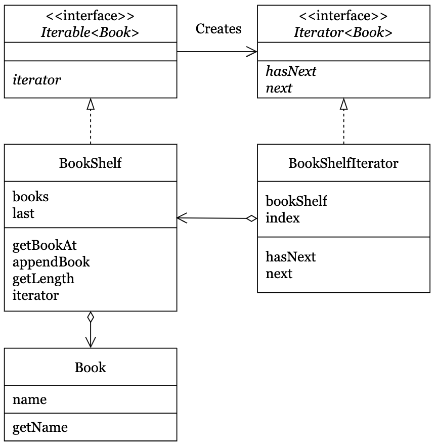

# JAVA로 배우는 디자인 패턴 입문

## Chapter01 디자인 패턴에 익숙해지다

### Part01 Iterator - 처리를 반복한다

- 예제 프로그램의 클래스 다이어그램
    

- 코드

    ```ts
    export interface Iterable<E> {
        public abstract iterator<E>: Iterator<E>;
    }

    export interface Iterator<E> {
        public abstract hasNext(): boolean;
        public abstract next(): E;
    }

    export class Book {
        constructor(private name: string) {}

        public getName(): string {
            return this.name;
        }
    }

    export class BookShelf implements Iterable<Book> {
        constructor(
            private books: Book[] = [];
            private last: number = 0;
        ) {}

        public getBookAt(index: number): Book {
            return this.books[index];
        }

        public appendBook(book: Book): void {
            this.books[this.last] = book;
            this.last++;
        }

        public getLength(): number {
            return this.last;
        }

        public iterator(): Iterator<Book> {
            return new BookShelfIterator(this);
        }
    }

    export class BookShelfIterator implements Iterator<Book> {
        constructor(private bookShelf: BookShelf) {
            this.index = 0;
        }

        public hasNext(): boolean {
            if (this.index < this.bookShelf.getLength()) {
                return true;
            } else {
                return false;
            }
        }

        public next(): Book {
            if (!this.hasNext()) {
                throw new Error('No such element');
            }
            const book = this.bookShelf.getBookAt(this.index);
            this.index++;
            return book;
        }
    }
    ```

### Part02 Adapter - 사이에 끼워 재사용한다

## Chapter02 하위 클래스에 맡기다

### Part03 Template Method - 하위 클래스에서 구체적으로 처리한다

### Part04 Factory Method - 하위 클래스에서 인스턴스를 만든다