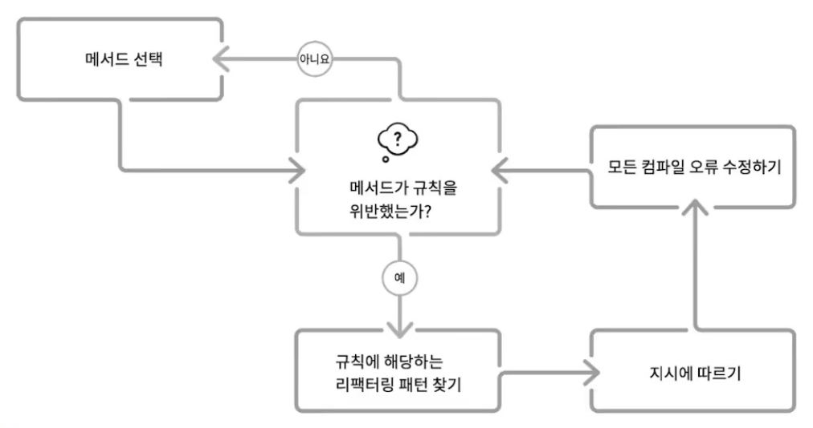

# Five Lines of Code

## 01장 리팩터링하기

- 높은 품질의 코드가 가지는 장점
  - 유지관리 비용을 절감한다.
  - 오류를 줄인다.
  - 개발자의 만족도를 향상시킨다.
- 높은 품질의 코드를 만드는 방법: 리팩터링
- 그럼에도 사람들은 리팩토링을 잘 하지 않는다.
  - 코드 스멜을 찾아내거나, 단위 테스트를 가지고 리팩터링을 하는 것은 **어렵다**.
- 리팩터링을 위한 일반적인 요건
  - 스킬
    - 어떤 코드가 문제가 될 수 있고, 이를 개선 할 수 있는지 알아야 한다. (코드 스멜)
      - 이는 습득하기 어려운 스킬이다.
  - 문화
    - 리팩터링에 들이는 시간을 용인하고, 권장하는 문화가 필요하다.
    - 일반적으로 레드-그린-리팩터링 사이클을 따른다.
      - 하지만 이 케이스는 레거시 시스템에 대한 리팩터링에 적합하지 않다.
  - 도구
    - 우리의 작업이 안전하다는것을 보장할 무언가가 필요하다.
    - 일반적으로 **자동화된 테스트**를 사용한다.

### 1.1 리팩터링이란 무엇인가?

- 리팩터링의 가장 간단한 정의
  - 기능을 변경하지 않고 코드를 변경하는 것
- 리팩터링의 목적
  - 좋은 코드를 만들기 위함.
    - 좋은 코드란?
      - 의도한 대로 동작하고
      - 사람이 읽기 쉬우며
      - 유지보수가 용이한 코드

- 예제

  ```ts
  // before
  return pow(base, exp / 2) * pow(base, exp / 2);

  // after
  let result = pow(base, exp / 2);
  return result * result;
  ```

### 1.2 스킬: 무엇을 리팩터링할 것인가?

- 앞서 다루었듯, 코드스멜을 찾아내는것은 어렵다.
- 따라서 이 책에서는 정형화된, 쉽게 인식하고 적용 할 수 있는 규칙을 제시하고자 함.

#### 1.2.1 코드 스멜의 예

> 함수는 한 가지 작업을 수행해야 한다.

- 굉장히 유명한 지침이지만, 판단이 어렵다.
- 아래의 예시는 과연 하나의 작업을 수행하는가?

```ts
let result = pow(base, exp / 2);
return result * result;
```

  - 이 코드는 나누고, 제곱한 뒤, 곱하는 세 가지 작업을 수행하는 것인가?
  - 아니면 결과적으로 하나의 값을 얻고, 상태를 변화시키지 않으므로 한가지 작업인가?

#### 1.2.2 규칙의 예

> 다섯 줄 제한

- 이 규칙은, 자전거의 보조바퀴와 같다. 도움을 줄 수 있지만 필수는 아니고, 방해가 될 수도 있다.
  - 항상 지켜야 하는것은 아니다.
  - 그러나 적용한다면, 코드의 품질을 높이는 데에 도움이 될 수 있다.
  - 하지만 반대로 이 규칙을 지키지 않는다고 해서 나쁜 코드를 작성하는 것은 아니다.

### 1.3 문화: 리팩터링은 언제 할까?

> 리팩터링은 샤워 하는 것과 같습니다. - 켄트 벡

- 리팩터링은 일상적인 활동이어야 한다.
- 따라서 일반적인 '레드-그린-리팩터' 사이클을 좀 더 개선한 방법을 권장한다.
- 레거시 환경에서의 리팩터링을 위한 6단계 절차
  1. 탐색(Explore): 일반적으로 어떤 기능이 정말로 오래 활용될지 알 수 없다. 따라서 우선은 신속하게 구현하고 니즈를 파악하는 것이 우선이다.
  2. 명세화(Specify): 필요한 기능을 알게되면 이를 구체적으로 명세한다. 최적의 경우는 이것이 테스트 케이스가 된다.
  3. 구현(Implement): 명세화된 기능을 구현한다.
  4. 테스트(Test): 코드가 2단계에서 명세화된대로 동작하는지 확인한다.
  5. 리팩터링(Refactor): 코드를 다른 사람(미래의 자신을 포함)에게 전달하기 전에, 작업이 용이한 코드로 변경한다.
  6. 전달(Deliver): PR, Push 등을 통해 코드를 전달한다.

- 위 절차에서 5. 리팩터링 단계를 확대하면 아래와 같다.
  - 

#### 1.3.1 레거시 시스템에서의 리팩터링

> 우선 변경하기 쉽게 만든 후 변경하라. - 켄트 벡

- 마치 요리를 하기 전, 식재료를 준비하는 것과 같다.

#### 1.3.2 언제 리팩터링을 하지 말아야 할까?

- 리팩터링은 굉장히 비싼 작업이다.
- 따라서, 리팩터링이 불필요한 세 가지 경우가 있다.
  1. 일회성 코드(스파이크)
  2. 폐기되기 직전, 유지보수 모드인 코드
  3. 임베디드 시스템이나 물리엔진 등 '엄격한 성능 요구사항'이 있는 코드

### 1.4 도구: (안전한) 리팩터링 방법

- 안전한 리팩터링을 위해 의존하는 도구들
  - (이 책에서 다루는)레시피처럼 상세하고 단계별로 구조화된 리팩토링 패턴
  - 버전관리(Git)
  - 컴파일러
  - (+) IDE

### 1.5 시작하는 데 필요한 도구

#### 1.5.1 프로그래밍 언어: 타입스크립트

- TS 로 선택한 이유는, 완전한 비 객체지향 설계부터 객체지향 설계까지 다양한 패러다임을 지원하기 때문임.
- 또한 다른 언어를 사용하는 대부분의 개발자들이 쉽게 읽고 이해 할 수 있음.

#### 1.5.2 편집기: 비주얼 스튜디오 코드

#### 1.5.3 버전 관리: Git

### 1.6 핵심 예제: 2D 퍼즐 게임

- `git clone https://github.com/wikibook/five-lines`

#### 1.6.1 연습만이 살 길이다: 두 번째 코드베이스

- `git clone https://github.com/wikibook/bomb-guy`

### 1.7 실제 환경에서 소프트웨어에 대한 주의사항 요약

## 02장 리팩터링 깊게 들여다보기

### 2.1 가독성 및 유지보수성 향상

- 리팩터링의 목적
  - 코드가 하는 일을 변경하지 않는다.
  - 더 나은 코드를 만든다.

#### 2.1.1 코드 개선

##### 가독성

- 코드가 하는 일을 파악하기 쉽다.
- 아래와 같은 다양한 방법으로 얻을 수 있다.
  - 코딩 컨벤션 사용
  - 주석 작성
  - 변수명, 메서드명, 클래스 및 파일명
  - 공백, 줄바꿈 사용 등
- 예시

  ```ts
  // before - 읽기 힘든 코드의 예
  function checkValue(str: boolean) { //   <-- 불명확한 메서드명
    // 값 체크  <-- 동어 반복적인 주석

    if (str !== false) //   <-- 이중부정
      // 반환   <-- 동어 반복적인 주석
      return true;
    
    else; // 그렇지 않으면    <-- 놓치기 쉬운 세미콜론(;), 불필요한 주석
      return str; //    <-- 오해의 소지가 있는 들여쓰기
  }

  // after - 가독성을 개선한 동일한 코드
  function isTrue(bool: boolean) {
    if (bool) {
      return true;
    } else {
      return false;
    }
  }
  ```

##### 유지보수성

- 버그수정이나 기능추가시에는 일부 기능변경이 불가피하다.
- 이때, 기능변경을 위한 새 코드를 어디에 추가할지 '후보 위치'를 찾는 과정이 필요하다.
- 유지보수성은 이러한 후보 위치가 얼마나 많은지에 따라 결정된다.
  - 명확한 코드일수록 후보 위치가 적고, 그만큼 더 적은 코드를 확인해야 한다.

- 일부 취약한 시스템은 약간의 변동에도 전체 시스템에 문제가 생길 수 있다.
- 일반적으로 이러한 취약성(fragile)은 전역 상태에서 기인한다.
  - 특히 명시적으로 확인하지는 않으나 당연하게 여겨지는 '불변속성'에서 문제가 발생하는 경우가 많다.
  - 이러한 불변속성과 이로인해 영향받는 코드는 서로 가까이 위치해야 한다.

#### 2.1.2 코드가 하는 일을 바꾸지 않고 유지보수하기

- 코드를 일종의 블랙박스로 취급한다.
- 외부의 동작을 유지한 채 내부의 로직을 변경 할 수 있다.
  - 그러나 이 과정에서 성능적 손실이 발생할 수 있다.
  - 왜냐하면, 대부분의 서비스에서 성능보다는 가독성과 유지보수성의 가치가 더 크기 때문이다.
    - 종종 성능이 중요한 경우에는 이와 별도로 최적화 작업을 진행해야 한다.

### 2.2 속도, 유연성 및 안정성 확보

- 리팩터링에는 다양한 수준과 방법이 있다.
  - 추상적이고 전역전인 수준부터, 구체적이고 지역적인 수준까지
  - 전반적인 아키텍처부터 함수 내 변수의 이름까지

#### 2.2.1 상속보다는 컴포지션 사용

- 상속은 GOF 시절부터 권장되지 않았음.
  - 상속을 사용하면 범위가 제한되지 않는 불변속성이 퍼지게 된다.
- 이들은 상속보다는 컴포지션을 사용하라고 권장하였음.
- 예시

  ```ts
  // Inheritance
  interface Bird {
    hasBeak(): boolean;
    canFly(): boolean;
  }

  class CommonBird implements Bird {
    hasBeak() { return true; }
    canFly() { return true; }
  }
  class Penguin extends CommonBird {
    canFly() { return false; }
  }

  // Composition
  interface Bird {
    hasBeak(): boolean;
    canFly(): boolean;
  }

  class CommonBird implements Bird {
    hasBeak() { return true; }
    canFly() { return true; }
  }
  class Penguin implements Bird {
    private bird = new CommonBird();
    hasBeak() { return this.bird.hasBeak(); } // <-- Composition
    canFly() { return false; }
  }
  ```

  - 만약 위 코드에서 `Bird` 인터페이스와 `CommonBird` 클래스에 canSwim() 메서드를 추가한다면, 상속을 사용한 코드는 모든 `Bird` 클래스에 자동으로 영향을 미칠 것이다.
  - 반면, 컴포지션을 사용한 코드는 컴파일 에러가 발생할 것이고 개발자는 이를 눈치챌 수 있을 것이다.

##### 유연성

- 위와 같이 상속이 아닌 컴포지션으로 만들어진 시스템을 사용하면, 유연성이 향상된다.

#### 2.2.2 수정이 아니라 추가로 코드를 변경

- 앞서 다룬 컴포지션의 또다른 강력한점은, 언제든 새로운 기능을 추가할 수 있다는 것이다.
  - 기능 추가시에 기존 코드를 변경하는 것이 아닌 새로운 코드를 추가하는 방식으로 작업이 가능하다.
- 이러한 속성을 개방-폐쇄 원칙(OCP)이라고 한다.

##### 프로그래밍 속도

- 기능추가나 버그수정시 가장 신경써야 할 부분은 바로 '어느 것도 손상시키지 않는 것'이다.
  - 물론 이러한 작업이 계속되면 코드베이스가 점점 늘어나고 복잡해질 수 있다.
  - 따라서 수시로 어떤 코드가 사용되고, 어떤 코드가 사용되지 않는지 확인하는 것이 중요하다.

##### 안정성

- 추가에 의한 변경방식은 기존 코드의 작동을 보장한다.
  - 이는 코드의 안정성을 높이는데 도움이 된다.

### 2.3 리팩터링과 일상 업무

- 리팩터링은 프로그래머의 일상이 되어야 한다.
- 리팩터링하지 않는 습관은 다른 프로그래머의 시간을 빼앗는 것과 같다.
  - 계속해서 기술 부채(technical debt)를 늘리는 것이다.
- 작업 절치
  - `(리팩터링) - 작업 - (리팩터링)`

> 항상 여러분이 왔을 때보다 더 좋게 만들어 놓고 떠나세요. - 보이스카우트 규칙

#### 2.3.1 학습 방법으로서의 리팩터링

- 리팩터링을 새로운 팀원들의 적응이나 새로운 프로젝드에 대한 이해를 돕는데에 활용 할 수 있다.

### 2.4 소프트웨어 분야에서 '도메인'정의하기

- 도메인은 소프트웨어와 대응되는 실제 세계의 구성요소를 의미한다.
- 개발자는 해당 도메인의 전문가와 긴밀하게 협업해야 한다.

### 요약

- 리팩터링은 기능을 수정하지 않고 의도를 명확하하며 불변속성의 범위를 제한하는 것임.
- 상속보다는 컴포지션을 통해, OCP를 준수하고 유연성을 높일 수 있다.
- 리팩터링을 일상 업무의 일부로 포함하여 기술 부채를 줄여야 한다.
- 리팩터링을 통해 코드를 다루는 새로운 관점을 배울 수 있다.

## 03장 긴 코드 조각내기

- 주요 내용
  - 다섯 줄 제한으로 지나치게 긴 메서드 식별하기
  - 세부 사항을 보지않고 작업하기
  - 메서드 추출로 긴 메서드 분리하기
  - EITHER CALL OR PASS로 추상화 수준 맞추기
  - if문은 함수의 시작에만 배치하기

- 코드가 혼란스러워지는 주요 원인들
  - 하나의 메서드가 여러 가지 다른 일을 수행하는 경우
  - 낮은 수준의 원시연산(배열 조작, 산술 연산 등)을 사용하는 경우
  - 변수명과 메서드명, 주석 등 사람이 읽을 수 있는 설명이 부족한 경우

### 3.1 첫 번째 규칙: 왜 다섯 줄인가?

#### 3.1.1 규칙: 다섯 줄 제한

- 메서드는 대괄호를 제외하고 5줄 이상이 되어서는 안된다.
  - 할당, 메서드 호출, 리턴 외에도 if, for, while등을 모두 포함한다.
- 사실, 제한이 몇 줄 이냐 보다 제한이 있다는 것 자체가 중요하다.

- 예시

  ```ts
  function containsEven(arr: number[][]) {
    for (let x = 0; x < arr.length; x++) {
      for (let y = 0; y < arr[x].length; y++) {
        if (arr[x][y] % 2 === 0) {
          return true;
        }
      }
    }
    return false;
  }

  function minimum(arr: number[][]) {
    let result = Number.POSITIVE_INFINITY;
    for (let x = 0; x < arr.length; x++) {
      for (let y = 0; y < arr[x].length; y++) {
        result = Math.min(result, arr[x][y]);
      }
    }
    return result;
  }
  ```

##### 스멜

- 메서드가 길다는 것 자체가 스멜임.
- 물론 예외가 있겠지만, 대체로 하나의 작업은 다섯 줄 이내로 끝낼 수 있음.

##### 의도

- 메서드의 이름을 통해서도 의도를 전달 할 수 있음.
- 따라서 20줄짜리 하나의 메서드보다, 잘 명명된 5줄짜리 4개의 메서드로 나누는 것이 의도 전달이 더 명확함.
- 이는 마치 5줄마다 주석을 남기는 것과도 같음. 동시에 주석과는 다르게 코드가 항상 최신 상태로 유지될 확률이 높음.

##### 참조

- 클린코드: 하나의 메서드는 한 가지 일만 해야 한다.
- 리팩토링: 긴 메서드 자체가 스멜이다.

### 3.2 함수 분해를 위한 리팩터링 패턴 소개

- 메서드를 잘게 나눔으로서 메서드명을 통해 주석의 효과를 얻을 수 있음.
- 주석의 경우 오용이나 남용되는 경우가 많음
  - 주석을 남겼다는 사실을 잊고 최신화하지 않는 경우
  - 주석을 지저분한 코드에 대한 일종의 탈취제로 사용하는 경우

- 예시

  ```ts
  // before
  function draw() {
    let canvas = document.getElementById('GameCanvas') as HTMLCanvasElement;
    let g = canvas.getContext('2d');

    g.clearRect(0, 0, canvas.width, canvas.height);

    // 맵 그리기
    for (let y = 0; map.length; y++) {
      for (let x = 0; map[y].length; x++) {
        if (map[y][x] === Tile.FLUX)
          g.fillStyle = '#ccffcc';
        else if (map[y][x] === Tile.UNBREAKABLE)
          g.fillStyle = '#999999';
        else if (map[y][x] === Tile.STONE || map[y][x] === Tile.FALLING_STONE)
          g.fillStyle = '#0000cc';
        else if (map[y][x] === Tile.BOX || map[y][x] === Tile.FALLING_BOX)
          g.fillStyle = '#8b4513';
        else if (map[y][x] === Tile.KEY1 || map[y][x] === Tile.LOCK1)
          g.fillStyle = '#ffcc00';
        else if (map[y][x] === Tile.KEY2 || map[y][x] === Tile.LOCK2)
          g.fillStyle = '#00ccff';
        
        if (map[y][x] !== Tile.AIR && map[y][x] !== Tile.PLAYER)
          g.fillRect(x * TILE_SIZE, y * TILE_SIZE, TILE_SIZE, TILE_SIZE);
      }
    }

    // 플레이어 그리기
    g.fillStyle = '#ff0000';
    g.fillRect(playerx * TILE_SIZE, playery * TILE_SIZE, TILE_SIZE, TILE_SIZE);
  }
  ```

  ```ts
  // after
  function draw() {
    let canvas = document.getElementById('GameCanvas') as HTMLCanvasElement;
    let g = canvas.getContext('2d');

    g.clearRect(0, 0, canvas.width, canvas.height);

    drawMap(g);
    drawPlayer(g);
  }

  function drawMap(g: CanvasRenderingContext2D) {
    for (let y = 0; map.length; y++) {
      for (let x = 0; map[y].length; x++) {
        if (map[y][x] === Tile.FLUX)
          g.fillStyle = '#ccffcc';
        else if (map[y][x] === Tile.UNBREAKABLE)
          g.fillStyle = '#999999';
        else if (map[y][x] === Tile.STONE || map[y][x] === Tile.FALLING_STONE)
          g.fillStyle = '#0000cc';
        else if (map[y][x] === Tile.BOX || map[y][x] === Tile.FALLING_BOX)
          g.fillStyle = '#8b4513';
        else if (map[y][x] === Tile.KEY1 || map[y][x] === Tile.LOCK1)
          g.fillStyle = '#ffcc00';
        else if (map[y][x] === Tile.KEY2 || map[y][x] === Tile.LOCK2)
          g.fillStyle = '#00ccff';
        
        if (map[y][x] !== Tile.AIR && map[y][x] !== Tile.PLAYER)
          g.fillRect(x * TILE_SIZE, y * TILE_SIZE, TILE_SIZE, TILE_SIZE);
      }
    }
  }

  function drawPlayer(g: CanvasRenderingContext2D) {
    g.fillStyle = '#ff0000';
    g.fillRect(playerx * TILE_SIZE, playery * TILE_SIZE, TILE_SIZE, TILE_SIZE);
  }
  ```

#### 3.2.1 리팩터링 패턴: 메서드 추출

- 방금 위에서 진행한 방식이 가장 간단한 메서드 추출 방식이다.
- 많은 IDE에서 지원하는 기능이며, 이를 통해 메서드 추출을 쉽게 할 수 있다.
- 대부분의 경우 아래에서 위로 올라가며 추출하는 것이 좋다.
  - if문 등에서 일부 분기만 return을 가진 경우 등이 메서드 추출에 방해가 될 수 있기 때문이다.

- 절차
  1. 추출할 주변을 적당한 공백이나 주석으로 구분하여 잘라낸다.
  2. 주석의 역할을 할 수 있는 적당한 이름으로 빈 메서드를 만든다.
  3. 잘라낸 코드의 맨 위에서 메서드를 호출한다.
  4. 코드의 모든 줄을 선택해서 새로운 메서드의 본문으로 삽입한다.
  5. 매개변수가 필요한 경우 적당한 매개변수를 추가한다.
  6. 매개변수를 리턴하는 경우 `return value;` 등을 추가하고, 호출부에서 이를 변수로 할당한다.
  7. 인자나 변수의 조정이 필요한 경우 이를 수행한다.
  8. 사용하지 않는 빈 줄과 주석, 코드를 정리한다.

- 예제

  ```ts
  // before
  function minimum(arr: number[][]) {
    let result = Number.POSITIVE_INFINITY;
    for (let x = 0; x < arr.length; x++)
      for (let y = 0; y < arr[x].length; y++)

        if (result > arr[x][y]) //
          result = arr[x][y];   // <-- 추출할 코드

    return result;
  }
  ```

  ```ts
  // phase 1/3
  function minimum(arr: number[][]) {
    let result = Number.POSITIVE_INFINITY;
    for (let x = 0; x < arr.length; x++)
      for (let y = 0; y < arr[x].length; y++)

        min(); // <-- 새로운 메서드 호출

    return result;
  }

  // 새로운 메서드 선언
  function min() {
    if (result > arr[x][y])
      result = arr[x][y];
  }
  ```

  ```ts
  // phase 2/3
  function minimum(arr: number[][]) {
    let result = Number.POSITIVE_INFINITY;
    for (let x = 0; x < arr.length; x++)
      for (let y = 0; y < arr[x].length; y++)

        result = min(); // <-- 변수 할당

    return result;
  }

  function min() {
    if (result > arr[x][y])
      result = arr[x][y];
    return result; // <-- 리턴 추가
  }
  ```

  ```ts
  // phase 3/3
  function minimum(arr: number[][]) {
    let result = Number.POSITIVE_INFINITY;
    for (let x = 0; x < arr.length; x++)
      for (let y = 0; y < arr[x].length; y++)
        result = min(result, arr, x, y); // <-- 인자 추가
    return result;
  }

  function min(
    result: number,
    arr: number[][],
    x: number,
    y: number
  ) {
    if (result > arr[x][y])
      result = arr[x][y];
    return result;
  }
  ```

### 3.3 추상화 수준을 맞추기 위한 함수 분해

#### 3.3.1 규칙: 호출 또는 전달, 한 가지만 할 것

### 3.4 좋은 함수 이름의 속성

### 3.5 너무 많은 일을 하는 함수 분리하기

#### 3.5.1 규칙: if문은 함수의 시작에만 배치

#### 3.5.2 규칙 적용

### 요약

## 04장 타입 코드 처리하기

## 05장 유사한 코드 융합하기

## 06장 데이터 보호

## 07장 컴파일러와의 협업

## 08장 주석 자제하기

## 09장 코드 삭제의 미학

## 10장 코드 추가에 대한 두려움 떨쳐내기

## 11장 코드 구조 따르기

## 12장 최적화 및 일반화 회피

## 13장 나쁜 코드를 식별 가능하게 만들기

## 14장 마무리

## 부록A 실습을 위한 도구 설치
