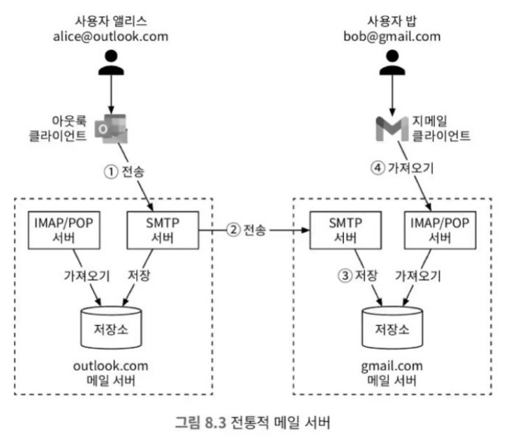
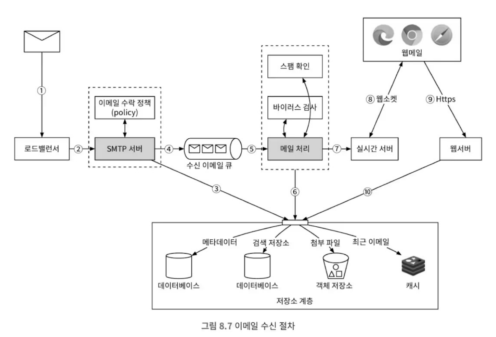

# 가상 면접 사례로 배우는 대규모 시스템 설계 기초2


## 1장 근접성 서비스

- 근접성 서비스(proximity service)는 네이버, 카카오, 구글 지도 등의 사용자의 위치를 기반으로 주변 정보를 제공하는 서비스를 말한다.

### 1단계: 문제 이해 및 설계 범위 확정

#### 기능 요구사항 vs 비기능 요구사항

- 특정 프로덕션 앱의 모든 기능을 주어진 시간 내에 설계하지 못하는 것은 당연하다.

- 어느 수준까지, 어느 부분을 중점적으로 설계할지에 대한 범위를 좁혀나가야 한다.
  - 이 과정이 오히려 면접자로 하여금 걱정을 덜어주고, 힌트를 얻을 수 있는 기회라고 생각한다.
  - 오히려 면접 과정에서, 실무에서보다 더 많은 정보를 제공받을 수 있다고 생각한다.

- 결과적으로 아래의 두 가지 산물이 나와야 한다.
  - 기능 요구사항
  - 비기능 요구사항

- 기능 요구사항은 면접관이 `명백하게 필요로`하는 기능을 말한다.
  - 여기서는 아래의 세 가지를 예시로 들었다.
    - 사용자의 위경도와 검색 반경에 매치외는 주변 정보를 제공한다.
    - 사업 소유주가 사업장의 정보를 등록/수정할 수 있으며, 실시간으로 반영될 필요는 없다.
    - 고객은 사업장의 상세 정보를 조회 할 수 있어야 한다.

- 비기능 요구사항은 면접관이 `명시하지는 않았지만, 달성이 필요한`기능을 말한다.
  - 여기서는 아래의 세 가지를 추정할 수 있다.
    - 낮은 지연시간
    - 개인정보보호
    - 고가용성

#### 개략적 규모 추정

- 사용자 수(DAU): 1억(100,000,000)명
- 사업장 수: 2억(200,000,000)개
- 개략적 QPS 추산
  - **앞으로 1일(86400s)는 100,000s로 가정한다.**
  - 1일 1명의 사용자가 5회의 조회를 한다고 가정한다.
  - 결과적으로 QPS는 5,000(5억 / 100,000)이 된다.

### 2단계: 개략적 설계안 제시 및 동의 구하기

- 이 과정에서는 큰 틀에서의 설계안을 제시하고, 면접관의 동의를 구한다.

- 주요 주제는 아래와 같다.
  - API 설계
  - 개략적 설계
  - 주변 사업장 검색 알고리즘
  - 데이터 모델링

#### API 설계

##### 위치 기반 검색 API

> GET /v1/search/nearby

##### 사업장 관련 API

> GET /v1/businesses/:id  
> POST /v1/businesses  
> PUT /v1/businesses/:id  
> DELETE /v1/businesses/:id  

#### 개략적 설계

- 위치 기반 서비스(LBS)와 사업장 서비스로 구분한다.
- 이는 읽기 위주의 서비스와 쓰기/수정/삭제가 필요한 서비스로 구분하기 위함이다.

#### 주변 사업장 검색 알고리즘

> Q? 사실 엄밀히 말하면 이 방법들 모두 공통적으로 '반경'을 기준으로 검색하는 것이 아닌 것으로 보인다.

##### 방안 1: 2차원 검색

```SQL
SELECT business_id, latitude, longitude
FROM businesses
WHERE (latitude BETWEEN {:my_lat} - radius AND {:my_lat} + radius)
  AND (longitude BETWEEN {:my_lon} - radius AND {:my_lon} + radius)
```

- 이 방법은 크게 두 가지 단점이 있다.
  - 위도, 경도별 데이터를 구한 뒤 이를 교집합 하는 과정에서 성능이 떨어질 수 있다.
  - 인덱스를 사용할 수 없다.

##### 방안 2: 균등 격자

- 위도, 경도를 균등한 격자로 나누어서, 해당 격자에 속하는 사업장을 찾는 방법이다.
- 하지만 하나의 격자 안에 존재하는 사업장이 균일하지 않다.

##### 방안 3: 지오해시

- 지오해시는 위도, 경도를 문자열로 변환하는 방법이다.
  - 최대 12단계 정밀도를 가지며, 12단계는 3cm 정도의 정밀도를 가진다.
  - 필요한 반경에 따라 적당한 정밀도를 선택할 수 있다.

- 하지만 이 방법에도 단점이 있다.
  - 인접한 격자를 찾는 방법이 복잡하다.
    - 일반적인 경우 지오해시는 공통 접두어로 인접지역을 찾을 수 있다.
    - 하지만 특정 지점에서는 이 방법이 적용되지 않기 때문이다.
  - 공통 접두어를 갖지만 다른 지역에 속하는 경우가 있다.
    - 이로인해 주변 격자의 데이터도 함께 가져와야 한다.

##### 방안 4: 쿼드트리

- 쿼드트리는 2차원 공간을 재귀적으로 4개의 사분면으로 나누는 방법이다.
- 내부 노드와 말단 노드의 구분과, 식별자를 사용하는 방법이 중요하다.
  - 처리하는 시간과 저장을 위한 공간이 생각보다 크지 않다는 것만 확인 하면 된다.

> Q? 좌상/우하단 좌표를 32바이트로 저장할거라면, 지오해시처럼 비트로 구분하는게 낫지 않을까?
> 좌표를 기준으로 분할한다면, 공간도 공간이지만 탐색도 어렵고 부동소수점 오차도 생길텐데?

- 사업장이 업데이트되고, 트리를 리밸런싱하는 방법이 골치아플 것 같다.


##### 방안 5: 구글 S2

- 힐베르트 곡선을 사용한 방법이다.
- 이를통해 2차원 공간을 1차원으로 색인 할 수 있다.
  - 특징으로는, 2차원으로 인접한 지역이 1차원으로도 인접하다. 또한 역도 성립한다.
- 지오펜스(geofence)와 같은 기능을 구현할 때 유용하다.
  - 이를 통해 보다 풍부한 기능을 제공 할 수 있다.

##### +@ 지오해시 vs 쿼드트리

- 둘 다 사용해보지는 않았지만, 지오해시가 더 간단하고 편리한 솔루션이 아닌가 싶다.
- 쿼드트리는 유지보수 소요가 매우 커 보인다. 그렇다고 몹시 뛰어난 기능을 제공하는 것은 아닌것 같다.

> Q? 쿼드트리가 뛰어난 점이 뭐가 있나? 특정 구간에 밀집도가 매우 큰 경우?
> 하지만 cm단위까지 정밀도를 요구하는 서비스가 아니라면, 지오해시가 더 효율적이지 않을까?

### 3단계: 상세 설계

- 주요 관심사
  - 데이터베이스 규모 확장
  - 지리정보 색인의 규모 확장
  - 캐시
  - 지역 및 가용성 구현
  - 시간대, 사업장 유형에 따른 검색
  - 최종 아키텍처 다이어그램

#### 데이터베이스 규모 확장

- 위치 기반 서비스를 이전 단계에서 LBS 서비스와 사업장 서비스, 두 개로 나누었다.
  - LBS 서비스
  - 사업장 서비스

- 즉, 각 위치정보(지오해시)에 속한 사업장 ID를 관리할 방법을 마련해야 한다.
  - 방안 1: 각 지오해시에 모든 사업장 ID를 JSON 형태로 저장한다.
    - 관리가 어렵고, 확장도 어렵다.
  - 방안 2: 지오해시와 사업장 ID 각각을 묶어 하나의 row로 저장한다.

#### 지리정보 색인의 규모 확장

- 앞서 2억건의 지리정보라고 할지라도, 하나의 서버에 저장할 수 있는 수준임을 확인했다.
  - 따라서 샤딩 등의 분할 저장은 필수적이지 않다.
  - 또한 지오해시는 샤딩 로직을 어플리케이션에서 직접 구현해야 하기 때문에, 까다롭다.

> Q? 지오해시의 샤딩 로직은 왜 까다롭다고 하는것일까?  
>  
> A. 앞서 다루었듯, 연속적이지 않은 구간이 있다는 면에서도 까다롭고, 각 구획별로 데이터의 양이 균일하지 않기에 핫스팟 문제가 발생할 수 있다.

- 결과적으로 데이터베이스를 다중화 하는것으로 충분하다.

#### 캐시

- 캐싱에서 가장 중요한 질문은 '정말 필요한가?'이다.
  - 캐싱은 복잡도를 높이고, 유지보수를 매우 어렵게 만든다.

- 캐싱을 사용함에 있어서 중요한 또다른 요건은 명확한 캐싱키를 정의하는 것이다.
  - 사용자의 위/경도가 가장 먼저 떠오르지만, 아래와 같은 문제가 있다.
    - 사용자의 위치는 정확하지 않다: 위경도는 소수점 6자리 이하까지도 표기되며, 움직이지 않아도 수시로 변화한다.
  - 지오해시나 쿼드트리의 결과를 캐싱키로 사용하는 것이 더 나을 수 있다.

> Q? 또 다른 캐싱키는 어떤게 있을까?  
>   
> A. 위경도를 특정 단위로 반올림하여 사용하는 것도 좋을 것 같다.  
> 명확한 비즈니스 목표가 있는것이 아니라면, 지오해시나 쿼드트리의 결과 자체를 캐싱키로 사용하는 것이 가장 효과적일 것으로 보인다.

- 캐시할 데이터의 유형은 다음과 같다.
  - 지오해시(혹은 다른 캐싱키)에 속한 사업장 ID
  - 사업장 ID에 대한 상세 정보

#### 지역 및 가용성 구현

- 지역 및 가용성을 고려할 때 기대할 수 있는 이점은 다음과 같다.
  - 실사용자와 시스템 사이의 물리적 거리를 줄일 수 있다.
    - 이는 지연시간을 줄이고, 사용자 경험을 향상시킨다.
  - 트래픽을 주변 인구에 따라 분산시킬 수 있다.
    - 이를 통해 보다 융통성 있는 서비스를 제공할 수 있다.
  - 지역별로 다른 규제와 법률을 준수할 수 있다.

> ❗ 지역별로 다른 규제와 법률을 준수하기 위한 분리라는 관점은 생각해보지 못했던 부분이다.

#### 시간대, 사업장 유형에 따른 검색

- 한 번 지역별로 쿼리된 결과는 상당히 소규모이다.
- 따라서 시간대, 혹은 사업장 유형별 검색 등의 기능은 쿼리 후 필터링하는 것으로 충분하다.

#### 최종 아키텍처 다이어그램

- 생략

### 4단계: 마무리

- 이번 장에서 다룬 주요한 개념들은 아래와 같다.
  - 지오해시, 쿼드트리, 구글 S2 등의 지리정보 색인 방법
  - 데이터베이스 규모 확장
  - 지역 및 가용성 구현

## 2장 주변 친구

- 어떻게 보면 1장의 근접성 서비스와 굉장히 유사해 보일 수 있음.
  - 그러나 큰 차이가 하나 있는데, 사업장의 위치 정보는 정적이지만 친구의 위치 정보는 동적이라는 것이다.

### 1단계: 문제 이해 및 설계 범위 확정

- '주변'의 정의 - 얼마나 가까워야 '주변'인가?: 5mile
- 예상되는 사용자의 수: 1억명
- 사용자의 이동 이력을 저장할 수 있어야 함. 저장 기간은 미정
- 특정 시간이상 비활성 상태이면 주변 친구 목록에서 사라져야 함.
- 복잡도 조정을 위해 사생활 및 데이터보호 등 고려사항은 생략한다.

#### 기능 요구사항

- 사용자는 모바일 앱에서 주변 친구를 확인 할 수 있어야 한다.
  - 친구와의 거리, 마지막으로 업데이트된 시간이 표기되어야 한다.
- 이 친구 목록은 실시간성으로, 일정 주기마다 업데이트 되어야 한다.

#### 비기능 요구사항

- 낮은 지연시간
- 안정성: 전반적으로 안정적이어야 한다. 다만 몇개의 데이터 손실은 허용된다.
- 결과적 일관성(eventual consistency)
  - 사용자의 위치 정보는 실시간으로 업데이트 되지 않아도 된다. 
  - 복제본 간의 동기화는 일정 시간 이후에 이루어져도 된다.

> Q? 일관성의 종류에도 여러가지가 있는 것으로 기억한다. 어떤게 있나?
>
> A. 일관성의 종류는 크게 세가지로 나뉜다.
> - 강한 일관성(Strong Consistency): 모든 복제본이 동일한 시점의 데이터를 가지는 것
> - 약한 일관성(Weak Consistency): 모든 복제본이 동일한 시점의 데이터를 가지지 않아도 되는 것
> - 결과적 일관성(Eventual Consistency): 시스템에 더 이상의 업데이트가 없을 때, 결과적으로 모든 복제본이 최종적으로 동일한 데이터를 가지게 되는 것을 보장하는 일관성 모델

#### 개략적 규모 추정

- 시스템의 규모 결정과, 주요 과제를 결정하기 위해 제약사항과 가정을 설정한다.
  - 주변친구의 범위는 5마일로, 약 8km이다.
  - 친구 정보는 30초마다 갱신되어야 한다.
    - 사람들은 걸어다닌다고 가정한다.
    - 걷는 속도로는 30초 미만에서는 의미있는 이동이 없기 때문이다.
- 평균적으로 이 기능을 활용하는 유저는 매일 1억명으로 가정한다. (DAU 1억명)
- 동시 접속 사용자는 이 10%인 1천만명으로 가정한다.
- 한명의 사용자는 평균적으로 400명의 친구를 가지고 있다고 가정한다.
  - 편의상 친구로 등록된 모든 사용자는 주변 친구 서비스를 사용한다고 가정한다.
- 이에 따르면 QPS는 약 10,000,000 / 30s = 333,333(약 33만)이다.

> ⚠️ 이 `QPS`는 오직 주변친구를 조회하는 요청만을 의미한다.

### 2단계: 개략적 설계안 제시 및 동의 구하기

- 주변친구 기능에서는 실시간성이 중요하므로 데이터 구조보다는 이 통신방법을 먼저 결정하는 것이 중요하다.
  - 이는 일반적인 서비스와는 다르게 단순한 HTTP 프로토콜을 사용할 수 없을 수 있기 때문이다.

> ❗ 이 책에서는 일종의 '판단 템플릿'을 제시하지만 위 사례와 같이, 때로는 기능의 특성에 따른 융통성있는 판단이 필요함을 보여준다.

### 개략적 설계안

- P2P 통신을 사용: 이론상으로 가능하기야 하겠지만, 일반적인 서비스 구현에는 어려움이 많다.

- 공통 백엔드 서버 사용
  - 이는 일반적인 서비스 구현에 가장 적합한 방법이다.
  - 하지만 1천만명이 각각 4백명에게 정보를 30초마다 갱신 요청한다면 이는 일반적으로 처리하기 어렵다.

- Pub/Sub 시스템과 웹소켓을 활용한 설계
  - Pub/Sub 시스템을 통해 위치 정보 업데이트를 효율적으로 처리
    - 사용자의 위치 변경을 이벤트로 발행
    - 친구들이 해당 이벤트를 구독하여 실시간 업데이트 수신
  - 웹소켓 서버를 통해 클라이언트와의 실시간 통신 구현
  - RESTful API 서버는 친구 관리 등 기타 기능을 제공
  - TTL을 사용한 위치정보 캐시로, 일정시간 이상 비활성인 사용자를 제거
  - 위치 이동 이력은 별도의 DB에 저장

### 3단계: 상세 설계

- 이전 단계에서 구상한 간단한 구성은 현재 요구사항과 같은 대규모 서비스에서는 문제가 생길 수 있다.

#### 중요 구성요소별 규모 확장성

##### API 서버

- RESTful API 서버는 무상태성이고, 확장 방법이 널리 알려져 있으므로 생략한다.

##### 웹소켓 서버

- 웹소켓 서버는 상태를 가진다.
- 따라서 클러스터를 축소하는 경우에는 각별한 주의가 필요하다.
  - 서버를 제거하기 전에 기존 연결을 이첩하거나 종료해야 한다.

##### 클라이언트 초기화

- 모바일 클라이언트 기동시 웹소켓 서버와 지속성 연결을 맺어야 한다.
- 이 연결을 통해 위치정보를 서버에 전달하고, 친구의 위치정보를 받아야 한다.

##### 사용자 데이터베이스

- 사용자 데이터는 사용자의 ID를 기준으로 샤딩한다면 충분하다.

##### 위치 정보 캐시

- 위치정보의 캐싱에는 수 GB정도면 충분하다. 따라서 메모리는 문제가 되지 않는다.
- 하지만 이전에 계산했듯, QPS가 매우 높으므로(약 33만), CPU가 문제가 될 수 있다.
- 다행히도 이러한 위치정보는 샤딩이 가능하다.

##### 레디스 Pub/Sub 서버

- 레디스의 Pub/Sub은 높은 성능과 저렴한 비용으로 구현할 수 있다.
- 미리 정리하자면, 레디스 서버에는 대체로 메모리보다는 CPU가 더 큰 문제가 된다.

###### 메모리 사용량

- 모든 사용자에게 채널을 하나씩 할당해야한다.
  - 10억 사용자의 10%이므로 1억개의 채널이 필요하다.
  - 한 사용자의 친구 중 약 100명만 활성화 되어있다고 가정한다.
  - 구독자 한명을 위해 해시테이블과 연결리스트에 약 20바이트가 필요하다고 가정한다.
- 결과적으로 1억 * 100 * 20 = 200GB가 필요하다.

###### CPU 사용량

- 앞서 계산했듯, Pub/Sub 서버의 QPS는 약 1400만에 달한다.
  - 보수적으로, 레디스 서버 하나당 처리 가능한 QPS를 10만으로 가정한다.
  - 따라서 1400만 / 10만 = 140개의 레디스 서버가 필요하다.

##### 레디스 Pub/Sub 서버의 규모 확장시 고려사항

- Pub/Sub 서버는 채널에 대한 상태정보를 가진다.
  - 즉, 채널 이동시 이를 모든 구독자에게 전파해야 한다.
  - 이 과정에서 발생하는 부하가 상당하므로, 클러스터는 이를 최소화하기 위해 필요한 스펙보다 좀 더 여유있게 프로비저닝을 하는 것이 좋다.

- 게다가 해시 링을 사용해 샤딩되어있는 경우, 스케일 조정시 해시 링이 갱신된다면, 이로인해 엄청난 부하가 발생할 수 있다.
  - 따라서 이 작업은 부하가 가장 적은 시간대에 이루어져야 할 것이다.

- 다행인 점은, 특정 서버의 이상으로 단순 교체시에는 문제가 없다는 점이다.
  - 이 경우에는 해당 서버의 채널만 다른 서버로 이전하면 된다.

##### 친구 추가/삭제

- 이전의 통신 웹소켓을 통해, 친구 추가/삭제 이벤트도 핸들링 할 수 있다.
- 이와 같은 방식의 콜백을 사용해서 위치정보 전송 허가/취소하는 경우도 처리 할 수 있다.

#### 친구가 많은 사용자

- 이러한 구조에서, 친구가 많은 사용자로 인해 시스템 성능에 문제가 발생 할 수 있는지에 대한 고려가 필요하다.
- 여기서는 최대로 맺을 수 있는 친구의 수에 제한이 있다고 가정한다. 따라서 수백만의 친구나 팔로워를 가진 사용자는 없다고 가정한다.
- 이러한 가정 하에, 특정 '친구가 많은 사용자'들이 서비스에 미치는 영향은 그리 크지 않을 것으로 보인다.

#### 주변의 임의 사용자

- 요구사항에는 존재하지 않았지만, 친구가 아니더라도 위치정보 이용 동의한 유저들의 정보를 제공하는 경우를 생각해보자.
- 이 경우, 기존 설계안에 최소한의 변경만을 방법을 고려하자면, 지오해시에 대한 구독 채널을 두면 된다.

#### 레디스 Pub/Sub 외의 대안

- 이에 대한 해결책으로 얼랭(Erlang)의 사용을 제안한다.
  - 얼랭은 매우 저렴한 비용으로도 높은 가용성과 확장성을 제공한다.
  - 또한 레디스와 같은 메시지 브로커를 사용하지 않아도 된다.

### 4단계: 마무리

- 이번 장에서 다룬 핵심 컴포넌트를 요약하면 아래와 같다.
  - 웹소켓: 클라이언트와 서버 사이의 실시간 통신
  - 레디스: 위치 데이터의 빠른 읽기/쓰기, TTL
  - 레디스 Pub/Sub: 사용자의 위치 정보 변경 내역에 대한 실시간 알림

## 3장 구글 맵

### 1단계: 문제 이해 및 설계 범위 확정

- 이번 과제에서 집중해야 할 포인트는 아래와 같다.
  - 사용자 수는 10억 DAU
  - 주요 기능은 위치 갱신, 경로안내, ETA, 지도 표시에 초점을 맞춘다.
  - 도로 데이터는 수 TB 수준
  - 교통 상황 고려
  - 다양한 교통수단 지원

#### 기능 요구사항

- 사용자 위치 갱신
- 경로 안내 서비스(ETA 포함)
- 지도 표시

#### 비기능 요구사항

- 정확도: 잘못된 경로를 안내하면 안된다.
- 부드러운 경로 표시
- 데이터와 배터리의 소모 고려
- 기타 기본적인 가용성 및 규모 확장성 등

#### 지도 101 - 기본기

##### 측위 시스템

- 현실은 3D 공간인 지구를 2D 지도로 표현해야 한다.
  - (참고)수많은 도법들이 존재하지만, 구글은 웹 메르카토르 도법을 사용중이다.

###### 지오코딩(Geocoding)

- 주소를 위경도로 변환하는 것을 말한다.
- 이를 반대로 변환하는 것을 역 지오코딩(Reverse Geocoding)이라고 한다.

###### 지오 해싱(Geo Hashing)

- 이전 장에서 다루었다.

###### 지도 타일

- 지도를 표현하는 가장 기본적인 방법이다.
- 큰 지역의 지도를 하나의 이미지로 표현하는 것은 불가능하다.
  - 따라서 지도를 여러 개의 타일로 나누어 표현한다.
  - 확대 수준 별로 타일을 미리 준비해두어야 한다.
  - 이를 통해 사용자가 필요한 부분만을 로드할 수 있다.

###### 경로 안내 알고리즘

- 경로 탐색은 대부분 다익스트라(Dijkstra) 알고리즘이나 A* 알고리즘을 사용한다.
- 여기서는 상세한 내용은 생략한다.
- 경로 안내는 엣지와 노드로 이루어진 그래프를 사용한 그래프 구조를 사용한다.

###### 경로 타일

- 이때도 지도 타일과 비슷하게 경로 타일을 구성하여 사용한다.
  - 이를 통해 탐색할 경로의 양이 줄어들고 탐색 성능도 좋아진다.
  - 경로 타일은 인접 타일과의 참조도 함께 가지고있다. 이를 통해 보다 큰 규모의 경로를 표현할 수 있다.

###### 계층적 경로 타일

- 경로 안내가 사용 할 수 있을만큼 효율적으로 동작하기 위해서는 적당한 수준의 구체성을 가진 도로 데이터가 필요하다.
  - 이게 너무 과도하면 데이터의 양이 매우 커지고, 너무 적으면 경로 안내의 정확도가 떨어진다.

#### 개략적 규모 추정

##### 저장소 사용량

- 저장해야 할 데이터는 크게 세 종류로 구분 할 수 있다.
  - 세계지도(지도 타일)
  - 메타데이터(지오해싱 등)
  - 도로 정보(경로 타일)

> Q? 메타데이터를 굳이 따로 명시한 이유가 있을까?  
> 저자가 메타데이터를 강조하고 싶었던걸까?

###### 세계지도

- 앞서 다루었듯, 지도 타일은 확대수준별로 한벌씩 준비해두어야 한다.
  - 이를 위해 21단계의 확대수준을 가지고 있다고 가정한다.
    - 21단계에서 타일의 수는 약 4.4조 개에 달한다.
  - 각 타일을 256x256 픽셀의 PNG로 가정한다면, 각 타일은 약 100kb이다.
  - 따라서 전체 지도 데이터는 약 4.4조 * 100kb = 440PB이다.
- 다행히 지구 표면의 90%는 사람이 살지 않으므로, 보수적으로 고려해서 약 44~88PB로 계산한다.
  - 이를 어림하여 약 50PB로 계산한다.
- 결과적으로, 모든 지도 타일을 저장하기 위해서는 약 100PB가량의 저장소가 필요하다.

###### 서버 대역폭

- 우선 필요한 요청들이 무엇인지 정리해보자.
  - 경로 안내 요청
  - 위치 갱신 요청

- 각 사용자는 하루에 이 기능을 약 5분 사용한다고 가정하자.
- DAU가 10억이었으므로, 하루에 약 50억 분이다.
- Naive한 접근으로, 매 초 위치정보를 갱신한다고 가정하면, 하루에 3000억 번 위치정보 갱신이 이루어진다.
  - 이는, 하루를 10만초로 가정하더라도 약 300만 QPS이다.
- 이를 최대한 줄이기 위해, 변경내역을 클라이언트에 기록해두고 15초마다 전송한다고 가정하자.
  - 이 경우에는 약 20만 QPS가 된다.
- 최대 QPS는 평균의 약 5배로 가정한다면, 약 1백만 QPS가 된다.

> ❗ 많이 뭉뚱그려졌지만, 나름대로 합리적(으로 납득 가능한) 추론 과정이 있다.  
> 하루 5분 사용이나, 최대 QPS가 평균의 5배라는 가정 등이 그렇다.

### 2단계: 개략적 설계안 제시 및 동의 구하기

#### 개략적 설계안

- 위치 서비스
- 경로 안내 서비스
- 지도 표시

#### 위치 서비스

- 앞서 다루었듯, 위치 정보를 매번 서버에 전송하는 것은 비효율적이다.
- 따라서 변경 내역을 클라이언트에 저장해두고 일정 주기마다 전송하는 방법을 사용한다.
- 사용할 프로토콜은 HTTP를 keep-alive로 사용한다.

#### 경로 안내 서비스

- 경로는 무조건 최단 시간 경로일 필요는 없으나, 정확도는 보장되어야 한다.

#### 지도 표시

- 클라이언트가 요청하는 지도들은 정적이므로, 지오해시 등으로 캐싱하여 사용한다.
- CDN을 사용하면 성능과 확장성, POP(Point of Presence)도 보장할 수 있다.

- 또하나 고려할 사항은 위경도를 바탕으로 지오해싱된 데이터를 요청하는 것이다.
  - 이 작업은 클라이언트에서도 충분히 가능하다.
  - 하지만, 추후 확장성이나 유연성을 고려하면 서버에서 처리하는 것이 좋다.
    - 오래된 기기나 여러 가지 플랫폼에서의 호환성을 고려해야 하기 때문이다.
  - 이를 위해, 위경도와 확대수준을 바탕으로 타일 URL을 생성하는 서비스를 별도로 구성하는 방법도 좋다.
    - 복잡도는 다소 높아지겠지만, 유연성과 확장성을 보장할 수 있다.

### 3단계: 상세 설계

#### 데이터 모델

- 주요 데이터
  - 경로 안내 타일 데이터
  - 사용자 위치 데이터
  - 지오코딩 데이터
  - 지도 타일 데이터

##### 경로 안내 타일 데이터

- 외부 사업자나 기관이 제공한 데이터를 활용한다.
  - 매우 큰 데이터이고,
  - 끊임없이 개선되고 변경된다.
  - 그래프 구조로 가공되지 않은 외부 데이터이므로 별도의 가공이 필요하다.
- 따라서 '경로 안내 타일 처리 서비스'와 같은 별도의 파이프라인을 구성하는 것이 좋다.

- 그래프로 가공된 데이터는 일반적으로 메모리에 인접 리스트(Adjacency List)로 저장한다.
  - 하지만 이 경우에는 메모리에 저장하기 어려울정도로 큰 데이터이므로, 다른 저장매체를 사용해야 한다.
- 이를 위해 S3와 같은 객체 저장소를 사용할 수 있다.
  - 인접 리스트를 직렬화하여 binary로 저장하고, 필요할 때마다 읽어들이는 방식이다.
  - 저장시에는 지오해시와 확대 수준을 키로 사용한다.

##### 사용자 위치 데이터

- 사용자 위치는 수시로 업데이트 되므로, 쓰기연산 성능과 확장성을 고려해야 한다.
- 카산드라 등이 적합하다.

##### 지오코딩 데이터

- 지오코딩 데이터는 주소를 위경도로 변환하는데 사용된다.
- 레디스와 같은 빠른 읽기 연산을 제공하는 키-값 저장소가 적합하다.
  - 쓰기/수정 연산이 거의 발생하지 않는다.

##### 지도 타일 데이터

- 사용자가 특정 지역의 지도를 요청하면, 도로 정보와 지도를 조합한 이미지를 만들어야한다.
- 이미지는 자주 호출되고, 변경사항이 적으므로 캐싱을 적극적으로 사용해야 한다.

#### 서비스

- 서비스는 크게 다음과 같이 구성된다.
  - 위치 서비스
  - 지도 표시 서비스
  - 경로 안내 서비스

##### 위치 서비스

- 사용자의 위치정보가 이용되는 방식에 초점을 두어야 한다.
- 초당 백만 건의 업데이트가 발생하므로, 쓰기연산이 빠른 데이터베이스를 사용해야 한다.
  - 키-값 저장소나 열 중심 데이터베이스(Column-Oriented Database)가 적합하다.
- 또한, 시간에 따라 계속 변화하며, 이전 데이터는 가치가 떨어진다.
  - 따라서 일관성 보다는 가용성을 우선시하는 것이 좋다.
- 이러한 이유로, 카산드라가 적합하다.

> ❗ CAP 정리
> - 일관성(Consistency): 모든 노드가 동일한 데이터를 가지는 것
> - 가용성(Availability): 모든 요청에 대해 응답을 보장하는 것
> - 분할 내성(Partition Tolerance): 네트워크 분할이 발생해도 시스템이 정상적으로 동작하는 것
>
> CAP 정리는 세가지 중 두가지만 선택할 수 있음을 증명한 이론이다.

- 데이터의 키로는 사용자 아이디와 시간을 사용한다.(user_id, timestamp)
  - 사용자 아이디: 파티션 키(Partition Key), 시간: 클러스터링 키(Clustering Key)

> ❗ 파티션 키와 클러스터링 키
> - 파티션 키: 데이터를 분산 저장하기 위한 키
> - 클러스터링 키: 파티션 내에서 데이터를 정렬하기 위한 키

##### 지도 표시 서비스

- 지도 표시 최적화를 위해 벡터 이미지를 사용하는 방안도 고려해볼 수 있다.

##### 경로 안내 서비스

- 경로 안내 서비스는 아래와 같은 주요 컴포넌트로 구성할 수 있다.
  - 지오코딩 서비스
  - 경로 계획 서비스
  - 최단 경로 서비스
  - 예상 도착 시간 서비스
  - 순위 결정 서비스
  - 중요 정보 갱신 서비스
  - 적응형 ETA와 경로 변경

###### 지오코딩 서비스

- 주소를 위경도로 변환하는 서비스가 필요하다.
  - 구글 지오코딩 API의 요청/응답 예시: `https://maps.googleapis.com/maps/api/geocode/json?address=1600+Amphitheatre+Parkway,+Mountain+View,+CA`

###### 경로 계획 서비스

- 현재 교통 상황과 도로 정보를 바탕으로 최적화된 경로를 제안하는 서비스이다.

###### 최단 경로 서비스

- 출발지와 목적지의 위경도를 받아 최단 경로를 계산하는 서비스이다.
- 이때 교통이나 도로 정보는 고려하지 않는다.
- 이로인해 대부분 정적인 데이터를 사용한다.
  - 따라서 캐싱을 적극적으로 사용할 수 있다.
  - 다만, 같은 위경도에 대해서도 확대수준에 따라 다른 경로가 나올 수 있으므로, 캐싱 전략을 잘 세워야 한다.

- 대부분 저장된 경로 안내 타일에 대해 A* 알고리즘을 사용한다.

> ❗ A* 알고리즘
>
> - 다익스트라 알고리즘을 기반으로 한 경로 탐색 알고리즘
> - 다익스트라 알고리즘은 모든 노드를 탐색하지만, A* 알고리즘은 목적지에 가까운 노드만 탐색한다.
> - 이를 위해 휴리스틱 함수(현재 노드에서 목적지까지의 거리를 추정하는 함수)를 사용한다.
> - 이를 통해, 다익스트라 알고리즘보다 빠르게 최단 경로를 찾을 수 있다.
> - 하지만, 휴리스틱 함수가 잘못된 경우 최단 경로를 보장하지 않는다.

###### 예상 도착 시간 서비스

- 현재 교통 상황을 고려하여 예상 도착 시간을 계산하는 서비스이다.
- 또한, 현재로부터 10분, 20분 후의 교통 상황도 예측해야 정확한 서비스가 가능하다.

###### 순위 결정 서비스

- 여러 경로 중 최적의 경로를 선택하는 서비스이다.
- 사용자가 정의한 필터링도 포함한다.
  - 유료 도로 제외, 고속도로 제외 등이 있다.

###### 중요 정보 갱신 서비스

- 도로 정보가 빠르게 변하기 때문에, 이를 실시간으로 반영하는 서비스가 필요하다.
  - 사고로 인한 도로 폐쇄, 공사로 인한 도로 폐쇄 등이 있다.
- 그 외 실시간 교통상황 등의 정보도 이러한 서비스를 통해 반영된다.

###### 적응형 ETA와 경로 변경

- 현재 설계에서는 적응형 ETA와 안내중 경로변경은 고려하지 않았다.
- 이를 위해서는 두가지 문제를 해결해야 한다.
  - 첫째로 현재 경로 안내를 받는중인 사용자를 식별해야한다.
  - 둘째로, 이러한 사용자 중 실시간 교통정보로 인해 경로를 변경해야 하는 사용자를 효과적으로 탐색해야 한다.

##### 전송 프로토콜

- 경로 안내 중 경로 변경이 필요한 경우, 이를 클라이언트에 전달해야 한다.
- 사용 가능한 후보는 아래와 같다.
  - 모바일 푸시: 메시지 크기가 매우 제한적이다.
  - 롱 폴링: 서버에 지속적으로 요청을 보내는 방식으로, 서버에 큰 부하를 줄 수 있다.
  - SSE(Server-Sent Events): 클라이언트에게 서버로부터 이벤트를 전송하는 방식이다.
  - 웹소켓
    - 서버에 부담이 적고, 양방향 통신이 가능하다.
    - 경로 안내 중 양방향 통신이 필요할 수 있으므로 웹소켓이 적합하다.

### 4단계: 마무리

- 이번 장에서 다룬 핵심 컴포넌트를 요약하면 아래와 같다.
  - 위치 서비스
  - 지도 표시 서비스
  - 경로 안내 서비스
- 추후 확장 과제로는, 경유지 추가 등이 있다.

## 4장 분산 메시지 큐

- 다양한 서비스에서 메시지 큐를 통해 아래와 같은 이점을 얻을 수 있다.
  - 결합도 완화(decoupling): 컴포넌트 사이의 강결합을 끊을 수 있다.
  - 규모 확장성: 생산자(Producer)와 소비자(Consumer)를 분리하여 규모를 확장할 수 있다.
  - 가용성 개선: 특정 컴포넌트에 장애가 발생해도 다른 컴포넌트에 영향을 미치지 않는다.
  - 성능 개선: 비동기 방식으로 처리할 수 있어, 서로가 서로를 기다리지 않아도 된다.
- 대표적인 분산 메시지 큐
  - Kafka
  - RocketMQ
  - RabbitMQ
  - Pulsa
  - ActiveMQ
  - ZeroMQ

### 메시지 큐 vs 이벤트 스트리밍 플랫폼

- 엄밀히 말하자면, 카프카와 펄사는 **메시지 큐가 아니라 이벤트 스트리밍 플랫폼**이다.
  - 그러나 최근, 이 둘 사이의 경계는 흐려지고있다.

### 1단계: 문제 이해 및 설계 범위 확정

- 메시지 큐의 기본 기능은 간단하다.
  - 생산자는 메시지를 큐에 보내고, 소비자는 큐에서 메시지를 꺼내오면 된다.
- 일반적으로 이외에 여러 가지 부가 기능을 갖는다.
  - 성능 향상을 위한 여러 기능
  - 메시지 전달 방식(At Least Once, At Most Once, Exactly Once)
  - 데이터 보관기간 설정 등
  

#### 기능 요구사항

- 생산자는 메시지 큐에 메시지를 보낼 수 있어야 한다.
- 소비자는 메시지 큐를 통해 메시지를 수신할 수 있어야 한다.
- 메시지 특성
  - 크기: 수 KB 수준의 텍스트 형식
  - 보관: 2주간 보관 후 삭제 가능
  - 순서: 소비 순서 보장 필요
  - 소비: 여러 소비자가 반복적으로 소비 가능
- 전달 방식 
  - 기본: 최소 한 번 전달
  - 추가 지원: 최대 한 번, 정확히 한 번 전달
- 성능: 로그 수집 등 고대역폭 처리 지원 필요

#### 비기능 요구사항

- 높은 대역폭과 낮은 전송지연 중 하나를 선택 할 수 있는 기능
- 규모 확장성: 메시지 양이 급증해도 처리가 가능해야 한다.
- 지속성 및 내구성: 데이터는 디스크에 보관되어야 하면 여러 노드에 복제되어야 한다.

#### 전통적 메시지 큐와 다른 점

- 전통적인 메시지 큐에서는 메시지의 보관 문제를 중요하게 다루지 않는다.
  - 메시지가 소비자에게 전달되기 충분한 시간동안만 보관할 뿐, 그 이상은 보관하지 않는다.
  - 메시지의 전달 순서도 보장하지 않는다.

### 2단계: 개략적 설계안 제시 및 동의 구하기

- 생산자와 소비자는 모두 일종의 클라이언트이며, 결과적으로 메시지 큐가 일종의 서버 역할을 한다.
- 생산자는 큐에 메시지를 발행하고,
- 소비자는 큐에서 메시지를 구독한다.

#### 메시지 모델

- 일반적으로 일대일(point to point) 또는 발행-구독(publish-subscribe) 모델을 사용한다.

##### 일대일 모델

- 전통적인 메시지 큐에서 많이 사용되는 방식
- 하나의 메시지는 하나의 소비자에게만 전달된다.
- 이 모델은 메시지의 보관을 지원하지 않는다.
  - 해당 모델에서도 보관을 지원할수는 있으나, 이는 발생-구독 모델에서 좀 더 적합하다.

> Q. 일대일 모델에서 메시지의 보관을 지원은 어떻게 구현될까?
>
> - 메시지 큐에 메시지를 전달하고, 소비자가 이를 가져가기 전까지는 당연히 메시지가 보관되어야 한다.
> - 소비자가 메시지를 가져간 후에도 보관을 지원하려면 별도의 저장소가 필요하다.
>   - 이 때, 메시지의 복사 방식에도 즉시 복사/지연 복사 및 하이브리드 등 여러 방식이 있다.

##### 발행-구독 모델

- 발행-구독 모델은 토픽이라는 개념을 사용한다.
- 이를 통해 여러 소비자가 동일한 메시지를 구독할 수 있다.

###### 토픽, 파티션, 브로커

- 각 메시지는 토픽에 보관된다.
- 만약 토픽이 너무 커지면, 이를 파티션으로 나누어 관리(샤딩)한다.
  - 이처럼 파티션을 유지하는 서버를 브로커라고 한다.
  - 브로커를 활용하는 방식으로 높은 가용성과 확장성을 제공한다.

###### 소비자 그룹

- 소비자 그룹은 여러 토픽을 구독할 수 있고, 각 오프셋을 관리한다.
- 이렇게 구성된 소비자 그룹이, 파티셔닝된 토픽을 구독함으로써, 대역폭을 확장 할 수 있다.
  - 그러나 이로인해 메시지의 순서를 보장할수는 없게 된다.
- 하나의 제한사항을 통해 순서를 보장할 수 있는데, 이는 하나의 파티션에 하나의 소비자만을 할당하는 것이다.
  - 이 경우에는, 파티션의 수가 소비자의 수보다 적어야 한다.
  - 결과적으로 이는 일대일 모델에 가깝게 된다.

#### 개략적 설계안

##### 클라이언트

- 생산자: 메시지를 큐에 보내는 역할
- 소비자 그룹: 큐에서 메시지를 가져와서 소비한다.

##### 핵심 서비스 및 저장소

- 브로커
  - 파티션들을 유지한다.
  - 하나의 파티션은 특정 토픽에 대한 부분집합이다.

- 저장소
  - 데이터 저장소: 메시지를 저장한다.
  - 상태 저장소: 소비자들의 상태를 저장한다.
  - 메타데이터 저장소: 토픽 설정, 토픽 속성 등을 저장한다.

- 조정 서비스
  - 서비스 탐색: 어떤 브로커가 살아있는지 확인한다.
  - 리더 선출: 브로커들 가운데 하나의 리더를 선출하여 컨트롤러 역할을 수행한다.
    - 주키퍼나 etcd가 이 역할을 수행할 수 있다.

### 3단계: 상세 설계

- 주요 개념
  - 로테이션 디스크
  - 수정하지 않는 메시지 저장 방식
  - 일괄 처리 방식

#### 데이터 저장소

- 메시지 큐의 데이터 패턴은 아래와 같다.
  - 읽기와 쓰기가 빈번하게 발생한다.
  - 갱신/삭제 연산은 발생하지 않는다.
    - 전통적인 메시지 큐는 메시지가 적절히 소비되지 않는 경우를 제외하고 메시지를 지속 보관하지 않는다.
  - 순차적인 읽기/쓰기가 대부분이다.

##### 선택지 1: 데이터베이스

- 구현방식
  - 관계형 데이터베이스를 사용해서 토픽별 테이블을 만든다.
  - NoSQL 데이터베이스를 사용해서 토픽별 컬렉션을 만든다.
- 그러나 이와 같이 DB를 사용하는 방식은 이상적이지 않다.
  - 읽기와 쓰기 연산이 동시에, 대규모로 발생하기 때문이다.

##### 선택지 2: 쓰기 우선 로그(Write-Ahead Log)

- WAL은 쓰기만 하는(append-only) 일반 파일이다.
  - MySQL의 복구 로그(redo log)나 주키퍼의 트랜잭션 로그 등이 이에 해당한다.
- 접근 패턴이 순차적일 때 디스크는 높은 성능을 보이므로 큐에 적합하다.
- 다만 파일이 계속해서 커질 수는 없으므로, 세그먼트(segment)로 나누어 관리한다.
  - 세그먼트는 특정 크기에 도달하면 새로운 세그먼트로 교체된다.
  - 활성 세그먼트에 쓰기를 하고, 비활성 세그먼트는 읽기만 한다.
  - 오래된 비활성 세그먼트는 삭제된다.

###### 디스크 성능 관련 유의사항

- 흔히 디스크는 느리다고 생각한다.
- 하지만 이는 랜덤 읽기/쓰기에 해당한다.
- 반면, 순차적 읽기/쓰기는 빠르다.

#### 메시지 자료 구조

- 메시지 자료 구조 설계가 대역폭 달성에 중요하다.
- 생산자, 메시지 큐, 소비자 사이의 계약이다.
- 잘 설계된 메시지는 수정(복사)가 일어나지 않아 높은 대역폭을 달성할 수 있다.

##### 메시지 키

- 메시지의 키는 파티셔닝에 사용된다.
- 그러나 키가 파티션 번호인것은 아니다.
  - 이를 통해 후에 파티션이 추가/삭제되어도 메시지를 균등하게 분배 할 수 있다.
- 일반적으로 사용하는 키의 개념과는 다르다.
  - 키를 바탕으로 조회나 검색을 하지 않으며, 고유성을 보장할 필요도 없다.

##### 메시지 값

- 메시지 값은 메시지의 페이로드이다.
- 일반 텍스트일 수도 있고, 압축된 데이터일 수도 있다.

##### 메시지의 기타 필드

- 키, 값 외에도 아래와 같은 필드가 존재 할 수 있다.
  - 토픽(topic): 메시지가 속한 토픽의 이름
  - 파티션(partition): 메시지가 속한 파티션의 ID
  - 오프셋(offset): 파티션 내 메시지의 위치. 메시지는 토픽, 파티션, 오프셋을 알면 유일하게 식별 가능하다.
  - 타임스탬프(timestamp): 메시지가 생성된 시간
  - 크기(size): 메시지의 크기
  - CRC(Cyclic Redundancy Check): 메시지의 무결성을 검증하는 체크섬

#### 일괄 처리

- 생산자, 소비자, 메시지 큐에서 모두 일괄 처리를 적극적으로 사용한다.
- 이를 통해 대역폭을 향상시킬 수 있다.
  - 네트워크 통신 오버헤드를 줄일 수 있다.
  - 디스크 I/O를 줄일 수 있다.
  - 더 큰 규모의 순차쓰기/순차읽기를 가능하게 한다.
- 하지만 더 큰 일괄처리를 위해 대기하는 시간으로 인해 지연시간이 발생한다.

#### 생산자 측 작업 흐름

- 생산자가 특정 브로커에게 메시지를 보내기 위해 라우팅 계층이 필요하다.
- 라우팅 계층은 특정 토픽/파티션 내의 브로커의 상태를 확인하고, 리더 브로커에게 메시지를 전달한다.
- 리더 브로커는 메시지를 받고 자신을 따르는 다른 브로커에게 사본 메시지를 전달한다.
- 충분한 수의 브로커가 메시지를 받으면, 리더 브로커는 데이터를 디스크에 기록(commit)한다.
- 기록이 완료되면 메시지가 소비 가능한 상태가 되며, 생산자에게 응답을 보낸다.

- 여기서, 라우팅 계층을 생산자 내부로 넣고, 내부 버퍼를 마련하는 방식으로 개선할 수 있다.
  - 이를 통해 네트워크 오버헤드를 줄일 수 있다.
  - 버퍼를 통한 일괄 처리를 통해 대역폭을 향상시킬 수 있다.

#### 소비자 측 작업 흐름

- 소비자는 특정 파티션의 오프셋을 바탕으로 메시지를 일괄적으로 가져온다.

#### 푸시 vs 풀

##### 푸시 모델

- 장점: 지연시간이 짧다.
- 단점
  - 소비자에게 큰 부하가 걸릴 수 있다.
  - 소비자는 생상자의 속도에 맞출수 있도록 컴퓨팅 자원을 더 많이 확보해두어야 한다.

##### 풀 모델

- 장점
  - 메시지 소비 속도를 소비자가 결정한다.
    - 소비자별 실시간/배치처리 등 다양한 방식으로 메시지를 처리할 수 있다.
  - 배치 처리에 적합하다.
- 단점
  - 브로커에 메시지가 없어도 소비자는 계속 브로커에게 요청을 보내야 한다.
    - 이로인해 소비자측 자원이 낭비된다.

- 위와 같은 이유로 인해, 대체로 풀 모델을 사용한다.

###### 풀 모델의 동작 흐름

1. 소비자가 코디네이터를 통해 소비자 그룹 1에 합류하고 토픽 A를 구독한다.
2. 소비자가 파티션 2를 할당받는다.
3. 파티션 2를 가진 브로커 2에게 메시지를 수신한다.
4. 데이터를 처리하고 오프셋을 갱신한다.

#### 소비자 재조정

- 소비자 재조정(Consumer Rebalancing)은 어떤 소비자가 어떤 파티션을 할당받을지 결정하는 과정이다.
- 코디네이터(Consumer Coordinator)가 이를 담당한다.
  - 코디네이터는 하트비트를 통해 소비자의 상태를 확인한다.
  - 소비자가 죽거나 새로운 소비자가 합류하면, 코디네이터가 리더 선출과 재조정을 수행한다.
  - 이외에도 파티션 내의 오프셋을 관리하거나, 소비자 그룹의 상태를 관리한다.

#### 상태 저장소

- 메시지 큐 브로커의 상태저장소에는 아래와 같은 정보가 저장된다.
  - 소비자에 대한 파티션 할당 정보
  - 각 소비자 그룹이 각 파티션에서 마지막으로 가져간 오프셋 정보

#### 메타데이터 저장소

- 메타데이터는 자주 변경되지 않으면서, 양도 적다
- 하지만 높은 일관성이 요구된다.

#### 주키퍼

- 주키퍼는 계층적 키-값 저장소이다.
- 분산 시스템의 정보를 저장하는데 적합하다.

#### 복제

- 분산 시스템에서 장애는 불가피하다.
  - 따라서 데이터 손실을 방지하기 위해 복제가 필요하다.
- 생산자는 파티션에 메시지를 보낼 때, 오직 리더에게만 보낸다.
  - 리더는 다른 브로커에게 메시지를 복제한다.
  - 어느 특정한 임계치 이상 복제가 완료되면, 리더는 클라이언트에게 응답을 보낸다.
- 사본을 파티션에 어떻게 분할할지 기술하는 것을 분산 계획(replica distribution plan)이라고 한다.
  - 조정 시스템에 의해 선출된 리더가 분산 계획을 수행한다.
  - 만들어진 분산 계획은 메타데이터 저장소(주키퍼)에 저장된다.

#### 사본 동기화

- 사본 동기화는 리더와 팔로워 사이의 데이터 일관성을 유지하는 것이다.
- 동기화된 사본(In-Sync Replica, ISR)은 리더와 동일한 데이터를 가지고 있다.
- 합의 오프셋(Committed Offset)은 ISR 집합 내에서 모든 사본이 동일한 오프셋을 가지고 있다는 것을 의미한다.
  - 이를 통해 영속성과 실시간성 사이의 타협점을 찾을 수 있다.

##### ACK=all

- ACK=all은 모든 ISR이 메시지를 받은 후에만 리더가 클라이언트에게 응답을 보내는 방식이다.
- 모든 ISR이 메시지를 받아야하는 만큼 지연시간이 발생한다.
- 하지만 그만큼 영속성을 보장할 수 있다.

##### ACK=1

- 리더가 메시지를 저장하면 바로 클라이언트에게 응답을 보내는 방식이다.
- 응답시간은 개선되지만, 리더가 죽으면 데이터 손실이 발생할 수 있다.

##### ACK=0

- 생산자는 응답을 기다리지도, 재시도를 하지도 않는다.
- 지표수집이나 로깅 등에서, 데이터를 잃더라도 크게 문제가 되지 않는 경우에 사용한다.

#### 규모 확장성

- 아래의 주요 컴포넌트들에 대한 규모 확장성을 고려해야 한다.
  - 생산자
  - 소비자
  - 브로커
  - 파티션

##### 생산자

- 생산자는 그룹 단위의 조정과 무관하므로, 상대적으로 어렵지 않게 확장/축소가 가능하다.

##### 소비자

- 소비자 그룹은 서로 독립적이므로 확장/축소가 쉽다.
- 소비자 그룹 내의 소비자가 추가/삭제되면 재조정(rebalancing)이 발생한다.

> ❗ 재조정(rebalancing)
> - 소비자의 변경(실패/참여), heartbeat 실패, 파티션 변경 등이 발생하면 그룹 코디네이터가 재조정을 시작한다.
> - 그룹 코디네이터는 그룹 리더를 선출하고, 선출된 리더가 파티션 할당 계획을 수립한다.
> - 수립된 계획에 따라 각 소비자에게 새로운 파티션이 할당되고 소비가 재개된다.

##### 브로커

- 브로커 노드는 실질적인 서버로, 장애 발생의 주요 지점이다.
- 브로커가 장애로 다운되면, 브로커 컨트롤러가 새로운 분산 계획을 수립한다.
- 새로 추가된 사본은 리더에 보관된 메시지를 따라잡는 동작을 개시한다.
- 주요 고려사항은 아래와 같다.
  - 메시지가 commit되었음을 확인하는 기준으로, 얼마나 많은 사본이 동기화되어야 하는가?
  - 사본 데이터는 여러 브로커 노드에 분산되어야 한다. 단일 노드에 사본을 저장하는것은 낭비이다.
  - 사본을 여러 데이터센터에 분산하여 가용성을 높일 수 있다. 다만 응답 지연과 비용이 발생한다.
  - 보다 원활한 장애 복구를 위해, 한시적으로 시스템에 설정된 사본 수보다 많은 수를 허용할 수 있다.

##### 파티션

- 아래와 같은 이유로 인해 파티션을 조정해야 할 수 있다.
  - 토픽의 규모 확장
  - 가용성과 대역폭 사이의 균형 조정
  - 기타 운영상의 이유

###### 파티션 추가

- 파티션 추가 시, 기존에 존재하던 메시지(persistent messages)는 새로운 파티션으로 이동하지 않는다.
- 새로운 파티션에는 오직 새로운 메시지만 저장된다.

###### 파티션 삭제

- 파티션의 퇴역(decommission)이 결정되면, 새로운 메시지는 오직 다른 파티션에만 저장된다.
- 퇴역된 파티션은 바로 제거되지 않고 일정 기간 보관된다.
  - 해당 파티션을 읽고있는 소비자가 있을수 있기 때문이다.
- 이로인해 파티션 삭제 후에 저장 용량이 즉시 확보되지 않는다.

> Q. 도서에서 파티션이 제거된다면 '생산자 그룹'이 재조정 작업을 수행해야 한다는데, 왜 그런가?
> - 생산자 그룹은 오탈자로 보인다. 소비자 그룹이 재조정 작업을 수행해야 한다.
> - 이는 파티션을 삭제하면, 소비자 그룹의 파티션 할당 정보가 변경되기 때문이다.

#### 메시지 전달 방식

- 메시지 전달 방식은 아래와 같다.
  - 최대 한 번(At Most Once)
  - 최소 한 번(At Least Once)
  - 정확히 한 번(Exactly Once)

##### 최대 한 번(At Most Once)

- 생산자는 토픽에 메시지를 전송하고, 응답을 기다리지 않는다. (ACK=0)
- 전달이 실패하는 경우에도 재시도 하지 않는다.
- 소비자는 메시지를 전달받으면 처리 전에 오프셋부터 갱신한다.
  - 오프셋 갱신 후 소비자가 실패하면 메시지는 소실된다.
- 메트릭 모니터링 등, 소량의 손실은 문제가 되지 않는 대규모 시스템에 적합하다.

##### 최소 한 번(At Least Once)

- 같은 메시지가 소실되지는 않으나 중복 전달될 수 있다. (ACK=1 or ACK=all)
- 생산자는 메시지를 전송하고, 반드시 응답을 기다린다.
- 소비자는 메시지를 전달받으면 처리 후 오프셋을 갱신한다.
  - 처리 후 오프셋 갱신 전에 실패하면, 메시지가 중복 전달될 수 있다.
- 중복 전달은 메시지 처리가 멱등성(idempotent)을 가지고 있다면 문제가 되지 않는다.
  - 혹은 중복을 간단하게 제거 할 수 있거나, 중복이 발생해도 큰 문제가 없는 경우에 적합하다.

##### 정확히 한 번(Exactly Once)

- 가장 신뢰도가 높은 방식이다.
- 하지만 그만큼 가장 구현이 까다로운 방식이다.
- 지불, 매매, 회계 등에서 사용된다.
- 멱등성을 보장하지 않은 어플리케이션에 적합하다.

#### 고급 기능

##### 메시지 필터링

- 메시지 필터링 대신 토픽을 사용할 수도 있다. 하지만 아래와 같은 이유로 메시지 필터링이 필요할 수 있다.
  - 그러나 매번 새로운 토픽을 만드는 것은 비효율적이다.
  - 또한 토픽을 만들 때마다 새로운 파티션을 만들어야 하므로, 파티션의 수가 급증할 수 있다.
  - 마지막으로 토픽을 만드는 것 자체가 일종의 결합도를 만들어내는 것이다.
    - 생산자와 소비자가 토픽을 알아야 하기 때문이다.

- 가장 쉬운 방법은, 소비자가 메시지를 받은 후 필요에 따라 메시지를 버리는 것이다.
  - 이는 메시지를 받은 후 필터링을 하는 것이므로, 대역폭을 낭비하게 된다.
- 또다른 방법은, 브로커가 메시지를 필터링하는 것이다.
  - 이는 브로커가 메시지를 필터링하기 때문에, 대역폭을 낭비하지 않는다.
  - 그러나 브로커가 메시지를 필터링하기 위해선, 메시지에 관한 정보를 알아야 한다.
    - 경우에 따라 메시지를 디코딩하거나 역직렬화하는 등의 작업이 필요하다. 이는 브로커의 부하를 높일 수 있다.
    - 이를 위해 메타데이터를 사용할 수 있다.
  - 결과적으로, 메타데이터를 사용한 태그를 통해 메시지를 필터링하는 방식이 적합하다.

##### 메시지의 지연 전송 및 예약 전송

- 경우에 따라 메시지를 지연 전송하거나 예약 전송하는 기능이 필요할 수 있다.
- 이를 위해 브로커 내부에 임시 저장소를 두고, 시간이 되면 토픽으로 전송하는 방식을 사용할 수 있다.
  - 일정 시간을 구현하기 위한 방법으로는, 우선순위 큐를 활용하거나 계층적 타이밍 휠을 사용할 수 있다.

> Q. 계층적 타이밍 휠이란?
> - 시간 기반 이벤트를 효율적으로 관리하기 위한 자료구조로, 여러 층의 타이밍 휠로 구성된다.
> - 각 층은 서로 다른 시간 단위(밀리초, 초, 분, 시간 등)를 담당하며, 상위 층으로 갈수록 더 긴 시간 간격을 처리한다.
> - 각 층의 포인터가 시계 바늘처럼 회전하며, 현재 시점에 도달한 슬롯의 이벤트들이 실행된다.
> - 하위 층의 슬롯이 비면 상위 층의 이벤트들이 하위 층으로 이동하는 식으로 계층적 구조를 활용한다.

### 4단계: 마무리

- 추가적으로 논의하면 좋을 사항은 아래와 같다.
  - 프로토콜
  - 메시지 소비 재시도
  - 이력 데이터 아카이브

#### 프로토콜

- 생산자와 소비자, 브로커 간의 통신은 어떤 프로토콜을 사용할 것인가?
  - 메시지 생산, 소비, heartbeat 등 모든 활동을 명확하고 효율적으로 처리할 수 있는 프로토콜을 선택해야 한다.
- HTTP, AMQP(Advanced Message Queuing Protocol), 카프카 프로토콜 등이 있다.

#### 메시지 소비 재시도

- 소비자가 메시지를 처리하는 도중 실패할 수 있다.
- 일정 시간 후에 재시도를 하는 방법이 있다.
  - 이를 위해 재시도 전용 토픽이나 큐를 사용할 수 있다.

> ❗ 재시도 시 Jitter를 사용하는 이유
> - 장애가 발생하는 이유는, 일반적으로 짧은 시간동안 대량의 트래픽이 발생하는 경우다.
> - 이런 경우 작업이 대량 실패하는데, 이를 정확히 정해진 시간 뒤에 재시도하면, 다시 대량의 트래픽이 발생할 수 있다. (Thundering Herd Problem)
> - 이를 완화하기 위해, 재시도 시간을 특정 범위 내에서 랜덤하게 선택하는 방법을 사용한다.

#### 이력 데이터 아카이브

- 일반적으로 시간 기반, 혹은 용량 기반의 로그 보관 정책을 사용한다.
- 하지만 오래 전에 처리된 메시지를 다시 처리하고자 하는 경우가 있다면 어떻게 해야할까?
  - 하둡(HDFS)나 S3 등의 객체 스토리지를 사용하여 이력 데이터를 보관하는 방법이 있다.

## 5장 지표 모니터링 및 경보 시스템

- 인프라의 상태를 선제적으로 파악하고, 이를 통해 보다 높은 가용성과 안정성을 달성하는 것을 목표로 한다.
- 모니터링 시스템의 예시
  - Datadog(https://www.datadoghq.com/)
  - InfluxDB(https://www.influxdata.com/)
  - New Relic(https://newrelic.com/)
  - Nagios(https://www.nagios.org/)
  - Prometheus(https://prometheus.io/)
  - Munin(https://munin-monitoring.org/)
  - Grafana(https://grafana.com/)
  - Graphite(https://graphiteapp.org/)

### 1단계: 문제 이해 및 설계 범위 확정

- 지표 및 모니터링 시스템의 의미는 회사마다 상이하다.
- 따라서, 면접관이 원하는 정확한 요구사항을 알아내는 것이 특히 중요하다.

#### 개략적 요구사항 및 가정

- 대규모 인프라를 모니터링 해야 함.
  - DAU 1억 명(100 million)
  - 서버 풀 1,000개 / 풀당 100대의 서버 / 서버 당 100개의 운영 지표를 수집
    - 단위시간 당 약 천만개의 지표를 수집해야 함.
- 데이터 보존 기간: 1년
  - 첫 7일 간 원본 데이터를 그대로 보존
  - 이후 30일간 1분 간격으로 집계 후 보존
  - 이후 1년간 1시간 간격으로 집계 후 보존
- 모니터링할 지표의 예시
  - CPU 사용률
  - 요청수
  - 메모리 사용량
  - 메시지 큐 내의 메시지 수

#### 비기능 요구사항

- 규모 확장성: 지표와 경보의 양이 증가해도 시스템이 확장 가능해야 한다.
- 낮은 응답 지연: 대시보드의 원활한 운영과, 경보의 신속한 전달을 위해 낮은 응답 지연이 요구된다.
- 안정성: 언제라도 중요한 경보를 놓치지 않기 위해 안정성이 요구된다.
- 유연성: 장기적인 사용을 고려하여 미래의 신기술이 쉽게 적용될 수 있어야 한다.

### 2단계: 개략적 설계안 제시 및 동의 구하기

- 기본적으로 아래와 같은 컴포넌트가 필요하다.
  - 데이터 수집(data collection): 여러 출처로부터 지표 데이터를 수집한다.
  - 데이터 전송(data transmission): 수집된 지표 데이터를 모니터링 시스템으로 전송한다.
  - 데이터 저장소(data storage): 수집된 지표를 정리하고 저장한다.
  - 경보(alerting)
    - 데이터를 분석하고, 이상 징후를 감지하여 경보를 발생시킨다.
    - 다양한 통신 채널로 경보를 발송 할 수 있어야 한다.
  - 시각화(visualization): 지표를 시각화하여 사용자에게 제공한다.

#### 데이터 모델

- 지표 데이터는 통상 시계열 데이터로 기록한다.
  - 예시

    |metric_name|cpu.load|
    |---|---|
    |labels|host:i631,env:prod|
    |timestamp|1613856000|
    |value|0.29|

- 또한, 통상적으로 행 프로토콜(line protocol)을 따른다.
  - 예시

    ```prometheus
    CPU.load host=webserver01,region=us-east 1613856000 50
    CPU.load host=webserver02,region=us-east 1613856000 29
    CPU.load host=webserver01,region=us-east 1613857000 53
    CPU.load host=webserver02,region=us-east 1613857000 31
    ...
    ```

#### 데이터 접근 패턴

- 이러한 형태의 데이터를 관리하는데에서, 쓰기 부하가 주로 발생하며 그 양이 매우 많다.
- 이에 비해 읽기 부하는 매우 적다고 볼 수 있다.
  - 필요한 경우에만 일시적으로 치솟았다 사라지는 Spiky 패턴이 발생한다.

#### 데이터 저장소 시스템

- 이러한 이유로, 저장소를 직접 설계하거나, MySQL과 같은 범용 저장소 시스템을 사용하는것은 추천하지 않는다.
  - 이러한 규모의 데이터를 감당하려면, 전문가 수준의 튜닝이 필수적이고, 이는 비용이 매우 많이 든다.

- NoSQL이 그나마 시계열 처리에 사용될 수 있으나, 추후 효율적인 확장과 질의를 위해서는 전문적인 스키마 설계가 필요하다. 이또한 비용이 많이 든다.

- 결과적으로, `InfluxDB`, `Prometheus` 등의 전문적인 **시계열 데이터베이스**를 사용하는 것이 좋다.

#### 개략적 설계안

- 개략적 설계도
  - 

- 필요한 컴포넌트는 아래와 같다.
  - 지표 출처(metrics source)
  - 지표 수집기(metrics collector)
  - 시계열 데이터베이스(time-series database)
  - 질의 서비스(query service)
  - 경보 시스템(alerting system)
  - 시각화 시스템(visualization system)

### 3단계: 상세 설계

#### 지표 수집

- 카운터나 CPU 사용량과 같은 지표 수집시에는 일부 데이터의 소실은 큰 문제가 아니다.

##### 풀 vs 푸시 모델

- 풀 모델과 푸시 모델은 둘 다 활발하게 사용되며, 각각의 장단점이 있다.

###### 풀 모델

- 이 모델에서는 지표 수집기가 지표 출처에 접속하여 지표를 읽는다.
- 따라서 지표 수집기가 각 지표의 출처를 알고있어야 한다.
  - 이로인해 서버가 수시로 추가/삭제되는 대규모 시스템에서는 적용이 어렵다.
  - 다만, `etcd`나 주키퍼와 같은 서비스 탐색 기술을 사용하면 이를 해결할 수 있다.

- 지표 수집기는 사전 합의된 엔드포인트(`/metrics` 등)로부터 지표를 가져온다.
- 이때, 여러 대의 지표수집기를 사용하는 경우 중복 수집 방지를 위해 안정 해시 링(Consistent Hashing Ring)등을 사용한다.

###### 푸시 모델

- 푸시 모델에서는 각각의 지표 출처가 지표 수집기에게 지표를 보낸다.
- 일반적으로 수집 에이전트를 통해 주기적으로 지표를 수집/전송한다.
  - 이 과정에서 사전 집계 등의 처리도 가능하다.

###### 풀 모델 vs 푸시 모델의 장단점 비교

- 풀 모델의 대표적인 예시는 `Prometheus`이다.
- 푸시 모델의 대표적인 예시는 AWS의 `CloudWatch`, `Graphite` 등이 있다.


#### 지표 전송 파이프라인의 규모 확장

- 지표 전송 파이프라인은 기본적으로 지표 수집기와 시계열 DB로 구성된다.
- 수집기의 경우 풀 모델과 푸시 모델 중 어떤 것을 선택하건, 현재 주어진 조건에서 수집해야 하는 데이터의 양이 매우 많다.
- 따라서 언제나 지표 수집기 클러스터의 규모 확장이 가능해야 한다.
- 시계열 DB가 장애가 생기면 데이터 손실이 발생할 수 있다.
- 따라서 카프카와 같은 큐 시스템을 통해 데이터 손실을 방지할 수 있다.

##### 카프카를 통한 규모 확장

- 카프카에 내장된 파티션 매커니즘을 활용해서 시스템을 다양한 방식으로 확장 할 수 있다.
  - 대역폭 요구사항에 맞추어 파티션을 추가하거나 삭제할 수 있다.
    - 높은 대역폭을 요구하는 경우 파티션을 추가하고, 낮은 대역폭을 요구하는 경우 파티션을 삭제한다.
  - 지표 이름에 따라 파티션을 분산하여 지표별 집계가 가능하다.
  - 우선순위를 지정할수 있다.

#### 데이터 집계 지점

- 수집된 지표 데이터에 대한 집계 처리는 다양한 지점에서 이루어질 수 있다.

##### 수집 에이전트가 집계하는 방안

- 클라이언트에 집계된 에이전트도 집계를 수행할 수 있다.
  - 물론 복잡한 집계를 수행하기 어렵고,
  - 다른 클라이언트와 통합적인 집계는 불가능하다.
  - 그럼에도 분단위 집계 등의 간단한 집계는 가능하다.

##### 데이터 수집 파이프라인에서 집계하는 방안

- 데이터를 저장소에 집계하기 전에 집계할 수 있다.
  - 플링크(Apache Flink)와 같은 스트리밍 프로세싱 프레임워크를 사용할 수 있다.
  - 실제 DB에 저장되는 데이터를 줄일 수 있다.
  - 다만, 네트워크 사정상 데이터가 늦게 도착하는 경우 집계 결과가 부정확해질 수 있다.
  - 또한 원본 데이터를 저장하지 않으므로 정밀도나 유연성이 떨어진다.

##### 질의 시에 집계하는 방안

- 데이터를 원본 그대로 저장하여 유연성을 높일 수 있다.
- 하지만 질의 요청시 집계를 수행해야 하므로 응답 지연이 발생할 수 있다.

#### 질의 서비스

- 질의 서비스도 클러스터 형태로 구현되며, 데이터 시각화 혹은 경보 시스템의 요청을 처리하는 역할을 한다.
- 질의 전담 서비스를 활용하면 클라이언트와 시계열 DB 사이의 결합도를 낮출 수 있다.

##### 캐시 계층

- 질의 결과를 캐싱함으로서 DB 부하를 낮추고 성능을 향상시킬 수 있다.

##### 시계열 데이터베이스의 질의어

- 프로메테우스나 InfluxDB와 같은 시계열 데이터베이스는 SQL과 다른 고유한 질의어를 사용한다.

#### 저장소 계층

##### 시계열 데이터베이스 참고사항

- 페이스북의 연구논문에 따르면, 데이터 저장소 운영시 질의의 85% 이상을 지난 26시간 이내의 데이터에 대해 처리한다.
  - [Gorilla: A Fast, Scalable, In-Memory Time Series Database](https://www.vldb.org/pvldb/vol8/p1816-teller.pdf)

##### 저장 용량 최적화

###### 데이터 인코딩 및 압축

- 델타 인코딩(Delta Encoding): 데이터 간의 차이를 계산하여 저장하는 방식이다.

- 다운샘플링(Downsampling)
  - 데이터의 해상도를 낮추어 저장소 요구량을 줄이는 기법.
  - 현재 사례의 예시
    - 7일 이내: 원본 데이터
    - 30일 이내: 1분 간격으로 집계
    - 1년 이내: 1시간 간격으로 집계
  - 또다른 예시
    - 단순히 30초 단위로 집계 등

- 냉동 저장소(Cold Storage): 비활성화된 데이터를 보관하는 저장소.

#### 경보 시스템

1. 설정 파일 작성 및 캐시 서버에 보관
   - 규칙 정의용으로는 보통 YAML 형식을 사용한다.
2. 경보 관리자(Alert Manager)가 캐시 서버로부터 규칙을 읽어온다.
3. 명세어 지정된 시간마다 질의 서비스를 호출하여 경보 규칙을 평가한다.
  - 경보 필터링, 병합 및 중복제거
  - 접근 제어: 지정된 특정 인원에게만 권한 부여
  - 재시도: 알림이 전송되지 않는 경우를 방지하기 위해 재시도
4. 생성된 경보를 카산드라와 같은 저장소에 저장한다.
5. 경보 이벤트를 카프카 큐에 전송한다.
6. 카프카 소비자가 이를 처리하여 알림을 전송한다.

##### 경보 시스템 - 만들 것인가 구매할 것인가

- 실질적으로 경보 시스템을 밑바닥부터 구현하여 사용하는 경우는 드물다.

#### 시각화 시스템

- 이또한 직접 구현하는 경우는 드물다.
- 아래와 같은 사용 제품이나 오픈소스 제품을 사용하는 것이 좋다.
  - Datadog
  - Grafana

### 4단계: 마무리

- 주요 논의내용
  - 지표 데이터 수집 모델: 풀 모델 vs 푸시 모델
  - 카프카를 통한 규모 확장
  - 최적의 TSDB 선택
  - 데이터 저장소 절감 기법: 데이터 인코딩 및 압축, 다운샘플링, 냉동 저장소
  - 경보/시각화 시스템의 선택

## 6장 광고 클릭 이벤트 집계

- 온라인 광고의 핵심은 실시간 데이터를 통해 광고의 효과를 정량적으로 측정 할 수 있다는 것.
  - 다시말해, 광고 클릭 이벤트를 실시간으로 집계하는 것이 중요하다.
- 실시간 비딩(Real-time Bidding) 시스템을 통해 광고가 나갈 지면을 거래하며, 이는 1초 이내에 정확하게 이루어져야 한다.
- 또한 지면의 공급자와 수요자측에 각각의 서비스에 대한 인터페이스가 있어야 한다.

### 1단계: 문제 이해 및 설계 범위 확정

#### 기능 요구사항

- 지난 M분 동안의 `ad_id` 클릭 수 집계
- 매분 가장 많이 클릭된 상위 100개 광고 아이디 반환
- 다양한 속성에 따른 집계 필터링 지원
- 데이터의 양은 페이스북이나 구글 규모

#### 비기능 요구사항

- 집계 결과를 RTB 및 광고 과금에 사용하므로 정확성이 중요
- 지연되거나 중복되는 이벤트도 적절히 처리해야 함
- 부분적인 장애는 감내할 수 있어야 함.
- 지연시간 요구
  - 전체 처리 시간은 수 분 이내
  - RTB 시스템에 전달하는 시간은 1초 이내

#### 개략적 추정

- 최대 광고 클릭 QPS는 평균 QPS의 다섯배로 가정
- 광고 클릭이벤트당 0.1KB의 저장 공간을 사용
  - 일일 10억 DAU가 발생하고, 각 사용자가 평균 1회 클릭한다고 가정
  - 이때 저장소 요구량은 일일 10억 * 0.1KB = 100GB

### 2단계: 개략적 설계안 제시 및 동의 구하기

#### 질의 API 설계

- 질의 API의 기능 요구사항
  - 지난 M분 동안 각 ad_id에 발생한 클릭 수 집계
  - 지난 M분 동안 가장 많은 클릭이 발생한 상위 N개 ad_id 반환
  - 다양한 속성을 바탕으로 집계 결과를 필터링하는 기능

##### API 1: 지난 M분간 각 ad_id에 발생한 클릭 수 집계

```
GET /v1/ads/{:ad_id}/aggregated_count
```

- 호출 파라미터
  - `from`: 시작 시간
  - `to`: 종료 시간
  - `filter`: 필터 조건

- 응답
  - `ad_id`: 광고 아이디
  - `count`: 클릭 수

##### API 2: 지난 M분간 가장 많은 클릭이 발생한 상위 N개 ad_id 목록

```
GET /v1/ads/popular_ads
```

- 호출 파라미터
  - `count`: 상위 몇 개의 ad_id를 반환할 것인지
  - `window`: 분 당뉘로 표현된 집계 윈도우 크기
  - `filter`: 필터 조건

- 응답
  - `ad_ids`: 광고 아이디 목록

#### 데이터 모델

- 이 시스템에서 데이터의 종류는 두 가지로 나뉠 수 있다.
  - 원시 데이터
  - 집계 결과 데이터

- 원시 데이터와 집계 결과 데이터의 비교

  | 구분 | 원시 데이터 | 집계 결과 데이터 |
  | --- | --- | --- |
  | 장점 | - 원본 데이터를 손실없이 보관 <br> - 데이터 필터링 및 재계산 지원 | - 데이터 용량 절감 <br> - 데이터 접근 속도 향상 |
  | 단점 | - 데이터 용량 증가 <br> - 데이터 접근 속도 저하 | - 원본 데이터 손실 <br> - 데이터 필터링 및 재계산 어려움 |

- 결과적으로, 둘 다 저장하는것이 좋다.
  - 일반적으로 원시 데이터를 직접 질의하는것은 지나치게 비효율적이다.
  - 다만 추가적인 집계나 재계산이 필요한 경우 등 융통성을 위해서 원시 데이터를 저장하는 것이 좋다.

##### 올바른 데이터베이스의 선택

- 데이터베이스 선택의 기준
  - 데이터의 형태는 어떤가?
    - 문서형
    - 관계형
    - BLOB(Binary Large Object)
  - 작업이 읽기 중심인지, 쓰기 중심인지. 혹은 읽기/쓰기 모두인지
  - 트랜잭션의 지원 여부
  - 질의 과정에서 온라인 분석처리(OLAP; Online Analytical Processing)가 필요한지

#### 개략적 설계안

- 비동기 처리의 필요성
  - 데이터 파이프라인을 동기로 처리하게되면 생산자와 소비자가 항상 균형을 맞춰야 한다.
  - 이러한 케이스는 사실상 거의 불가능하다. 따라서 비동기 처리가 필요하다.
  - 이를 위해 카프카와 같은 메시지 큐 시스템을 사용한다.


- 집계 결과를 바로 DB에 저장하지 않고 우측 상단에 두번째 메시지 큐를 통해 저장한다.
  - 이렇게 사용하는 이유는 정확하게 한 번 데이터를 처리하기 위함이다.

> Q. 집계된 데이터를 정확하게 한 번 처리하기 위해 큐가 필요한 이유는?  
> 분단위 집계에서 한번만 처리하면 되는데 왜 큐가 필요할까?

##### 집계 서비스

- 집계를 위한 좋은 방안중 하나는 맵리듀스(MapReduce)이다.
  - DAG(Directed Acyclic Graph) 형태로 구성된다.

###### 맵 노드

- 맵 노드는 데이터 소스로부터 주어진 데이터를 조건에 따라 필터링하여 반환한다.
- 파티션이 여러 개인 경우, 맵 노드를 통해 이를 하나로 병합한다.

###### 집계 노드

- 집계 노드는 맵 노드로부터 주어진 데이터를 집계하여 반환한다.
- 사실상 리듀스 프로세스의 일부이다.

###### 리듀스 노드

- 리듀스 노드는 집계 노드로부터 주어진 데이터를 최종적으로 집계하여 반환한다.
- 이 과정까지 중간 데이터는 주로 메모리상에서 처리된다.
  - 필요한 경우 TCP 통신을 통해 전달하거나(다른 프로세스), 공유 메모리(다른 스레드)를 통해 전달할 수 있다.

###### 주요 사용 사례

- 사례 1. 클릭 이벤트 수 집계
- 사례 2. 가장 많이 클릭된 상위 N개 광고 반환
- 사례 3. 데이터 필터링
  - 스타 스키마(Star Schema)
    - 데이터를 필터링 기준에 따라 사전 집계
    - 별도의 컴포넌트 추가 없이 기존의 집계 서비스를 사용할 수 있다.
    - 그러나 수많은 버킷과 레코드가 생성되므로 데이터 용량이 증가한다.

### 3단계: 상세 설계

- 주요 개념
  - 스트리밍 vs 일괄 처리
  - 시간과 집계 윈도우(aggregation window)
  - 전달 보증(delivery guarantee)
  - 시스템의 규모 확장
  - 데이터 모니터링 및 정확성
  - 최종 설계 다이어그램
  - 결함 내성(fault tolerance)

#### 스트리밍 vs 일괄 처리

- 현재까지 설계한 아키텍처는 기본적으로 스트리밍 처리를 기반으로 한다.

##### 람다 아키텍처 vs 카파 아키텍처

- 람다 아키텍처는 스트리밍 처리와 일괄 처리를 모두 지원한다.
  - 이를 위해 스트리밍용, 일괄 처리용 코드로 나뉜 두 벌의 코드를 작성해야 한다.
- 카파 아키텍처는 이 두 경로를 하나의 스트리밍 파이프라인으로 처리한다.

##### 데이터 재계산

- 버그 수정 등의 이유로 기존 데이터를 재계산하는 경우가 발생 할 수 있다.
- 재계산의 흐름
  - 재계산시에는 원시 데이터를 직접 읽어서 처리한다.
    - 메시지 큐를 별도로 사용하지 않는다.
  - 추출된 데이터는 재계산을 위한 별도의 집계 서비스로 전달되어 처리한다.
    - 실시간 처리 과정과 간섭하는것을 방지하기 위함이다.
  - 집계 결과는 두번째 메시지 큐로 전달되어 DB에 저장된다.

#### 시간

- 집계를 할 때, 사용가능한 시간의 선택지는 크게 두개 주어진다.
  - 이벤트 시각: 이벤트가 발생한 시각
  - 처리 시각: 집계 서비스가 이벤트를 처리한 시각
- 이 두 시간 사이에는 필연적으로 지연이 발생한다.
  - 때로는 네트워크 문제 등으로 인해 굉장히 큰 지연이 발생할 수 있다.
  - 이로인해 아래와 같은 장단점이 발생한다.

    | 구분 | 장점 | 단점 |
    | --- | --- | --- |
    | 이벤트 시각 | - 데이터 정확성 보장 | - 클라이언트의 시간이 잘못 설정되었거나, <br> - 악성 사용자가 데이터를 조작하는 경우 문제 발생 |
    | 처리 시각 | - 서버에서 처리하므로 안정적임 | - 데이터 정확성 떨어짐 |

  - 대체로는 이벤트 발생시각을 사용하는 것이 좋다.

- 지연으로 인한 데이터 정확도 하락을 최소화 하기위해 워터마크를 사용한다.
  - 워터마크
    - 집계 윈도우의 종료 시각을 확장한다.
    - 이를 통해 처리시각이 이벤트 발생시각보다 늦어지는 경우에도 좀 더 정확하게 데이터를 처리할 수 있다.

#### 집계 윈도우

- 집계 윈도우의 종류에는 아래와 같이 네 가지가 있다.
  - 텀블링 윈도우(Tumbling Window) 혹은 고정 윈도우(Fixed Window)
  - 호핑 윈도우(Hopping Window)
    - 고정 윈도우가 일정 단위시간 간격으로 이동하는 윈도우
  - 슬라이딩 윈도우(Sliding Window)
    - 실시간으로 이동하는 윈도우
  - 세션 윈도우(Session Window)
    - 특정 이벤트의 발생이나 타임아웃 등을 기준으로 정의되는 윈도우

#### 전달 보장

- 일반적으로 사용하는 세 가지 전달 방식
  - 최대 한 번(At Most Once)
  - 최소 한 번(At Least Once)
  - 정확히 한 번(Exactly Once)

##### 어떤 전달 방식을 택할 것인가

- 약간의 중복을 허용할 수 있는 시스템이라면, 일반적으로 '최소 한 번'이 적절하다.
- 그러나 본 설계안에서는 '정확히 한 번'을 보장해야 한다.

###### 데이터 중복 제거

- 일반적으로 가장 흔하게 발생하는 데이터 품질 이슈는 데이터의 중복이다.
  - 클라이언트측에서 데이터를 중복 전송하는 경우
  - 서버에서 집계 중 장애로 인해 데이터 처리가 다시 시도되는 경우

    

- 분산 트랜잭션을 사용한 중복 처리 방지

  

> Q. 어차피 분산 트랜잭션을 사용해야 한다면, 외부 저장소까지 사용하는것보다는 애초에 업스트림에 대한 소비 응답에 트랜잭션까지의 처리를 묶는 것이 낫지 않나?

#### 시스템 규모 확장

- 이 시스템의 주요 컴포넌트인 메시지 큐, 집계 서버, 데이터베이스의 규모 확장은 다음과 같다.

##### 메시지 큐

- 메시지 큐에 대한 내용은 4장에서 자세히 다루었다.
- 생산자는 독립적으로 확장할 수 있다.
- 소비자는 그룹 내의 재조정 작업을 고려하여 확장해야 한다.
  - 소비자 추가는 시스템 사용량이 많지 않은 시간대에 진행하는 것이 좋다.

##### 브로커

- 파티션의 수가 변경되면 동일한 ad_id를 갖는 이벤트가 다른 파티션에 기록될 수 있으므로 이에 유의한다.
- 토픽을 여러 개로 세분화하면 아래와 같은 장단점이 있다.
  - 장점
    - 시스템의 처리 대역폭을 높일 수 있다.
    - 소비자 그룹의 재조정 시간이 단축된다.
  - 단점: 복잡성이 증가하고 유지보수 소요가 증가한다.

##### 집계 서비스의 규모 확장

- 집계 서비스의 대역폭을 늘리기 위한 방법은 두 가지가 있다.
  - 방안 1. ad_id마다 별도의 처리 스레드로 분리
  - 방안 2. 집계 서비스 노드를 아파치 하둡 YARN과 같은 리소스 프로바이더에 배포

> Q. 하둡 YARN?
>
> `Resource Manager`가 전체 클러스터를 관리하고, `Node Manager`가 각 노드의 리소스를 관리하며, `Application Master`가 개별 애플리케이션의 실행을 담당하는 구조

##### 데이터베이스의 규모 확장

- 카산드라의 가상 노드를 활용하여 데이터베이스의 규모 확장

#### 핫스팟 문제

- 특정 ad_id에 대한 클릭 이벤트가 몰리는 경우 핫스팟 문제가 발생할 수 있다.
- 이러한 특정 집계 서비스에 대한 부하가 커지는 경우, 자원 관리자에게 이를 요청하여 추가적인 집계 서비스 노드를 추가한다.
- 이러한 방법 외에도, 전역-지역 집계(Global-Local Aggregation)이나 고유 집계(Split Distinct Aggregation) 등의 방법을 사용할 수 있다.

#### 결함 내성

- 현재 기획안대로 집계를 메모리 내에서만 진행하면, 장애가 발생하는 경우 데이터 손실이 발생할 수 있다.
  - 이러한 경우, 모든 집계를 원시 데이터를 다시 읽어 재계산하면 손실은 막을 수 있으나, 데이터 처리 시간이 증가하게 된다.
- 이를 방지하기 위해 현재 시스템 상태(계산 중인 데이터 등)를 스냅샷으로 저장하고, 장애복구 시 이를 복구하는 방법을 사용할 수 있다.
  - 이렇게 되면 장애가 발생했을 때, 처리중인 데이터는 스냅샷을 사용해 복구하고, 이후 데이터는 자연스럽게 새로운 집계 서비스 노드가 처리하게 된다.

#### 데이터 모니터링 및 정합성

- 집계결과는 RTB(Real-Time Bidding) 시스템에 전달되므로, 이를 정확하게 유지하는것이 중요하다.

##### 지속적 모니터링

- 지연시간: 시스템의 주요 부분마다 타임스탬프를 기록하여 지연시간을 측정한다.
- 메시지 큐 크기: 큐의 크기가 갑자기 증가하는 경우 집계 서비스 노드를 추가해야 한다.
  - 카프카를 사용하는 경우 레코드 처리 지연 지표(record-lag)를 사용하여 모니터링 할 수 있다.
- 집계 노드의 시스템 자원: CPU 사용률, 메모리, 디스크 사용률 등을 측정하여 자원 사용량을 모니터링한다.

##### 조정

- 조정이란, 데이터 무결성을 보증하기 위해 다양한 데이터를 비교하는 것을 의미한다.
- 이를 위해 원시 데이터를 일괄 처리하여 실시간 집계 결과와 비교하는 방법을 사용한다.

### 4단계: 마무리

- 주요 논의내용
  - 데이터 모델 및 API 설계
  - 맵리듀스 데이터 처리를 통한 광고 클릭 이벤트 집계
  - 메시지 큐, 집계 서비스, 데이터베이스의 규모 확장 방안
  - 핫스팟 문제와 해결방안
  - 시스템의 지속적 모니터링
  - 데이터 조정을 통한 정확성 보증
  - 결함 내성

## 7장 호텔 예약 시스템

### 1단계: 문제 이해 및 설계 범위 지정

- 주요 기능
  - 호텔 정보 조회, 예약, 예약취소 API 등
  - 10% 오버부킹 허용
  - 유동적 가격 적용

#### 비기능 요구사항

- 높은 수준의 동시성
- 적절한 지연시간

#### 개략적 규모 추정

- 총 5000개의 호텔, 100만개의 객실이 있다고 가정
- 평균적으로 70%의 객실이 사용중이고, 평균 투숙 기간은 3일로 가정
  - 일 예약 건수: 100만 * 0.7 / 3 = 233,333건, 약 24만 건
  - 초당 예약 건수: 24만 / 86400 = 2.78건, 약 3건
- 호텔 정보 조회, 객실 조회, 예약 단계의 3단계로 진행되며, 각 단계별로 10%가 진행한다고 가정
  - 호텔 정보 조회: 300건
  - 객실 조회: 30건
  - 예약: 3건

### 2단계: 개략적 설계안 제시 및 동의 구하기

#### API 설계

##### 호텔 관련 API

| API | 설명 | 비고 |
| --- | --- | --- |
| GET /v1/hotels/:id | 호텔 정보 조회 | - |
| POST /v1/hotels | 신규 호텔 추가 | 직원만 가능 |
| PUT /v1/hotels/:id | 호텔 정보 업데이트 | 직원만 가능 |
| DELETE /v1/hotels/:id | 호텔 삭제 | 직원만 가능 |

##### 객실 관련 API

| API | 설명 | 비고 |
| --- | --- | --- |
| GET /v1/hotels/:id/rooms/:id | 객실 정보 조회 | - |
| POST /v1/hotels/:id/rooms | 신규 객실 추가 | 직원만 가능 |
| PUT /v1/hotels/:id/rooms/:id | 객실 정보 업데이트 | 직원만 가능 |
| DELETE /v1/hotels/:id/rooms/:id | 객실 삭제 | 직원만 가능 |

##### 예약 관련 API

| API | 설명 | 비고 |
| --- | --- | --- |
| GET /v1/reservations | 예약 이력 반환 | 로그인 사용자 |
| GET /v1/reservations/:id | 예약 상세 조회 | 로그인 사용자 |
| POST /v1/reservations | 예약 생성 | 로그인 사용자 |
| DELETE /v1/reservations/:id | 예약 취소 | 로그인 사용자 |

- 이 중 신규 예약시 사용할 인자의 형태는 아래와 같다.

  ```json
  {
    "startDate": "2024-01-01",
    "endDate": "2024-01-03",
    "hotelID": "123",
    "roomID": "U1234567890",
    "reservationID": "1234567890"
  }
  ```

  - 여기서 reservationID는 멱등키(idempotent key)이다.
  - 이는 중복 예약을 방지하기 위해 사용된다.

#### 데이터 모델

- 이 시스템에서는 읽기 빈도가 쓰기에 비해 높다.
- 또한 예약 시스템에는 ACID 속성이 매우 중요하다.
- 따라서 관계형 데이터베이스를 사용하는 것이 적절하다.

> ❗ ACID 속성
> - 원자성(Atomicity): 트랜잭션이 완료되지 않은 상태로 남아있지 않다.
> - 일관성(Consistency): 트랜잭션이 완료된 후 데이터베이스는 일관된 상태를 유지한다.
> - 격리성(Isolation): 트랜잭션이 독립적으로 수행된다.
> - 지속성(Durability): 트랜잭션이 완료된 후 데이터베이스는 영구적으로 보존된다.

- 예약 서비스 테이블의 개략적인 스키마는 아래와 같다.

  | 컬럼 | 설명 |
  | --- | --- |
  | reservation_id | PK |
  | hotel_id | - |
  | room_id | - |
  | start_date | - |
  | end_date | - |
  | status | - |
  | guest_id | - |

  - 여기서 `status` 필드는 예약 상태를 나타내며, 아래와 같은 값을 가질 수 있다.
    - `pending`, `paid`, `refunded`, `cancelled`, `rejected`
  - 단, 여기서 `room_id`의 존재에 문제가 있다.
    - 일반적으로 호텔에서는 '특정 객실'을 예약하는 것이 아니라, '특정 호텔의 특정 객실'을 예약하는 것이기 때문이다.

#### 개략적 설계안

- 해당 설계안에는 MSA 패턴을 사용한다.


### 3단계: 상세 설계

#### 개선된 데이터 모델

- 앞서, `room_id`의 존재에 문제가 있었다.
- 이를 해결하기 위해 `room_type_id`를 사용하여 예약 요청을 수정한다.

  ```diff
  # POST /v1/reservations
  {
    "startDate": "2024-01-01",
    "endDate": "2024-01-03",
    "hotelID": "123",
  -  "roomID": "U1234567890",
  +  "roomTypeID": "U1234567890",
    "reservationID": "1234567890"
  }
  ```

- 이에따라 예약의 스키마는 아래와 같이 변경된다.

  | 컬럼 | 설명 |
  | --- | --- |
  | reservation_id | PK |
  | hotel_id | - |
  | room_type_id | - |
  | start_date | - |
  | end_date | - |
  | status | - |
  | guest_id | - |

- 또한, 이렇게되면 객실을 직접 예약하는것이 아니므로, 이를 매핑하는 테이블을 추가해야 한다.
  - 이를 위해 `room_type_inventory` 테이블을 추가한다.

  | 컬럼 | 설명 |
  | --- | --- |
  | hotel_id | PK |
  | room_type_id | PK |
  | date | PK |
  | total_inventory | 현재 가용한 객실 수. 예약 및 정비 등으로 인해 변동 가능 |
  | total_reserved | 현재 예약된 객실 수 |

- 이렇게 수정한 테이블을 사용하는 경우, 데이터의 추정 소요는 아래와 같다.
  - 5000개의 호텔, 각 20개 유형의 객실, 약 2년 간의 데이터 저장
  - 5000 x 20 x 365 x 2 = 7300만개 레코드
- 이정도 규모의 데이터는 단일 DB로도 충분히 처리할 수 있다.
  - 다만, 데이터가 더 많아진다고 가정하면 샤딩하거나, 오래된 데이터는 아카이빙 하는 선택지도 있다.

> ❗ 집계 테이블
>
> 집계 테이블은 원본 데이터를 미리 요약하거나 계산하여 저장하는 테이블로, 잦은 조회가 필요한 데이터 등에 대해 실시간 계산 없이도 빠르게 분석 및 보고를 가능하게 합니다.  
> 예를 들어, 매일 혹은 주기적으로 주요 지표를 계산해 두고, 대용량 데이터에서 원하는 정보를 신속하게 조회할 수 있습니다.
> 하지만 저장 비용이 증가하고, 데이터를 관리하기가 까다로워집니다.
> 특히 이러한 호텔 예약의 경우, 동시 예약 건수가 증가하면 업데이트가 하나의 행에 대해 빈번하게 발생하게 되어 동시성 처리와 데이터 무결성을 보장하기 어려워 보이는데...

#### 동시성 문제

- 아래와 같은 이중 예약을 방지해야한다.
  - 한명의 사용자가 예약 버튼을 두 번 이상 누르는 경우
  - 두 명의 사용자가 동시에 같은 객실을 예약하는 경우

##### 첫번째 시나리오: 한명의 사용자가 예약 버튼을 두 번 이상 누르는 경우

- 클라이언트측 구현
  - 사용자가 예약 버튼을 누르면 버튼을 비활성화하고, 예약 요청을 보낸다.
  - 간단하지만 우회가 가능하므로 완전한 해결책이 아니다.

- 멱등 API 사용
  - 예약 요청에 멱등 기를 추가하여 중복 예약을 방지한다.
  - 이를 통해 중복 예약을 확인하고 이를 처리하지 않는다.
  - 예시
    - 예약을 확정하기 전에 예약 주문서를 발급
    - 예약 주문서의 id를 클라이언트에 반환
    - 클라이언트는 예약 주문서의 id를 저장하고, 예약 요청 시 이를 포함
    - 서버는 예약 주문서의 id를 확인하여 중복 예약인 경우 예약을 처리하지 않음

> ❗ 멱등성과 멱등 API
>
> 멱등성(Idempotence)은 연산을 여러 번 적용해도 결과가 달라지지 않는 성질을 의미한다.  
> 멱등 API는 이러한 멱등성을 가지는 API를 의미한다.
>
> 일반적으로 주요 method별 멱등성은 아래와 같다.
> - GET: 멱등
> - POST: 멱등하지 않음
> - PUT: 멱등
> - PATCH: 멱등하지 않음
> - DELETE: 멱등
>
> 이는 method의 의미적인 요소일 뿐, 가능하다면 실제 구현은 멱등하게 구현하는 것이 좋다.

##### 두번째 시나리오: 두 명의 사용자가 동시에 같은 객실을 예약하는 경우

- 예약 가능한 객실이 1개인 상황에서, A가 예약을 진행중에 B가 같은 객실을 예약하는 경우
- 이러한 문제를 막기 위해서는 어떻게든 락을 사용해야 한다.
- 락을 사용하는 방법은 아래와 같다.
  - 비관적 락
  - 낙관적 락
  - 데이터베이스 제약 조건

###### 방안 1: 비관적 락

- 비관적 동시성 제어방안
- 사용자가 업데이트를 시도하는 순간 락을 걸어 다른 사용자가 업데이트를 시도하지 못하도록 한다.
  - 다른 사용자는 현재 사용자가 업데이트를 완료할 때까지 대기해야 한다.
- 장단점
  - 장점
    - 모든 갱신을 직렬화하여 충돌을 막을 수 있다.
    - 데이터 경합이 심할 때에도 무결성을 보장할 수 있다.
  - 단점
    - 여러 레코드에 락이 걸리면 교착상태(deadlock)가 발생할 수 있다.
    - 트랜잭션이 길어지면 락을 유지하는 시간이 길어지므로 성능이 저하될 수 있다.

###### 방안 2: 낙관적 락

- 낙관적 동시성 제어방안
- 버전번호나 타임스탬프 등을 사용하여 데이터의 버전을 관리한다.
  - 일반적으로는 버전번호를 사용한다. 서버 시간은 부정확해 질 수 있기 때문이다.
- 장단점
  - 장점
    - 실제로 락을 걸지 않으므로 성능이 좋다.
    - 일관성 유지의 책임을 애플리케이션으로 위임할 수 있다.
  - 단점
    - 동시성 수준이 매우 높은 시스템에서는 성능 저하가 더 심해질 수 있다.
- 이 사례의 경우, 예약확정의 QPS가 약 3으로 추정되므로 비관적 락을 사용하는 것이 적절하다.

###### 방안 3: 데이터베이스 제약 조건

- 낙관적 락과 유사한 방식으로 동작한다.
- 데이터베이스에 아래와 같은 제약 조건(예시)을 추가한다.
  - 예시

    ```sql
    CONSTRAINT "check_room_count" CHECK(("total_inventory - total_reserved" >= 0))
    ```

    - 이를 통해 데이터 업데이트 전에 데이터베이스가 자동으로 예약 충돌을 방지한다.
- 장단점
  - 장점
    - 데이터베이스가 자동으로 충돌을 방지하므로 개발자가 락을 걸지 않아도 된다. 즉, 구현이 쉽다.
  - 단점
    - 경쟁이 심한 경우 데이터베이스 성능이 저하될 수 있다.
    - 데이터베이스의 제약조건은 코드와 같이 버전관리가 어렵다. 이로 인해 관리가 어렵다.
    - 데이터베이스에 따라 이 기능을 지원하지 않을 수 있다. 따라서 새로운 데이터베이스로의 마이그레이션이 어려울 수 있다.

#### 시스템 규모 확장

- 일반적으로 개별 호텔의 객실 예약시스템의 부하는 높지 않다.
- 하지만 만약 booking.com이나 expedia.com과 같은 대형 플랫폼과 연동이 필요하다면 확장이 필요하다.

##### 데이터베이스 샤딩

- 샤딩을 할 때 가장 중요한것은 테이블을 어떻게 분할할 것인가이다.
- 이 케이스에서는 `hotel_id`를 기준으로 샤딩하는 것이 적절하다.
  - 대부분의 질의(query)에서 호텔 정보를 조회하는 경우가 많기 때문이다.

##### 캐시

- 이 시스템의 특징으로는, 현재와 미래의 데이터만이 필요하다는 점이다.
- 따라서 `redis`를 사용하고 TTL을 통해 과거의 데이터는 자동으로 삭제되도록 하면 효율적이다.
  - 다만, 이에따라 캐시 유효성 문제가 발생할 수 있다.
  - 따라서 실제 예약 단계에서 데이터베이스를 확인할 필요가 있다.
- 또한 캐시 유효성 문제에 대해 고려해야 한다.
  - 변경 데이터 감지(Change Data Capture) 기능을 사용할수도 있다.
    - ex) `Debezium`

###### 예약 서비스

- 주어진 조건에 맞는 객실의 존재유무를 질의한다.
- 객실을 예약하고, 취소할 때 잔여객실수를 업데이트한다.

###### 잔여 객실 캐시

- 레디스에 키-값 형태로 잔여 객실 수를 저장한다.
  - 키: `hotelID_roomTypeID_{날짜}`
  - 값: 주어진 호텔 ID, 객실 유형 ID, 잔여객실 수

> Q. 값에 주어진 호텔과 객실유형 ID는 왜?

###### 잔여 객실 데이터베이스

- 잔여 객실 수에 대한 가장 신뢰할 수 있는 정보를 제공한다.

##### 서비스 간 데이터 일관성

- 이 시스템에서는 MSA를 도입하였다.
  - 전통적으로 MSA에서는 서비스마다 독립적인 DB를 사용한다.
  - 하지만 독립적인 DB를 갖는 서비스간에 트랜잭션을 구현하는 것은 상당히 어렵다.
  - 따라서 이 시스템에서는 여러 서비스가 데이터베이스를 공유하도록 한다.

### 4단계: 마무리

- 주요 논의내용
  - 락
    - 비관적 락
    - 낙관적 락
    - 데이터베이스 제약 조건
  - 데이터베이스 확장(샤딩)
  - 캐시
  - 서비스 간 데이터 일관성

## 8장 분산 이메일 서비스

### 1단계: 문제 이해 및 설계 범위 지정

- 주요 기능
  - 이메일 발송/수신
  - 모든 이메일 가져오기
  - 읽음 여부에 따른 필터링
  - 제목, 발신인, 메일 내용에 따른 검색 기능
  - 스팸 및 바이러스 방지 기능
  - HTTP 사용
  - 첨부파일 지원

#### 비기능 요구사항

- 안정성: 메일이 소실되어서는 안된다.
- 가용성: 이메일과 사용자 데이터를 여러 노드에 복제하여 부분 장애에도 서비스는 계속 사용 가능해야 한다.
- 확장성: 사용자 수가 늘어도 감당 할 수 있어야 한다.
- 새 컴포넌트를 더하기 쉽게 추가하고, 성능을 개선할 수 있어야 한다.

#### 개략적 규모 추정

- 10억명의 사용자
- 한사람이 하루에 발송하는 메일의 수는 10통
  - QPS = 10만 건
- 한사람이 하루에 수신하는 메일의 수는 40통
- 메일의 크기는 평균 50KB
  - 1년간 저장해야 할 데이터는 10억(명) * 40통/일 * 50KB/통 * 365일 = 730TB
- 첨부파일을 포함하는 비율은 20%이며, 대략 500KB/통이라고 가능
  - 1년간 저장해야 할 데이터는 10억(명) * 40통/일 * 500KB/통 * 365일 * 20% = 1460TB
- 따라서 총 데이터는 2200TB

### 2단계: 개략적 설계안 제시

#### 개략적 설계안

##### 이메일 101

###### 이메일 프로토콜의 종류

- SMTP(Simple Mail Transfer Protocol)
  - 이메일을 다른 서버로 전송하는 표준 프로토콜
- POP(Post Office Protocol)
  - 이메일을 다른 서버에서 수신하고 다운로드하는데에 사용하는 표준 프로토콜
  - 다운로드와 동시에 서버에서 삭제된다.
    - 즉, 한번만 읽을 수 있다.
- IMAP(Internet Message Access Protocol)
  - 이메일을 다른 서버에서 수신하고 다운로드하는데에 사용하는 표준 프로토콜
  - POP과 달리 메시지를 바로 다운받지 않으며, 서버에서 삭제되지도 않는다.
  - 헤더만 우선 다운받아 성능이 좋다.
- HTTPS(Hyper Text Transfer Protocol Secure)
  - 메일만을 위한 프로토콜은 아님

###### 도메인 이름 서비스(DNS)

```zsh
# 우선순위와 메일 서버 목록
dig gmail.com MX +short
5 gmail-smtp-in.l.google.com.
40 alt4.gmail-smtp-in.l.google.com.
30 alt3.gmail-smtp-in.l.google.com.
10 alt1.gmail-smtp-in.l.google.com.
20 alt2.gmail-smtp-in.l.google.com.
```

###### 첨부 파일

- 메시지와 함께 전송되며, 일반적으로 `Base64`로 인코딩됨.

##### 전통적 메일 서버

- 전통적 메일 서버 아키텍처

  - 

- 전통적 메일 서버는 파일 시스템(`maildir`)를 사용하여 이메일을 저장한다.
  - 그러나 이는 사용자가 많아지면 문제가 발생한다.

##### 분산 메일 서버

###### 이메일 API

> POST /v1/messages  

> GET /v1/folders  
>   [{  
>     "id": "1",  
>     "name": "Inbox",  
>     "user_id": "123",  
>   }]  

> GET /v1/folders/{:folderID}/messages  

> GET /v1/messages/{:messageID}  
>   {  
>     "user_id": "123",  
>     "from": { "name": "John Doe", "email": "john.doe@example.  com" },  
>     "to": { "name": "Jane Smith", "email": "jane.smith@example.  com" },  
>     "subject": "Hello, world!",  
>     "body": "Hello, world!",  
>     "is_read": false,  
>   }   

###### 분산 메일 서버 아키텍처

- 개략적 설계안
  - 

- 웹메일: 웹브라우저를 사용한 이메일 클라이언트
- 웹서버: 사용자가 이용할 요청/응답 서비스. 로그인, 가입 등 관리기능 담담
- 실시간 서버
  - 실시간 메일 전송/수신 처리. 상태관리 필요
  - 롱폴링, 웹소켓 등의 방법 사용
- 메타데이터 데이터베이스: 이메일에 대한 정보 저장
- 첨부 파일 저장소: 아마존 S3등의 객체 저장소 사용
- 분산 캐시: 최근 수신된 메일은 자주 읽을 가능성이 훨씬 높다.
  - 따라서 캐시를 사용하여 성능을 향상시킬 수 있다.

##### 이메일 전송 절차

- 이메일 전송 절차
  - 

1. 사용자가 메일 전송, 요청 로드밸런서 도달
2. 부하를 고려하여 각 웹 서버로 분배
3. 웹서버에서 이메일 검증
4. 작업 큐에 메일 추가
5. 외부 전송담당 SMTP 프로세스가 작업 큐 소비, 스팸 및 바이러스 여부 확인
6. '보낸 편지함'에 저장
7. 수신자 서버로 메일 전송

- 이 중 작업 큐(외부 전송 큐)에 주목해야한다.
  - 이 큐의 크기가 지속적으로 증가하거나 오래 남아있다면 아래와 같은 문제가 발생할 수 있다.
    - 수신자 측 메일 장애발생: 지수적 백오프(exponential backoff)
    - 소비자 수 불충분: 소비자 스케일 아웃 필요


##### 이메일 수신 절차

- 이메일 수신 절차
  - 

1. SMTP 로드밸런서가 이메일 수신
2. SMTP 서버로 분배 및 필터링 작업(수신거부 등)
3. 첨부파일이 매우 크다면 객체 저장소에 저장
4. 수신 작업 큐에 저장
5. 메일 처리 프로세스에서 스팸, 바이러스 차단
6. 이메일과 첨부파일을 각각 저장소에 저장
7. 사용자가 온라인이라면 실시간 서버로 전달
8. 웹소켓을 통해 클라이언트에게 전달
9. 웹서버는 메일과 첨부파일을 웹메일 클라이언트에게 전달

### 3단계: 상세 설계

#### 메타데이터 데이터베이스

##### 이메일 메타데이터의 특성

- 이메일의 헤더는 일반적으로 매우 작으며, 빈번하게 사용된다.
- 이메일의 본문은 크기가 클 수 있고, 사용 빈도는 낮다
- 이메일의 특성상, 사용자별 격리가 필수적이다.
  - 다른 사용자의 메일을 볼 수 없고, 보여서도 안된다.
- 데이터의 신선도가 사용 빈도에 영향을 끼친다.

##### 올바른 데이터베이스의 선정

###### 관계형 데이터베이스

- 주로 관계형 데이터베이스를 사용하는 이유는 효율적인 검색방식 때문이다.
- 하지만 반대로, 데이터 하나하나의 크기가 큰 경우에는 관계형 데이터베이스의 성능이 떨어질 수 있다.
- 특히 이메일의 경우, 본문의 크기가 매우 클 수 있으며, 이는 관계형 데이터베이스에서 사용하기 적합하지 않다.

###### 분산 객체 저장소

- 아마존 S3등의 객체 저장소에 직접 저장하는 방안이다.
- 데이터를 단순히 보관하는데에는 좋지만, 데이터의 확인여부 표시, 메일 본문에 대한 키워드 검색 등에는 적당하지 않다.

###### NoSQL 데이터베이스

- 구글의 Gmail이 구글의 빅테이블(Bigtable)을 기반으로 구현되었다고 알려져있다.
  - 하지만 빅테이블은 공개되어있지 않다.
- 대안으로 카산드라가 있지만, 실제로 메일 서비스에 카산드라를 사용한 사례는 없다.

###### 결론

- 결과적으로, 시중의 일반적인 DB는 이메일 서비스에 적합하지 않다. 따라서 대부분의 기업들은 독자 DB를 구현하여 사용하고있다.
- 이러한 서비스가 갖추어야 할 조건은 아래와 같다.
  - 단일 칼럼의 크기는 꽤나 클 수 있으며, 한 자릿수 MB일 수 있다
  - 데이터 일관성이 보장되어야 한다.
  - 디스크 IO는 최소화되어야 한다.
  - 가용성이 아주 높아야한다.
  - 증분 백업이 쉬워야 한다.

> Q. 증분 백업(incremental backup)이란?
>
> 증분 백업은 이전 백업 이후 변경된 데이터만을 백업하는 방식이다.
> 즉, 이전 백업 이후 변경된 데이터만을 백업하므로, 백업 시간이 줄어든다.

##### 데이터 모델

- 위에서 언급한 이메일의 특성상, 사용자간 격리가 필수적이다.
- 따라서 `user_id`를 파티션 키로 하여 샤딩을 할 수 있다.

> ❗ 파티션 키와 클러스터 키
>
> 파티션 키: 데이터를 분산하는 기준이 되는 키
>
> 클러스터 키: 파티션 내에서 데이터를 정렬하는 기준이 되는 키

##### 일관성 문제

- 이메일의 경우 정확성이 매우 중요하다.
- 따라서 모든 메일은 주(primary) 사본을 통해 서빙되어야 한다.
  - 즉, 이메일은 대체로 일관성을 위해 가용성을 포기해야 한다.

> ❗ CAP이론(Consistency, Availability, Partition tolerance)
> 
> 분산 시스템에서는 아래 세 가지 특성을 모두 만족할 수 없다는 이론:
> - 일관성(Consistency): 모든 노드가 같은 시점에 같은 데이터를 보여줘야 함
> - 가용성(Availability): 장애가 발생하더라도 서비스는 계속 동작해야 함
> - 분할 내성(Partition Tolerance): 네트워크 장애가 발생하더라도 시스템은 동작해야 함

#### 이메일 전송 가능성

- 연구에 따르면, 50% 이상의 메일은 스팸으로 처리된다.
- 우리의 메일 시스템이 스팸 처리를 피하기 위해서는 아래와 같은 조치가 필요하다.

##### 전용 IP

- 이메일 전송시에는 전용 IP를 사용해야한다.
- 새로운 IP에서 발송되는 메일은 스팸 처리될 가능성이 높다.
- 따라서 충분한 기간 좋은 평판(reputation)을 유지한 IP를 사용해야한다.

##### 범주화

- 목적이 다른 메일들은 다른 IP에서 발송되어야 한다.
- 중요 메일과 마케팅 메일을 같은 IP에서 발송하면, 중요 메일까지 스팸 처리될 가능성이 있다.

##### 발신인 평판

- 아마존에 따르면, 새로운 IP에서 발송되는 이메일이 정상적으로 인식되려면 최소 2~6주가 걸린다.

##### 스팸 발송자에 대한 차단

- 우리의 메일 시스템을 사용해 스팸을 발송하는 사용자를 빠르게 차단해야 한다.
- 이러한 사용자로 인해 전체의 평판을 떨어뜨리는 것을 방지하기 위해서는 아래와 같은 조치가 필요하다.

#### 검색

- 이메일은 다른 서비스와 다르게 읽기 연산보다 쓰기 연산이 훨씬 많다.
  - 일반적인 사용자는 자신이 받은 메일중 극히 일부만 읽는다.

##### 방안 1: 엘라스틱 서치

- 

  - 검색은 동기적으로 이루어진다.
  - 이메일 전송, 수신, 삭제 등은 비동기로 충분하다.

##### 방안 2: 맞춤형 검색 솔루션

- 대규모 이메일 사업자는 보통 자신의 요구사항에 맞춘 자체 개발 검색 엔진을 사용한다.
- 이러한 이유는 아래와 같다.
  - 읽고 써야할 데이터가 매우 많다.
    - 한사람이 수십만개의 메일을 보관중인 경우가 흔하다.
  - 데이터 크기가 매우 크다.

#### 규모 확장성 및 가용성

- 이메일 시스템의 특성상, 사용자간 격리되므로 수평적 확장이 용이하다.
- 가용성 측면에서는 가까운 데이터센터를 우선적으로 사용하되, 통신이 불가능한 경우 다른 데이터센터로 다중화된 데이터를 사용한다.

## 9장 S3와 유사한 객체 저장소

### 저장소 시스템 101

- 저장소 시스템의 종류는 아래와 같은 세 가지 종류가 있다.
  - 블록(block) 저장소
  - 파일(file) 저장소
  - 객체(object) 저장소

#### 블록 저장소

- 블록 저장소는 특정 서버에 원시 블록(raw block)을 직접 제공한다.
- 가장 유연하고 융통성이 높다. 또한 성능도 가장 우수하다.
  - 그말인 즉슨, 사용자가 신경써야할 것이 많다는 것이다.
- 이러한 블록 저장소의 가장 대표적인 예시는 서버에 직접 설치되는 하드디스크이다.
- 이와 달리, 고속 네트워크를 통해 FC(Fibre Channel) 또는 iSCSI(Internet SCSI)로 제공되는 블록 저장소도 있다.
  - 서버 입장에서, 개념적으로 이 둘은 동일하다.

#### 파일 저장소

- 파일 저장소는 블록 저장소 위에 구현된다.
  - 파일과 디렉터리를 관리하는 파일 시스템 기능을 포함한다.
- SMB(Server Messge Block)/CIFS(Common Internet File System), 또는 NFS(Network File System)를 사용하여 제공된다.
  - 이러한 파일 저장소는 개별 블록에 대한 포멧과 관리 등의 작업을 고려할 필요가 없다.

#### 객체 저장소

- 객체 저장소는 데이터 저장 비용을 낮추기 위해 성능을 포기한다.
- 실시간으로 수정 할 수 없는 콜드 데이터를 저장하는데 적합하다.
  - 데이터의 수정은 불가하고, 대신 전체 덮어쓰기를 지원하며 이를 위한 버전 관리 기능을 제공한다.

#### 비교


#### 용어 정리

- 버킷(bucket): 객체를 보관하는 논리적 컨테이너. 전역적으로 유일해야 한다.
- 객체(object): 객체는 버킷에 저장하는 최소 단위로, 개별 데이터를 말한다.
  - 데이터: 페이로드(payload)라고도 하는 데이터의 실제 내용
  - 메타데이터: 객체를 기술하는 키-값 쌍
- 버전(version): 한 버킷 내에서 같은 객체의 여러 버전을 관리할 수 있도록 한다.
- URI: Uniform Resource Identifier. 객체 저장소에서 객체를 식별하는 고유한 식별자.
- SLA: Service Level Agreement. 서비스 수준 동의서. 서비스 제공자와 사용자 간의 서비스 수준에 대한 계약.
  - AWS S3의 경우 아래와 같은 SLA를 만족한다고 한다.
    - 여러 AZ에 걸쳐 99.999999999%의 가용성(nine nines)
    - 하나의 AZ가 전체 소실되어도 복원이 가능
    - 연간 99.9%의 가용성 제공

### 1단계: 문제 이해 및 설계 범위 확정

- 버킷 생성, 객체 업로드/다운로드, 객체의 버전관리, 버킷 내 목록 출력 기능 등
- 아주 큰 객체(수 GB 이상)부터 소형 객체(수 KB 이하)까지 효율적으로 저장 가능
- 연간 100PB 이상의 대규모 데이터 추가
- 99.9999%(six nines)의 가용성
- 99.99%(four nines)의 내구성

#### 대략적인 규모 추정

- 하드 디스크의 IOPS는 초당 100~150정도로 가정한다.
- 1년간 데터 저장량은 100PB로 가정했다.
- 디스크 용량 산출
  - 객체의 20%는 1MB 이하의 작은 객체이다. 이는 0.5MB로 가정한다.
  - 객체의 60%는 1~64MB 사이의 중간 크기 객체이다. 이는 32MB로 가정한다.
  - 나머지 20%는 64MB 이상의 큰 객체이다. 이는 200MB로 가정한다.
  - 각각의 객체의 메타데이터는 1KB로 가정한다.
  - 따라서 객체 하나의 평균 크기는 약 59.3MB = 60MB이다.
  - 결과적으로 1년에 저장하는 객체의 수는 대략 100PB / 60MB = 1000000000 / 60 = 16,666,666개이다.

### 2단계: 개략적 설계안 제시 및 동의 구하기

- 알아두어야 할 객체 저장소의 특성
  - 객체 불변성(object immutability): 
    - 객체 저장소에 저장된 객체는 수정할 수 없다.
    - 오로지 완전한 대체만 가능하다.
  - 키-값 저장소(key-value store): 객체가 저장될 때 특정 URI를 부여한다.
  - 저장은 1회, 읽기는 여러 번: 객체 저장소에 대한 요청의 95%는 읽기이다.

    > ❗ 객체 저장소의 읽기, 쓰기 비율
    >
    > 생각했던것보다 쓰기 비율이 높다(5%).
    > 5%라 하면, 1번 쓴 객체를 20번밖에 읽지 않는다는게 아닌가?

#### 개략적 설계안


- 주요 컴포넌트
  - API 서비스: 무상태 서비스로 확장성 고려
  - IAM 서비스
    - 인증(authentication)
    - 권한 부여(authorization)
    - 접근 제어(access control)
  - 메타데이터 저장소: 객체의 메타데이터만 별도로 저장
  - 데이터 저장소: 객체의 바이너리 데이터만 별도로 저장

#### 객체 업로드


1. 버킷 생성(bucket-to-share)
2. IAM 서비스로부터 신원 확인
3. 버킷 메타데이터 생성
4. 객체(script.txt) 업로드 요청
5. IAM 서비스로부터 권한 확인
6. 객체 업로드
7. 객체 메타데이터 업로드

> Q. 객체 업로드와 메타데이터 업로드의 순서
>
> 메타데이터 업로드가 객체 업로드 이전에 이루어지는 이유는 무엇인가?
>
> 1. 데이터 정합성 보장
> 바이너리 객체가 먼저 성공적으로 저장되면, 실제 데이터가 이미 안전하게 보관된 상태임
> 메타데이터 저장 중 오류가 발생하더라도 실제 데이터는 이미 저장되어 있어 데이터 손실 위험이 적음
> 2. 롤백 처리의 용이성
> 바이너리 저장 후 메타데이터 저장에 실패한 경우: 바이너리 데이터만 삭제하면 됨
> 메타데이터 저장 후 바이너리 저장에 실패한 경우: 메타데이터가 가리키는 실제 데이터가 없는 상태가 되어 데이터 정합성이 깨질 수 있음
> 3. 성능 최적화
> 큰 바이너리 데이터의 전송과 저장에는 더 많은 시간이 소요됨
> 바이너리를 먼저 저장함으로써, 실제 데이터 전송 중 발생할 수 있는 네트워크 지연이나 오류에 더 효과적으로 대응 가능

#### 객체 다운로드


1. `bucket-to-share/script.txt` 요청
2. IAM 서비스로부터 READ 권한 확인
3. 메타데이터 조회 및 UUID 확인
4. UUID를 바탕으로 객체의 바이너리 데이터 조회가
5. 데이터 전송
