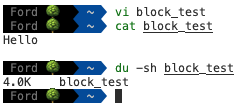

# 객체 저장소를 알아보자!

요즘 회사 업무중 하나로, 기존에 사용하던 객체 저장소를 새로운 플랫폼의 저장소로 이전하는 작업을 하고있는데요.

이번 기회에 얼마전에 책너두를 진행하며 읽었던 `가상 면접 사례로 배우는 대규모 시스템 설계 기초 2`를 복습하며, 정리한 내용을 다시 한 번 곱씹어보고자 합니다.

이 책은 여러 시스템에 대해 다루고 있지만, 그중에서 9장에서는 S3와 같은 객체 저장소를 설계하는 과정을 다루고 있습니다.  
사실 개인적으로는 이 책의 다른 부분은 기존 1권에 비해 다소 아쉬운 부분이 있었는데요, 이 부분 만큼은 이전 책에서 만큼이나 훌륭하다고 생각합니다.  
(그렇다고 책이 별로인것은 아니니, 한번쯤 관심있으신 부분을 찾아보시면 좋을 것 같습니다.)

## 저장소란 정확히 무엇일까?

저와 같은 개발자들이 말하는 저장소란, 말 그대로 데이터를 보관할 수 있는 장소입니다.  
이 뜻에서 우리는 저장소의 목적과 특징을 유추 할 수 있는데요, 이는 아래와 같습니다.

1. 우리가 가진 정보를 일정한 기간동안 유실되거나 손상되지 않도록 보관할 수 있어야 한다.
2. 필요할 때는 언제든지, 내 정보에 저장해서 이를 조회하고 활용 할 수 있어야 한다.
3. (일반적으로)새로운 정보를 지속적으로 추가할 수 있어야 한다.

이러한 기본적인 저장소의 특징을 충족시키기 위해 다양한 유형, 형태의 저장소들이 개발되었는데요,  
이들은 각각의 목적에 맞게 다양한 형태로 최적화되어 서비스를 하고 있습니다.  

## 저장소의 종류

여기까지 이야기하면 일반적인 경우에 개발자들이 생각하는 개념은 보통 `DB`인데요,   
오늘은 아래와 같이, 이보다 조금 더 낮은 수준의 저장소들에 대해 이야기하고자 합니다.

- 블록(block) 저장소
- 파일(file) 저장소
- 객체(object) 저장소

> ### ❗DBMS(Database Management System)  
> 우리가 일상적으로 사용하는 `DBMS`도 사실은 이러한 저장소 시스템의 한 형태라고 볼 수 있습니다.  
>
> 다만 `DBMS`의 경우 사용자가 물리적인 데이터를 직접 다루지 않는다는 점이 차이점이라고 할 수 있습니다.  
> 사용자는 SQL 쿼리를 통해 직접 데이터를 조작한다고 느끼지만, 실제로는 `DBMS`가 제공하는 논리적 추상화 계층과 상호작용하고 있을 뿐이니까요.  
>
> `DBMS`는 테이블, 행, 열, 관계 등의 개념을 통해 복잡한 데이터의 저장 메커니즘을 숨기고, 사용자가 데이터의 물리적 저장 구조에 대해 이해할 필요 없이 비즈니스 관점에서 데이터를 쉽게 다룰 수 있도록 해줍니다.  
> 덕분에 개발자는 저장소의 복잡한 내부 구현 대신 데이터 모델링과 비즈니스 로직에 집중할 수 있게 됩니다.  

### 블록 저장소

혹시 블록(block)이라는 개념에 대해 들어보신 적이 있으신가요?  
아마 CS 공부를 하셨던 분들은 어렴풋하게나마 기억하실텐데요, 모든 데이터는 결국 비트(bit)의 집합으로 이루어져 있고 이는 메모리나 디스크에 저장된다는 것은 다들 알고 계실겁니다.
이처럼 저장되는 데이터들의 최소 단위가 블록(block)이라고 할 수 있습니다.  

> ❗Block
>
> 블록은 데이터를 저장하는 최소 단위이고, 운영체제별로 차이가 있지만 일반적으로 윈도우나 맥, 리눅스 등에서는 4096바이트(4KB) 크기를 가집니다.  
>
> 
>
> 이로인해, 위와 같이 아주 작은 파일을 만들더라도 실제 물리적인 크기는 4KB를 가지는 것을 확인 할 수 있습니다.

블록 저장소는 말 그대로 이 블록을 저장 할 수 있는 저장소를 의미합니다.  
즉, 쉽게 말하자면 서버에 물리적으로 연결되어있는 디스크도 일종의 블록 저장소라고 할 수 있습니다.  
우리가 말하는 저장소의 근본적인 형태라고 할 수 있겠네요.

만약 저장소 서비스로 이러한 블록 저장소 서비스를 사용한다면, 아래와 같은 특징들에 대해 충분히 고려가 필요합니다.

#### 블록 저장소의 특징

- 빠른 속도와 높은 유연성
  - 데이터를 원시 블록(raw block)으로 다루기 때문에, 매우 빠르고 유연합니다.
- 세밀한 제어가 가능함
  - 매우 저수준에서 데이터를 다루는만큼, 최적화의 여지가 많고 세밀한 제어가 가능합니다.
- 높은 관리부담
  - 그만큼 사용자가 실제로 저장소를 관리하는 부담이 높아집니다.
  - 데이터의 관리와 복구 등 여러 작업을 사용자가 직접 처리해야 합니다.

### 파일 저장소

파일 저장소는 앞서 다룬 블록 저장소에 파일과 디렉토리라는 추상화 계층을 추가한 형태입니다.  
이로인해 사용자는 블록 저장소보다 더 쉽게 데이터를 저장하고 관리할 수 있습니다.  
우리가 일상적으로 사용하는 파일 시스템을 생각하시면 쉽게 이해가 되실 것입니다.  

#### 파일 저장소의 특징

- 계층적 구조(hierarchical structure)
  - 파일과 폴더(디렉토리)라는 개념을 통해 데이터를 쉽게 구조화할 수 있습니다.
  - 이를 통해 사용자는 좀 더 친숙하게 정보를 다룰 수 있습니다.
- 관리의 용이성
  - SMB(Server Message Block), NFS(Network File System) 등의 프로토콜을 통해 쉽게 파일 시스템을 마운트할 수 있습니다.
  - 또한 개별 블록에 대한 포멧과 관리 등의 작업을 사용자가 고려 하지 않아도 됩니다.

### 객체 저장소

객체 저장소는 조금 더 특별한 형태의 저장소입니다.  
이 저장소는 데이터를 객체(object)라는 단위로 다루는데요, 이 객체는 실제 데이터와 메타데이터로 이루어져 있습니다.  
현재 대부분의 클라우드에서 주력으로 제공하고, 수많은 개발자들이 사용하고 있는 저장소 형태입니다.  
흔히 앞서 말한 `DBMS`이외에 다른 저장소라고 하면 가장 먼저 떠올리는 형태이죠.  

이러한 객체 저장소가 특별한 이유는, 아마 다들 어렴풋이 알고 계실텐데요, 혹시 객체 저장소에 저장된 데이터를 수정해보신 적 있으신가요?  

아마 없으실 겁니다. 객체 저장소는 일반적으로 데이터 수정 기능을 제공하지 않기 때문입니다.  
이는 객체 저장소의 특징중 하나인데요, 이어서 계속 정리 해 보겠습니다.  
가장 중요한점을 먼저 간단하게 말하자면, 객체 저장소는 일부 기능을 포기함으로서 확장성과 내구성에 더욱 초점을 두었다고 할 수 있습니다.  

#### 객체 저장소의 특징

- 불변성
  - 객체 저장소는 데이터를 수정할 수 없습니다.
  - 대신 새로운 객체를 생성하거나 덮어쓰는 버저닝(versioning) 기능을 제공합니다.
- 확장성
  - 객체 저장소는 데이터를 비 계층적으로 저장합니다.
  - 또한 데이터와 메타데이터를 분리하여 저장하기 때문에, 데이터의 확장성이 높습니다.
- 내구성
  - 객체 저장소는 데이터를 여러 노드에 분산하여 저장/관리하기 쉽습니다.
  - 이로인해 높은 내구성을 유지할 수 있습니다.
- 비용 효율성
  - 위와 같은 특징들로 인해, 더 저렴한 비용으로 더 많은 데이터를 저장할 수 있습니다.

> ❗ 어? 제 저장소는 폴더 구조를 가지고있는데 왜 비계층적이라고 하는거죠?
>
> 객체 저장소는 사용자의 편의를 위해 디렉토리 구조를 제공하지만, 실제로는 데이터를 비 계층적으로 저장합니다.  
> 이로인해 실제로 저장소의 데이터 목록을 조회하면 이름이 `directory/` 와 같이 `/`로 끝나는 빈 객체들이 존재하고,  
> 디렉토리 내부의 객체들은 `directory/object` 와 같이 이름이 붙게 됩니다.  
>
> 즉, 이는 일종의 `prefix` 형태로 저장되는 것이며, 이로인해 계층적인 구조를 가지는 것처럼 보이는 것입니다.  

## 각 저장소의 비교

각 저장소를 그림으로 비교해보자면 아래와 같습니다.


## 왜 객체 저장소가 이렇게까지 주목받는걸까?

앞서 말씀드렸듯, 대부분의 클라우드 서비스에서 주력으로 제공하는 저장소의 형태가 객체 저장소입니다.  
실제로 많은 개발자분들의 사용 경험에서도 객체 저장소가 압도적이죠.  
그렇다면 어떤 요소가 이렇게까지 객체 저장소의 인기를 높이는 데 기여하는 것일까요?  

### 1. 대규모 확장성의 필요성

블록 저장소나 파일 저장소는 기본적으로 시스템에 데이터가 더 긴밀하게 연결되어있습니다.  
각 블록이나 파일에 대한 정보를 직접 가지고 관리하는 방식은 물론, 계층적 구조로 인해 데이터의 확장성이 떨어지는 문제가 있습니다.  
반면에 객체 저장소는 데이터와 메타데이터를 분리하여 저장하고, 데이터를 비 계층적/평면적으로 저장하므로 필요시 확장이 쉽습니다.  

### 2. 클라우드 네이티브의 등장

혹시 클라우드 네이티브라는 개념을 들어보신 적 있으신가요?  
최근들어 MSA, 서버리스 등의 트렌드가 뜨겁게 떠오르고 있는데, 이러한 트렌드로 인해 많은 서비스들이 클라우드 플랫폼에 의존하고 있습니다.  
그리고 이러한 클라우드 플랫폼에서는 아래와 같은 특성을 가진 컴포넌트가 사용에 유리한데요, 이러한 특성들을 갖춘 저장소가 바로 객체 저장소입니다.  

- HTTP, REST API를 통해 쉽게 접근 가능
- 무상태(stateless) 특성
- 쉬운 확장성

### 3. 비용 효율성

앞서 다루었듯, 객체 저장소는 몇 가지 기능을 포기함으로서 더 저렴한 비용으로 더 많은 데이터를 저장할 수 있습니다.  
또한 이를 통해 사용자는 관리의 부담 없이도 저렴하게 더 많은 데이터를 저장할 수 있게 되었죠.  

### 4. 높은 데이터 내구성과 가용성

이또한 앞서 다룬 내용과 긴밀하게 연결되는데요,  
불변성이라는 특성 덕분에 객체 저장소는 데이터를 여러 노드에 분산하여 저장/관리하기 쉽습니다. 정합성이나 락에 대해 고민할 필요가 없기 때문이죠.  
이로인해 높은 내구성을 유지할 수 있습니다.  

## 객체 저장소의 주요 개념과 용어

객체 저장소의 주요 개념과 용어에 대해 알아보자면, 아래와 같습니다.

### 1. 객체(object)

객체는 저장의 기본 단위로, 두 가지 부분으로 구분됩니다.

#### 1. 데이터(페이로드)

실제로 저장되는 콘텐츠. 파일이나 이미지, 동영상일 수도 있고, 문자열이나 바이너리 데이터일 수도 있습니다.

#### 2. 메타데이터

객체의 속성을 설명하는 데이터. 이름, 타입, 크기, 생성일, 수정일 등의 정보를 포함합니다.  
이외에도 사용자가 정의한 별도의 태그, 카테고리 등의 정보도 포함될 수 있습니다.

### 2. 버킷(bucket)

버킷은 객체를 저장하는 물리적 공간입니다.  
객체 저장소에서는 버킷을 생성하고, 이 버킷 내에 객체를 저장합니다.  

일반적으로 DNS 주소처럼 사용자가 쉽게 이해할 수 있는 이름을 가지고 있습니다.  
또한 객체 저장소에서는 버킷을 생성하고, 이 버킷 내에 객체를 저장합니다.  

AWS의 S3에서는 전역적으로 고유한 이름을 가져야 하는데, 이는 아마 평면적인 구조에서 비롯된 특성이 아닐까 생각합니다 (근거는 없습니다.)

하지만 오라클 등의 다른 객체 스토리지에서는 네임스페이스를 통해 이런 번거로움(?)을 해결하고 있기는 하더라구요.

### 3. URI(Uniform Resource Identifier), 키(key)

URI, 혹은 키는 객체를 식별하는 고유한 식별자입니다.  
일반적으로 아래와 같은 형태를 띕니다.

```
https://bucket-name.domain.com/object-key
```

이는 전세계에서 유일한, 우리가 지정한 객체 하나를 지칭하는 고유한 식별자입니다.  

### 4. 버전(version)

앞서 말했듯, 객체 저장소는 데이터의 수정 기능을 제공하지 않습니다. 오직 덮어쓰기 기능만을 제공하죠.  
이로인해 사실 불편함이 큰데요, 누군가 데이터에 조작을 가했을때 이를 추적하기가 어렵습니다.  
이런 문제를 해결하기 위해 객체 저장소에서는 버저닝 기능을 제공합니다.  

덕분에 데이터를 실수로 삭제하거나, 덮어썼을 때 복구도 가능하고, 이전 버전으로의 롤백도 가능합니다.  

### 5. 체크섬(checksum)

체크섬은 데이터의 무결성을 확인하기 위해 사용되는 값입니다.  
객체 저장소에서는 데이터를 업로드할 때 체크섬을 계산하고, 이를 메타데이터에 저장합니다.  
이후 데이터를 다운로드할 때 체크섬을 다시 계산하여 원본 데이터와 비교하여 무결성을 확인합니다.

## 객체 저장소 시스템의 내부 아키텍처는 어떻게 생겼을까?

이러한 객체 저장소는 어떻게 구성되어 있을까요?  
일반적으로 실제 서비스중인 객체 저장소에서 구조가 공개된 경우는 거의 없지만, 일반적인 구성 패턴을 알아보자면 아래와 같습니다.

### 주요 컴포넌트


#### 1. API 서비스

클라이언트의 요청을 직접 받아서 처리하는 서비스입니다.  
주요 작업은 아래와 같고, 무상태로 설계되어 확장성이 높습니다.

- 버킷 생성/삭제
- 객체 업로드/다운로드
- 객체 목록 조회
- 액세스 권한 수정

#### 2. IAM 서비스

사용자의 인증과 권한 관리를 담당합니다.  

- 인증(authentication): 사용자의 신원 확인
- 권한 관리(authorization): 사용자의 권한 확인
- 접근 제어(access control): 세밀한 접근 제어 관리

#### 3. 메타데이터 저장소

객체들의 메타데이터를 관리하는 분산 데이터베이스입니다.  
보통 메타데이터는 아래와 같은 정보들이 저장됩니다.

- 객체의 이름, 크기, 생성 시간
- 체크섬(checksum)
- 실제 데이터의 물리적 위치
- 버전 정보
- 기타 사용자 정의 메타데이터

이러한 정보들을 바탕으로, 사용자의 요청에 따라 빠르게 객체의 데이터 목록을 조회할 수 있습니다.  
또한 실제 데이터의 물리적인 위치와 분리되어있기 때문에, 데이터의 확장에 훨씬 유리한 구조를 가지고 있습니다.  

#### 4. 데이터 저장소

객체의 실제 데이터(바이너리)를 저장하는 분산 시스템입니다.  
이는 아래와 같은 하위 서비스들로 구성되어 있는데요,  

- 데이터 라우팅 서비스
  - 데이터 노드 클러스터에 접근하기 위한 진입점을 제공합니다.
  - 데이터 업로드시 배치 서비스를 호출하여 데이터가 저장될 노드를 선정합니다.
- 배치 서비스: 노드들의 가상 클러스터 지도를 유지하고, 데이터가 실제로 어디에 저장되어야 하는지를 결정합니다.
- 데이터 노드: 데이터를 실제로 저장하는 물리적 서버와 디스크

## 마치며

오늘은 저장소에 대한 개념과, 그중에서도 특히 많이 사용되는 객체 저장소에 대해 도서 `가상 면접 사례로 배우는 대규모 시스템 설계 기초 2`의 내용에 기반하여 정리를 해 보았습니다.  

이외에도 이 책에서는 더 풍성한 내용을 더 깊이있게 다루고 있어서, 매번 단순하게 사용하기만 해왔던 객체 저장소의 특징과, 왜 이렇게 구성되어 있는지, 그리고 실제 내부적으로 어떻게 동작하는지에 대해 이해 할 수 있었는데요,

당연하게도 여기서 이 챕터의 모든 내용을 다루는것은 상도덕에 맞지 않으니, 더 깊은 내용이 궁금하시다면 이 책을 한 번 읽어보시는것도 큰 도움이 될 것 같습니다!

그러면 여기까지 읽어주셔서 감사하고, 다음에 다른 주제로 찾아뵙겠습니다~