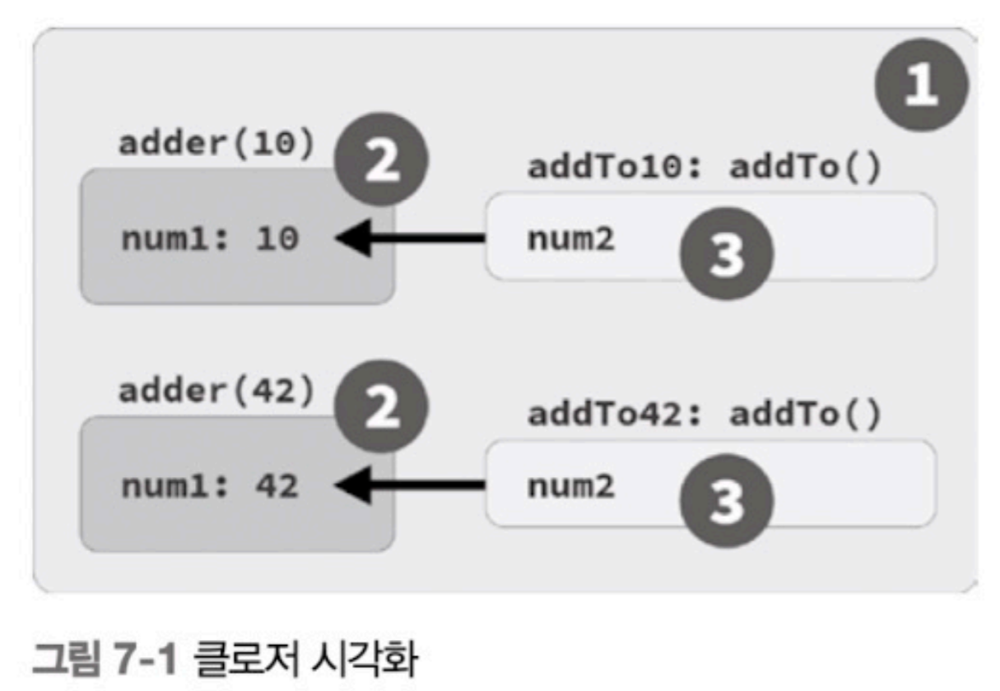

# You Don't Know JS

## Part 1: 시작하기

### Chapter 1: 자바스크립트

#### 1.1 책에 대하여

#### 1.2 자바스크립트 이름의 유래

- 당연하게도, 자바스크립트는 자바와 관련이 없다.
  - 그렇지만 아이러니하게도 이 책은 정작 교보문고의 `프로그래밍-자바` 카테고리에 분류되어 있었다.
- 처음 명칭은 `Mocha`였다.
- 당시 '스크립트'라는 용어가 '간단한 프로그램'이라는 의미로 유행하였고, 자바 사용자들에게 어필하기 위해 `자바스크립트`라는 이름으로 변경되었다.
  - 실제로 자바와 자바스크립트는 C와 비슷한 형태의 문법을 사용한다는 공통점이 있긴 하다(`{}`, `;`의 사용 등)
- 현재는 공식적으로 ES20XX(ECMAScript) 혹은 JS라고 불린다.

#### 1.3 명세서

- TC39: ECMAScript 명세를 관리하는 위원회
- TC39에서는 새로운 기능을 추가하거나 기존 기능을 수정하는 등의 작업을 진행한다.
  - 모든 제안은 0~4단계(총 5단계)의 과정을 거쳐 다음 연도의 명세에 포함될 수 있다.

##### 1.3.1 JS를 지배하는 웹

- JS는 브라우저, 서버, 모바일, IoT 등 다양한 환경에서 사용된다.
- 그러나 가장 큰 영향력을 미치는 것은 웹이다.
- 명세에 변경이 생기는 경우, JS엔진 제조사는 이를 반영하여 엔진을 업데이트한다.
  - 그러나 이 과정에서 기존의 콘텐츠가 깨지는 경우 개정안을 적용하지 않는 경우도 있다.
  - 이런 경우 TC39는 결정을 철회하는 경우도 있다.
    - `contains()`를 추가하려다가 충돌로 `include()`로 변경되었다.
    - `flatten()`을 추가하려다가 충돌로 `flat()`으로 변경되었다.
  - 그러나 특수한 경우에는, 이를 부록 B, `Additional ECMAScript Features for Web Browsers`라는 별도의 명세로 추가하기도 한다.
    - 이는 웹 전용 기능을 추가하기 위한 것이며, 다른 환경은 명세서를 반드시 준수해야 한다.

##### 1.3.2 JS지만 JS가 아닌 웹 전용 문법

- `alert('Hello, JS!')`와 같은 코드는 JS이지만, JS 명세에는 없는 기능이다.
- 위에서 말한 부록 B에도 포함되어 있지 않다.
  - `fs.write()`, `console.*()`도 마찬가지이다.
  - 이런 기능은 특정 환경(브라우저 혹은 Node.js)에서만 사용되는 기능이거나, 명세에는 없지만 대부분의 환경에서 지원하는 기능이다.

##### 1.3.3 모든 코드가 JS인 것은 아닙니다

- 브라우저의 개발자도구 콘솔이나 Node.js의 REPL은 사실 순수한 JS환경이 아니다.
  - 이는 어디까지나 개발자를 위한, `JS에 우호적인 별도의 환경`일 뿐이라는것을 명심하고, 무조건 신뢰하지 말자.

#### 1.4 JS의 다양한 얼굴

- JS는 멀티 패러다임 언어이다.
  - 함수형, 객체지향, 프로토타입 기반, 명령형, 비동기 등 다양한 패러다임을 지원한다.

#### 1.5 하위 호환성과 상위 호환성

- 주요개념
  - `하위 호환성`: 새로운 버전이 이전 버전과 호환되는 것
  - `상위 호환성`: 이전 버전이 새로운 버전과 호환되는 것
- JS는 `하위 호환성`을 중요하게 생각한다.
  - 명세가 개정되더라도 이전 버전 코드의 작동을 보장한다.
- JS는 `상위 호환성`을 준수하지 않는다.
  - 따라서 새로운 코드는 이전 엔진에서 작동하지 않을 수 있다.

##### 1.5.1 간극을 줄이기 위한 노력

- 트랜스파일: 새로운 기능을 사용하여 코드를 작성하고, 이를 이전 버전에서도 작동할 수 있도록 변환하는 과정
  - Babel이 대표적인 트랜스파일러
  - 예시
    - Before

      ```js
      if (something) {
        let x = 3;
        console.log(x);
      } else {
        let x = 4;
        console.log(x);
      }
      ```

    - After

      ```js
      var x$0, x$1;
      if (something) {
        x$0 = 3;
        console.log(x$0);
      } else {
        x$1 = 4;
        console.log(x$1);
      }
      ```

##### 1.5.2 간극을 메우기 위한 방법 찾기

- 폴리필(Polyfill): 새로운 기능을 이전 버전에서도 사용할 수 있도록 구현한 코드. 심(shim)이라고도 불린다.
- 이러한 폴리필은 ES-Shim 등 공신력있는 라이브러리에서 제공한다.
  - 예시

  ```js
  var pr = getSomeRecords();

  startSpinner();

  pr
    .then(renderRecords)
    .catch(showError)
    .finally(hideSpinner); // <-- 이 부분이 ES2019에 추가된 기능
  ```

  - 이를 ES2019이전 환경에서도 사용할 수 있도록 폴리필을 작성한다.

  ```js
  if (!Promise.prototype.finally) {
    Promise.prototype.finally = function f(fn) {
      return this.then(
        function t(v) {
          return Promise.resolve(fn())
            .then(function t() {
              return v;
            });
        },
        function c(e) {
          return Promise.resolve(fn())
            .then(function t() {
              throw e;
            });
        }
      );
    };
  }
  ```

#### 1.6 인터프리터 이해하기

- 주요 개념
  - 인터프리터 언어: 코드를 실행하기 위해 런타임에 해석하는 언어. 한 줄씩 실행한다.
    - 스크립트 언어: 인터프리터 언어 중, 특히 브라우저에서 사용되는 언어
  - 컴파일러 언어: 코드를 실행하기 전에 미리 기계어로 변환하는 언어. 한 번에 실행한다.
- 저자는 JS가 컴파일 언어라고 주장한다.
  - JS는 실행 전에 전체 코드에 대해 파싱 과정을 거친다.
  - JS는 파싱 후 생성된 코드를 JIT 방식으로 처리 및 최적화 한다.
- JS의 실행 절차
  - `코드 작성` -> `트랜스파일` -> `번들링` -> `파싱`(코드 -> 추상 구문 트리 -> 바이트 코드) -> `최적화` -> `실행`
  -   개발자        Babel       Webpack    JS엔진(V8)    JS엔진(V8)     JS엔진(V8)    JS엔진(V8)  JS 가상 머신

##### 1.6.1 웹어셈블리

- ASM.js: JS의 하위 집합으로, 브라우저에서 더 빠르게 실행되도록 최적화된 코드
- Wasm: JS의 대체 언어로, 브라우저에서 더 빠르게 실행되도록 최적화된 코드

#### 1.7 엄격 모드

- `use strict`: 엄격 모드를 활성화하는 지시자
  - 이 전처리 구분 앞에는 공백이나 주석만 올 수 있다.
  - 파일이 아닌, 함수 단위로 적용할 수 있다.
- 하위 호환성을 고려하기에 아직 표준으로 채택되지 않았다.
  - 그러나 트랜스파일 결과물에는 `use strict`가 포함되어 있다.
  - 또한 현재는 대체로 모든 환경에서 ES2015 이상을 지원하므로, `use strict`를 사용했을 때 문제가 발생할 확률은 매우 낮다.

#### 1.8 정리

- JS는 ECMA 주최하에 TC39 위원회에서 관리하는 ECMAScript 표준을 구현한 언어이다.
- JS는 멀티 패러다임 언어이다.
- JS는 컴파일 언어이다.

### Chapter 2: 자바스크립트 조망하기

#### 2.1 파일은 프로그램입니다

- JS는 하나의 파일이 독립된 프로그램이다.
  - 따라서 파싱/컴파일, 혹은 실행 과정에서 하나의 파일에 문제가 생기면 다음 파일로 넘어가지 않는다.
- 이러한 여러 개의 파일을 통합된 하나의 프로그램으로 사용하는 방법은 global scope를 사용해 파일 간 상태를 공유하고, 공통 기능에 접근토록 하는 것 뿐이다.
  => 의견) 의존성 주입, 모듈화 등의 방법을 사용하여 해결할 수 있지 않나? 전역 스코프 사용만이 해결책은 아닌 것 같다.

#### 2.2 값

- 정보의 가장 작은 단위
- 어떤 식이나 표현식을 평가하여 나온 결과
- 리터럴을 사용해 값을 생성할 수 있다.
  - Pi(3.1415...) 등의 상수는 Math.PI와 같은 이미 정의된 수가 있다. 이를 사용하자.
    - 이미 정의된 값의 예시: `Math.PI`, `Number.MAX_VALUE`, `Number.MIN_VALUE`, `Number.POSITIVE_INFINITY`, `Number.NEGATIVE_INFINITY`, `Number.NaN`, `Number.EPSILON`, `Number.MIN_SAFE_INTEGER`, `Number.MAX_SAFE_INTEGER`...
- JS에는 두 가지 종류의 값이 있음: 원시 값과 객체
- `원시 값`: 더 이상 쪼개지지 않는 값. ex) `숫자`, `문자열`, `불리언`, `null`, `undefined`, `심볼`
  - `null`과 `undefined`는 값이 없음을 나타내는 값이지만, 각각의 의미가 다르다.
    - `null`: 값이 없음을 나타내는 값
    - `undefined`: 값이 할당되지 않은 상태를 나타내는 값
    - 일관성 있게 사용한다면 어느 것을 사용해도 상관없다.
    - 다만 필자는 비어있는 단일 값을 나타낼 때에는 `undefined`를 사용하는 것이 가장 안전하다고 생각한다.
  - `심볼`(`Symbol`): 객체의 특정한 키를 만들 때 주로 사용하며, 대체로 라이브러리 등 저차원의 코드에서 사용한다.

##### 2.2.1 배열과 객체

- `객체`: 여러 값들을 하나로 묶은 값. ex) `배열`, `함수`, `날짜`, `정규표현식`, `오브젝트`
  - 객체는 배열보다 좀 더 일반적인 형태의 값이다.
    - 객체는 정렬되지 않은 키-값 쌍의 집합이다.

##### 2.2.2 값의 타입

- `typeof` 연산자를 사용해 원시값과 객체를 구분할 수 있다.
  - 원시값에 대한 `typeof` 연산은 원시값의 타입을 반환한다.
  - 객체에 대한 `typeof` 연산자는 객체의 타입이 아닌 `object`를 반환한다.
    - 객체의 타입을 구분하기 위해서는 `instanceof` 연산자를 사용한다.
  - 그러나 여기에는 잘 알려진 문제가 있다.
    - `typeof null`은 `object`를 반환한다.
    - `typeof array`는 `object`를 반환한다.

#### 2.3 변수 선언과 사용

- 변수를 사용하기 위해서는 두 가지 과정이 필요하다.
  - `선언`: 변수를 생성하고, 메모리에 저장공간을 할당한다.
  - `할당`: 변수(메모리)에 값을 저장한다.
- 변수를 사용하기 위한 예약어
  - `var`
    - ES6 이전에 사용되던 변수 선언 키워드
    - 함수 스코프를 가진다. 즉, 변수가 선언된 함수 내에서만 유효하다.
    - 선언과 동시에 초기화되지 않으면 `undefined`로 초기화된다.
    - 호이스팅이 발생하여 선언 전에 사용해도 에러가 발생하지 않으나, 초기화 전에 사용하면 `undefined`가 반환된다.
  - `let`
    - ES6에서 추가된 변수 선언 키워드
    - 블록 스코프를 가진다. 즉, 변수가 선언된 블록 내에서만 유효하다.
    - 선언과 동시에 초기화되지 않으면 `undefined`로 초기화된다.
    - 호이스팅이 발생하지만, 선언 전에 사용하면 에러가 발생한다.(TDZ; Temporal Dead Zone)
    - 재선언이 불가능하다.
    - **재할당은 가능**하다.
  - `const`
    - ES6에서 추가된 상수 선언 키워드
    - 블록 스코프를 가진다. 즉, 변수가 선언된 블록 내에서만 유효하다.
    - **선언과 동시에 초기화되지 않으면 에러가 발생**한다.
    - 호이스팅이 발생하지만, 선언 전에 사용하면 에러가 발생한다.(TDZ; Temporal Dead Zone)
    - 재선언이 불가능하다.
    - **재할당이 불가능**하다.
    - 그러나 객체나 배열 등의 참조형 데이터의 경우, 참조값은 불변이지만, 참조값이 가리키는 객체나 배열의 내부 값은 변경이 가능하다.

#### 2.4 함수

- `함수`라는 단어에는 지나치게 많은 의미가 담겨있다.
  - 수학적인 함수
  - 프로그래밍에서의 함수
  - 함수형 프로그래밍에서의 함수
  - JS에서의 함수
- JS에서의 함수는 조금 더 넓은 개념인 `프로시저`에 가깝다.
  - `프로시저`: 어떤 일을 수행하는 코드 덩어리.
    - 한 번 이상 호출 할 수 있으며,
    - 입력값이 있을 수도 있고 없을 수도 있으며,
    - 최소 하나 이상의 출력값을 반환하는 구문의 모음.
- `함수 선언문`: 함수를 선언하는 구문
  - 함수 선언문은 호이스팅이 발생한다.
  - 함수 선언문은 함수 이름을 생략할 수 없다.
  - 이 자체가 하나의 문이기 때문에, 세미콜론을 붙이지 않는다.
  - 함수의 식별자와 값의 연관이 실행 단계가 아닌 **컴파일(파싱) 단계**에서 이루어진다.
- `함수 표현식`: 함수를 값으로 사용하는 구문
  - 함수 표현식은 호이스팅이 발생한다.
  - 함수 표현식은 함수 이름을 생략할 수 있다.
  - 함수 표현식은 값이기 때문에, 세미콜론을 붙인다.
  - 함수의 식별자와 값의 연관이 **실행 단계**에서 이루어진다.
- 또한 이러한 함수는 `일급 객체`이다.
  - `일급 객체`: 값으로 다룰 수 있는 객체
    - 변수에 할당할 수 있다.
    - 객체의 프로퍼티가 될 수 있다.
    - 함수의 인자로 전달할 수 있다.
    - 함수의 반환값이 될 수 있다.
    - 동적으로 프로퍼티를 추가할 수 있다.

#### 2.5 비교

##### 2.5.1 같음에 대한 고찰

- `같다`의 의미
  - `정확하게 일치한다.`
  - `아주 유사하다.`
  - `교환 가능하다.`
- 따라서 아래의 두 개념을 명확히 이해해야 한다.
  - `일치비교`: 값과 타입이 정확하게 일치하는지 비교하는 것. `동일성`. `===`
  - `동등비교`: 값이 아주 유사한지 비교하는 것. `동등성`. `==`
- 저자가 주장하는 흔히 알려진 오개념
  - 일치 연산자(`===`)는 값과 타입 둘 다의 일치를 확인하고, 동등 연산자(`==`)는 값만의 일치를 확인한다.
    - 그러나 실제로는 두 연산자 모두 타입을 고려한다.
    - 다만 동등 연산자의 경우, 타입이 다르면 타입을 변환하여 비교한다.
    - 두 비교 대상의 타입이 동일하면 두 연산자의 결과는 동일하다.
- 일치 연산자의 허점
  - 문제점
    - `NaN`은 자기 자신과 일치하지 않는다. (`NaN === NaN`은 `false`이다.)
    - `-0`과 `+0`은 일치하지만, 동등하지 않다. (`-0 === +0`은 `true`이다.)
  - 해결책
    - Number.isNaN()을 사용한다.
      - `Number.isNaN(NaN)`은 `true`이다.
    - `Object.is()`를 사용한다. (농담을 섞어, 초일치 연산자(`====`)라고 부르기도 한다.)
      - `Object.is(NaN, NaN)`은 `true`이다.
      - `Object.is(-0, +0)`은 `false`이다.
- 객체의 비교
  - 객체의 비교는 더 복잡해진다.
    - JS에서는 객체를 비교할 때 독자성 일치를 비교한다.
    - 즉, 두 객체가 동일한 객체인지를 비교한다.
    - 형태나 내용이 동일하더라도, 참조값이 다르면 `false`를 반환한다.
      - [1, 2, 3] === [1, 2, 3] 은 `false`이다.
      - { a: 42 } === { a: 42 } 는 `false`이다.
      - (x => x * 2) === (x => x * 2) 는 `false`이다.
  - 따라서 객체의 내용을 비교하려면, 직접 비교해야 한다.
    - `JSON.stringify()`를 사용하여 객체를 문자열로 변환한 후 비교한다.
      - 그러나 이런 경우, 객체의 순서가 다르면 다른 객체로 인식한다.
      - 또한 함수의 경우, 클로저 등의 이유로 정확한 비교가 불가능하다.
    - `lodash`나 `underscore` 등의 라이브러리를 사용한다.
    - 직접 비교하는 함수를 작성한다.

##### 2.5.2 강제 변환

- 값의 타입을 다른 타입으로 변환하는 것
- JS의 핵심적인 특징이자 기능 중 하나
- 위에서 언급했듯, 비교연산에서 강제변환이 없다면(두 값의 타입이 동일하다면) 두 연산자(`==`, `===`)의 동작과 결과는 동일하다.
  - **일치 연산자(`===`)가 타입까지 비교하는 기능이 있는 것이 아니라, 동등 연산자(`==`)가 타입을 강제 변환하여 비교하는 기능이 있는 것이다.**
  - 따라서 동등 연산자(`==`)는 **느슨한 동등 비교 연산자**가 아닌 **강제 변환 동등 비교 연산자**라고 부르는 것이 더 정확하다.
- 흔히 `===` 연산자를 사용하라고 권장한다.
  - 하지만 이는 다른 비교연산(`>`, `<`, `>=`, `<=`)에서는 피할 수 없다.

#### 2.6 코드 구조화 패턴

- 코드를 구조화하는 패턴은 크게 `클래스`와 `모듈`로 나뉜다.
- 그러나 이 둘은 상호 배타적인 것이 아니다.
  - 클래스는 모듈 내부에 존재할 수 있다.
  - 모듈은 클래스 내부에 존재할 수 있다.

##### 2.6.1 클래스

- 클래스: 사용자가 정의한 데이터 타입
  - 클래스는 객체를 생성하기 위한 템플릿이다.
  - 클래스는 객체의 특성과 행동을 정의한다.
  - 클래스를 사용하기 위해서는 `new` 연산자를 사용하여 객체의 인스턴스를 생성해야 한다.
- 클래스의 예시

  ```js
  class Page {
    constructor(text) {
      this.text = text;
    }
    print() {
      console.log(this.text);
    }
  }

  class Notebook {
    constructor() {
      this.page = [];
    }

    addPage(text) {
      var page = new Page(text);
      this.pages.push(page);
    }

    print() {
      for (let page of this.pages) {
        page.print();
      }
    }
  }

  var mathNotes = new Notebook();
  mathNotes.addPage('2^2 = 4');
  mathNotes.addPage('3^2 = 9');

  mathNotes.print();
  ```

- 상속: 클래스 지향 설계에서 중요한 개념(+다형성)

  ```js
  class Publication {
    constructor(title, author, pubDate) {
      this.title = title;
      this.author = author;
      this.pubDate = pubDate;
    }

    print() {
      console.log(`
        Title: ${this.title}
        By: ${this.author}
        Date: ${this.pubDate}
      `);
    }
  }

  class Book extends Publication {
    constructor(bookDetails) {
      super(bookDetails.title, bookDetails.author, bookDetails.pubDate);
      this.publisher = bookDetails.publisher;
      this.ISBN = bookDetails.ISBN;
    }

    print() {
      super.print();
      console.log(`
        Publisher: ${this.publisher}
        ISBN: ${this.ISBN}
      `);
    }
  }

  class BlogPost extends Publication {
    constructor(blogDetails) {
      super(blogDetails.title, blogDetails.author, blogDetails.pubDate);
      this.url = blogDetails.url;
    }

    print() {
      super.print();
      console.log(`
        URL: ${this.url}
      `);
    }
  }

  var YDKJSY = new Book({
    title: 'You Don\'t Know JS Yet',
    author: 'Kyle Simpson',
    pubDate: '2020-01-28',
    publisher: 'O\'Reilly',
    ISBN: '123-456-789'
  });

  YDKJSY.print();

  var forAgainstLet = new BlogPost({
    title: 'For and Against Let',
    Author: 'Kyle Simpson',
    pubDate: '2020-01-28',
    url: 'https://davidwalsh.name/for-and-against-let'
  });

  forAgainstLet.print();
  ```

##### 2.6.2 모듈

- 클래식 모듈
  - 최소 한 번 이상 실행되는 외부 함수.
  - 모듈 인스턴스 내부로 숨겨진 데이터를 가진다.
  - 이러한 숨겨진 데이터를 사용하는 함수가 있는 인스턴스를 반환한다.
  - 본질적으로 '함수'이고, 함수를 호출하면 '모듈 인스턴스'를 반환하기에 '모듈 팩토리'라고도 부른다.
  - 예시

    ```js
    function Publication(title, author, pubDate) {
      var publicAPI = {
        print() {
          console.log(`
            Title: ${title}
            By: ${author}
            Date: ${pubDate}
          `);
        }
      };

      return publicAPI;
    }

    function Book(bookDetails) {
      var pub = Publication(
        bookDetails.title,
        bookDetails.author,
        bookDetails.pubDate,
      );

      var publicAPI = {
        print() {
          pub.print();
          console.log(`
            Publisher: ${bookDetails.publisher}
            ISBN: ${bookDetails.ISBN}
          `);
        }
      };

      return publicAPI;
    }

    function BlogPost(blogDetails) {
      var pub = Publication(
        blogDetails.title,
        blogDetails.author,
        blogDetails.pubDate,
      );

      var publicAPI = {
        print() {
          pub.print();
          console.log(`
            URL: ${blogDetails.url}
          `);
        }
      };

      return publicAPI;
    }

    var YDKJSY = Book({
      title: 'You Don\'t Know JS Yet',
      author: 'Kyle Simpson',
      pubDate: '2020-01-28',
      publisher: 'O\'Reilly',
      ISBN: '123-456-789'
    });

    YDKJSY.print();

    var forAgainstLet = BlogPost({
      title: 'For and Against Let',
      author: 'Kyle Simpson',
      pubDate: '2020-01-28',
      url: 'https://davidwalsh.name/for-and-against-let'
    });

    forAgainstLet.print();
    ```

- ES모듈
  - ES6에서 추가된 모듈
  - `export`와 `import` 키워드를 사용하여 모듈을 정의하고 사용
  - 클래식 모듈과의 차이점
    1. ES모듈에는 모듈을 정의하는 래핑 함수가 없다. 즉, ES모듈은 항상 파일 기반이다.
    2. ES모듈은 모듈 API와 직접 상호작용하지 않는다. export 키워드를 사용하여 변수나 메서드를 public으로 정의한다.
    3. 별도로 인스턴스화 하지 않아도, import 구문을 사용하는 것 자체로 인스턴스를 생성한다.
      - 이로인해 본질적으로 싱글턴이라고 할 수 있다.
      - 만약 여러 인스턴스가 필요한 경우, 모듈 스타일의 팩토리 함수를 작성해야 한다.
  - 예시

    ```js
    // publication.js
    function printDetails(title, author, pubDate) {
      console.log(`
        Title: ${title}
        By: ${author}
        Date: ${pubDate}
      `);
    }

    export function create(title, author, pubDate) {
      var publicAPI = {
        print() {
          printDetails(title, author, pubDate);
        }
      };

      return publicAPI;
    }
    ```

    ```js
    //blogpost.js
    import { create as createPub } from './publication.js';

    function printDetails(pub, URL) {
      pub.print();
      console.log(URL);
    }

    export function create(title, author, pubDate, URL) {
      var pub = createPub(title, author, pubDate);

      var publicAPI = {
        print() {
          printDetails(pub, URL);
        }
      };

      return publicAPI;
    }
    ```

    ```js
    // main.js
    import { create as newBlogPost } from './blogpost.js';

    var forAgainstLet = newBlogPost(
      'For and Against Let',
      'Kyle Simpson',
      '2020-01-28',
      'https://davidwalsh.name/for-and-against-let'
    );

    forAgainstLet.print();
    ```

#### 2.7 더 깊은 토끼굴로

- 생략

### Chapter 3: 자바스크립트 뿌리 파헤치기

#### 3.1 이터레이션

- 이터레이터 패턴
  - 데이터를 덩어리(chunk)단위로, 표준화된 방법을 사용해 처리하는 패턴.
  - `이터레이터`라는 약속된 인터페이스(데이터 구조)를 정의하여 사용함.
  - 이터레이터는 `next()` 메서드를 지원한다.
  - `next()` 메서드는 호출될 때마다, 이터레이터가 가리키는 데이터 구조의 다음 값을 반환한다.
  - 또한 반복작업 시 사전에 총 몇 번 반복할지 알 수 없는 경우를 위해, 더이상 데이터가 없는 경우에는 특정한 값이나 에러를 반환하여 반복이 종료되었다는 신호를 보낸다.

- JS의 이터레이터 패턴
  - ES6에서 추가된 이터레이터 패턴
  - `next()` 메서드에서 `iterator result`객체를 반ƒ환한다.
  - `iterator result` 객체는 `value`와 `done` 프로퍼티를 가진다.
    - `value`: 이터레이터가 가리키는 값
    - `done`
      - 이터레이터가 더 이상 가리킬 값이 없는 경우 `true`
      - 아직 더 이상 가리킬 값이 있는 경우 `false`

##### 3.1.1 이터레이터 소비하기

- 위에서 언급한 이터레이터를 직접 구현하는것은 번거롭기에, JS에서는 이를 사용하기위한 새로운 문법과 API를 정의했다.
  - `for...of` 루프
  - `Array.from()`
  - `...` 연산자
  - `Map`, `Set`, `WeakMap`, `WeakSet` 등의 내장 객체
  - `String`, `TypedArray`, `NodeList` 등의 내장 객체
  - `Symbol.iterator` 프로퍼티
  - `Generator` 함수

  ```js
  // 처리할 데이터의 이터레이터
  var it = /* ... */;

  // 이터레이터 리절트 객체를 순화
  for (let val of it) {
    console.log(`Iterator value: ${val}`);
  }
  ```

##### 3.1.2 이터러블

- 이터레이터 소비 프로토콜: 이터러블을 소비하는 기술적인 방법.
  - 이터러블을 사용해 `이터레이터 인스턴스`를 생성
  - `이터레이터 인스턴스`를 소비해 연산을 마무리.
    - `이터레이터 인스턴스`를 여러 개 생성하여 이터러블을 여러 번 소비 할 수 있음.

- 이터러블: 순회 가능한 값.
  - 예시: 문자열, 배열, 맵, 셋, 노드리스트 등
  - 문자열, 배열의 경우 `...` 연산자를 사용하여 이터러블을 소비할 수 있다.
  - 맵의 경우 `entries()`, `keys()`, `values()` 메서드를 사용하여 이터러블을 소비할 수 있다.
  - 이외에도 이터레이션 프로토콜을 준수하는 객체를 직접 만든다면, 위와 같이 `...` 연산자나 `for...of` 루프를 사용하여 이터러블을 소비할 수 있다.

#### 3.2 클로저

- 모든 개발자는 부지불식간에 클로저를 사용하고 있다.
- 클로저는 종종 말로 표현하기 어려운, 추상적인 무언가로 표현되는데, 이는 틀린 개념이다.
- 클로저
  - 정의: 함수가 정의된 스코프가 아닌 다른 스코프에서 실행되더라도, 스코프 밖의 변수를 기억하고 이에 계속해서 접근 할 수 있는 경우를 말한다.
  - 특징
    - 클로저는 함수의 특징이다.
    - 클로저를 확인하려면, 함수가 정의된 스코프가 아닌 다른 스코프에서 실행해야 한다.

      ```js
      function greeting(msg) {
        return function who(name) {
          console.log(`${msg}, ${name}!`);
        }
      }

      var hello = greeting('Hello');
      var howdy = greeting('Howdy');

      hello('Kyle'); // Hello, Kyle!
      hello('Sarah'); // Hello, Sarah!
      howdy('Grant'); // Howdy, Grant!
      ```

        - `greeting` 함수과 `who` 함수는 `greeting` 함수가 종료된 이후에도 사라지지 않는다.
        - 이는 해당 함수들이 `hello`, `howdy` 변수에 의해 참조되고 있기 때문이다.
        - 또한 이 클로저에서 `msg` 변수는 스냅샷된 값이 아니라 실제로 참조된 값으로, 업데이트된 값을 다룰 수 있다.

          ```js
          function counter(step = 1) {
            var count = 0;
            return function increaseCount() {
              count += step;
              return count;
            };
          }

          var incBy1 = counter(1);
          var incBy3 = counter(3);

          console.log(incBy1()); // 1
          console.log(incBy1()); // 2

          console.log(incBy3()); // 3
          console.log(incBy3()); // 6
          ```

  - 좀 더 실제적인 예시
  
    ```js
    function getSomeData(url) {
      ajax(url, function onResponse(resp) {
        console.log(`Response (from ${url}): ${resp}`);
      });
    }

    getSomeData('https://some.url/wherever');
    ```
  
  - 함수가 아닌 외부 스코프를 사용한 클로저 예시

    ```js
    for (let [idx, btn] of buttons.entries()) {
      btn.addEventListener('click', function onClick() {
        console.log(`Clicked button ${idx}`);
      });
    }
    ```

    - 이 코드의 경우, 버튼의 수 만큼 클로저(onClick)가 생성된다.
    - 각각의 클로저는 `idx` 변수를 기억하고 있다. 따라서, 이벤트가 발생할 때마다 `idx` 변수를 참조하여 클릭된 버튼의 인덱스를 출력한다.

#### 3.3 this 키워드

- `this` 키워드에 대한 대표적인 오해
  - `this`는 자기 자신(함수)를 가리킨다.
  - `this`는 메서드가 속한 인스턴스를 가리킨다.

- `this`에 대한 올바른 개념
  - 함수는 정의되는 시점에 클로저를 통해 특정 스코프에 부착된다.
  - 이러한 스코프 말고도, 함수가 접근 가능한 범위를 표현하는 것이 `this` 키워드이다.
  - 이는 실행 컨텍스트의 개념으로 설명된다.
    - 이러한 실행 컨텍스트는 함수가 정의되거나 호출되는 위치와 관계없이, `함수가 호출되는 방식`에 따라 결정된다.
  - 즉, 함수가 접근 가능한 범위는 스코프와 `this` 키워드에 의해 결정된다.
    - 스코프: 함수가 정의되는 시점에 결정되는 정적인 범위.
    - `this`: 함수가 호출되는 방식으로 결정되는 동적인 범위.
    - 다시말하면, **두 개념 모두 함수에서 사용 가능한 객체임**을 의미한다.
      - 스코프: 동일한 함수에서 공유하는, JS엔진 내부에 숨겨진 객체
      - `this`(실행 컨텍스트): 함수에서 사용할 수 있는 객체

- 구체적인 예시

  ```js
  function classroom(teacher) {
    return function study() {
      console.log(`${teacher} says to study ${this.topic}`); // <--- this 키워드가 포함되어 있음.
    };
  }

  var assignment = classroom('Kyle');

  assignment(); // Kyle says to study undefined   <--- this 키워드가 undefined를 가리키고 있음.

  var homework = {
    topic: 'JS',
    assignment: assignment
  };

  homework.assignment(); // Kyle says to study JS   <--- this 키워드가 homework 객체를 가리키고 있음.

  var otherHomework = {
    topic: 'Math'
  };

  assignment.call(otherHomework); // Kyle says to study Math   <--- this 키워드가 otherHomework 객체를 가리키고 있음.
  ```

    - 위 예시와 같이, `assignment()` 함수는 `this`를 사용하기 위해 실행 컨텍스트를 필요로 한다.
    - 또한, 실행 컨텍스트는 함수가 호출되는 방식에 따라 결정된다.

#### 3.4 프로토타입

- 프로토타입은 객체의 프로퍼티에 접근할 때 나타나는 특징임.
  - 두 객체를 연결하는 링크
  - 이러한 일련의 링크를 `프로토타입 체인`이라고 함.
  - 이러한 체인을 바탕으로, A - B 두 객체간의 상속을 구현하고, 두 객체가 협력하게 할 수 있음.

- 예시

  ```js
  var homework = {
    topic: 'JS'
  };
  ```

  - 위 객체에서 `homework` 객체에는 `topic` 프로퍼티만 존재하는 것으로 보임.
  - 그러나 이는 실제로 Object.prototype 객체의 프로퍼티를 상속받은 것이고, 이 연결을 통해 `toString()`이나 `valueOf()`와 같은 메서드를 사용할 수 있음.

##### 3.4.1 객체 연결 장치

- 이러한 연결 장치를 직접 정의하고싶을때에는 `Object.create()` 메서드를 사용한다.

  ```js
  var homework = {
    topic: 'JS'
  };

  var otherHomework = Object.create(homework);

  otherHomework.topic; // JS
  ```

- 이러한 연결 체인은 해당하는 프로퍼티를 찾을 때까지 계속해서 상위 객체로 이동한다.
- 또한, 경우에 따라 하위 객체가 상위 객체의 프로퍼티를 가리기도 한다.

##### 3.4.2 this 다시보기

- 함수 호출 시 this가 동적으로 컨텍스트를 가져오는 이유는, 프로토타입 체인을 통해 위임한 객체의 메서드를 호출 할 때 this를 사용자의 의도대로 동작하게 하기 위함이다.

  ```js
  var homework = {
    study() {
      console.log(`Please study ${this.topic}`);
    }
  };

  var jsHomework = Object.create(homework);
  jsHomework.topic = 'JS';
  jsHomework.study(); // Please study JS

  var mathHomework = Object.create(homework);
  mathHomework.topic = 'Math';
  mathHomework.study(); // Please study Math
  ```

  - 위의 두 변수(`jsHomework`, `mathHomework`)는 `homework` 객체를 상속받았고, study() 메서드를 호출할 때 `homework` 객체의 `study()`에 역할을 위임한다.
  - 그러나 `this` 키워드는 `jsHomework`, `mathHomework` 객체를 가리키고 있기 때문에, `this.topic`은 각각의 객체의 `topic` 프로퍼티를 가리킨다.
    - 대부분의 다른 언어에서, this 키워드는 상속해준 클래스를 가리키지만, JS에서는 상속받은 객체를 가리킨다. 이를 통해 각 객체의 개별적 프로퍼티를 사용할 수 있다.

#### 3.5 '왜?'라고 질문하기

- 생략

### Chapter 4: 더 큰 그림

#### 4.1 첫 번째 기둥: 스코프와 클로저

- 스코프
  - 변수의 유효범위
  - 스코프를 한정짓는 것은 모든 언어의 근본적인 특징임.
  - 스코프는 중첩이 가능하며, 이런 경우 내부 스코프는 외부 스코프에 접근할 수 있지만, 외부 스코프는 내부 스코프에 접근할 수 없다.
  - 이런 방식을 렉시컬 스코프라고 함.
  - 렉시컬 스코프는 개발자가 코드를 작성하는 시점에 결정된다.
  - 스코프에 대한 JS만의 독특한 특징
    - 호이스팅: 특정 스코프 내에서 선언된 변수가 마치 그 스코프의 최상단에 선언된 것처럼 동작하는 것.
      - `let`, `const` 키워드를 사용해도 호이스팅은 발생한다. 다만 TDZ에 의해 사용이 통제된다.
    - var 키워드로 선언된 변수는 선언된 위치의 블록과 관계없이 함수 전체에서 유효하다.

- 클로저
  - 클로저는 함수를 일급 객체로 다루는 언어에서 렉시컬 스코프 모델을 사용하면 자연스럽게 발생할 수 밖에 없는 현상이다.
  - 특정 스코프에서 정의된 함수가 다른 스코프에서 실행될 때, 이 함수는 자신이 정의된 스코프를 기억하고 이에 (당연히)접근할 수 있다(있어야 한다).
  - 이러한 클로저는 모듈 패턴은 물론 주요 디자인 패턴의 핵심이고 다수의 기능을 구현하는데 사용된다.

#### 4.2 두 번째 기둥: 프로토타입

- JS는 클래스를 사전 정의하지 않고도 직접적/명시적으로 객체를 만들 수 있는 몇 안되는 언어 중 하나이다.
- 과거 ES6(ES2015) 이전에는 클래스가 아닌, 프로토타입 상속 패터을 사용하여 클래스를 구현하였다.
  - 현재 클래스가 가독성과 표현력을 높이기 위해 추가되었으나, 이는 프로토타입을 사용한 상속 패턴일 뿐이며 프로토타입은 더 많은 사용법이 있다.
    - 작동 위임(behavior delegation) 패턴 등

#### 4.3 세 번째 기둥: 타입과 타입 강제 변환

- 물론 TS와 같이 정적 타입을 활용하는 것이 생산성이 높은것은 사실이다.
- 그러나 본질적으로 JS의 타입의 동작 패턴을 이해하는 것이, 그 기본을 다지는 데에 도움이 된다.
  - `===` 만으로 타입과 비교를 해결 할 수는 없다.

#### 4.4 JS의 본질 따르기

- 이 도서에 기재된 사실과, 저자의 의견을 구분하자.

#### 4.5 학습 순서

- 1권: 시작하기
- 2권: 스코프와 클로저
- 3권: 객체와 클래스
- 4권: 타입과 문법
- 5권: 동기와 비동기
- 6권: ES6와 미래

- [참고 링크 - 저자 깃허브](https://github.com/getify/You-Dont-Know-JS)

### Appendix A: 더 멀리 나가기

#### A.1 값 vs 참조

- JS에서 값을 할당하고 전달 할 때의 동작은 오로지 값의 타입으로 결정된다.
  - 원시 타입: 값이 복사된다.

    ```js
    var myName = 'Kyle';
    var yourName = myName;
    myName = 'Frank'; // <-- 복사된 값을 변경한다.

    console.log(myName); // Frank
    console.log(yourName); // Kyle <-- 복사된 값은 변경되지 않는다.
    ```

  - 객체 타입: 참조가 복사된다.

    ```js
    var myAddress = {
      street: '123 JS Blvd',
      city: 'Austin',
      state: 'TX'
    };
    
    var yourAddress = myAddress;

    myAddress.street = '456 TS Blvd'; // <-- 참조된 객체를 변경한다.

    console.log(yourAddress.street); // 456 TS Blvd <-- 참조된 객체는 함께 변경된다.
    ```

#### A.2 다양한 형태의 함수

- JS에는 수많은 함수 형태가 존재한다.
  - 함수 선언문: `function some() { ... }`
  - 함수 표현식: `var some = function() { ... }`
  - 화살표 함수: `var some = () => { ... }`
  - 객체 메서드: `var obj = { some() { ... } }`
  - 클래스 메서드: `class Some { some() { ... } }`
  - 제너레이터 함수: `function* some() { ... }`
  - 비동기 함수: `async function some() { ... }`
  - IIFE: `(function() { ... })()`
  - ...
- 익명함수인 경우에도 변수에 할당되는 경우 스스로 이름을 추론하기도 한다.
  - 그러나 이런 경우에는 someFunction.name으로 정보를 가져올 수는 있으나, 이를 통해 함수를 호출할 수는 없다.
    - 이런 경우 재귀나 이벤트 해제 등에 문제가 발생할 수 있다.
    
#### A.3 강제 조건부 비교

- 예시

  ```js
  var x = 1;

  if (x) {
    // some code
  }

  while (x) {
    // some code
    x = false;
  }
  ```

- 흔히 생각하는 모델

  ```js
  // 정상 동작하는 경우
  var x = 1;

  if (x == true) {
    // 코드가 동작합니다
  }

  while (x == true) {
    // 코드가 동작합니다
    x = false;
  }

  // 정상 동작하지 않는 경우
  var x = 'Hello!';

  if (x) {
    // 이렇다면 동작하지만
  }

  while (x == true) {
    // 이렇다면 동작하지 않습니다.
    x = false;
  }
  ```

- 실제 작동하는 모델

  ```js
  var x = 'Hello';

  if (Boolean(x) == true) {
    // some code
  }

  while (Boolean(x) == true) {
    // some code
    x = false;
  }
  ```

#### A.4 프로토타입 클래스

- Object.create()를 사용한 예시

  ```js
  var Classroom = {
    welcome() {
      console.log('Welcome to the classroom!');
    }
  }

  var mathClass = Object.create(Classroom);
  mathClass.welcome(); // Welcome to the classroom!
  ```

  - 위 예시에서, `mathClass` 객체는 `Classroom` 객체를 상속받았다.
  - 정확한 동작을 설명하면 `mathClass` 객체는 welcome() 메서드를 가지고 있지 않지만, `Classroom` 객체를 상속받았기 때문에 `Classroom` 객체에 welcome() 메서드를 사용을 위임한다.

- Object.prototype 프로퍼티를 사용한 예시

  ```js
  function Classroom() {
    // ...
  }

  Classroom.prototype.welcome = function() {
    console.log('Welcome to the classroom!');
  }

  var mathClass = new Classroom();

  mathClass.welcome(); // Welcome to the classroom!
  ```

  - 위 예시에서, `mathClass` 객체는 `Classroom` 함수를 생성자로 사용하여 생성되었다.
  - `mathClass` 객체는 `welcome()` 메서드를 가지고 있지 않지만, `Classroom` 함수의 프로토타입 객체에 welcome() 메서드를 사용을 위임한다.

### Appendix B: 연습만이 살길입니다!

#### B.1 비교 연습하기

#### B.2 클로저 연습하기

#### B.3 프로토타입 연습하기

#### B.4 모범 답안

## Part 2: 스코프와 클로저

### Chapter 1: 스코프

- 우리는 변수를 자주 다루지만, JS 엔진이 변수를 어떻게 조직하고 관리하는지에 대해서는 자세히 알지 못한다.
- 스코프의 개념을 알아가면서, JS가 변수를 어떻게 체계적으로 관리하는지 알 수 있다.

#### 1.1 책에 대하여

- JS는 흔히 스크립트 언어로 알려져있지만, 실제로는 실행 전 별도의 파싱, 컴파일 과정이 필요하다.
- 이 과정에서 변수와 함수, 블록의 위치 등이 분석되고 이를 통해 스코프가 결정된다.
- 앞으로 이러한 스코프가 어떻게 동작하는지 알아볼 것이다.

#### 1.2 컴파일 vs 인터프리트

- 컴파일레이션
  - 사람이 읽을 수있는 형식으로 작성된 코드를 기계가 이해할 수 있는 형식으로 변환하는 과정.
  - 전체 코드를 분석하고, 최적화하고, 실행 가능한 코드로 변환한다.
- 인터프레테이션
  - 개발자가 작성한 코드를 기계가 해석할 수 있는 형식으로 변환하는 과정.
  - 코드를 한 줄씩 읽고 해석하며 실행한다.

- 컴파일과 인터프리트는 코드를 해석한다는 점에서 공통점이 있으나, 해석하는 방식에서 차이가 있음.
- 따라서 이 둘은 대체로 상호 배타적인 모델임.

- 실제로 JS엔진은 프로그램을 처리 할 때, 컴파일과 인터프리트를 혼합하여 사용한다.

#### 1.3 코드 컴파일

- 스코프는 주로 컴파일 과정에서 결정된다.
- 따라서 스코프를 알기 위해서는 컴파일 과정과 실제 코드 실행이 어떻게 연관되어있는지 알아야 함.

- 고전 컴파일러 이론에서 컴파일은 아래 주요 세가지 과정을 거친다.
  - 1단계: 토크나이징 / 렉싱
    - 문자열을 최소한의 의미 단위인 토큰으로 쪼개는 것.
    - `var a = 2;`라는 코드를 토크나이징하면 `var`, `a`, `=`, `2`, `;`로 쪼개진다.
    - 차이점
      - 토크나이징: 토큰을 무상태(stateless) 방식으로 쪼개는 것
      - 렉싱: 토큰을 상태(stateful)유지 방식으로 쪼개는 것
  - 2단계: 파싱
    - 토큰의 배열을 AST(Abstract Syntax Tree)로 변환하는 것.
      - AST의 특징
        - 프로그램의 문법 구조를 반영한다.
        - 중첩 원소로 구성된 트리 구조를 가진다.
    - `var a = 2;`라는 코드를 파싱하면 아래와 같은 AST가 생성된다.
      - `VariableDeclaration`
        - `Identifier ("a")`
        - `AssignmentExpression`
          - `NumericLiteral (2)`
  - 3단계: 코드 생성
    - AST를 컴퓨터가 실행 가능한 코드(기계어)로 변환하는 것.
    - 이 과정에서 실제로 메모리가 확보되며 변수 a가 생성되고, 2라는 값이 할당된다.

##### 1.3.1 필수 두 단계

- 프로그램의 처리는 최소한 `파싱`, `컴파일` 두 단계를 거침.
- 이 과정에서 `구문 오류`, `초기 오류`, `호이스팅`을 확인할 수 있음.

- 예시
  - 구문 오류

    ```js
    var greeting = 'Hello, world!';

    console.log(greeting);
    greeting = . 'Hello, world!'; // <-- 구문 오류
    // SyntaxError: Unexpected token .
    ```

    - 이 예시의 경우, 구문 오류(`.`)가 발생하여 컴파일러가 이를 감지하고 오류를 반환한다.
    - 만약 JS가 스크립트 언어라면, `console.log`가 정상적으로 실행되어야 하지만, 이는 컴파일러가 구문 오류를 감지하고 오류를 반환하기 때문에 실행되지 않는다.
  
  - 초기 오류

    ```js
    console.log('Hello, world!'); 

    saySomething('Hello, world!', 'Hi');
    // Uncaught SyntaxError: Duplicate parameter name not allowed in this context

    function saySomething(greeting, greeting) { // <-- 초기 오류(greeting 매개변수가 중복) use strict 모드에서만 발생
      'use strict';
      console.log(greeting);
    }
    ```

    - 이 경우에도 console.log가 실행되지 않고, 초기 오류가 발생하여 컴파일러가 오류를 반환한다.
    - JS는 코드를 실행하기 전에, greeting 매개변수가 중복되었다는 것을 감지하고 오류를 반환한다.
    - 즉, 이는 JS엔진은 코드를 실행하기 전에 코드 전체를 분석하고 오류를 반환한다는 것을 의미한다.

  - 호이스팅

    ```js
    function saySomething() {
      var greeting = 'Hello, world!';
      {
        greeting = 'Howdy!'; // <-- 호이스팅으로 인해 오류 발생
        let greeting = 'Hi';
        console.log(greeting);
      }
    }

    saySomething(); // ReferenceError: Cannot access 'greeting' before initialization
    ```

    - 이 경우, saySomething() 함수 내의 블록 스코프에서 let 키워드로 선언된 greeting 변수가 호이스팅되어 오류가 발생한다.
    - JS가 스크립트 언어라면 greeting 변수가 let 키워드로 선언되었다는 내용을 알 수 없다.
    - 따라서 이는 컴파일러가 코드를 실행하기 전에 코드 전체를 분석하고 오류를 반환한다는 것을 의미한다.

#### 1.4 컴파일러체

- JS엔진이 어떻게 변수를 식별하는지, 그리고 스코프를 어떻게 결정하는지 알아보자.

- 예시로 사용할 프로그램 코드

  ```js
  var students = [
    { id: 14, name: 'Kyle' },
    { id: 73, name: 'Suzy' },
    { id: 112, name: 'Frank' },
    { id: 6, name: 'Sarah' }
  ];
  
  function getStudentName(studentID) {
    for (let student of students) {
      if (student.id == studentId) {
        return student.name;
      }
    }
  }

  var nextStudent = getStudentName(73);

  console.log(nextStudent); // Suzy
  ```

- 선언을 제외하고, 프로그램 내 모든 변수와 식별자는 할당의 타겟이나 소스 둘 중 하나의 역할을 한다.
  - 타겟: 값이 할당되는 위치. LHS(Left-Hand Side)
  - 소스: 값이 찾아지는 위치. RHS(Right-Hand Side)

- 즉, JS엔진은 변수가 등장할 때 마다 매 변수가 타겟인지 소스인지를 판단한다.

##### 1.4.1 할당의 타깃

- `students = [ //...`는 명백히 할당 연산이고, `students`는 할당의 타깃이다.

> 참고로, `var students`는 컴파일 과정에서 이미 선언으로 분리되어 처리되므로, 런타임 컨텍스트에는 영향을 받지 않는다.

- 또한 `nextStudent = getStudentName(73);`도 명백히 할당 연산이고, `nextStudent`는 할당의 타깃이다.

- 이후로도 숨어있는 할당 연산이 세 개 있다.
  - `for (let student of students) { ...`에서 `student`는 할당의 타깃이다.
  - `getStudentName(73);`에서도 할당이 발생하며, `studentId`에 73이라는 값이 할당된다.
  - 마지막으로 `function getStudentName(studentID) { ...`도 할당이 발생한다.
    - function 키워드로 선언한 함수는 타겟 참조의 특수한 케이스이다.

##### 1.4.2 값의 소스

- `students = [ //...`에서 `[ //...`는 변수가 아니라 단순 값이므로 고려하지 않는다.
- `for (let student of students) { ...`에서 `students`는 값의 소스이다.
- `if (student.id == studentId) { ...`에서 `student`와 `studentId`는 값의 소스이다.
- `getStudentName(73);`에서 `getStudentName`은 함수 참조값에 대한 소스 참조이다.
- `console.log(nextStudent);`에서 `console`, `nextStudent` 역시 소스 참조이다.
- 그러나 `.id, .name, .log`등은 참조가 아니라 객체의 프로퍼티이다.

- 타깃과 소스를 이렇게 명확하게 구분해야 하는 이유는 추후 2장에서 다시 다뤄질 것이다.

#### 1.5 런타임에 스코프 변경하기

- 스코프는 컴파일 과정에서 결정되고, 런타임 환경에는 영향을 받지 않는다.
- 그러나, 런타임 환경(비 엄격 모드)에서 스코프를 변경할 수 있는 방법이 있다.
  - `eval()`
  - `with`

- 예시
  - `eval()`

    ```js
    function badIdea() {
      eval('var oops = "Ugh";');
      console.log(oops);
    }
    badIdea(); // Ugh
    ```

    - 이 코드에서 `eval()`이 없었다면 `badIdea()` 함수는 `ReferenceError: oops is not defined`를 반환했을 것이다.
    - 그러나 `eval()`을 사용하여 런타임에 스코프를 변경하였기 때문에 `badIdea()` 함수는 `Ugh`를 반환한다.
    - 이 과정에서 컴파일 과정에서 최적화된 스코프를 수정하므로, 성능에 영향을 미칠 수 있다.

  - `with`

    ```js
    var badIdea = { oops: 'Ugh' };

    with (badIdea) {
      console.log(oops); // Ugh
    }
    ```

    - 이 경우에 `with` 이후 블록은 `badIdea` 객체를 자체의 스코프로 사용한다.
    - 이는 `eval()`과 마찬가지로 성능에 영향을 미칠 수 있다.

#### 1.6 렉시컬 스코프

- 지금까지 JS에서 스코프는 컴파일 타임에서 결정된다는 것을 증명했음.
- 이러한 스코프를 `렉시컬 스코프`라고 한다.
- 렉시컬 스코프는 함수나 블록, 변수 선언의 스코프는 전적으로 코드가 작성된 위치에 의해 결정된다.

### Chapter 2: 렉시컬 스코프

- 렉시컬 스코프
  - 컴파일레이션 중 결정되는 스코프
  - 컴파일의 세 단계중 첫번째인 `렉싱`을 의미한다.
- 이러한 렉시컬 스코프의 작동원리를 명확히 이해해야, 프로그램 전체의 동작을 정확하게 알 수 있다.

#### 2.1 구슬과 양동이

- 변수를 구슬, 스코프를 양동이로 비유하여 설명한다.
- 각 양동이에는 같은 색의 구슬이 들어있으며, 양동이는 중첩될 수 있다.
- 다만 하나의 양동이가 두 서로 다른 바깥쪽 양동이에 속할 수는 없다.
- 각 구슬(변수)는 어떤 양동이(스코프)에서 정의되었느냐에 따라 색이 결정된다.
  - 어디서 접근 가능한지에 따라 결정되는 것이 아니다.
- 이러한 중첩된 양동이(스코프)에서 구슬(변수)를 찾는 것이 렉시컬 스코프의 작동원리이다.
  - 자신의 양동이(스코프)에서 변수를 찾아보고, 없다면 바깥쪽 양동이(스코프)에서 찾아본다.
  - 구슬(변수)을 찾지 못했다고 안쪽 양동이(스코프)로 이동하는 경우는 없다.

#### 2.2 JS 엔진 구성원 간의 대화

- 구성원
  - JS엔진: 컴파일레이션의 시작부터 끝까지 책임지고, JS로 만든 모든 프로그램을 실행함.
  - 컴파일러: 파싱과 코드 생성 과정에서의 모든 잡일을 수행함.
  - 스코프 매니저
    - 선언된 모든 변수와 식별자를 담은 탐색 목록을 작성하고, 유지보수함.
    - 코드 실행 시 선언된 변수와 식별자를 찾아내는 역할을 수행함.

- 예시 프로그램

  ```js
  var students [
    { id: 14, name: 'Kyle' },
    { id: 73, name: 'Suzy' },
    { id: 112, name: 'Frank' },
    { id: 6, name: 'Sarah' }
  ];

  function getStudent(studentID) {
    for (let student of students) {
      if (student.id == studentID) {
        return student.name;
      }
    }
  }

  var nextStudent = getStudentName(73);

  console.log(nextStudent); // Suzy
  ```

- 컴파일러가 `var students = [ ... ]`를 처리하는 과정
  1. 컴파일러는 var students를 만나면 스코프 매니저에게 특정 스코프에 students라는 이름의 변수가 있는지 확인.
    - 있다면, 컴파일러는 이를 무시하고 넘어감.
    - 없다면, 컴파일러는 스코프 매니저에게, 프로그램 실행 시 students라는 이름의 변수를 생성해 달라고 요청
  2. 이후 컴파일러는 엔진이 실행할 students = [ ... ] 코드를 생성함.
  
- 프로그램이 실행될 때 엔진의 처리과정
  1. (호이스팅으로 인해) getStudentName 식별자를 확인
  2. students 타깃 참조를 확인하고, undefined로 초기화
  3. nextStudent 타깃 참조를 확인하고, undefined로 초기화
  4. nextStudent 소스 참조를 확인하고, console.log(nextStudent)를 실행

#### 2.3 중첩 스코프

- 모든 스코프는 실행될 때 마다 스코프 매니저 인스턴스를 갖게되며, 스코프 내의 모든 식별자가 여기에 등록됨.
  - 이를 변수 호이스팅이라고 함.
- 또한, 식별자가 `var` 선언으로 등장할 경우, 해당 변수는 자동으로 `undefined`로 초기화되고 바로 사용가능한 상태가 됨.
- `let`, `const`로 선언된 변수의 경우 초기화되지 않는 상태로, `TDZ`(Temporal Dead Zone)에 빠지게 됨.
- 이러한 스코프는 엔진에 의해 식별자 참조에 대해 질의를 받으며, 찾을수 없다는 답을 받은 엔진은 상위 스코프에게 질의를 보내게 됨.

##### 2.3.1 탐색이 실패할 경우

- 엄격 모드에서는 스코프 탐색이 실패할 경우, `ReferenceError: XYZ is not defined`를 반환한다.
  - 여기에서 말하는 `not defined`는 `undefined`와는 다르다.
    - 이는 차라리 `not declared`, `undeclared`라고 표현하는 것이 더 정확하다.
    - `undefined`의 경우는, 선언은 되어있지만 해당 시점에 값이 없는 경우를 의미한다.
- 비 엄격 모드에서는 스코프 탐색이 실패할 경우, 전역 스코프에 해당 식별자를 추가하고, 이를 반환한다.
  - 이러한 동작은 `암묵적 전역`이라고 한다.

##### 2.3.2 스코프 건물

- 1층을 현재 스코프로, 최상층을 전역 스코프로 비유하자면, 변수 참조를 찾을 때 현재 층 부터 최상층까지 탐색하는 것이 렉시컬 스코프의 작동원리이다.

#### 2.4 정리

- 생략

### Chapter 3: 스코프 체인

- 스코프 체인
  - 렉시컬 스코프의 작동원리를 설명하는 데에 사용되는 용어
  - 스코프 체인은 변수 참조를 해결하는 데 사용되는 메커니즘을 설명하는 데에 사용된다.
  - 체인의 변수 탐색 경로는 위 혹은 바깥으로 향하도록 이어진다.

#### 3.1 탐색의 진실

- 이전에 런타임에서 변수에 정하는 과정을 탐색의 개념으로 알아보았음.
  - 예를 들어, 엔진이 지역 스코프 매니저에게 질의를 보내고, 해당 식별자가 없다면 상위 스코프 매니저에게 질의를 보내는 방식
- 그러나 실제로, **변수가 속한 스코프(구슬을 담은 양동이의 색)은 보통 컴파일 초기에 결정**되며, 런타임에는 영향을 받지 않음.
  - 이러한 스코프에 대한 정보는 AST에 있는 각 변수정보와 함께 저장되어 있음.
- 결과적으로 런타임에서는 변수를 찾기위해 여러 스코프를 탐색할 이유가 없음.

- 그러나 예외적으로, 컴파일중에 스코프가 결정되지 않는 경우가 존재함
  - 예를 들면, 현재 파일 내에서 자체적으로 참조 할 수 없는 변수가 있는 경우
    - 런타임에 다른 파일로 인해 전역변수가 선언될 가능성이 있음
- 이러한 이유로, **스코프는 런타임에 확정된다**고 할 수 있음.
  - 다만, 이런 경우에도 스코프는 처음 한 번만 결정되며, 런타임에는 영향을 받지 않음.

#### 3.2 변수 섀도잉

- 변수 섀도잉
  - 두 개 이상의 변수들이, 속한 스코프는 다르지만 동일한 식별자를 가질 때 발생하는 현상
  - 상위 스코프에 동일한 식별자가 존재할 때, 하위 스코프에 새로운 변수를 선언하면, 스코프 체이닝을 통해 상위 스코프의 변수에 접근할 수 없게 된다.

##### 3.2.1 전역 언섀도잉

- 전역 언섀도잉
  - 이 내용은 크게 좋은 내용이 아니므로, 일부러 사용하는 것은 지양해야 한다.
  - 섀도잉으로 가려진 전역변수는 `window.someVar`와 같이 접근할 수 있다.
  - 이러한 변수는 `var`, `function` 키워드로 선언된 경우에만 발생한다.
- 전역 스코프가 아닌, 다른 스코프에 대해서는 언섀도잉이 불가능하다.

##### 3.2.2 복사는 접근과 다릅니다

- 다시 말하지만, 전역이 아닌 섀도잉된 스코프에 접근하는 것은 불가능하다.
- 하지만 객체를 활용한 꼼수로, 복사된 객체를 통해 접근하는 것은 가능하다.

  ```js
  var special = 42;

  function lookingFor(special) {
    var another = { special: special };

    function keepLooking() {
      var special = 3.14;
      console.log(special); // 3.14
      console.log(another.special); // 42
      console.log(window.special); // 42
    }

    keepLooking();
  }

  lookingFor(9);
  ```

- 하지만 이는 어디까지나 복사된 값이나 객체의 프로퍼티를 참조하는 것이지, 섀도잉된 변수에 직접적으로 접근하는 것은 아니다.

##### 3.2.3 금지된 섀도잉

- `let`은 `var`를 가릴 수 있지만, `var`는 `let`을 가릴 수 없다.

  ```js
  function something() {
    var special = "JavaScript";
  }

  function another() {
    {
      let special = "JavaScript";
      {
        var special = "JavaScript"; // SyntaxError: Identifier 'special' has already been declared
      }
    }
  }
  ```

#### 3.3 함수 이름 스코프

- 함수 선언문 사용시에는 함수를 둘러싸는 스코프에 함수의 이름으로 식별자를 생성한다.

  ```js
  function askQuestion() {
    // ...
  }
  ```

- 함수 표현식에서는 동일하게 askQuestion 변수가 만들어지지만, 함수 표현식이므로 함수자체는 호이스팅되지 않는다.

  ```js
  var askQuestion = function() {
    // ...
  }
  ```

- 그러면 아래 경우는 어떨까?

  ```js
  var askQuestion = function ofTheTeacher() {
    // ...
  }
  ```

  - 이 경우에 askQuestion은 동일하게 상위 스코프에 생성되지만, ofTheTeacher는 함수 자체의 스코프에 읽기 전용으로 생성된다.

    ```js
    var askQuestion = function ofTheTeacher() {
      console.log(ofTheTeacher);
    }

    askQuestion(); // function ofTheTeacher() { ... }

    console.log(ofTheTeacher); // ReferenceError: ofTheTeacher is not defined
    ```

    - 사실 정확히는 ofTheTeacher는 함수 자체의 스코프에 생성되는 것이 아니긴 하다. 이는 이어지는 암시적 스코프에서 다뤄질 예정이다.

#### 3.4 화살표 함수

- 화살표 함수는 함수 표현식과 유사하게 동작한다.

  ```js
  var askQuestion = () => {
    // ...
  }
  ```

  - 이 경우 함수의 이름이 자동으로 추론(askQuestion)되지만, 동작자체는 기명함수와 동일하지 않다.

#### 3.5 정리

- 생략

### Chapter 4: 전역 스코프

- 최근 JS에서는 전역 스코프보다 개별 함수와 모듈을 사용하는것이 권장된다.
- 그렇지만 전역 스코프를 통해 유용한 기능을 사용할 수 있으며, 이를 통해 전역 스코프를 이해하는 것이 중요하다.

#### 4.1 전역 스코프를 배워야 하는 이유

- 이전에 다루었듯, JS는 개별 프로그램(파일)을 통합하여 하나의 프로그램으로 실행한다.
- 브라우저를 예로 들 때, 이러한 프로그램(파일)들을 하나로 통합하는 방식은 크게 세 가지 방식이 있다.

  1. 파일을 각자 하나씩 로딩하고, 로딩 후 import 키워드를 사용하여 서로 다른 모듈을 참조한다.
      - 이 경우에 각 모듈은 서로의 스코프를 공유하지 않으며, 배타적으로 행동한다.
  2. 구축 과정에 번들러를 활용하여, 파일 전체를 하나의 파일로 묶는다.
      - 이 경우에는 모든 모듈이 하나의 스코프를 공유하게 된다.
      - 아래 예시와 같이, `wrappingOuterScope()`를 통해 모든 모듈이 하나의 스코프를 공유하게 된다.

        ```js
        (function wrappingOuterScope() {
          var moduleOne = (function one() {
            // ...
          })();
          var moduleTwo = (function two() {
            // ...
            function callModuleOne() {
              moduleOne().someMethod();
            }
            // ...
          })();
        })();
        ```
  3. 전역 스코프를 활용한다.
      - 이 경우에는 모든 모듈이 전역 스코프를 공유하게 된다.
      - 또한 브라우저나 Node.js에서는 전역 스코프를 통해 전역 객체를 제공하며, 이를 통해 유용한 기능을 사용할 수 있다.

#### 4.2 전역 스코프의 위치

##### 4.2.1 브라우저의 창. window 객체

- 전역 스코프가 처리되는 환경 중 가장 순수한 환경은, 브라우저에서 JS파일을 단독으로 로드하는 경우라고 할 수 있다.
  - 여기서 순수하다는 것은 전역 스코프가 작동할 때, 다른 코드에 영향을 끼치지 않는다는 것을 의미한다.

###### 전역을 가리는 전역
- 전역 변수와 전역 프로퍼티

  ```js
  window.something = 42;

  let something = 'Kyle';

  console.log(something); // Kyle

  console.log(window.something); // 42
  ```

  - 전역 변수(let)를 추가하더라도 이때 전역 프로퍼티가 추가되는 것이 아니다.
  - 그러나 var 키워드로 선언된 전역 변수는 전역 프로퍼티로 추가/수정된다.
  - 저자는 이를 바탕으로, 전역 스코프에서는 var를 사용해야 한다고 주장한다.

###### DOM 전역 변수

- 앞서서 브라우저가 전역 스코프 처리의 관점에서 가장 순수하다고 이야기했지만, 사실 브라우저도 완전히 순수한 환경은 아님.
- 예를 들어, DOM 요소에 id속성을 부여하면 전역 변수가 자동으로 생기고, 이를 통해 DOM 요소에 접근할 수 있다.

  ```html
  <!DOCTYPE html>
  <html lang="en">

  <head>
    <meta charset="UTF-8">
    <meta name="viewport" content="width=device-width, initial-scale=1.0">
    <title>Document</title>
  </head>

  <body>
    <ul id="my-todo-list">
      <li id="first">hello</li>
    </ul>
  </body>
  <script src="./test.js"></script>

  </html>
  ```

  ```js
  console.log(first);

  console.log(window['my-todo-list']);
  ```

- 가능하다면 이처럼 자동으로 생성되는 전역 변수를 사용하지 않는 것이 좋다.

##### 4.2.2 웹 워커

- 브라우저에서 별도의 스레드에서 스크립트를 실행할 수 있게 해주는 기능이다.
- 레이스 컨디션을 피하기 위해, 웹 워커는 전역 스코프를 공유하지 않는다.
  - 예를 들어, 웹 워커에서는 DOM에 직접 접근할 수 없다.
- window 객체가 없기 때문에, 웹 워커에서는 self 객체를 사용한다.

##### 4.2.3 개발자 도구와 콘솔. REPL

- 개발자 도구인 REPL은 JS 환경의 완벽한 재현보다는 개발자 경험(DX)를 향상시키는 데에 중점을 둔다.
- 따라서 REPL에서는 JS의 작동방식에서 약간의 차이가 있을 수 있다.
  - 예시
    - 전역스코프의 작동방식
    - 호이스팅
    - 가장 바깥 스코프에서 블록 스코프 선언을 할 때

##### 4.2.4 ES 모듈

- import 키워드를 사용하여 모듈을 불러와 실행하는것은 실제 파일을 단독 실행하는것과 동일하게 실행됨.
- 다만, 전체 애플리케이션 관점에서는 동작이 다른 것을 확인 할 수 있음.
  - 일반적인 전역 스코프가 아닌 모듈 전역 스코프를 사용하게 된다.
  - 이는 모듈이 다른 모듈과 격리되어 있음을 의미한다.
  - 그렇다고해서 전역 스코프에 접근할 수 없는 것은 아니다.

##### 4.2.5 Node.js

- Node.js에서는 global 객체를 통해 전역 스코프를 제공한다.

#### 4.3 globalThis

- 이러한 여러 가지 호스팅 상황별 전역 객체를 통일하기 위해, globalThis라는 전역 객체가 도입되었다.
- 혹은 아래와 같은 형태의 폴리필을 통해 globalThis를 사용 할 수 있다.

  ```js
  const theGlobalScopeObject =
    (typeof globalThis !== 'undefined') ? globalThis :
    (typeof global !== 'undefined') ? global :
    (typeof window !== 'undefined') ? window :
    (typeof self !== 'undefined') ? self :
    (new Function('return this'))();
  ```

#### 정리

- 생략

### Chapter 5: 변수의 비밀 생명주기

- 이전까지 변수의 스코프에 대해 알아보았음.
- 그러나 이것만으로는 변수가 프로그램에 어떻게 영향을 미치는지에 대한 전체적인 이해를 얻을 수 없다.
- 따라서 동일 스코프 내에서도 어떤 절차를 거쳐 변수가 생성되고 소멸되는지에 대해 알아보자.

#### 5.1 변수 사용 가능 시점

- JS에서는, 다른 언어들과는 다르게 변수가 선언 또는 생성되기 이전에도 변수를 사용 할 수 있다.
  - 우리는 이전에 JS가 컴파일언어라고 주장하는 저자의 주장을 통해 이를 알 수 있다.
- 예시1

  ```js
  greeting(); // Hello, world!

  function greeting() {
    console.log('Hello, world!');
  }
  ```

  - 이 예시에서 변수(함수) greeting은 선언되기 이전에 사용되었지만, 문제없이 작동한다.

- 이전 내용 복습
  - 1장에서 우리는, 모든 식별자는 컴파일 타임에 먼저 각자의 스코프에 등록된다는 것을 알아보았음.
  - 또한, 이 식별자들은 자신이 속한 스코프가 생성될 때, 해당 스코프의 시작 부분에서 생성된다는 것을 배웠음.(호이스팅)
  - 그러나 `var` 키워드로 선언된 변수도 호이스팅 되지만 할당되기 전에는 `undefined`로 초기화되어 사용할 수 없는데, 함수의 경우에는 사용이 가능한 이유는 무엇일까?
    - 이는 `함수 호이스팅`이라는 별도의 개념이 존재하기 때문이다.
    - 함수 선언문으로 선언된 함수는 초기화 단계에서 함수 참조값으로 초기화되기 때문에, 선언 이전의 위치에서도 사용이 가능하다.

- 예시2

  ```js
  greeting(); // TypeError: greeting is not a function

  var greeting = function() {
    console.log('Hello, world!');
  }
  ```

  - 함수 표현식으로 선언된 greeting은 호이스팅 되지만, 초기화 단계에서 `undefined`로 초기화되기 때문에 사용이 불가능하다.
  - 이러한 이유로 `ReferenceError: Cannot access 'greeting' before initialization`가 아닌 `TypeError: greeting is not a function`이 발생한다.

##### 5.1.1 선언문과 표현식에서의 호이스팅 차이

- 위에서 알아보았듯, `함수 호이스팅`은 `함수 선언문`에서만 발생함
  - 다만 함수 표현식의 경우에도 변수에 대한 호이스팅은 발생한다.

##### 5.1.2 변수 호이스팅

- 예시

  ```js
  greeting = 'Hello, world!';
  console.log(greeting); // Hello, world!

  var greeting = 'Howdy!';
  ```

  - 변수가 아직 선언되지 않았음에도 불구하고, 변수에 값을 할당하고 사용할 수 있다.
  - 이는 변수가 호이스팅되어 최상단에서 선언되고, 초기화 단계에서 `undefined`로 초기화되기 때문이다.

#### 5.2 호이스팅: 비유일 뿐입니다

- 사실 엄밀히 따지면 이러한 호이스팅은 일종의 비유일뿐이라고 할 수 있음.
- 비유로 인해 '변경되었다고 가정된' 코드

  ```js
  var greeting;
  greeting = 'Hello, world!';
  console.log(greeting); // Hello, world!

  greeting = 'Howdy!';
  ```

- 사실 호이스팅은 위와 같은 '재정렬' 매커니즘이 아님.
  - 실제로는 코드를 미리 파싱해서 변수 선언을 찾아내고, 이를 스코프 매니저에 등록할 뿐, 코드 실행 순서를 변경하지는 않음.

#### 5.3 중복 선언 처리하기

- 예시

  ```js
  var studentName = 'Suzy';
  console.log(studentName); // Suzy

  var studentName;
  console.log(studentName); // Suzy
  ```

  - 이 경우에도, studentName이 두 번째 선언되며 undefined가 된다고 착각 할 수 있지만 아님.
  - '변경되었다고 가정한' 코드

    ```js
    var studentName;
    var studentName; // 의미 없는 작업 - 컴파일 과정에서 컴파일러는 스코프 매니저에 이미 등록된 변수는 무시함.

    studentName = 'Suzy';
    console.log(studentName); // Suzy

    console.log(studentName); // Suzy
    ```

  - 물론 아래와 같이 명시적으로 undefined로 재할당 한 경우는 다르다.

    ```js
    var studentName = 'Suzy';
    console.log(studentName); // Suzy

    studentName = undefined;
    console.log(studentName); // undefined
    ```

##### 5.3.1 const 재선언

- `const` 키워드는 `let`, `var`와 달리 재선언이 불가능하고, 선언시 초기화가 필수이다.
  - 따라서 아래와 같은 코드는 에러를 발생시킨다.

    ```js
    const empty; // SyntaxError

    const studentName = 'Suzy';
    console.log(studentName); // Suzy

    studentName = 'Frank'; // TypeError
    ```

    - 위 두 가지 에러의 차이점은 생각보다 크다.
      - `SyntaxError`는 코드를 해석하는 과정에서 발생하는 에러로, 코드를 실행하기 전에 발생한다.
      - `TypeError`는 코드를 실행하는 과정에서 발생하는 에러로, 코드를 실행하는 도중에 발생한다.

##### 5.3.2 반복문

- 반복문도 마찬가지로, 매 이터레이션마다 새로운 스코프를 생성한다.

  ```js
  // var를 사용한 경우. i는 전역변수로 선언되며, 매 이터레이션마다 재할당되고 종료 이후에도 유지된다.
  for (var i = 0; i < 3; i++) {
    var value = i * 2;
    console.log(value);
  }
  console.log(i); // 3
  console.log(value); // 4 (마지막 이터레이션에서 할당된 값

  // let을 사용한 경우. i는 블록 스코프로 선언되며, 매 이터레이션마다 새로운 스코프가 생성된다.
  for (let i = 0; i < 3; i++) {
    let value = i * 2;
    console.log(value);
  }

  console.log(i); // ReferenceError: i is not defined
  console.log(value); // ReferenceError: value is not defined

  // const를 사용한 경우. i는 블록 스코프로 선언되며, 재할당이 불가능하다.
  for (const i = 0; i < 3; i++) { // TypeError: Assignment to constant variable.
    const value = i * 2;
    console.log(value);
  }

  console.log(i); // ReferenceError: i is not defined
  console.log(value); // ReferenceError: value is not defined
  ```

#### 5.4 초기화되지 않은 변수와 TDZ

- 앞서 호이스팅에 대해 알아 볼 때, `let`, `const` 키워드도 호이스팅이 발생한다고 하였음.
- 그러나 `let`, `const` 키워드로 선언된 변수는 호이스팅이 발생하지만, 초기화되지 않은 변수에 접근하려고 할 때 `ReferenceError`가 발생한다.

  ```js
  // 초기화 시도. 실패함.
  studentName = 'Suzy'; // ReferenceError: Cannot access 'studentName' before initialization

  console.log(studentName);

  let studentName;
  ```

- TDZ(Temporal Dead Zone)
  - `let`, `const` 키워드로 선언된 변수는 호이스팅이 발생하지만, 초기화되지 않은 변수에 접근하려고 할 때 `ReferenceError`가 발생한다.
  - 이러한 현상을 TDZ라고 한다.
  - TDZ는 변수가 선언된 위치부터 초기화되기 전까지의 시간대를 의미한다.
    - 위치가 아니라 시간대로 표현한 이유는 아래의 예시처럼 위치에 의해서 결정되지 않는 사례가 있기 때문이다.

      ```js
      askQuestion(); // ReferenceError: Cannot access 'askQuestion' before initialization

      let studentName = 'Suzy';

      function askQuestion() {
        console.log(studentName); // 분명 studentName에 대한 접근은 초기화 이후에 명시되어 있지만, 함수가 호출되는 시점이 초기화 이전이기 때문에 ReferenceError가 발생한다.
      }
      ```

- 호이스팅에 대한 오해
  - 호이스팅은 변수 선언을 맨 위로 끌어올리는 것이고, 맨 위에서 초기화되는것은 별개로 보는것이 맞다.
  - 아래의 예시로, `let`, `const` 키워드로 선언된 변수는 최상단으로 호이스팅 되지만 초기화되지 않는다는 점을 알 수 있다.

    ```js
    var studentName = 'Suzy';

    {
      console.log(studentName); // ReferenceError: Cannot access 'studentName' before initialization
      let studentName = 'Frank';

      console.log(studentName); // Frank
    }
    ```

    - `let`으로 선언된 studentName이 블록 스코프의 최상단으로 호이스팅 되었지만 초기화되지 않아 `ReferenceError`가 발생한다.

#### 5.5 정리

- 호이스팅은 일반적으로 JS엔진의 코드 실행 과정에서 일어나는 코드의 재배치로 알려져 있지만, 사실은 컴파일 과정에서 변수 선언을 스코프 매니저에 등록하면서 발생하는 현상이다.

### Chapter 6: 스코프 노출 제한

#### 6.1 최소 노출의 원칙(POLE)

- 최소 노출의 원칙(Principle of Least Exposure, POLE)
  - 이 원칙은 변수와 함수를 최소한으로 노출하는 `방어적 설계`를 지향하는 원칙이다.
  - 좀 더 단단하고 안전한 코드를 작성하는데 도움이 된다.

- 반대 사례 생각해보기: 모든 변수를 전역 스코프에 배치하면 안되는 이유 생각해보기
  - 이름 충돌: 예상치 못한 방식으로 변수가 덮어씌워지거나, 사용 될 수 있다.
  - 예기치 않은 작동: 다른 개발자가, 초기 개발자가 의도하지 않은 방식으로 변수나 함수를 남용 할 수 있다.
  - 의도하지 않은 종속성: 다른 개발자가 비공개로 의도하고 설계한 변수나 함수에 의존할 수 있다.

- 간단한 예시

  ```js
  function diff(x, y) {
    if (x > y) {
      let tmp = x;
      x = y;
    }
    return y - x;
  }

  diff(3, 7); // 4
  diff(7, 3); // 4
  ```

  - 이 코드에서 tmp는 외부에서 사용될 필요가 없으므로, 전역으로 노출되어서는 안된다.

#### 6.2 일반(함수) 스코프에 숨기기

- 변수, 함수들은 가능한한 최소한의 스코프에 노출되어야 한다.
- `let`, `const` 키워드는 블록 스코프에 노출되므로 쉽게 숨길 수 있다.
- 그러나 `var` 키워드는 블록 스코프가 아닌 함수 스코프에 노출되므로, 다른 방법을 활용해야 한다.
  - 예시(전역에 사용된 경우)

    ```js
    var cache = {};
    
    function factorial(x) {
      if (x < 2) return 1;
      if (!(x in cache)) {
        cache[x] = x * factorial(x - 1);
      }
      return cache[x];
    }

    factorial(6); // 720
    cache; // { '2': 2, '3': 6, '4': 24, '5': 120, '6': 720 }
    factorial(7); // 5040
    ```

  - 예시(잘못된 방법)

    ```js
    function factorial(x) {
      var cache = {}; // 매 번 함수가 호출될 때마다 새로운 cache 객체가 생성된다.
      if (x < 2) return 1;
      if (!(x in cache)) {
        cache[x] = x * factorial(x - 1);
      }
      return cache[x];
    }

    factorial(6); // 720
    cache; // { '2': 2, '3': 6, '4': 24, '5': 120, '6': 720 }
    factorial(7); // 5040
    ```
  
  - 예시(올바른 방법)

    ```js
    function (hideTheCache() { // 이러한 함수가 불필요하다고 생각되는 경우, 함수 표현식으로 즉시 호출하는 방법도 있다.
      // cache 변수를 숨기기 위해, 함수 스코프 내에 숨겨진 스코프를 생성한다.
      var cache = {};

      return factorial;

      function factorial(x) {
        if (x < 2) return 1;
        if (!(x in cache)) {
          cache[x] = x * factorial(x - 1);
        }
        return cache[x];
      }
    })();

    factorial(6); // 720
    cache; // ReferenceError: cache is not defined
    factorial(7); // 5040
    ```

##### 6.2.1 함수 표현식 즉시 호출하기

- 위의 세 번째 코드에서 `hideTheCache`라는 함수는 괄호로 싸여있고, 뒤에 `()`가 붙어있다.
- 이는 함수 표현식을 즉시 호출하는 방법(IIFE; Immediately Invoked Function Expression)이다.
- 이러한 IIFE로도 스코프를 조작 할 수 있으나, 이또한 함수이므로 사용에 주의해야 한다.
  - 조작된 스코프 내에서 return, break, continue 등의 키워드를 사용할 수 없다.

#### 6.3 블록으로 스코프 지정

- `let`, `const` 키워드를 사용할 때 스코프를 조작 할 수 있다.

  ```js
  {
    // 아직은 블록으로 고려되고있음.

    // ...

    // 변수가 선언되었으므로, 이제 스코프로 취급됨.
    let thisIsNowAScope = true;

    for (let i = 0; i < 5; i++) {
      // 이곳도 i가 선언되어 사용되므로 스코프로 취급됨.
      if (i % 2 === 0) {
        // 여기는 스코프가 아닌, 블록임.
        console.log(i);
      }
    }
  }

- 또 다른 예시

  ```js
  if (somethingHappened) {
    // 이곳은 블록이지만, 스코프는 아님.

    {
      // 이곳은 블록이고, 명시적으로 스코프로 취급됨.
      let msg = somethingHappened.message();
      notifyOthers(msg);
    }

    // ...
    recoverFromSomething();
  }
  ```

- 보다 실제에 가까운 예시

  ```js
  function sortNameByLength(name) {
    var buckets = [];

    for (let firstName of names) {
      if (buckets[firstName.length] === null) {
        buckets[firstName.length] = [];
      }
      buckets[firstName.length].push(firstName);
    }

    // 스코프를 좁히는 블록
    {
      let sortedNames = [];
      for (let bucket of buckets) {
        if (bucket) {
          bucket.sort();

          sortedNames = [
            ...sortedNames,
            ...bucket
          ];
        }
      }

      return sortedNames;
    }
  }

  sortNameByLength([
    'Sally',
    'Suzy',
    'Frank',
    'John',
    'Jennifer',
    'Scott',
  ]);
  ```

##### 6.3.1 var 와 let

- 저자는 `var` 키워드를 필요에 따라 사용하는 것이 좋다고 주장한다.
- 특히 앞의 예시와 같이, 함수 전체에서 사용되는 변수는 의미론적으로도 `var` 키워드를 사용하는 것이 좋다고 주장한다.

##### 6.3.2 let의 위치

- 생략

##### 6.3.3 catch와 스코프

- `catch` 절에서 선언된 변수는 `catch` 절 내에서만 유효하다.

  ```js
  try {
    // ...
  } catch (err) {
    console.log(err);
  }

  console.log(err); // ReferenceError: err is not defined
  ```

- 또한 불필요하다면 `catch` 절의 오류 객체를 생략 할 수 있다.(`ES2019`)

  ```js
  try {
    // ...
  } catch {
    console.log('An error occurred');
  }
  ```

#### 6.4 블록 내 함수 선언

- 블록 내 함수선언(FiB; Function in Block)은 블록 내에서 함수를 선언하는 것을 의미한다.
- 이게 뭐가 문제인가, 라고 생각할 수 있지만, 이는 호이스팅과 관련된 문제를 일으킬 수 있다.

  ```js
  if (false) {
    function ask() {
      console.log('Does this run?');
    }
  }
  ask();
  ```

  - 이 코드에서 예상가능한 결과는 아래의 세 가지이다.
    1. ask 식별자가 블록 내에서 선언되었으므로, 외부에서 호출 할 수 없어 ReferenceError가 발생한다.
    2. ask 식별자가 존재하긴 하지만, if 구문이 실행되지 않아 초기화되지 않았으므로, TypeError가 발생한다.
    3. 문제없이 호출되어 'Does this run?'이 출력된다.
  - 결론적으로는 V8엔진을 사용하는 브라우저, Node.js에서 모두 2번의 결과가 실행된다.

- 이러한 코드가 문제가 되는 대부분의 사례는 아래와 같은 경우이다.

  ```js
  if (typeof Array.isArray != 'undefined') {
    function isArray(a) {
      return Array.isArray(a);
    }
  }
  else {
    function isArray(a) {
      return Object.prototype.toString.call(a) === '[object Array]';
    }
  }
  ```

  - 이러한 코드는 브라우저등 환경에 따라 결과가 달라져 문제가 발생할 수 있다.
  - 또한 디버깅 과정에서도 문제가 될 수 있다.

- 특히 아래와 같은 경우는 정말 이해 할 수 없는 동작을 한다.

  ```js
  if (true) {
    function ask() {
      console.log('me?')
    }
  }

  if (true) {
    function ask() {
      console.log('or me?')
    }
  }

  for (let i = 0; i < 1; i++) {
    function ask() {
      console.log('maybe me?')
    }
  }
  let a = true;
  while(a) {
    function ask() {
      console.log('or maybe me?')
    }
    a = false;
  }

  ask(); // or maybe me?

  function ask() {
    console.log('definitely me!')
  }
  ```

  - 결론적으로 `FiB`는 사용하지 않는 것이 좋다.

#### 6.5 정리

- 생략

### Chapter 7: 클로저 사용법

- 이 장의 목적은 스코프를 단순히 이해하는 것이 아니라, 이를 사용해서 더 효과적인 코드를 작성하는 방법을 배우는 것이다.

#### 7.1 클로저 관찰하기

- 클로저는 람다 대수에서 유래한다. 하지만 이런것은 여기에서 중요하지 않다.
- 클로저는 함수에서 발생하는 현상이다.
  - 함수를 일급 객체로 취급하고, 렉시컬 스코프를 사용하는 언어에서 발생한다.
  - 발생하는 상황은, 함수가 정의된 스코프 이외의 스코프에서 호출되는 경우이다.

- 예시

  ```js
  function lookupStudent(studentID) {
    // 클로저로 숨겨진 데이터
    var students = [
      { id: 14, name: 'Kyle' },
      { id: 73, name: 'Suzy' },
      { id: 112, name: 'Frank' },
      { id: 6, name: 'Sarah' },
    ];

    return function greetStudent(greeting) {
      // 내부 함수에서 students와 studentID에 접근하며, 이 참조로 인해 두 변수는 GC의 대상이 되지 않는다.
      var student = students.find(student => student.id == studentID); // 이곳에도 클로저가 존재한다.(studentID)
      return `${greeting}, ${student.name}!`;
    };
  }

  var chosenStudents = [
    lookupStudent(6),
    lookupStudent(73),
  ];

  // 함수의 이름에 접근한다.
  console.log(chosenStudents[0].name); // greetStudent

  console.log(chosenStudents[0]('Hello')); // Hello, Sarah!

  console.log(chosenStudents[1]('Howdy')); // Howdy, Suzy!
  ```

##### 7.1.1 화살표 함수의 스코프

- 위 예시 중, 숨겨진 스코프가 하나 있다.
  - `var student = students.find(student => student.id == studentID);`
    - 작은 화살표 함수지만 여기서도 스코프가 생성된다.

##### 7.1.2 추가되는 클로저

- 클로저를 설명할 때 가장 많이 사용되는 예시

  ```js
  function adder(num1) {
    return function addTo(num2) {
      return num1 + num2;
    };
  }

  var addTo10 = adder(10);
  var addTo42 = adder(42);

  console.log(addTo10(3)); // 13
  console.log(addTo42(3)); // 45
  ```

    - 위의 예제에서 `addTo10`과 `addTo42`는 각각 `adder` 함수의 클로저이고 각자의 `num1`을 기억한다.
    - 이 둘은 독립적으로 동작하며, 서로의 `num1`에 영향을 미치지 않는다.

##### 7.1.3 스냅숏이 아닌 라이브 링크

- 많은 사람들이 착각하는 것 중 하나는 클로저가 스냅숏(사진)이라고 생각하는 것이다.
- 이는 사실이 아니며, 클로저는 라이브 링크이다. 따라서 직접적인 조작이 가능하다.  
  

- 클로저를 감싼 변수를 업데이트 하는 예시

  ```js
  function makeCounter() {
    var count = 0;

    return function getCurrent() {
      count = count + 1;
      return count;
    };
  }

  var hits = makeCounter();

  console.log(hits()); // 1
  console.log(hits()); // 2
  ```

    - 위 예시에서 변수 `count`는 내부 함수 getCurrent에 의해 참조되며, 이로인해 GC의 대상이 되지 않는다.

- 꼭 함수 스코프가 아니더라도, 함수를 스코프로 감싸서 클로저를 만들 수 있다.

  ```js
  var hits;
  { // 블록 스코프 생성
    let count = 0;
    // 논외이지만, 스코프 안에서 함수를 사용하므로 함수 표현식을 사용한다. FiB는 사용하지 않는 것이 좋다.
    hits = function getCurrent() {
      count = count + 1;
      return count;
    };
  }

  console.log(hits()); // 1
  console.log(hits()); // 2
  ```

- 결론적으로 클로저는 라이브 링크이며, 특정 시점에 대한 스냅샷이 아니다.
- 따라서 아래와 같은 코드는 예상대로 작동하지 않는다.

  ```js
  var keeps = [];

  for (var i = 0; i < 3; i++) {
    keeps[i] = function() {
      return i;
    };
  }

  console.log(keeps[0]()); // 3
  console.log(keeps[1]()); // 3
  console.log(keeps[2]()); // 3
  ```

- 작동하게 하려면 아래와 같이 수정해야 한다.

  ```js
  var keeps = [];

  for (let i = 0; i < 3; i++) { // 변수 i를 선언하는 키워드를 let으로 변경

    keeps[i] = function() {
      return i;
    };
  }

  console.log(keeps[0]()); // 3
  console.log(keeps[1]()); // 3
  console.log(keeps[2]()); // 3
  ```

##### 7.1.4 쉽게 관찰할 수 있는 클로저: Ajax와 이벤트

- 이러한 클로저는 Ajax 등 콜백을 다룰 때 흔히 사용된다.

  ```js
  function lookupStudentRecord(studentID) {
    ajax(
      `https://some.api/student/${studentID}`,
      function onRecord(record) {
        console.log(
          `${record.studentName} (${studentID})`
        );
      }
    );
  }

  lookupStudentRecord(73);
  ```

- 또 하나의 흔한 사례는 이벤트 핸들러이다.

  ```js
  function listenForClicks(btn, label) { // label은 onClick 함수에서 참조되어 클로저가 된다. 따라서 사용자가 한참 뒤에 클릭을 하더라도 label은 계속해서 유지된다.
    btn.addEventListener('click', function onClick() {
      console.log(
        `${label} clicked`
      );
    });
  }

  var submitBtn = document.getElementById('submit-btn');

  listenForClicks(submitBtn, 'Checkout');
  ```

##### 7.1.5 보이지 않으면 어떡하죠?

> 아무도 없는 숲에서 나무 한 그루가 쓰러졌지만, 그 누구도 소리를 듣지 못했다면 소리는 난 것인가?

- 함수와, 그 함수를 감싼 스코프가 있다면 클로저는 존재 할 수 있다.
  - 그러나 외부 스코프의 변수를 함수가 참조하지 않는다면(관측하지 않는다면) 클로저는 존재하지 않을 수도 있다.

- 예시 1

  ```js
  function say(myName) {
    var greeting = 'Hello';
    output();

    function output() {
      console.log(
        `${greeting}, ${myName}`
      );
    }
  }

  say('Kyle'); // Hello, Kyle
  ```

    - 위 경우에서, 출력은 정상적으로 작동한다.
    - 하지만 이 경우는 클로저가 아니라 단순 렉시컬 스코프의 변수를 참조한 것이다.
      - 클로저를 사용하려면 별도의 스코프에서 내부 함수를 호출해야 한다.

- 예시 2

  ```js
  var students = [
    { id: 14, name: 'Kyle' },
    { id: 73, name: 'Suzy' },
    { id: 112, name: 'Frank' },
    { id: 6, name: 'Sarah' },
  ];
  
  function getFirstStudent() {
    return function firstStudent() {
      return students[0].name;
    };
  }

  var student = getFirstStudent();

  console.log(student()); // Kyle
  ```

  - 위 경우에는 비록 내부함수가 외부 스코프에서 호출되었지만, 함수를 감싼 스코프가 전역 스코프이다.
  - 따라서 클로저가 아닌, 단순 전역 스코프 참조이다.

- 예시 3

  ```js
  function lookupStudent(studentID) {
    return function nobody() {
      var msg = 'No student';
      console.log(msg);
    };
  }

  var student = lookupStudent(112);
  student(); // No student
  ```

  - 위의 경우에도 클로저가 존재하지 않는다.
  - 내부함수 nobody를 감싼 외부 스코프에 studentID가 존재하고, 이에 대한 호출도 외부 스코프에서 이루어졌다.
  - 하지만, studentID가 내부 함수에서 참조되지 않았다.
    - 따라서 곧 GC의 대상이 되고, 외부에서 참조할 수 없다.

##### 7.1.6 관찰 가능성 관점에서 클로저의 정의

- `함수가 외부 스코프의 변수를 사용`하면서, `그 변수에 접근 가능하지 않은 다른 스코프에서 실행 될 때` 발생하는 현상.

#### 7.2 클로저 생명주기와 가비지 컬렉션

- 

##### 7.2.1 변수 혹은 스코프

#### 7.3 다른 관점

#### 7.4 클로저를 사용하는 이유

#### 7.5 정리
