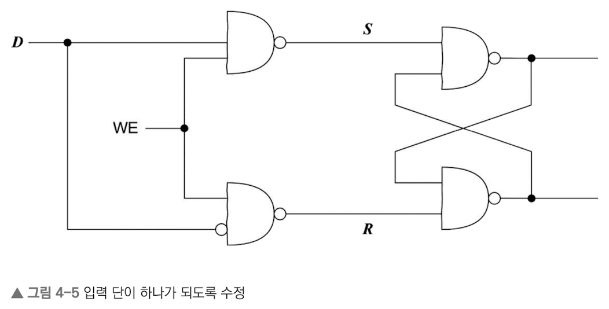

# 컴퓨터 밑바닥의 비밀

## Chapter 01. 프로그래밍 언어부터 프로그램 실행까지, 이렇게 진행된다

- 프로그래밍 언어는 컴퓨터 과학의 작은 일부분일뿐이다.

### 1.1 여러분이 프로그래밍 언어를 발명한다면?

- CPU는 결국 수많은 스위치의 집합체이다.
  - 스위치는 0과 1의 두 가지 상태를 가진다.

#### 1.1.1 창세기: CPU는 똑똑한 바보

- CPU는 단순 작업에 매우 효과적이고 빠르다.
- 그러나 초기 프로그래밍에서는 별도의 언어가 없어서 CPU의 명령어를 직접 작성해야 했다.
  - 천공카드, 천공테이프, 천공테이프 리더기 등의 기계를 사용했다.
- 예시

    ```binary
    00101001 00000000 00000000 00001000
    00101001 00000000 00000000 00001000
    ```

#### 1.1.2 어셈블리어 등장

- 이후 CPU가 수행하는 것은 결국 단순한 몇 개의 명령어라는 것을 알게 되었다.
  - 가산, 점프, 저장 등의 명령어 등
- 이 명령어를 사람이 이해할 수 있는 언어로 변환한 것이 어셈블리어이다.
- 예시

    ```assembly
    sub $8, %rsp
    mov $.LC0, %edi
    call puts
    mov $0, %eax
    ```

- 이러한 어셈블리어를 사용하면 CPU의 명령어를 직접 작성하는 것보다는 훨씬 편리하다.
- 그러나 이러한 어셈블리어를 바이너리로 변환하는 과정이 필요하다.

#### 1.1.3 저수준 계층의 세부 사항 대 고수준 계층의 추상화

- 어셈블리어는 사람이 인식할 수 있지만 여전히 저수준 언어이다.
  - 결국 작성자가 모든 세부 사항을 신경써야 한다.
- 이러한 어셈블리어를 추상화한 것이 고급 프로그래밍 언어이다.

#### 1.1.4 가득한 규칙: 고급 프로그래밍 언어의 시작

- 어셈블리어로 작성하는 코드에서 특정한 패턴이 발견되었고, 이를 추상화하여 고급 프로그래밍 언어를 만들었다.
  - 조건문, 반복문 및 함수 호출 등의 패턴이 추상화되었다.

#### 1.1.5 <인셉션>과 재귀: 코드 본질

- 조건문, 반복문 등으로 구성된 코드는 여러 번 중첩 될 수 있으며, 이는 결국 재귀로 표현 할 수 있다.
- 이렇게 재귀로 표현되는 최소 단위의 표현을 구문(syntax)이라고 한다.

#### 1.1.6 컴퓨터가 재귀를 이해하도록 만들기

- 위에서 말한 것 처럼 재귀적으로 표현되는 구문을 컴퓨터가 이해할 수 있도록 만들어야 한다.
- 이를 위해 구문을 트리 구조로 변환한다.

#### 1.1.7 우수한 번역가: 컴파일러

- 위에서 말한 여러 과정을 처리하는 프로그램을 컴파일러라고 한다.
  - 컴파일러는 작성된 코드를 파싱하여 트리 구조로 변환하고, 이를 기계어로 변환한다.

#### 1.1.8 해석형 언어의 탄생

- 다양한 CPU의 구조를 고려하여 매번 컴파일하는 것은 매우 번거롭다.
- 이를 해결하기 위해 해석형 언어가 등장했다.
  - 해석형 언어는 표준 명령어라는 중간 단계를 거쳐 CPU에 맞게 변환된다.

#### 정리 및 과제

> 본인이 사용하는 언어가 코드 -> 표준 명령어 -> 인터프리터 -> CPU 과정을 어떤 식으로 수행하는지 알아보자.

- Javascript의 경우
  - 렉싱 -> 파싱 -> AST -> 바이트코드 -> 인터프리터(Ignition, 빠른 실행) -> 인터프리터(TurboFan, 최적화) -> CPU

### 1.2 컴파일러는 어떻게 작동하는 것일까?

- 컴파일러의 사용은 매우 간단하다. 그러나 이 이면에는 많은 과정이 숨어 있다.

#### 1.2.1 컴파일러는 그저 일반적인 프로그램일 뿐, 대단하지 않다.

- 컴파일러
  - 고수준 언어를 저수준 언어로 번역하는 프로그램.
  - 복잡도가 높은 프로그램이지만, 결국 일반적인 프로그램일 뿐이다.

#### 1.2.2 각각의 토큰 추출하기

- 컴파일러가 가장 먼저 하는 일은 소스 코드를 토큰으로 분리하는 것이다.
- 이 과정을 어휘 분석(lexical analysis; lexing)이라고 한다.
  - 예시
    - 원본 코드
     
      ```c
      int a = 1;
      int b = 2;

      while (a < b) {
        b = b - 1;
      }
      ```
    
    - 토큰화된 코드

      ```
      T_Keyword    int
      T_Identifier a
      T_Assign     =
      T_Int        1
      T_Semicolon  ;
      T_Keyword    int
      ...
      ```

#### 1.2.3 토큰이 표현하고자 하는 의미

- 렉싱을 거친 토큰을 이용하여 해석(parsing)을 진행한다.
- 이 과정에서 문법적 오류를 확인하고, 구문 트리(syntax tree)를 생성한다.

#### 1.2.4 생성된 구문 트리에 이상은 없을까?

- 컴파일(해석) 과정에서 문법적 오류를 확인하기에 구문 트리에는 문법적 오류가 없다.
- 그러나 아직 의미적 오류는 확인하지 않았고, 이에 대한 검사가 필요하다.
- 이 과정을 의미 분석(semantic analysis)이라고 한다.
  - 정수에 문자열을 더하거나, 비교의 좌우에 다른 타입의 변수를 사용하는 등의 오류를 확인한다.

#### 1.2.5 구문 트리를 기반으로 중간 코드 생성하기

- 의미 분석을 통과한 구문 트리를 기반으로 중간 코드를 생성한다.
  - 중간 코드(Intermediate Representation; IR)는 CPU에 종속되지 않는 코드이다.
  - 이 과정에서 최적화가 진행되기도 한다.

#### 1.2.6 코드 생성

- 중간 코드를 기반으로 CPU에 맞는 어셈블리어로 변환하고, 다시 이를 기계어로 변환한다.
- 하지만 지금까지의 과정은 하나의 파일에 대한 컴파일이었고, 여러 파일을 컴파일 할 때는 링크(link)라는 과정이 필요하다.

### 1.3 링커의 말할 수 없는 비밀

- 정적 라이브러리와 동적 라이브러리를 사용할 때, 내부적으로 링크 과정이 진행된다.

#### 1.3.1 링커는 이렇게 일한다

- 링커도 컴파일러와 마찬가지로 일반적인 프로그램일 뿐이다.
- 링커는 컴파일러가 만들어낸 여러 파일을 하나로 묶어 하나의 실행 파일을 만든다.
- 이러한 과정은 저자 여러명이 작성한 챕터를 하나로 묶어 하나의 책을 출간하는 것과 유사하다.
  - 도서에서도 특정 장이 다른 장의 내용에 의존하는 경우가 있는데, 이런 종속성을 확인하는 것이 링크의 역할이다.
  - 또한 참조된 페이지가 아직 정확하지 않으므로 컴파일러가 임시로 N쪽이라고 표시한 것을 실제 페이지 번호로 변경하는 것도 링크의 역할이다.

#### 1.3.2 심벌 해석: 수요와 공급

- 심벌(symbol)은 변수나 함수 등의 이름을 의미한다.
- 링커는 이러한 심벌을 해석하여 참조된 심벌이 존재하는지, 하나만 존재하는지를 확인한다.
  - 링커 혼자서는 이러한 정보를 알 수 없고, 컴파일러가 이 정보를 제공한다.
    - 컴파일러가 생성한 대상 파일에는 여러 목적을 가진 영역이 존재한다.
      - 코드 영역: 소스 파일의 함수가 변환된 기계 명령어가 저장되는 부분
      - 데이터 영역: 소스 파일의 전역 변수가 저장되는 부분
      - 심벌 테이블: 공급과 수요, 즉 외부에서 참조 가능한 심벌의 목록과, 참조하고 있는 외부 심벌의 목록이 저장되는 부분
- 즉, 심벌 해석은 대상 파일에서 사용할 외부 심벌을 심벌 테이블에서 찾을 수 있는지 확인하는 과정이다.

#### 1.3.3 정적 라이브러리, 동적 라이브러리, 실행 파일

- 정적 라이브러리(.a, .lib)
  - 의존성을 가진 여러 파일을 각각 컴파일하여 하나의 실행 파일로 만드는 방식
  - 정적 링크(static linking)를 통해 실행 파일을 만든다.
  - 따라서 전체 코드를 매번 컴파일하는 것에 비해 빠르다.
  - 그러나 표준 라이브러리 등을 사용할 때에는 모든 프로그램이 동일한 라이브러리를 사용하므로 중복되는 코드가 많아진다.
    - 그만큼 저장 공간도 낭비하게 되고, 업데이트가 필요할 때 모든 프로그램을 업데이트해야 한다.

- 동적 라이브러리(.so, .dll)
  - 최소한의 정보(이름, 심벌 테이블, 재배치 정보 등)만을 실행 파일에 저장함.
  - 동적 링크(dynamic linking) 과정을 통해 실제 라이브러리를 실행 파일에 연결한다.
  - 동적 링크에는 두 가지 방식이 존재한다.
    - 첫 번째 방식은 프로그램이 메모리에 적재될 때 동적 링크를 수행하는 방식이다.
    - 두 번째 방식은 프로그램의 실행 시간(runtime)에 동적 링크를 수행하는 방식이다.

#### 1.3.4 동적 라이브러리의 장단점

- 장점
  - 동적 라이브러리에 의존하는 프로그램의 개수와 상관없이 동적 라이브러리는 하나만 저장된다.
    - 이런 특징으로 인해 공유 라이브러리(shared library)라고도 불린다.
  - 코드가 수정되는 경우에도 하나의 라이브러리만 업데이트하면 되므로 관리가 편리하다.
  - 플러그인이나 확장 모듈을 만들 때 유용하다.

- 단점
  - 실행 시간에 동적 링크를 수행하므로 정적 링크에 비해 실행 시간이 느리다.
  - 메모리 주소와 독립되어 있어 독립 코드(position-independent code)라고도 불린다.
  - 메모리에 단 하나의 복사본만 존재하고, 이것이 공유되므로 임의의 절대 주소를 참조할 수 없다.
  - 동적 라이브러리를 사용한 경우, 실행파일만으로는 실행이 불가능하다. 별도의 종속성 라이브러리의 설치가 필요하다.

#### 1.3.5 재배치: 심벌의 실행 시 주소 결정하기

- 어셈블리어로 작성된 코드를 보면, 변수 정보가 없고 메모리 주소를 직접 참조한다.
- 링커는 프로그램 실행 시 함수가 적재될 메모리 주소를 결정해야 한다. 그러나 이를 혼자서는 알 수 없다.
- 그렇기에 컴파일 과정에서 컴파일러가 임시로 메모리 주소를 할당한다.
  - 이를 .relo.text, .relo.data 등의 재배치 정보(relocation information)라고 한다.
- 링커는 이 정보를 이용하여 실행 시 메모리 주소를 결정한다. 이 과정을 재배치(relocation)라고 한다.
- 그러나 이 과정에서도 링커가 절대 주소를 알 수 없다. 따라서 가상 메모리(virtual memory)를 사용한다.

#### 1.3.6 가상 메모리와 프로그램 메모리 구조

- 프로그램이 실행된 후 메모리의 상태
  - 커널, 스택, 여유 공간, 힙, 데이터, 코드 등의 영역이 존재한다.
    - 스택: 메모리의 상위 영역에 위치하며, 함수 호출 시 사용되는 지역 변수, 함수의 인자, 함수의 반환 주소 등이 저장된다.
    - 힙: 메모리의 하위 영역에 위치하며, 동적 할당된 메모리가 저장된다.
    - 데이터: 전역 변수, 정적 변수, 문자열 등이 저장된다.
    - 코드: 프로그램 코드가 저장된다.
- 모든 프로그램은 예외 없이, 코드 영역의 시작주소가 `0x400000`이다. 이는 동시에 여러 프로그램을 실행해도 동일하다.
  - 이는 운영체제의 `가상 메모리`를 사용하기 때문으로, 모든 프로그램은 자신이 전체 메모리를 독점하는것 처럼 착각하게 된다.
- 이로인해 링커는 실제 데이터가 물리 메모리의 어디에 위치하는지 알 필요가 없어진다.
- 운영체제는 이러한 가상메모리 관리를 위해 메모리 페이지(memory page) 단위로 매핑한다.
  - 이렇게 기록된 자료를 페이지 테이블(page table)이라고 한다.

- 다시 정리하자면,
  - 모든 프로세스의 가상 메모리는 표준화되어있고, 동일한 크기를 가진다.
  - 가상 메모리의 각 영역의 크기는 다를 수 있어도, 배치되는 순서는 동일하다(스택, 힙, 데이터, 코드).
  - 실제 물리 메모리와 가상 메모리의 크기는 무관하다.
  - 물리 메모리에는 스택, 힙, 데이터, 코드 등이 구분되지 않는다.
  - 모든 프로세스는 자신만의 페이지 테이블을 가진다.

### 1.4 컴퓨터 과학에서 추상화가 중요한 이유

- 사람의 이름도 일종의 추상화다.
  - 이름이 없다면 한 사람을 특정할 때 수많은 부가정보가 필요하다.
  - 그러나 이름을 통해, 간편하고 빠르게, 불필요한 정보의 노출 없이 한 사람을 특정 할 수 있다.
- 이전장에서의 가상 메모리도 추상화의 한 예이다.
  - 프로그램은 자신이 전체 메모리를 독점하는 것처럼 착각하게 되지만, 실제로는 가상 메모리를 사용한다.
  - 이러한 추상화로 인해 프로그램은 메모리의 물리적 위치를 알 필요가 없어진다.

#### 1.4.1 프로그래밍과 추상화

- 프로그래머도 추상화를 통해 많은 이점을 얻을 수 있다.
  - 복잡한 문제를 단순화하여 해결할 수 있다.
  - 원하는 수준으로 프로그램의 복잡도를 제어 할 수 있다.

#### 1.4.2 시스템 설계와 추상화

- 컴퓨터 시스템은 기본적으로 추상화의 연속이다.
  - CPU를 사용할 때, 트랜지스터의 동작 원리를 알 필요가 없다.
    - 몇가지 추상화된 명령어를 사용하여 프로그램을 작성하면 된다.
  - 입출력 장치는 파일로 추상화되어 있다.
  - 실행중인 프로그램은 프로세스로 추상화되어 있다.
  - 물리 메모리는 가상 메모리로 추상화되어 있다.
  - 네트워크는 소켓으로 추상화되어 있다.
  - 프로세스와 프로세스에 종속적인 실행 환경은 컨테이너로 추상화되어 있다.
  - CPU, 운영체제, 응용프로그램은 가상 머신으로 추상화되어 있다.
- 그러나 보다 세밀한 조정을 위해서는 추상화를 넘어 기저 계층을 이해할 필요가 있다.

## Chapter 02. 프로그램이 실행되었지만, 뭐가 뭔지 하나도 모르겠다

- 프로그램은 어떻게 실행될까?
- 실행되고나면 그 모습은 어떻게 변화할까?
- 운영체제와 같은 것들은 왜 필요할까?
- 프로세스, 스레드, 코루틴은 대체 뭘까?
- 콜백함수, 동기화, 비동기화, 블로킹, 논블로킹은 무슨 뜻일까?
- 프로그래머가 이런 개념을 이해해야 하는 이유는 무엇일까?
- 이런 개념에서 프로그래머는 무엇을 할 수 있을까?
- 이런 개념으로 기계의 성능을 최대한 활용하려면 어떻게 해야 할까?

### 2.1 운영 체제, 프로세스, 스레드의 근본 이해하기

#### 2.1.1 모든 것은 CPU에서 시작된다

- CPU에는 혼란스러운 개념이 없고, 모든것이 명확하므로 시작하기에 좋다.
- CPU는 아래의 단 두 가지 사항만 알고있으며, 프로세스나 스레드가 무엇인지 알지 못한다.
  1. 메모리에서 명령어(instruction)를 읽어 가져온다(dispatch).
  2. 가져온 명령어를 실행(execute)하고, 다시 1로 돌아간다.
- CPU는 프로그램 카운터(program counter; PC)라는 레지스터를 가지고 있으며, 이는 다음에 실행할 명령어의 주소를 가리킨다.
  - 레지스터란 CPU 내부에 존재하는 메모리로, 매우 빠르게 접근할 수 있다.
- 그러나 이렇게 순차 접근만 가능하다면 if문이나 반복문을 사용할 수 없다.
  - 이를 위해 점프를 사용하여 PC 레지스터 값을 변경한다.
  
- 프로그램이 생성되고 실행되는 과정
  1. 프로그래머에 의해 소스 코드가 작성된다.
  2. 컴파일러가 이를 기계어(실행 파일)로 변환한다.
  3. 실행 파일이 디스크에 저장된다.
  4. 실행 파일이 메모리에 적재된다.
  5. CPU가 실행 파일을 실행한다.

- 여기에서 프로그래머가 작성한 최초의 함수인 main 함수가 등장하고, 이 함수의 위치가 PC 레지스터에 저장되어 처음으로 실행된다.

#### 2.1.2 CPU에서 운영 체제까지

- CPU로 프로그램을 실행하려면, 위에서 알아본 절차대로 수동으로 진행하면 된다.
  - 이 과정에서 추가로 고려할 사항은 아래와 같다.
    - 프로그램을 적재 할 적절한 크기의 메모리 영역을 찾는다.
    - CPU 레지스터를 초기화하고 함수의 진입 포인트를 찾아 PC 레지스터에 저장한다.
  - 또한 이 경우 아래와 같은 단점을 가진다.
    - 한번에 하나의 프로그램만 실행이 가능하다.
    - 모든 하드웨어를 직접 드라이버와 연결하여 사용해야 한다.
    - 기본적인 라이브러리를 직접 관리해야 한다.

- 위와 같은 문제를 해결하기 위해, 운영 체제가 등장했다.

- 운영체제는 프로그램을 컨텍스트를 가진 프로세스로 추상화하여, 멀티태스킹을 구현한다.
  - 멀티 태스킹은 CPU가 여러 프로세스를 번갈아가며 실행하는 것을 의미한다.

#### 2.1.3 프로세스는 매우 훌륭하지만, 아직 불편하다

- 아래와 같은 코드가 있다고 하자

  ```c
  int main()
  {
    int resA = funcA();
    int resB = funcB();

    print(resA + resB);
    return 0;
  }
  ```

    - 위 코드에서 funcA와 funcB는 서로 독립적으로 실행될 수 있다.
    - 그러나 위 코드는 순차적으로 실행되므로, funcA가 끝나야 funcB가 실행된다.

- 만약 위의 코드를 멀티 프로세스로 실행한다면, funcA와 funcB는 독립적으로 실행될 수 있다.
  - 이러한 멀티 프로세스는 운영체제가 제공하는 기능이다.
  - 이러한 멀티 프로세스는 프로세스 간 통신(IPC)이 필요하다.
    - IPC는 프로세스 간 데이터를 주고 받는 방법을 의미한다.
    - 이는 매우 복잡하고, 오버헤드가 크다.

#### 2.1.4 프로세스에서 스레드로 진화

- 프로세스의 주소 공간에는 CPU가 실행하는 기계 명령어와 함수가 실행되는 스택 정보가 존재한다.
- 이러한 스택 정보를 별도로 관리하여, 프로세스 내에서 독립적으로 실행되는 스레드를 만들 수 있다.
  - 이러한 스레드는 프로세스 주소 공간을 공유하므로, IPC가 필요 없다.
- 따라서 위의 코드를 스레드로 실행하면, funcA와 funcB가 동시에 실행되게 할 수 있고, IPC가 필요 없다.
- 이런 이유로 스레드를 경량 프로세스라고도 부른다.
- 물론 CPU에 멀티 코어가 있어야만 다중 스레드가 가능한 것은 아니다.
  - 앞서 말했듯, CPU는 스레드와 프로세스를 모른다.

- 그러나 스레드에도 단점은 존재한다.
  - 앞서 말했듯 주소 공간을 공유하므로, 스레드 간 리소스 공유에 주의해야 한다.
  - 따라서 프로그래머는 상호 배제(mutual exclusion)와 동기화(synchronization)를 고려해야 한다.

#### 2.1.5 다중 스레드와 메모리 구조

- 스레드는 프로세스의 주소 공간을 공유하므로, 스레드 간 데이터 공유가 가능하다.
- 그러나 각 스레드는 독립적인 스택을 가진다.
  - 즉 주소 공간에 독립적인 스택이 생성되므로, 스레드를 만들면 메모리의 공간이 소모된다.

#### 2.1.6 스레드 활용 예

- 스레드가 처리하는 작업의 종류
  - 긴 작업(long task): 파일을 읽고 쓰는 작업
  - 짧은 작업(short task): 짧은 네트워크 요청, 데이터베이스 쿼리 등
    - 하나의 작업은 짧으나 매우 많은 요청이 들어온다.
      - 이런 경우 매 요청당 스레드를 생성하면(요청당 스레드; thread per request) 큰 오버헤드가 발생한다.
        - 스레드의 생성과 종료에 자원이 소비된다.
        - 스레드마다 독립된 스택을 가지므로, 메모리 소비가 크다.
        - 스레드 전환에도 오버헤드가 발생한다.

- 위와 같은 이유로 스레드 풀(thread pool)이 등장했다.

#### 2.1.7 스레드 풀의 동작 방식

- 스레드 풀의 개념은 매우 간단하다.
  - 미리 스레드를 생성해 놓고, 요청이 들어오면 이를 할당하는 방식이다.
  - 이를 통해 스레드 생성과 종료에 따른 오버헤드를 줄일 수 있다.
- 이 과정에서 스레드 풀은 큐를 사용한다.
  - 생산자-소비자 패턴을 사용한다.
  - 요청이 들어오면 큐에 저장하고, 스레드 풀에서 스레드를 할당하여 처리한다.
  - 이를 통해 요청이 많아져도 스레드 풀의 스레드 수만큼만 처리하면 되므로, 오버헤드를 줄일 수 있다.

- 스레드 풀에 전달되는 작업은 두 가지 사항을 포함한다.

  ```c
  struct Task
  {
    void* data;
    handler handle;
  }
  ```

    - 처리할 데이터
    - 처리할 함수

- 스레드 풀의 동작 방식
  1. 스레드 풀이 생성되면, 스레드를 생성하고 큐를 생성한다.
    - 처음엔 스레드 풀의 스레드는 블로킹 상태로 대기한다.
  2. 스레드 풀에 작업이 들어오면, 큐에 저장한다.
  3. 스레드 풀의 스레드는 큐에서 작업을 가져와 처리한다.
    - 앞서 알아본 구조체의 handle 함수를 호출하여 data를 처리한다.
    - 이 때 큐에 대해 상호배제(mutual exclusion)를 반드시 처리해야 한다.
  4. 작업이 완료되면, 결과를 반환하고 다음 작업을 처리한다.

- 예시 코드

  ```c
  while (true)
  {
    struct task = GetFromQueue(); // 큐에서 작업을 가져온다.

    task->handle(task->data); // 작업을 처리한다.
  }
  ```

#### 2.1.8 스레드 풀의 스레드 수

- 스레드 풀의 스레드 수는 중요한 요소이다.
  - 반면 스레드 풀의 스레드 수가 너무 적으면, CPU를 활용하지 못하게 된다.
  - 스레드 풀의 스레드 수가 너무 많으면, 메모리 소비가 커지고, 스레드 전환에 오버헤드가 발생한다.
- 판단의 근거는 작업의 종류와 시간이다.
  - CPU 바운드 작업: CPU를 많이 사용하는 작업
    - CPU 바운드 작업은 CPU 코어 수만큼 스레드를 생성하는 것이 좋다.
  - I/O 바운드 작업: I/O를 많이 사용하는 작업
    - I/O 바운드 작업은 N * (1 + 대기시간 / 처리시간)의 공식을 사용한다.
      - 대기시간과 처리시간이 비슷하다면, 스레드 수는 `CPU 코어 수 * 2`와 비슷하다.
- 그러나 위의 수치는 이론적인 수치이며, 실제로는 테스트를 통해 적절한 수치를 찾아야 한다.

### 2.2 스레드 간 공유되는 프로세스 리소스

- 프로세스: 운영체제가 리소스를 할당하는 기본 단위
- 스레드: 프로세스 내에 존재하는 실행 단위. 스케줄링의 기본 단위
  - 따라서 프로세스의 리소스는 스레드 간 공유된다.
  - 그러나 스레드간 공유되지 않는 리소스(스레드 전용)도 존재한다.

#### 2.2.1 스레드 전용 리소스

- 상태변화의 관점에서 스레드는 사실 함수 실행일 뿐임.
  - 기본적인 main 함수의 실행과 다를 바 없는 실행 흐름에 스레드라는 이름을 붙인 것임.
- 함수의 실행 정보 저장을 위해 `스택 프레임`(3장 참조)을 사용함.
  - 함수의 반환값, 매개변수, 지역변수 및 레지스터 정보 등을 저장함.
- 이러한 스택 프레임은 프로세스의 주소 공간 중 스택 영역에 저장됨
  - 따라서 스레드가 여러개라면 스택 영역도 여러 개 존재함.
- 결론적으로 프로세스의 스택 영역에 속한 정보(스레드 컨텍스트)는 스레드 전용이라는 것을 알 수 있음.
  - 스레드 영역을 제외한 나머지 영역은 스레드 간 공유됨.

#### 2.2.2 코드 영역: 모든 함수를 스레드에 배치하여 실행할 수 있다

- 프로세스 주소 공간 중 코드 영역에는 프로그램 코드가 저장됨.
  - 이 코드는 CPU가 실행하는 기계어로 변환된 명령어들임.
  - 이 정보는 프로그램 실행 시 메모리에 적재됨.
- 이러한 코드 영역은 모든 스레드가 공유함.
  - 따라서 모든 스레드는 동일한 프로그램 코드를 실행함.
- 그러나 코드 영역은 읽기 전용이므로, 스레드 세이프(thread safe)함.
  - 즉, 동시에 여러 스레드가 코드 영역에 접근해도 문제가 발생하지 않음.

#### 2.2.3 데이터 영역: 모든 스레드가 데이터 영역의 변수에 접근할 수 있다

- 프로세스 주소 공간 중 데이터 영역에는 전역 변수, 정적 변수, 문자열 등이 저장됨.
  - 이러한 데이터 영역은 프로세스의 시작과 함께 생성되며, 프로세스의 종료와 함께 소멸됨.
- 데이터 영역도 코드 영역과 마찬가지로 모든 스레드가 공유함.
  - 따라서 모든 스레드는 동일한 데이터 영역의 변수에 접근할 수 있음.
- 그러나 데이터 영역은 읽기/쓰기가 가능하므로, 스레드 세이프하지 않음.
  - 따라서 스레드 간 데이터 공유 시 주의가 필요함.

#### 2.2.4 힙 영역: 포인터가 핵심이다

- 프로세스 주소 공간 중 힙 영역에는 동적 할당된 메모리가 저장됨.
  - C/C++의 `malloc`, `free`, `new`, `delete` 등의 함수를 사용하여 메모리를 할당하고 해제함.
- 힙 영역도 코드 영역과 마찬가지로 모든 스레드가 공유함.

#### 2.2.5 스택 영역: 공유 공간 내 전용 데이터

- 프로세스 주소 공간 중 스택 영역에는 함수의 실행 정보가 저장됨.
- 이러한 스택 영역은 스레드 전용임.
- 그러나 엄밀히 말하면, 스택 영역은 스레드 전용이라고 할 수 없음.
  - 다른 스레드의 스택 영역의 메모리 주소를 안다면, 다른 스레드의 스택 영역에 접근할 수 있음.
  - 즉, 프로세스처럼 완전히 격리되어 접근할 수 없는 것은 아님.
- 이러한 느슨한 격리방식으로 인해 스택 영역을 편리하게 사용할 수 있지만, 그만큼 주의가 필요함.

#### 2.2.6 동적 링크 라이브러리와 파일

- 앞서 동적 라이브러리의 코드와 데이터는 프로그램 실행 시 메모리에 적재된다고 하였음.
- 이러한 동적 라이브러리는 프로세스 주소 공간의 여유 공간에 적재됨.
  - 스택 영역과 힙 영역의 사이의 여유공간에 적재됨.
  - 즉, 모든 스레드가 해당 자원을 공유함

#### 2.2.7 스레드 전용 저장소

- 스레드 전용 저장소(thread local storage; TLS)는 스레드 전용 데이터를 저장하는 공간임.
  - 이는 스레드 전용 데이터를 저장하기 위한 전역 변수와 같은 역할을 함.
  - 모든 스레드에서 변수에 접근 할 수 있음.
  - 그러나 이 변수의 인스턴스는 스레드마다 별도로 생성되어, 변경시에도 다른 스레드에 영향을 주지 않음.

- 코드 예시
  - 일반적인 전역 변수

    ```cpp
    int a = 1; // global variable

    void print_a()
    {
      cout << a << endl;
    }

    void run()
    {
      ++a;
      print_a();
    }

    void main()
    {
      thread t1(run);
      t1.join(); // 2

      thread t2(run);
      t2.join(); // 3
    }
    ```
  
  - TLS를 사용한 전역 변수

    ```cpp
    __thread int a = 1; // TLS variable

    // ...

    // 출력 결과
    // 2
    // 2
    ```

      - `__thread` 키워드를 사용하여 TLS 변수를 선언함.
      - 이 변수는 스레드마다 별도로 생성되어, 다른 스레드에 영향을 주지 않음.

### 2.3 스레드 세이프 코드는 도대체 어떻게 작성해야 할까?

#### 2.3.1 자유와 제약

- 스레드 세이프 코드는 공공장소를 예를 들어 설명할 수 있다.
- 스레드가 자신만의 데이터를 사용한다면, 이는 당연히 스레드 세이프하다.
- 그러나 스레드가 공유 데이터를 사용한다면, 공공시설을 사용하는 것 처럼 주의가 필요하다.
  - 다른 스레드의 공유 리소스 사용 순서를 방해하지 않아야 한다.

#### 2.3.2 스레드 세이프란 무엇일까?

- 스레드 세이프
  - 여러 스레드가 동시에 호출되어도, 프로그램의 동작이 올바르게 보장되는 것을 의미한다.

#### 2.3.3 스레드 전용 리소스와 공유 리소스

- 스레드 전용 리소스
  - 함수의 지역 변수
  - 스레드의 스택 영역
  - 스레드 전용 저장소
- 공유 리소스: 각종 락, 세마포어 등을 사용해 동기화가 필요한 리소스
  - 힙 영역
  - 데이터 영역
  - 코드 영역: 읽기전용이므로 고려하지 않아도 된다.

#### 2.3.4 스레드 전용 리소스만 사용하기

- 지역 변수만을 사용한 스레드 세이프 코드

  ```cpp
  int func()
  {
    int a = 1;
    int b = 1;

    return a + b;
  }
  ```

#### 2.3.5 스레드 전용 리소스와 함수 매개변수

- call by value 인 경우 스레드 세이프하다.

  ```cpp
  int func(int num)
  {
    num++;
    
    return num;
  }
  ```

- 아래처럼 포인터를 사용한 경우 주의가 필요하다.

  ```cpp
  int global_num = 1;

  int func(int* num)
  {
    ++(*num);

    return *num;
  }

  void thread1()
  {
    func(&global_num);
  }

  void thread2()
  {
    func(&global_num);
  }
  ```

    - 위 코드는 스레드 세이프하지 않다.
    - 이런 함수를 사용하는 경우 매개변수로 해당 스레드에 속하는 리소스를 사용해야 스레드 세이프하다.

#### 2.3.6 전역 변수 사용

- 전역 변수를 읽기전용으로 사용하는 경우 스레드 세이프하다.

  ```cpp
  int global_num = 1;

  int func()
  {
    return global_num;
  }
  ```

- 만약 쓰기 작업이 필요한 경우, 락 등을 사용하여 원자성을 보장해야 한다.

#### 2.3.7 스레드 전용 저장소

- TLS를 사용한 스레드 세이프 코드

  ```cpp
  __thread int global_num = 1;

  int func()
  {
    ++global_num;

    return global_num;
  }
  ```

#### 2.3.8 함수 반환값

- 함수가 값을 반환하는 경우(return by value)

  ```cpp
  int func()
  {
    int a = 100;
    return a;
  }
  ```

- 함수가 포인터를 반환하는 경우(return by reference)

  ```cpp
  int* func()
  {
    static int a = 100;

    return &a;
  }
  ```

#### 2.3.9 스레드 세이프가 아닌 코드 호출하기

- 스레드 세이프하지 않은 코드1

  ```cpp
  int global_num = 0;

  int func()
  {
    ++global_num;

    return global_num;
  }
  ```

- 스레드 세이프한 코드1

  ```cpp
  int funcA()
  {
    mutex l;

    l.lock()
    func();
    l.unlock();
  }
  ```

- 스레드 세이프하지 않은 코드2

  ```cpp
  int func(int * num)
  {
    ++(*num);

    return *num;
  }
  ```

- 스레드 세이프한 코드2: 위 함수를 스레드 세이프하게 호출하는 방법

  ```cpp
  void funcA()
  {
    int a = 100;
    int b = func(&a);
  }
  ```

#### 2.3.10 스레드 세이프 코드는 어떻게 구현할까?

- 다중 스레드 프로그래밍중 최대한 리소스를 공유하지 않는다.
- 스레드 전용 리소스와 스레드 공유 리소스를 구분한다.
- 기억 해 둘 처방전
  - 스레드 전용 저장소(Thread Local Storage; TLS)
    - 전역 변수가 필요한 경우, 스레드 전용 저장소로 사용 가능한지 먼저 고려한다.
  - 읽기 전용(Read Only)
    - 해당 리소스를 읽기 전용으로 사용해도 되는지 먼저 고려한다.
  - 원자성 연산(Atomic Operation)
  - 동기화 시 상호 배제(Mutual Exclusion in Synchronization)
    - 뮤텍스(Mutex), 세마포어(Semaphore), 스핀락(Spinlock) 등을 사용하여 상호 배제를 구현한다.

### 2.4 프로그래머는 코루틴을 어떻게 이해해야 할까?

- 코루틴이란, 함수의 실행을 중간에 멈추고 나중에 이어서 실행할 수 있는 기능을 제공하는 것.

#### 2.4.1 일반 함수

- 파이썬으로 구현한 일반적인 함수

  ```python
  def func():
    print('A')
    print('B')
    print('C')

  def foo():
    func();
  ```

    - foo()는 func()를 호출하고, func()는 순차적으로 실행되고 다시 foo()로 제어가 돌아온다.
    - 즉, 순차적으로 실행된다.
    - 이러한 함수를 `서브루틴(subroutine)`이라고 한다.

#### 2.4.2 일반 함수에서 코루틴으로

- 코루틴은 일반적인 함수와 같지만, 일시중지를 할 수 있다.

  ```python
  def func():
    print('A')
    yield
    print('B')
    yield
    print('C')

  def foo():
    co = func()
    next(co)
    next(co)
    print('in function foo')
    next(co)
  ```

    - 위 코드에서 `yield`는 일시중지를 의미한다.
    - `next(f)`는 다음 `yield`로 이동한다.
    - 즉, `func()`는 `A`, `B`, `C`를 순차적으로 출력하지 않고, `A`, `B`, `in function foo`, `C`를 각각 출력하고 매 번 일시중지한다.

#### 2.4.3 직관적인 코루틴 설명

- 일반적인 함수

  

- 코루틴

  

#### 2.4.4 함수는 그저 코루틴의 특별한 예에 불과하다

- 코루틴은 자신이 일시중지 될 때, 현재의 실행 상태를 저장했다가 나중에 이어서 실행할 수 있는 함수이다.
- 이는 운영체제가 스레드를 스케줄링하는 것과 비슷하다.
- 코루틴은 유저 모드에서 실행되는 스레드라고 볼 수 있다.
- 코루틴이 몇개가 생성되건 운영체제는 이를 알지 못한다.

#### 2.4.5 코루틴의 역사

- 코루틴은 스레드보다 이전에 등장했다.
- 스레드가 존재하지 않았기에, 동시 작업을 위한 개념으로 코루틴이 등장했다.
- 그러나 관심을 받지 못하다가, 최근 서버의 처리량을 높이기 위해 다시 주목받고 있다.

#### 2.4.6 코루틴은 어떻게 구현될까?

- 스레드의 구현과 본질적으로 차이가 없다.

- 스레드의 구현
  - 일시중지 될 때의 상태를 저장하고, 다시 실행될 때 이를 복원한다.
    - 스택 프레임에 CPU 레지스터 정보, 함수 실행 시 상태정보 등을 저장한다.
      

- 코루틴의 구현
  - 코루틴은 스레드와 마찬가지로 일시중지 될 때의 상태를 저장하고, 다시 실행될 때 이를 복원한다.
    - 힙 영역에 CPU 레지스터 정보, 함수 실행 시 상태정보 등을 저장한다.
      
        - 해당 주소공간에는 스레드 한개와 코루틴 두개가 존재한다.
        - 총 세 개의 실행 흐름이 존재한다.

### 2.5 콜백 함수를 철저하게 이해한다.

#### 2.5.1 모든 것은 다음 요구에서 시작된다

- A가 B에 의존하는데 모든 구현을 B가 맡는다면 A의 요구사항이 변경될 때 B도 변경되어야 한다.
  - 그러나 이러한 요구사항이 많아지게되면 복잡도가 증가한다.

- 예시

  ```cpp
  void make_donut()
  {
    ...
    if(TeamA)
    {
      form_A();
    }
    else if(TeamC)
    {
      form_C();
    }
    ...
  }
  ```

#### 2.5.2 콜백이 필요한 이유

- 프로그래머는 이미 변수를 많이 사용한다.
  - 이를 통해 값이 변경되는 경우 모든 값을 찾아서 변경할 필요 없이, 변수의 값을 일괄적으로 변경할 수 있다.
  - 이와 비슷하게, 함수도 변수처럼 이용 가능하다.

- 예시

  ```cpp
  void make_donut(func f)
  {
    ...
    f();
    ...
  }

  make_donut(form_A);
  ```

- 이와 같은 함수를 콜백 함수라고 한다.

#### 2.5.3 비동기 콜백

- 동기 코드

  ```cpp
  ...
  make_donut(form_D); // 오래 걸리는 작업
  something_important(); // 중요한 작업이지만 지체되고있다
  ```

- 비동기 코드

  ```cpp
  void real_make_donut()
  {
    ...
    f();
    ...
  }

  void make_donut(func f)
  {
    thread t(real_make_donut, f);
  }
  ```

    - 이렇게 사용하면 `make_donut()` 호출시 새로운 스레드가 생성되어, `form_D()`가 비동기적으로 실행된다.
    - 주의사항으로, `something_important()` 실행 시점에서 `form_D()`가 완료되지 않았을 수 있다.

#### 2.5.4 비동기 콜백은 새로운 프로그래밍 사고방식으로 이어진다

- 일반적으로 사람들은 동기적 사고방식에 익숙하다.
  - 그러나 콜백을 통해 비동기적 프로그래밍이 가능해졌고, 이는 새로운 프로그래밍 사고방식을 만들어냈다.
- 동기적 사고방식에서는 언제 어떤 일을 해야하는지 정확히 예측해서 일 할 수 있다.
- 비동기적 사고방식에서는 어떤 일을 해야한는지는 알고있지만, 언제 일을 해야하는지는 알 수 없다.
  - 언제 하게될지는 콜백을 전달받은 함수가 결정한다.

#### 2.5.5 콜백 함수의 정의

- 콜백함수란, 다른 코드에 매개변수로 전달되는 실행 가능한 코드이다.
- 특히 이런 콜백은 서드파티 라이브러리에서 많이 사용된다.
  - 이를 통해 서드파티 라이브러리의 사용자는 작성자의 구현 코드를 알 필요 없이, 콜백 함수만 전달하면 된다.
  - 사용자는 콜백 함수를 작성할 책임만 있고, 직접 호출하지는 않는다.

#### 2.5.6 두 가지 콜백 유형

- 동기 콜백
  - 콜백 함수가 호출되면, 호출자는 콜백 함수의 실행이 끝날 때까지 기다린다.
- 비동기 콜백
  - 콜백 함수가 호출되면, 호출자는 콜백 함수의 실행이 끝날 때까지 기다리지 않는다.
  - 지연 콜백(deferred callback)이라고도 한다.
  - 다중 코어 환경에서 더 효율적이다.

#### 2.5.7 비동기 콜백의 문제: 콜백 지옥

- 비동기 콜백의 가장 큰 단점은, 이해하기 어렵다는 것이다.
- 특히 비즈니스 로직이 복잡한 경우, 콜백 함수가 중첩되어 복잡해지는 경우가 있다.
  - 이를 `콜백 지옥(callback hell)`이라고 한다.

- 동기 코드 예시

  ```cpp
  a = GetServiceA();
  b = GetServiceB(a);
  c = GetServiceC(b);
  d = GetServiceD(c);
  ```

- 비동기 코드 예시

  ```cpp
  GetServiceA(function(a)
    {
      GetServiceB(a, function(b)
        {
          GetServiceC(b, function(c)
            {
              GetServiceD(c, function(d)
                {
                  ...
                }
              );
            }
          );
        }
      );
    }
  )
  ```

### 2.6 동기와 비동기를 철저하게 이해한다

#### 2.6.1 고된 프로그래머

- 동기와 관련된 키워드: 종속성, 연관성, 기다림
- 비동기와 관련된 키워드: 독립, 무관, 기다리지 않음, 동시성

#### 2.6.2 전화 통화와 이메일 보내기

- 전화통화: 동기
- 이메일 보내기: 비동기

#### 2.6.3 동기 호출

- 예시

  ```cpp
  funcA()
  {
    funcB(); // funcB가 끝날 때까지 기다린다.
    // ...
  }
  ```

    - 일반적으로 `funcA`와` funcB`는 동일한 스레드에서 실행된다.
    - 프로그래머가 이해하기 쉽다.
    - 연산의 효율이 떨어진다.

#### 2.6.4 비동기 호출

- 비동기 호출의 두 가지 상황
  1. 호출자가 실행 결과를 신경쓰지 않는 경우
  2. 호출자가 실행 결과를 반드시 알아야하는 경우

- 호출자가 결과를 신경쓰지 않는 경우

  ```cpp
  void handler(void* buf)
  {
    // ...
  }

  read(buf, handler);
  ```

    - 호출자가 결과를 신경쓰지 않는 경우, `handler`를 통해 처리방법을 함꼐 전달하여 처리를 위임한다.

- 호출자가 결과를 반드시 알아야하는 경우

  ```cpp
  void handler(void* buf)
  {
    // ...
    notify();
  }

  read(buf);
  ```

    - 이 경우 호출자는 `notify()`를 통해 결과를 알 수 있다.
    - 결과를 알게된 호출자가 별도의 handler를 통해 결과를 처리한다.

#### 2.6.5 웹 서버에서 동기와 비동기 작업

- 가장 많은 형태의 비동기 요청은 데이터베이스 요청임.
- 일반적인 동기 처리의 예시

  ```cpp
  // 메인 스레드
  main_thread()
  {
    while (1)
    {
      요청 수신;
      A;
      B;
      C;
      데이터베이스 요청 및 결과대기;
      D;
      E;
      F;
      결과 반환;
    }
  }

  // 데이터베이스 스레드
  database_thread()
  {
    while (1)
    {
      요청 수신;
      데이터베이스 처리;
      결과 반환;
    }
  }
  ```

    - 위 경우 주 스레드에 대기 시간이 발생한다.

- 위 예시를 아래와 같이 비동기로 개선 할 수 있다.
  - 주 스레드가 데이터베이스 스레드의 처리 결과를 알 필요가 없을 떄
    - A, B, C를 주 스레드가 처리한 후, DB 작업과 이어지는 D, E, F는 데이터베이스 스레드에서 처리한다.
    - 이때 D, E, F함수의 실행을 위해 콜백함수를 전달한다.
      - 이후 처리 작업을 DB 스레드에 정의하지 않고 콜백을 사용하는 이유는 DB 스레드가 주 스레드에 종속되지 않기 위함이다.  

  - 주 스레드가 데이터베이스의 작업 결과를 알아야 할 때
    - 주 스레드는 작업 전달 수 이어지는 다른 작업(A2)을 처리한다.
    - DB 스레드가 처리한 결과를 주 스레드에 알린다.
    - 이후 주 스레드는 받은 결과를 가지고 후속 처리(D1, E1, F1)를 진행한다.

  - 다만 모든 경우에 비동기 처리가 무조건적으로 좋은 것은 아니다.
    - 동기 처리가 더 효율적인 경우도 있다.
    - 따라서 상황에 맞게 적절한 처리 방식을 선택해야 한다.

### 2.7 아 맞다! 블로킹과 논블로킹도 있다

#### 2.7.1 블로킹과 논블로킹

- 함수 A가 함수 B를 호출할 때, 운영체제가 함수 A를 실행중인 스레드나 프로세스를 중지시킨다면 함수 A는 블로킹되었다고 한다.
- 즉, 블로킹은 스레드 또는 프로세스가 일시중지되는것을 의미한다.

#### 2.7.2 블로킹의 핵심 문제: 입출력

- 일반적으로 블로킹은 I/O와 밀접하게 관련되어있다.
  - I/O 작업은 CPU 연산(GHz 단위)에 상대적으로 매우 느리기 때문이다.

#### 2.7.3 논블로킹과 비동기 입출력

- 논블로킹 함수를 사용하는 경우 호출 스레드가 정지되지 않고 recv함수를 즉시 반환한다.
- 이후 호출 스레드는 다른 작업을 수행한다.
- 데이터 수신 작업은 커널이 처리한다.

- 작업의 종료를 알 수 있는 세 가지 방법
  1. recv함수 외에 결과를 확인 할 수 있는 함수를 별도로 제공하고 이를 호출하여 결과를 확인한다.
  2. 데이터가 수신되면 스레드에 메시지나 신호를 전달한다.
  3. recv함수 호출 시 데이터 수신처리를 위한 콜백함수를 전달한다.

#### 2.7.4 피자 주문에 비유하기

- 크게 두 가지 경우로 나뉜다
  - 인내심이 강한 경우
    - 배송이 도착하면 알림을 받을 수 있으니 주문 이후 신경을 쓰지 않는다.
    - 그 시간에 다른 일을 처리한다.

  - 인내심이 부족한 경우
    - 매 5분마다 전화를 걸어 배송 상태를 확인한다.
    - 물론 이 경우에도 다른 일을 처리할 수 있지만, 효율적이지는 않다.
    - 확인의 간격이 짧아지거나, 다른 일을 처리할 수 없는 경우 사실상 동기식 처리가 된다.
    - 즉, 논블로킹이 반드시 비동기를 의미하는 것은 아니다.

#### 2.7.5 동기와 블로킹

- 모든 동기 호출이 블로킹인것은 아니다.
  - 간단한 가산 함수 등은 동기 호출이지만 블로킹되지 않는다.
- 블로킹 방식으로 호출된 경우, 이는 동기 호출이다.
  - 호출 스레드가 멈추게 되므로, 결과를 기다려야한다.

#### 2.7.6 비동기와 논블로킹

- 데이터를 수신하는 recv함수를 NON_BLOCKING_FLAG를 통해 논블로킹으로 호출한다.

  ```cpp
  void handler(void *buf)
  {
    // ...
  }

  while (true)
  {
    fd = accept();
    recv(fd, buf, NON_BLOCKING_FLAG, handler); // 논블로킹 호출
  }
  ```

    - 위 코드는 비동기이고, 논블로킹이다.

- 또다른 예시

  ```cpp
  void handler(void *buf)
  {
    // ...
  }

  while (true)
  {
    fd = accept();
    recv(fd, buf, NON_BLOCKING_FLAG); // 호출 후 바로 반환. 논블로킹

    while (!check(fd))
    {
      // 무한루프를 돌며 수신결과를 확인
    }
  }

  handler(buf);
  ```

    - 호출 자체는 비동기 호출이지만, while문을 통해 강제로 블로킹을 걸어놓은 경우이다.
    - 결과적으로 사실상 동기 호출이 된다.
    - 즉 논블로킹이라고 무조건 비동기를 의미하는 것은 아니다.

### 2.8  높은 동시성과 고성능을 갖춘 서버 구현

#### 2.8.1 다중 프로세스

- 가장 간단한 형태의 병행 처리 방식
- 리눅스에서는 fork 방식을 통해 여로 자식 프로세스를 생성한다.
  - 부모 프로세스가 요청을 수신하고, 자식 프로세스가 요청을 처리한다.

- 장점
  - 이러한 방법은 이해와 유지보수가 쉽다.
  - 또한 서비스가 독립적으로 동작하므로 안정성이 높다.
  - 다중 코어 환경에서는 여러 프로세스가 동시에 실행되므로 성능도 높다.

- 단점
  - 각 프로세스의 주소공간이 독립되어있으므로, 데이터 공유가 어렵다.
    - 프로세스 간 통신(IPC)이 필요하다.
  - 매 프로세스를 생성할 때 부담이 크고, 빈번하게 시작/종료되는 경우 오버헤드가 발생한다.

#### 2.8.2 다중 스레드

- 장점
  - 다중 스레드는 다중 프로세스와 비슷하지만, 주소공간을 공유한다.
    - 따라서 데이터 공유가 쉽다.
  - 프로세스에 비해 가벼우며, 스레드 생성/종료가 빠르다.

- 단점
  - 개발자가 항상 스레드 세이프한 코드를 작성하도록 유의해야 한다.
  - 스레드에 문제가 생기면, 해당 프로세스와 형제 스레드가 모두 종료되어 안정성이 떨어진다.

#### 2.8.3 이벤트 순환과 이벤트 구동

- 주요 개념
  - 이벤트 순환(event loop)은 이벤트를 처리하는 루프를 의미한다.
  - 이벤트 구동(event driven)은 이벤트가 발생하면 이벤트를 처리하는 방식을 의미한다.
  - 이벤트는 사용자의 입력, 네트워크 패킷 수신, 타이머 등 다양한 것이 될 수 있다.
    - 이러한 이벤트는 이벤트 핸들러에 의해 처리된다.

- 이벤트 기반 프로그래밍에서는 이벤트 루프가 계속 순환하며 이벤트 발생을 기다리고, 이벤트가 발생하면 이를 지정된 핸들러에 전달한다.
- 간단한 코드 예시

  ```cpp
  while (true)
  {
    event = getEvent();
    handler(event);
  }
  ```

    - 간소화된 코드이며, 크게 아래의 두 가지 문제가 있다.
      - getEvent() 함수로 어떻게 여러 개의 이벤트를 처리할 것인가?
      - handler() 함수가 꼭 이벤트 루프와 동일한 스레드에서 실행되어야 하는가?

#### 2.8.4 첫 번째 문제: 이벤트 소스와 입출력 다중화

- 리눅스, 유닉스 환경에서는 모든 것을 파일로 처리한다.
  - 파일, 소켓, 파이프, 터미널 등 모든 것을 파일로 처리한다.
  - 모든 프로그램은 파일 디스크립터를 통해 입출력을 처리한다.

- 이런 파일 디스크립터를 통해 이벤트를 처리하는 방식을 `입출력 다중화(I/O multiplexing)`라고 한다.
  - 리눅스에서는 `select`, `poll`, `epoll` 등을 사용한다.
  - epoll 예시

    ```cpp
    epoll_fd = epoll_create();

    Epoll_ctl(epoll_fd, fd1, fd2, fd3, fd4...);

    while (1)
    {
      int n = epoll_wait(epoll_fd);

      for (i = 0; i <n; i++)
      {
        // 이벤트 처리
      }
    }
    ```

#### 2.8.5 두 번째 문제: 이벤트 순환과 다중 스레드

- 이벤트 루프를 사용할 때, 작업이 가볍고 IO가 없다면 하나의 스레드에서 이를 모두, 순차적으로 처리 할 수 있다.
- 그러나 작업이 무거워진다면, 단일 스레드는 느려질 것이고 결국 다중 스레드가 필요해진다.
  - 이런 경우, 하나의 이벤트 루프 스레드가 다수의 워커 스레드에 작업을 분배하는 방식을 취한다.
  - 이를 리액터 패턴이라고 한다.
  - 이를 통해 다중 코어를 최대한 활용하여 요청에 대한 처리를 빠르게 처리 할 수 있다.

#### 2.8.6 카페는 어떻게 운영되는가: 반응자 패턴

- 카페와 식당을 별개의 예시로 드는 것이 더 적당할 듯.
- 카페와 같이 조리가 상대적으로 간단한 매장의 경우에는 주문과 음료 제조를 같은 직원이 실행 할 수 있다.
  - 이벤트를 수신한 이벤트 루프 스레드에서 직접 핸들러를 처리하여 결과를 리턴할 수 있다.
- 그러나 좀 더 조리가 복잡한 식당의 경우에는 주문을 받는 카운터가 있고 이에대한 처리는 부장의 요리사들이 처리한다.
  - 즉 이벤트 루프 스레드가 요청을 수신하고, 이를 워커 스레드 및 스레드 풀에 분배한다.

#### 2.8.7 이벤트 순환과 입출력

- 입출력 작업에 논블로킹 인터페이스가 있다면, 이벤트 루프에서 이를 직접 호출 할 수 있다.
  - 논블로킹 인터페이스가 즉시 결과를 리턴 해 주기 때문이다.
- 그러나 블로킹 인터페이스 뿐이라면, 이를 직접 호출 할 수 없다.
  - 호출 즉시 이벤트 루프가 멈춰버리기 때문이다.
  - 그러므로 워커 스레드가 필수적이다.

#### 2.8.8 비동기와 콜백 함수

- RPC(Remote Procedure Call): 네트워크 설정, 데이터 전송, 데이터 분석 등의 작업을 마치 같은 코드의 함수를 호출하듯 다른 서버로 요청을 보낼 수 있다.
- 이 과정에서 콜백을 사용해 블로킹 없이 처리할 수 있다.
  - 그러나 이로인해 복잡도가 매우 증가할 수 있다.

#### 2.8.9 코루틴: 동기 방식의 비동기 프로그래밍

- 코루틴을 사용한다면, 코루틴이 일시중지 되어도 스레드는 블로킹 되지 않는다.
- 이를 통해 코드를 동기식으로 작성하면서도 비동기와 같은 효과를 얻을 수 있다.
  - 즉, 워커 스레드가 다른 서버에 요청을 보내는 RPC 호출을 하더라도, 코루틴이 일시중지될 뿐 스레드는 다른 작업을 계속해서 진행 할 수 있다.

#### 2.8.10 CPU, 스레드, 코루틴

- 스레드: 커널 모드
- 코루틴: 유저 모드
  - 사용자 상태 스레드라고도 함.

- CPU가 스레드에 CPU시간을 할당하고, 이 스레드 내부에서 각각의 코루틴에 사용 시간을 배분한다.

### 2.9 컴퓨터 시스템 여행: 데이터, 코드, 콜백, 클로저에서 컨테이너, 가상 머신까지

#### 2.9.1 코드, 데이터, 변수, 포인터

- 함수: 명령어의 집합에 대한 별칭
- 변수: 특정한 데이터의 별칭
- 포인터, 참조: 데이터가 저장된 메모리 주소를 가리키는 별칭

#### 2.9.2 콜백 함수와 클로저

- 일급 객체 함수(first-class function): 함수(코드)를 변수에 저장하거나, 함수의 매개변수로 전달하거나, 함수의 반환값으로 사용할 수 있는 객체
- 콜백 함수: 다른 함수의 매개변수로 전달되는 함수
  - 콜백함수는 특성상 정의되는 위치와 사용되는 위치가 다르다.
  - 즉, 함수가 정의되는 위치에서 생성된 데이터를 사용 할 수 있어야 한다.
    - 이를 위해 클로저를 사용한다.

      ```python
      def add():
          b = 10

          def add_inner(x):
              return x + b
          
          return add_inner
      
      f = add()
      print(f(2))
      ```

        - 위 코드에서 `add_inner` 함수는 `add` 함수 내부에서 정의되었고, `add_inner` 함수는 `b` 변수를 사용할 수 있다.
        - 이러한 함수를 클로저라고 한다.

#### 2.9.3 컨테이너와 가상 머신 기술

- 앞서 함수가 일시중지되었다가 재개될 수 있는 경우를 코루틴이라고 했다.
- 또한, 일시중지가 커널 모드에서 일어난다면 이를 스레드라고 하였다.
- 그리고 이런 스레드를 포함하고, 주소공간과 리소스까지 결합한 개념이 프로세스이다.
- 이러한 프로세스를 위한 프로그램과 구성, 라이브러리 등의 실행환경을 모두 묶은 것을 컨테이너라고 한다.
- 이는 실생활에서 컨테이너화된 화물을 배에 실어 보내는 것과 비슷하다.
  - 컨테이너는 서로 격리되어있다.
  - 장기간, 반복 사용이 가능하다.
  - 표준화되어있어 적재와 하역이 빠르다.

### 2.10 요약

- 생략

## Chapter 03. 저수준 계층? 메모리라는 사물함에서부터 시작해 보자

- 컴퓨터의 주요 기능인 연산과 저장 중, 저장을 담당하는 메모리에 대해 알아본다.
- 메모리는 본질적으로 0과 1만을 저장할 수 있는 사물함이다.
  - 이를 추상화하여 다양한 영역과 개념들이 등장했다.
    - 힙 / 스택 / 데이터 영역
    - 가상 메모리
    - 메모리 할당과 해제
    - 메모리 누수

### 3.1 메모리의 본질, 포인터와 참조

- 주요 개념
  - 바이트(Byte), 구조체(Structure), 객체(Object), 변수(Variable), 포인터(Pointer), 참조(Reference) 등

#### 3.1.1 메모리의 본질은 무엇일까? 사물함, 비트, 바이트, 객체

- 앞서 다루었듯, 메모리는 0과 1만을 저장할 수 있는 사물함이다.
- 각각의 사물함을 메모리 셀이라고 하며, 이는 비트(0, 1)를 저장할 수 있다.
- 이러한 비트는 너무 작은 단위이므로, 8비트를 묶어 바이트(Byte)로 표현한다.
- 그러나 바이트(0~255)도 작은 단위이고 일반적으로 4바이트(32비트)를 묶어 하나의 정수를 표현한다.
- 서로 다른 정보 세 개(예를 들어 키, 나이, 몸무게)를 저장하려면 총 3개의 정수를 저장해야하며 총 12바이트를 사용한다. 이를 개념적으로 하나로 묶어 객체(Object) 혹은 구조체(Structure)라고 한다.

#### 3.1.2 메모리에서 변수로: 변수의 의미

- 매우 저수준의 언어로 직접 메모리를 다룬다면, 변수 저장을 위해 아래와 같이 메모리 주소를 직접 사용할 수 있다.

  ```
  store $1 6 // 메모리 주소 6에 1을 저장
  load r1 6  // 메모리 주소 6의 값을 레지스터 r1에 로드
  ```

- 사용의 편의를 위해 위에서 사용한 `메모리 주소 6`에 변수 `a`라는 이름을 붙여 사용하며, 이것이 변수의 의미이다.
- 즉 변수 a는 1을 가리키지만, 내부적으로 이는 `메모리 주소 6`을 가리키고, 그 안에 원하는 값인 1이 있다.

#### 3.1.3 변수에서 포인터로: 포인터 이해하기

- 위에서 변수의 내부적인 의미를 언급했다.
- 변수는 내부적으로 메모리 주소를 통해서 값을 저장하는 것이다.

- 다시 말해, 만약 데이터를 복사해야 하는 경우 메모리의 모든 값을 복사하는 대신 메모리의 주소만 가리키는 포인터를 사용할 수 있다.
- 즉 포인터는 메모리 주소를 한 단계 더 추상화한 것이다.
- 주소 간접 지정 연산자를 통해 포인터가 가리키는 메모리 주소의 값을 읽을 수 있다.

- 이러한 추상화된 포인터를 통해 메모리 내에 복잡한 데이터 구조를 저장하고, 이를 다룰 수 있다.

#### 3.1.4 포인터의 힘과 파괴력: 능력과 책임

- 포인터가 있는 언어에서 변수는 매우 뚜렷한 개념이 된다.
  - 이는 직접 명확한 메모리 주소(0x7fffd8ca7954)에 값이 저장되어있음을 의미하기 때문이다.
  - 이러한 포인터는 매우 강력한 도구이지만, 이로 인해 발생하는 문제도 매우 크다.
  - 포인터가 잘못된 메모리 주소를 가리키거나, 잘못된 메모리 주소에 값을 저장하면 프로그램 자체를 파괴할 수 있다.

#### 3.1.5 포인터에서 참조로: 메모리 주소 감추기

- 참조(reference)는 포인터와 비슷하지만, 포인터가 메모리 주소를 직접 다루는 반면 참조는 메모리 주소를 감춘다.
  - 예를 들어 '태진' 이라는 사람을 칭할때, 매번 그 사람이 위치한 위도와 경도를 정확하게 언급 할 수도 있다.
  - 그러나 이는 매우 불편하므로, '태진'이라는 이름을 사용한다.
- 이와같이 참조는 포인터의 강력함을 유지하면서도, 좀 더 안전하게 사용할 수 있게 해준다.
  - 다만 포인터와 달리 산술 연산이 불가능하다는 단점이 있다.

### 3.2 프로세스는 메모리 안에서 어떤 모습을 하고 있을까?

- 프로세스의 주소 공간
  - 커널, 스택 영역, 여유 공간, 힙 영역, 데이터 영역, 코드 영역으로 구성된다.

#### 3.2.1 가상 메모리: 눈에 보이는 것이 항상 실제와 같지는 않다

- 모든 프로세스의 코드 영역은 `0x400000`부터 시작한다.
- 즉 모든 프로세스가 동일한 주소 공간을 사용할 확률이 매우 높다.
  - 그러나 가상 메모리를 사용하기에 이러한 중복이 문제가 되지 않는다.
  - 실제 메모리에는 각각의 정보가 청크(Chunk)로 분할되어 저장된다.
    - 이러한 청크는 메모리 여건에 따라 무작위로 배치된다.
- 이를 구현하기위해 메모리와 가상 메모리 사이의 매핑이 필요하고, 이를 페이지 테이블이라고 한다.

#### 3.2.2 페이지와 페이지 테이블: 가상에서 현실로

- 가상 메모리와 물리 메모리가 매핑되어있다는 것은, 프로세스가 더이상 실제 물리 메모리의 주소를 알 필요가 없다는 것을 의미한다.
- 이러한 매핑을 유지하기 위해 페이지 테이블을 사용한다.
  - 페이지: 가상 메모리를 일정한 크기로 나눈 것
- 결과적으로, 각각의 프로세스가 가리키는 데이터의 주소가 동일하더라도, 실제 물리 메모리 주소는 다르다.

### 3.3 스택 영역: 함수 호출은 어떻게 구현될까?

```cpp
void func(int a)
{
  if(a > 100000000)
  {
    return;
  }

  int arr[100] = { 0 };

  func(a + 1);
}
```

  - 위 함수에 있는 문제점을 찾아보자.

#### 3.3.1 프로그래머를 위한 도우미: 함수

- 함수는 가장 기초적인 프로그래밍 구조이다.
- 함수를 통해 반복을 줄일 수 있다.
  - DRY(Don't Repeat Yourself) 원칙을 준수할 수 있다.
- 또한 함수도 일종의 추상화라고 볼 수 있다.
  - 함수를 통해, 세부적인 구현을 신경쓰지 않고 원하는 결과를 얻을 수 있다.

#### 3.3.2 함수 호출 활동 추적하기: 스택

- 함수들의 호출관계는 일종의 그래프 구조를 이룬다.
- 이러한 그래프를 탐색할 때 스택을 사용 할 수 있다.
  - 스택은 후입선출(LIFO) 구조로, 가장 최근에 들어온 데이터가 가장 먼저 나간다.

#### 3.3.3 스택 프레임 및 스택 영역: 거시적 관점

- 스택 활용해서 함수를 호출 할 수 있다는 것은 알았으나, 추가적인 정보가 필요하다.
  - 함수 호출 시, 함수의 매개변수, 지역 변수, 반환 주소 등을 저장해야 한다.
  - 이러한 정보 저장을 위해 스택 프레임(호출 스택)이라는 개념을 사용한다.

#### 3.3.4 함수 점프와 반환은 어떻게 구현될까?

- 함수 A가 함수 B를 호출하면, 제어권이 함수 B로 넘어간다.
  - 제어권이란, 당시 시점에서 실제 CPU가 실행하고있는 명령어가 어디에 속해있는지를 의미한다.
  - 이러한 제어권 이전에는 크게 두 가지 정보가 필요하다.
    - 반환(return): 어디에서 왔는지.
    - 점프(jump): 어디로 가야하는지.
  - 이를 좀 더 와닿게 설명하자면,
    - 함수 A의 명령어가 어디까지 실행되었는지(어디에서 왔는지)
    - 함수 B의 명령어가 어디에 위치해있는지(어디로 가야하는지)

- 제어권을 넘기는 과정
  - CPU는 함수 A를 실행 중 call 명령어와 특정 메모리 주소를 만난다.
  - 해당 메모리 주소의 명령어를 실행하면, 함수 B가 실행되며 제어권이 넘어간다.
    - 이 때 함수 A의 반환 주소를 스택 프레임에 저장한다.
    - 또한 함수 B의 스택 프레임을 생성한다.
    - 이후 함수 B를 계속 실행하며 마지막 명령어인 ret를 만나면, 반환 주소를 스택 프레임에서 꺼내어 함수 A로 제어권을 넘긴다.

#### 3.3.5 매개변수 전달과 반환값은 어떻게 구현될까?

- (x86_64 아키텍처 기준) 대부분의 매개변수 전달과 값 반환은 레지스터를 통해 이루어진다.
  - 함수 A가 B를 호출하면 함수 A의 매개변수는 레지스터에 저장되고 함수 B는 이를 사용한다.
  - 마찬가지로 함수 B는 리턴값을 레지스터에 저장하고, 함수 A는 이를 사용한다.
  - 그러나 레지스터의 개수가 제한되어 있으므로, 일부 매개변수는 스택을 통해 전달된다.

#### 3.3.6 지역 변수는 어디에 있을까?

- 지역 변수도 가능하다면 레지스터에 저장 할 수 있다.
  - 그러나 레지스터의 개수가 제한되어 있으므로, 일부 변수는 스택을 통해 저장된다.
  - 이러한 지역 변수는 함수 호출 시 생성되고, 함수 종료 시 소멸된다.
  - 이러한 지역 변수를 스택을 통해 관리하는 이유는, 지역 변수의 생명주기를 함수 호출과 종료에 맞추기 위함이다.
    - 이를 통해 개발자가 메모리 관리에 대한 부담을 덜 수 있다.

#### 3.3.7 레지스터의 저장과 복원

- 레지스터는 CPU의 리소스로, 레지스터를 이곳저곳에서 계속 사용한다면 문제가 생길 수 있다.
  - 이를 위해 스택 프레임에 레지스터의 초깃값을 저장하고, 함수 종료 시 이를 복원한다.
  - 이를 통해 함수 B가 함수 A의 레지스터를 덮어쓰더라도, 함수 A가 복원할 수 있다.

#### 3.3.8 큰 그림을 그려 보자, 우리는 지금 어디에 있을까?

- 맨 처음 보았던 함수의 문제점은, 스택 오버플로우가 발생할것이라는 것이다.
  - 해당 함수는 재귀적으로 호출되며 지나치게 많은 스택 프레임을 생성할 것이다.

- 위 사례처럼, 개발자는 항상 스택을 주의깊게 관리해야한다.
  - 너무 큰 지역 변수를 만들면 안된다.
  - 너무 많은 호출 단계를 거치면 안된다.
    - 지나친 재귀함수의 사용 등

### 3.4 힙 영역: 메모리의 동적 할당은 어떻게 구현될까?

#### 3.4.1 힙 영역이 필요한 이유

- 앞서 스택 프레임은 함수의 호출과 종료에 따라 생성 및 소멸되는 지역 변수를 저장하는 공간이라고 했다.
- 만약 특정 데이터를 여러 함수에 걸쳐 사용해야 한다면, 이를 전역 변수로 선언할 수 있다.
  - 그러나 전역 변수는 프로그램이 종료될 때까지 메모리를 차지하고, 의도치 않은 모든 모듈에 노출된다.
- 이를 해결하기 위해 힙 영역이 필요하다.
  - 힙 영역은 할당부터 해제까지 개발자가 직접 관리하는 큰 메모리 공간이다.
  - malloc, new, free, delete 등을 통해 메모리를 할당하고 해제한다.
- 다시 말하자면, 개발자가 수명 주기를 결정 할 수 있는 메모리 공간이다.

#### 3.4.2 malloc 메모리 할당자 직접 구현하기

- malloc은 메모리를 할당하는 함수이다.
  - 이는 C 표준 라이브러리에 포함되어있으며, 실행파일 생성 시 링커에 의해 링크된다.
  - 이로인해 개발자가 별도로 메모리 할당을 위한 코드를 작성할 필요가 없다.
- 만약 malloc을 직접 구현한다면 아래와 특징을 가진다.
  - 메모리 할당자는 적절한 크기의 메모리 영역을 제공하기만 하면 된다.
  - 데이터의 목적이나 저장되는 타입 등은 전혀 고려하지 않아도 된다.

#### 3.4.3 주차장에서 메모리 관리까지

- 메모리는 긴 주차장으로 비유할 수 있다.
  - 다만, 일반적인 주차장과는 다르게, 매우 작은 자전거나 매우 큰 트럭도 주차가 가능하다.
    - 즉, 요청받는 공간의 크기가 일정하지 않다.
- 가능한 한 빠르게 주차 위치를 찾아야 한다.
- 주차장 사용률을 최대화 해야 한다.

- 크게 네 가지 문제를 마주하게 된다.
  1. 어떤 공간이 사용중이고, 어떤 공간이 비어있는지 알아야 한다.
  2. 가능한 공간 중 어떤 공간을 반환해야 할지 결정해야 한다.
  3. 우리가 찾은 공간이 요구 공간보다 클 때, 남은 공간을 어떻게 처리할지 결정해야 한다.
  4. 출차로 인해 생긴 빈 공간을 어떻게 처리할지 결정해야 한다.


#### 3.4.4 여유 메모리 조각 관리하기

- 메모리를 관리하기 위한 자료구조를 만들고자 하면, 문제가 하나 발생한다.
  - 메모리 관리를 위한 자료구조를 메모리에 저장해야 한다.
- 이러한 자가당착에 빠지므로, 메모리 관리를 위한 정보는 메모리 그 자체에 함께 저장되어야 한다.

- 이를 위해 헤더를 사용한다.
  - 헤더는 할당된 메모리 영역의 크기, 사용 여부 등을 저장한다.
  - 이를 통해 메모리 관리를 위한 정보를 메모리에 함께 저장할 수 있다.
- 헤더에 표시된 페이로드의 크기를 통해, 다음 노드의 위치를 알 수 있다.

#### 3.4.5 메모리 할당 상태 추적하기

- 위에서 언급한 헤더를 통해 메모리 할당 상태를 추적하고, 이를 바탕으로 메모리를 조직화 할 수 있다.
- 또한 힙 영역의 마지막을 표시하기 위해, 마지막 블록을 특별히 표시한다.
  - 이를 sentinel block이라고 한다.

#### 3.4.6 어떻게 여유 메모리 조각을 선택할 것인가: 할당 전략

1. 최초 적합(first fit) 방식

- 메모리를 할당할 때, 가장 먼저 발견한 적합한 공간을 사용한다.
- 장점
  - 단순하다.
- 단점
  - 항상 처음부터 공간을 탐색하기에, 많은 메모리 조각을 탐색해야 한다.
  - 또한 앞부분에 작은 조각이 많이 남을 가능성이 있다.

2. 다음 적합(next fit) 방식

- 도널드 커누스가 제안한 방식으로, 마지막에 할당된 공간의 이후부터 탐색을 시작한다.
- 이론상 좀 더 빠르게 탐색할 수 있으나, 실제 메모리 사용률은 최초 적합보다 떨어진다는 것이 밝혀졌다.

3. 최적 적합(best fit) 방식

- 사용 가능한 메모리 조각을 모두 탐색
- 이 중 가장 작은 조각을 선택
- 장점
  - 메모리 사용률이 가장 높다.
- 단점
  - 탐색 시간이 오래 걸린다.

#### 3.4.7 메모리 할당하기

- 12바이트의 공간을 요청받으면, 16바이트의 공간을 할당한다.
- 첫 4바이트에 헤더를 저장하여 해당 공간의 크기를 저장하고 할당됨으로 표기한다.
- 이후 12바이트의 공간의 시작 주소를 반환한다.
  - 이 때, 헤더의 주소를 반환하지 않는다.
    - 헤더가 손상되면 메모리가 정상적으로 동작할 수 없기 때문이다.

- 그러나, 메모리 조각의 크기가 12바이트보다 큰 경우가 대부분일 것이다.
  - 예를 들어, 12바이트의 공간을 요청받았으나 확인된 최소 크기의 공간이 32바이트라면, 이를 전체 할당하는 경우 메모리가 낭비된다.
    - 따라서 확인된 공간을 적절히 분할하여 앞부분을 할당하고, 뒷부분은 새로운 여유 공간으로 남긴다.
    - 즉, 32바이트 중 헤더를 더한 16바이트를 할당하고, 나머지 16바이트는 새로운 여유 공간으로 남긴다.

#### 3.4.8 메모리 해제하기

- 메모리 해제는 더 간단하다.
- 헤더의 크기가 일정하므로, 메모리의 크기를 알 필요 없이 시작주소에서 4바이트만큼 빼면 헤더의 주소를 알 수 있다.
- 이후 해당 헤더의 할당여부를 해제로 표기한다.
  - 이 때, 가능하다면 앞뒤의 여유 공간을 합쳐서 하나의 큰 공간으로 만든다.
    - 다만 효율성을 위해 대부분의 메모리 할당자에서는 메모리 병합을 즉시 수행하지 않고 연기한다.

#### 3.4.9 여유 메모리 조각을 효율적으로 병합하기

- 위에서 말했듯, 앞뒤의 여유공간을 병합하는 것이 효율적이다.
  - 그런데 이 때, 뒤쪽 공간이 비어있는지는 쉽게 알 수 있으나 앞쪽 공간이 비어있는지는 현재로서는 알 수 없다.
  - 이를 위해 이전에 언급되었던 커누스가 푸터(footer)를 제안했다.
    - 푸터는 헤더와 동일한 정보를 가지고 있으며, 이를 통해 앞쪽 공간이 비어있는지 확인할 수 있다.
  - 푸터를 사용하여 메모리는 일종의 양방향 연결 리스트로 관리된다.

### 3.5 메모리를 할당할 때 저수준 계층에서 일어나는 일

#### 3.5.1 천지인과 CPU 실행 상태

- 코드에도 실행을 위한 네 가지(0, 1, 2, 3) 특권 단계가 있다.
  - 일반적으로 시스템은 0단계(커널 모드), 3단계(유저 모드)만 사용한다.
- 각각의 단계별로 사용 가능한 명령어와 메모리 영역이 다르다.

#### 3.5.2 커널 상태와 사용자 상태

- CPU가 운영체제의 코드를 실행할 때, 커널 모드에서 실행된다.
- 커널 모드에서는 CPU가 모든 기계 명령어를 사용 할 수 있으며, 제한 없이 하드웨어에 접근할 수 있다.

- 일반적으로 프로그래머가 작성한 코드는 유저 모드에서 실행된다.
  - 유저 모드에서는 일부 명령어와 메모리 영역에 제한이 있다.
  - 이를 통해 프로그램이 시스템에 악영향을 미치는 것을 방지한다.
  - 유저 모드에서 제한된 메모리 공간에 접근하는 경우 세그멘테이션 오류가 발생한다.

#### 3.5.3 포털: 시스템 호출

- 유저 모드에서는 파일 IO, 네트워크 통신 등을 직접 수행할 수 없다.
- 따라서 이를 위해 운영체제에 요청을 보내 커널 모드로 전환한다.
- 이러한 요청을 시스템 호출(system call)이라고 한다.

- 비유하자면, 각각의 프로세스를 클라이언트로, 운영체제를 서버로 볼 수 있다.
  - 클라이언트는 서버에 요청을 보내고, 서버는 이에 대한 응답을 보낸다.

#### 3.5.4 표준 라이브러리: 시스템의 차이를 감춘다

- 시스템 호출은 운영체제에 따라 다르다.
- 이를 위해 표준 라이브러리를 사용한다.
  - 표준 라이브러리는 시스템 호출을 추상화하여, 프로그래머가 특정 운영체제에 종속되지 않도록 한다.
  - 이를 통해 프로그래머는 표준 라이브러리를 사용하여, 운영체제의 차이를 신경쓰지 않고 프로그래밍을 할 수 있다.

#### 3.5.5 힙 영역의 메모리가 부족할 때

- 스택 영역은 메모리를 추가로 사용할 때 마다 주소 공간의 아래쪽으로 확장된다.
- 이와 비슷하게 힙 영역은 메모리를 추가로 사용할 때 마다 주소 공간의 위쪽으로 확장된다.
  - 그러나 스택과는 다르게, 힙 영역의 확장을 위해서는 시스템 콜이 필요하다.
    - 스택은 운영체제가 관리하므로 자동으로 확장된다.
    - 그러나 힙은 프로그래머가 직접 관리하므로, 확장을 위해 시스템 호출이 필요하다.
  - 이 때 사용하는 개념이 brk이다.
    - brk는 프로세스의 힙 영역의 끝을 나타내는 주소이다.
    - 이를 통해 프로세스의 힙 영역을 확장할 수 있다.

#### 3.5.6 운영 체제에 메모리 요청하기: brk

- 리눅스의 brk 시스템 호출은 프로세스의 힙 영역의 크기를 조정한다.
- 메모리 할당 단계
  1. 프로그램이 malloc을 호출한다.
    - malloc은 표준 라이브러리 함수이므로, 유저 모드에서 실행된다.
  2. malloc은 여유 메모리 조각을 탐색하고, 확인되면 이를 할당한다.
    - 여기까지는 유저 모드에서 처리된다.
  3. 여유 메모리 조각이 없다면, malloc은 brk 시스템 호출을 통해 운영체제에 힙 영역 확장을 요청한다.

#### 3.5.7 빙산의 아래: 가상 메모리가 최종 보스다

- 위와 같은 과정을 거쳐 메모리를 할당받지만, 이는 모드 가상 메모리를 통해 이루어진다.
- 실물 메모리의 할당은 실제로 메모리가 사용되는 순간에 이루어진다.
- 즉 malloc은 가상 메모리 할당을 요청할 뿐, 직접 메모리를 할당하지 않는다.

#### 3.5.8 메모리 할당의 전체 이야기

- malloc을 사용한 메모리 할당의 전체 과정
  1. 프로그램이 malloc을 호출한다.
  2. malloc이 여유 메모리 조각을 탐색하고, 확인되면 이를 할당한다.
  3. 여유 메모리 조각이 없다면, malloc은 brk 시스템 호출을 통해 운영체제에 힙 영역 확장을 요청한다.
  4. 시스템이 커널 모드로 전환되고, 운영체제의 가상 메모리 시스템이 힙 영역을 확장한다.
  5. 시스템이 유저 모드로 전환되고, malloc으로 제어권이 넘어간다.
  6. malloc은 확장된 힙 영역에서 메모리를 할당한다.
  7. 요청한 프로그램이 메모리를 읽거나 쓰려고 시도한다.
  8. page fault interrupt가 발생하고, 시스템이 커널 모드로 전환된다.
  9. 운영체제는 물리 메모리를 할당하고, 프로그램에 제어권을 넘긴다.

### 3.6 고성능 서버의 메모리 풀은 어떻게 구현될까?

- 범용 제품과 한정 제품
  - 범용 제품은 다양한 상황에서 사용할 수 있도록 설계된 제품이고, 대체로 최적화가 되어있지 않다.
  - 한정 제품은 특정 상황에서만 사용할 수 있도록 설계된 제품이고, 대체로 최적화가 되어있다.

#### 3.6.1 메모리 풀 대 범용 메모리 할당자

- 범용 메모리 할당자(malloc)
  - 표준 라이브러리 계층에 속한다.

- 메모리 풀
  - 응용 프로그램의 일부이다.
  - 범용성이 떨어져 특정 상황에서만 사용할 수 있다.

#### 3.6.2 메모리 풀 기술의 원리

- 메모리 풀은 한번에 큰 메모리를 할당받아, 이를 작은 조각으로 나누어 사용한다.
  - 이 방식으로 운영체제를 우회하여 메모리를 할당하고 해제할 수 있다.
  - 또한 특정 객체가 필요한경우, 이를 미리 할당해두고 필요할 때 사용하는 등의 최적화도 가능하다.

#### 3.6.3 초간단 메모리 풀 구현하기

- 간략화를 위해 사용자 요청 처리 시 단 한종류의 객체를 사용한다고 가정하자.
- 한번에 커다란 메모리를 할당하고, 이를 작은 조각으로 나누어 사용한다.
- 특정 객체만 사용한다는 가정하에, 유용하게 쓰일 수 있다.

#### 3.6.4 약간 더 복잡한 메모리 풀 구현하기

- 다양한 크기의 객체를 사용한다면, 필연적으로 메모리를 관리해야 한다.
- 이를 위해 메모리 조각들을 연결리스트로 연결하고, 포인터를 사용해 서로의 위치를 기록한다.
- 메모리가 부족해지면 malloc을 통해 추가적인 메모리를 요청해야 하는데, 이때 항상 기존 메모리의 두 배를 요청한다.
  - 이는 Cpp의 vector와 같은 방식이다.
    - 이러한 방식으로 지나치게 빈번한 메모리 할당을 방지할 수 있다.
- 또한 사용 가능한 메모리의 시작 위치를 나타내는 `Free_ptr` 포인터가 있어, 시작 지점을 빠르게 찾을 수 있다.
- 메모리 해제는 요청이 종료되는 시점에만 한 번 이루어진다.
  - 이를 통해 메모리 해제를 최소화 할 수 있다.

#### 3.6.5 메모리 풀의 스레드 안전 문제

- 스레드 세이프를 위해 메모리 풀에 직접 락을 걸 수 있다.
  - 그러나 이는 성능에 큰 영향을 미칠 수 있다.
- 그렇기에 각 스레드별로 별도의 메모리 풀을 사용하는 것이 좋다.
  - 이를 통해 락을 걸지 않고도 스레드 세이프를 보장할 수 있다.

### 3.7 대표적인 메모리 관련 버그

#### 3.7.1 지역 변수의 포인터 반환하기

```c
int* func()
{
  int a = 2;

  return &a;
}

void main()
{
  int* p = func();
  *p = 20;
}
```

  - 위 코드는 지역 변수의 주소를 반환하고, 이를 통해 메모리를 수정하려고 시도한다.
  - 그러나 지역 변수 a는 함수 func의 스택 프레임에 속하고, func가 종료될 때 소멸된다.
  - 따라서 다시 main 함수로 돌아왔을 때, p는 더이상 유효한 주소를 가리키지 않는다.

#### 3.7.2 포인터 연산의 잘못된 이해

```c
int sum(int* arr, int len)
{
  int sum = 0;

  for (int i = 0; i < len; i++)
  {
    sum += *arr;
    arr += sizeof(int);
  }

  return sum;
}

  - 위 코드는 포인터 연산을 잘못 이해한 예시이다.
  - 포인터 연산에서 +1은 1바이트만큼 이동하는 것이 아니라, 해당 타입의 크기만큼 이동한다.
  - 따라서 arr += sizeof(int)는 arr이 가리키는 주소를 sizeof(int)만큼 이동시키는 것이 아니라, arr이 가리키는 주소를 sizeof(int) * sizeof(int)만큼 이동시킨다.
  - 이는 arr이 가리키는 주소를 넘어가게 되어, 잘못된 메모리를 참조하게 된다.
  - 결과적으로 arr += 1로 수정해야 한다.
```

#### 3.7.3 문제 있는 포인터 역참조하기

```c
int a;

scanf("%d", a);
``` 

  - a 값이 코드 영역이나 읽기 전용 영역을 가리키는 경우, 강제 종료된다.
  - a 값이 스택 영역을 가리키는 경우, 스택 프레임이 파괴되어 비정상 동작을 유발한다.
  - a 값이 힙 영역 또는 데이터 영역을 가리키는 경우, 동적으로 할당된 메모리가 파괴되어 비정상 동작을 유발한다.
  - 따라서 scanf("%d", &a)로 수정해야 한다.

#### 3.7.4 초기화되지 않은 메모리 읽기

```c
void add()
{
  int* a = (int*)malloc(sizeof(int));

  *a += 10;
}
```

  - 위 코드는 a가 가리키는 주소에 값을 할당하기 전에, 해당 주소의 값을 읽고 수정하려고 시도한다.
  - 그러나 malloc으로 할당받은 메모리는 초기화를 보장하지 않는다.
    - malloc이 자체적으로 유지하고있는 메모리가 부족해 brk 시스템 호출을 통해 추가적인 메모리를 할당받는 경우, 값이 0으로 초기화 될 수 있다.
    - 그러나 malloc이 유지하고 있는 메모리가 충분한 경우, 이전에 사용하던 메모리를 재사용할 수 있으며, 이 경우 값이 초기화 되지 않는다.

#### 3.7.5 이미 해제된 메모리 참조하기

```c
void add()
{
  int* a = (int*)malloc(sizeof(int));
  ...
  free(a);

  int b = *a;
}
```

  - 위 코드는 이미 해제된 메모리를 참조하려고 시도한다.
  - 포인터 a가 가리키는 메모리가 해제된 후 다른 메모리로 재할당되지 않았다면 이전과 동일한 값을 반환한다.
  - 그러나 malloc으로 재할당 되었다면 이미 다른 값으로 메모리가 덮어쓰여져 있을 수 있다.

#### 3.7.6 배열 첨자는 0부터 시작한다

```c
void init(int n)
{
  int* arr = (int*)malloc(sizeof(int) * n);

  for (int i = 1; i <= n; i++)
  {
    arr[i] = i;
  }
}
```

  - 위 코드는 배열을 초기화하려고 시도한다.
  - 그러나 배열 첨자는 0부터 시작하므로, arr[0]부터 arr[n-1]까지 초기화해야 한다.
  - 위 함수의 경우 arr[0]은 초기화되지 않고 arr 배열의 뒤 메모리를 초기화하려고 시도한다.
    - 이는 메모리를 덮어쓰는 문제를 유발한다.
    - 특히 해당 메모리에, 메모리 할당 상태정보가 있다면 이는 malloc의 정상적인 동작을 파괴 할 수 있다.

#### 3.7.7 스택 넘침

```c
void buffer_overflow()
{
  char buf[32];
  gets(buf);

  return;
}
```

  - 위 코드는 gets 함수를 통해 입력을 받는다.
  - 사용자의 입력이 32바이트보다 작다고 가정하고있다.
    - 만약 사용자의 입력이 32바이트보다 크다면, 스택 프레임을 넘칠 수 있다.
    - 이는 스택 오버플로우로 이어져 프로그램의 비정상 종료를 유발한다.
    - 특히 스택 프레임의 경우 함수 리턴 주소 등 주요 값이 저장되어 있으므로, 이를 덮어쓰는 경우 프로그램의 비정상 종료를 유발한다.

#### 3.7.8 메모리 누수

```c
void memory_leak()
{
  int *p = (int*)malloc(sizeof(int));

  return;
}
```

  - 위 코드는 메모리를 할당받고, 이를 해제하지 않고 함수를 종료한다.
  - 이는 메모리 누수를 유발한다.
  - 메모리 누수는 메모리를 할당받고 해제하지 않아, 해당 메모리를 사용할 수 없게 되는 현상이다.
  - 힙 영역이 계속해서 확장되어 메모리 부족을 유발할 수 있다.
    - 지나치게 많은 메모리를 사용하면 OOM(Out Of Memory)이 발생하여 프로그램이 종료된다.
  - 이를 막기위해 메모리 분석 도구를 사용할 수 있다.

### 3.8 왜 SSD는 메모리로 사용할 수 없을까?

- `24년 3월 기준, 가장 빠른 SSD의 속도는 약 12GB/s이다.
- 같은 시간대 기준 DRAM의 속도는 약 192GB/s이다.
- 따라서, SSD는 HDD보다 빠르지만, DRAM에 비하면 매우 느리다.

#### 3.8.1 메모리 읽기/쓰기와 디스크 읽기/쓰기의 차이

- (윈도우11, 맥OS 기준)간단한 파일을 작성하면, 사이즈는 수 바이트에 불과하더라도 4KB의 공간을 차지한다.
- 파일 사이즈를 늘려, 5KB로 작성하면 8KB의 공간을 차지한다.
- 이는 파일 시스템의 최소 단위인 클러스터의 크기(4KB) 때문이다.
  - 즉, SSD에는 접근 가능한 최소 블록 단위가 존재한다.
  - 이로인해 CPU가 SSD에서 프로그램을 직접 실행할 수 없다.
- 이와 다르게, 메모리는 바이트 단위로 읽고 쓸 수 있다.
  - 이를 통해 CPU는 메모리의 특정 바이트에 저장된 값을 읽고 쓰며, 프로그램을 실행할 수 있다.

#### 3.8.2 가상 메모리의 제한

- 운영체제의 메모리 관리는 기본적으로 가상메모리에 기반한다.
- 32비트 운영체제의 경우, 가상 메모리는 4GB로 제한된다.
  - 이는 2^32 바이트이기 때문이다.
- 따라서 4GB 이상의 SSD를 사용하더라도, 가상 메모리의 한계로 인해 이를 모두 사용할 수 없다.
  - 이는 사실 64비트 운영체제를 사용한다면 문제가 되지 않는다.

#### 3.8.3 SSD 사용 수명 문제

- 모든 저장장치는 한정된 수명을 가진다.
  - 이를 TBW(TeraBytes Written)라고 한다.
  - 일반적으로 SSD의 TBW는 수백 TB이다.
- 메모리는 매우 빈번하게 읽고 쓰이는데, SSD를 메모리로 사용한다면 이는 SSD의 수명을 크게 단축시킬 수 있다.
  - 따라서 SSD를 메모리로 사용하는 것은 비효율적이다.

## Chapter 4. 트랜지스터에서 CPU로, 이보다 더 중요한 것은 없다

- 현대에 들어 점점 CPU는 응용 계층의 프로그래머로부터 멀어지고 있다.
  - 이 또한 추상화의 결과이다.

### 4.1 이 작은 장난감을 CPU라고 부른다

#### 4.1.1 위대한 발명

- 필자가 생각하는 가장 위대한 발명은 트랜지스터이다.
  - 단순히 스위치를 켜고 끄는 것이지만, 이를 조합하면 컴퓨터를 만들 수 있다.
- 프로그래머가 아무리 복잡한 프로그램을 작성하더라도, 최종적인 작업은 이 트랜지스터를 켜고 끄는 작업으로 이루어진다.

#### 4.1.2 논리곱, 논리합, 논리부정

- 논리곱(AND) 게이트: 두 입력이 모두 참일 때 참을 반환한다.
- 논리합(OR) 게이트: 두 입력 중 하나라도 참이면 참을 반환한다.
- 논리부정(NOT) 게이트: 입력이 참이면 거짓을 반환하고, 거짓이면 참을 반환한다.

#### 4.1.3 도는 하나를 낳고, 하나는 둘을 낳고, 둘은 셋을 낳으며, 셋은 만물을 낳는다

- 논리 게이트를 조합하면, 더 복잡한 논리 연산을 수행할 수 있다.
- 나아가 이를 조합하면 어떤 논리함수든 표현할 수 있다.
  - 이를 논리적 완전성(Logical Completeness)이라고 한다.

#### 4.1.4 연산 능력은 어디에서 나올까?

- CPU는 2진법을 사용한다.
- 2진법의 덧셈을 예로 들면,
  - 0 + 0의 결과(result)는 0이고, 올림수(carry)는 0이다.
  - 0 + 1의 결과는 1이고, 올림수는 0이다.
  - 1 + 0의 결과는 1이고, 올림수는 0이다.
  - 1 + 1의 결과는 0이고, 올림수는 1이다.
- 여기에서, 결과는 XOR 연산을 통해, 올림수는 AND 연산을 통해 구할 수 있다.
  - XOR 게이트는 AND, OR, NOT 게이트를 조합하여 만들 수 있다.

#### 4.1.5 신기한 기억 능력



- 위 그림은 1비트의 메모리 회로이다.
- WE(Write Enable) 신호가 1이면, 데이터 입력 신호를 기억한다.

#### 4.1.6 레지스터와 메모리의 탄생

- 위에서 다룬 1비트의 메모리 회로를 조합하여, 레지스터를 만들 수 있다.
- 또한 여기에 주소 지정 회로를 추가하고, 저장소를 늘리면 메모리를 만들 수 있다.
- 이 저장소는 전원이 연결되어있는 한 데이터를 기억한다.
  - 메모리와 레지스터가 전력이 끊어질 때, 데이터가 휘발되는 이유가 여기에 있다.

#### 4.1.7 하드웨어 아니면 소프트웨어? 범용 장치

- 우리는 논리곱, 논리합, 논리부정 게이트를 조합하여 만든 회로로 어떤 논리함수든 표현할 수 있다는 것을 알았다.
- 그러나, 이러한 회로는 고정된 논리함수만을 수행할 수 있고, 모든 논리함수를 이처럼 개별적으로 만들기에는 비현실적이다.
- 즉, 공통적으로 사용 할 수 있는 기본적인 연산만 하드웨어로 구현하고, 나머지는 소프트웨어로 구현하는 것이 효율적이다.
- 이렇게 만들어진 것이 컴퓨터이고, 이것이 컴퓨터를 범용 연산 장치라고 부	르는 이유이다.

#### 4.1.8 하드웨어의 기본 기술: 기계 명령

- CPU는 덧셈, 뺄셈 등의 '연산 기능'을 수행한다.
- 프로그래머인 우리는 기능에 대한 피연산자와 같은 '전략'을 제공한다.

#### 4.1.9 소프트웨어와 하드웨어 간 인터페이스: 명령어 집합

- 명령어 집합(instruction set)은 CPU가 수행할 수 있는 명령어의 집합이다.
  - 이는 명령어(opcode)와 피연산자(operand)로 구성된다.
- 대략적인 예시
  - 메모리 주소 ***에서 값을 읽는다.
  - 두 숫자를 더한다.
  - 두 숫자의 크기를 비교한다.
  - 숫자를 메모리 ***에 저장한다.
- 이와 같은 명령어가 기계 명령어이며, 프로그래머가 작성한 복잡한 코드는 모두 이러한 기계 명령어로 변환되어 실행된다.
- 이러한 기계명령어는 총 16비트로 구성된다.
  - 4비트는 명령어를 나타내고, 나머지 12비트는 피연산자를 나타낸다.
    - 기계 명령어는 2^4 = 16개의 명령어를 나타낼 수 있다.

#### 4.1.10 회로에는 지휘자가 필요하다

- CPU는 클럭 신호(clock signal)에 따라 동작한다.
  - 클럭 신호는 일정한 주기로 전압이 변화하는 신호이다.
  - 이 신호가 변화할 때마다 CPU는 다음 명령어를 수행한다.
- 이 신호가 변화할 때 마다 전체 회로의 상태가 갱신된다.
  - 따라서 클럭 신호의 주기가 짧을수록 CPU는 빠르게 동작한다.

#### 4.1.11 큰일을 해냈다, CPU가 탄생했다!

- 지금까지 아래의 것들을 다루었다.
  - 게이트를 사용한 산술 논리 장치
  - 정보를 저장할 레지스터
  - 작업을 제어하는 클럭 신호
- 이를 하나로 합친 것을 중앙 처리 장치(CPU)라고 한다.

### 4.2 CPU는 유휴 상태일 때 무엇을 할까?

#### 4.2.1 컴퓨터의 CPU 사용률은 얼마인가?

- 일반적으로 특별한 작업이 없는 경우, CPU의 사용률은 7~8% 정도로 매우 낮다.
- 오히려 평시 CPU 사용률이 높다면 이는 문제가 발생했음을 의미한다.

#### 4.2.2 프로세스 관리와 스케줄링

- 프로그램은 메모리상에서 프로세스의 형태로 존재하며, CPU가 이를 실행한다.
- 다만 앞서 다루었듯, 이 프로세스들은 CPU 시간을 할당받아 순차적으로 실행되는데, 이를 스케줄링이라고 한다.
  - 프로세스별로 우선순위가 있어, 우선순위가 높은 프로세스가 먼저 실행된다.
- 그런데 이러한 프로세스 중 `System Idle Process`라는 프로세스가 있다.
  - 이 프로세스는 CPU가 유휴 상태일 때 실행되는 프로세스이다.
  - 즉, CPU가 아무런 작업을 하지 않을 때 실행되는 프로세스이다.
  - 존재하는 이유는 아래에서 다뤄진다.

#### 4.2.3 대기열 상태 확인: 더 나은 설계

- 위처럼 운영체제는 스케줄링을 통해 프로세스를 관리한다.
- 그런데 만약, 대기열이 비어있다면 더이상 스케줄링을 할 필요가 없고, CPU는 유휴 상태로 전환된다.
- 그러나 유휴상태에서도 무언가를 해야 한다.

  ```c
  if(queue.empty())
  {
    do_something();
  }
  ```

    - 이런 설계는 언뜻 간단해 보이지만, 실제 커널 설계에서는 if문을 사용한 분기처리가 많아 복잡도를 증가시킨다.

- 이를 해결하기 위해, 대기열이 비어있지 않게 설계한다.
  - 이는 연결 리스트에서 센티넬 노드를 사용하는 이유와도 같다.
    - 센티넬 노드는 빈 리스트를 나타내는 노드로, 리스트가 비어있어도 항상 노드가 존재한다.
    - 이를 통해 빈 리스트를 나타내는 별도의 처리를 하지 않아도 된다.
  - 즉, 이 프로세스를 통해 대기열이 비어있지 않은 상태를 유지한다.
- 이러한 `System Idle Process`는 가장 낮은 우선순위를 가지며, 대기열이 비어있을 때 실행된다.

#### 4.2.4 모든 것은 CPU로 돌아온다

- CPU 설계에는 이미 이러한 유휴 상태가 고려되었다.
  - 기계명령어에는 `HLT(Halt)` 명령어가 존재한다.
    - 이 명령어는 CPU 내부 모듈을 절전 상태로 전환하여 전력 소모를 줄인다.
    - 다만 이 명령어는 특권 명령어이므로, 일반 사용자가 사용할 수 없다.
    - 또한 이 명령어와 일시 중지(suspend) 명령어는 다르다.
      - 일시 중지 명령어는 해당 프로세스만을 중단시키며, CPU는 다른 프로세스를 실행한다.
      - 이 상태에서 (다른 프로세스가 있다면)CPU는 유휴상태에 진입하지 않는다.

#### 4.2.5 유휴 프로세스와 CPU의 저전력 상태

- 리눅스 커널에서는 다음과 같은 형태로 유퓨 상태로 진입한다.

  ```c
  while (1)
  {
    while (!need_resched())
    {
      cpuidle_idle_call();
    }
  }
  ```

    - 이는 매우 간략화된 코드이다.
    - 실제로 CPU는 C3(deep sleep), C4(deeper sleep) 등의 저전력 상태를 가지기도 한다.

#### 4.2.6 무한 순환 탈출: 인터럽트

- 위와 같은 구현에서는 무한 순황에 빠질것 처럼 보인다.
- 그런데 실제로는 인터럽트가 발생하여 이를 탈출한다.
  - 인터럽트는 CPU가 프로그램을 실행하고 있을 때, 예외 상황이 발생하여 CPU에게 처리를 요청하는 것이다.
  - 이를 통해 CPU는 유휴 상태에서 탈출하고, 인터럽트 처리를 수행한다.

### 4.3 CPU는 숫자를 어떻게 인식할까?

#### 4.3.1 숫자 0과 양의 정수

- 숫자 0을 통해 위치 기수법(positional notation)을 이해할 수 있다.
  - 위치 기수법은 각 자리수의 값이 자리수에 따라 달라지는 표기법이다.
  - 이는 0부터 9까지의 숫자를 사용하는 10진법이 대표적이다.
- 컴퓨터에서는 2진법을 사용한다.
  - 2진법은 0과 1을 사용하는 표기법이다.
  - 이는 전기적 신호의 유무, 트랜지스터의 온/오프 등으로 표현할 수 있다.

#### 4.3.2 부호 있는 정수

- 양의 정수를 표현하는 것은 매우 쉽다.
  - k 비트가 주어지면 2^k개의 숫자를 표현할 수 있다.
- 부호가 있는 정수를 표현하는 것은 조금 복잡하다.
  - 부호가 있는 정수는 양수와 음수를 모두 표현해야 한다.
  - 이를 위해 부호-크기 표현, 1의 보수, 2의 보수 등의 방법이 있다.

#### 4.3.3 양수에 음수 기호를 붙이면 바로 대응하는 음수: 부호-크기 표현

- 부호-크기 표현은 가장 간단한 방법이다.
  - 가장 높은 비트를 부호 비트로 사용하고, 나머지 비트를 크기 비트로 사용한다.
  - 이를 통해 양수는 그대로 표현하고, 음수는 부호 비트를 1로 설정한다.
- 예시(4비트)
  - 0은 0000, 1은 0001, -1은 1001로 표현된다.
  - 2는 0010, -2는 1010으로 표현된다.
- 문제점
  - 0은 0000과 1000 두 가지로 표현된다.
    - +0과 -0을 구분할 수 없다.

#### 4.3.4 부호-크기 표현의 반전: 1의 보수

- 1의 보수는 음수를 표현할 때 양수의 비트를 반전시킨다.
- 예시(4비트)
  - 0은 0000, 1은 0001, -1은 1110로 표현된다.
  - 2는 0010, -2는 1101로 표현된다.
- 문제점
  - 여전히 0이 두 가지로 표현된다.
  - 또한 덧셈 연산이 복잡하다.

#### 4.3.5 간단하지 않은 두 수 더하기

- 예를 들어, 2 + (-2)를 계산해보자.
  - 부호-크기 방식
    - 2는 0010, -2는 1010이다.
    - 이를 더하면 1100이고, 이는 10진법으로 -4이므로 오답이다.
  - 1의 보수 방식
    - 2는 0010, -2는 1101이다.
    - 이를 더하면 1111이고, 이는 10진법으로 -0이므로, 이 경우 오답은 아니지만, 0을 두 번 표현하는 문제가 있다.
- 이를 해결하기 위해 2의 보수 방식이 등장한다.

- (+@) 1의 보수 방식에서 다른 연산
  - 3 + (-1) = 0011 + 1110 = 0001 = 1
  - 5 + (-3) = 0101 + 1100 = 0001 = 1
  - 4 + (-3) = 0100 + 1100 = 0000 = 0

#### 4.3.6 컴퓨터 친화적 표현 방식: 2의 보수

- 2의 보수에서 0은 0000, 1은 0001, -1은 1111로 표현된다.
  - 즉 1 + (-1) = 0001 + 1111 = 10000이고, 4비트이므로 0000 = 0이다.
- 이처럼 2의 보수에서는 양수와 음수를 구분하지 않고 덧셈 연산을 수행할 수 있다.

#### 4.3.7 CPU는 정말 숫자를 알고 있을까?

- 2의 보수는 사람에게는 직관적이지 않지만, CPU에서는 회로 설계를 단순화할 수 있다.
  - 이처럼, 인간의 사고방식이 반드시 컴퓨터에 적합한 것은 아니다.
- CPU는 2의 보수를 사용하여 연산을 하는데, 이 과정에서 그 수가 양수인지 음수인지를 구분하지 않는다.
  - 즉, CPU는 숫자를 인식하지 않는다.
  - CPU는 전기적 신호의 유무로 연산을 수행한다.
- 결과적으로 컴퓨터는 단순히 주어진 작업을 처리할 뿐, 인간의 개념을 이해하지 못한다.

### 4.4 CPU가 if문을 만났을 때

- 한가지 흥미로운 테스트를 위한 코드

  ```c
  const unsigned arraySize = 10000;
  int data[arraySize];

  long long sum = 0;

  for (unsigned i = 0; i < 100000; ++i)
  {
    for (unsigned c = 0; c < arraySize; ++c)
    {
      if (data[c] >= 128)
      {
        sum += data[c];
      }
    }
  }
  ```

    - 조건에 따라, 단순한 덧셈을 반복하는 코드이다.
    - 여기에서 재미있는 점은, 배열이 정렬되어있는가 여부에 따라 실행시간이 달라진다는 것이다.
      - 정렬되어있지 않다면 7.5초, 정렬되어 있다면 2.8초가 걸린다.
      - 로직상 정렬의 여부는 중요하지 않지만, CPU의 동작 방식으로 인해 실행시간이 달라진다.

- 위의 코드를 리눅스 도구 perf로 분석해보면, `branch-misses`가 배열의 정렬 여부에 따라 크게 차이가 나는 것을 볼 수 있다.
  - `branch-misses`는 CPU가 `분기 예측`을 실패한 횟수를 나타낸다.
- 배열이 정렬되어있는 경우 `branch-misses`가 0.02%로 매우 낮다.
- 반면 정렬되어 있지 않은 경우 `branch-misses`가 14.12%에 달한다.

#### 4.4.1 파이프라인 기술의 탄생

- 분기 예측에 대해 알아보기 전에, 파이프라인의 개념을 먼저 알아야 한다.
- 파이프라인은 산업 현장에서 먼저 등장한 용어로, 헨리 포드의 자동차 양산 라인이 그 대표적인 예시이다.
- 파이프라인의 등장으로 공장 전체의 효율성을 매우 크게 높일 수 있었다.

#### 4.4.2 CPU: 메가팩토리와 파이프라인

- CPU를 하나의 작은 공장으로 생각 해 볼 수 있다.
  - 제품 생산 대신, 기계어를 실행한다.
- 이러한 CPU 내부에서도 특정 기계명령어를 실행하는 과정을 파이프라인으로 처리한다.
  - 이를 통해 CPU는 여러 명령어를 보다 효율적으로 처리할 수 있다.


#### 4.4.3 if가 파이프라인을 만나면

- if문은 일반적으로 컴파일러에 의해 조건부 점프 명령어로 변환되고, 이를 통해 분기 역할을 한다.
  - 조건이 참인 경우 특정 구역으로 점프를 하고, 거짓인 경우 순차적으로 코드를 실행한다.
  - 하지만 이러한 조건부 명령어가 실행될지의 여부를 CPU는 미리 알 수 없다.
    - 이러한 예측불가능성이 파이프라인의 효율성에 영향을 끼친다.
    - 즉, 예측과 다른 결과가 나오면 파이프라인에 '빈 공간'이 생기게 되고, 이만큼 리소스를 사용 할 수 없게된다.

#### 4.4.4 분기 예측: 가능한 한 CPU가 올바르게 추측하도록

- CPU는 여러 가지 방법을 사용해서 뒤이어 이어질 코드의 분기를 예측한다.
  - 추측이 맞았다면 파이프라인은 계속 효율적으로 작업을 진행한다.
  - 추측이 틀렸다면 파이프라인의 잘못된 분기 명령어를 무효화한다.
    - 즉 추측이 틀릴 때 마다 성능상 손실이 발생한다.

- 이러한 분기 예측의 개념을 통해, 앞서 다루었던 코드의 실행시간이 배열의 정렬 여부에 의존하는 이유를 이해할 수 있다.
  - 배열이 정렬되어있다면 CPU의 분기 추측은 대체로 맞을 것이고, 파이프라인이 효율적으로 동작할 것이다.
  - 반면 배열이 정렬되어있지 않다면, CPU의 분기 추측의 정확도는 떨어지고, 이로 인해 파이프라인의 효율성이 떨어진다.

- 이것이 likely/unlikely 키워드를 사용하는 이유이다.
  - 이 키워드를 사용하면 컴파일러는 분기 예측을 더 정확하게 할 수 있게 된다.

- 이와같이, 비록 CPU가 여러 가지 추상화를 통해 프로그래머와 멀어졌음에도, 특정 상황에서는 CPU를 신경써야 하는 경우가 있다.

### 4.5 CPU 코어 수와 스레드 수 사이의 관계는 무엇일까?

#### 4.5.1 레시피와 코드, 볶음 요리와 스레드

- CPU는 요리사에 비유 할 수 있다.
  - 레시피(코드)에 따라 특정 작업을 실행하여 요리(프로세스, 스레드)를 만든다.
- CPU 코어의 수는 요리사의 수에 해당하며, 스레드의 수는 요리사가 동시에 처리할 수 있는 요리의 수에 해당한다.
- CPU 코어의 수와 스레드 수에는 명확한 관계가 없다.
  - 메모리가 충분하고, 운영체제의 제한이 없다면 스레드 수에는 제한이 없다.
  - 근본적으로 CPU는 스레드가 무엇인지 알지 못하기 때문이다.
    - 스레드는 운영체제가 관리하는 개념이며, CPU는 이를 실행하는 역할만 한다.
    - CPU는 PC레지스터의 주소를 확인하고 메모리에서 기계 명령어를 읽어들여 실행하는 역할만 한다.

#### 4.5.2 작업 분할과 블로킹 입출력

- 단일 코어에서 각각 5분이 걸리는 작업 A, B를 수행한다면 이를 순차적으로 실행하던, 스레드 두 개를 사용하던 소요시간은 10분으로 동일하다.
- 하지만 이러한 작업 분할이 의미가 없는 것은 아니다.
  - 스레드라는 개념으로 프로그래머는 추상화를 할 수 있다.
  - 작업 하나를 여러 하위 작업으로 분할하고, 운영체제가 이를 별도로 스케줄링 하도록 할 수 있다.
  - 이를 통해 현재의 작업이 다른 작업으로 인해 블로킹되는 것을 방지할 수 있다.

#### 4.5.3 다중 코어와 다중 스레드

- 일반적으로 생성되는 스레드는 코어의 수와 비례해야 한다.
  - 스레드가 너무 적다면, CPU의 성능을 최대로 활용하지 못한다.
  - 스레드가 너무 많다면, 스레드 전환 등의 오버헤드가 발생한다.
- 다만, 이 값이 정확하게 '몇 개'라고 정해지지는 않는다.
  - 이는 지속적인 테스트와 경험으로 결정해야 한다.

### 4.6 CPU 진화론(상): 복잡 명령어 집합의 탄생

#### 4.6.1 프로그래머의 눈에 보이는 CPU

- 프로그래머의 눈에 보이는 CPU는 굉장히 단순하다.
  - 모든 프로그램은 그 복잡도에 관계없이 결국 하나하나의 기계 명령어로 변환되어 실행되기 때문이다.

#### 4.6.2 CPU의 능력 범위: 명령어 집합

- CPU의 능력 범위를 명령어 집합(instruction set architecture)이라고 한다.
  - 이는 CPU가 수행할 수 있는 명령어의 집합이다.
- 최초의 프로그램은 어셈블리어로 작성되었으며, 단순한 명령어 집합만으로 구성되었다.
- 서로 다른 형태의 CPU는 서로 다른 명령어 집합을 가지며, 이는 서로 호환되지 않는다.
- 따라서 CPU 설계에 대한 논쟁은 아직까지 계속되고 있다.
  - 현재도 CISC(Complex Instruction Set Computer)와 RISC(Reduced Instruction Set Computer)의 논쟁이 이어지고 있다.

#### 4.6.3 추상화: 적을수록 좋다

- 1970년에는 컴파일러가 아직 성숙되지 않아 많은 프로그램이 어셈블리어로 작성되었다.
- 이러한 배경으로 인해 어셈블리어의 명령어 집합이 풍부할수록 프로그래머가 사용하기 편리했다.

#### 4.6.4 코드도 저장 공간을 차지한다

- 오늘날 모든 컴퓨터의 구조는 폰 노이만 구조를 따른다.
  - 여기에서 중요한 것은 명령어와 데이터가 동일한 메모리에 저장된다는 것이다.
- 따라서 명령어는 아래의 조건을 만족해야 했다.
  - 하나의 명령어로 여러 작업을 수행할 수 있어야 한다.
  - 명령어의 길이가 고정되어있지 않아야 한다.
    - 이는 명령어가 저장 공간을 차지하는 것을 방지한다.
  - 명령어는 저장 공간 절약을 위해 고도로 인코딩 된다.

#### 4.6.5 필연적인 복잡 명령어 집합의 탄생

- 위에서 말한 조건들을 만족하고, 프로그래머의 편의성을 고려하면 자연스럽게 복잡 명령어 집합(CISC)이 탄생한다.
- 그러나 이로인한 문제점이 발생한다.
  - 당시 CPU 명령어 집합은 모두 직접 연결(hardwired)되어 있었다.
  - 즉 속도는 빠르지만, 설계가 복잡하고, 유지보수가 어렵다.
- 이로인해 마이크로 코드 설계가 등장했다.
  - 마이크로 코드는 명령어를 하드웨어로 직접 구현하는 것이 아니라, 소프트웨어로 구현하는 것이다.

#### 4.6.6 마이크로 코드 설계의 문제점

- 마이크로 코드를 통해 복잡한 프로세서의 설계 문제를 소프트웨어로 해결할 수 있었다.
- 그러나 또다른 문제가 발생한다.
  - 어떤 소프트웨어든 버그가 존재할 수 있으며, 이는 마이크로 코드에도 적용된다.
    - 이때 마이크로 코드는 디버깅이 어렵다.
  - 또한 마이크로 코드는 트랜지스터를 많이 소모한다.

### 4.7 CPU 진화론(중): 축소 명령어 집합의 탄생

- 1980년대에 들어 두 가지 큰 변화가 일어났다.
  - 컴파일러가 성숙되어 프로그래머들이 고급 언어를 사용하기 시작했다.
  - 메모리의 가격이 저렴해지면서, 프로그램의 크기가 커질 수 있게 되었다.

#### 4.7.1 복잡함을 단순함으로

- 마이크로 코드는 복잡한 명령어를 단순한 명령어로 변환하는 것이다.
  - 다만 컴파일러는 이 과정을 알 수 없다. 따라서 마이크로 코드에 버그가 있다면 컴파일러로는 이에 대응 할 수가 없다.
- 또한 복잡한 명령어 하나보다 단순한 명령어 여러개가 더 효율적이고 속도도 빠르다는 사실을 발견한다.

#### 4.7.2 축소 명령어 집합의 철학

- 위에서 말한 이유로 축소 명령어 집합(RISC; Reduced Instruction Set Computer)이 등장한다.
  - RISC는 명령어 집합을 단순하게 하여, 명령어를 빠르게 실행하는 것을 목표로 한다.
  - 이를 통해 CPU 설계가 단순해지고, 속도가 빨라진다.
  - 또한 마이크로 코드가 없으므로, 컴파일러가 CPU를 더욱 세밀하게 제어할 수 있게 된다.
  - LOAD/STORE를 다른 명령어와 분리하여 명령어를 단순화한다.

#### 4.7.3 복잡 명령어 집합과 축소 명령어 집합의 차이

- CISC의 경우 MULT라는 기계 명령어가 있을 수 있고, 아래의 기능을 수행한다.
  - 메모리 주소 A를 읽어 레지스터에 저장한다.
  - 메모리 주소 B를 읽어 레지스터에 저장한다.
  - ALU가 레지스터의 값을 곱한다.
  - 결과값을 메모리 주소에 저장한다.
- 이 명령은 아래와 같은 하나의 명령어로 나타낼 수 있다.
  - `MULT A, B`
- 이러한 명령어는 사실상 고급 언어와 매우 유사하다.
  - `a = a * b`

- RISC의 경우, 위의 위와 같은 연산을 여러 개의 명령어로 나누어 실행하는 것을 선호한다.
  - `LOAD RA, A`
  - `LOAD RB, B`
  - `PROD RA, RB`
  - `STORE A, RA`

- 축소 명령어 집합에서는 동일한 연산 수행에 네 개의 기계 명령어가 필요하다.
  - 이는 프로그램에 더 많은 저장 공간을 요구한다.
  - 프로그래머에게는 더 많은 작업이 필요하다.
  - RISC의 의도는 프로그래머가 어셈블리어로 작업하는 것이 아니었기 때문에 이러한 특징을 가졌다.

#### 4.7.4 명령어 파이프라인

- RISC의 명령어는 간단했기에 해석에 많은 트랜지스터가 필요하지 않았다.
  - 따라서 절약된 트랜지스터를 다른 목적으로 사용할 수 있었다.
- 또한, 명령어가 작았으므로 명령어의 실행시간이 대체로 일정했다.
  - 이를 통해 명령어 파이프라인을 사용할 수 있었다.
  - 명령어 파이프라인은 여러 명령어를 동시에 실행하는 것을 의미한다.
- CISC의 경우, 명령어가 크고 복잡했기에 명령어 파이프라인을 사용하기 어려웠다.
- 이러한 이유로 RISC가 더 우세한 모습을 보이게 되었다.

#### 4.7.5 천하에 명성을 떨치다

- 1980년대 중반에 들어 RISC가 CISC를 능가하게 된다.


### 4.8 CPU 진화론(하): 절체절명의 위기에서 반격

- CISC측 엔지니어들은 RISC의 장점을 흡수하여 마이크로 명령어를 사용하는 방향으로 진화하였다.
  - 기존 명령어 집합을 유지하여 호환성을 유지하면서 CPU 내부 구현을 변경하였다.
  - 이를 통해 기존 프로그램을 사용 가능하면서도 RISC의 장점을 취할 수 있었다.

#### 4.8.1 이길 수 없다면 함께하라: RISC와 동일한 CISC

- 당시 RISC의 장점은 파이프라인 기술을 사용할 수 있다는 것이었다.
- CISC의 경우, 각 명령어의 실행시간의 편차가 크기에 파이프라인을 사용하기 어려웠다.
- 이를 해결하기 위해 CISC는 마이크로 명령어(micro-operation)을 사용하여 RSIC와 유사한 구조를 취하였다.
  - 이를 통해 CISC는 RISC의 장점을 취하면서도 기존 프로그램을 사용할 수 있게 되었다.

#### 4.8.2 하이퍼스레딩이라는 필살기

- 하이퍼스레딩(hyper-threading)은 하드웨어 스레드(hardware thread)라고도 불린다.
  - CPU가 여러 스레드를 동시에 실행할 수 있게 하는 기술이다.
  - 이는 파이프라인의 빈 공간을 채워, CPU의 리소스를 보다 효율적으로 사용할 수 있게 한다.

#### 4.8.3 장점은 취하고 약점은 보완하다: CISC와 RISC의 통합

- 하이퍼스레딩은 CISC에서 제안되었으나 RISC에서도 도입 가능하였고, 실제로 RISC에서도 사용되었다.
- 이처럼 CISC와 RISC는 서로의 장점을 취하고 약점을 보완하여 진화하였다.

#### 4.8.4 기술이 전부는 아니다: CISC와 RISC의 상업적 전쟁

- 인텔로 예를 들 수 있는 CISC와 애플로 예를 들 수 있는 RISC는 계속해서 경쟁하며 발전하고있고, 이는 앞으로도 계속될 것이다.

### 4.9 CPU, 스택과 함수 호출, 시스템 호출, 스레드 전환, 인터럽트 처리 통달하기

#### 4.9.1 레지스터

- 레지스터는 CPU가 명령어를 실행하는데 필요한 정보를 저장하는 공간이다.
- 레지스터는 메모리와 구조적으로 동일하나, 속도가 매우 빠르다.
  - 이로인해 단가가 비싸고, 용량이 작다.
  - 따라서 제한적으로 사용된다.

#### 4.9.2 스택 포인터

- 스택의 가장 중요한 정보는 스택의 최상단 주소이다.
  - 이 정보는 스택 포인터(stack pointer)에 저장된다.
- 이전에 3장에서 다루었듯 함수가 실행될 때, 함수에 정의된 로컬 변수와 매개변수 등이 `스택 프레임`에 저장된다.
- 이러한 스택은 실행 상태 중 가장 중요한 정보이고, 이를 통해 현재 어떤 명령어를 실행하고 있는지를 알 수 있다.
- 이러한 정보는 명령어 주소 레지스터가 저장하고 있다.

#### 4.9.3 명령어 주소 레지스터

- 명령어 주소 레지스터(instruction pointer)는 프로그램 카운터(program counter), 명령어 포인터(instruction pointer) 등으로 불린다.
- 이 레지스터는 CPU가 다음에 실행할 명령어의 주소를 저장한다.
- 일반적으로 명령어는 순차적으로 실행되나, if문 등 분기문에 의한 점프나 함수 호출 및 반환등에 의해 새로운 명령어로 이동할 수 있다.

#### 4.9.4 상태 레지스터

- 상태 레지스터(status register)는 x86에서는 FLAGS 레지스터, ARM에서는 응용 프로그램 상태 레지스터(application status register) 등으로 불린다.
- 이 레지스터는 CPU의 상태 정보를 저장한다.
  - 예를 들어, 덧셈 연산에서 결과가 0인지, 음수인지, 오버플로우가 발생했는지 등을 저장한다.
- 또한 CPU가 커널 모드인지, 사용자 모드인지 등의 정보도 저장한다.

#### 4.9.5 상황 정보

- 상황 정보(context)는 CPU가 실행 중인 프로세스의 상태 정보를 저장하는 공간이다.
- 일반적으로 현 시점에 레지스터에 저장된 모든 정보를 상황 정보라고 한다.
- 이 정보를 저장하고 가져옴으로써 언제든 프로그램의 실행을 중단하고 다른 프로그램을 실행할 수 있다.

#### 4.9.6 중첩과 스택

- f(g(h(x)))와 같은 중첩된 함수 호출은 스택을 사용하여 구현된다.
- 함수 호출, 시스템 호출, 스레드 전환, 인터럽트 처리 등은 모두 중첩 구조를 가지고 있으며, 이는 스택을 사용하여 구현된다.

#### 4.9.7 함수 호출과 실행 시간 스택(런타임 스택)

- 함수 호출 후, 결과 반환 및 이전 함수로 복귀하기 위해 스택을 사용한다.
- 이 때 사용한 독립적인 저장 공간을 `스택 프레임`이라고 한다.
  - 이 스택프레임에 함수의 반환 주소는 물론, 사용한 레지스터 정보 등 모든 정보가 저장된다.

#### 4.9.8 시스템 호출과 커널 상태 스택

- 디스크 IO, 새로운 스레드 생성 등의 작업은 모두 운영체제가 처리한다.
- 운영체제는 위의 작업을 위해 시스템 호출(system call)을 사용한다.
  - 이 때에도 정보를 저장하기 위해 스택을 사용한다.
  - 이 스택을 `커널 상태 스택`이라고 한다.
  - 모든 유저 상태 스레드는 각자의 커널 상태 스택을 가지고 있다.
    - 시스템 콜이 발생하면 유저 상태 스레드의 컨텍스트는 커널 상태 스택에 저장된다.
    - 이후 커널 상태에서 시스템 콜이 완료되면, 커널 상태 스택의 정보를 바탕으로 유저 상태 스레드의 정보를 복원한다.

#### 4.9.9 인터럽트와 인터럽트 함수 스택

- 인터럽트도 일종의 함수이다.
- 따라서 인터럽트도 별도의 런타임 스택을 가지고 있고, 이를 `인터럽트 함수 스택`이라고 한다.
  - 크게 두 가지로 나뉜다.
    - 인터럽트에 자체적인 런타임 스택이 없는 경우 커널 상태 스택을 사용한다.
    - 인터럽트에 자체적인 런타임 스택(ISR; Interrupt Service Routine)이 있는 경우 인터럽트 함수 스택을 사용한다.
- 결과적으로 인터럽트도 스택을 사용하여 정보를 저장하고 복원한다.

#### 4.9.10 스레드 전환과 커널 상태 스택

- 스레드는 작업이 IO를 기다리는 경우, 혹은 타임 슬라이스가 끝난 경우 등 여러 이유로 중단될 수 있다.
- CPU가 작업중일 때 시스템에서 타이머 인터럽트가 발생하면, 해당 스레드에 할당된 CPU 타임 슬라이스가 남아있는지 확인한다.
  - 만약 남아있다면, 작업을 계속 수행한다.
  - 만약 남아있지 않다면, 현재 스레드를 중단하고 다른 스레드로 전환한다.
    - 이 작업은 주소 공간 전환과 컨텍스트 전환을 수반한다.
