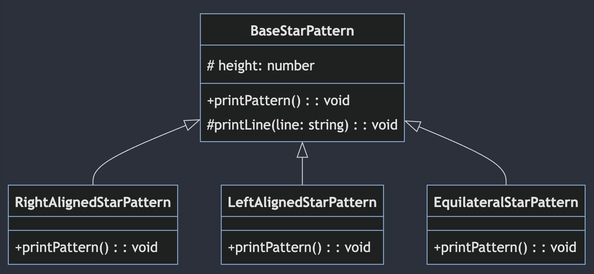
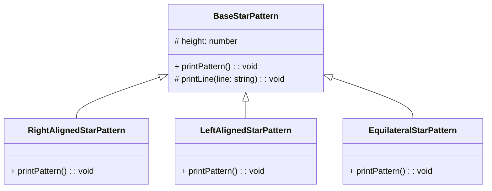

# Star Pattern

안녕하세요! 요즘은 다시 기본으로 돌아가서 OOP와 디자인 패턴을 복습하고있습니다.
한참 이를 다시 공부하던 어떻게 하면 이를 좀 더 쉽게 설명하고 이해 할 수 있을까(~~그리고 블로그 포스팅을 할 수 있을까~~) 고민하다가, 우리가 처음 프로그래밍을 배울 때 접하게 되는 간단한 별 찍기 문제를 한번 극한으로 파고들어보자는 생각이 들었습니다.

부질없는 삽질이 될 수도 있겠지만 하다 보니 생각보다 재미있어서 이를 공유하고자 합니다.

## 별 찍기 문제 - 간단한 함수로 시작하기

### 기본적인 삼각형 만들기

다들 아시겠지만, 프로그래밍을 처음 시작하면 다들 별 찍기 문제를 풀어보게 됩니다. 그 중에서도 가장 기본적인 문제는 아마도 다음과 같은 모양을 만드는 것이 아닐까 싶습니다.

```
*
**
***
****
*****
```

이를 만드는 코드는 아마도 다음과 같이 작성할 수 있을 것입니다.

```js
function printStarPattern() {
  for (let i = 1; i <= 5; i++) {
    let star = '';
    for (let j = 1; j <= i; j++) {
        star += '*';
    }
    console.log(star);
  }
}

printStarPattern();
```

자, 이정도면 아마 프로그래밍을 처음 시작했던 우리가 만들었던 별 찍기 코드와 비슷할 것 같습니다. 그럼 이제 좀 더 복잡한 별 찍기 문제를 한번 풀어보도록 하겠습니다.

### 이등변 삼각형 만들기

이번에는 이등변 삼각형을 만들어보도록 하겠습니다.

```
    *    
   ***   
  *****  
 ******* 
*********
```

이를 만드는 코드는 아마도 다음과 같이 작성할 수 있을 것입니다.

```js
function printStarPattern() {
  for (let i = 1; i <= 5; i++) {
    let star = '';
    for (let j = 1; j <= 5 - i; j++) {
      star += ' ';
    }
    for (let j = 1; j <= 2 * i - 1; j++) {
      star += '*';
    }
    console.log(star);
  }
}

printStarPattern();
```

저는 처음엔 이등변 삼각형 찍는것도 한번에 만들지 못했던것 같은데, 여러분은 한번에 만드셨었나요?

아무튼, 몸풀기는 여기까지 하고 이제 본격적으로 별 찍기 문제를 고도화 해보도록 하겠습니다.

## 별 찍기 문제 - 객체지향으로

### 별 찍기 문제를 객체지향으로

일단 처음에는 단순하게 함수만 클래스로 바꾸어보도록 하겠습니다.
클래스를 쓰는 김에, 클래스 하면 떠오르는 상속을 먼저 적용해보도록 하겠습니다.
아, 그리고 이제는 TS를 사용하도록 하겠습니다.

- 코드

  ```ts
  // BaseStarPattern.ts
  export abstract class BaseStarPattern {
    constructor(protected height: number) {}

    abstract printPattern(): void;

    protected printLine(line: string): void {
      console.log(line);
    }
  }

  // RightAlignedStarPattern.ts
  export class RightAlignedStarPattern extends BaseStarPattern {
    printPattern(): void {
      for (let i = 1; i <= this.height; i++) {
        const spaces = ' '.repeat(this.height - i);
        const stars = '*'.repeat(i);
        this.printLine(spaces + stars);
      }
    }
  }

  // LeftAlignedStarPattern.ts
  export class LeftAlignedStarPattern extends BaseStarPattern {
    printPattern(): void {
      for (let i = 1; i <= this.height; i++) {
        const spaces = ' '.repeat(this.height - i);
        const stars = '*'.repeat(i);
        this.printLine(stars + spaces);
      }
    }
  }

  // EquilateralStarPattern.ts
  export class EquilateralStarPattern extends BaseStarPattern {
    printPattern(): void {
      for (let i = 1; i <= this.height; i++) {
        const spaces = ' '.repeat(this.height - i);
        const stars = '*'.repeat(2 * i - 1);
        this.printLine(spaces + stars);
      }
    }
  }

  // index.ts
  const rightAlignedStarPattern = new RightAlignedStarPattern(5);
  rightAlignedStarPattern.printPattern();

  const leftAlignedStarPattern = new LeftAlignedStarPattern(5);
  leftAlignedStarPattern.printPattern();

  const equilateralStarPattern = new EquilateralStarPattern(5);
  equilateralStarPattern.printPattern();
  ```

- 결과

  ```
      *
     **
    ***
   ****
  *****
  *    
  **   
  ***  
  **** 
  *****
      *
     ***
    *****
   *******
  *********
  ```

자 이정도면 그래도 기본적인 구색은 갖춘 것 같네요.  
개략적인 구조는 이렇습니다.

<!--  -->



이러한 상속 구조를 사용한다면, 이제는 새로운 유형의 별 찍기 문제가 생기는 경우에도 기존 코드를 수정하지 않고 새로운 클래스를 만들어서 사용할 수 있게 되었습니다.  
다만, 아직 명확한 한계가 있습니다. 바로 상속이라는 개념이 너무 강제적이라는 것입니다.
그리고 `index.ts`에서 사용자가 '모든 클래스를 다 알고, 직접 생성해서 사용해야 한다'는 것도 좀 아쉽습니다.

### 별 찍기 문제를 인터페이스로

상속이 너무 강제적이라는 생각이 들어서, 이번에는 인터페이스를 사용해보도록 하겠습니다.

- 코드