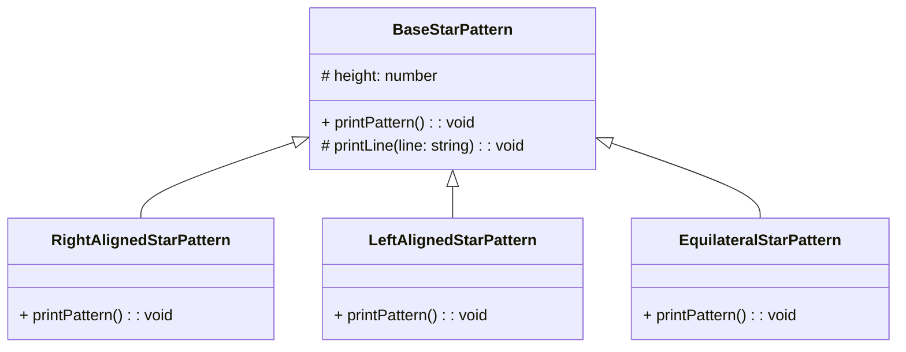

# Star Pattern

안녕하세요! 요즘은 다시 기본으로 돌아가서 OOP와 디자인 패턴을 복습하고있습니다.  
한참 이를 다시 공부하던 어떻게 하면 이를 좀 더 쉽게 설명하고 이해 할 수 있을까(~~그리고 블로그 포스팅을 할 수 있을까~~) 고민하다가, 우리가 처음 프로그래밍을 배울 때 접하게 되는 간단한 별 찍기 문제를 한번 극한으로 파고들어보자는 생각이 들었습니다.

부질없는 삽질이 될 수도 있겠지만 하다 보니 생각보다 재미있어서 이를 공유하고자 합니다.

## 별 찍기 문제 - 간단한 함수로 시작하기

### 기본적인 삼각형 만들기

다들 아시겠지만, 프로그래밍을 처음 시작하면 다들 별 찍기 문제를 풀어보게 됩니다. 그 중에서도 가장 기본적인 문제는 아마도 다음과 같은 모양을 만드는 것이 아닐까 싶습니다.

```
*
**
***
****
*****
```

이를 만드는 코드는 아마도 다음과 같이 작성할 수 있을 것입니다.

```js
function printStarPattern() {
  for (let i = 1; i <= 5; i++) {
    let star = '';
    for (let j = 1; j <= i; j++) {
        star += '*';
    }
    console.log(star);
  }
}

printStarPattern();
```

자, 이정도면 아마 프로그래밍을 처음 시작했던 우리가 만들었던 별 찍기 코드와 비슷할 것 같습니다. 그럼 이제 좀 더 복잡한 별 찍기 문제를 한번 풀어보도록 하겠습니다.

### 이등변 삼각형 만들기

이번에는 이등변 삼각형을 만들어보도록 하겠습니다.

```
    *    
   ***   
  *****  
 ******* 
*********
```

이를 만드는 코드는 아마도 다음과 같이 작성할 수 있을 것입니다.

```js
function printStarPattern() {
  for (let i = 1; i <= 5; i++) {
    let star = '';
    for (let j = 1; j <= 5 - i; j++) {
      star += ' ';
    }
    for (let j = 1; j <= 2 * i - 1; j++) {
      star += '*';
    }
    console.log(star);
  }
}

printStarPattern();
```

저는 처음엔 이등변 삼각형 찍는것도 한번에 만들지 못했던것 같은데, 여러분은 한번에 만드셨었나요?

아무튼, 몸풀기는 여기까지 하고 이제 본격적으로 별 찍기 문제를 고도화 해보도록 하겠습니다.

## 별 찍기 문제 - 객체지향으로

### 별 찍기 문제를 클래스화 해 보자

일단 처음에는 단순하게 함수만 클래스로 바꾸어보도록 하겠습니다.
클래스를 쓰는 김에, 클래스 하면 떠오르는 상속을 먼저 적용해보도록 하겠구요.
아, 그리고 이제는 TS를 사용하겠습니다.

- 코드

  ```ts
  // BaseStarPattern.ts
  export abstract class BaseStarPattern {
    constructor(protected height: number) {}

    abstract printPattern(): void;

    protected printLine(line: string): void {
      console.log(line);
    }
  }

  // RightAlignedStarPattern.ts
  export class RightAlignedStarPattern extends BaseStarPattern {
    printPattern(): void {
      for (let i = 1; i <= this.height; i++) {
        const spaces = ' '.repeat(this.height - i);
        const stars = '*'.repeat(i);
        this.printLine(spaces + stars);
      }
    }
  }

  // LeftAlignedStarPattern.ts
  export class LeftAlignedStarPattern extends BaseStarPattern {
    printPattern(): void {
      for (let i = 1; i <= this.height; i++) {
        const spaces = ' '.repeat(this.height - i);
        const stars = '*'.repeat(i);
        this.printLine(stars + spaces);
      }
    }
  }

  // EquilateralStarPattern.ts
  export class EquilateralStarPattern extends BaseStarPattern {
    printPattern(): void {
      for (let i = 1; i <= this.height; i++) {
        const spaces = ' '.repeat(this.height - i);
        const stars = '*'.repeat(2 * i - 1);
        this.printLine(spaces + stars);
      }
    }
  }

  // index.ts
  const rightAlignedStarPattern = new RightAlignedStarPattern(5);
  rightAlignedStarPattern.printPattern();

  const leftAlignedStarPattern = new LeftAlignedStarPattern(5);
  leftAlignedStarPattern.printPattern();

  const equilateralStarPattern = new EquilateralStarPattern(5);
  equilateralStarPattern.printPattern();
  ```

- 결과

  ```
      *
     **
    ***
   ****
  *****
  *    
  **   
  ***  
  **** 
  *****
      *
     ***
    *****
   *******
  *********
  ```

자 이정도면 그래도 기본적인 구색은 갖춘 것 같네요.  
개략적인 구조는 이렇습니다.

<!--  -->



이러한 상속 구조를 사용한다면, 이제는 새로운 유형의 별 찍기 문제가 생기는 경우에도 기존 코드를 수정하지 않고 새로운 클래스를 만들어서 사용할 수 있게 되었습니다.  
추가적인 요구사항이 생긴다면 별다른 고민 없이 기존의 코드를 수정하지 않고 새로운 클래스를 만들어서 사용할 수 있게 되었습니다.
하지만 상속은 상속대로 문제가 있습니다. 이 예시는 너무도 간단해서 상속을 사용해도 큰 문제가 없지만, 상속은 강한 결합을 만들어내기 때문에 추후 기능을 확장 할 때 Base뿐만 아니라 하위 클래스들도 함께 고려해야 하는 문제가 발생할 수 있습니다.  
그런 의미에서 이번에는 인터페이스를 사용 해 보겠습니다.
그리고 `index.ts`에서 사용자가 '모든 클래스를 다 알고, 직접 생성해서 사용해야 한다'는 것도 좀 아쉽습니다. 이 부분은 추후에 좀 더 개선해보도록 하겠습니다.

### 별 찍기 문제를 인터페이스로


- 코드

  ```ts
  // IPrintable.ts
  export interface IPrintable {
    printLine(line: string): void;
  }

  // IStarPattern.ts
  export interface IStarPattern {
    printPattern(): void;
  }

  // RightAlignedStarPattern.ts
  export class RightAlignedStarPattern implements IPrintable, IStarPattern {
    constructor(private height: number) {}

    printLine(line: string): void {
      console.log(line);
    }

    printPattern(): void {
      for (let i = 1; i <= this.height; i++) {
        const spaces = ' '.repeat(this.height - i);
        const stars = '*'.repeat(i);
        this.printLine(spaces + stars);
      }
    }
  }

  // LeftAlignedStarPattern.ts
  export class LeftAlignedStarPattern implements IPrintable, IStarPattern {
    constructor(private height: number) {}

    printLine(line: string): void {
      console.log(line);
    }

    printPattern(): void {
      for (let i = 1; i <= this.height; i++) {
        const spaces = ' '.repeat(this.height - i);
        const stars = '*'.repeat(i);
        this.printLine(spaces + stars);
      }
    }
  }

  // EquilateralStarPattern.ts
  export class EquilateralStarPattern implements IPrintable, IStarPattern {
    constructor(private height: number) {}

    printLine(line: string): void {
      console.log(line);
    }

    printPattern(): void {
      for (let i = 1; i <= this.height; i++) {
        const spaces = ' '.repeat(this.height - i);
        const stars = '*'.repeat(2 * i - 1);
        this.printLine(spaces + stars);
      }
    }
  }

  // index.ts
  const rightAlignedStarPattern = new RightAlignedStarPattern(5);
  const leftAlignedStarPattern = new LeftAlignedStarPattern(5);
  const equilateralStarPattern = new EquilateralStarPattern(5);

  rightAlignedStarPattern.printPattern();
  leftAlignedStarPattern.printPattern();
  equilateralStarPattern.printPattern();
  ```

- 결과는 동일하므로 생략합니다.

이게 뭐가 다른거야? 싶은 생각이 드실 수도 있습니다.  
자세히 다뤄보자면, 이전과는 달리 인터페이스를 통해 하나의 큰 클래스의 역할을 분할해 주었습니다.  
이를 통해 클래스가 비대해지는 것을 원천적으로 막을 수 있고, 상속받는 다른 클래스들이 불필요한 결합을 갖지 않도록 할 수 있습니다.

하지만, 여전히 문제가 있습니다.
인터페이스는 이를 구현하는 여러 클래스들이 같은 기능을 제공한다는 것을 보장해주지만, 내부 구현은 개별 클래스 내부에서 직접 구현해야 합니다.  
물론 이런 점이 구현의 자유도를 높여주기는 하지만, 이를 통해 발생하는 중복 코드는 또 다른 문제가 될 수 있습니다.  
그런 의미에서 이번에는 컴포지션을 사용해보겠습니다.

### 별 찍기 문제를 컴포지션으로

- 코드

  ```ts
  // Printable.ts
  export class Printable {
    printLine(line: string): void {
      console.log(line);
    }
  }

  // IStarPattern.ts
  export interface IStarPattern {
    printPattern(): void;
  }

  // RightAlignedStarPattern.ts
  export class RightAlignedStarPattern implements StarPattern {
    private printable: Printable;

    constructor(private height: number) {
      this.printable = new Printable();
    }

    printPattern(): void {
      for (let i = 1; i <= this.height; i++) {
        const spaces = ' '.repeat(this.height - i);
        const stars = '*'.repeat(i);
        this.printable.printLine(spaces + stars);
      }
    }
  }

  // LeftAlignedStarPattern.ts
  export class LeftAlignedStarPattern implements StarPattern {
    private printable: Printable;

    constructor(private height: number) {
      this.printable = new Printable();
    }

    printPattern(): void {
      for (let i = 1; i <= this.height; i++) {
        const spaces = ' '.repeat(this.height - i);
        const stars = '*'.repeat(i);
        this.printable.printLine(stars + spaces);
      }
    }
  }

  // EquilateralStarPattern.ts
  export class EquilateralStarPattern implements StarPattern {
    private printable: Printable;

    constructor(private height: number) {
      this.printable = new Printable();
    }

    printPattern(): void {
      for (let i = 1; i <= this.height; i++) {
        const spaces = ' '.repeat(this.height - i);
        const stars = '*'.repeat(2 * i - 1);
        this.printable.printLine(spaces + stars);
      }
    }
  }

  // index.ts
  const rightAlignedStarPattern = new RightAlignedStarPattern(5);
  const leftAlignedStarPattern = new LeftAlignedStarPattern(5);
  const equilateralStarPattern = new EquilateralStarPattern(5);

  rightAlignedStarPattern.printPattern();
  leftAlignedStarPattern.printPattern();
  equilateralStarPattern.printPattern();
  ```

- 역시나 결과는 동일하므로 생략합니다.

이번에는 클래스 내부에서 다른 클래스를 생성하여 사용하는 방식으로 구현했습니다.  
이를 통해 클래스가 갖춰야할 계약을 명확히 하면서도, 중복된 부분은 외부 클래스에 위임함으로써 중복을 줄일 수 있었습니다.  

아 물론, 이번에도 문제가 있습니다.
> ❓ Printable 클래스가 매번 생성하기 부담스러울 정도로 크다면?  
> ❓ 여러 클래스들을 `print`하지 않고 테스트를 해야 한다면? 

지금이야 굉장히 단순하게 console.log만 사용하는 코드이지만 만약 은행 결제라거나 미사일 발사 버튼이라면? 굉장히 테스트하기 까다로운 코드가 될 것입니다.

그런 의미에서 이번에는 DI를 사용해보겠습니다.

### 별 찍기 문제를 컴포지션으로 + DI

- 코드

  ```ts
  // IPrintable.ts
  export interface IPrintable {
    printLine(line: string): void;
  }

  // IStarPattern.ts
  export interface IStarPattern {
    printPattern(): void;
  }

  // Printable.ts
  export class Printable implements IPrintable {
    printLine(line: string): void {
      console.log(line);
    }
  }

  // RightAlignedStarPattern.ts
  export class RightAlignedStarPattern implements IStarPattern {
    constructor(private printable: IPrintable, private height: number) {}

    printPattern(): void {
      for (let i = 1; i <= this.height; i++) {
        const spaces = ' '.repeat(this.height - i);
        const stars = '*'.repeat(i);
        this.printable.printLine(spaces + stars);
      }
    }
  }

  // LeftAlignedStarPattern.ts
  export class LeftAlignedStarPattern implements IStarPattern {
    constructor(private printable: IPrintable, private height: number) {}

    printPattern(): void {
      for (let i = 1; i <= this.height; i++) {
        const spaces = ' '.repeat(this.height - i);
        const stars = '*'.repeat(i);
        this.printable.printLine(stars + spaces);
      }
    }
  }

  // EquilateralStarPattern.ts
  export class EquilateralStarPattern implements IStarPattern {
    constructor(private printable: IPrintable, private height: number) {}

    printPattern(): void {
      for (let i = 1; i <= this.height; i++) {
        const spaces = ' '.repeat(this.height - i);
        const stars = '*'.repeat(2 * i - 1);
        this.printable.printLine(spaces + stars);
      }
    }
  }

  // index.ts
  const printable = new Printable();
  const rightAlignedStarPattern = new RightAlignedStarPattern(printable, 5);
  const leftAlignedStarPattern = new LeftAlignedStarPattern(printable, 5);
  const equilateralStarPattern = new EquilateralStarPattern(printable, 5);

  rightAlignedStarPattern.printPattern();
  leftAlignedStarPattern.printPattern();
  equilateralStarPattern.printPattern();
  ```

- 결과는 동일하므로 생략합니다.

이번에는 클래스 내부에서 직접 생성하는 것이 아니라, 외부에서 생성된 클래스를 주입받아 사용하는 방식으로 구현했습니다.  
이제 클래스는 내부에서 다른 클래스를 생성하지 않는 가벼운 클래스가 되었고, 테스트시에는 아래와 같은 Mock을 주입하여 테스트를 진행할 수 있습니다.

```ts
class MockPrintable implements IPrintable {
  printLine(line: string): void {
    // do nothing
    // or do anything you want like below
    // "stubbing": console.log('SOME STUBBING');
    // "spy": makeSomeRecord(line);
  }
}

const mockPrintable = new MockPrintable();
const rightAlignedStarPattern = new RightAlignedStarPattern(mockPrintable, 5);
rightAlignedStarPattern.printPattern(); // do nothing
```

이제는 테스트하기도 쉽고, 클래스의 역할도 명확해졌습니다.  
그러면 아까 언급했던 또 다른 문제를 해결해볼까요?

## 별 찍기 문제 - 추상화로 더 나아가기

이전의 코드의 문제점 중 하나는, 사용자가 작업을 위해 필요한 클래스를 모두 알아야하고, 직접 이를 관리해야 한다는 점 이었습니다.  
다만 예시가 너무 빈약해서 다소 와닿지 않으실 수 있으니, 본격적인 작업 전에 예시를 조금만 더 고도화 해 보겠습니다.

### 별 찍기를 약간 더 고도화 해 보기

가장 먼저 해 볼 것은, '별'의 종류를 다양하게 만들 수 있도록 하는 것입니다.  
이를 위해 팩토리 패턴을 사용해보겠습니다.

- 코드

  ```ts
  // IStarFactory.ts
  export interface IStarFactory {
    createStar(count: number): string;
  }

  // ISpaceFactory.ts
  export interface ISpaceFactory {
    createSpace(count: number): string;
  }

  // SimpleStarFactory.ts
  export class SimpleStarFactory implements IStarFactory {
    createStar(count: number): string {
      return '*'.repeat(count);
    }
  }

  // EmojiStarFactory.ts
  export class EmojiStarFactory implements IStarFactory {
    createStar(count: number): string {
      return '🌟'.repeat(count);
    }
  }

  // SimpleSpaceFactory.ts
  export class SimpleSpaceFactory implements ISpaceFactory {
    createSpace(count: number): string {
      return ' '.repeat(count);
    }
  }

  // IPrintable.ts - 동일하므로 생략

  // IStarPattern.ts - 동일하므로 생략

  // Printable.ts - 동일하므로 생략

  // RightAlignedStarPattern.ts
  export class RightAlignedStarPattern implements IStarPattern {
    constructor(
      private printable: Printable,
      private starFactory: IStarFactory,
      private spaceFactory: ISpaceFactory,
      private height: number
    ) {}

    printPattern(): void {
      for (let i = 1; i <= this.height; i++) {
        const spaces = this.spaceFactory.createSpace(this.height - i);
        const stars = this.starFactory.createStar(i);
        this.printable.printLine(spaces + stars);
      }
    }
  }

  // LeftAlignedStarPattern.ts
  export class LeftAlignedStarPattern implements IStarPattern {
    constructor(
      private printable: Printable,
      private starFactory: IStarFactory,
      private spaceFactory: ISpaceFactory,
      private height: number
    ) {}

    printPattern(): void {
      for (let i = 1; i <= this.height; i++) {
        const spaces = this.spaceFactory.createSpace(this.height - i);
        const stars = this.starFactory.createStar(i);
        this.printable.printLine(stars + spaces);
      }
    }
  }

  // EquilateralStarPattern.ts
  export class EquilateralStarPattern implements IStarPattern {
    constructor(
      private printable: Printable,
      private starFactory: IStarFactory,
      private spaceFactory: ISpaceFactory,
      private height: number
    ) {}

    printPattern(): void {
      for (let i = 1; i <= this.height; i++) {
        const spaces = this.spaceFactory.createSpace(this.height - i);
        const stars = this.starFactory.createStar(2 * i - 1);
        this.printable.printLine(spaces + stars);
      }
    }
  }

  // index.ts
  const printable = new Printable();
  const simpleStarFactory = new SimpleStarFactory();
  const emojiStartFactory = new EmojiStarFactory();
  const simpleSpaceFactory = new SimpleSpaceFactory();

  const rightAlignedStarPattern = new RightAlignedStarPattern(
    printable,
    simpleStarFactory,
    simpleSpaceFactory,
    5
  );
  const leftAlignedStarPattern = new LeftAlignedStarPattern(
    printable,
    simpleStarFactory,
    simpleSpaceFactory,
    5
  );
  const equilateralStarPattern = new EquilateralStarPattern(
    printable,
    emojiStartFactory,
    simpleSpaceFactory,
    5
  );

  rightAlignedStarPattern.printPattern();
  leftAlignedStarPattern.printPattern();
  equilateralStarPattern.printPattern();
  ```

자, 이제 필요한 경우 별의 종류를 다양하게 만들 수 있게 되었습니다. 예를 들면 이렇게 말이죠.
  
- 결과

  ```
      *
     **
    ***
   ****
  *****
  *    
  **   
  ***  
  **** 
  *****
      🌟
     🌟🌟🌟
    🌟🌟🌟🌟🌟
   🌟🌟🌟🌟🌟🌟🌟
  🌟🌟🌟🌟🌟🌟🌟🌟🌟
  ```

사실 여기서 좀 더 욕심을 내고싶은데, 분량이 길어지면 너무 지루할 것 같아서 이정도로 하겠습니다.

### 별 찍기의 추상화 - 사용자가 모르게 하기

이제 본격적으로 이전에 언급한 문제점을 해결 해 보겠습니다.  
방금 전의 수정으로, 이제 사용자가 코드를 사용하는 index.ts는 더욱 ~~난장판~~복잡해졌습니다.
