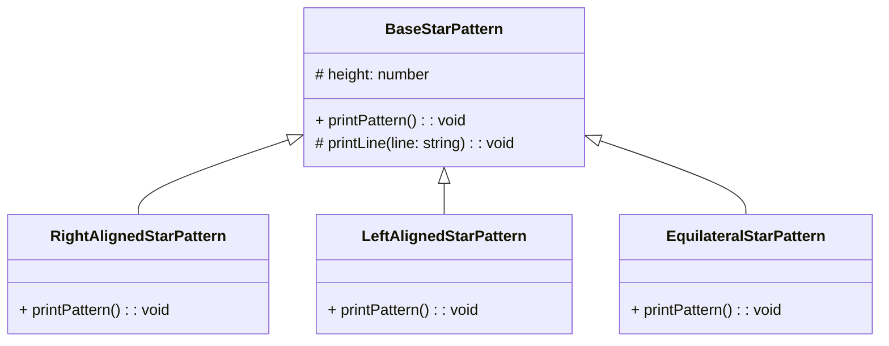

# Star Pattern

안녕하세요! 요즘은 다시 기본으로 돌아가서 OOP와 디자인 패턴을 복습하고있습니다.  
한참 이를 다시 공부하던 어떻게 하면 이를 좀 더 쉽게 설명하고 이해 할 수 있을까(~~그리고 블로그 포스팅을 할 수 있을까~~) 고민하다가, 우리가 처음 프로그래밍을 배울 때 접하게 되는 간단한 별 찍기 문제를 한번 극한으로 파고들어보자는 생각이 들었습니다.

부질없는 삽질이 될 수도 있겠지만 하다 보니 생각보다 재미있어서 이를 공유하고자 합니다.

## 별 찍기 문제 - 간단한 함수로 시작하기

### 기본적인 삼각형 만들기

다들 아시겠지만, 프로그래밍을 처음 시작하면 다들 별 찍기 문제를 풀어보게 됩니다. 그 중에서도 가장 기본적인 문제는 아마도 다음과 같은 모양을 만드는 것이 아닐까 싶습니다.

```
*
**
***
****
*****
```

이를 만드는 코드는 아마도 다음과 같이 작성할 수 있을 것입니다.

```js
function printStarPattern() {
  for (let i = 1; i <= 5; i++) {
    let star = '';
    for (let j = 1; j <= i; j++) {
        star += '*';
    }
    console.log(star);
  }
}

printStarPattern();
```

자, 이정도면 아마 프로그래밍을 처음 시작했던 우리가 만들었던 별 찍기 코드와 비슷할 것 같습니다. 그럼 이제 좀 더 복잡한 별 찍기 문제를 한번 풀어보도록 하겠습니다.

### 이등변 삼각형 만들기

이번에는 이등변 삼각형을 만들어보도록 하겠습니다.

```
    *    
   ***   
  *****  
 ******* 
*********
```

이를 만드는 코드는 아마도 다음과 같이 작성할 수 있을 것입니다.

```js
function printStarPattern() {
  for (let i = 1; i <= 5; i++) {
    let star = '';
    for (let j = 1; j <= 5 - i; j++) {
      star += ' ';
    }
    for (let j = 1; j <= 2 * i - 1; j++) {
      star += '*';
    }
    console.log(star);
  }
}

printStarPattern();
```

저는 처음엔 이등변 삼각형 찍는것도 한번에 만들지 못했던것 같은데, 여러분은 한번에 만드셨었나요?

아무튼, 몸풀기는 여기까지 하고 이제 본격적으로 별 찍기 문제를 고도화 해보도록 하겠습니다.

## 별 찍기 문제 - 객체지향으로

### 별 찍기 문제를 클래스화 해 보자

일단 처음에는 단순하게 함수만 클래스로 바꾸어보도록 하겠습니다.
클래스를 쓰는 김에, 클래스 하면 떠오르는 상속을 먼저 적용해보도록 하겠구요.
아, 그리고 이제는 TS를 사용하겠습니다.

- 코드 [🔍 깃허브에서 보기](https://github.com/HC-kang/TIL/tree/main/CS/Star_Patterns/02_using_class)

  ```ts
  // BaseStarPattern.ts
  export abstract class BaseStarPattern {
    abstract printPattern(height: number): void;

    protected printLine(line: string): void {
      console.log(line);
    }
  }

  // RightAlignedStarPattern.ts
  export class RightAlignedStarPattern extends BaseStarPattern {
    printPattern(height: number): void {
      for (let i = 1; i <= height; i++) {
        const spaces = ' '.repeat(height - i);
        const stars = '*'.repeat(i);
        this.printLine(spaces + stars);
      }
    }
  }

  // LeftAlignedStarPattern.ts
  export class LeftAlignedStarPattern extends BaseStarPattern {
    printPattern(height: number): void {
      for (let i = 1; i <= height; i++) {
        const spaces = ' '.repeat(height - i);
        const stars = '*'.repeat(i);
        this.printLine(stars + spaces);
      }
    }
  }

  // EquilateralStarPattern.ts
  export class EquilateralStarPattern extends BaseStarPattern {
    printPattern(height: number): void {
      for (let i = 1; i <= height; i++) {
        const spaces = ' '.repeat(height - i);
        const stars = '*'.repeat(2 * i - 1);
        this.printLine(spaces + stars);
      }
    }
  }

  // index.ts
  const rightAlignedStarPattern = new RightAlignedStarPattern();
  rightAlignedStarPattern.printPattern(5);

  const leftAlignedStarPattern = new LeftAlignedStarPattern();
  leftAlignedStarPattern.printPattern(5);

  const equilateralStarPattern = new EquilateralStarPattern();
  equilateralStarPattern.printPattern(5);
  ```

- 결과

  ```
      *
     **
    ***
   ****
  *****
  *    
  **   
  ***  
  **** 
  *****
      *
     ***
    *****
   *******
  *********
  ```

자 이정도면 그래도 기본적인 구색은 갖춘 것 같네요.  
개략적인 구조는 이렇습니다.



이러한 상속 구조를 사용한다면 이제는 새로운 유형의 별 찍기 문제가 생기는 경우에도 기존 코드를 수정하지 않고 새로운 클래스를 만들어서 사용할 수 있게 되었습니다.  
즉, 추가적인 요구사항이 생긴다면 별다른 고민 없이 기존의 코드를 수정하지 않고 새로운 클래스를 만들어서 사용할 수 있게 된 것입니다.

하지만 상속은 상속대로 문제가 있습니다.  
이 예시는 너무도 간단해서 상속을 사용해도 큰 문제가 없지만, 상속은 강한 결합을 만들어내기 때문에 추후 기능을 확장 할 때 Base뿐만 아니라 하위 클래스들도 함께 고려해야 하는 문제가 발생할 수 있습니다.  

그런 의미에서 이번에는 인터페이스를 사용 해 보겠습니다.
그리고 `index.ts`에서 사용자가 '모든 클래스를 다 알고, 직접 생성해서 사용해야 한다'는 것도 좀 아쉽습니다. 이 부분은 추후에 좀 더 개선해보도록 하겠습니다.

### 별 찍기 문제를 인터페이스로

- 다이어그램

  ```mermaid
  classDiagram
      class IPrintable {
          <<interface>>
          +printLine(line: string): void
      }

      class IStarPattern {
          <<interface>>
          +printPattern(height: number): void
      }

      class RightAlignedStarPattern {
          +printLine(line: string): void
          +printPattern(height: number): void
      }

      class LeftAlignedStarPattern {
          +printLine(line: string): void
          +printPattern(height: number): void
      }

      class EquilateralStarPattern {
          +printLine(line: string): void
          +printPattern(height: number): void
      }

      RightAlignedStarPattern ..|> IPrintable
      LeftAlignedStarPattern ..|> IPrintable
      EquilateralStarPattern ..|> IPrintable

      IStarPattern <|.. RightAlignedStarPattern
      IStarPattern <|.. LeftAlignedStarPattern
      IStarPattern <|.. EquilateralStarPattern
  ```

- 코드 [🔍 깃허브에서 보기](https://github.com/HC-kang/TIL/tree/main/CS/Star_Patterns/03_interface)

  ```ts
  // IPrintable.ts
  export interface IPrintable {
    printLine(line: string): void;
  }

  // IStarPattern.ts
  export interface IStarPattern {
    printPattern(height: number): void;
  }

  // RightAlignedStarPattern.ts
  export class RightAlignedStarPattern implements IPrintable, IStarPattern {
    printLine(line: string): void {
      console.log(line);
    }

    printPattern(height: number): void {
      for (let i = 1; i <= height; i++) {
        const spaces = ' '.repeat(height - i);
        const stars = '*'.repeat(i);
        this.printLine(spaces + stars);
      }
    }
  }

  // LeftAlignedStarPattern.ts
  export class LeftAlignedStarPattern implements IPrintable, IStarPattern {
    printLine(line: string): void {
      console.log(line);
    }

    printPattern(height: number): void {
      for (let i = 1; i <= height; i++) {
        const spaces = ' '.repeat(height - i);
        const stars = '*'.repeat(i);
        this.printLine(spaces + stars);
      }
    }
  }

  // EquilateralStarPattern.ts
  export class EquilateralStarPattern implements IPrintable, IStarPattern {
    printLine(line: string): void {
      console.log(line);
    }

    printPattern(height: number): void {
      for (let i = 1; i <= height; i++) {
        const spaces = ' '.repeat(height - i);
        const stars = '*'.repeat(2 * i - 1);
        this.printLine(spaces + stars);
      }
    }
  }

  // index.ts
  const rightAlignedStarPattern = new RightAlignedStarPattern();
  const leftAlignedStarPattern = new LeftAlignedStarPattern();
  const equilateralStarPattern = new EquilateralStarPattern();

  rightAlignedStarPattern.printPattern(5);
  leftAlignedStarPattern.printPattern(5);
  equilateralStarPattern.printPattern(5);
  ```

- 결과는 동일하므로 생략합니다.

이게 뭐가 다른거야? 싶은 생각이 드실 수도 있습니다.  
자세히 다뤄보자면, 이전과는 달리 인터페이스를 통해 하나의 큰 클래스의 역할을 분할해 주었습니다.  
이를 통해 클래스가 비대해지는 것을 원천적으로 막을 수 있고, 상속받는 다른 클래스들이 불필요한 결합을 갖지 않도록 할 수 있습니다.

하지만, 여전히 문제가 있습니다.
인터페이스는 이를 구현하는 여러 클래스들이 같은 기능을 제공한다는 것을 보장해주지만, 내부 구현은 개별 클래스 내부에서 직접 구현해야 합니다.  
물론 이런 점이 구현의 자유도를 높여주기는 하지만, 이를 통해 발생하는 중복 코드는 또 다른 문제가 될 수 있습니다.  
그런 의미에서 이번에는 컴포지션을 사용해보겠습니다.

### 별 찍기 문제를 컴포지션으로

- 다이어그램

  ```mermaid
  classDiagram
    class IStarPattern {
        <<interface>>
        +printPattern(height: number): void
    }

    class Printable {
        +printLine(line: string): void
    }

    class RightAlignedStarPattern {
        +printPattern(height: number): void
        -Printable printable
    }

    class LeftAlignedStarPattern {
        +printPattern(height: number): void
        -Printable printable
    }

    class EquilateralStarPattern {
        +printPattern(height: number): void
        -Printable printable
    }

    IStarPattern <|.. RightAlignedStarPattern
    IStarPattern <|.. LeftAlignedStarPattern
    IStarPattern <|.. EquilateralStarPattern

    RightAlignedStarPattern --> Printable
    LeftAlignedStarPattern --> Printable
    EquilateralStarPattern --> Printable
  ```

- 코드 [🔍 깃허브에서 보기](https://github.com/HC-kang/TIL/tree/main/CS/Star_Patterns/04_composition)

  ```ts
  // Printable.ts
  export class Printable {
    printLine(line: string): void {
      console.log(line);
    }
  }

  // IStarPattern.ts
  export interface IStarPattern {
    printPattern(height: number): void;
  }

  // RightAlignedStarPattern.ts
  export class RightAlignedStarPattern implements StarPattern {
    private printable: Printable;

    constructor() {
      this.printable = new Printable();
    }

    printPattern(height: number): void {
      for (let i = 1; i <= height; i++) {
        const spaces = ' '.repeat(height - i);
        const stars = '*'.repeat(i);
        this.printable.printLine(spaces + stars);
      }
    }
  }

  // LeftAlignedStarPattern.ts
  export class LeftAlignedStarPattern implements StarPattern {
    private printable: Printable;

    constructor() {
      this.printable = new Printable();
    }

    printPattern(height: number): void {
      for (let i = 1; i <= height; i++) {
        const spaces = ' '.repeat(height - i);
        const stars = '*'.repeat(i);
        this.printable.printLine(stars + spaces);
      }
    }
  }

  // EquilateralStarPattern.ts
  export class EquilateralStarPattern implements StarPattern {
    private printable: Printable;

    constructor() {
      this.printable = new Printable();
    }

    printPattern(height: number): void {
      for (let i = 1; i <= height; i++) {
        const spaces = ' '.repeat(height - i);
        const stars = '*'.repeat(2 * i - 1);
        this.printable.printLine(spaces + stars);
      }
    }
  }

  // index.ts
  const rightAlignedStarPattern = new RightAlignedStarPattern();
  const leftAlignedStarPattern = new LeftAlignedStarPattern();
  const equilateralStarPattern = new EquilateralStarPattern();

  rightAlignedStarPattern.printPattern(5);
  leftAlignedStarPattern.printPattern(5);
  equilateralStarPattern.printPattern(5);
  ```

- 역시나 결과는 동일하므로 생략합니다.

이번에는 클래스 내부에서 다른 클래스를 생성하여 사용하는 방식으로 구현했습니다.  
이를 통해 클래스가 갖춰야할 계약을 명확히 하면서도, 중복된 부분은 외부 클래스에 위임함으로써 중복을 줄일 수 있었습니다.  

아 물론, 이번에도 문제가 있습니다.
> ❓ Printable 클래스가 매번 생성하기 부담스러울 정도로 크다면?  
> ❓ 여러 클래스들을 `print`하지 않고 테스트를 해야 한다면? 

지금이야 굉장히 단순하게 console.log만 사용하는 코드이지만 만약 은행 결제라거나 미사일 발사 버튼이라면? 굉장히 테스트하기 까다로운 코드가 될 것입니다.

그런 의미에서 이번에는 DI(Dependency Injection)를 사용해보겠습니다.

DI는 의존성 주입이라고 흔히 말합니다.  
의존성 주입은 클래스 내부에서 다른 클래스를 생성하는 것이 아니라, 외부에서 생성된 클래스를 주입받아 사용하는 방식입니다.  
이를 통해 클래스는 생성하는 책임을 가지지 않고, 주입받은 클래스를 사용하는 책임만 가지게 됩니다.

### 별 찍기 문제를 컴포지션으로 + DI

- 다이어그램

  ```mermaid
  classDiagram
    class IPrintable {
        <<interface>>
        +printLine(line: string): void
    }

    class Printable {
        +printLine(line: string): void
    }

    IPrintable <|.. Printable

    class IStarPattern {
        <<interface>>
        +printPattern(height: number): void
    }

    class RightAlignedStarPattern {
        +printPattern(height: number): void
        -IPrintable printable
    }

    class LeftAlignedStarPattern {
        +printPattern(height: number): void
        -IPrintable printable
    }

    class EquilateralStarPattern {
        +printPattern(height: number): void
        -IPrintable printable
    }

    IStarPattern <|.. RightAlignedStarPattern
    IStarPattern <|.. LeftAlignedStarPattern
    IStarPattern <|.. EquilateralStarPattern

    RightAlignedStarPattern --> IPrintable
    LeftAlignedStarPattern --> IPrintable
    EquilateralStarPattern --> IPrintable
  ```

- 코드 [🔍 깃허브에서 보기](https://github.com/HC-kang/TIL/tree/main/CS/Star_Patterns/05_composition_DI)

  ```ts
  // IPrintable.ts
  export interface IPrintable {
    printLine(line: string): void;
  }

  // IStarPattern.ts
  export interface IStarPattern {
    printPattern(height: number): void;
  }

  // Printable.ts
  export class Printable implements IPrintable {
    printLine(line: string): void {
      console.log(line);
    }
  }

  // RightAlignedStarPattern.ts
  export class RightAlignedStarPattern implements IStarPattern {
    constructor(private printable: IPrintable) {}

    printPattern(height: number): void {
      for (let i = 1; i <= height; i++) {
        const spaces = ' '.repeat(height - i);
        const stars = '*'.repeat(i);
        this.printable.printLine(spaces + stars);
      }
    }
  }

  // LeftAlignedStarPattern.ts
  export class LeftAlignedStarPattern implements IStarPattern {
    constructor(private printable: IPrintable) {}

    printPattern(height: number): void {
      for (let i = 1; i <= height; i++) {
        const spaces = ' '.repeat(height - i);
        const stars = '*'.repeat(i);
        this.printable.printLine(stars + spaces);
      }
    }
  }

  // EquilateralStarPattern.ts
  export class EquilateralStarPattern implements IStarPattern {
    constructor(private printable: IPrintable) {}

    printPattern(height: number): void {
      for (let i = 1; i <= height; i++) {
        const spaces = ' '.repeat(height - i);
        const stars = '*'.repeat(2 * i - 1);
        this.printable.printLine(spaces + stars);
      }
    }
  }

  // index.ts
  const printable = new Printable();
  const rightAlignedStarPattern = new RightAlignedStarPattern(printable);
  const leftAlignedStarPattern = new LeftAlignedStarPattern(printable);
  const equilateralStarPattern = new EquilateralStarPattern(printable);

  rightAlignedStarPattern.printPattern(5);
  leftAlignedStarPattern.printPattern(5);
  equilateralStarPattern.printPattern(5);
  ```

- 결과는 동일하므로 생략합니다.

이번에는 클래스 내부에서 직접 생성하는 것이 아니라, 외부에서 생성된 클래스를 주입받아 사용하는 방식으로 구현했습니다.  
이제 클래스는 내부에서 다른 클래스를 생성하지 않는 가벼운 클래스가 되었고, 테스트시에는 아래와 같은 Mock을 주입하여 테스트를 진행할 수 있습니다.

```ts
class MockPrintable implements IPrintable {
  printLine(line: string): void {
    // do nothing
    // or do anything you want like below
    // "stubbing": console.log('SOME STUBBING');
    // "spy": makeSomeRecord(line);
  }
}

const mockPrintable = new MockPrintable();
const rightAlignedStarPattern = new RightAlignedStarPattern(mockPrintable);
rightAlignedStarPattern.printPattern(5); // do nothing
```

이제는 테스트하기도 쉽고, 클래스의 역할도 명확해졌습니다.  
만약 테스트하기 쉽고 어렵다의 감이 잘 잡히지 않으신다면, 아래의 글을 참고해 보시면 도움이 될 수 있을 것 같습니다.
['TDD'보다는 'Testable' - 발표자료 정리](https://velog.io/@hc-kang/TDD%EB%B3%B4%EB%8B%A4%EB%8A%94-Testable-%ED%95%AD%ED%95%B4%ED%94%8C%EB%9F%AC%EC%8A%A4-2%EA%B8%B0)

그러면 아까 언급했던 또 다른 문제를 해결해볼까요?

## 별 찍기 문제 - 추상화로 더 나아가기

이전의 코드의 문제점 중 하나는, 사용자가 작업을 위해 필요한 클래스를 모두 알아야하고, 직접 이를 관리해야 한다는 점 이었습니다.  
다만 예시가 너무 빈약해서 다소 와닿지 않으실 수 있으니, 본격적인 작업 전에 예시를 조금만 더 고도화 해 보겠습니다.

### 별 찍기를 약간 더 고도화 해 보기

가장 먼저 해 볼 것은, '별'의 종류를 다양하게 만들 수 있도록 하는 것입니다.  
이를 위해 팩토리 패턴을 사용해보겠습니다.

팩토리 패턴을 정말 단순하게 설명하자면, 이름 그대로 뭔가를 만드는 공장입니다.  
여기서는 별과 공백이 이어지는 문자열을 만들어주는 공장이라고 생각하시면 됩니다.

- 다이어그램

  ```mermaid
  classDiagram
    class IPrintable {
        <<interface>>
        +printLine(line: string): void
    }

    class Printable {
        +printLine(line: string): void
    }

    IPrintable <|.. Printable

    class IStarFactory {
        <<interface>>
        +createStar(count: number): string
    }

    class ISpaceFactory {
        <<interface>>
        +createSpace(count: number): string
    }

    class SimpleStarFactory {
        +createStar(count: number): string
    }

    class EmojiStarFactory {
        +createStar(count: number): string
    }

    class SimpleSpaceFactory {
        +createSpace(count: number): string
    }

    class IStarPattern {
        <<interface>>
        +printPattern(height: number): void
    }

    class RightAlignedStarPattern {
        +printPattern(height: number): void
        -IPrintable printable
        -IStarFactory starFactory
        -ISpaceFactory spaceFactory
    }

    class LeftAlignedStarPattern {
        +printPattern(height: number): void
        -IPrintable printable
        -IStarFactory starFactory
        -ISpaceFactory spaceFactory
    }

    class EquilateralStarPattern {
        +printPattern(height: number): void
        -IPrintable printable
        -IStarFactory starFactory
        -ISpaceFactory spaceFactory
    }

    IStarFactory <|.. SimpleStarFactory
    IStarFactory <|.. EmojiStarFactory
    ISpaceFactory <|.. SimpleSpaceFactory

    IStarPattern <|.. RightAlignedStarPattern
    IStarPattern <|.. LeftAlignedStarPattern
    IStarPattern <|.. EquilateralStarPattern

    RightAlignedStarPattern --> IStarFactory
    RightAlignedStarPattern --> ISpaceFactory
    LeftAlignedStarPattern --> IStarFactory
    LeftAlignedStarPattern --> ISpaceFactory
    EquilateralStarPattern --> IStarFactory
    EquilateralStarPattern --> ISpaceFactory

    RightAlignedStarPattern --> IPrintable
    LeftAlignedStarPattern --> IPrintable
    EquilateralStarPattern --> IPrintable
  ```

- 코드 [🔍 깃허브에서 보기](https://github.com/HC-kang/TIL/tree/main/CS/Star_Patterns/06_factory_pattern)

  ```ts
  // IStarFactory.ts
  export interface IStarFactory {
    createStar(count: number): string;
  }

  // ISpaceFactory.ts
  export interface ISpaceFactory {
    createSpace(count: number): string;
  }

  // SimpleStarFactory.ts
  export class SimpleStarFactory implements IStarFactory {
    createStar(count: number): string {
      return '*'.repeat(count);
    }
  }

  // EmojiStarFactory.ts
  export class EmojiStarFactory implements IStarFactory {
    createStar(count: number): string {
      return '🌟'.repeat(count);
    }
  }

  // SimpleSpaceFactory.ts
  export class SimpleSpaceFactory implements ISpaceFactory {
    createSpace(count: number): string {
      return ' '.repeat(count);
    }
  }

  // IPrintable.ts - 동일하므로 생략

  // IStarPattern.ts - 동일하므로 생략

  // Printable.ts - 동일하므로 생략

  // RightAlignedStarPattern.ts
  export class RightAlignedStarPattern implements IStarPattern {
    constructor(
      private printable: IPrintable,
      private starFactory: IStarFactory,
      private spaceFactory: ISpaceFactory,
    ) {}

    printPattern(height: number): void {
      for (let i = 1; i <= height; i++) {
        const spaces = this.spaceFactory.createSpace(height - i);
        const stars = this.starFactory.createStar(i);
        this.printable.printLine(spaces + stars);
      }
    }
  }

  // LeftAlignedStarPattern.ts
  export class LeftAlignedStarPattern implements IStarPattern {
    constructor(
      private printable: IPrintable,
      private starFactory: IStarFactory,
      private spaceFactory: ISpaceFactory,
    ) {}

    printPattern(height: number): void {
      for (let i = 1; i <= height; i++) {
        const spaces = this.spaceFactory.createSpace(height - i);
        const stars = this.starFactory.createStar(i);
        this.printable.printLine(stars + spaces);
      }
    }
  }

  // EquilateralStarPattern.ts
  export class EquilateralStarPattern implements IStarPattern {
    constructor(
      private printable: IPrintable,
      private starFactory: IStarFactory,
      private spaceFactory: ISpaceFactory,
    ) {}

    printPattern(height: number): void {
      for (let i = 1; i <= height; i++) {
        const spaces = this.spaceFactory.createSpace(height - i);
        const stars = this.starFactory.createStar(2 * i - 1);
        this.printable.printLine(spaces + stars);
      }
    }
  }

  // index.ts
  const printable = new Printable();
  const simpleStarFactory = new SimpleStarFactory();
  const emojiStarFactory = new EmojiStarFactory();
  const simpleSpaceFactory = new SimpleSpaceFactory();

  const rightAlignedStarPattern = new RightAlignedStarPattern(
    printable,
    simpleStarFactory,
    simpleSpaceFactory,
  );
  const leftAlignedStarPattern = new LeftAlignedStarPattern(
    printable,
    simpleStarFactory,
    simpleSpaceFactory,
  );
  const equilateralStarPattern = new EquilateralStarPattern(
    printable,
    emojiStarFactory,
    simpleSpaceFactory,
  );

  rightAlignedStarPattern.printPattern(5);
  leftAlignedStarPattern.printPattern(5);
  equilateralStarPattern.printPattern(5);
  ```

자, 이제 필요한 경우 별의 종류를 다양하게 만들 수 있게 되었습니다. 예를 들면 이렇게 말이죠.
  
- 결과

  ```
      *
     **
    ***
   ****
  *****
  *    
  **   
  ***  
  **** 
  *****
      🌟
     🌟🌟🌟
    🌟🌟🌟🌟🌟
   🌟🌟🌟🌟🌟🌟🌟
  🌟🌟🌟🌟🌟🌟🌟🌟🌟
  ```

사실 여기서 좀 더 욕심을 내고싶은데, 분량이 길어지면 너무 지루할 것 같아서 이정도로 하겠습니다.

그치만 새로 생긴 문제점 하나는 치우고 가야겠습니다. 팩토리가 생기면서 각 스타 패턴 클래스는 생성자에서 너무 많은 인자를 받게 되었습니다.  
이렇게 되면 인터페이스만으로는 통일된 형태를 강제하기 어렵습니다. 이를 해결하기 위해 다시 추상 클래스를 사용해야겠어요.

- 다이어그램

  ```mermaid
  classDiagram
    class IPrintable {
        <<interface>>
        +printLine(line: string): void
    }

    class Printable {
        +printLine(line: string): void
    }

    Printable ..|> IPrintable

    class IStarFactory {
        <<interface>>
        +createStar(count: number): string
    }

    class ISpaceFactory {
        <<interface>>
        +createSpace(count: number): string
    }

    class SimpleStarFactory {
        +createStar(count: number): string
    }

    class EmojiStarFactory {
        +createStar(count: number): string
    }

    class SimpleSpaceFactory {
        +createSpace(count: number): string
    }

    class StarPattern {
        <<abstract>>
        +printPattern(height: number): void
        #Printable printable
        #IStarFactory starFactory
        #ISpaceFactory spaceFactory
    }

    class RightAlignedStarPattern {
        +printPattern(height: number): void
    }

    class LeftAlignedStarPattern {
        +printPattern(height: number): void
    }

    class EquilateralStarPattern {
        +printPattern(height: number): void
    }

    IStarFactory <|.. SimpleStarFactory
    IStarFactory <|.. EmojiStarFactory
    ISpaceFactory <|.. SimpleSpaceFactory

    StarPattern <|-- RightAlignedStarPattern
    StarPattern <|-- LeftAlignedStarPattern
    StarPattern <|-- EquilateralStarPattern

    RightAlignedStarPattern --> IStarFactory
    RightAlignedStarPattern --> ISpaceFactory
    LeftAlignedStarPattern --> IStarFactory
    LeftAlignedStarPattern --> ISpaceFactory
    EquilateralStarPattern --> IStarFactory
    EquilateralStarPattern --> ISpaceFactory

    RightAlignedStarPattern --> Printable
    LeftAlignedStarPattern --> Printable
    EquilateralStarPattern --> Printable
  ```

- 코드 [🔍 깃허브에서 보기](https://github.com/HC-kang/TIL/tree/main/CS/Star_Patterns/06-1_factory_pattern)

  ```ts
  // IStarPattern.ts - 삭제
  
  // StarPattern.ts
  export abstract class StarPattern {
    constructor(
      protected printable: Printable,
      protected starFactory: IStarFactory,
      protected spaceFactory: ISpaceFactory,
    ) {}

    abstract printPattern(height: number): void;
  }

  // RightAlignedStarPattern.ts
  export class RightAlignedStarPattern extends StarPattern {
    protected ...
  }

  // LeftAlignedStarPattern.ts
  export class LeftAlignedStarPattern extends StarPattern {
    protected ...
  }

  // EquilateralStarPattern.ts
  export class EquilateralStarPattern extends StarPattern {
    protected ...
  }
  ```

### 별 찍기의 추상화 - 사용자가 모르게 하기(이론편)

이제 본격적으로 이전에 언급한 문제점을 해결 해 보겠습니다.  
방금 전의 수정으로, 이제 사용자가 코드를 사용하는 index.ts는 더욱 ~~난장판~~복잡해졌습니다.

다시 한 번 우리 코드의 사용지점인 `index.ts`를 살펴보겠습니다.
아, 그리고 여기서 말하는 '사용자'는 고객사가 될 수도 있겠지만, 이 코드를 사용하는 개발자를 의미합니다. 이는 높은 확률로 **미래의 본인도 포함**하고 있습니다. 이를 잊지 마세요.

```ts
// index.ts
const printable = new Printable();
const simpleStarFactory = new SimpleStarFactory();
const emojiStarFactory = new EmojiStarFactory();
const simpleSpaceFactory = new SimpleSpaceFactory();

const rightAlignedStarPattern = new RightAlignedStarPattern(
  printable,
  simpleStarFactory,
  simpleSpaceFactory,
);
const leftAlignedStarPattern = new LeftAlignedStarPattern(
  printable,
  simpleStarFactory,
  simpleSpaceFactory,
);
const equilateralStarPattern = new EquilateralStarPattern(
  printable,
  emojiStarFactory,
  simpleSpaceFactory,
);

rightAlignedStarPattern.printPattern(5);
leftAlignedStarPattern.printPattern(5);
equilateralStarPattern.printPattern(5);
```

이 코드에서 우리 코드의 사용자가 원하는건 사실상 딱 이 부분입니다.

```ts
rightAlignedStarPattern.printPattern(5);
leftAlignedStarPattern.printPattern(5);
equilateralStarPattern.printPattern(5);
```

이 외의 나머지 부분은 옵션이고 사용자의 메인 관심사가 아닙니다. 문제는 이 옵션들에 사용자의 권한과 책임이 엉켜있다는겁니다.  

이 코드를 보았을때 사용자는 **각각의 높이가 5**인 **좌측, 우측으로 정렬된 '*'로 만들어진 삼각형**과 **'🌟'로 만들어진 정삼각형**(~~약간 찌그러졌지만~~)을 **출력**하길 원합니다.  

하지만 그렇게 하기 위해서 사용자는 **Printable, SimpleStarFactory, EmojiStarFactory, SimpleSpaceFactory**를 알아야하고, **RightAlignedStarPattern, LeftAlignedStarPattern, EquilateralStarPattern**를 생성해야 합니다.  
물론 우리는 적당히 이름을 보고, 해당 클래스를 직접 열어보면서 금방 이해할 수 있습니다. 하지만 이는, **'우리가'**, **'방금'** 만든 코드를 보는 입장입니다.

자, 위의 글을 찬찬히 다시 보면, 가장 큰 문제가 뭔지 감이 오실겁니다.  

> 네. 바로 **일단 꼴보기도 싫고, 이해하려고 시간을 쓰기도 싫다**는 것입니다.

이를 그나마 좀 더 이해하기 쉽게 정리해보자면 아래와 같습니다.

- **사용자가 원하는 것**
  1. 좌측으로 정렬된 높이가 5인 '*'로 만들어진 직각삼각형 출력  
  1. 우측으로 정렬된 높이가 5인 '*'로 만들어진 직각삼각형 출력  
  1. 높이가 5인 '🌟'로 만들어진 정삼각형 출력  

- **이를 위해 사용자가 해야 하는 것**

  ```markdown
  - 각 패턴의 출력 메서드를 호출한다.
    - 이를 위해 각 패턴의 클래스를 확인하고 필요한 인자들을 확인한다.
      - Printable 클래스를 확인한다.
        - 다행히 이 클래스는 인자를 필요로 하지 않는다. 인스턴스를 생성한다.
      - SimpleStarFactory 클래스를 확인한다.
        - ...인스턴스를 생성한다.
      - EmojiStarFactory 클래스를 확인한다.
        - ...인스턴스를 생성한다.
      - SimpleSpaceFactory 클래스를 확인한다.
        - ...인스턴스를 생성한다.
      - 높이를 5로 결정한다.
    - 각 패턴에 필요한 인자를 순서에 맞게 기입하여 인스턴스를 생성한다.
  - 메서드를 호출하고 결과를 확인한다.
  ```

이렇게 보면, 분명 간단한 작업이지만 사용자가 확인해야 할 것도 많고 해야 할 일도 많습니다.

우리는 컴퓨터를 켤 때, 블루투스 이어폰을 연결할 때, 하다못해 간단한 현관문 도어락을 열 때에도 이런 과정을 거치지 않습니다.  
일반적인 사람들은 현관문을 열쇠로 돌리면서 매번 '키가 실린더 내부의 플러그를 지나며 내부의 핀을 각각 정위치시키고, 이를통해 쉬어라인이 정렬되어 실린더가 돌아갈 수 있게 되며, 이를 통해 백세트 내부의 데드 볼트가 후퇴하여 잠금이 해제되고 문을 열 수 있게 된다.'와 같은 생각을 하고싶지 않습니다.  
그냥 열쇠를 돌리니까 문이 열린다. 그게 다입니다.

이제 이러한 추상화 과정을 우리가 만든 코드에 적용해보겠습니다.

### 별 찍기의 추상화 - 사용자가 모르게 하기(실전편)

자, 서론이 길었는데, 그래서 어떻게 하면 사용자가 모르게 할 수 있을까요? 여기서 우리는 커맨드 패턴과 빌더 패턴, 그리고 팩토리 메서드 패턴을 사용해보겠습니다.

#### 커맨드 패턴

커맨드 패턴은 요청을 객체로 캡슐화하여 사용자가 보낸 요청을 나중에(언제든?) 이용할 수 있도록 하는 패턴입니다.
더욱 간단하게 말하자면, 사용자가 '딸깍' 하면 '컴퓨터가 켜진다'등의 동작이 발생하게 만드는 것이라고 볼 수 있습니다.

- 다이어그램

  ```mermaid
  classDiagram
    class IPrintable {
        <<interface>>
        +printLine(line: string): void
    }

    class Printable {
        +printLine(line: string): void
    }

    IPrintable <|.. Printable

    class ICommand {
        <<interface>>
        +execute(): void
    }

    class PrintPatternCommand {
        +execute(): void
        -StarPattern pattern
        -int height
    }

    class PatternPrinter {
        -ICommand command
        +setCommand(command: ICommand): void
        +print(): void
    }

    class IStarFactory {
        <<interface>>
        +createStar(count: number): string
    }

    class ISpaceFactory {
        <<interface>>
        +createSpace(count: number): string
    }

    class SimpleStarFactory {
        +createStar(count: number): string
    }

    class EmojiStarFactory {
        +createStar(count: number): string
    }

    class SimpleSpaceFactory {
        +createSpace(count: number): string
    }

    class StarPattern {
        <<abstract>>
        +printPattern(height: number): void
        #IPrintable printable
        #IStarFactory starFactory
        #ISpaceFactory spaceFactory
    }

    class RightAlignedStarPattern {
        +printPattern(height: number): void
    }

    class LeftAlignedStarPattern {
        +printPattern(height: number): void
    }

    class EquilateralStarPattern {
        +printPattern(height: number): void
    }

    ICommand <|.. PrintPatternCommand
    PrintPatternCommand --> StarPattern
    PatternPrinter --> ICommand

    IStarFactory <|.. SimpleStarFactory
    IStarFactory <|.. EmojiStarFactory
    ISpaceFactory <|.. SimpleSpaceFactory

    StarPattern <|-- RightAlignedStarPattern
    StarPattern <|-- LeftAlignedStarPattern
    StarPattern <|-- EquilateralStarPattern

    RightAlignedStarPattern --> IStarFactory
    RightAlignedStarPattern --> ISpaceFactory
    LeftAlignedStarPattern --> IStarFactory
    LeftAlignedStarPattern --> ISpaceFactory
    EquilateralStarPattern --> IStarFactory
    EquilateralStarPattern --> ISpaceFactory

    RightAlignedStarPattern --> IPrintable
    LeftAlignedStarPattern --> IPrintable
    EquilateralStarPattern --> IPrintable

  ```

- 코드 [🔍 깃허브에서 보기](https://github.com/HC-kang/TIL/tree/main/CS/Star_Patterns/07_command_pattern)

  ```ts
  // ICommand.ts
  export interface ICommand {
    execute(): void;
  }

  // PrintPatternCommand.ts
  export class PrintPatternCommand implements ICommand {
    constructor(private pattern: StarPattern, private height: number) {}

    execute(): void {
      this.pattern.printPattern(this.height);
    }
  }

  // PatternPrinter.ts
  export class PatternPrinter {
    constructor(private command: ICommand) {}

    setCommand(command: ICommand): void {
      this.command = command;
    }

    print(): void {
      this.command.execute();
    }
  }

  // 나머지는 이전과 동일하므로 생략

  // index.ts
  const printable = new Printable();
  const simpleStarFactory = new SimpleStarFactory();
  const emojiStarFactory = new EmojiStarFactory();
  const simpleSpaceFactory = new SimpleSpaceFactory();

  const rightAlignedStarPattern = new RightAlignedStarPattern(
    printable,
    simpleStarFactory,
    simpleSpaceFactory,
  );
  const leftAlignedStarPattern = new LeftAlignedStarPattern(
    printable,
    simpleStarFactory,
    simpleSpaceFactory,
  );
  const equilateralStarPattern = new EquilateralStarPattern(
    printable,
    emojiStarFactory,
    simpleSpaceFactory,
  );

  const rightAlignedStarPatternCommand = new PrintPatternCommand(rightAlignedStarPattern, 5);
  const leftAlignedStarPatternCommand = new PrintPatternCommand(leftAlignedStarPattern, 5);
  const equilateralStarPatternCommand = new PrintPatternCommand(equilateralStarPattern, 5);

  const patternPrinter = new PatternPrinter(rightAlignedStarPatternCommand);
  patternPrinter.print();

  patternPrinter.setCommand(leftAlignedStarPatternCommand);
  patternPrinter.print();

  patternPrinter.setCommand(equilateralStarPatternCommand);
  patternPrinter.print();
  ```

아니 어째 이전보다 더 복잡해진 것 같은데요? 라고 생각하셨다면, 그렇습니다.  
커맨드 패턴은 단순한 코드를 오히려 더 복잡하게 만들 수 있습니다. 하지만 이는 이후에 이어질 작업을 위한 준비 과정이니 조금만 참아주세요.

잡답은 그만하고 이어서 빌더 패턴을 사용해보겠습니다.

#### 빌더 패턴

빌더 패턴은 복잡한 객체를 생성하는 과정을 캡슐화하여 정해진 순서나 조건에 따라 객체를 생성할 수 있도록 하는 패턴입니다.
이는 직접 보여드리는게 더 이해가 빠를 것 같아 코드를 보여드리겠습니다.

- 다이어그램

  ```mermaid
  classDiagram
    class StarPattern {
        <<abstract>>
        -IPrintable printable
        -IStarFactory starFactory
        -ISpaceFactory spaceFactory
        +printPattern(height: number): void
    }

    class EquilateralStarPattern {
        +printPattern(height: number): void
    }

    class RightAlignedStarPattern {
        +printPattern(height: number): void
    }

    class LeftAlignedStarPattern {
        +printPattern(height: number): void
    }

    StarPattern <|-- EquilateralStarPattern
    StarPattern <|-- RightAlignedStarPattern
    StarPattern <|-- LeftAlignedStarPattern

    class IPrintable {
        <<interface>>
        +printLine(line: string): void
    }

    class Printable {
        +printLine(line: string): void
    }

    IPrintable <|.. Printable

    class IStarFactory {
        <<interface>>
        +createStar(count: number): string
    }

    class ISpaceFactory {
        <<interface>>
        +createSpace(count: number): string
    }

    class SimpleStarFactory {
        +createStar(count: number): string
    }

    class EmojiStarFactory {
        +createStar(count: number): string
    }

    class SimpleSpaceFactory {
        +createSpace(count: number): string
    }

    IStarFactory <|.. SimpleStarFactory
    IStarFactory <|.. EmojiStarFactory

    ISpaceFactory <|.. SimpleSpaceFactory

    class ICommand {
        <<interface>>
        +execute(): void
    }

    class PrintPatternCommand {
        -StarPattern pattern
        -number height
        +execute(): void
    }

    ICommand <|.. PrintPatternCommand

    class PatternPrinter {
        -ICommand command
        +setCommand(command: ICommand): void
        +print(): void
    }

    class PatternPrinterBuilder {
        -IPrintable printable
        -IStarFactory starFactory
        -ISpaceFactory spaceFactory
        -StarPattern patternClass
        -number height
        +setStarFactory(starFactory: IStarFactory): PatternPrinterBuilder
        +setSpaceFactory(spaceFactory: ISpaceFactory): PatternPrinterBuilder
        +setPatternType(patternClass: StarPattern): PatternPrinterBuilder
        +setHeight(height: number): PatternPrinterBuilder
        +build(): PatternPrinter
    }

    PatternPrinterBuilder --> PatternPrinter
    PatternPrinter --> ICommand
    PrintPatternCommand --> StarPattern
    PatternPrinterBuilder --> IPrintable
    PatternPrinterBuilder --> IStarFactory
    PatternPrinterBuilder --> ISpaceFactory
  ```

  - 분할 1: `PatternPrinterBuilder`

    ```mermaid
    classDiagram
        class IPrintable {
            <<interface>>
            +printLine(line: string): void
        }

        class Printable {
            +printLine(line: string): void
        }

        IPrintable <|.. Printable

        class IStarFactory {
            <<interface>>
            +createStar(count: number): string
        }

        class ISpaceFactory {
            <<interface>>
            +createSpace(count: number): string
        }

        class SimpleStarFactory {
            +createStar(count: number): string
        }

        class EmojiStarFactory {
            +createStar(count: number): string
        }

        class SimpleSpaceFactory {
            +createSpace(count: number): string
        }

        IStarFactory <|.. SimpleStarFactory
        IStarFactory <|.. EmojiStarFactory

        ISpaceFactory <|.. SimpleSpaceFactory

        class PatternPrinter {
            -ICommand command
            +setCommand(command: ICommand): void
            +print(): void
        }

        class PatternPrinterBuilder {
            -IPrintable printable
            -IStarFactory starFactory
            -ISpaceFactory spaceFactory
            -StarPattern patternClass
            -number height
            +setStarFactory(starFactory: IStarFactory): PatternPrinterBuilder
            +setSpaceFactory(spaceFactory: ISpaceFactory): PatternPrinterBuilder
            +setPatternType(patternClass: StarPattern): PatternPrinterBuilder
            +setHeight(height: number): PatternPrinterBuilder
            +build(): PatternPrinter
        }

        PatternPrinterBuilder --> PatternPrinter
        PatternPrinterBuilder --> IPrintable
        PatternPrinterBuilder --> IStarFactory
        PatternPrinterBuilder --> ISpaceFactory
    ```

  - 분할 2: `PatternPrinter`

    ```mermaid
    classDiagram
        class StarPattern {
            <<abstract>>
            -IPrintable printable
            -IStarFactory starFactory
            -ISpaceFactory spaceFactory
            +printPattern(height: number): void
        }

        class EquilateralStarPattern {
            +printPattern(height: number): void
        }

        class RightAlignedStarPattern {
            +printPattern(height: number): void
        }

        class LeftAlignedStarPattern {
            +printPattern(height: number): void
        }

        StarPattern <|-- EquilateralStarPattern
        StarPattern <|-- RightAlignedStarPattern
        StarPattern <|-- LeftAlignedStarPattern

        class ICommand {
            <<interface>>
            +execute(): void
        }

        class PrintPatternCommand {
            -StarPattern pattern
            -number height
            +execute(): void
        }

        ICommand <|.. PrintPatternCommand

        class PatternPrinter {
            -ICommand command
            +setCommand(command: ICommand): void
            +print(): void
        }

        PatternPrinter --> ICommand
        PrintPatternCommand --> StarPattern

    ```

- 코드 [🔍 깃허브에서 보기](https://github.com/HC-kang/TIL/tree/main/CS/Star_Patterns/08_builder_pattern)

  ```ts
  // PatternPrinterBuilder.ts
  export class PatternPrinterBuilder {
    private starFactory: IStarFactory | null = null;
    private spaceFactory: ISpaceFactory | null = null;
    private patternClass: (new (...args: any[]) => StarPattern) | null = null;
    private height: number | null = null;

    setStarFactory(starFactory: IStarFactory): PatternPrinterBuilder {
      this.starFactory = starFactory;
      return this;
    }

    setSpaceFactory(spaceFactory: ISpaceFactory): PatternPrinterBuilder {
      this.spaceFactory = spaceFactory;
      return this;
    }

    setPatternType(
      patternClass: new (...args: any[]) => StarPattern
    ): PatternPrinterBuilder {
      this.patternClass = patternClass;
      return this;
    }

    setHeight(height: number): PatternPrinterBuilder {
      this.height = height;
      return this;
    }

    build(): PatternPrinter {
      if (!this.starFactory) throw new Error('Star factory is required');
      if (!this.spaceFactory) throw new Error('Space factory is required');
      if (!this.patternClass) throw new Error('Pattern type is required');
      if (!this.height) throw new Error('Height is required');

      // 패턴 인스턴스를 빌더 내부에서 생성
      const pattern = new this.patternClass(
        this.starFactory,
        this.spaceFactory,
        this.height
      );
      const command = new PrintPatternCommand(pattern, this.height);
      const patternPrinter = new PatternPrinter(command);

      return patternPrinter;
    }
  }

  // 다른 부분은 이전과 동일하므로 생략

  // index.ts
  const simpleStarFactory = new SimpleStarFactory();
  const emojiStarFactory = new EmojiStarFactory();
  const simpleSpaceFactory = new SimpleSpaceFactory();

  const patternPrinterBuilder = new PatternPrinterBuilder();
  const rightAlignedStarPatternPrinter = patternPrinterBuilder
    .setPatternType(RightAlignedStarPattern)
    .setStarFactory(simpleStarFactory)
    .setSpaceFactory(simpleSpaceFactory)
    .setHeight(5)
    .build();

  const leftAlignedStarPatternPrinter = patternPrinterBuilder
    .setPatternType(LeftAlignedStarPattern)
    .setStarFactory(simpleStarFactory)
    .setSpaceFactory(simpleSpaceFactory)
    .setHeight(5)
    .build();

  const equilateralStarPatternPrinter = patternPrinterBuilder
    .setPatternType(EquilateralStarPattern)
    .setStarFactory(emojiStarFactory)
    .setSpaceFactory(simpleSpaceFactory)
    .setHeight(5)
    .build();

  rightAlignedStarPatternPrinter.print();
  leftAlignedStarPatternPrinter.print();
  equilateralStarPatternPrinter.print();
  ```

아직 좀 더 욕심을 부리고 싶지만, 일단 오늘은 이정도로 해야겠습니다.  
하지만 이정도면 사용자가 직접 코드를 뒤져가며 필요한 클래스를 찾아야 하는 수고를 덜어줄 수 있을 것 같습니다.  

`StarFactory`와 `SpaceFactory`, 그리고 `Pattern`은 인터페이스만 잘 준수한다면 사용자가 직접 구현해서 사용할 수도 있고, `builder`로 인해서 사용자가 잘못된 인자를 넣는 것을 방지하고, 누락된 인자가 있다면 에러를 던져주기 때문에 사용자가 더욱 안심하고 사용할 수 있을 것입니다.

## 마치며

이번에 이렇게 별 찍기 문제를 통해 객체지향 프로그래밍의 기본적인 개념들을 다뤄보았는데요, 하면서 느낀점은 사람은 참 욕심이 끝이 없구나 하는 것이었습니다..
중간중간 옵저버, 데코레이터, 전략 패턴 등을 사용해보고 싶었지만, 이렇게만 해도 길어지는 것 같아서 그만두었습니다.  
다른 패턴들은 다음 기회에 좀 더 성장해서 다뤄 보아야겠습니다.

---

## 원래 하고자했던 것을 위한 자료들

- [이모지 API](https://api.emojisworld.fr/v1/search?q=baby&limit=1)
- [이모지 API2](https://github.com/abourtnik/emojis-world)
- [문자 코드](https://ucdapi.org/unicode/latest/codepoint/hex/2603)