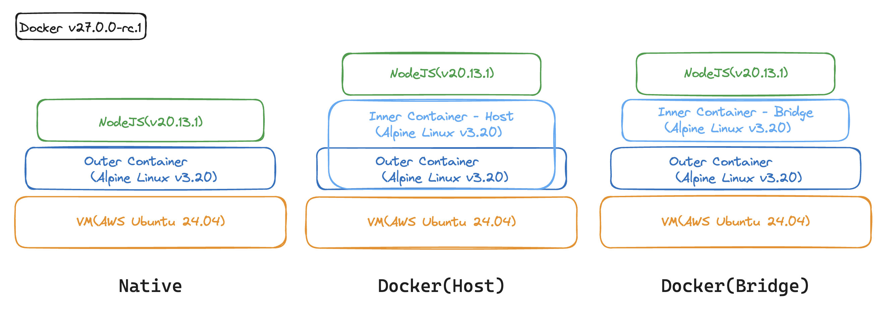
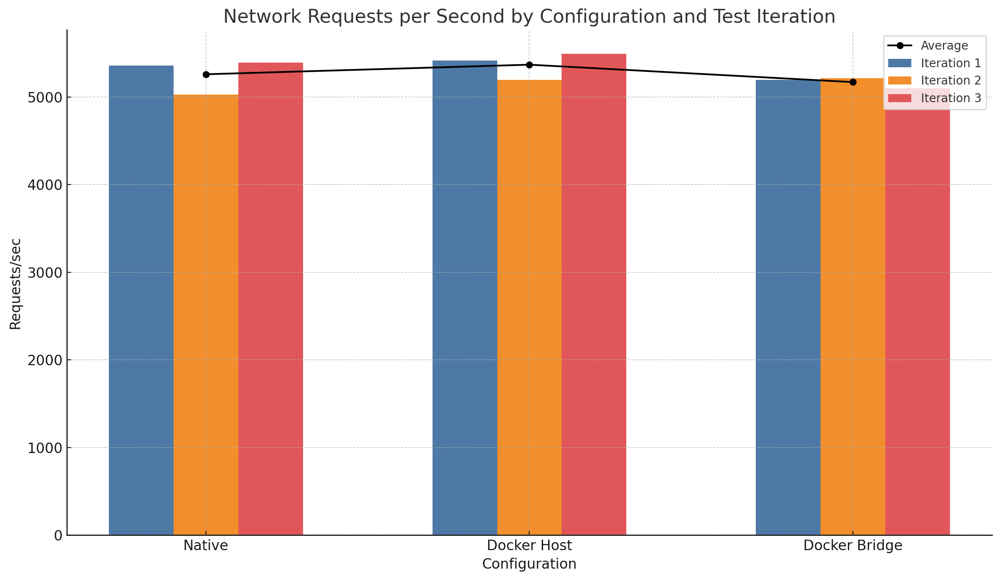
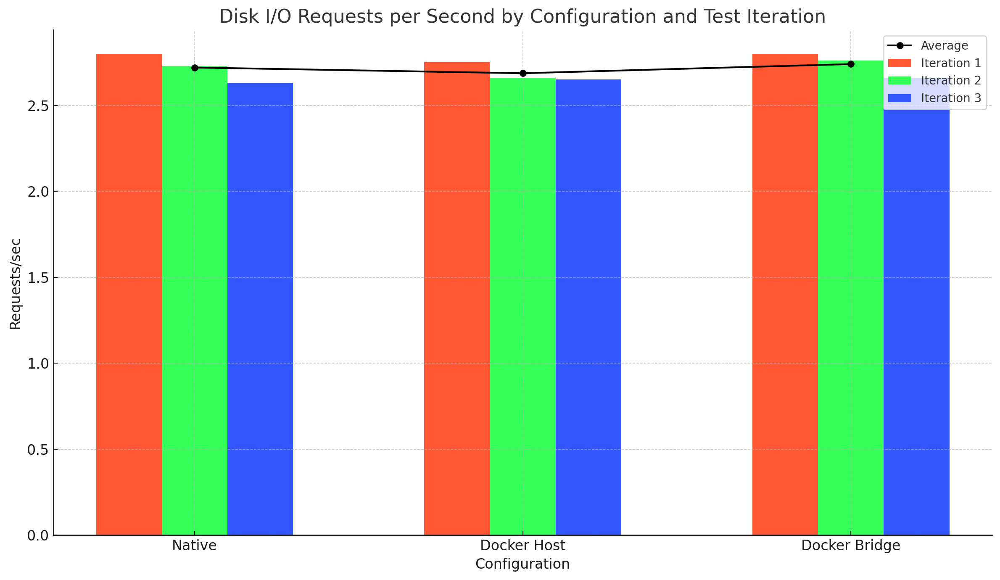
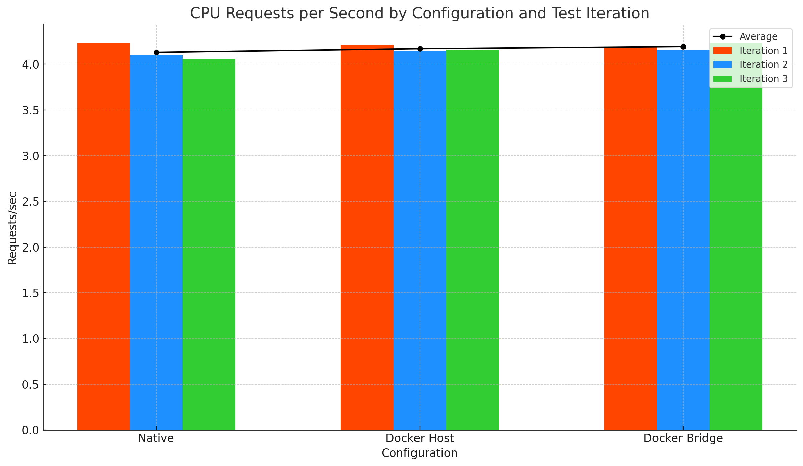

# 파트 2

## 개요

이전 테스트에서는 몇가지 부족한 점이 있었습니다. 이번에는 이전 테스트의 부족한 점을 보완하고, 더욱 정확한 벤치마킹을 위해 다시 한번 테스트를 진행하고자 합니다.

### 보완사항

1. 버전과 환경의 일관성 향상
  - 이전 테스트의 경우, 네이티브 환경에서는 `AWS Ubuntu 24.04 LTS`, `Node.js v18.19.1`을 사용하였으나, 도커 컨테이너 환경에서는 `Node:18(v18.20.3)` 이미지를 사용하였습니다. 물론 둘 다 데비안 계열 OS이긴 했지만, 버전이 다르고 시스템 구성도 다르기 때문에 성능 차이가 발생할 수 있었습니다.
  - 따라서 이번 테스트에서는 동일한 VM을 사용하되, 전체적인 환경 구성을 위해 `DinD(Docker in Docker)`를 사용하여 세 가지 경우 모두 동일한 환경을 구성하였습니다.
2. DiskI/O 테스트 방식 변경
  - 이전 테스트에서도 파일을 생성하고 읽는 방식으로 디스크 I/O 성능을 측정하였습니다. 다만 매우 짧은 텍스트 파일을 생성하고 읽는 방식이라, 실제로는 디스크 I/O 성능을 측정보다는 네트워크 성능을 측정한 것과 다름이 없었습니다.
  - 따라서 이번 테스트에서는 약 100MB의 크기를 가진 파일을 생성 후 읽고, 삭제하는 방식으로 디스크 I/O 성능을 측정하였습니다.

## 환경 구성

### 버전 및 테스트 구조도



- Host: `AWS EC2 t2.xlarge(4 vCPU, 16GB RAM)`, `Ubuntu 24.04 LTS`
- Outer Container: `Node.js v20.13.1`
- Inner Container: `Node.js v20.13.1`

### 구성 주의사항

- `Docker in Docker(DinD)`를 사용하여 동일한 환경을 구성하였습니다.
  - 이 때, 단순히 도커 소켓을 공유하는 방식으로 구성하면 안됩니다. 외부 컨테이너에서 내부 컨테이너를 실행할 때, 호스트의 도커 소켓을 공유하면 호스트의 도커가 실행되어버리기 때문입니다.
    - 예시: `docker run -v /var/run/docker.sock:/var/run/docker.sock ...`
- DiskIO 측정시 사용하는 볼륨은 외부 컨테이너와 내부 컨테이너 간에 공유되어야 합니다. 디스크 I/O 성능을 측정하기 위해 내부 컨테이너에서 생성한 파일이, 휘발되지 않고 호스트에 저장되어야 하기 때문입니다.

### 세부 준비사항

#### Dockerfile 작성

```Dockerfile
FROM docker:27.0.0-rc.1-dind

RUN apk add --no-cache nodejs npm

WORKDIR /usr/src/app

COPY package*.json ./

RUN npm install

COPY . .

EXPOSE 3000

CMD ["sh", "-c", "dockerd-entrypoint.sh"]
```

#### app.js 개선

```js
function generateStringDataInMB(baseString, sizeInMB) {
  const repeatCount = Math.ceil((sizeInMB * 1024 * 1024) / baseString.length);
  return baseString.repeat(repeatCount);
}

app.get('/network', (req, res) => {
  res.send('Network endpoint response');
});

app.get('/disk-io', async (req, res) => {
  const filePath = './shared/testfile.txt';
  const fileContent = generateStringDataInMB('Some content to write to the file', 100); // Generate ~100MB of data

  try {
    await fs.writeFile(filePath, fileContent);
    const data = await fs.readFile(filePath, 'utf8');
    await fs.unlink(filePath);
    res.send(`File content length: ${data.length} and file deleted successfully`);
  } catch (err) {
    res.status(500).send(`Error: ${err.message}`);
  }
});

app.get('/cpu', (req, res) => {
  const start = Date.now();

  for (let i = 0; i < 1e5; i++) {
    crypto.createHash('sha256').update('test').digest('hex');
  }

  const end = Date.now();
  res.send(`CPU intensive task completed in ${end - start} ms`);
});

app.listen(port, () => {
  console.log(`Server running at http://localhost:${port}`);
});
```

#### Docker in Docker(DinD) 구성

##### 1. 외부 컨테이너 이미지 생성

```bash
docker build -t outer-container .
```

##### 2. 외부 컨테이너 실행

```bash
docker run -d \
    --rm \
    --name outer-container \
    --privileged \
    -p 3000:3000 \
    -v /home/ubuntu/shared:/usr/src/app/shared \
    outer-container
```

##### 3. 내부 컨테이너 생성

```bash
docker build -t inner-container .
```

##### 4. 내부 컨테이너 실행

```bash
# 네트워크 모드
docker run -it \
    --rm \
    --name inner-container \
    --privileged \
    -v /usr/src/app/shared:/usr/src/app/shared \
    -w /usr/src/app \
    --network host \
    inner-container \
    /bin/sh

# 호스트 모드
docker run -it \
    --rm \
    --name inner-container \
    --privileged \
    -v /usr/src/app/shared:/usr/src/app/shared \
    -w /usr/src/app \
    -p 3000:3000 \
    inner-container \
    /bin/sh
```

#### benchmark.sh 작성

```bash
#!/bin/bash

run_benchmark() {
    local base_url=$1
    local output_prefix=$2

    DURATION="1m"

    OUTPUT_DIR="./Part2/${output_prefix}"
    mkdir -p $OUTPUT_DIR

    echo "Benchmarking ${output_prefix} environment..."

    THREADS=32
    CONNECTIONS=400

    wrk -t$THREADS -c$CONNECTIONS -d$DURATION ${base_url}/network > $OUTPUT_DIR/${output_prefix}_network.txt
    echo "Network benchmark completed."

    THREADS=3
    CONNECTIONS=4

    wrk -t$THREADS -c$CONNECTIONS -d$DURATION ${base_url}/disk-io > $OUTPUT_DIR/${output_prefix}_disk_io.txt
    echo "Disk I/O benchmark completed."

    THREADS=5
    CONNECTIONS=5

    wrk -t$THREADS -c$CONNECTIONS -d$DURATION ${base_url}/cpu > $OUTPUT_DIR/${output_prefix}_cpu.txt
    echo "CPU benchmark completed."

    echo "Benchmark completed. Results saved to ${output_prefix}_network.txt, ${output_prefix}_disk_io.txt, ${output_prefix}_cpu.txt."
}

echo "Select the benchmark environment:"
echo "1) Native"
echo "2) Host"
echo "3) Bridge"
read -p "Enter choice [1-3]: " choice

case $choice in
    1)
        BASE_URL="http://3.36.78.116:3000"
        run_benchmark $BASE_URL "native"
        ;;
    2)
        BASE_URL="http://3.36.78.116:3000"
        run_benchmark $BASE_URL "host"
        ;;
    3)
        BASE_URL="http://3.36.78.116:3000"
        run_benchmark $BASE_URL "bridge"
        ;;
    *)
        echo "Invalid choice. Please enter 1, 2, or 3."
        ;;
esac
```

  - 큰 틀은 유지하되, 테스트의 강도를 조절하였습니다.

## 실험 결과

### 네트워크



|테스트|네이티브|Docker(host)|Docker(bridge)|
|-|-|-|-|
|1회차|5360.21|**5417.84**|5195.34|
|2회차|5026.70|5193.76|**5212.29**|
|3회차|5389.39|**5492.70**|5100.49|
|평균|5258.77|**5368.10**|5169.37|

### 디스크 I/O

 

|테스트|네이티브|Docker(host)|Docker(bridge)|
|-|-|-|-|
|1회차|*2.80*|2.75|*2.80*|
|2회차|2.73|2.66|**2.76**|
|3회차|2.63|2.65|*2.66*|
|평균|2.72|2.69|**2.74**|

### CPU

 

|테스트|네이티브|Docker(host)|Docker(bridge)|
|-|-|-|-|
|1회차|4.23|**4.21**|4.19|
|2회차|4.10|4.14|**4.16**|
|3회차|4.06|4.16|**4.23**|
|평균|4.13|4.17|**4.19**|


## 결론

- 네트워크 성능: Docker **호스트 모드가 가장 우수한 성능**을 보였지만, 네이티브와 Docker 브리지 모드도 **유사한 성능**을 보였습니다.

- 디스크 IO 성능 / CPU 성능: 세 환경 모두에서 유사한 성능을 보였으며, **유의미한 차이가 없었**습니다.

결과적으로, Node.js 서버의 성능은 네이티브 환경과 Docker 환경(호스트 모드, 브리지 모드)에서 큰 차이가 없고, **Docker 환경에서도 안정적이고 일관된 성능을 제공할 수 있음**을 알 수 있습니다.
혹시 이번 테스트에서도 부족한 점이 있을 수 있으니, 추가적인 피드백이 있다면 언제든지 환영합니다!
