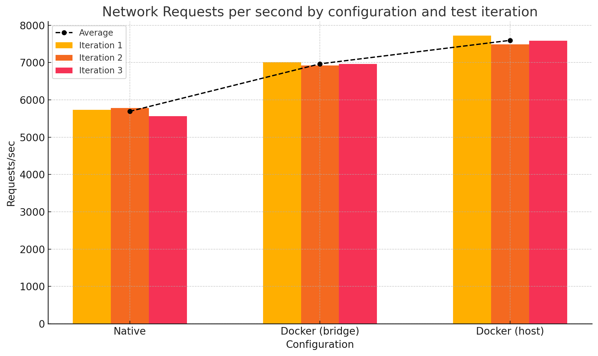
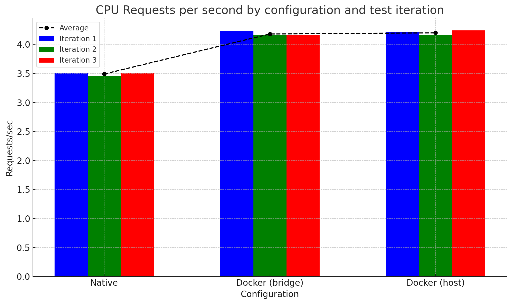
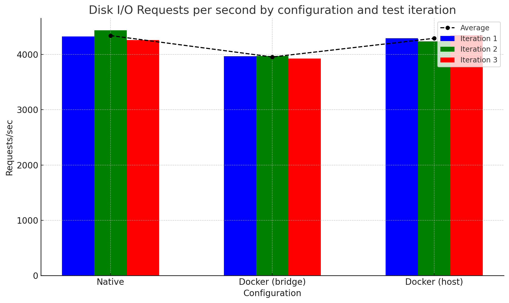
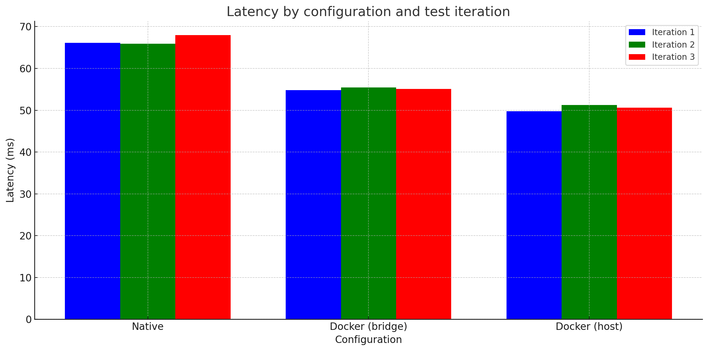
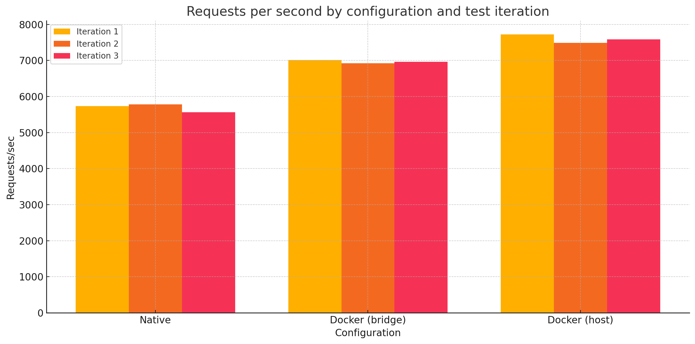

# Docker Container Benchmarking

## 개요

간단한 Node.js 서버를 활용하여 Docker Container의 성능을 벤치마킹하는 프로젝트입니다. 네트워크, CPU, 디스크 I/O 성능을 측정하여 네이티브 환경과 도커 컨테이너 환경의 성능 차이를 비교/분석하고, 최적의 배포 환경을 알아보고자 합니다.

## 세부사항

### 서버 스펙

- Host: AWS EC2 t2.xlarge(4 vCPU, 16GB RAM), Ubuntu 24.04 LTS
  - Node.js: v18.19.1
- Docker: Docker version 24.0.7, build 24.0.7-0ubuntu4
  - Node.js: v18.20.3
- Client: Apple MacBook M1 Pro(8-core CPU, 16GB RAM)

### 테스트 엔드포인트

```js
// app.js
app.get('/network', (req, res) => {
  res.send('Network endpoint response');
});

app.get('/disk-io', (req, res) => {
  const filePath = 'testfile.txt';
  const fileContent = 'Some content to write to the file';

  fs.writeFile(filePath, fileContent, (err) => {
    if (err) {
      res.status(500).send('Error writing file');
      return;
    }

    fs.readFile(filePath, 'utf8', (err, data) => {
      if (err) {
        res.status(500).send('Error reading file');
        return;
      }

      res.send(`File content: ${data}`);
    });
  });
});

app.get('/cpu', (req, res) => {
  const start = Date.now();

  for (let i = 0; i < 1e5; i++) {
    crypto.createHash('sha256').update('test').digest('hex');
  }

  const end = Date.now();
  res.send(`CPU intensive task completed in ${end - start} ms`);
});
```

  - `/network`: 네트워크 성능 측정. 다른 영향을 최소화하도록 간단한 응답을 반환합니다.
  - `/disk-io`: 디스크 I/O 성능 측정. 파일을 생성하고 읽어서 응답을 반환합니다.
  - `/cpu`: CPU 성능 측정. CPU 집약적인 해싱 작업을 반복하여 응답을 반환합니다.

### 테스트 조건

- 동일한 Node.js 코드를 각각 Native, Docker container(bridge, host)에서 실행
- `wrk`(벤치마킹 툴)를 활용한 아래의 스크립트로 각 엔드포인트에 대한 요청을 1분간 수행

  ```bash
  #!/bin/bash

  DURATION="1m"
  THREADS=32
  CONNECTIONS=400

  wrk -t$THREADS -c$CONNECTIONS -d$DURATION http://0.0.0.0:3000/network > ./host/host_network.txt

  wrk -t$THREADS -c$CONNECTIONS -d$DURATION http://0.0.0.0:3000/disk-io > ./host/host_disk_io.txt

  DURATION="1m"
  THREADS=2
  CONNECTIONS=4

  wrk -t$THREADS -c$CONNECTIONS -d$DURATION http://0.0.0.0:3000/cpu > ./host/host_cpu.txt
  ```

### 실행 방법

1. Native
  
  ```bash
  node app.js # 3000번 포트로 서버 실행
  ```

2. Docker container(bridge)

  ```bash
  docker run \
    --rm \
    -v /home/ubuntu:/usr/src/app \
    -w /usr/src/app \
    -p 3000:3000  # 포트 매핑, 브릿지 네트워크 사용 \
    node:18 \
    node app.js
  ```

3. Docker container(host)

  ```bash
  docker run \
      --rm \
      -v /home/ubuntu:/usr/src/app \
      -w /usr/src/app \
      --network host  # 호스트 네트워크 사용 \
      node:18 \
      node app.js\
    ```

### 예상 결과

- 네트워크 성능
  - `Native` ≈ `Docker container(host)` > `Docker container(bridge)`
- CPU 성능
  - `Native` > `Docker container(host)` ≈ `Docker container(bridge)`
- 디스크 I/O 성능
  - `Native` > `Docker container(host)` ≈ `Docker container(bridge)`

### 실제 결과(3회 평균)
  
- 네트워크 성능 (Requests/sec)

  

  |테스트|네이티브|Docker (bridge)|Docker (host)|
  |-|-|-|-|
  |1회차|5731.09|7008.73|**7718.26**|
  |2회차|5785.42|6923.70|**7485.36**|
  |3회차|5559.80|6961.60|**7580.54**|
  |평균|5692.10|6964.68|**7594.72**|
  
- CPU 성능 (Requests/sec)

   

  |테스트|네이티브|Docker (bridge)|Docker (host)|
  |-|-|-|-|
  |1회차|3.51|**4.23**|4.21|
  |2회차|3.46|**4.16**|**4.16**|
  |3회차|3.51|4.16|**4.24**|
  |평균|3.49|4.18|**4.20**|
  
- 디스크 I/O 성능 (Requests/sec)

   

  |테스트|네이티브|Docker (bridge)|Docker (host)|
  |-|-|-|-|
  |1회차|**4326.90**|3965.71|4291.90|
  |2회차|**4434.90**|3971.72|4234.98|
  |3회차|4262.51|3926.30|**4349.31**|
  |평균|**4341.44**|3954.58|4292.06|

- 단순 요약
  - 네트워크 성능
    - `Docker container(host)` > `Docker container(bridge)` > `Native`
  - CPU 성능
    - `Docker container(bridge)` ≈ `Docker container(host)` > `Native`
  - 디스크 I/O 성능
    - `Native` > `Docker container(host)` > `Docker container(bridge)`

## 총평

- Latency
  

- RPS
  

이 실험을 통해 도커 컨테이너와 네이티브 환경에서의 성능을 비교해 보았습니다.
비록 그렇게까지 정밀한 실험은 아니었지만, 각 환경의 장단점을 대략적으로 보여주었으며, 도커 컨테이너를 사용한 배포 전략에 대해 약간이나마 더 깊이 알아 볼 수 있었습니다

### 네트워크 성능

네트워크 성능 측면에서 `Docker container(host)` 설정이 가장 우수한 성능을 보였습니다. 이는 아무래도 `Docker container(bridge)`와 비교했을 때, 호스트 네트워크 인터페이스를 직접 사용하는 `host` 모드의 이점 때문으로 보입니다.

- `Docker container(host)`: 호스트의 네트워크 인터페이스를 공유하여 네트워크 오버헤드가 거의 없습니다.
- `Docker container(bridge)`: 네트워크 패킷이 브리지 네트워크를 통해 라우팅되는 과정을 거치며 미세한 오버헤드가 발생합니다. 미미하다고 볼 수도 있지만, 네트워크 성능이 중요한 서비스라면 고려해야 할 수준으로 보입니다.
- `Native`: 정말 모르겠습니다. 다만, 아마도 `Docker container(host)`에서 사용한 Node:18 공식 이미지에 뭔가 최적화 튜닝이 되어있지 않았을까 하는 생각이 듭니다.

### CPU 성능

CPU 성능은 의외로 `Native`에서 가장 좋지 않았습니다. 이는 아무래도 Node:18 공식 이미지의 최적화와 관련이 있어 보입니다.

- `Docker container`: Node:18 이미지 내의 최적화와 컨테이너 환경의 경량화가 CPU 성능 에 유리한 효과를 준 것 같습니다. 다만 확인이 필요합니다.
- `Native`: 가장 우수할것이라는 예상과는 반대로, 가장 떨어지는 성능을 보였습니다. 정직하게 정석대로 설치된 Ubuntu 24.04 환경이 원인일 수도 있겠습니다.

### 디스크 I/O 성능

디스크 I/O 성능에서는 `Native` 환경이 미세하게 더 나은 성능을 보였습니다. 아무래도 `Native` 환경이 파일 시스템에 직접 접근할 수 있다는 게 큰 이유로 보입니다.

- `Native`: 파일 시스템에 직접 접근하므로 가장 우수한 성능을 보인 것 같습니다.
- `Docker container(host)`: `Native`와 거의 유사한 성능을 보였습니다. 네트워크 인터페이스 뿐 아닌 파일 시스템에도 직접 접근할 수 있는것인지 확인해 보아야겠습니다.
- `Docker container(bridge)`: 브릿지 모드와 호스트 모드는 네트워크에만 있는 것으로 알고있었는데, 디스크 I/O 성능에서도 꽤나 큰 차이를 보였습니다. 원인은 아직 모르겠습니다.

## 아쉬운 점

1. 버전의 일관성이 부족했습니다. 사용한 Node.js 버전부터 운영체제의 버전까지 미묘하게 달라, 꽤나 영향을 끼쳤을 수 있습니다.
2. 디스크 I/O 성능에서 호스트 모드와 브릿지 모드의 성능 차이의 원인을 전혀 모르겠습니다.
3. 테스트의 자동화가 부족했습니다. 실제로 수동으로 테스트를 진행하다보니, 예상치 못한 변수(네트워크 변경 등)가 발생해서 테스트를 여러 번 다시 시작해야 했습니다.

## 추가 보완사항

0. wrk 스크립트에 host ip 기입
1. 노드 버전 맞추기
2. 운영체제 OS, 이미지 맞추기 - Node:18에 도커 설치해서 이미지 빌드 후 동일한 이미지로 활용
3. disk-io 엔드포인트 개선
  - 현재는 요청당 한번 쓰고 읽기
  - 요청 수를 줄이고, IO 시간 늘리기
