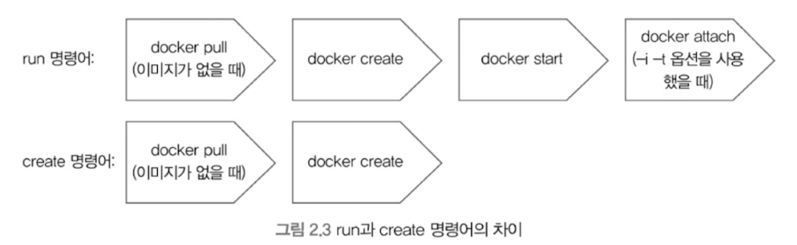
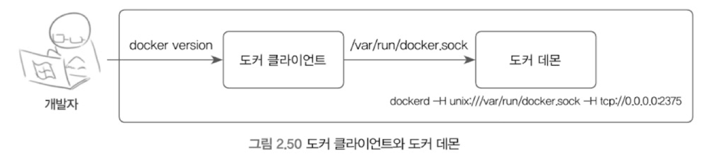
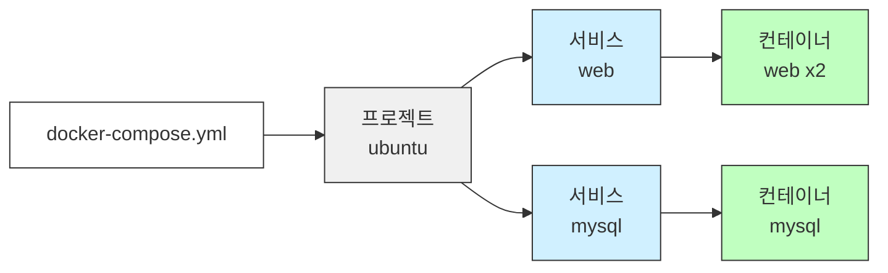
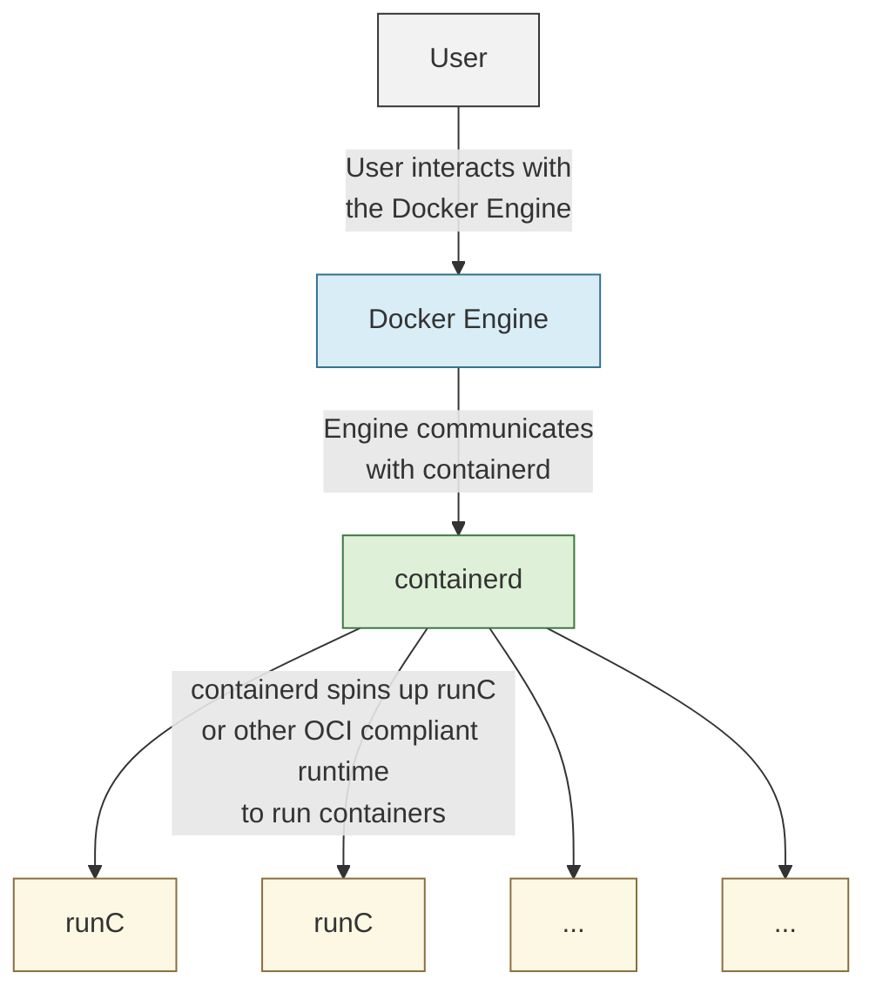
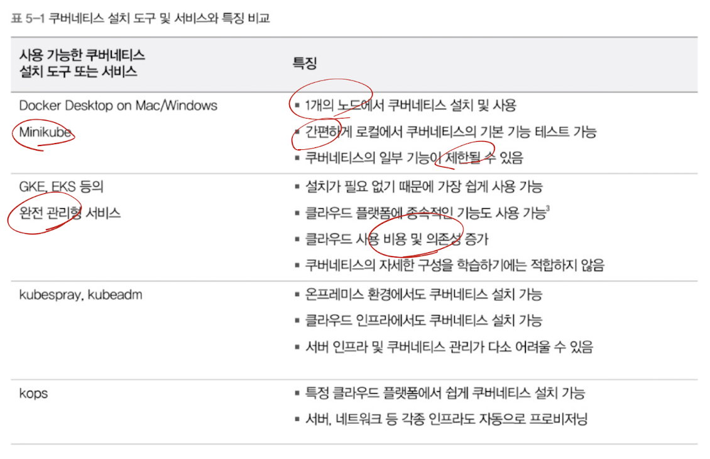

# 시작하세요! 도커/쿠버네티스 스터디 로그

## 📅 스터디 개요
- **기간**: 2025.07.28 ~ 2025.08.15 (15일, 워킹데이)
- **목표**: 도커와 쿠버네티스 실무 역량 확보
- **일일 학습시간**: 2시간

---

## Week 1(7/28 ~ 8/1)

### Day 1 (7/28) - 도커 환경 구축

**📖 진도**: 1장 + 2.1 / 1~20p

- **핵심 개념**
  - 컨테이너와 VM의 차이점
  - 도커 아키텍처 (daemon, client, registry)
  
- **실습 내용**
  - 해당 없음

### Day 2 (7/29) - 도커 이미지 관리

**📖 진도**: 2.2, 2.3 / 21~109p

#### **핵심 개념**

- 도커 이미지와 컨테이너 개념
- 볼륨과 네트워크
- 로깅, 자원할당 옵션
- 이미지의 구조, 레이어 관리

#### **실습 내용**

- 도커 컨테이너 다루기
- 볼륨, 네트워크의 개념
- 다양한 도커 컨테이너 명령어
  - `docker run -it ubuntu:24.04` 등 기본 커맨드
  - `docker logs <container_id>` 등 로깅 명령어
- 이미지의 구조, 레이어 관리

#### **배운 내용**

##### **몰랐던 유용한 커맨드**

- `docker create -it ubuntu:24.04`
  - 컨테이너 생성만 하고 실행은 안함
- `cmd + P, Q`
  - 컨테이너 끄지 않고 나가기
- `docker attach <container_id>`
  - 컨테이너 접속: 맨날 `exec -it <container_id> bash` 썼었는데.. 이게 있었네..
  - **다만 `Ctrl + C` 로 컨테이너를 종료하면 메인 프로세스가 종료될 수 있음.**
  - 따라서 사실 `exec` 가 **더 안전**하다.
  - `run` 과 `attach` 커맨드의 차이점
    - 

##### **볼륨 컨테이너의 개념**

- 볼륨만 전담하는 컨테이너 사용방식이 존재한다.
  - 그런데 왜? docker에서 관리하는 단순 볼륨 사용과 차이점은?
    - 사실 볼륨 컨테이너는 레거시 패턴이다.
      - Docker 1.9 이후 `named volumes` 도입으로 대부분 불필요해졌다.
      - 대체 사용법
          ```bash
          # 이전 방식 (볼륨 컨테이너)
          docker create -v /data --name dbdata busybox
          docker run --volumes-from dbdata postgres

          # 현재 권장 방식
          docker volume create dbdata
          docker run -v dbdata:/var/lib/postgresql/data postgres
          ```

##### **MacOS에서 네트워크 환경**

- MacOS에서는 도커가 VM 환경에서 실행되기 때문에 네트워크 환경이 다르다.
- 도서에서는 호스트의 `veth0`을 통해 컨테이너와 브리지 네트워크를 연결한다고 하였으나, MacOS에서는 이보다 좀 더 복잡한 과정을 거친다.
  - 실제 구성
    ```
    macOS 호스트
        ↓
    bridge102 (192.168.215.0/24) ← Docker VM이 사용하는 브릿지
        ↓
    vmenet2 ← VM과 통신하는 가상 네트워크 인터페이스
        ↓
    Docker Desktop VM (Linux)
        ↓
    docker0 bridge
        ↓
    veth pairs (여기에 실제로 존재!)
        ↓
    컨테이너 (192.168.215.2)
    ```
- 도커의 브리지 네트워크
  - `subnet`, `gateway`, `ip-range` 등 세부 설정 가능
    - '공유기'를 가상으로 만들 수 있다.
- `--net-alias` 옵션
  - 도커 내부 DNS 서버에 별칭을 추가로 부여할 수 있다.
  - RR(Round-Robin) 방식만 가능
  - 그러나 헬스체크 등 주요 기능이 없으므로, 간단한 서비스에 사용하는 것이 좋다.
  - 고급 기능 사용시에는 `haproxy`, `traefik` 등 외부 네트워크 프로그램을 사용하는 것이 좋다.

##### **도커의 로깅**

```bash
docker run -it ubuntu:24.04
  --log-opt max-size=10m # 로그 파일 최대 크기
  --log-opt max-file=3 # 로그 파일 최대 개수
  --log-opt compress=true # 로그 파일 압축
```

##### **컨테이너 자원 할당 제한**

```bash
docker run -d
  --memory=1g # 메모리 제한
  --memory-swap=2g # 메모리 + 스왑 제한
  --cpu-shares=1024 # 상대적 CPU 가중치, 1024이 최대
  --cpuset-cpus=0,1 # CPU 셋, 0번과 1번 코어만 사용
  --cpu-period=100000 # CPU 주기
  --cpu-quota=50000 # CPU 할당량, 주기 중 50% 사용
  --cpus=2 # CPU 제한, 2개 코어 사용
```
  - `--cpus` 옵션이 간단하기는 하지만, `--cpuset-cpus` 옵션이 더 유리하다.
    - 이는 CPU를 직접 지정할 수 있으므로 CPU 친화성이 높고, 불필요한 캐시미스, 컨텍스트 스위칭을 방지하여 성능상 이점이 있다.

##### **도커 이미지 관리**

- `docker save` 명령어로 이미지를 하나의 파일로 내보낼 수 있다.
  - 간단한 이미지를 바로 OCI 저장소에 올릴 수 있을듯.
- 반대로 `docker load` 명령어로 파일을 이미지로 불러올 수 있다.
- `docker export`, `docker import` 명령어로 컨테이너 <-> 이미지로 변환할 수 있다.

#### **적용해볼 내용**

- `docker save` 명령어로, 사내에서 테스트에 사용할 골든 이미지 업로드 가능한지 적용해보기
- 홈 서버용 사설 레지스트리 구축 및 적용 해보기

### Day 3 (7/30) - 도커파일과 도커 데몬

**📖 진도**: 2.4, 2.5 / 110~167p

#### **핵심 개념**

- Dockerfile 작성법과 주요 명령어
- Dockerfile 사용시 주의사항
- 도커의 구조
  - 도커 데몬과 도커 클라이언트
  - 
- 도커 데몬 모니터링

#### **실습 내용**

- Dockerfile 작성
  - 주요 명령어
    - `FROM`, `RUN`, `COPY`, `ADD`, `CMD`, `ENTRYPOINT`, `EXPOSE`, `ENV`, `VOLUME`, `USER`, `WORKDIR`, `STOPSIGNAL`, `HEALTHCHECK`, `ONBUILD`
  - 명령어 단위 레이어 생성 및 캐싱 활용
- 도커 클라이언트와 데몬 연결
  - 소켓을 사용한 연결(기본값)
  - API를 사용한 원격 연결
- 도커 데몬 모니터링

#### **배운 내용**

##### **Dockerfile 명령어의 올바른 사용**

- `LABEL` 명령어를 사용해 이미지에 메타데이터를 추가할 수 있음. 이를 통해 `docker images --filter label=SOME_LABEL` 와 같은 필터링이 가능하다. 관리가 보다 용이해진다.
- `COPY` 와 `ADD` 명령어의 차이점
  - `COPY` 명령어는 파일을 복사한다.
  - `ADD` 명령어는 1. 파일을 복사하기도 하고, 2. 파일을 다운로드(URL) 받기도 하며, 3. 압축파일을 풀어서 복사하기도 한다.
    - 따라서 혼란을 유발하거나, 의도치 않은 변경된 리소스(URL)을 복사할 수 있다.
  - 결론적으로, 어지간하면 `COPY` 명령어를 사용하자.

##### **멀티 스테이지 빌드를 통한 이미지 크기 줄이기**

- 멀티 스테이지 빌드를 통해, 빌드 환경과 실행 환경을 분리 할 수 있다.
  - 이를 통해 실행 환경의 이미지를 더 가볍게 만들 수 있다.
    ```dockerfile
    # 빌드 환경 1 - 빌드를 위한 golang 이미지(대용량) 사용
    FROM golang
    ADD main.go /root
    WORKDIR /root
    RUN go build -o /root/mainApp /root/main.go

    # 빌드 환경 2
    FROM golang as builder2 # 이름을 지정해서 사용할 수도 있다.
    ADD main2.go /root
    WORKDIR /root
    RUN go build -o /root/mainApp2 /root/main2.go

    # 실행 환경 - alpine 이미지에 빌드된 파일만 복사
    FROM alpine:latest
    WORKDIR /root
    COPY --from=0 /root/mainApp . # 빌드 환경 1의 결과물 복사(인덱스 0)
    COPY --from=builder2 /root/mainApp2 . # 빌드 환경 2의 결과물 복사(이름 지정)
    CMD ["SOME_CMD"]
    ```

##### **컨테이너 보안이 중요한 이유**

- 컨테이너의 내부 사용자를 `root`로 사용하는 것을 피해야 하는 이유는, 볼륨이 공유된 경우 내부 사용자가 `root`로서 호스트의 파일 시스템에 접근할 수 있기 때문

##### **STOPSIGNAL 명령어**

- 컨테이너 종료 시 보내는 시그널을 설정한다.
  - `STOPSIGNAL SIGKILL` 과 같이 설정할 수 있다.
- `STOPSIGNAL` 기본값은 `SIGTERM`이며, 실제로 종료가 안전하게 되려면 애플리케이션이 해당 시그널을 수신하고 정리 작업을 수행할 수 있어야 한다.
  - 특히 Node.js 등에서는 `process.on('SIGTERM')` 등의 핸들러 구현이 필요하다.

##### **CMD와 ENTRYPOINT 명령어**

- `CMD`와 `ENTRYPOINT` 명령어의 차이점
  - `CMD`는 컨테이너 실행 시 실행되는 명령어를 설정한다.
  - `ENTRYPOINT`는 `CMD`를 인자로 사용할 수 있는 스크립트의 역할을 할 수 있다.

- 이에 유의하지 않으면 컨테이너의 상태 관측에 문제가 생길 수 있다.
  - 컨테이너는 **PID 1** 프로세스를 기준으로 컨테이너의 상태를 판단한다.
    - 따라서 어떤 프로세스가 **PID 1**을 차지하느냐가 신호 처리 및 종료 처리의 핵심이다.
  - `ENTRYPOINT ["/bin/bash", "/entrypoint.sh"]`처럼 쉘을 통해 실제 실행 파일을 감싸면, **bash가 PID 1을 점유**하고 `/entrypoint.sh`는 그 하위 프로세스가 된다.
    - 이 경우 시그널이 애플리케이션까지 전달되지 않아 graceful shutdown이 실패할 수 있으며, `exec "$@"`로 실행을 위임하는 방식이 필요하다.
    - 따라서 복잡한 초기화 스크립트를 사용해야 하는 경우가 아니라면 **애플리케이션 바이너리나 런타임(node 등)을 직접 ENTRYPOINT로 설정**하는 것이 컨테이너 상태 추적 측면에서 가장 안전하다.
  - 반면 `ENTRYPOINT ["node", "index.js"]`처럼 직접 실행할 경우, `node`가 PID 1이 되며 **signal, exit code, 상태 모니터링 등에서 문제가 생기지 않는다.**
  - 이러한 이유로, 복잡한 초기화 스크립트를 사용해야 하는 경우가 아니라면 **애플리케이션 바이너리나 런타임(node 등)을 직접 ENTRYPOINT로 설정**하는 것이 컨테이너 상태 추적 측면에서 가장 안전하다.

- `CMD`와 `ENTRYPOINT`는 조합해서 사용 가능하며, 그 조합은 다음과 같이 동작한다:
  ```dockerfile
  ENTRYPOINT ["/bin/bash"]
  CMD ["entrypoint.sh"]
  ```
  → 실행 결과: `/bin/bash entrypoint.sh`  
  → 이 경우도 마찬가지로 `bash`가 PID 1이며 `entrypoint.sh`는 하위 프로세스로 동작한다.

##### **도커 데몬 제어**

- 도커 데몬은 기본적으로 소켓을 통해 클라이언트와 통신한다. 따라서 아래의 두 명령어는 같은 의미이다.

  ```bash
  dockerd
  dockerd -H unix:///var/run/docker.sock
  ```

- 이처럼 IP와 포트를 통해서도 도커 데몬과 통신할 수 있다. 다만 unix 소켓을 병기하지 않으면 도커 CLI를 통한 명령어 실행이 불가능하다.

  ```bash
  dockerd -H tcp://0.0.0.0:2375 --tls=false
  ```

- 도커 데몬 모니터링
  - 도커 데몬을 모니터링 하거나, 문제가 생겼을 때, 가장 간단한 방법은 `dockerd -D`로 디버깅 모드를 활성화하는 것이다.
  - 그 외에도 `docker events`, `docker stats`, `docker system df` 등 다양한 명령어를 통해 도커 데몬을 모니터링 할 수 있다.

#### **적용해볼 내용**

- 사용중인 도커 이미지에 `LABEL` 사용해서 관리 용이성 개선하기
- 멀티 스테이지 빌드로, 사내 활용중인 이미지의 설치 빌드 분리하여 이미지 크기 줄이기

### Day 4 (7/31) - 도커 스웜

**📖 진도**: 3장 / 168~210p

#### **핵심 개념**

- 도커 스웜: 여러 서버를 클러스터로 구성하여 수평 확장성을 제공하는 기능
- 서비스 디스커버리: 새로 추가된 서버나 컨테이너가 추가/삭제되었을 때 이를 서비스 목록에 반영하는 기능
- NTP(Network Time Protocol): 클러스터 내부 시간 동기화를 위한 프로토콜
- Raft Consensus 알고리즘: 리더 선출을 위한 알고리즘
- 노드: 클러스터를 구성하는 서버
- 서비스: 같은 이미지에서 생성된 컨테이너의 집합
- 태스크: 서비스를 구성하는 개별 컨테이너
- 레플리카: 서비스를 구성하는 컨테이너(태스크)의 수
- 글로벌 서비스: 모든 노드에 컨테이너를 배포하는 서비스
- `secret`, `config` 기능

#### **실습 내용**

##### **도커 스웜 모드 클러스터 구축**

- 매니저 노드로 사용할 서버에서 스웜 클러스터 시작

  ```bash
  docker swarm init --advertise-addr 192.168.0.100
  # advertise-addr: 매니저 노드의 IP 주소. 외부에서 접근 가능한 주소이고, 자동으로 선택도 가능하지만 다수의 인터페이스가 있는 경우, 도커는 자체적으로 외부 IP를 선택 할 수 없음.
  ```

- 워커 노드로 사용할 서버에서 스웜 클러스터 참여

  ```bash
  docker swarm join --token SWMTKN-1-5cj... 192.168.0.100:2377
  ```

  - 이때 사용하는 토큰은 매니저 노드에서 `docker swarm join-token --rotate` 명령어로 새로 생성할 수 있음.

- 추가된 노드의 삭제는 `docker swarm leave` 명령어로 가능
  - 매니저 노드는 `docker swarm leave --force` 명령어로 삭제 가능

- 워커에서 매니저로, 매니저에서 워커로의 이동은 아래의 명령어로 가능

  ```bash
  docker node promote <node_id>
  docker node demote <node_id>
  ```

##### **서비스 생성**

- 서비스 생성은 `docker service create`
- 서비스 목록은 `docker service ls`
- 서비스의 자세한 정보는 `docker service ps <service_name>`
- 서비스 삭제는 `docker service rm <service_name>`

#### **배운 내용**

##### **도커 스웜 모드의 구조**

- 매니저 노드
  - 클러스터 관리 및 서비스 배포, 실제 작업도 수행 가능
  - 다중화가 권장되며, 네트워크 파티셔닝시에도 정상 동작을 위해 홀수개 구성 권장
  - 다만 매니저 노드 다중화와 클러스터의 성능은 무관함
  - 매니저 중에서도 일반 매니저와 **리더 매니저**가 있음
- 워커 노드: 실제 작업을 수행하는 노드

##### **secret, config 기능**

- 도커 스웜과 같은 클러스터 환경에서, 환경변수와 설정 파일을 호스트마다 마련하는 것은 비효율적임.
  - 매번 세팅하고, 업데이트 해야 함.
- 또한 비밀번호 등 민감한 정보를 환경변수로 설정하는 것은 보안상으로도 좋지 않다.
- 이러한 문제를 해결하기 위해, 도커 스웜에서는 `secret`, `config` 기능을 제공한다.
  - `secret`은 민감한 정보를 저장하는 기능
  - `config`는 설정 파일을 저장하는 기능

- `secret` 생성

  ```bash
  docker secret create my-secret my-secret.txt

  docker secret ls

  docker secret inspect my-secret
  # inspect로 조회시에도 실제 secret을 확인할 수는 없음
  # 파일 시스템이 아닌 메모리에 저장되므로 휘발성을 띄고 더 안전함.
  ```

- `config` 생성

  ```bash
  docker config create my-config my-config.yaml

  docker config ls

  docker config inspect my-config
  ```

    - `secret`과 다르게 `Data`라는 필드로 Base64 인코딩된 실제 내용을 확인 가능

##### **도커 스웜 네트워크**

- 스웜 네트워크는 일반적인 도커 네트워크와는 다소 다른 방법으로 동작
  - 스웜 모드는 다수의 도커 엔진을 통제해야 하기에, 앞서 다룬 네트워크들의 풀이 필요함.
  - 또한 다수의 노드 내의 컨테이너에 접근 할 수 있어야 하므로, 라우팅 기능도 필요함.
  - 이로인해 스웜 모드는 자체적으로 네트워크 드라이버를 가지고 활용함.

- 스웜 모드의 `ingress` 네트워크
  - 스웜 모드 `init`시 자동으로 생성되는 예약된 오버레이 네트워크
  - 외부 클라이언트가 어떤 노드의 IP:PORT로 접속해도 동일한 iptable/IPVS가 서비스의 VIP(10.0.0.x)로 전달(DNAT)하여 접속 할 수 있게 함
    - 로컬 태스크가 있다면 바로 전달
    - 없으면 RR로 원격 노드로 전달

- 오버레이 네트워크
  - 스웜 모드에서 사용하는 네트워크 드라이버
  - 여러 개의 도커 데몬을 하나의 네트워크로 묶어주는 역할
  - 각 스웜 노드의 컨테이너들이 `오버레이 네트워크`의 서브넷에 해당하는 IP를 할당받고, 이를 통해 상호 통신이 가능함
  - 앞서 다룬 `ingress` 네트워크 또한 오버레이 네트워크의 위에서 동작하며, 예약된 특수한 네트워크로 볼 수 있음

- `docker_gwbridge` 네트워크
  - 외부로 나가는 통신을 위한 네트워크
  - 오버레이 네트워크 트래픽의 종단점(VTEP; Virtual Tunnel End Point) 역할을 담당

### Day 5 (8/1) - 도커 도커 컴포즈

**📖 진도**: 4장 / 211~229p

#### 4.1 도커 컴포즈를 사용하는 이유

- 여러 컨테이너를 하나의 애플리케이션으로 사용시, `run` 커맨드를 여러 번 사용할수도 있지만, 이는 관리가 어려움
- 이를 해결하기 위해 `docker-compose.yaml` 파일을 사용하여 여러 컨테이너를 하나의 애플리케이션으로 관리할 수 있음
- 여러 컨테이너의 옵션과 환경을 미리 정의해두고 사용할 수 있음

#### 4.2 도커 컴포즈 설치

- 생략

#### 4.3 도커 컴포즈 사용

##### 4.3.1 도커 컴포즈 기본 사용법

- 가장 먼저 `docker-compose.yaml` 파일을 정의해야 함

###### 4.3.1.1 docker-compose.yaml 작성과 활용

- `docker-compose.yaml`을 사용하지 않는 경우

  ```bash
  # docker run -d --name mysql \
  alicek106/composetest:mysql \
  mysqld

  # docker run -d -p 80:80 \
  --link mysql:db --name web \
  alicek106/composetest:web \
  apachectl -DFOREGROUND
  ```

- `docker-compose.yaml` 파일을 사용하는 경우

  ```yaml
  services:
    web:
      image: alicek106/composetest:web
      ports:
        - 80:80
      links:
        - mysql:db
      command: apachectl -DFOREGROUND
    mysql:
      image: alicek106/composetest:mysql
      command: mysqld
  ```

###### 4.3.1.2 도커 컴포즈의 프로젝트, 서비스, 컨테이너



- 필요한 경우 `docker compose scale mysql=2`와 같은 명령어로 컨테이너 수를 조정할 수 있음
- 또한 `docker compose up -d mysql`과 같은 명령어로 컴포즈 파일에 정의된 특정 서비스의 컨테이너만 시작할 수도 있음
- 프로젝트의 이름은 기본적으로 디렉토리명을 사용하나, `docker compose -p <project_name>`과 같은 옵션으로 지정할 수 있음

##### 4.3.2 도커 컴포즈 활용

###### 4.3.2.1 YAML 파일 작성

- 도커 컴포즈 파일은 크게 세 부분으로 나뉨
  - 서비스 정의(services)
  - 볼륨 정의(volumes)
  - 네트워크 정의(networks)

- 서비스 정의

  ```yaml
  services:
    web:
      image: alicek106/composetest:web # 베이스로 사용할 이미지
      links:
        - mysql:db # 다른 서비스와 연결 - deprecated
        - redis:cache
      depends_on: # 의존성 설정
        - mysql
        - redis
      environment:
        - MYSQL_HOST=mysql
        - MYSQL_PORT=3306
        # 혹은
        MYSQL_HOST: mysql
        MYSQL_PORT: 3306
      command: apachectl -DFOREGROUND
  ```

  - 그러나 `links`와 `depends_on`은 컨테이너의 가동만을 확인하며, 실제 어플리케이션의 구동은 확인하지 않음. 아래와 같은 방법으로 확인 가능
    - `yaml`
      ```yaml
      ...
      entrypoint: ./sync_script.sh mysql:3306
      ```
    
    - 검증 스크립트
      ```bash
      until (<상태확인 명령어>); do
        echo "depend container is not available yet"
        sleep `
      done
      echo "depends_on container is ready"
      ```

- 네트워크 정의

  ```yaml
  services:
    myservice:
      image: nginx
      networks:
        - mynetwork
  networks:
    mynetwork:
      driver: overlay # 도커 스웜에서 overlay 네트워크 사용
    ipam: # IP Address Manager 사용을 위한 옵션. 상세한 설정을 위해 사용
      driver: mydriver
      config:
        sublet: 172.20.0.0/16 # 서브넷 범위
        ip_range: 172.20.5.0/24 # 사용 가능한 IP 범위
        gateway: 172.20.5.1 # 서브넷 내에서 사용할 게이트웨이 주소
    other_network:
      external: true # 외부 네트워크 사용
  ```

- 볼륨 정의

  ```yaml
  services:
    mysql:
      volumes:
        - my_test_data:/data

  volumes:
    my_test_data:
      driver: local

    other_volume:
      external: true
  ```

- `YAML` 파일 검증하기
  - `docker compose config` 명령어로 파일 형식 검증 가능
  - `-f ../some/other/file.yml` 옵션을 통해 다른 파일을 지정할 수 있음

###### 4.3.2.2 도커 컴포즈 네트워크

- `YAML` 파일에 네트워크를 별도로 지정하지 않으면, 도커 컴포즈는 각 프로젝트별로 브리지 타입 네트워크를 생성
  - `docker compose up` 뿐 아니라, `docker compose scale` 명령어로 생성된 컨테이너도 이 네트워크에 속함
- 이 브리지 네트워크 내의 컨테이너는 서비스의 이름으로 접근 가능(RR; Round Robin)

###### 4.3.2.3 도커 스웜 모드와 함께 사용하기

- 도커 컴포즈를 위해 정의된 `docker-compose.yml` 파일은 `docker stack` 명령어로 도커 스웜 모드에서 사용할 수 있음

#### 4.4 도커 학습을 마치며: 도커 컨테이너 생태계



- 컨테이너의 표준은 OCI(Open Container Initiative) 표준을 따름
- 도커 엔진은 컨테이너를 관리하기 위해 `containerd`를 사용
- `containerd`는 컨테이너를 실행하기 위해 `runC`를 사용
- 결과적으로 도커 엔진은 컨테이너가 아니며, 단순히 `containerd`를 사용하기 위한 도구임

### Day 6 (8/2) - 쿠버네티스 설치

**📖 진도**: 5장 / 236~259p

#### 5.1 쿠버네티스 설치 환경의 종류

- 도커 엔진과 다르게, 쿠버네티스는 사용 환경과 목적에 따라 매우 다양한 설치 방법이 있음
- 목적에 따른 구분
  | 용도 | 내용 |
  | --- | --- |
  | 개발 용도 | Minikube<br>Docker Desktop on Mac |
  | 테스트 및 운영 | kops<br>kubespray<br>kubeadm<br>EKS, GKE 등 Managed Service |

- 환경에 따른 구분
  - 자체 서버(on-premise) 환경에 직접 설치하는 경우
  - 클라우드 플랫폼에 직접 설치
  - 관리형 클라우드 서비스 사용

- 요약
  

#### 5.2 쿠버네티스 버전 선택

- 쿠버네티스의 핵심 개념은 같겠지만, 버전 업데이트가 매우 빨라 사용 방법이나 기능이 달라질 수 있음.
- 너무 최신이나, 너무 오래된 버전은 사용하기 어려울 수 있음.
- 이 책에서는 1.32 버전을 사용함.

#### 5.3 개발 용도의 쿠버네티스 설치

##### 5.3.1 Docker Desktop on Mac / Windows 쿠버네티스 사용

- 도커 데스크탑이나 `orbstack` 등의 환경에 내장된 쿠버네티스를 사용할 수 있음

##### 5.3.2 Minikube로 쿠버네티스 설치

- 로컬에서 가상머신이나 도커 엔진을 통해 쿠버네티스를 사용해 볼 수 있음.
- 간단한 테스트 환경은 구축 가능하나, 실제 운영환경 적용은 힘들고 일부 기능 사용 불가

#### 5.4 여러 서버로 구성된 쿠버네티스 클러스터 설치

- 주의사항
  - 모든 서버의 ntp를 통해 시간을 동기화해야 함
  - (서버 복제 사용시) 각 서버의 MAC 주소가 모두 달라야 함
  - 모든 서버가 최소 2GB 메모리, 2CPU 이상 필요
  - `swapoff -a` 명령어로 swap 메모리 사용 중지
    - 스왑 사용시 성능이 일관되지 못함

##### 5.4.1 kubeadm으로 쿠버네티스 설치

(생략)

##### 5.4.2 kops로 AWS에서 쿠버네티스 설치

(생략)

##### 5.4.3 구글 클라우드 플랫폼의 GKE로 쿠버네티스 사용하기

(생략)
