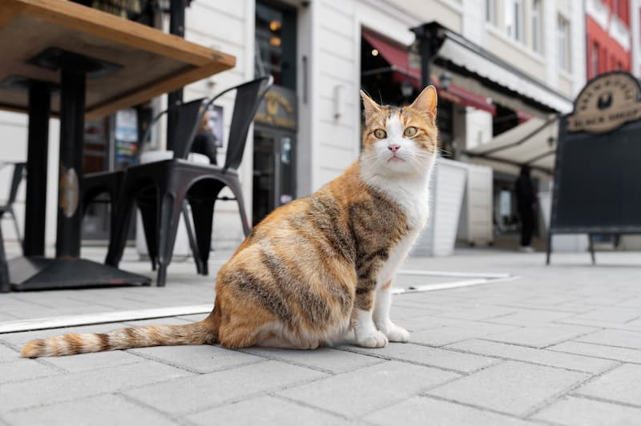

# 이미지를 다루어야하는 개발자들을 위한 간단한 매뉴얼

이번에는 웹 개발에서 이미지를 어떻게 다룰지에 대해 알아보고자 합니다.
엄청난 묘리를 다루는것은 아니지만, 이미지를 다루는데에 익숙하지 않은 분들에게 조금이나마! 도움을 드리고자 작성하였습니다.

피드백과 수정사항은 언제든지 환영합니다!

## 이미지 최적화? 들어는 봤는데, 왜 해야할까?

오늘날 웹 환경에서 가장 많은 데이터를 차지하는 것은 이미지입니다.
이제는 이미지를 사용하지 않은 웹 페이지는 사실상 없다고 봐도 무방할 정도이니까요.

이미지가 없는 블로그나 웹 페이지를 상상해보면.. 정말 지루하고, 보고싶지도 않을 정도죠. 그만큼 이미지는 사용자의 경험을 높이는 데에 정말 큰 역할을 합니다.

하지만 그만큼 많은 데이터를 사용하고, 서버와 네트워크에 부하를 주기도 합니다.
특히 최근들어 수많은 경쟁을 뚫고 나타나는 고성능 모바일 기기들은 한장에 수십 MB에 달하는 이미지를 생산해내기도 하죠.
이러한 환경에서, 이미지를 최적화하여 사용자 경험을 향상시키고 서버 부하를 줄이는 것은 매우 중요한 일입니다.

즉, 우리는 앱 전반에 걸쳐서 '용량은 작으면서도 화질은 좋은' 이미지를 사용하기위해 최적화를 해야합니다.

이를 다시 정리해보면 아래와 같습니다.

- 이미지 최적화는 웹 페이지의 성능과 사용자 경험을 향상시키기 위해 반드시 필요합니다.
- 이를 통해 사용자에게 더 빠른 응답성을 제공할 수 있습니다.
- 또한 서버 부하를 줄여, 비용을 절감하고 보다 안정적인 서비스를 제공할 수 있습니다.
- 특히 모바일 환경에서는 데이터 소모량을 줄여 사용자에게 더 쾌적한 서비스를 제공할 수 있습니다.

### 들어가기 전에, 주요 개념을 알아봅시다.

#### 이미지 크기(Dimensions)

- 이미지의 크기는 해상도(픽셀 수)를 의미합니다.
- 당연하게도 해상도가 높을수록 더 많은 세부 사항을 포함하지만, 파일 크기도 비례해서 커지게 됩니다.
- 일반적으로 모바일에서는 최대 약 **400-600px** 정도의 크기로 충분하며, 데스크탑에서는 최대 **1200-1600px** 정도의 크기면 충분합니다.
    - 물론, 특정한 상황에 따라 더 크거나 더 작은 크기가 필요할 수 있습니다.

#### 이미지 용량(File Size)

- 이미지 용량은 이미지 파일의 크기를 의미하며, 대부분 KB 또는 MB 단위로 표시됩니다.
- 용량이 큰 이미지를 다루는것은 물적, 시간적, 비용적으로 모두 부담이 될 수 있습니다.
- 특히 사용자로부터 임의의 이미지를 업로드 받는 서비스의 경우, 필수적으로 이를 통제해야 합니다.
- 백엔드에서 서브하는 이미지의 경우, **1MB**를 넘는다면 꼭 고민을 해봐야 할 필요가 있습니다.
    - 일반적인 웹사이트에서 대부분의 이미지는 **500KB** 이하로 충분합니다.
    - 작은 이미지나 썸네일이라면 **100KB** 이하로도 충분합니다.

#### 이미지 품질(Quality)

- 이미지 품질은 이미지의 시각적 화질을 의미하며, 압축 방법에 따라 달라집니다.
- 품질이 낮을수록 파일 크기가 작아지지만, 시각적인 손실이 발생할 수 있습니다.
- 흔히 퀄리티(Quality)라는 용어로 표현되며, 대부분 0-100 사이의 값을 가집니다.
  - 하지만 이 값이 **절대 %(퍼센트)를 의미하는 것은 아닙**니다. 이는 아래에서 자세히 다룰 예정이니, 이 점을 꼭 유의해 주세요!

이 외에도 `effort`와 같은 개념도 존재하지만, 여기서는 다루지 않겠습니다.

## 흔히 사용하는 대표적인 이미지 포맷과 용도 제안

### JPEG(JPG) (32세, 만능 엔터테이너)

- `JPEG`는 손실 압축을 사용하는 이미지 포맷입니다.
- 해상도가 높은 이미지를 비교적 작은 용량으로 저장할 수 있습니다.
- 매우 호환성이 높아, 거의 모든 디바이스와 브라우저에서 지원하고, 대부분의 편집기에서 편집할 수 있습니다.
- `JPEG` 퀄리티 값은 단순한 퍼센트가 아닌 수학적 공식에 기반한 '변수'이고, 이를 통해 파일의 크기와 품질이 결정됩니다.
    - 아래의 '자세히 알아보기: JPEG의 퀄리티란?'에서 더 자세히 다루겠습니다.
- 압축으로 인한 손실이 발생하므로, 텍스트나 선명한 경계를 가진 이미지에는 적합하지 않습니다.
    - [디지털 풍화](https://namu.wiki/w/%EB%94%94%EC%A7%80%ED%84%B8%20%ED%92%8D%ED%99%94) 들어보셨죠? `JPEG`의 손실 압축이 이러한 현상을 일으킵니다.  
    이를 최소화하기 위해서는 **이미지의 width, height를 8의 배수로** 맞추는 것이 좋습니다.  
    이는 아래 `PNG` 설명에서 '자세히 알아보기: 로고와 텍스트에 `PNG`가 적합한 이유'를 통해 더 이야기 해보겠습니다.
    
- 아래의 모든 이미지 중 유일하게 `CMYK` 색상 모델을 지원하므로, 프린트용 이미지로도 사용할 수 있습니다.
  - 인쇄용으로는 `TIFF`등을 사용하는 것이 일반적이지만, 그런것을 사용하는 분이라면 이미 저보다 잘 알고 계실 것 같네요

**주된 용도**: 중·소형 이미지에 적합하며, 중간 정도의 품질에서 파일 크기와 화질 간의 균형이 좋습니다. 웹 사진, 블로그 포스트 등에 주로 사용됩니다.

**부적절한 용도**: 알파 채널(투명도)이 필요한 이미지나 매우 높은 품질이 중요한 그래픽에는 적합하지 않다.

#### 자세히 알아보기: JPEG의 퀄리티란?

많은 분들이 이미지의 퀄리티를 퍼센트의 개념으로 오해하고 있습니다.  

그러나, `JPEG`의 설명 맨 첫줄에서 보셨듯이, `JPEG`는 손실 압축을 사용하는 이미지 포맷입니다.  
따라서 `JPEG`는 원본 데이터를 모두 가지고있지 않고, `JPEG`는 퍼센트의 개념으로 화질을 표현하는 것이 태생적으로 불가능합니다.  

이를 좀 더 구체적으로 이야기하자면, 퀄리티를 70으로 내렸다가 다시 100으로 올린다고 해서 원본 이미지의 퀄리티를 되찾을 수 없으며, 심지어 다른 포멧의 이미지를 퀄리티 100으로 저장한다 해도 원본 이미지와 동일한 데이터를 가졌다고 보장 할 수 없다는 것입니다.  

퀄리티를 100으로 설정할 경우, 파일 크기가 급격히 증가하지만 품질 향상은 느낄 수 없으며, 단지 더 비싼 모자이크된 이미지를 얻게 될 뿐입니다.  

이러한 이유로, 우리는 적절한 타협점을 찾아야 합니다. 그리고 퀄리티 75가 바로 파일 크기와 품질의 균형을 맞춘 '스위트 스팟'입니다. 이 이상으로 퀄리티를 높인다 해도 대부분의 경우 파일의 크기만 커지고 품질 향상은 느낄 수 없습니다.  

- ⬆️ (퀄리티 100 (328kb) vs 퀄리티 50 (33kb), [👉 여기를 눌러 직접 비교해 보세요.](https://www.blue-rabbit.kr/utils/slide-compare?url1=aHR0cHM6Ly9naXRodWIuY29tL0hDLWthbmcvVElML2Jsb2IvbWFpbi9JbWFnZXMvaW1hZ2VzL3RoZS1jYXQtcS0xMDAuanBnP3Jhdz10cnVl&url2=aHR0cHM6Ly9naXRodWIuY29tL0hDLWthbmcvVElML2Jsb2IvbWFpbi9JbWFnZXMvaW1hZ2VzL3RoZS1jYXQtcS01MC5qcGc/cmF3PXRydWU%3D))
- 이 이미지는 고양이의 양쪽 눈의 품질 차이가 꽤 느껴지시죠?

- ⬆️ (퀄리티 100 (328kb) vs 퀄리티 75 (45kb), [👉 여기를 눌러 직접 비교해 보세요.](https://www.blue-rabbit.kr/utils/slide-compare?url1=aHR0cHM6Ly9naXRodWIuY29tL0hDLWthbmcvVElML2Jsb2IvbWFpbi9JbWFnZXMvaW1hZ2VzL3RoZS1jYXQtcS0xMDAuanBnP3Jhdz10cnVl&url2=aHR0cHM6Ly9naXRodWIuY29tL0hDLWthbmcvVElML2Jsb2IvbWFpbi9JbWFnZXMvaW1hZ2VzL3RoZS1jYXQtcS03NS5qcGc/cmF3PXRydWU%3D))
- 이번에는 품질 차이가 느껴지시나요? 참고로 위의 모든 이미지는 3배 확대된 이미지입니다. 게다가 벨로그에 올라가면서 더 확대되겠죠. 원본 배율이었다면 차이를 느끼기 더 힘드셨을겁니다.

약간의 욕심을 부린다면 퀄리티 80 정도로 설정해도 괜찮을 테지만 그 이상은 과욕입니다.

### PNG (28세, 디자이너)

- `PNG`는 비손실 압축을 사용하는 이미지 포맷입니다.
- 이미지의 품질이 손상되지 않으며, 투명도(알파 채널)를 지원합니다.
- 이로인해 `PNG`는 텍스트나 로고와 같이 선명한 경계를 가진 그래픽에 적합합니다.
    - [딕셔너리 기반 압축 알고리즘](https://en.wikipedia.org/wiki/LZ77_and_LZ78)의 특성상, 단순한 이미지(단색 배경, 패턴의 반복 등)의 경우, 매우 효율적인 압축률을 보입니다.
    - 또한 원본의 데이터를 손실 없이 보존하기 때문에, 선명한 경계를 잘 나타낼 수 있습니다.
- 그러나, 그 외의 복잡한 이미지에서는 파일 크기가 상대적으로 커지기 때문에 비효율적일 수 있습니다.

**주된 용도**: 매우 큰 이미지, 품질이 중요한 이미지, 투명도가 필요한 그래픽에 적합합니다. 로고, 아이콘, 일러스트레이션 등에 주로 사용됩니다.

**부적절한 용도**: 파일 크기가 중요한 경우, 예를 들어 웹 페이지 로딩 속도가 중요한 경우에는 부적합하다.

#### 자세히 알아보기: 로고와 텍스트에 PNG가 적합한 이유(JPEG와의 비교를 중점으로)

앞서 설명한 것처럼, `PNG`는 투명도를 지원하고, 이미지의 품질을 손상시키지 않는 비손실 압축을 사용하는 이미지 포맷입니다.  
이러한 특성 때문에 `PNG`는 로고나 텍스트와 같이 선명한 경계를 가진 이미지에 적합한데요, 이는 JPEG와 비교해 본다면 좀 더 명확하게 이해할 수 있습니다.

계속 이야기했듯이, `JPEG`는 손실 압축을 사용하는 이미지 포맷입니다.  
특히 아래와 같은 DCT(Discrete Cosine Transform) 테이블과, 첨부하지는 않았지만 양자화 테이블(Quantization Table)을 사용하는데요, 덕분에 복잡한 이미지를 비교적 작은 용량으로 저장할 수 있습니다.

- ⬆️ JPEG의 압축에 사용되는 DCT(Discrete Cosine Transform) 테이블

- ⬆️ JPEG로 저장한 고양이 이미지(퀄리티 5, 확대)

양자화 테이블은 굳이 꺼내지 않았지만, DCT 테이블은 하나의 꿀팁을 위해 꺼내왔습니다.  
`JPEG`는 이미지를 8x8 픽셀 블록으로 나누어 DCT를 적용하는데, 이 때 사용되는 DCT 테이블은 사실상 해당 블록의 픽셀을 뭉개버리는 것과 같습니다.  
그런데 만약 이 뭉개짐이 텍스트나 로고와 같이 선명한 경계를 가진 이미지에 적용된다면, 이러한 경계가 흐릿해지거나, 뭉개지는 현상이 발생할 수 있습니다.  
특히 여러 번 중복 저장을 하게 된다면, 이러한 현상은 더욱 심해질 수 있겠죠. 이게 바로 디지털 풍화라는 현상입니다.

  
- ⬆️ JPEG로 저장한 'Hello, World!' 이미지(160x40)

- ⬆️ JPEG로 저장한 'Hello, World!' 이미지(162x41)

- ⬆️ PNG로 저장한 'Hello, World!' 이미지(160x40)

위의 이미지를 보시면, `JPEG`로 저장한 이미지는 텍스트의 경계가 흐릿해지고, 배경과 텍스트의 경계가 뭉개지는 현상이 발생합니다. 특히 글자 주변에 검은 점이 곳곳에 발생했네요.

이외에도 단색 배경이나 패턴의 반복 등, 단순한 이미지의 경우에는 앞서 말씀드린 '딕셔너리 기반 압축 알고리즘'의 특성상 매우 효율적인 압축률을 보여 오히려 `JPEG`보다 용량이 작아질 수도 있습니다.

이러한 이유로, 로고나 텍스트와 같이 선명한 경계를 가진 이미지에는 `PNG`가 적합하며, 이러한 이미지를 사용할 경우 `JPEG`보다 더 나은 품질을 제공할 수 있습니다.

### GIF (37세, 애니메이터?)

- `GIF`는 256색의 제한된 색상 팔레트를 사용하는 비손실 압축 이미지 포맷입니다.
- 애니메이션을 지원하며, 짧은 클립이나 간단한 움직임을 표현하는 데 사용됩니다.
- 투명도도 지원하지만, `PNG`와 달리 반투명(부분적 투명도)은 지원하지 않습니다.
    - 알파 채널이 오직 0(투명) 또는 255(불투명) 두 가지 값만을 가질 수 있습니다.
- 파일 크기가 작은 편이지만, 색상 제한으로 인해 복잡한 이미지에는 적합하지 않습니다.
    - 프레임 수에 따라 파일 크기가 급격히 증가할 수 있으므로, 애니메이션의 길이와 프레임 수를 최소화하는 것이 중요합니다.
- 브라우저별로 애니메이션 재생 속도가 다를 수 있다는 점에 유의해야 합니다.

**주된 용도**: 짧은 애니메이션, 간단한 움직임을 표현하는 그래픽에 적합합니다. 밈, 로딩 스피너 등에 주로 사용됩니다.

**부적절한 용도**: 색상이 복잡하거나 높은 품질이 요구되는 이미지에는 부적합 합니다. 정적인 이미지의 경우, 다른 포맷을 사용하는 것이 더 나은 품질과 효율성을 제공합니다.

### WEBP (14세, 자라나는 신인)

- `WEBP`는 구글에서 개발한 이미지 포맷으로, `JPEG`와 PNG의 장점을 모두 가지고 있습니다.
- 손실 및 비손실 압축을 모두 지원하며, 애니메이션도 포함할 수 있습니다.
- 같은 품질 수준에서 `JPEG보`다 약 30% 더 작은 파일 크기를 제공합니다.
- `WEBP`를 비손실 고퀄리티로 사용할 경우, 오히려 `PNG`보다 파일 크기가 커질 수 있습니다. 이는 비손실 압축이 특정 이미지에 대해 비효율적일 수 있기 때문입니다.
    - 대체로 복잡한 이미지에는 손실압축이, 단색 배경이나 패턴의 반복 등 단순한 이미지에는 비손실 압축이 더 효율적입니다.
- `WEBP`는 품질 값 65-75 정도에서 파일 크기와 화질 간의 균형이 가장 좋은 '스위트 스팟'을 갖습니다.
- 웹에서 사용하기에 적합하지만, 일부 IE와 같은 오래된 브라우저 및 iOS 기반 사파리와 같은 환경에서는 지원이 제한적일 수 있습니다.
- 태생적으로 대형 이미지를 다룰 수 없습니다. 포멧의 메타데이터 수준에서 크기가 16,383 x 16,383 픽셀로 제한되어 있습니다.
- 대부분의 경우 `GIF`보다 더 나은 대안이 될 수 있습니다.
    - 이미지 자체의 품질도 더 좋고, 투명도도 지원하며 움직임도 표현할 수 있기 때문입니다.

**주된 용도**: 파일 크기를 줄여야 하는 웹 환경에서 유용하며, 일반적인 웹 이미지를 대상으로 합니다. 중·소형 크기의 이미지에 적합합니다.

**부적절한 용도**: 대형 이미지나, 품질이 중요한 경우. 혹은 모든 사용자가 최신 브라우저를 사용하지 않는 환경에서는 부적합합니다.

### AVIF (5세, 응애)

- `AVIF`는 `AV1` 비디오 코덱을 기반으로 한 이미지 포맷입니다.
- 더 높은 압축 효율성을 통해 JPEG보다 작은 용량으로 더 높은 품질을 제공합니다.
- 특히 저품질 설정에서도 시각적으로 우수한 결과를 제공하므로 웹에서 이미지 최적화에 유리합니다.
- `AVIF`는 품질 값 50-60 정도에서 '스위트 스팟'을 갖습니다.
- 아직 모든 브라우저에서 지원되지 않습니다.
    - 심지어 사용하는 코덱에 따라 지원(~~한다고 주장~~)하는(`CanIUse` 기준) 브라우저에서도 지원 범위가 다를 수 있습니다.
- 포멧 자체는 65,535 x 65,535 픽셀까지 지원합니다. 하지만 대부분의 편집기에서 16,383 x 16,383 픽셀로 제한됩니다.

**주된 용도**: 파일 크기와 화질을 최대한 줄이고자 할 때 유용하며, 최신 웹 환경에서 이미지 최적화에 유리합니다. 중·소형 크기의 이미지에 적합합니다.

**부적절한 용도**: 대형 이미지나 품질이 매우 중요한 이미지, 혹은 모든 사용자가 최신 브라우저를 사용하지 않는 경우에는 부적합합니다.

## 결론: 이미지를 어떻게 다루는게 최선일까?

### 이미지 크기 조절

앞서 말한것과 같이, 이미지의 크기를 적절히 조절하는 것이 이미지 최적화의 첫걸음입니다. 특히 최근 모바일 기기나 카메라의 발전으로 인해 대부분의 이미지는 과도하게 큰 해상도를 가지고 있고, 많은 사람들이 '이정도는 너무 작은것 아니야?'라고 생각하기도 합니다.  

- ⬆️ 8,000x5,323, Q100 고양이 이미지. 17.8MB

- ⬆️ 800x532, Q75 고양이 이미지. 45KB. 약 400배 차이

> 사실 벨로그에서는 둘다 똑같이 보여질겁니다.

하지만 대부분의 웹 환경에서 페이지가 실제로 그려지는 영역의 폭은 평균적으로 1200px 정도이며, 모바일에서는 400-600px 정도도 충분합니다. 정말 큰 경우에도 1920px 정도에 그치죠.  
게다가 그 영역 안에 이미지가 가득 차야하는 경우는 더욱 드물죠.

또한 생각보다 사람들은 이미지의 해상도에 대해 그렇게까지 민감하지 않습니다.  
물론 제품 판매 페이지의 상세보기 이미지나, 블로그 포스트의 특정 이미지 등에는 높은 해상도가 필요할 수 있겠지만, 그런 이미지는 직접 사용해보고 피드백을 받아보는 것이 가장 좋습니다.

그리고 또 하나 신경써야 할 부분은 브라우저의 렌더링입니다.  
단순히 큰 이미지가 페이지에 존재하는 것만으로도 브라우저는 그 이미지를 렌더링하기 위해 메모리를 할당하고, 렌더링을 위한 작업을 수행합니다. 흔히들 말하는 버벅임이 발생하는 원인 중 하나가 바로 이러한 과도하게 큰 이미지의 크기 때문이기도 합니다.

이러한 이유로, 가장 먼저 해야 할 일은 이미지의 크기를 적절히 조절하는 것입니다.

### 이미지 포맷 변경 / 품질 조절

또 한가지 고려해야 할 부분은 이미지 포맷입니다. 그리고 생각보다 신경써야 할 부분도 많죠.
이미지 포맷은 이미지의 특성에 따라 적절한 포맷을 선택하는 것이 중요합니다. 위에서 언급했던 각 포멧별 특성을 잘 알아두시고, 이미지의 특성에 맞는 포맷을 선택하는 것이 좋습니다.

그리고 꼭 이미지의 호환성도 고려해야 합니다. 세상에는 정말 수도없이 다양한 디바이스와 브라우저가 존재하며, 이들이 모두 같은 이미지 포맷을 지원하는 것은 아닙니다.  
우리는 모든 이미지를 `WEBP`로 처리할테야! 라고 생각하다가 엉뚱한 브라우저에서 CS문제가 생긴다면 참 골치가 아프실 겁니다.

그리고 포멧을 변경 할 때 반드시 필요한 과정이 바로 품질 조절입니다.  
위에서 언급했듯이, 이미지의 특성별, 용도별로 수많은 선택지가 있습니다. 제가 제시한 스위트 스팟을 그대로 사용하셔도 좋겠지만, 각자 도메인에 맞게 테스트를 진행하시고, 사용자의 피드백을 받아보는 것이 가장 좋습니다.

## 마치며

이미지 최적화는 웹 개발자에게 꼭 필요한 기술 중 하나입니다. 앞으로 웹 상에서 이미지는 점점 많아질 것이고, 우리는 이를 더 많이 다뤄야 하겠죠.

하지만 이미지 최적화는 그렇게 어려운 일은 아닙니다. 명확한 답이 있지도 않구요.  
제가 제시한 기준들이 마음에 들지 않으시다면, 다른 기준을 찾아보셔도 좋습니다.

어찌저찌 최대한 경험한 것들을 정리해보았지만, 다른 분들께서 보시기에 부족한점이 많을 것 같습니다.
언제든 피드백은 열려있습니다. 수정할 부분이나, 더 궁금하신 부분 등은 언제든지 댓글로 남겨주시면 감사하겠습니다!
