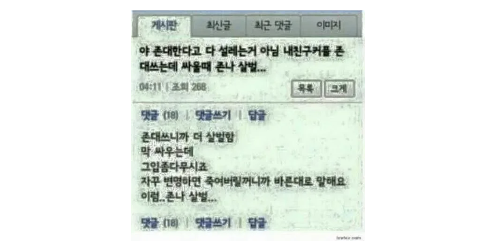
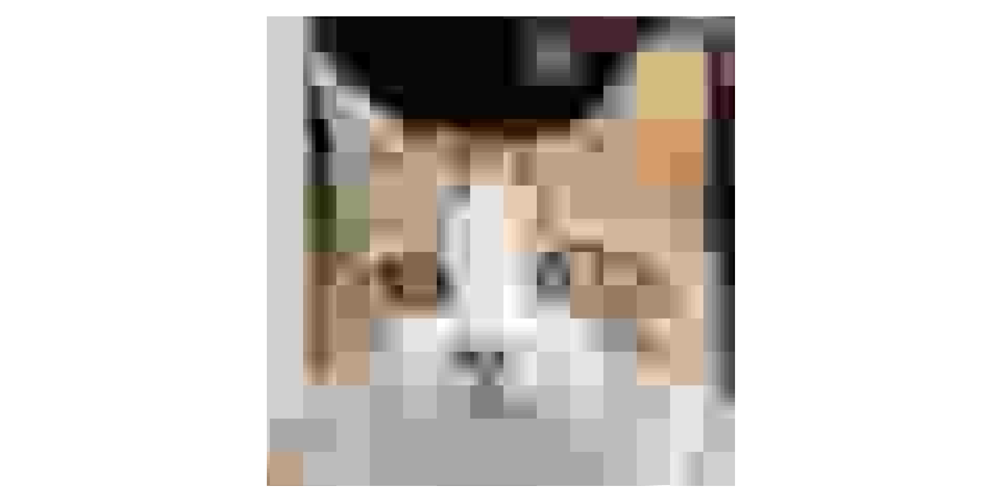

# 이미지를 고민하는 개발자들을 위한 매뉴얼

이번에는 웹 개발에서 이미지를 어떻게 다룰지에 대해 알아보고자 합니다.
엄청난 묘리를 다루는것은 아니지만, 이미지를 다루는데에 익숙하지 않은 분들에게 조금이나마! 도움을 드리고자 작성하였습니다.

피드백과 수정사항은 언제든지 환영합니다!

## 이미지 최적화? 들어는 봤는데, 왜 해야할까?

오늘날 웹 환경에서 가장 많은 데이터를 차지하는 것은 이미지입니다.
이제는 이미지를 사용하지 않은 웹 페이지는 사실상 없다고 봐도 무방할 정도이니까요.

이미지가 없는 블로그나 웹 페이지를 상상해보면.. 정말 지루하고, 보고싶지도 않을 정도죠. 그만큼 이미지는 사용자의 경험을 높이는 데에 정말 큰 역할을 합니다.

하지만 그만큼 많은 데이터를 사용하고, 서버와 네트워크에 부하를 주기도 합니다.
특히 최근들어 수많은 경쟁을 뚫고 나타나는 고성능 모바일 기기들은 한장에 수십 MB에 달하는 이미지를 생산해내기도 하죠.
이러한 환경에서, 이미지를 최적화하여 사용자 경험을 향상시키고 서버 부하를 줄이는 것은 매우 중요한 일입니다.

즉, 우리는 앱 전반에 걸쳐서 '용량은 작으면서도 화질은 좋은' 이미지를 사용하기위해 최적화를 해야합니다.

이를 다시 정리해보면 아래와 같습니다.

- 이미지 최적화는 웹 페이지의 성능과 사용자 경험을 향상시키기 위해 반드시 필요합니다.
- 이를 통해 사용자에게 더 빠른 응답성을 제공할 수 있습니다.
- 또한 서버 부하를 줄여, 비용을 절감하고 보다 안정적인 서비스를 제공할 수 있습니다.
- 특히 모바일 환경에서는 데이터 소모량을 줄여 사용자에게 더 쾌적한 서비스를 제공할 수 있습니다.

### 들어가기 전에, 주요 개념을 알아봅시다.

#### 이미지 크기(Dimensions)

- 이미지의 크기는 해상도(픽셀 수)를 의미합니다.
- 당연하게도 해상도가 높을수록 더 많은 세부 사항을 포함하지만, 파일 크기도 비례해서 커지게 됩니다.
- 일반적으로 모바일에서는 최대 약 400-600px 정도의 크기로 충분하며, 데스크탑에서는 최대 1200-1600px 정도의 크기면 충분합니다.
    - 물론, 특정한 상황에 따라 더 크거나 작은 크기가 필요할 수 있습니다.

#### 이미지 용량(File Size)

- 이미지 용량은 이미지 파일의 크기를 의미하며, 대부분 KB 또는 MB 단위로 표시됩니다.
- 용량이 큰 이미지를 다루는것은 물적, 시간적, 비용적으로 모두 부담이 될 수 있습니다.
- 특히 사용자로부터 임의의 이미지를 업로드 받는 서비스의 경우, 필수적으로 이를 통제해야 합니다.
- 백엔드에서 서브하는 이미지의 경우, 1MB를 넘는다면 꼭 고민을 해봐야 할 필요가 있습니다.
    - 일반적인 웹사이트에서 대부분의 이미지는 500KB 이하로 충분합니다.
    - 작은 이미지나 썸네일이라면 100~200KB 이하로도 충분합니다.

#### 이미지 품질(Quality)

- 이미지 품질은 이미지의 시각적 화질을 의미하며, 압축 방법에 따라 달라집니다.
- 품질이 낮을수록 파일 크기가 작아지지만, 시각적인 손실이 발생할 수 있습니다.
- 흔히 퀄리티(Quality)라는 용어로 표현되며, 대부분 0-100 사이의 값을 가집니다.
  - 하지만 이 값이 절대 %(퍼센트)를 의미하는 것은 아닙니다. 이는 아래에서 자세히 다룰 예정이니, 이 점을 꼭 유의해 주세요!

이 외에도 `effort`와 같은 개념도 존재하지만, 여기서는 다루지 않겠습니다.

## 흔히 사용하는 대표적인 이미지 포맷과 용도 제안

### JPEG(JPG) (32세, 만능 엔터테이너)

- `JPEG`는 손실 압축을 사용하는 이미지 포맷입니다.
- 해상도가 높은 이미지를 비교적 작은 용량으로 저장할 수 있습니다.
- 매우 호환성이 높아, 거의 모든 디바이스와 브라우저에서 지원하고, 대부분의 편집기에서 편집할 수 있습니다.
- 압축으로 인한 손실이 발생하므로, 텍스트나 선명한 경계를 가진 이미지에는 적합하지 않습니다.
    - [디지털 풍화](https://namu.wiki/w/%EB%94%94%EC%A7%80%ED%84%B8%20%ED%92%8D%ED%99%94) 들어보셨죠? `JPEG`의 손실 압축이 이러한 현상을 일으킵니다.  
    이 또한 아래에서 더 자세히 다루겠습니다.
    
- `JPEG` 퀄리티 값은 단순한 퍼센트가 아닌 수학적 공식에 기반한 '변수'이고, 이를 통해 파일의 크기와 품질이 결정됩니다.
- 아래의 모든 이미지 중 유일하게 CMYK 색상 모델을 지원하므로, 프린트용 이미지로도 사용할 수 있습니다.
  - 인쇄용으로는 TIFF등을 사용하는 것이 일반적이지만, 그런것을 사용하는 분이라면 이미 저보다 잘 알고 계실 것 같네요

**주된 용도**: 중·소형 이미지에 적합하며, 중간 정도의 품질에서 파일 크기와 화질 간의 균형이 좋습니다. 웹 사진, 블로그 포스트 등에 주로 사용됩니다.

**부적절한 용도**: 알파 채널(투명도)이 필요한 이미지나 매우 높은 품질이 중요한 그래픽에는 적합하지 않다.

#### 자세히 알아보기: JPEG의 퀄리티란?

많은 분들이 이미지의 퀄리티를 퍼센트의 개념으로 오해하고 있습니다.  

그러나, JPEG의 설명 맨 첫줄에서 보셨듯이, JPEG는 손실 압축을 사용하는 이미지 포맷입니다.  
따라서 JPEG는 원본 데이터를 모두 가지고있지 않고, JPEG는 퍼센트의 개념으로 화질을 표현하는 것이 태생적으로 불가능합니다.  

이를 좀 더 구체적으로 이야기하자면, 퀄리티를 70으로 내렸다가 다시 100으로 올린다고 해서 원본 이미지의 퀄리티를 되찾을 수 없으며, 심지어 다른 포멧의 이미지를 퀄리티 100으로 저장한다 해도 원본 이미지와 동일한 데이터를 가졌다고 보장 할 수 없다는 것입니다.  

퀄리티를 100으로 설정할 경우, 파일 크기가 급격히 증가하지만 품질 향상은 느낄 수 없으며, 단지 더 비싼 모자이크된 이미지를 얻게 될 뿐입니다.  

이러한 이유로, 우리는 적절한 타협점을 찾아야 합니다. 그리고 퀄리티 75가 바로 파일 크기와 품질의 균형을 맞춘 '스위트 스팟'입니다. 이 이상으로 퀄리티를 높인다 해도 대부분의 경우 파일의 크기만 커지고 품질 향상은 느낄 수 없습니다.  

- ⬆️ (퀄리티 100 (328kb) vs 퀄리티 50 (33kb), [👉 여기를 눌러 직접 비교해 보세요.](https://www.blue-rabbit.kr/utils/slide-compare?url1=aHR0cHM6Ly9naXRodWIuY29tL0hDLWthbmcvVElML2Jsb2IvbWFpbi9JbWFnZXMvaW1hZ2VzL3RoZS1jYXQtcS0xMDAuanBnP3Jhdz10cnVl&url2=aHR0cHM6Ly9naXRodWIuY29tL0hDLWthbmcvVElML2Jsb2IvbWFpbi9JbWFnZXMvaW1hZ2VzL3RoZS1jYXQtcS01MC5qcGc/cmF3PXRydWU%3D))
- 이 이미지는 고양이의 양쪽 눈의 품질 차이가 꽤 느껴지시죠?

- ⬆️ (퀄리티 100 (328kb) vs 퀄리티 75 (45kb), [👉 여기를 눌러 직접 비교해 보세요.](https://www.blue-rabbit.kr/utils/slide-compare?url1=aHR0cHM6Ly9naXRodWIuY29tL0hDLWthbmcvVElML2Jsb2IvbWFpbi9JbWFnZXMvaW1hZ2VzL3RoZS1jYXQtcS0xMDAuanBnP3Jhdz10cnVl&url2=aHR0cHM6Ly9naXRodWIuY29tL0hDLWthbmcvVElML2Jsb2IvbWFpbi9JbWFnZXMvaW1hZ2VzL3RoZS1jYXQtcS03NS5qcGc/cmF3PXRydWU%3D))
- 이번에는 품질 차이가 느껴지시나요? 참고로 위의 모든 이미지는 3배 이상 확대된 이미지입니다. 원래 배율이었다면 차이를 느끼기 더 힘드셨을겁니다.

약간의 욕심을 부린다면 퀄리티 80 정도로 설정해도 괜찮을 테지만 그 이상은 과욕입니다.

### PNG (28세, 디자이너)

- PNG는 비손실 압축을 사용하는 이미지 포맷입니다.
- 이미지의 품질이 손상되지 않으며, 투명도(알파 채널)를 지원합니다.
- PNG는 텍스트나 로고와 같이 선명한 경계를 가진 그래픽에 적합합니다.
    - [딕셔너리 기반 압축 알고리즘](https://en.wikipedia.org/wiki/LZ77_and_LZ78)의 특성상, 단순한 이미지(단색 배경, 패턴의 반복 등)의 경우, 매우 효율적인 압축률을 보입니다.
- 그러나, 그 외의 복잡한 이미지에서는 파일 크기가 상대적으로 크기 때문에 비효율적일 수 있습니다.

**주된 용도**: 매우 큰 이미지, 품질이 중요한 이미지, 투명도가 필요한 그래픽에 적합합니다. 로고, 아이콘, 일러스트레이션 등에 주로 사용됩니다.

**부적절한 용도**: 파일 크기가 중요한 경우, 예를 들어 웹 페이지 로딩 속도가 중요한 경우에는 부적합하다.

#### 로고와 텍스트에 PNG가 적합한 이유(vs JPEG)

TODO: PNG 관련 내용 작성

- ⬆️ JPEG의 압축에 사용되는 DCT(Discrete Cosine Transform) 테이블

### GIF (37세, 애니메이터)

- `GIF`는 256색의 제한된 색상 팔레트를 사용하는 비손실 압축 이미지 포맷입니다.
- 애니메이션을 지원하며, 짧은 클립이나 간단한 움직임을 표현하는 데 사용됩니다.
- 투명도도 지원하지만, PNG와 달리 반투명(부분적 투명도)은 지원하지 않습니다.
    - 알파 채널이 오직 0(투명) 또는 255(불투명) 두 가지 값만을 가질 수 있습니다.
- 파일 크기가 작지만, 색상 제한으로 인해 복잡한 이미지에는 적합하지 않습니다.

**주된 용도**: 짧은 애니메이션, 간단한 움직임을 표현하는 그래픽에 적합합니다. 밈, 로딩 스피너 등에 주로 사용됩니다.

**부적절한 용도**: 색상이 복잡하거나 높은 품질이 요구되는 이미지에는 부적합 합니다. 정적인 이미지의 경우, 다른 포맷을 사용하는 것이 더 나은 품질과 효율성을 제공합니다.

### WEBP (14세, 자라나는 신인)

- `WEBP`는 구글에서 개발한 이미지 포맷으로, `JPEG`와 PNG의 장점을 모두 가지고 있습니다.
- 손실 및 비손실 압축을 모두 지원하며, 애니메이션도 포함할 수 있습니다.
- 같은 품질 수준에서 JPEG보다 약 30% 더 작은 파일 크기를 제공합니다.
- `WEBP`를 무손실 고퀄리티로 사용할 경우, 오히려 PNG보다 파일 크기가 커질 수 있습니다. 이는 무손실 압축이 특정 이미지에 대해 비효율적일 수 있기 때문입니다.
- `WEBP`는 품질 값 65-75 정도에서 파일 크기와 화질 간의 균형이 가장 좋은 '스위트 스팟'을 갖습니다.
- 웹에서 사용하기에 적합하지만, 일부 IE와 같은 오래된 브라우저 및 iOS 기반 사파리와 같은 환경에서는 지원이 제한적일 수 있습니다.
- 태생적으로 대형 이미지를 다룰 수 없습니다. 포멧의 메타데이터 수준에서 크기가 16,383 x 16,383 픽셀로 제한되어 있습니다.

**주된 용도**: 파일 크기를 줄여야 하는 웹 환경에서 유용하며, 일반적인 웹 이미지를 대상으로 합니다. 중·소형 크기의 이미지에 적합합니다.

**부적절한 용도**: 대형 이미지나, 품질이 중요한 경우. 혹은 모든 사용자가 최신 브라우저를 사용하지 않는 환경에서는 부적합합니다.

### AVIF (5세, 응애)

- `AVIF`는 AV1 비디오 코덱을 기반으로 한 이미지 포맷입니다.
- 더 높은 압축 효율성을 통해 JPEG보다 작은 용량으로 더 높은 품질을 제공합니다.
- 특히 저품질 설정에서도 시각적으로 우수한 결과를 제공하므로 웹에서 이미지 최적화에 유리합니다.
- `AVIF`는 품질 값 50-60 정도에서 비슷하거나 더 나은 시각적 결과를 제공하면서도 파일 크기를 더욱 줄일 수 있는 '스위트 스팟'을 갖습니다.
- 아직 모든 브라우저에서 지원되지 않습니다.
    - 심지어 사용하는 코덱에 따라 지원하는(CanIUse 기준) 브라우저에서도 지원 범위가 다를 수 있습니다.
- 포멧 자체는 65,535 x 65,535 픽셀까지 지원합니다. 하지만 대부분의 편집기에서 16,383 x 16,383 픽셀로 제한됩니다.

**주된 용도**: 파일 크기와 화질을 최대한 줄이고자 할 때 유용하며, 최신 웹 환경에서 이미지 최적화에 유리하다. 중·소형 크기의 이미지에 적합합니다.

**부적절한 용도**: 대형 이미지나 품질이 매우 중요한 이미지, 혹은 모든 사용자가 최신 브라우저를 사용하지 않는 경우에는 부적합하다.

### 이미지 최적화 방법

#### 이미지 크기 조절

- 이미지의 해상도를 줄여 파일 크기를 줄일 수 있습니다.
- 웹에서는 특히, 필요한 크기보다 큰 이미지를 사용하지 않도록 주의해야 합니다.

#### 이미지 품질 조절

- JPEG와 같은 손실 압축 포맷에서는 품질 값을 적절히 조절하여 파일 크기와 시각적 품질 간의 균형을 맞출 수 있습니다.
- 예를 들어, JPEG의 경우 일반적으로 퀄리티 75 정도면 충분합니다.

#### 이미지 포맷 변경

- 이미지를 적절한 포맷으로 변경하는 것도 최적화 방법입니다.
- 예를 들어, 사진과 같이 복잡한 이미지는 JPEG, 투명도가 필요한 로고는 PNG, 웹에서는 `WEBP`나 `AVIF`를 사용하면 충분합니다.