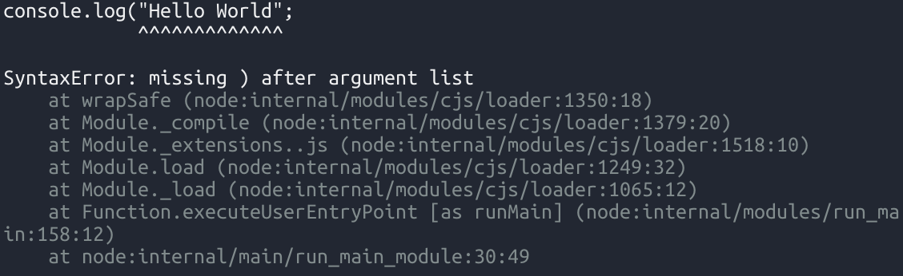

# 자바스크립트는 사실 컴파일 언어이다?

얼마 전, You don't know JS Yet라는 책을 꽤나 재미있게 읽었습니다. 그중에서도 저자가 주장했던 재미있는 부분을 하나 소개하고자 합니다.

이 책에서 저자는 자바스크립트는 컴파일 언어라고 주장합니다. 이름부터가 '스크립트'인데 이게 무슨 소리냐? 라는 생각이 들 수 있지만, 저자는 이를 꽤나 다양한 근거를 들어 설명하고 있습니다.

먼저 주요 개념에 대해 정리부터 해야 할 것 같습니다.

- 컴파일 언어: 소스코드를 실행하기 전에 미리 기계어로 변환하는 언어. 한번에 전체를 실행한다.
- 인터프리터 언어: 소스코드를 실행하는 동시에 기계어로 변환하는 언어. 한 줄씩 실행한다.

두 가지 종류의 확실한 예시를 들어 보자면, C언어나 JAVA는 컴파일 언어이며, 파이썬은 인터프리터 언어입니다. 여기에 이견을 갖는 분은 딱히 안 계실 거라 생각합니다.

## 컴파일 언어와 인터프리터 언어의 차이

C언어는 아래와 같은 간단한 코드를 실행하는 경우에도 컴파일 과정을 반드시 거쳐야 합니다.

  ```c
  #include <stdio.h>

  int main() {
    printf("hello");
    printf("hi");
    printf("Hello World");
    return 0;
  }
  ```

반면에 파이썬은 복잡한 코드를 실행하는 경우에도 즉시 실행이 가능하며, 한 줄씩 실행합니다.

  ```python
  print("Hello")
  print("Hi")
  print("Hello World")
  ```

또한 C언어는 아래와 같이 오탈자가 있는 경우 컴파일 오류가 발생하며, 실행이 불가능합니다.

  ```c
  #include <stdio.h>

  int main() {
    printf("hello");
    printf("hi");
    printf("Hello World") // 세미콜론 누락
    return 0;
  }
  ```

반면에 파이썬은 아래와 같이 오탈자가 있는 경우에도 문제가 발생하기 직전까지는 실행이 가능합니다.

  ```python
  print("Hello")
  print("Hi")         # 여기까지는 정상적으로 실행됨
  print("Hello World" # 괄호 누락
  ```

자 그러면, 여기서 자바스크립트는 어떻게 동작할까요?

  ```js
  console.log("Hello");
  console.log("Hi");
  console.log("Hello World");
  ```

자바스크립트도 파이썬처럼 별도의 컴파일 과정 없이 바로 실행이 가능합니다. 그렇다면 자바스크립트는 인터프리터 언어라고 할 수 있겠죠?
그런데 여기서 오타가 하나 발생한다면 어떻게 될까요?

  ```js
  console.log("Hello");
  console.log("Hi")
  console.log("Hello World";
  ```

  

역시 다들 알고계시다시피 실행이 되지 않습니다. 그런데, 파이썬과는 뭔가 다릅니다. 파이썬은 문제가 발생하기 직전까지는 실행이 가능했지만, 자바스크립트는 전혀 실행이 불가능합니다.

## 자바스크립트의 실행 절차

이런 현상이 발생하는 이유는, JS의 독특한 실행 방식 때문입니다. JS는 아래와 같은 과정을 거쳐 실행됩니다.

### JS의 실행 절차

1. 프로그래머가 코드를 작성합니다.
2. `렉싱(Lexing)`이 이루어집니다.
    - 이때 `스캐닝` / `토크나이징` 과정을 거칩니다.
3. `파싱이` 이루어집니다.
    - `코드` -> `추상 구문 트리(AST)` -> `바이트 코드`
4. `컴파일`이 이루어집니다.
5. `최적화`가 이루어집니다.
6. 코드가 실행됩니다.

여기서 또 다른 개념들이 많이 등장합니다.

- `렉싱`: 코드를 문자열로 변환하는 과정
    - `스캐닝`: 코드를 의미를 갖는 최소 단위로 쪼개며, 불필요한 코드를 제거합니다.
    - `토크나이징`: 스캔된 코드 각각을 `의미를 갖는 토큰`으로 변환합니다.
- `파싱`: 토큰 배열을 `추상 구문 트리(AST)`로 변환하는 과정
    - `AST`: 코드의 문법적 구조를 나타내는 트리
- `컴파일`: AST를 바이트 코드로 변환하는 과정
- `최적화`: 코드를 더 효율적으로 실행할 수 있도록 변환하는 과정
    - `JIT 컴파일러`: 코드를 실행하기 전에 미리 기계어로 변환하는 컴파일러. 이 과정에서 최적화가 이루어집니다.

### 주요 개념 톺아보기

#### 시작 전, 원본 코드

```js
function add(a, b) {
    return a + b;
}

console.log(add(2, 3));
```

#### 렉싱(Lexing)과 토크나이징(Tokenizing)

렉싱은 코드를 '의미를 갖는 최소 단위의 문자열'로 쪼개는 단계입니다. 종종 렉싱과 토크나이징을 혼용해서 사용하기도 하지만, 엄밀히 따지면 다른 개념이며 렉싱은 상태를 가지고 코드를 분할하는 과정이고, 토크나이징은 단순히 분할된 코드를 토큰으로 변환하는 과정입니다.

- 스캐닝을 거친 코드

    ```js
    function add ( a , b ) { return a + b ; } console . log ( add ( 2 , 3 ) ) ;
    ```

- 토크나이징을 거친 코드

    ```js
    [
        { type: 'Keyword', value: 'function' },
        { type: 'Identifier', value: 'add' },
        { type: 'Punctuation', value: '(' },
        { type: 'Identifier', value: 'a' },
        { type: 'Punctuation', value: ',' },
        { type: 'Identifier', value: 'b' },
        { type: 'Punctuation', value: ')' },
        { type: 'Punctuation', value: '{' },
        { type: 'Keyword', value: 'return' },
        { type: 'Identifier', value: 'a' },
        { type: 'Operator', value: '+' },
        { type: 'Identifier', value: 'b' },
        { type: 'Punctuation', value: ';' },
        { type: 'Punctuation', value: '}' },
        { type: 'Identifier', value: 'console' },
        { type: 'Punctuation', value: '.' },
        { type: 'Identifier', value: 'log' },
        { type: 'Punctuation', value: '(' },
        { type: 'Identifier', value: 'add' },
        { type: 'Punctuation', value: '(' },
        { type: 'NumericLiteral', value: '2' },
        { type: 'Punctuation', value: ',' },
        { type: 'NumericLiteral', value: '3' },
        { type: 'Punctuation', value: ')' },
        { type: 'Punctuation', value: ')' },
        { type: 'Punctuation', value: ';' }
    ]
    ```

#### 파싱(Parsing)

파싱은 분할된 토큰을 가지고 `추상 구문 트리(AST)`를 구성하는 과정입니다.
AST는 이름 그대로, 트리 구조로 코드의 구조를 표현합니다.

```AST
Program
├── FunctionDeclaration (add)
│   ├── Identifier (a)
│   ├── Identifier (b)
│   └── BlockStatement
│       └── ReturnStatement
│           └── BinaryExpression (+)
│               ├── Identifier (a)
│               └── Identifier (b)
└── ExpressionStatement
    └── CallExpression
        ├── MemberExpression
        │   ├── Identifier (console)
        │   └── Identifier (log)
        └── Arguments
            ├── CallExpression (add)
            │   ├── Literal (2)
            │   └── Literal (3)
```

#### 컴파일(Compilation)과 최적화(Optimization)

JS는 위와 같은 AST를 보고, 바이트 코드로 변환합니다. 이 과정을 컴파일이라고 하고, 다른 언어의 컴파일과 유사한 과정을 거칩니다.
다만 가장 큰 차이점은, JS는 그때그때(Just-In-Time) 컴파일을 수행한다는 점입니다. 또한 이 과정에서 JIT 컴파일러를 사용하여 코드 최적화도 함께 일어납니다.

```txt
// node --trace-opt --trace-deopt example.js
[marking 0x30121686bbd9 <JSFunction isPosixPathSeparator (sfi = 0x145ae5b9ca79)> for optimization to MAGLEV, ConcurrencyMode::kConcurrent, reason: hot and stable]
[compiling method 0x30121686bbd9 <JSFunction isPosixPathSeparator (sfi = 0x145ae5b9ca79)> (target MAGLEV), mode: ConcurrencyMode::kConcurrent]
[completed compiling 0x30121686bbd9 <JSFunction isPosixPathSeparator (sfi = 0x145ae5b9ca79)> (target MAGLEV) - took 0.000, 0.167, 0.000 ms]
[marking 0x30121686bc89 <JSFunction normalizeString (sfi = 0x145ae5b9cb29)> for optimization to MAGLEV, ConcurrencyMode::kConcurrent, reason: hot and stable]
[compiling method 0x30121686bc89 <JSFunction normalizeString (sfi = 0x145ae5b9cb29)> (target MAGLEV), mode: ConcurrencyMode::kConcurrent]
[completed compiling 0x30121686bc89 <JSFunction normalizeString (sfi = 0x145ae5b9cb29)> (target MAGLEV) - took 0.000, 0.375, 0.000 ms]
Debugger attached.
[marking 0x2ff5a5b71189 <JSFunction requireBuiltin (sfi = 0x2378675f66b1)> for optimization to MAGLEV, ConcurrencyMode::kConcurrent, reason: hot and stable]
```

    - Node.js의 실행 로그. Jit 컴파일러가 최적화 대상을 표시하고, 컴파일하며, 완료하는 과정을 보여줌.
        - `marking`: 최적화 대상을 표시
        - `compiling ~~`: 최적화 대상을 컴파일
        - `completed compiling`: 최적화 대상 컴파일 완료
        - MAGLEV: V8 엔진의 최적화 단계 중 하나


## 결론

여기까지 JS의 전반적인 실행 과정을 알아보았는데요, 저자는 실행까지 이러한 과정을 거치기 때문에 JS는 사실 컴파일 언어라고 주장합니다. 이는 JS가 인터프리터 언어처럼 한 줄씩 실행되는 것이 아니라, 전체 코드를 컴파일하고 최적화하여 실행하기 때문입니다.

물론 이견이 있을 수 있지만, 이러한 관점에서 JS를 바라보는것도 꽤나 재미있는 경험이었다고 생각하고, 마치 갤럭시와 아이폰처럼 우리가 흔히 상반된다고 생각하는 여러 제품과 개념들이 시간이 지나며 서로 비슷한 방향으로 발전하고 있는 것을 요즘들어 더 많이 보게 되는 것 같은데, 우리 스스로도 주변을 보고 계속 배워나가야 겠다는 생각이 드네요.

읽어주셔서 감사합니다!


자바스크립트는 왜 컴파일 언어인가?
자바스크립트는 전통적으로 인터프리터 언어로 분류되었지만, 현대의 자바스크립트 엔진은 다소 다른 방식으로 작동합니다. 저자는 자바스크립트가 컴파일 언어라고 주장하는 여러 가지 이유를 제시합니다.

1. Just-In-Time (JIT) 컴파일
현대 자바스크립트 엔진(예: 구글 V8, Mozilla SpiderMonkey)은 Just-In-Time (JIT) 컴파일을 사용합니다. JIT 컴파일은 코드 실행 전에 일부 또는 전체 코드를 기계어로 컴파일합니다. 이는 전통적인 컴파일러와 유사하지만, 런타임 동안 이루어진다는 점에서 차이가 있습니다.

JIT 컴파일을 통해 자바스크립트는 성능을 최적화하고, 반복적으로 실행되는 코드의 실행 속도를 크게 향상시킵니다. 즉, 자바스크립트 엔진은 코드를 한 줄씩 인터프리팅하지 않고, 전체 코드를 분석하여 필요한 부분을 미리 컴파일하는 과정을 거칩니다.

2. 엔진 내부의 최적화
자바스크립트 엔진은 다양한 최적화 기법을 사용하여 코드의 실행 성능을 높입니다. 예를 들어, 구글 V8 엔진은 "핫 코드"(자주 실행되는 코드)를 감지하여 이를 최적화된 기계어로 컴파일합니다. 이러한 최적화 과정은 전통적인 컴파일러가 수행하는 작업과 유사합니다.

3. 컴파일 단계에서의 오류 검출
자바스크립트는 런타임에서 오류를 감지하고 처리하는 인터프리터 언어의 특성을 가지고 있지만, 현대 자바스크립트 엔진은 컴파일 단계에서 많은 오류를 사전에 감지할 수 있습니다. 이는 컴파일 언어의 특징과 일치합니다. 예를 들어, 코드에 문법 오류가 있는 경우 자바스크립트 엔진은 이를 미리 감지하고 실행을 중단할 수 있습니다.

결론
저자의 주장에 따르면, 자바스크립트는 단순한 인터프리터 언어라기보다는 JIT 컴파일을 통해 컴파일 언어의 특성을 가지게 되었습니다. 자바스크립트 엔진은 코드 실행 전에 미리 컴파일을 수행하고, 다양한 최적화 기법을 통해 실행 성능을 높이며, 컴파일 단계에서 오류를 감지하는 등의 기능을 갖추고 있습니다.

이러한 이유로 자바스크립트는 현대적인 관점에서 컴파일 언어로 간주될 수 있으며, 이는 자바스크립트의 성능과 효율성을 높이는 데 기여하고 있습니다. "You Don't Know JS Yet"는 이러한 관점을 통해 자바스크립트의 작동 방식을 새롭게 이해하는 데 도움을 줍니다. 자바스크립트의 진정한 성격을 이해함으로써, 개발자는 보다 효율적이고 효과적인 코드를 작성할 수 있게 될 것입니다.