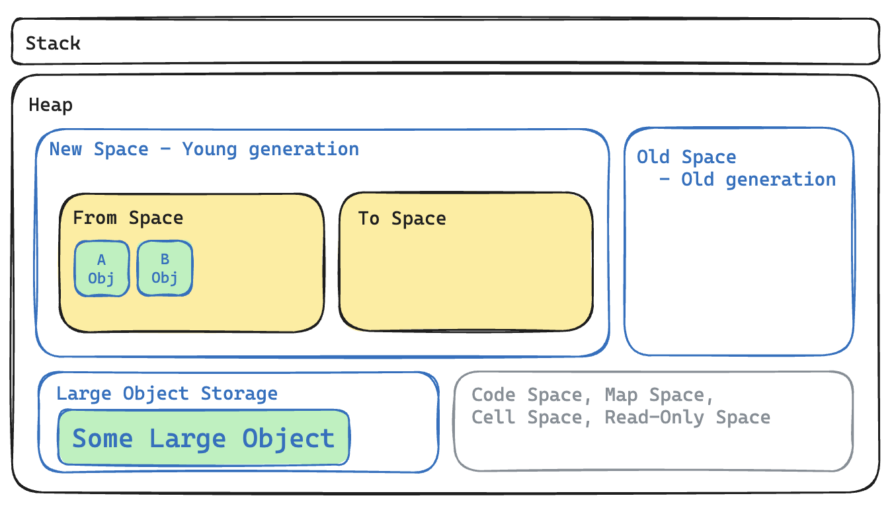

# 당신의 Node.js를 죽이는 n가지 방법 - 메모리 누수


## 개요

모름지기 무언가를 살려야 하는 사람들이 가장 먼저 배워야 할 것은 무엇일까요? 제 생각에, 반대로 그 무언가를 죽이는 방법을 알아야 한다고 생각합니다.  
그리고 이러한 지식을 응용해, 각 상황에 맞는 적절한 방법을 선택할 수 있어야 합니다.  
이 글에서는 Node.js에서 발생하는 메모리 누수를 일으키는 다양한 방법과 메모리 누수를 탐지하는 방법에 대해 알아보겠습니다.

## 메모리 누수란?

현대의 컴퓨터라는 개념을 다루는데 있어서 메모리는 정말 중요한 자원입니다. 그리고 꽤나 비싸죠. 그리고 언제나 유한하죠. 네, 항상 모자랍니다.

그런데 이런 메모리가, 서버가 운영되는 동안 점차 줄어든다면 어떨까요? 사용 할 수 있는 메모리가 점점 줄어들다가 마침내 서버가 죽어버린다면 어떨까요?

이것이 바로 메모리 누수입니다. 메모리 누수는 프로그램이 종료될 때까지 해제되지 않는 메모리를 말합니다. 메모리 누수는 프로그램의 성능을 저하시키고, 프로그램이 죽는 원인이 될 수 있습니다.

## 정상적인 메모리 해제

정상적인 메모리 해제는 더 이상 필요하지 않은 메모리를 해제하는 것을 말합니다. 즉, 더이상 사용되지 않는 메모리를 다시 사용할 수 있는 상태로 만드는 것입니다.

`C`나 `C++`과 같은 언어에서는 개발자가 직접 메모리를 할당/해제해야 하기에 그만큼 자유도가 높지만 책임도 큽니다. 그러나 자바스크립트와 같은 고수준 언어에서는 가비지 컬렉터가 메모리를 자동으로 해제해주기 때문에 개발자가 직접 메모리를 해제할 필요가 없습니다.

더군다나 뒤에서 다룰 현대의 가비지 컬렉터는 매우 똑똑해져서 개발자가 신경쓰지 않아도 대부분의 메모리를 해제해줍니다.
덕분에 자바스크립트를 사용하는 개발자들은 일반적인 상황에서 메모리 관리에 대해 크게 걱정할 필요가 없습니다.

하지만 경우에 따라서는 개발자가 직접 메모리를 해제해야 하는 경우가 있습니다. 이러한 경우에 대해서는 아래에서 자세히 다루겠습니다.

### 가비지 컬렉터(Feat. V8 엔진)

Node.js는 V8 엔진의 가비지 컬렉터(이하 GC)를 사용합니다.
이 GC는 크게 아래의 두 가지 방식으로 동작합니다.

#### 1. Minor GC: Scavenge

Minor GC는 `New Space`에 할당된 `young generation` 객체의 메모리를 관리하는 방식입니다.
대부분의 객체는 초기 생성시 `young generation에` 할당되고 `From Space`에서 `To Space`로 이동하며, 이 과정에서 Scavenge가 발생합니다.
이 과정에서 참조되지 않는 객체는 메모리에서 해제되고, 여러 번 생존한 객체는 `old generation`으로 이동합니다.

Minor GC는 아래의 과정이 계속해서 반복적으로 동작합니다.



- 0단계
  - 새로운 객체(A, B)가 `New Space`에 할당됩니다.
  - `New Space`에 할당된 객체는 `From Space`에 할당됩니다.
  - 크기가 큰 객체라면 `Large Object Space`에 할당됩니다.
    - 일반적으로 `New Space`의 크기는 약 1~8MB이며, 이보다 큰 객체는 `Large Object Space`에 할당됩니다.

---


- 1단계
  - `from space`에 있는 객체들을 순회하며 참조가 있는 객체(A)를 찾습니다.
  - 참조가 있는 객체(A)를 `from space`에서 `to space`로 이동시킵니다.
  - `to space`로 이동한 객체는 생존한 객체(A)로 간주되어 `mark`됩니다.
  - `to space`로 새로운 객체(C, D)가 생성됩니다.
  - `from space`는 비워집니다.(B)
  - `from space`와 `to space`의 역할을 교체합니다.

---


- 2단계
  - `from space`에 있는 객체들을 순회하며 참조가 있는 객체(A, C)를 찾습니다.
  - `mark`된 객체(A)가 있다면 이는 생존한 객체로 간주되어 `old generation`으로 이동시킵니다.
  - 그 외 참조가 있는 객체(C)는 `to space`로 이동시킵니다.
  - `to space`로 새로운 객체(E)가 생성됩니다.
  - `from space`는 비워집니다.
  - `from space`와 `to space`의 역할을 교체합니다.

이 과정을 반복하다가 특정 시점에 old generation으로 이동시키는데, 이를 `Major GC`라고 합니다.

- 참고) V8의 힙 메모리 구조

  - 도면상 크기는 실제크기와 전혀 무관합니다


- `New Space`: 크기가 작은, 대부분의 객체가 처음에 할당되는 공간. 기본적으로 1MB로 시작하여, 8MB까지 동적으로 확장될 수 있고, 개별적인 설정으로 크기를 조정할 수 있습니다.
  - `To Space`, `From Space`: `New Space`를 두 개의 공간으로 나눈 것. `From Space`에는 객체가 할당되고, `To Space`로 객체가 이동합니다.
- `Old Space`: 크기가 큰, `young generation`에서 여러 번 생존한 객체가 할당되는 공간입니다. 장기적으로 사용되는 객체가 할당됩니다.
- `Large Object Space`: 크기가 매우 큰 객체가 할당되는 공간. `Old Space`보다 큰 객체가 할당됩니다. 이 공간은 `Old Space`와는 별도로 관리됩니다.
- `Code Space`: V8 엔진이 생성한 코드가 할당되는 공간. JIT 컴파일러에 의해 생성된 코드가 할당됩니다. 이 공간도 가비지 컬렉션의 대상이 됩니다.

#### 2. Major GC: Mark-Sweep

Major GC는 `Old Space`에 할당된 `old generation` 객체의 메모리를 관리하는 방식입니다.

Major GC는 크게 세 가지 단계로 이루어집니다.

- `Marking`
  - GC가 객체들을 순회하며 사용 여부를 판단합니다.
  - `known roots`를 시작으로 참조가 있는 객체를 찾아 mark합니다.
    - `known roots`: 전역(`global`, `window`), `process` 등
  - 이 과정에서 DFS(깊이 우선 탐색) 알고리즘이 사용됩니다.
  - 또한 `Incremental Marking`과 `Lazy Sweeping`을 사용하여 GC의 성능을 향상시키고 `stop-the-world` 시간을 줄입니다.
    - Incremental Marking: 마킹 작업을 작은 조각으로 분할 수행하여 애플리케이션의 중단 시간을 줄입니다.
    - Lazy Sweeping: 필요할 때에만 스윕 작업을 수행하여 성능을 최적화합니다.

- `Sweeping`
  - 힙의 모든 공간을 순회하며 mark되지 않은 객체를 찾아 메모리를 해제합니다.
  - 이 과정에서 메모리를 해제하고 남은 공간을 다시 사용할 수 있습니다.
- `Compacting`
  - Sweeping 이후, 생존한 객체들을 한 곳으로 모아 메모리의 단편화를 줄입니다.
  - 이 과정은 메모리 단편화를 줄여, 이후 메모리 할당의 성능을 향상시킵니다.
  - 다만, 이 과정은 모든 객체를 이동시키기 때문에 성능에 영향을 줄 수 있습니다.


### 수동 메모리 해제

수동 메모리 해제는 `C`나 `C++`과 같은 언어에서 개발자가 직접 메모리를 관리할 때 주로 사용합니다. 그러나 특정 상황에서는 자바스크립트를 사용 할 때에도 종종 수동 메모리 해제가 필요할 수 있습니다.  
대체로 필요에 따라 큰 객체를 사용한 후, 혹은 아래의 특정 상황에서 메모리를 해제해야 할 수 있습니다.

## 메모리 누수를 일으키는 대표적인 방법

### 1. 전역변수 사용

전역변수는 그 자체로 루트 레퍼런스가 되기 때문에 프로그램이 종료될 때까지 GC되지 않고, 메모리를 차지합니다. 따라서 전역변수를 사용할 때는 필요가 끝난 후에 null로 초기화하여 메모리를 해제하는 것이 중요합니다.

```js
// 전역 변수에 의한 메모리 누수
let leakyArray = [];

app.get('/leak/global-variable', (req, res) => {
  function createMemoryLeak() {
    const largeData = new Array(1000000).fill('leak');
    leakyArray.push(largeData);
    console.log(`Memory used: ${Math.round(process.memoryUsage().heapUsed / 1024 / 1024)} MB`);
  }

  createMemoryLeak();
  res.send('Global variable memory leak created!');
});

// 전역 변수를 사용하지 않는 경우
app.get('/no-leak/global-variable', (req, res) => {
  function createMemoryLeak() {
    const largeData = new Array(1000000).fill('leak');
    console.log(`Memory used: ${Math.round(process.memoryUsage().heapUsed / 1024 / 1024)} MB`);
  }

  createMemoryLeak();
  res.send('No global variable memory leak created!');
});
```

### 2. 클로저 사용

클로저는 외부 함수의 스코프에 접근 할 수 있는 내부 함수 혹은 이런 현상을 총칭하는데요,
이는 외부 함수의 변수를 참조하고 있기 때문에 외부 함수의 변수가 메모리에서 해제되지 않습니다 -참조가 있는(접근 가능한) 변수는 GC되지 않음-
따라서 클로저를 사용할 때는 외부 함수의 변수를 참조하는 것이 꼭 필요한지 한 번 더 생각해보아야 합니다.

```js
// 클로저에 의한 메모리 누수
let leakyFunctions = [];

app.get('/leak/closure', (req, res) => {
  function createMemoryLeak() {
    const largeData = new Array(1000000).fill('leak');
    return function leakyFunction() {
      // largeData에 대한 참조를 유지합니다.
      console.log(largeData.length);
    };
  }

  const leakyFunction = createMemoryLeak();
  leakyFunctions.push(leakyFunction); // 클로저를 배열에 저장하여 참조를 유지합니다.
  res.send('Closure memory leak created!');
});
```

### 3. 해제되지 않는 이벤트 리스너

이벤트 리스너를 등록하면 이벤트가 발생할 때까지 메모리를 차지합니다. 만약 이벤트 리스너를 해제하지 않으면, 이또한 GC되지 않고 메모리를 차지하게 됩니다.

```js
// 이벤트 리스너에 의한 메모리 누수
const EventEmitter = require('events');
const emitter = new EventEmitter();

app.get('/leak/event-emitter', (req, res) => {
  function createMemoryLeak() {
    const largeData = new Array(1000000).fill('leak');
    emitter.on('event', () => {
      console.log(largeData.length);
    });
  }

  createMemoryLeak();
  emitter.emit('event'); // 이벤트 트리거
  res.send('Event emitter memory leak created!');
});
```

### 4. 해제되지 않는 타이머

타이머도 이벤트 리스너와 마찬가지로 타이머가 종료될 때까지 메모리를 차지합니다.

```js
// 타이머에 의한 메모리 누수
app.get('/leak/timer', (req, res) => {
  function createMemoryLeak() {
    const largeData = new Array(1000000).fill('leak');
    setInterval(() => {
      console.log(largeData.length);
    }, 1000);
  }

  createMemoryLeak();
  res.send('Timer memory leak created!');
});
```

### 5. 해제되지 않는 파일 디스크립터

파일 디스크립터또한 마찬가지입니다.
물론 Node.js의 fs는 autoClose가 기본적으로 true이기에, 의도적으로 파일 디스크립터를 열어두지 않는 한 이러한 문제는 잘 발생하지 않지만, 메모리 누수보다 EMFILE 에러가 더 큰 문제가 될 수 있습니다.

```js
// 해제되지 않는 파일 디스크립터에 의한 메모리 누수
app.get('/leak/file-descriptor', (req, res) => {
  function createMemoryLeak() {
    fs.open('example.txt', 'r', (err, fd) => {
      if (err) throw err;
      // 파일 디스크립터를 열지만 닫지 않습니다.
      console.log(`File descriptor: ${fd}`);
    });
    console.log(`Memory used: ${Math.round(process.memoryUsage().heapUsed / 1024 / 1024)} MB`);
  }

  createMemoryLeak();
  res.send('File descriptor memory leak created!');
});
```

## 메모리 누수를 탐지하는 방법

### 1. node --trace_gc index.js

```bash
[20831:0x130008000]     4702 ms: Scavenge 406.6 (439.9) -> 406.6 (439.9) MB, pooled: 0 MB, 2.50 / 0.00 ms  (average mu = 0.985, current mu = 0.705) allocation failure; 
10MB Object - Memory used: 426 MB
[20831:0x130008000]     4708 ms: Scavenge 425.7 (458.9) -> 425.6 (458.9) MB, pooled: 0 MB, 2.29 / 0.00 ms  (average mu = 0.985, current mu = 0.705) allocation failure; 
10MB Object - Memory used: 445 MB
[20831:0x130008000]     4714 ms: Scavenge 444.7 (478.0) -> 444.7 (478.0) MB, pooled: 0 MB, 2.21 / 0.00 ms  (average mu = 0.985, current mu = 0.705) allocation failure; 
10MB Object - Memory used: 464 MB
[20831:0x130008000]     4721 ms: Scavenge 463.8 (497.1) -> 463.8 (497.1) MB, pooled: 0 MB, 2.25 / 0.00 ms  (average mu = 0.985, current mu = 0.705) allocation failure; 
10MB Object - Memory used: 483 MB
[20831:0x130008000]     4727 ms: Scavenge 482.8 (516.2) -> 482.8 (516.2) MB, pooled: 0 MB, 2.38 / 0.00 ms  (average mu = 0.985, current mu = 0.705) allocation failure; 
10MB Object - Memory used: 502 MB
[20831:0x130008000]     4734 ms: Scavenge 501.9 (535.2) -> 501.9 (535.2) MB, pooled: 0 MB, 2.46 / 0.00 ms  (average mu = 0.985, current mu = 0.705) allocation failure; 
10MB Object - Memory used: 521 MB
[20831:0x130008000]     4754 ms: Scavenge (interleaved) 521.0 (554.3) -> 521.0 (554.3) MB, pooled: 0 MB, 2.33 / 0.00 ms  (average mu = 0.985, current mu = 0.705) allocation failure; 
[20831:0x130008000]     4843 ms: Mark-Compact 540.1 (573.4) -> 158.5 (191.8) MB, pooled: 0 MB, 71.08 / 0.00 ms  (+ 0.1 ms in 0 steps since start of marking, biggest step 0.0 ms, walltime since start of marking 109 ms) (average mu = 0.958, current mu = 0.704) finalize incremental marking via stack guard; GC in old space requested
```

  - 위 예시를 통해 Scavenge와 Mark-Compact 과정을 각각 확인할 수 있습니다.

이 명령어를 사용하면 가비지 컬렉션이 수행될 때마다 상세한 로그를 출력하여 메모리 누수를 탐지할 수 있습니다.

### 2. node --inspect index.js


이 명령어를 통해 Chrome DevTools와 같은 디버깅 도구를 사용하여 메모리 누수를 실시간으로 분석할 수 있습니다.


### 3. 자바스크립트 디버그 터미널


vscode를 사용하신다면 간편한 내장 디버그 터미널로도 메모리 누수를 탐지할 수 있습니다. 편집기의 좌측 디버그 아이콘을 클릭한 후 `JavaScript Debug Terminal`을 선택하면 손쉽게 Node.js 디버깅을 시작할 수 있습니다. 비록 화면은 좀 작지만 이러한 방법으로도 코드 실행 중 메모리 사용량을 모니터링하고 누수를 탐지할 수 있습니다.

### 4. pm2 monit


PM2의 모니터링 도구를 사용하여 애플리케이션의 메모리 사용량을 실시간으로 확인할 수 있습니다. 약간은 빈약해 보일 수 있지만, PM2를 사용하는 경우에는 이러한 방법으로도 메모리 누수를 탐지할 수 있습니다.
