# JS Performance

## 개요

안녕하세요! 오늘은 JavaScript의 성능을 향상시키는 작은 습관들에 대해 알아보려고 합니다.
흔히 JS라고 하면 이래저래 덧쓰여져 만들어진 근본없는 언어이고, 성능도 좋지 않다고 생각하시는데요, 사실 이는 맞는말입니다.

저도 처음에는 JS라는 언어를 별로 좋아하지 않았지만, 어째 알면 알 수록 '시작부터 뭔가 잘못된 것 같지만 어찌저찌 하나씩 기워 가며 그래도 열심히 살아가는' 우리네 인생과 비슷하다는 생각이 들더라구요.

아무튼, 이 느리고 불편하다고들 말씀하시는 JS를 어떻게 하면 조금이라도 더 빠르고 효율적으로 사용할 수 있을지에 대해 이론적으로 알아보고, 직접 코드를 실행해서 벤치마크를 해보려고 합니다.

> 흥미로운 유튜브 영상과 아티클을 발견해서, 궁금증 해소를 위해 이를 직접 테스트해 본 결과도 공유하려고 합니다.  
> 영상과 아티클의 링크는 하단에 첨부하였습니다.

## 주요 주제

0. 접두사 확인하기
1. 문자열 비교
2. Object의 형태
3. Array 메소드 vs for loop
4. Object 속성에 대한 접근
5. 캐시 미스
  5-1. 메모리 풀링
6. 큰 Object
  6-1. 큰 Object with GC
7. 문자열 변조
  7-1. 문자열 변조 with GC
8. 각 루프별 성능 비교

## 본격적으로 확인 해 보자

### 들어가기 전에

- 모든 테스트는 `Macbook 14 M1 pro`에서 진행되었으며, 사용한 노드의 버전은 `v22.2.0`입니다.
- 개별 함수의 성능을 비교/평가하기 위해, 각각의 테스트들은 모두 독립된 프로세스로서 실행하였습니다.
  - 다만, JIT/캐싱 등의 효과를 (덤으로)관측하기 위해 동일한 테스트는 동일한 프로세스에서 반복 실행하였습니다.
  - 필요하다고 판단되는 경우에 대해서는 GC를 수동으로 실행하여 추이를 관측하였습니다.
- 최대한 통제된 환경에서 테스트를 진행하고자 노력하였지만, 완벽한 환경은 아니었다는 점에서 결과는 참고용으로만 알아두시면 좋을 것 같습니다.
  - 이외에 문제가 될 부분이나, 개선할 점이 있다면 언제든지 피드백 주시면 감사하겠습니다.

### 0. 접두사 확인하기

이 테스트는 사실 처음부터 계획되었던 것은 아니고,
최근에 [시니어 엔지니어가 만들면 빠른 이유 #1 - 김형섭 님 블로그](https://velog.io/@480/%EC%8B%9C%EB%8B%88%EC%96%B4-%EC%97%94%EC%A7%80%EB%8B%88%EC%96%B4%EA%B0%80-%EB%A7%8C%EB%93%A4%EB%A9%B4-%EB%B9%A0%EB%A5%B8-%EC%9D%B4%EC%9C%A0-1) 라는 글을 읽고 궁금증이 생겨 급하게 추가하게 되었습니다.

먼저 후보로 선정된 함수와 선정 이유는 아래와 같습니다.

| 구분 | 함수명       | 이유                                             |
| ---- | ------------ | ------------------------------------------------ |
| 1    | 정규식       | 문자열을 처리하는 가장 확장성 있는 방법          |
| 2    | `substring`  | 문자열을 다루는 가장 기본적이고 직관적인 방법    |
| 3    | `startsWith` | 언어 수준에서 제공하는 가장 최적화된 뾰족한 방법 |
|      |              |                                                  |

#### 사용한 코드

```js
const arr = Array.from({ length: 1_000_000 }, () => uuidv4());
// ...
let cnt = 0;
for (let i = 0; i < arr.length; i++) {
  if (arr[i].startsWith('ab')) {
  // if (arr[i].substring(0, 2) == 'ab') {
  // if (arr[i].match(/^ab/)) {
    cnt++;
  }
}
// ...
```

  - UUID를 백만 개 생성한 뒤 각각의 문자열을 순회하면서 접두사가 `ab`인지 확인하는 코드입니다.
  - 물론 매 실행마다 UUID가 다르게 생성되므로 약간의 오차는 있을 수 있지만, 큰 의미는 없을 것으로 판단했습니다.

#### 테스트 결과

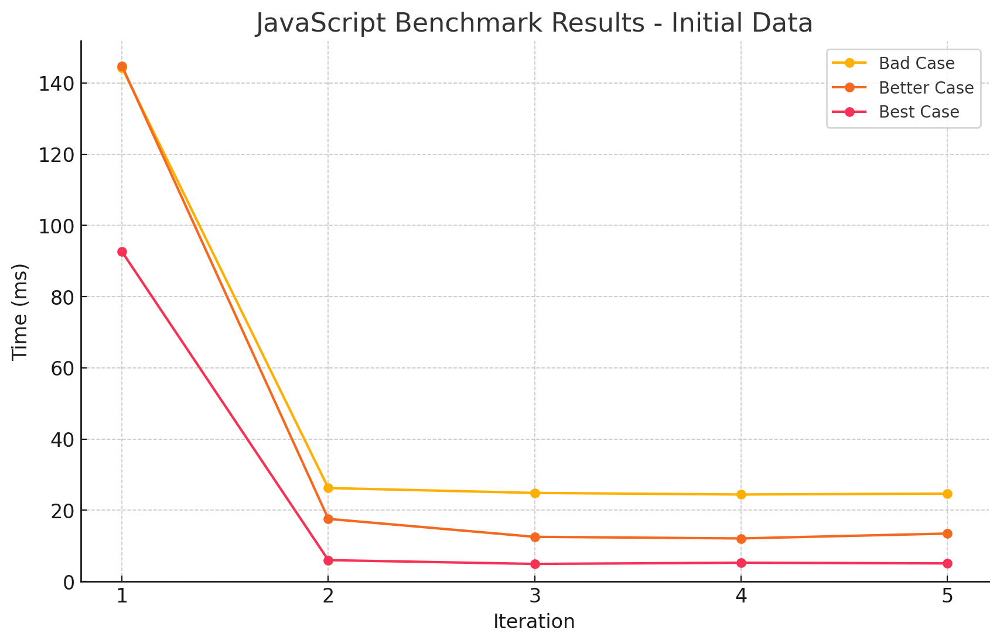

| Idx | Case Type  | Average Time (ms) |
| --- | ---------- | ----------------- |
| 1   | startsWith | 22.788            |
| 2   | substring  | 40.094            |
| 3   | 정규식       | 48.907            |

- 역시나 언어 수준에서 최적화된 `startsWith`가 가장 빠르게 동작하는 것을 확인할 수 있었습니다.
- 그러나 다른 두 함수의 성능도 나쁘지 않다고 생각되며, 지나치게 큰 문자열을 다루는 경우가 아니라면 각자의 편의나 추후 확장성을 고려하여 사용하면 될 것 같습니다.

---

### 1. 숫자 비교 vs 문자열 비교

이 케이스는 직관적으로 꽤나 성능차이가 날것이라고 생각했습니다. 그리고 아티클에서도 그렇게 이야기하고 있구요.
좀 더 자세히 이야기하자면, `숫자는 스택`에 저장되어 직접 값이 전달되지만, `문자열은 대체로 힙`에 저장되며 참조값만 스택에 저장되기 때문에 메모리 접근 과정이 더 필요합니다. 또한, 두 값을 비교하는 과정에서도 문자열은 각 문자를 비교해야 하기 때문에 더 많은 연산이 필요합니다.

#### 사용한 코드

```js
// good.js
const Position = {
  TOP: 0,
  BOTTOM: 1,
}
let cnt = 0
for (let i = 0; i < 10_000_000; i++) {
  let current = i % 2 === 0 ?
  Position.TOP : Position.BOTTOM
  if (current === Position.TOP)
    cnt += 1
}
// ...
```

```js
// bad.js
const Position = {
  TOP: 'TOP',
  BOTTOM: 'BOTTOM',
}
let cnt = 0
for (let i = 0; i < 10_000_000; i++) {
  let current = i % 2 === 0 ?
    Position.TOP : Position.BOTTOM
  if (current === Position.TOP)
    cnt += 1
}
// ...
```

#### 테스트 결과

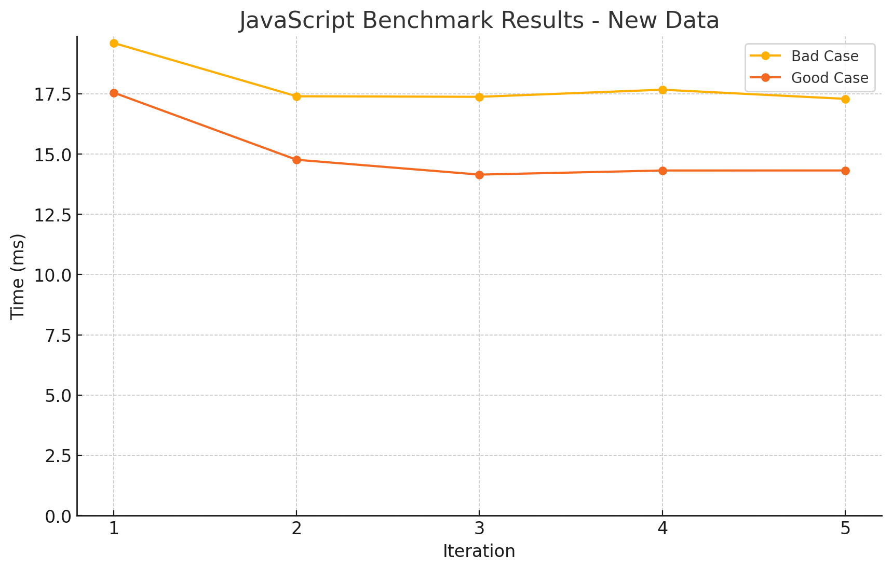

| Idx | Case Type   | Average Time (ms) |
| --- | ----------- | ----------------- |
| 1   | Number   | 15.02             |
| 2   | String    | 17.869            |

- 생각만큼 큰 차이는 없었지만, 숫자 비교가 더 빠르게 동작하는 것을 확인할 수 있었습니다.
- 문자열의 길이가 짧아 큰 차이가 나지 않았던 것 같습니다만, 추가적인 확인이 필요할 것 같습니다.

---

### 2. 객체의 형태에 따른 성능 차이

개인적으로는 이 케이스가 가장 흥미로웠습니다. 객체의 속성 순서가 성능에 영향을 줄 거라고는 생각조차 못했는데 말이죠.

#### 사용한 코드

```js
// best.js
const o1 = { a: 1, b: _, c: _, d: _, e: _ }
const o2 = { a: 1, b: _, c: _, d: _, e: _ }
const o3 = { a: 1, b: _, c: _, d: _, e: _ }
const o4 = { a: 1, b: _, c: _, d: _, e: _ }
const o5 = { a: 1, b: _, c: _, d: _, e: _ }

function add(a1, b1) {
  return a1.a + a1.b + a1.c + a1.d + a1.e +
    b1.a + b1.b + b1.c + b1.d + b1.e
}

let result = 0
for (let i = 0; i < 10_000_000; i++) {
  result += add(o1, o2)
  result += add(o3, o4)
  result += add(o4, o5)
}
// ...
```

- 모든 객체의 속성 순서가 동일합니다.

```js
// better.js
const o1 = { a: 1, b: _, c: _, d: _, e: _ }
const o2 = { a: 1, b: _, c: _, d: _, e: _ }
const o3 = { a: 1, b: _, c: _, d: _, e: _ }
const o4 = { a: 1, b: _, c: _, d: _, e: _ }
const o5 = { b: _, a: 1, c: _, d: _, e: _ }
// ...
```

- 하나의 객체의 속성 순서가 다릅니다. 객체 외 코드는 동일합니다.

```js
// bad.js
const o1 = { a: 1, b: _, c: _, d: _, e: _ }
const o2 = { b: _, a: 1, c: _, d: _, e: _ }
const o3 = { b: _, c: _, a: 1, d: _, e: _ }
const o4 = { b: _, c: _, d: _, a: 1, e: _ }
const o5 = { b: _, c: _, d: _, e: _, a: 1 }
// ...
```

  - 모든 객체의 속성 순서가 뒤죽박죽입니다.

#### 테스트 결과

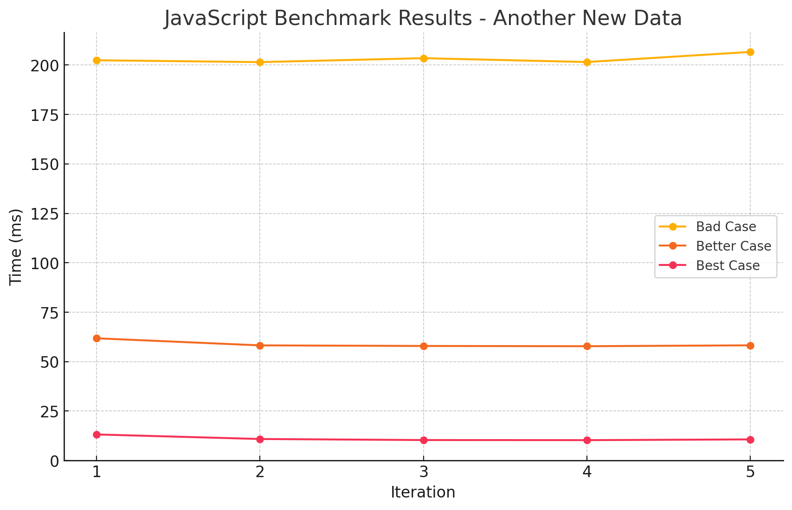

| Idx | Case Type   | Average Time (ms) |
| --- | ----------- | ----------------- |
| 1   | 완전히 동일한 순서   | 11.078            |
| 2   | 순서가 하나씩 다른 경우 | 58.806            |
| 3   | 모든 순서가 다른 경우    | 203.105           |

- 정말 생각치도 못한 결과였습니다. 객체의 속성 순서가 다르면 성능에 영향을 미친다는 것은 처음 알았습니다. 당연히 내부적으로 최적화가 되어있을 줄 알았는데, 그렇지 않은가 보네요.
- 심지어 그 차이가 꽤 크다는 것도 놀랍습니다. 보기좋은 코드가 성능상으로도 좋다는 게 이런 뜻일까요

---

### 3. 함수형 vs 절차형 프로그래밍

저는 아직 뛰어난 함수형 프로그래머는 아니지만, 이런 체인을 즐겨 사용하는 편입니다.
다만 최근에는 업무중에 성능상의 이유로 절차형 프로그래밍을 하고있는데, 이번에 이를 테스트 해 보겠습니다.

#### 사용한 코드

```js
// bad.js
const numbers = Array.from({ length: 10_000_000 }).map(() => Math.random())

let result = 0
for (let i = 0; i < numbers.length; i++) {
  let n = Math.round(numbers[i] * 10)
  if (n % 2 !== 0) continue
  result = result + n
}
```

```js
// bad.js
const numbers = Array.from({ length: 10_000_000 }).map(() => Math.random())

const result =
numbers
  .map(n => Math.round(n * 10))
  .filter(n => n % 2 === 0)
  .reduce((a, n) => a + n, 0)
```

#### 테스트 결과

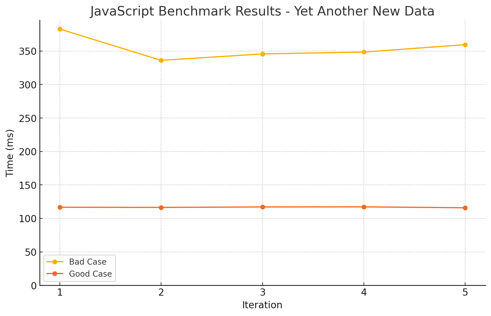

| Idx | Case Type | Average Time (ms) |
| --- | --------- | ----------------- |
| 1   | for loop | 116.654           |
| 2   | array methods  | 354.492           |

- 예상과 같이 절차형 프로그래밍이 함수형 프로그래밍보다 더 빠르게 동작하는 것을 확인할 수 있었습니다.
  - 사실 여기에는 애초에 순회하는 방식이 다르기 때문에 성능 차이가 날 수 밖에 없다는 함정이 있기는 합니다.
- 그러나 소규모 순회 등에서는 함수형 프로그래밍이 더 편리하고 가독성이 좋다는 메리트를 무시 할 순 없다고 생각합니다.

---

### 4. 속성 접근 방법에 따른 성능 차이

js의 최적화를 막아 조금 더 정확한 성능 비교를 위해, get 함수를 사용하여 속성에 접근하도록 하는 것으로 보입니다.
사용한 방식은 각각 아래와 같습니다.

1. Proxy 객체 사용
2. 깊이 중첩된 객체 사용
3. 다른 변수에 할당하여 직접 접근

#### 사용한 코드

```js
// best.js
const aa = { state: { center: { point: { x: 10, y: 20 } } } };
const bb = { state: { center: { point: { x: 10, y: 20 } } } };
const a = aa.state.center.point.x;
const b = bb.state.center.point.x;
const get = (i) => i % 2 ? a : b

let result = 0
for (let i = 0; i < 10_000_000; i++) {
  result = result + get(i);
}
```

```js
// better.js
const a = { state: { center: { point: { x: 10, y: 20 } } } }
const b = { state: { center: { point: { x: 10, y: 20 } } } }
const get = (i) => i % 2 ? a : b

let result = 0
for (let i = 0; i < 10_000_000; i++) {
  result = result + get(i).state.center.point.x
}
```

```js
// bad.js
const a = new Proxy({ state: { center: { point: { x: 10, y: 20 } } } }, { get: (t, k) => t[k] });
const b = new Proxy({ state: { center: { point: { x: 10, y: 20 } } } }, { get: (t, k) => t[k] });
const get = (i) => i % 2 ? a : b

let result = 0
for (let i = 0; i < 10_000_000; i++) {
  result = result + get(i).state.center.point.x
}
```

#### 테스트 결과

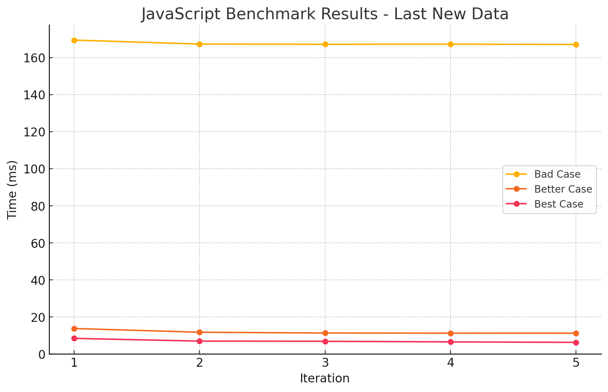

| Idx | Case Type   | Average Time (ms) |
| --- | ----------- | ----------------- |
| 1   | 직접 접근   | 6.997             |
| 2   | 깊이가 깊은 접근 | 11.845            |
| 3   | 프록시 객체    | 167.671           |

---

### 5. 캐시 미스

이 케이스도 꽤나 재미있는 주제입니다. 다른 케이스보다 CS적으로 조금 더 깊게 들어가는 주제인데요, 각 메모리를 캐싱할 때 사용하는 전략 중 공간적 지역성에 대한 효과를 보여줍니다.

#### 사용한 코드

```js
// good.js
const arr = Array.from({ length: 10_000_000 }).map(() => ({ x: 42, y: 0 }));
const arr2 = Array.from({ length: 10_000_000 }).map((_, i) => i);

let result = 0
for (let i = 0; i < 10_000_000; i++) {
  result += arr[arr2[i]].x;
}
```

  - 실제 접근할 대상인 배열 arr와, 이에 접근할 인덱스를 관리하는 arr2를 사용합니다.

```js
// bad.js
const arr = Array.from({ length: 10_000_000 }).map(() => ({ x: 42, y: 0 }));
const arr2 = Array.from({ length: 10_000_000 }).map((_, i) => i);
arr2.sort(() => Math.random() - 0.5); // shuffle

let result = 0
for (let i = 0; i < 10_000_000; i++) {
  result += arr[arr2[i]].x;
}
```

  - 의도적으로 arr2를 섞어서, 공간 지역성을 떨어뜨리도록 합니다.
  - 당연하게도 시간 측정에 shuffle 부분은 포함되지 않습니다.

#### 테스트 결과

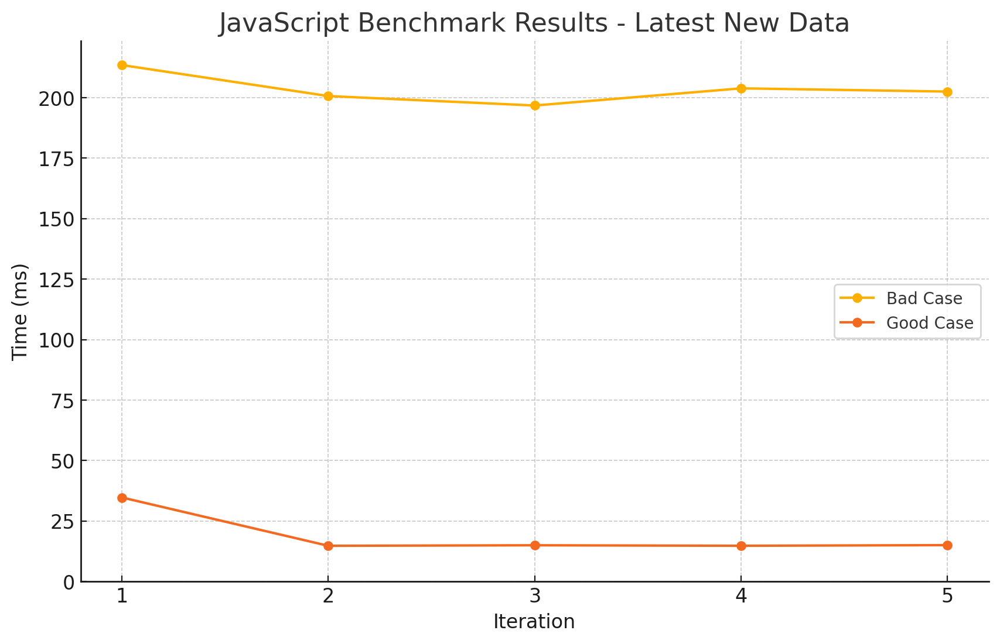

| Idx | Case Type | Average Time (ms) |
| --- | --------- | ----------------- |
| 1   | 캐시 히트 | 18.859            |
| 2   | 캐시 미스  | 203.473           |

- 역시나 예상대로, 캐시 미스가 발생하면 성능이 떨어지는 것을 확인할 수 있었습니다.
- 그런데 생각보다 성능 차이가 심각합니다. 확실히 순차 접근이 매우 효율적이라는 것을 알 수 있었습니다.

> 참고!  제가 테스트한 결과는, 영상(아티클)의 테스트가 올바른 캐시미스를 일으키지 못한다고 생각하여 다른 방법으로 실행한 결과로, 측정값이 다릅니다!

음, 그런데 영상에서는 이 부분의 테스트가 잘못된 것 같습니다. 아마 유튜버분께서 실수로 shuffle 과정을 벤치마크에 포함한 게 아닐까 싶습니다.

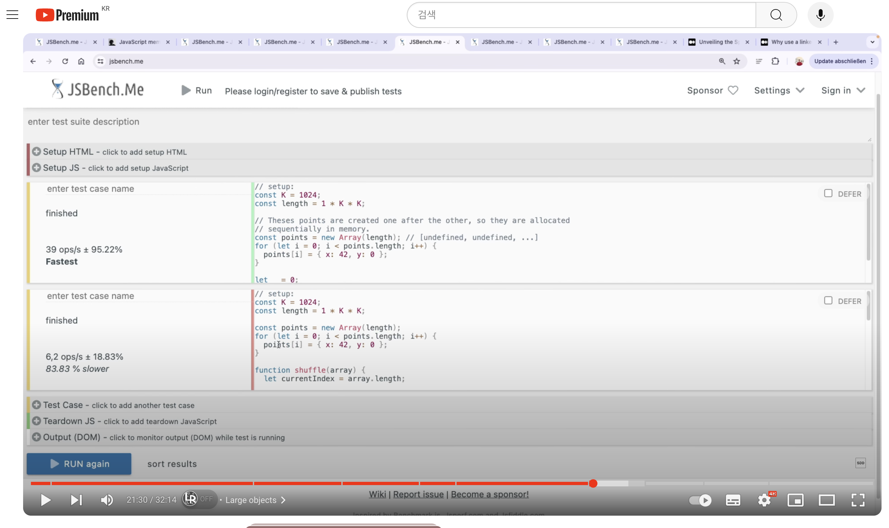

[실제 테스트 결과 - 잘못된 결과]
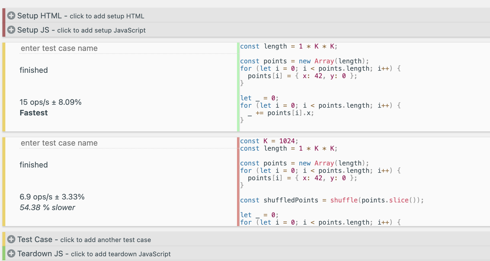

[실제 테스트 결과 - 올바른 결과]
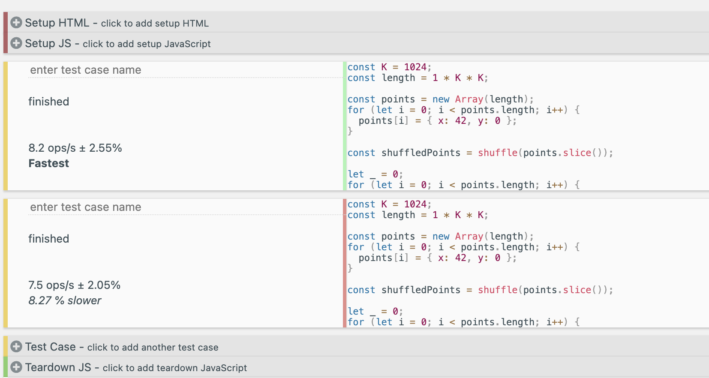

또한, 제시한 테스트 방식을 올바르게 재현한다고 해도, 결과는 크게 다르지 않을 것으로 예상됩니다. 그 이유는, array의 값들을 랜덤하게 섞어본들 결국에는 순차 접근하게되어 인접한 값을 캐싱할 것으로 예상되기 때문입니다.
다만 이 부분은 개인적인 소견이므로, 틀린점이 있다면 꼭! 피드백 주시면 감사하겠습니다.

---

### 5-1. 메모리 풀링

이 케이스는 위의 케이스를 테스트 하던 중, 갑작스럽게 궁금해져서 추가한 테스트입니다.
메모리를 미리 할당 해 두는 것과, 필요할 때마다 할당하는 것의 성능 차이를 확인해보려고 합니다.

#### 사용한 코드

```js
// good.js
let arr = new Array(1_000_000);
for (let i = 0; i < 1_000_000; i++) { // 1_000_000보다 크게 하면, 오히려 Bad case가 더 빠름
  arr[i] = { x: 42, y: 0 };
}
```

```js
// bad.js
let arr = new Array();
for (let i = 0; i < 1_000_000; i++) { // 1_000_000보다 크게 하면, 오히려 Bad case가 더 빠름
  arr[i] = { x: 42, y: 0 };
}
```

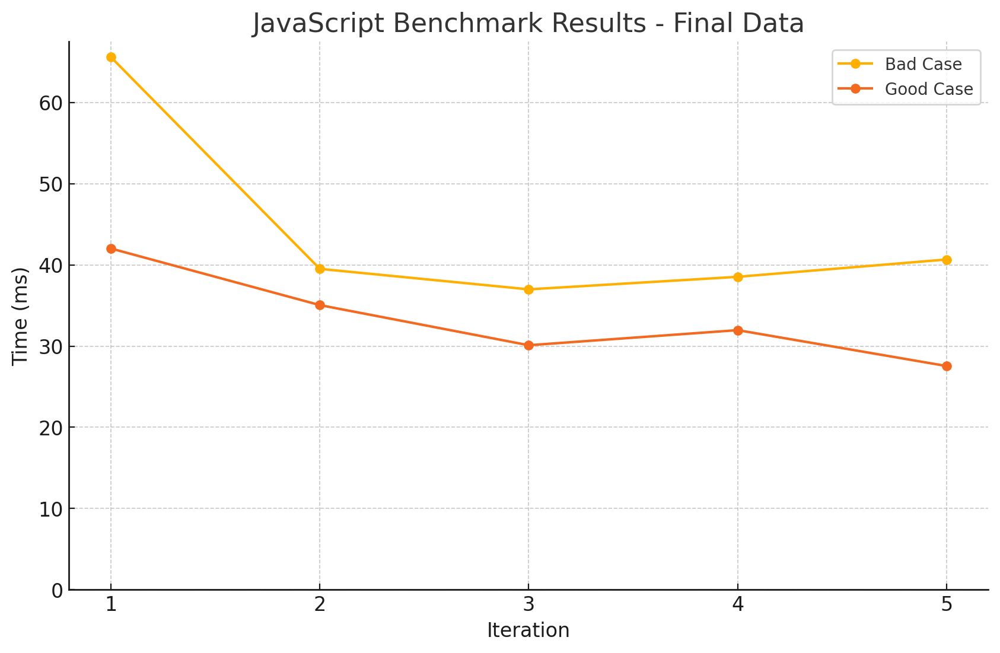

| Idx | Case Type | Average Time (ms) |
| --- | --------- | ----------------- |
| 1   | 메모리 풀링 | 33.341            |
| 2   | 메모리 개별 할당  | 44.267            |

- 확실히 예상대로 메모리를 미리 할당해 두는 것이 더 빠르게 동작하는 것을 확인할 수 있었습니다.
- 다만 신기한 것은, 배열의 크기가 1_000_000보다 크게 되면, 오히려 Bad case가 더 빠르게 동작하는 것을 확인할 수 있었습니다.
  - GPT의 의견에 따르면 이는 `지나치게 큰 메모리를 사전에 할당하면 더 큰 블록의 메모리를 한 번에 할당하거나, 재할당 빈도를 줄이기 위해 다른 메모리 관리 전략을 사용할 수 있습니다. 따라서 특정 임계치를 넘어가면 예상치 못한 성능 최적화가 발생할 수 있습니다.` 라고 하네요.

### 6. 큰 Object를 다룰 때

#### 사용한 코드

```js
// good.js
for (let i = 0; i < 1_000_000; i++) {
  byId[i] = { id: i+1, name: 'name' };
}

let result = 0;
Object.values(byId).forEach((user) => {
  result += user.id;
})
```

- `byId`는 1,000,000개의 객체를 가지고 있는 Object입니다.
- 이 객체에서 순회가 필요한 부분을 미리 Object.values를 통해 배열로 만들어두고 순회합니다.

```js
// better.js
let result = 0;
Object.keys(byId).forEach((id) => {
  result += byId[id].id;
})
```

- 객체의 키를 사용해 직접 순회합니다.

```js
// bad.js
let result = 0;
Object.entries(byId).forEach(([_, user]) => {
  result += user.id;
})
```

- 객체의 키와 값을 사용해 직접 순회합니다.
- 확실히 더 많은 연산이 필요할 것으로 예상됩니다.

#### 테스트 결과

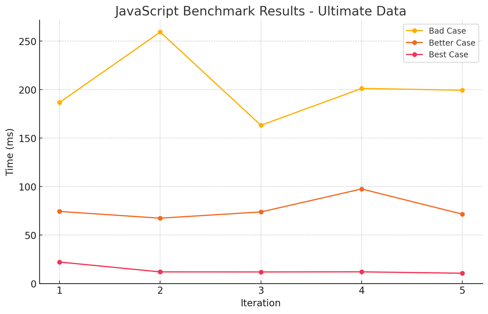

| Idx | Case Type   | Average Time (ms) |
| --- | ----------- | ----------------- |
| 1   | values   | 13.764            |
| 2   | keys | 76.920            |
| 3   | entries    | 201.924           |

- 결과를 보니 뭔가 고르지 않습니다. 특히 `entries`에서 소요시간이 튀는 것을 보니, entries를 만드는 과정에서 메모리도 많이 사용하여 GC가 발생한 것으로 보입니다.

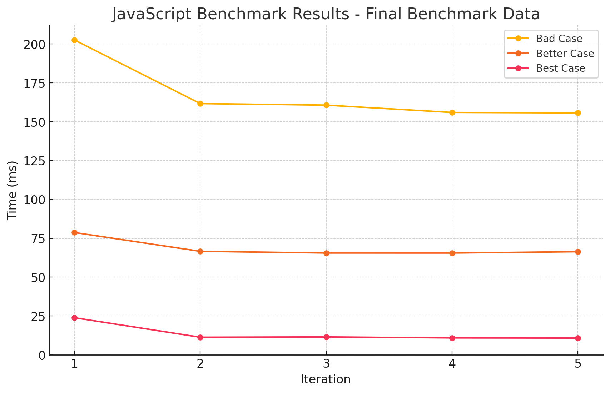

| Idx | Case Type   | Average Time (ms) |
| --- | ----------- | ----------------- |
| 1   | values   | 13.717            |
| 2   | keys | 68.587            |
| 3   | entries    | 167.364           |

- 이번에는 GC를 수동으로 매 번 실행하도록 했습니다.
- 조금 전에 예측했던 대로, 훨씬 안정적인 그래프를 볼 수 있습니다.

### 7. 문자열 변조 vs 문자열 병합

사실 이 테스트들 중에서 가장 실망한 케이스입니다.
당연히 저는 템플릿 리터럴을 사용하는 것이 더 빠를 것이라고 생각했는데, 아티클에서는 역으로 + 연산자를 사용하는 것이 더 빠르다고 하더라구요.
그런데 테스트 결과는 더욱 밍숭맹숭합니다.
결과를 함께 보시죠.

#### 사용한 코드

```js
// good.js
const classNames = new Array(100_000).fill(['primary', 'selected', 'active', 'medium']).flat();

const result = classNames
  .map((c) => 'button--' + c)
  .join(' ');
```

```js
// bad.js
const classNames = new Array(100_000).fill(['primary', 'selected', 'active', 'medium']).flat();

const result = classNames
  .map((c) => `button--${c}`)
  .join(' ');
```

#### 테스트 결과

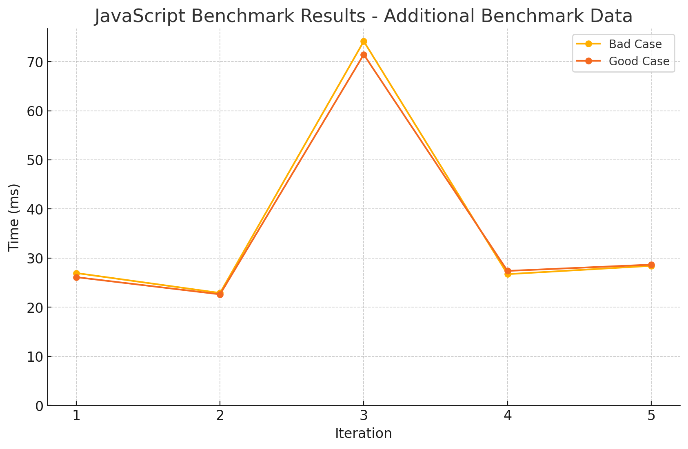

| Idx | Case Type | Average Time (ms) |
| --- | --------- | ----------------- |
| 1   | Good case | 35.246            |
| 2   | Bad case  | 35.828            |

- 일단 그래프 모양부터 마음에 들지 않습니다.
- 둘 다 성능은 거의 동일하다고 봐도 무방하겠고, 다수의 문자열로 인해 GC가 발생한 것으로 보입니다.

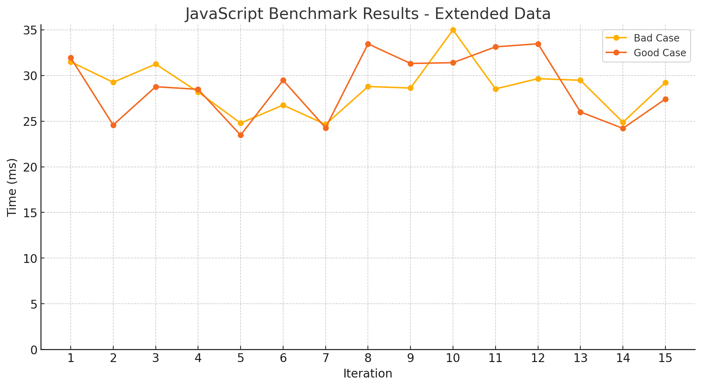

| Idx | Case Type | Average Time (ms) |
| --- | --------- | ----------------- |
| 1   | Bad case  | 28.705            |
| 2   | Good case | 28.763            |

- 이전의 결과로 인해 GC를 수동으로 실행하도록 했습니다.
- 더욱 더 혼란스러운 결과가 나왔습니다.
- 그냥 맘대로 아무거나 쓰십쇼..(농담입니다)

### 8. 루프별 성능 비교

끝내려니 뭔가 아쉬워서, 루프별 성능 비교도 해보았습니다.
가장 빠른 루프가 무엇일지 항상 궁금했는데, 이번 기회에 확인해보겠습니다.

#### 사용한 코드

```js
const arr = Array.from({ length: 10_000_000 }, (_, i) => i);

let result = 0;
let i = 0;
while (i < arr.length) {
  if (arr[i]) {
    result += arr[i];
  }
  i++;
}

let result = 0;
for (let i = 0; i < arr.length; i++) {
  if (arr[i]) {
    result += arr[i];
  }
}

let result = 0;
arr.filter((item) => {
  if (item) {
    result += item;
  }
});
// ... 이하 생략
```

#### 테스트 결과

이번에는 표를 먼저 보겠습니다.

| Idx | Loop Type | Average Time (ms) | Average Memory (MB) |
| --- | --------- | ----------------- | ------------------- |
| 1   | while     | 39.664            | 0.079               |
| 2   | for       | 40.424            | 0.079               |
| 3   | for2      | 40.497            | 0.079               |
| 4   | while2    | 41.098            | 0.08                |
| 5   | forOf     | 90.048            | -0.01               |
| 6   | reduce    | 108.514           | 0.082               |
| 7   | forEach   | 109.122           | 0.082               |
| 8   | filter    | 117.751           | 0.08                |
| 9   | map       | 133.535           | 0.0                 |
| 10  | forIn     | 1044.797          | 40.952              |
|     |           |                   |                     |

- 다른건 차치하고, 확실히 `for in`은 어지간하면 쓰지 말아야겠다는 생각이 듭니다.
- 메모리 측정 결과는 GC로 인해 딱히 써먹을 순 없을 것 같습니다. 다만 여기서도 `for in`을 쓰지 않을 이유는 하나 찾을 수 있네요.
- for2, while2는 아래 예시와 같이 각각 for, while의 길이 변수를 참조 없이 직접 비교하는 방식입니다.

  ```js
  // for
  let result = 0;
  for (let i = 0; i < arr.length; i++) {
    if (arr[i]) {
      result += arr[i];
    }
  }

  // for2
  let result = 0;
  const len = arr.length;   // <--- HERE
  for (let i = 0; i < len; i++) {
    if (arr[i]) {
      result += arr[i];
    }
  }
  ```

- 그래프로 보면 이같은 결과가 더 두드러집니다.

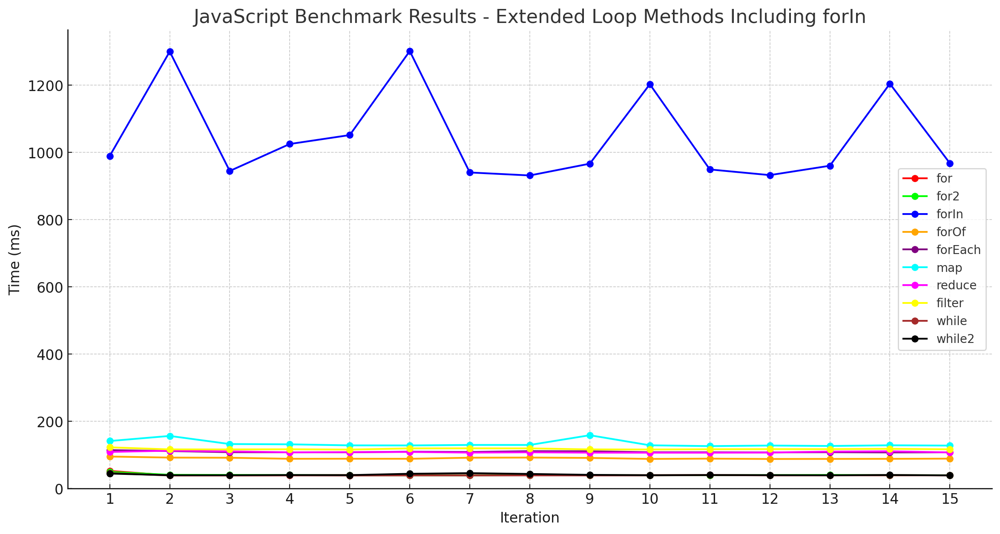

민폐가 될 정도로 두드러지는 `for in`d 루프를 제외하고 결과를 다시 보겠습니다.

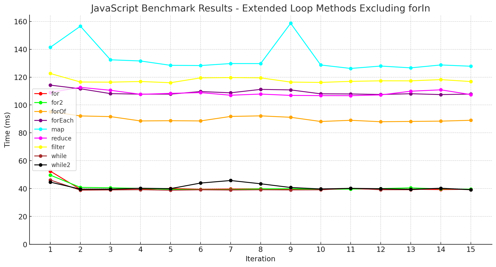

- 비슷한 수준별로 특정한 그룹이 형성되는 것을 확인할 수 있습니다.
- 가장 빠른 1순위 그룹은 `while`, `for`, `for2`, `while2`입니다.
- 그 다음은 for문이지만 사용성을 좀 더 좋게 만들어준 `for of`입니다. 사용성을 위해 약간의 성능에 손실은 있었지만, 다른 배열 메서드보다는 내부적인 최적화가 더 잘 되어있는 것으로 보입니다.
- 마지막으로 함수형 배열 메서드인 `reduce`, `forEach`, `filter`, `map`이 나타납니다.

여태까지는 제가 직접 측정한 결과였고, 좀 더 공신력을 얻기위해 benchmark.js라는 라이브러리를 사용하여 다시 측정해보았습니다.

- `Benchmark.js`

  | Idx | Loop Type    | Time (ms) | Memory (MB) | Performance (ops/sec) ±% | Runs Sampled |
  | --- | ------------ | --------- | ----------- | ------------------------ | ------------ |
  | 1   | While loop   | 19.226    | 0.000       | 2.26 ±4.10%              | 10           |
  | 2   | For loop     | 26.809    | 0.000       | 2.30 ±1.26%              | 10           |
  | 3   | Reduce loop  | 83.867    | 0.000       | 1.97 ±1.59%              | 9            |
  | 4   | For of loop  | 85.277    | 0.000       | 2.00 ±1.86%              | 9            |
  | 5   | ForEach loop | 93.922    | 0.000       | 1.90 ±2.44%              | 9            |
  | 6   | Filter loop  | 148.784   | 0.000       | 1.76 ±2.38%              | 9            |
  | 7   | Map loop     | 200.299   | 0.000       | 1.58 ±2.50%              | 8            |
  | 8   | For in loop  | 1344.171  | 0.000       | 0.62 ±3.18%              | 6            |
  |     |              |           |             |                          |              |

  - 여기서는 `reduce`가 `for of`보다 약간 더 빠르게 동작한다고 하네요.
    - 사실 내부적으로 동일한 로직을 사용할 수도 있겠다는 생각이 듭니다.

자, 여기까지 긴 글 읽어주시느라 고생하셨습니다.
이번에는 다양한 케이스를 테스트해보았는데, 명확한 결과도 있었고 조금은 흐리멍텅한 결과도 있었습니다.
그래도 이런 테스트를 통해 어떤 것이 더 빠르게 동작하는지, 어떤 것이 더 효율적인지 조금이나마 생각 해 볼 기회가 되었으면 좋겠습니다.

다시 한 번, 부족한 점이나 틀린 점이 있다면 피드백 주시면 감사드리겠습니다!

## 참고

- https://www.youtube.com/watch?v=koky8mDdtAk
- https://romgrk.com/posts/optimizing-javascript#6-avoid-large-objects
