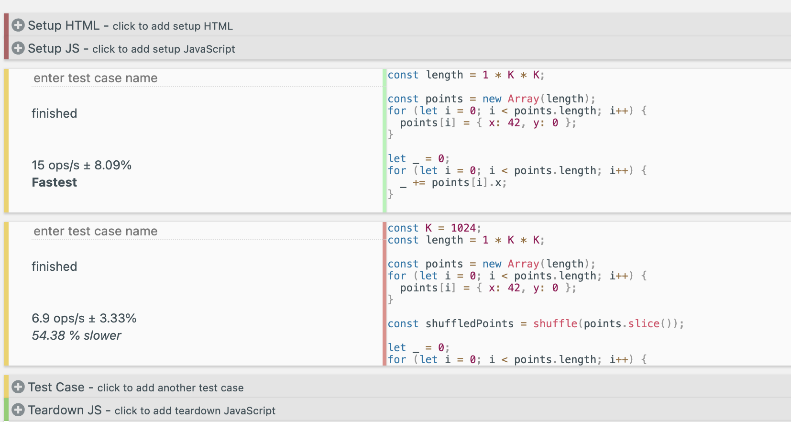
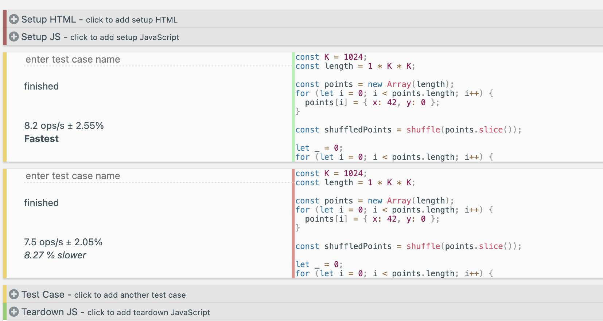

# cache miss 테스트 문제점


array의 요소들의 순서가 바뀌었다고 이렇게 차이가 날 리 없다.
유튜버의 실험 결과는 아마 shuffle까지 벤치마크에 포함되어서 그런 것 같다.

## 재현한 테스트 결과

### 잘못된 테스트 결과



- **good.js**

    ```js
    const K = 1024;
    const length = 1 * K * K;

    const points = new Array(length);
    for (let i = 0; i < points.length; i++) {
    points[i] = { x: 42, y: 0 };
    }

    let _ = 0;
    for (let i = 0; i < points.length; i++) {
    _ += points[i].x;
    }
    ```

- **bad.js**

    ```js
    const K = 1024;
    const length = 1 * K * K;

    const points = new Array(length);
    for (let i = 0; i < points.length; i++) {
    points[i] = { x: 42, y: 0 };
    }

    const shuffledPoints = shuffle(points.slice());

    let _ = 0;
    for (let i = 0; i < points.length; i++) {
    _ += shuffledPoints[i].x;
    }

    function shuffle(arr) {
    let curIdx = arr.length;

    while (curIdx !== 0) {
        let rndIdx = Math.floor(Math.random() * curIdx);
        curIdx--;

        [arr[curIdx], arr[rndIdx]] = [arr[rndIdx], arr[curIdx]];
    }

    return arr;
    }
    ```

### 올바른 테스트 결과



- **good.js**

    - 모든 조건은 동일하게, shuffle까지 실행한다. 다만, 활용하지 않는다.

    ```js
    const K = 1024;
    const length = 1 * K * K;

    const points = new Array(length);
    for (let i = 0; i < points.length; i++) {
    points[i] = { x: 42, y: 0 };
    }

    const shuffledPoints = shuffle(points.slice());

    let _ = 0;
    for (let i = 0; i < points.length; i++) {
    _ += points[i].x;
    }

    function shuffle(arr) {
    let curIdx = arr.length;

    while (curIdx !== 0) {
        let rndIdx = Math.floor(Math.random() * curIdx);
        curIdx--;

        [arr[curIdx], arr[rndIdx]] = [arr[rndIdx], arr[curIdx]];
    }

    return arr;
    }
    ```

- **bad.js**

    - 상단과 동일
