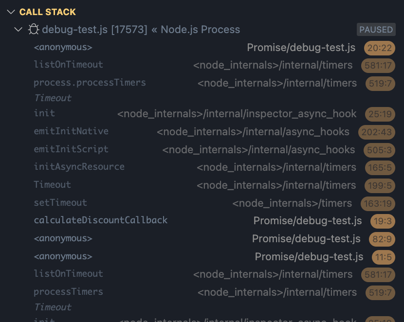
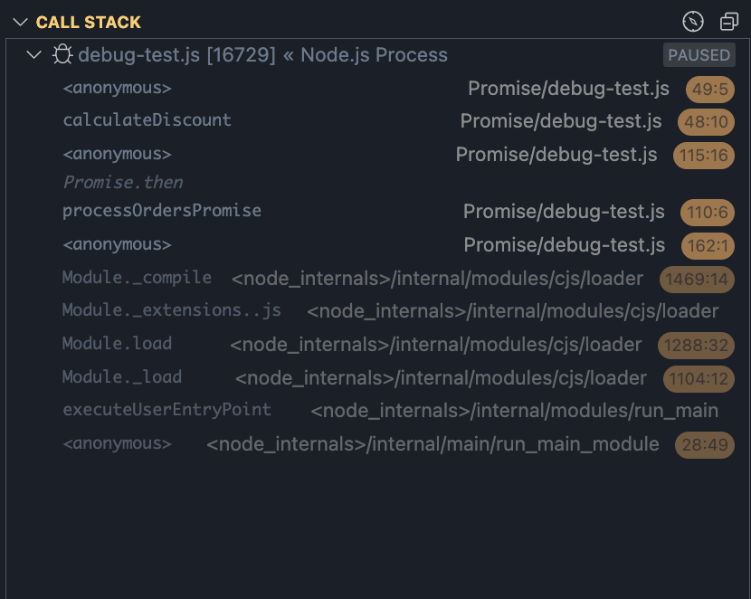
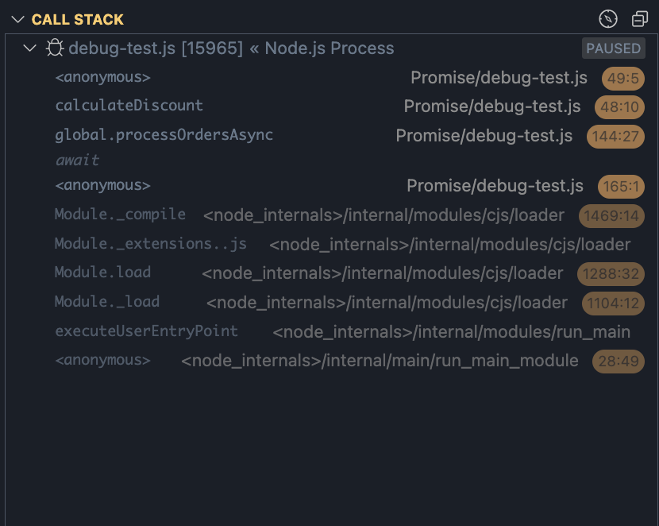

# JS의 비동기 처리: 콜백, promise와 async/await

제가 `JavaScript`로 개발을 시작하면서 가장 흥미(~~괴~~)로웠던 부분 중 하나는 비동기 처리 방식이었습니다.  

JS는 멀티패러다임 언어답게 특유의 이렇게 해도 되고 저렇게 해도 되는 문법들이 많은데, 특히 비동기 처리 방식은 정말 똑같은 처리를 이렇게까지 다르게 표현할 수 있나 싶을 정도로 다양한 방식으로 표현할 수 있었습니다.  
(물론 아래에서 다루듯, 엄밀히 말해서 똑같은 처리는 아니지만요.)

요 근래에 개인적으로는 `async`/`await`를 주로 선호하지만 회사에서는 `Promise`와 `Callback`을 주로 사용하다보니, 이 세 가지 방식에 대해 정리해보고자 합니다.

## 콜백 함수 시대 - 비동기의 시작

`JavaScript`의 비동기 처리는 콜백 함수로부터 시작되었습니다.  
이로인해 `Node.js`의 초기 문서들을 보면 다음과 같은 패턴을 흔히 발견할 수 있었죠.  
지금도 상당수의 레거시 프로젝트에서는 이런 패턴을 사용하고 있습니다.

```js
// 사용자 정보를 조회하고, 해당 사용자의 주문 내역을 가져오는 API
app.get('/api/users/:userId/orders', function (req, res) {
    const userId = req.params.userId;

    // 먼저 사용자 존재 여부 확인
    db.query('SELECT * FROM users WHERE id = ?', [userId], function (err, user) {
        if (err) {
            console.error('사용자 조회 실패:', err);
            return res.status(500).json({ error: '서버 에러' });
        }

        if (!user) {
            return res.status(404).json({ error: '사용자를 찾을 수 없습니다' });
        }

        // 사용자의 주문 내역 조회
        db.query('SELECT * FROM orders WHERE user_id = ?', [userId], function (err, orders) {
            if (err) {
                console.error('주문 내역 조회 실패:', err);
                return res.status(500).json({ error: '서버 에러' });
            }

            // 각 주문의 상세 상품 정보 조회
            let completed = 0;
            const orderDetails = [];

            orders.forEach(function (order) {
                db.query(
                    'SELECT * FROM order_items WHERE order_id = ?',
                    [order.id],
                    function (err, items) {
                        if (err) {
                            console.error('주문 상세 조회 실패:', err);
                            return res.status(500).json({ error: '서버 에러' });
                        }

                        orderDetails.push({
                            ...order,
                            items: items
                        });

                        completed++;
                        // 모든 주문의 상세 정보 조회가 완료되면 응답
                        if (completed === orders.length) {
                            res.json({
                                user: user,
                                orders: orderDetails
                            });
                        }
                    }
                );
            });
        });
    });
});
```

이런 코드를 작성하다 보면 여러가지 감정이 들죠.  
네 뭐, 솔직히 어찌 보면 참 심플하다고 느껴지기도 합니다. 이런 스타일을 더 좋아하시는 분들도 분명 계실테구요.  
이런 코드를 작성할 때 제가 느꼈던 감정은 주로 불편함과 불안함이었습니다. 그 이유는 아래에서 차근차근 다루어 보겠습니다.

### 콜백의 문제점

위 코드를 보면 가장 먼저 눈에 띄는 것이 오른쪽으로 계속 들어가는 들여쓰기입니다.  
게다가 아래에 8줄 연속으로 이어지는 괄호의 향연은 덤입니다.  
~~코파일럿이 없던 시절에 저런곳에서 실수로 괄호를 하나 빼먹으면 찾기가 정말 힘들었죠.~~  

비동기 작업이 순차적으로 추가될 때마다 코드의 깊이가 깊어져서 가독성이 기하급수적으로 떨어지죠.  
중간부분을 수정이라도 하려면 어디부터 어디까지가 하나의 콜백인지 찾는것부터가 일이니까요.  
이런 현상 때문에 흔히들 '콜백 지옥'이라고 부릅니다.

하지만 콜백의 진짜 문제는 코드가 못생겨지고 다루기 힘들어지는것이 다가 아닙니다. 더 심각한 문제들이 있죠.

1. **에러 처리의 분산과 누락가능성**  
   콜백 패턴의 가장 큰 문제는 에러 처리가 반복되고, 이를 통합할 수 없다는 점입니다.  
   동기 코드에서는 `try-catch`로 한 번에 여러 단계의 에러를 처리할 수 있지만, 콜백에서는 각 단계마다 에러 처리를 개별적으로 해야 합니다.  
   이는 단순히 코드의 중복이 아니라, 에러 처리 로직의 일관성을 해치고 누락될 가능성을 높입니다.  
   이로인한 또다른 사소한(?) 문제는, 변수명이 대체로 같아서 일괄 수정도 힘들고 ***불필요한 노력***을 요구한다는 점입니다.

   ```js
   /**
    * 동기 코드의 에러 처리.
    * 여러 단계의 에러를 한 곳에서 일관되게, 통합적으로 처리할 수 있다.
    */
   try {
        const user = findUserById(userId);
        if (!user) {
            return res.status(404).json({ error: '사용자를 찾을 수 없습니다' });
        }
        const orders = findOrdersByUserId(user.id);
        const orderItems = orders.map(order => findOrderItems(order.id));
        res.json({ user, orders: orderItems });
    } catch (err) {
        // 모든 에러가 한 곳에서 처리됨
        console.error('요청 처리 실패:', err);
        res.status(500).json({ error: '서버 에러' });
    }

    /**
    * 콜백의 에러 처리.
    * 각 단계마다 에러 처리를 개별적으로 해야 하므로 코드의 중복(반복)이 발생하고, 개발자의 실수로 누락될 가능성이 높다.
    */
    db.query('SELECT * FROM users WHERE id = ?', [userId], (err, user) => {
        if (err) {
            // #1. 사용자 조회 실패 처리
            console.error('사용자 조회 실패:', err);
            return res.status(500).json({ error: '서버 에러' });
        }

        db.query('SELECT * FROM orders WHERE user_id = ?', [userId], (err, orders) => {
            if (err) {
                // #2. 주문 조회 실패 처리
                console.error('주문 조회 실패:', err);
                return res.status(500).json({ error: '서버 에러' });
            }
            // #3. 필요시 더 많은 에러 처리 코드
        });
    });
   ```

2. **제어 흐름의 불명확성**  
   콜백은 비동기 작업의 결과를 또 다른 함수에 위임하는 방식입니다. 이는 프로그램의 제어 흐름이 직관적이지 않고 예측하기 어렵게 만들죠.  
   특히 조건문이나 반복문과 함께 사용할 때 이 문제가 더욱 심각해집니다.  
   엎친 데 덮친 격으로, 만약 여기에 1항에서 다루었던 여러 종류의 에러 처리 코드까지 섞여있다면 코드의 복잡도는 더더욱 ***불필요하게 증가***할 것입니다.

   ```js
    // 콜백으로 복잡한 조건부 비동기 처리를 구현하려면...
    getData(function(err, a) {
        if (a.needsMoreData) {
            getMoreData(function(err, b) {
                if (err) {
                    // 에러 처리
                    return;
                }
                if (b.needsEvenMoreData) {
                    if (err) {
                        // 또다른 에러 처리
                        return;
                    }
                    getEvenMoreData(function(err, c) {
                        // 실제 처리 로직
                    });
                }
            });
        } else {
            getOtherData(function(err, d) {
                // 다른 처리 로직
            });
        }
    });
   ```

3. **비동기 작업의 조합과 재사용의 어려움**  
   아시다시피, 콜백은 비동기 작업의 결과를 값으로 다룰 수 없습니다. 이로인해 여러 비동기 작업을 조합하거나 재사용하기가 매우 까다롭죠.  
   동기 코드에서는 함수의 반환값을 변수에 저장하고 다른 함수의 입력으로 사용하는것이 당연하지만, 콜백에서는 이런 자연스러운 합성이 불가능합니다.

   ```js
   // 동기 코드에서의 함수 합성
   const result1 = fn1(data);
   const result2 = fn2(result1);
   const result3 = fn3(result2);

   // 콜백에서는 이런 합성이 불가능하고 중첩될 수밖에 없음
   fn1(data, (err, result1) => {
       fn2(result1, (err, result2) => {
           fn3(result2, (err, result3) => {
               // 실제 처리 로직
           });
       });
   });
   ```

이러한 본질적인 한계들로 인해 콜백만으로는 복잡한 비동기 로직을 `안전하고 유지보수 가능한 방식`으로 작성하기가 정말 어려웠습니다.

## Promise의 등장 - 비동기의 혁명

이런 문제를 해결하기 위해 `Promise`가 등장했습니다. `Promise`는 비동기 작업의 결과를 약속하는 객체입니다. "지금은 결과가 없지만, 나중에 반드시 결과를 줄게"라는 약속이죠.

```js
app.get('/api/users/:userId/orders', function (req, res) {
    const userId = req.params.userId;

    db.query('SELECT * FROM users WHERE id = ?', [userId])
        .then(user => {
            if (!user) return res.status(404).json({ error: '사용자를 찾을 수 없습니다' })
            return db.query('SELECT * FROM orders WHERE user_id = ?', [userId]);
        })
        .then(orders => Promise.all(orders.map(order =>
            db.query('SELECT * FROM order_items WHERE order_id = ?', [order.id])
                .then(items => ({ ...order, items }))
        )))
        .then(orderDetails => res.json({ user, orders: orderDetails }))
        .catch(err => {
            console.error('요청 처리 실패:', err);
            res.status(500).json({ error: '서버 에러' });
        });
});
```

코드가 깔끔해졌죠? `Promise`의 가장 큰 장점은 바로 이런 체이닝이 가능하다는 점입니다.
심지어 `Promise.all`을 사용하면서 여러 비동기 작업을 동시에 처리할 수도 있다보니, 성능상으로도 이점이 있습니다.

### Promise의 특별한 점

1. **에러 처리의 통합**  
   모든 에러는 `catch` 블록으로 모입니다. 마치 동기 코드의 `try-catch`처럼 작동하죠.  
   더 이상 매 콜백마다 `err`를 체크할 필요가 없습니다.

2. **메서드 체이닝**  
   `then`을 이용해 비동기 작업을 순차적으로 이어갈 수 있습니다. 들여쓰기 깊이가 일정하게 유지되죠.
   게다가 각 단계별로 ***추가적인 변수명***을 사용할 수 있어 가독성이 더욱 좋아집니다.
   즉, 변수명을 통해 각 단계의 의도를 좀 더 명확하게 전달할 수 있습니다.

3. **병렬 처리의 용이성**  
   `Promise.all`을 사용하면 여러 비동기 작업을 동시에 처리할 수 있습니다.

   ```js
   Promise.all([
       fetch('https://api.example.com/users'),
       fetch('https://api.example.com/products'),
       fetch('https://api.example.com/orders')
   ]).then(([users, products, orders]) => {
       // 모든 데이터가 준비되면 실행할 로직
   });
   ```

## async/await - 동기 코드처럼 작성하기

`Promise`는 콜백에 비해 큰 발전이었지만, 여전히 아쉬운 점이 있었습니다.  
특히 `then` 체인이 길어지면 코드가 복잡해지기도 하고, 조건문이나 반복문을 사용할 때는 여전히 불편했죠.

```js
// 1. if-else 처리가 애매한 경우
fetchUserData(userId)
    .then(user => {
        if (user.isActive) {
            return sendEmail(user);
        }
        // else일 때 뭘 리턴해야 하지...?
        return null; // 이렇게 하면 다음 then에서 null 처리를 해야 함
    })
    .then(result => {
        if (result === null) return; // null 체크 필요
        // 이메일 전송 후 처리...
    });

// 2. 중첩된 조건문이 필요한 경우
fetchUserData(userId)
    .then(user => {
        if (user.isActive) {
            return checkEmailService()
                .then(serviceOk => {
                    if (serviceOk) {
                        return sendEmail(user);
                    }
                    return Promise.reject('이메일 서비스 사용 불가');
                });
        }
        return Promise.reject('비활성 사용자');
    })
    .catch(err => console.error(err));

// 3. 반복문에서 순차 처리가 필요한 경우
const userIds = [1, 2, 3, 4, 5];

// 이렇게 하면 모든 요청이 동시에 실행됨 (의도와 다를 수 있음)
Promise.all(userIds.map(id => fetchUserData(id)))
    .then(users => {
        // 각 유저 처리
    }); // 결과: [5, 3, 4, 1, 2] (순서가 보장되지 않음) 

// 순서를 보장한 순차 처리를 위해서는 reduce를 사용해야 함 (직관적이지 않음 + 복잡함)
userIds.reduce((promise, id) => {
    return promise.then(() => fetchUserData(id))
        .then(user => {
            // 각 유저 처리
        });
}, Promise.resolve());

// 4. 조건부 Promise 체인
fetchUserData(userId)
    .then(user => {
        const promises = [];
        if (user.needsEmail) promises.push(sendEmail(user));
        if (user.needsSMS) promises.push(sendSMS(user));
        if (user.needsPush) promises.push(sendPush(user));
        return Promise.all(promises); // 빈 배열이 된다면? 이게 필요한가?
    });
```

이런 문제를 해결하기 위해 등장한 것이 `async`/`await`입니다.

```js
async function getUsers(userId) {
    try {
        const user = await db.query('SELECT * FROM users WHERE id = ?', [userId]);
        if (!user) return res.status(404).json({ error: '사용자를 찾을 수 없습니다' });

        const orders = await db.query('SELECT * FROM orders WHERE user_id = ?', [userId]);

        // Promise.all + map 구조는 유지 (병렬 처리가 효율적이므로)
        const orderDetails = await Promise.all(orders.map(async order => {
            const items = await db.query('SELECT * FROM order_items WHERE order_id = ?', [order.id]);
            return { ...order, items };
        }));

        return res.json({ user, orders: orderDetails });
    } catch (err) {
        console.error('요청 처리 실패:', err);
        return res.status(500).json({ error: '서버 에러' });
    }
}
```

이제 비동기 코드가 마치 동기 코드처럼 보입니다! 실행 흐름도 위에서 아래로 명확하게 파악할 수 있죠.

### async/await의 장점

1. **가독성**  
   코드가 마치 동기 코드처럼 읽힙니다. 실행 순서를 직관적으로 이해할 수 있죠.

2. **더 나은 에러 처리**  
   `try-catch`를 직접 사용할 수 있어 에러 처리가 더욱 직관적입니다.

3. **디버깅 용이성**  
   `async`/`await`는 디버깅 경험을 획기적으로 개선했습니다. 같은 로직을 콜백, `Promise`, `async`/`await`로 각각 구현했을 때의 디버깅 경험을 비교해보겠습니다:

   ```js
   // 콜백 방식
   function getUserData(userId, callback) {
       getUser(userId, (err, user) => {
           if (err) {
               callback(err);
               return;
           }
           getFriends(user, (err, friends) => {
               if (err) {
                   callback(err);
                   return;
               }
               getPosts(friends, callback);
           });
       });
   }
   
   // Promise 방식
   function getUserData(userId) {
       return getUser(userId)
           .then(user => getFriends(user))
           .then(friends => getPosts(friends));
   }
   
   // async/await 방식
   async function getUserData(userId) {
       const user = await getUser(userId);
       const friends = await getFriends(user);
       return await getPosts(friends);
   }
   ```



콜백 방식에서는 중첩된 콜백 내부에 `breakpoint`를 설정하면, 실행 컨텍스트가 여러 겹 중첩되어 있어 현재 상태를 파악하기가 쉽지 않습니다.  
콜스택을 보면 익명 함수들이 겹겹이 쌓여있어 어느 단계에서 문제가 발생했는지 파악하기도 힘들죠.



`Promise` 방식은 이보다는 낫지만, `.then()` 체인 중간에 `breakpoint`를 설정하면 해당 시점의 변수 상태를 조회하기가 까다롭습니다.  
특히 `Promise` 체인 중간에 분기가 있는 경우, 디버거로 단계별 실행을 하면서 조건에 따른 흐름을 추적하기가 어렵구요.



반면 `async`/`await`는 마치 동기 코드를 디버깅하는 것처럼 자연스럽게 `breakpoint`를 설정하고 단계별 실행을 할 수 있습니다.

4. **조건문과 반복문 활용**  
   ```js
   async function processUsers() {
       const users = await getUsers();
       
       for (const user of users) {
           if (user.isActive) {
                // 이 부분은 병렬 처리되지 않고 순차 처리됨. 단점일 수도 있으나 필요한 경우에는 이점이 될 수도 있음
               await sendEmail(user);
           }
       }
   }
   ```

## Promise와 async/await의 내부 동작 차이

여기서 잠깐 짚고갈 점으로, `Promise`와 `async`/`await`가 사실 똑같은 코드를 다르게 표현만 해둔 것이 아니냐고 생각하실 수 있습니다.  

겉으로 보기에는 단순히 문법적 차이로 보일 수 있지만, `Promise`와 `async`/`await`는 바이트 코드 레벨에서 완전히 다른 방식으로 동작합니다.  

한번, 같은 작업을 수행하는 두 코드를 비교해보겠습니다.

```js
// Promise 체이닝 방식
function fetchUserData(userId) {
    return fetch(`/api/users/${userId}`)
        .then(response => response.json())
        .then(user => fetch(`/api/orders/${user.id}`))
        .then(response => response.json());
}

// async/await 방식
async function fetchUserData(userId) {
    const userResponse = await fetch(`/api/users/${userId}`);
    const user = await userResponse.json();
    const orderResponse = await fetch(`/api/orders/${user.id}`);
    return await orderResponse.json();
}
```

### Promise와 then의 내부 동작

`Promise`를 사용한 첫 번째 방식은 결국 콜백의 다른 형태입니다.  
`then` 메서드는 내부적으로 콜백을 등록하는 방식으로 동작하며, 이벤트 루프의 태스크 큐를 통해 처리됩니다.  
바이트 코드 레벨에서 보면 이는 여전히 콜백 패턴으로 변환됩니다.

### async/await의 내부 동작

반면 `async`/`await`는 완전히 다른 접근 방식을 사용합니다.  
자바스크립트 엔진은 `async` 함수를 상태 기계(state machine)로 변환하고, 각 `await` 지점에서 실제로 함수의 실행을 중단(suspend)했다가 재개(resume)합니다.

이는 마치 제너레이터(generator)와 비슷한 방식으로, 함수의 실행 컨텍스트가 보존되면서 중간에 중단되었다가 다시 시작될 수 있습니다.  
각 `await` 키워드를 만날 때마다 현재의 상태가 저장되고, `Promise`가 완료되면 저장된 상태부터 실행이 재개됩니다.

이러한 차이는 몇 가지 중요한 의미를 가집니다:

1. **실행 컨텍스트 관리**
   - `Promise chain`: 각 `then` 블록마다 새로운 콜백 컨텍스트가 생성됨
   - `async`/`await`: 하나의 실행 컨텍스트 내에서 상태만 변경됨

2. **에러 스택 추적**
   - `Promise chain`: 각 `then`이 별도의 콜백으로 처리되어 스택 트레이스가 `then` 체인을 명확하게 보여주지 못함
   - `async`/`await`: 하나의 실행 컨텍스트 안에서 처리되어 에러 발생 위치와 호출 스택을 더 정확하게 추적 가능

   ```js
   // Promise 체인으로 구현한 경우
   function fetchData() {
       return Promise.resolve()
           .then(() => {
               // 여기서 에러 발생
               throw new Error('Something went wrong');
           })
           .then(() => {
               console.log('This will not run');
           });
   }

   // async/await로 구현한 경우
   async function fetchDataAsync() {
       await Promise.resolve();
       // 여기서 에러 발생
       throw new Error('Something went wrong');
       console.log('This will not run');
   }

   // 각각의 스택 트레이스
   // Promise 체인의 경우:
   Error: Something went wrong
       at <anonymous>:2:11  // then 콜백 내부
       at Promise.then.then // Promise 내부 구현

   // async/await의 경우:
   Error: Something went wrong
       at fetchDataAsync (<anonymous>:3:11)
       at async function (<anonymous>:1:1)
   ```

3. **디버깅 경험**
   - `Promise chain`: 콜백 사이의 중간 상태를 확인하기 어려움
   - `async`/`await`: 각 `await` 지점에서 정확한 상태 확인 가능

이러한 내부 동작의 차이를 이해하면, 단순히 "보기 좋은 코드"를 넘어서 왜 `async`/`await`가 더 나은 선택이 될 수 있는지를 이해할 수 있습니다.

## 각 방식의 활용

하지만 `async`/`await`가 항상 최선은 아닙니다. 각 방식에는 각자의 장단점이 있죠.

- **콜백**: 간단한 이벤트 핸들링에 여전히 유용합니다.
    ```js
    button.addEventListener('click', () => {
        console.log('클릭!');
    });
    ```

- **Promise**: 여러 비동기 작업을 병렬로 처리할 때 유용합니다.
    ```js
    const results = await Promise.all([
        fetch('/api/users'),
        fetch('/api/products')
    ]);
    ```

- **async/await**: 복잡한 비동기 로직을 처리할 때 가장 적합합니다.
    ```js
    async function processOrder() {
        const user = await getUser();
        const cart = await getCart(user.id);
        const order = await createOrder(cart);
        await sendConfirmation(order);
    }
    ```

## 마치며

`JavaScript`의 비동기 처리 방식은 콜백에서 시작해서 `Promise`를 거쳐 `async`/`await`까지 발전해왔습니다.  
각 단계마다 이전 방식의 문제점을 해결하면서, 개발자들이 더 나은 개발 경험을 할 수 있게 되었죠.

지금도 세 가지 방식을 모두 사용하고 있지만, 특히 `async`/`await`는 비동기 코드를 동기 코드처럼 작성할 수 있게 해주어 개발자의 생산성을 크게 향상시켰습니다.(그래서 가장 좋아합니다.)  

앞으로는 어떻게 흘러갈지 잘 모르겠지만, `JS`의 비동기 처리 방식은 계속 발전해 나가고 있으니, 이에 뒤쳐지지 않기 위해 더 노력 해봐야겠네요. 잠은 역시 죽어서 자는방향으로 검토해보겠습니다...
