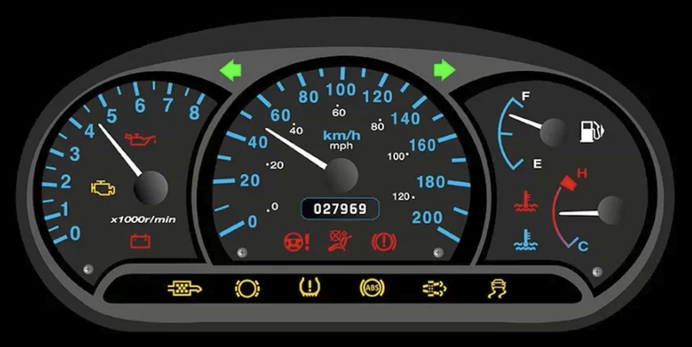

# Master Observability with Prometheus, Loki, Tempo, Alloy, Mimir and OpenTelemetry

# Introduction

# Foundations of Observability

## 모니터링

- 모니터링이란 시스템에 대한 데이터를 주기적으로 수집하고 시각화하여, 시스템의 상태를 확인하고 추적할 수 있도록 하는 것이다.

## 모니터링의 세 가지 질문

- 서비스가 켜져 있는가?
  - `HTTP GET /health` 요청이 200 응답을 받는다.
- 서비스가 예상대로 기능하고 있는가?
  - 백엔드에서 발생하는 에러가 초당 n건 이하이다.
- 서비스가 잘 작동하고 있는가?
  - HTTP GET 요청의 응답시간이 평균 20ms이고, 스루풋은 2000 rps이다.

- 이렇게 수정되는 데이터를 Telemetry Data라고 한다.
- 성공적인 DevOps에 대한 판단지표
  - Mean Time to Detection (MTTD)
    - 팀이 해당 이슈를 발견하는데 걸리는 시간의 평균
  - Mean Time to Resolve (MTTR)
    - 팀이 해당 이슈를 해결하는데 걸리는 시간의 평균

## 모니터링 방법론

### 웹 서비스의 레이어별 방법론

|레이어|예시|방법론
|-----|-----|-----
|UI Layer|웹사이트, 앱|Core Web Vitals|
|Service Layer|Cart service, Payment service|RED Method, Four Golden Signals|
|Infrastructure Layer|CPU, Memory, Disk...|USE Method, Four Golden Signals|

- RED Method
  - Rate (throughput): Request per second.
  - Errors: Failed requests i.e., HTTP 500
  - Duration: Latency or Transaction Time.

- USE Method
  - Utilization i.e., CPU Usage %, Disk Space %
  - Saturation i.e., Network queue length. Zero is best.
  - Errors i.e., Disk write error. Zero is best.

- Four Golden Signals (RED + S): from Google SRE Handbook
  - Latency
  - Traffic (Throughput)
  - Errors
  - Saturation

- Core Web Vitals
  - Largest Contentful Paint (Perceived page load)
  - First Input Delay (Perceived responsiveness)
  - Cumulative Layout Shift (Perceived stability)
  
# Installing Prometheus & Collecting Metrics on Any OS

# Installing and Configuring Grafana

# Using Grafana

# Working with Alerts, Notifications and Annotations in Grafana

# Grafana Loki

# Grafana Alloy for Logs and Opentelemetry Signals

# Grafana Tempo: Tracing in Distributed Systems

# Grafana Mimir: Observability at Scale

# Smart Observability: Integrating AI with Grafana

# Integration With Other DataSources

# Administration of Grafana

# Highly Available and Scalable Grafana

# The Killer Coda Environment to Reinforce What You’ve Learned

# Bonus Items
