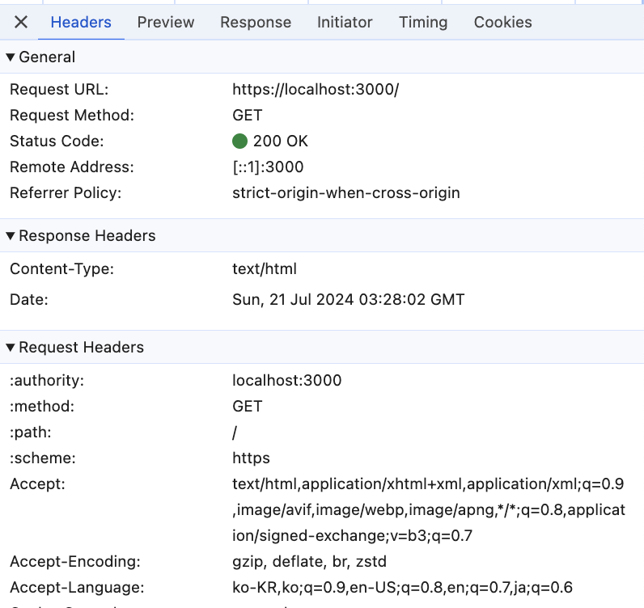
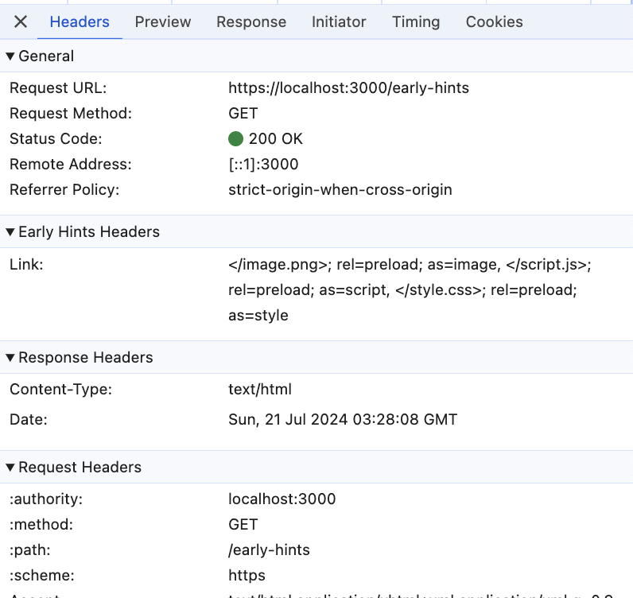
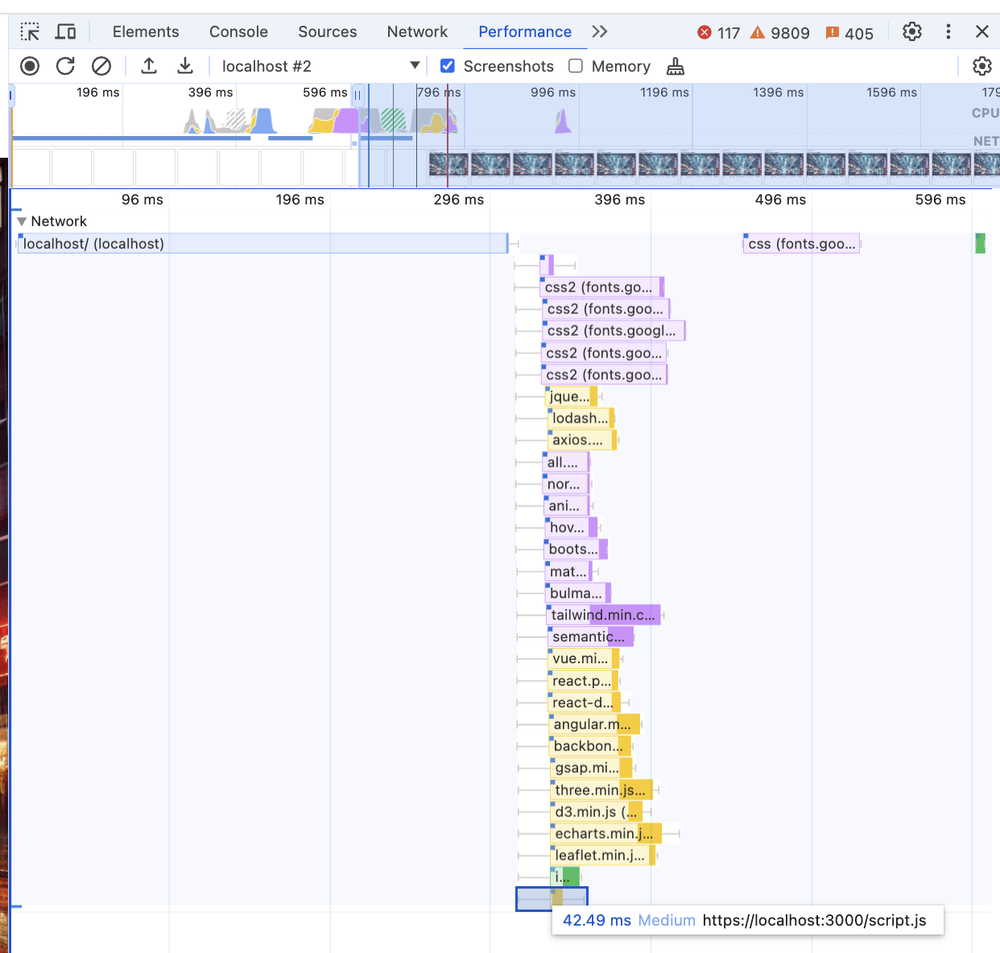
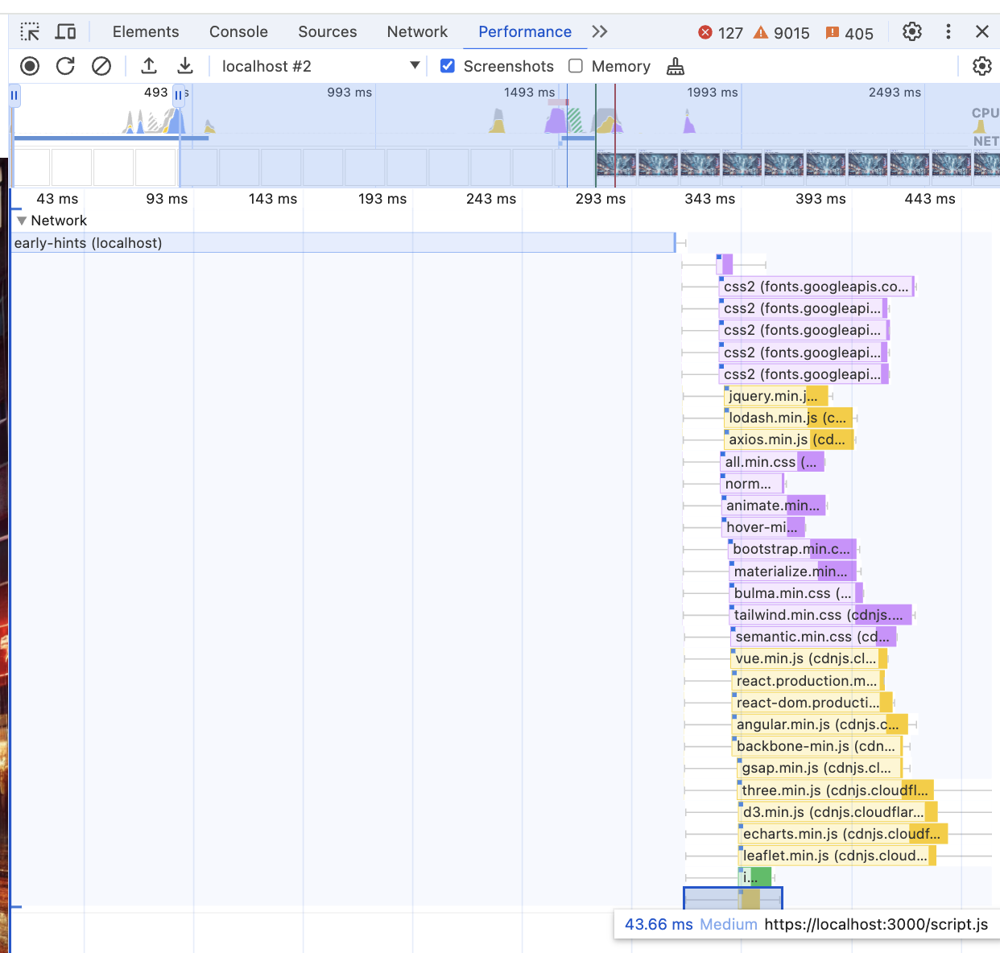

# 103 Early Hints

## 103 Early Hints 테스트 실패

최근 사내 세미나를 통해 접하게 된 103 Early Hints를 사용해보려고 했지만, 아쉽게도 실패했습니다.

## 103 Early Hints란?

새로 추가된 HTTP의 응답 코드로, 서버가 최종 응답을 준비하는 동안 서버가 최종 응답에서 사용할 리소스에 대한 힌트를 클라이언트에게 미리 전달할 수 있도록 하는 응답 코드입니다.

이를 사용하면 사용자가 최종 응답을 받기 전에 필요한 리소스를 미리 다운로드 받을 수 있어 페이지 로딩 속도를 향상시킬 수 있습니다.

### 조금이라도 응답을 빨리 받기 위한 개발자들의 노력

- 초기: HTML 문서만 사용
  - 서버에서 보내주는 HTML 문서를 브라우저가 직접 파싱하고, 이후 필요한 리소스를 서버에 요청하고 받아오는 방식

- 첫번째 발전: 헤더의 사용
  - 응답에서 가장 먼저 받을 수 있는 헤더에 `Link` 항목을 사용하여 필요한 리소스를 미리 알려주는 방식
  - HTML을 모두 받기 전에, 필요한 리소스를 미리 요청하고 다운로드 받을 수 있어 페이지 로딩 속도를 향상시킬 수 있음

- 두번째 발전: 103 Early Hints
  - 서버가 최종 응답을 준비하는 동안 서버가 최종 응답에서 사용할 리소스에 대한 힌트를 클라이언트에게 미리 전달할 수 있도록 하는 응답 코드
  - 사용자가 최종 응답을 받기 전에 필요한 리소스를 미리 다운로드 받을 수 있어 페이지 로딩 속도를 향상시킬 수 있음

## Early Hints를 사용하기 위한 방법

서버에서 103 Early Hints를 보내기 위해서는 아래와 같은 방식으로 Link 헤더를 사용하여 필요한 리소스를 미리 알려주어야 합니다.

```http
HTTP/1.1 103 Early Hints
Link: </style.css>; rel=preload; as=style
Link: </script.js>; rel=preload; as=script
```

### HTTP/2와 Early Hints의 관계

- 그러나 HTTP/1.1에서는 103 Early Hints로 리소스의 위치를 받게 되더라도 멀티플렉싱이 되지 않아, 리소스를 받는 동안 다른 리소스를 받을 수 없습니다.
- 이러한 이유로 대부분의 브라우저는 HTTP/2부터 103 Early Hints를 지원하고 있으며, 이에따라 저도 HTTP/2 환경에서 테스트를 진행하려고 했습니다.

위와 같은 형태로 서버에서 103 Early Hints를 보내면, 브라우저는 해당 리소스를 미리 다운로드 받아놓을 수 있으며, 초기 렌더에 필요한 리소스를 미리 받음으로서 유저가 더 빠르게 페이지를 볼 수 있게 됩니다.

## 사용한 구현 예제

```js
import http2 from 'http2';
import fs from 'fs';
import url from 'url';
import { fileURLToPath } from 'url';
import { dirname, join } from 'path';

const __dirname = dirname(fileURLToPath(import.meta.url));

const options = {
  key: fs.readFileSync(join(__dirname, 'ssl', 'cert.key')),
  cert: fs.readFileSync(join(__dirname, 'ssl', 'cert.crt')),
};

const server = http2.createSecureServer(options);

server.on('stream', (stream, headers) => {
  const parsedUrl = url.parse(headers[':path'], true);
  const pathname = parsedUrl.pathname;
  const filePath = join(__dirname, 'public', pathname);

  // 일반적인 단일 200 응답
  if (pathname === '/') {
    fs.readFile(join(__dirname, 'public', 'index.html'), (err, data) => {
      if (err) {
        stream.respond({ ':status': 500 });
        stream.end('Internal Server Error');
        return;
      }

      setTimeout(() => {
        stream.respond({
          'content-type': 'text/html', ':status': 200
        });
        stream.end(data);
      }, 300);
    });
  }
  // 103 Early Hints 응답 사용
  else if (pathname === '/early-hints') {
    stream.additionalHeaders({
      ':status': 103,
      'Link': '</image.png>; rel=preload; as=image, </script.js>; rel=preload; as=script, </style.css>; rel=preload; as=style'
    });

    fs.readFile(join(__dirname, 'public', 'index.html'), (err, data) => {
      if (err) {
        stream.respond({ ':status': 500 });
        stream.end('Internal Server Error');
        return;
      }

      setTimeout(() => {
        stream.respond({
          'content-type': 'text/html', ':status': 200
        });
        stream.end(data);
      }, 300);
    });
  }
  // 이하는 기타 정적 파일 요청 처리
  else if (pathname === '/style.css') {
    fs.readFile(filePath, (err, data) => {
      if (err) {
        stream.respond({ ':status': 500 });
        stream.end('Internal Server Error');
        return;
      }
      stream.respond({ 'content-type': 'text/css', ':status': 200 });
      stream.end(data);
    });
  } else if (pathname === '/script.js') {
    fs.readFile(filePath, (err, data) => {
      if (err) {
        stream.respond({ ':status': 500 });
        stream.end('Internal Server Error');
        return;
      }
      stream.respond({ 'content-type': 'application/javascript', ':status': 200 });
      stream.end(data);
    });
  } else if (pathname === '/image.png') {
    fs.readFile(filePath, (err, data) => {
      if (err) {
        stream.respond({ ':status': 500 });
        stream.end('Internal Server Error');
        return;
      }
      stream.respond({ 'content-type': 'image/png', ':status': 200 });
      stream.end(data);
    });
  } else {
    stream.respond({ ':status': 404 });
    stream.end('Not Found');
  }
});

server.listen(3000, (error) => {
  if (error) {
    console.error(error);
    return process.exit(1);
  } else {
    console.log('Server started on https://localhost:3000');
  }
});
```

위 구현에서는 아래와 같이 총 5개의 엔드포인트를 사용하였습니다.

- `/` : 일반적인 200 응답을 사용한 엔드포인트
- `/early-hints` : 103 Early Hints를 사용한 엔드포인트
- 기타 정적 리소스 서빙을 위한 엔드포인트
  - `/style.css` : CSS 파일 요청
  - `/script.js` : JS 파일 요청
  - `/image.png` : 이미지 파일 요청

## 테스트 결과

- 일반적인 200 응답을 사용한 엔드포인트



- 103 Early Hints를 사용한 엔드포인트



이전 응답과는 다르게 `Early Hints Headers`가 추가된 것을 확인할 수 있습니다.
원래대로라면 해당 리소스를 200 응답에서 주어지는 HTML보다 먼저 받아올 수 있어야 합니다.

하지만 아래와 같이, 실제로는 해당 리소스를 절대로 먼저 받아오질 않네요..

- 200 응답 엔드포인트



- 103 Early Hints 엔드포인트



## 결론

아쉽게도 103 Early Hints를 사용한 엔드포인트에서도, 리소스를 먼저 받아오지 못했습니다.
문제점을 좀 더 찾아보고, 해결책을 찾아봐야겠습니다.

---
[MDN - Early Hints](https://developer.mozilla.org/en-US/docs/Web/HTTP/Status/103)  
[RFC-8297](https://datatracker.ietf.org/doc/html/rfc8297)
