# 103 Early Hints

## 103 Early Hints 테스트 실패... 인 줄 알았는데

최근 사내 세미나를 통해 접하게 된 103 Early Hints를 사용해보려고 했지만, ~~아쉽게도 실패했습니다.~~
실패 한 줄 알았는데, 잘 작동하고있었습니다. 다만, 브라우저의 워터폴에서는 200 응답을 받은 이후에 리소스를 받아오는 것으로 나타나서, 103 Early Hints가 제대로 작동하는지 확인하기 어려웠습니다.

그러면, 제가 어떤 방식으로 103 Early Hints를 사용하려고 했는지, 그리고 어떻게 성공했다고 말 할 수 있는지 한번 알아보겠습니다.

## 103 Early Hints란?

새로 추가된 HTTP의 응답 코드로, 서버가 최종 응답을 준비하는 동안 서버가 최종 응답에서 사용할 리소스에 대한 힌트를 클라이언트에게 미리 전달할 수 있도록 하는 응답 코드입니다.

사실 최초 제안은 2017년에 이루어졌고, 실제 추가는 2022년에 이루어졌습니다.(구글 크롬v103)
생소하지만, 생각보다 등장한지는 꽤 오래되었습니다.

이를 사용하면 사용자가 최종 응답을 받기 전에 필요한 리소스를 미리 다운로드 받을 수 있어 페이지 로딩 속도를 향상시킬 수 있습니다. 네, 그런데 어떻게 이게 가능할까요?

### 조금이라도 응답을 빨리 받기 위한 개발자들의 노력

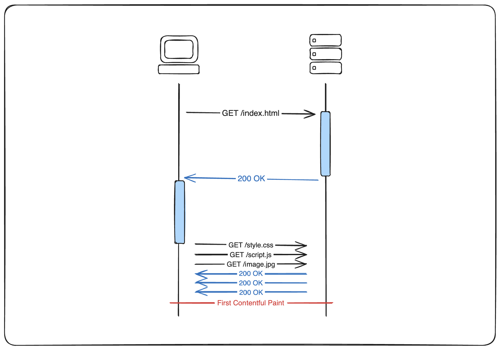

- **초기: HTML 문서만 사용**
  - 서버에서 보내주는 HTML 문서를 브라우저가 직접 파싱하고, 이후 필요한 리소스를 서버에 요청하고 받아오는 방식

    ```http
    HTTP/1.1 200 OK
    Content-Type: text/html

    <!DOCTYPE html>
    ...
    <link rel="stylesheet" href="/style.css">
    <script src="/script.js"></script>
    ...
    </html>
    ```

      - 이런 방식은 간단하지만, HTML 문서를 받은 이후에 필요한 리소스를 다발적으로 요청하고 받아오기 때문에 페이지 로딩 속도가 느릴 수 있습니다.
      - 또한 특정 리소스가 유난히 다운로드가 느려지면, 페이지 로딩이 전체적으로 느려질 수 있습니다.
        - 이는 일반적인 브라우저에서 동시에 6개의 리소스만 다운로드 받을 수 있기 때문입니다.

--- 

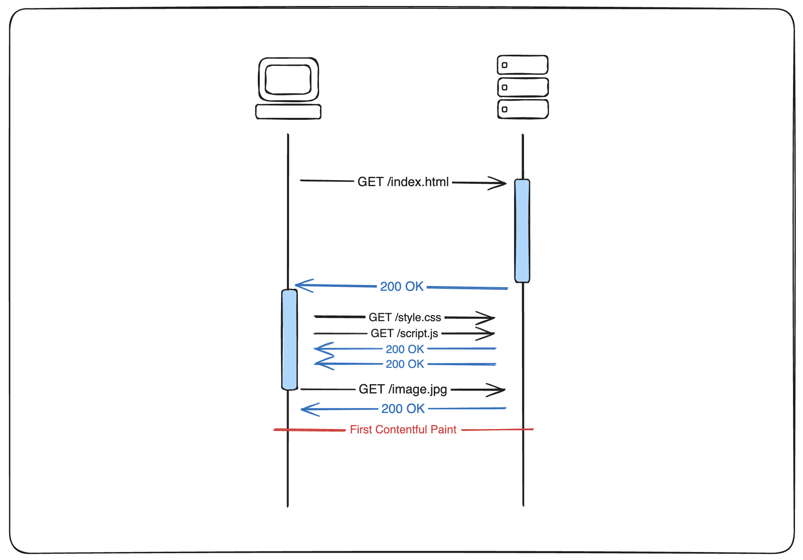

- **첫번째 발전: 헤더의 사용**
  - 응답에서 가장 먼저 받을 수 있는 헤더 부분에 `Link` 헤더를 사용하여 필요한 리소스를 미리 알려주는 방식
  - HTML을 모두 받기 전에, 필요한 리소스를 미리 요청하고 다운로드 받을 수 있어 페이지 로딩 속도를 향상시킬 수 있음

    ```http
    HTTP/1.1 200 OK
    Link: </style.css>; rel=preload; as=style
    Link: </script.js>; rel=preload; as=script
    ...

    <!DOCTYPE html>
    ...
    </html>
    ```

      - 이 방식은 HTML 본문을 받기 전에 헤더를 통해 필요한 리소스를 미리 알려주기 때문에, 브라우저가 리소스를 미리 다운로드 받을 수 있습니다.
      - 주요한 리소스를 미리 다운로드 받을 수 있기 때문에 페이지 로딩 속도를 향상시킬 수 있습니다.

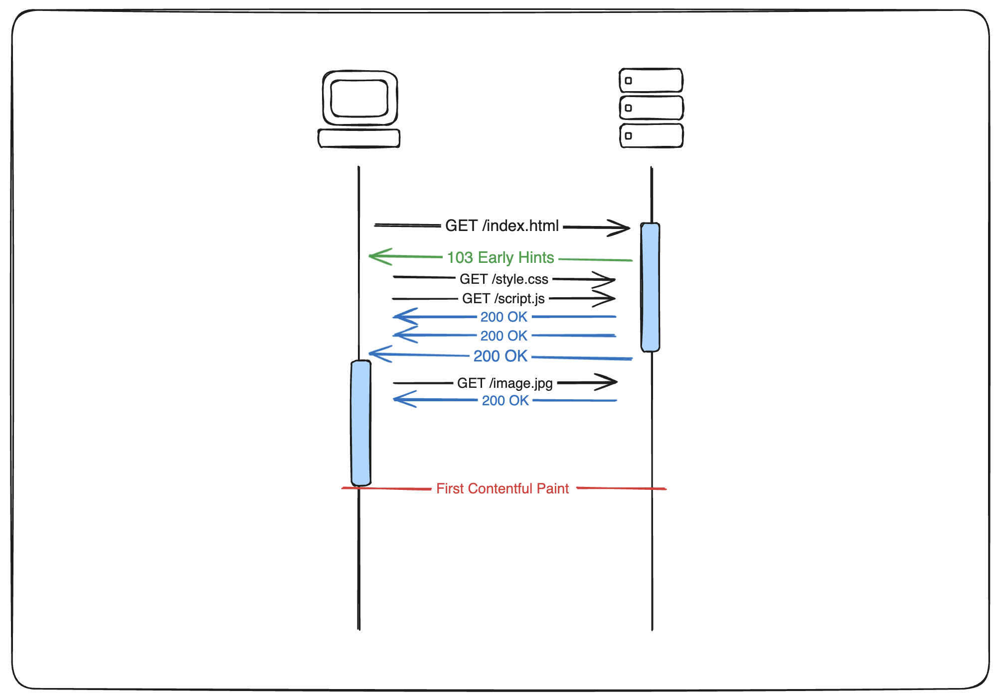

- **두번째 발전: 103 Early Hints**
  - 서버가 최종 응답을 준비하는 동안 서버가 최종 응답에서 사용할 리소스에 대한 힌트를 클라이언트에게 미리 전달할 수 있도록 하는 응답 코드
  - 사용자가 최종 응답을 받기 전에 필요한 리소스를 미리 다운로드 받을 수 있어 페이지 로딩 속도를 향상시킬 수 있음

    ```http
    HTTP/1.1 103 Early Hints
    Link: </style.css>; rel=preload; as=style
    Link: </script.js>; rel=preload; as=script

    HTTP/1.1 200 OK
    Content-Type: text/html

    <!DOCTYPE html>
    ...
    </html>
    ```

      - 이 방식은 103 Early Hints를 사용하여, 서버가 최종 응답을 준비하는 동안 필요한 리소스를 미리 알려주기 때문에, 브라우저가 리소스를 미리 다운로드 받을 수 있습니다.
      - 브라우저가 주요한 리소스를 이전 방법보다도 먼저 알아챌 수 있기 때문에 페이지 로딩 속도를 향상시킬 수 있습니다.
    ```

## Early Hints를 사용하기 위한 방법

서버에서 103 Early Hints를 보내기 위해서는 위에서 다룬 것과 같은 방식으로 Link 헤더를 사용하여 필요한 리소스를 미리 알려주어야 합니다.

```http
HTTP/1.1 103 Early Hints
Link: </style.css>; rel=preload; as=style
Link: </script.js>; rel=preload; as=script
Link: </image.png>; rel=preload; as=image
```

> `Link: <LOCATION>; rel=preload | preconnect; as=TYPE`

- `LOCATION`: 리소스의 위치를 알려주는 헤더
- `rel=preload | preconnect`: 리소스를 어떻게 사용할 것인지 알려주는 속성
  - `preload`: 리소스를 미리 다운로드 받아놓을 것을 알려주는 속성
  - `preconnect`: 리소스를 미리 연결해놓을 것을 알려주는 속성
  - ~~`prefetch`: 아직 사용 할 수 없음~~
- `as=TYPE`: 리소스의 타입을 알려주는 속성

## Early Hints를 사용할 때의 제한사항

### 모든 경우에 빨라지는 것은 아니다

여기까지 설명한 것만 보면, Early Hints를 사용하면 모든 경우에 페이지 로딩 속도가 빨라질 것 같지만, 그렇지 않습니다. 여기에는 몇 가지 이유가 있고, 최적의 사용을 위한 몇 가지 중요한 사항이 있습니다.

- **Early Hints의 사용이 효과를 볼 수 있는 경우**
  1. HTML 문서의 크기가 큰 경우
     - HTML 문서의 크기가 큰 경우, 브라우저가 HTML 문서를 받아오는 동안 필요한 리소스를 미리 받아올 수 있기 때문에 전반적인 페이지 로딩 속도를 향상시킬 수 있습니다.
  2. 한정된 특정 리소스로 인해 페이지 로딩 속도가 느린 경우
     - 특정 리소스 한두개가 병목을 초래하는 경우, 이 리소스를 미리 받아올 수 있기 때문에 전체적인 페이지 로딩 속도를 개선 할 수 있습니다.
  3. 대부분의 유저가 사용하는 브라우저가 Early Hints를 지원하는 경우
  4. HTTP/2 이상의 프로토콜을 사용하는 경우

- **Early Hints의 사용이 효과를 보기 힘든 경우**
  1. HTML 문서의 크기가 작은 경우
     - HTML 문서의 크기가 작은 경우, 브라우저가 HTML 문서를 받아오는 동안 필요한 리소스를 미리 받아올 수 있더라도 전반적인 페이지 로딩 속도에 큰 영향을 미치지 않을 수 있습니다.
  2. 다수의 리소스가 필요한 경우
     - 크기가 작은 다수의 리소스가 필요한 경우, 이를 미리 다운로드 하더라도 사용 할 수 있는 대역폭은 한정적이기 때문에 전체적인 페이지 로딩 속도에 큰 영향을 미치지 않을 수 있습니다.
  3. 대부분의 유저가 사용하는 브라우저가 Early Hints를 지원하지 않는 경우
  4. HTTP/1.1 프로토콜을 사용하는 경우
      - 사실상 대부분의 브라우저에서 HTTP/2 이상부터 103 Early Hints를 지원하고 있습니다.

#### Early Hints의 CanIUse 상황

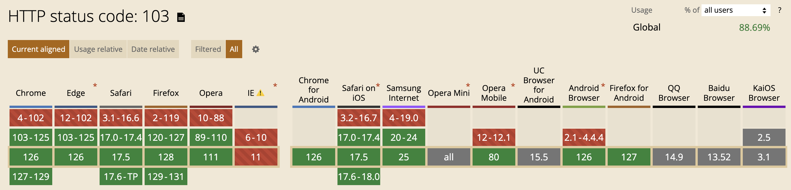

### HTTP/2와 Early Hints의 관계

- HTTP/1.1에서는 103 Early Hints로 리소스의 위치를 받게 되더라도 멀티플렉싱이 되지 않아, 리소스를 받는 동안 다른 리소스를 받을 수 없습니다.
- 이러한 이유로 대부분의 브라우저는 HTTP/2부터 103 Early Hints를 지원하고 있으며, 이에따라 **저도 HTTP/2 환경에서 테스트를 진행**했습니다.
  - 다만 **표기법은 MDN을 따라서 관례적으로 HTTP/1.1 형식으로 표기**하였습니다.

## 사용한 구현 예제 - Node.js

- 전체 리소스는 [여기 - Github](https://github.com/HC-kang/TIL/tree/main/Web/103-early-hint)에서 확인할 수 있습니다.

```js
import http2 from 'http2';
import fs from 'fs';
import url from 'url';
import { fileURLToPath } from 'url';
import { dirname, join } from 'path';

const __dirname = dirname(fileURLToPath(import.meta.url));

const options = {
  key: fs.readFileSync(join(__dirname, 'ssl', 'localhost.key')),
  cert: fs.readFileSync(join(__dirname, 'ssl', 'localhost.crt')),
  allowHTTP1: false,
};

const server = http2.createSecureServer(options);

server.on('stream', (stream, headers) => {
  const parsedUrl = url.parse(headers[':path'], true);
  const pathname = parsedUrl.pathname;
  const filePath = join(__dirname, 'public', pathname);

  // 일반적인 단일 200 응답
  if (pathname === '/') {
    fs.readFile(join(__dirname, 'public', 'index.html'), (err, data) => {
      if (err) {
        stream.respond({ ':status': 500 });
        stream.end('Internal Server Error');
        return;
      }

      setTimeout(() => {
        stream.respond({
          'content-type': 'text/html', ':status': 200
        });
        stream.end(data);
      }, 300);
    });
  }
  // 103 Early Hints 응답 사용
  else if (pathname === '/early-hints') {
    stream.additionalHeaders({
      ':status': 103,
      'Link': '<https://fonts.gstatic.com/s/lato/v24/S6uyw4BMUTPHjx4wXiWtFCc.woff2>; rel=preload; as=font, </image.png>; rel=preload; as=image, </script.js>; rel=preload; as=script, </style.css>; rel=preload; as=style'
    });

    fs.readFile(join(__dirname, 'public', 'index.html'), (err, data) => {
      if (err) {
        stream.respond({ ':status': 500 });
        stream.end('Internal Server Error');
        return;
      }

      setTimeout(() => {
        stream.respond({
          'content-type': 'text/html', ':status': 200
        });
        stream.end(data);
      }, 300);
    });
  }
  // 이하는 기타 정적 파일 요청 처리
  else if (pathname === '/style.css') {
    fs.readFile(filePath, (err, data) => {
      if (err) {
        stream.respond({ ':status': 500 });
        stream.end('Internal Server Error');
        return;
      }
      stream.respond({ 'content-type': 'text/css', ':status': 200 });
      stream.end(data);
    });
  } else if (pathname === '/script.js') {
    fs.readFile(filePath, (err, data) => {
      if (err) {
        stream.respond({ ':status': 500 });
        stream.end('Internal Server Error');
        return;
      }
      stream.respond({ 'content-type': 'application/javascript', ':status': 200 });
      stream.end(data);
    });
  } else if (pathname === '/image.png') {
    fs.readFile(filePath, (err, data) => {
      if (err) {
        stream.respond({ ':status': 500 });
        stream.end('Internal Server Error');
        return;
      }
      stream.respond({ 'content-type': 'image/png', ':status': 200 });
      stream.end(data);
    });
  } else {
    stream.respond({ ':status': 404 });
    stream.end('Not Found');
  }
});

server.listen(3000, (error) => {
  if (error) {
    console.error(error);
    return process.exit(1);
  } else {
    console.log('Server started on https://localhost:3000');
  }
});
```

위 구현에서는 아래와 같이 총 5개의 엔드포인트를 사용하였습니다.

- `/` : 일반적인 200 응답을 사용한 엔드포인트
- `/early-hints` : 103 Early Hints를 사용한 엔드포인트
- 기타 정적 리소스 서빙을 위한 엔드포인트
  - `/style.css` : CSS 파일 요청
  - `/script.js` : JS 파일 요청
  - `/image.png` : 이미지 파일 요청

## 테스트 결과

- 일반적인 200 응답을 사용한 엔드포인트

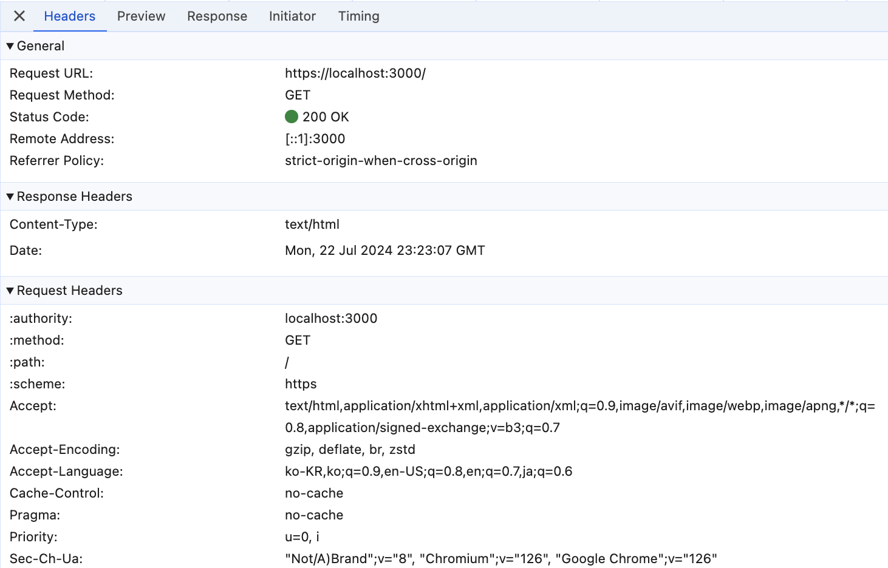

- 103 Early Hints를 사용한 엔드포인트

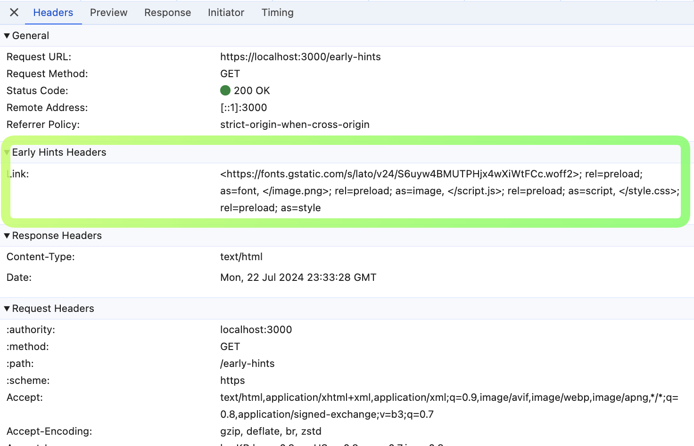

이전 응답과는 다르게 `Early Hints Headers`가 추가된 것을 확인할 수 있습니다.
원래대로라면 해당 리소스를 200 응답에서 주어지는 HTML보다 먼저 받아올 수 있어야 합니다.

~~하지만 아래와 같이, 실제로는 해당 리소스를 절대로 먼저 받아오질 않네요..~~  

확인결과, 개발자 도구의 워터폴에서는 200 응답을 받은 이후에 리소스를 받아오는 것으로 나타나서, 103 Early Hints가 제대로 작동하는지 확인하기 어려웠습니다.

- 200 응답 엔드포인트

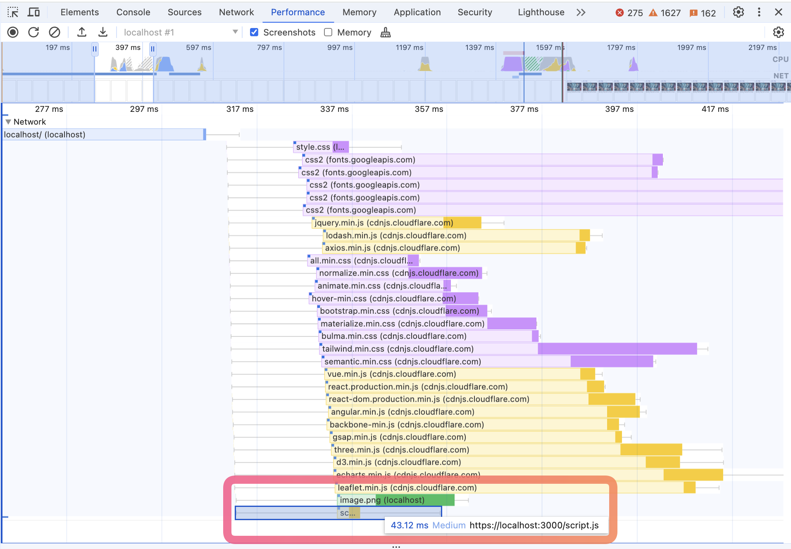

- 103 Early Hints 엔드포인트

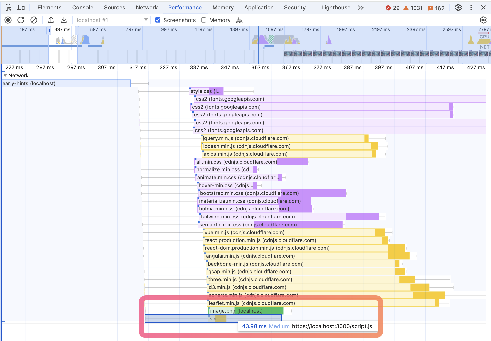

처음에는 이 결과만 보고, 대체 왜 안되는걸까.. 하면서 고민을 많이 했습니다. 그리고 테스트가 실패 한 줄 알았죠.
하다못해 프레임워크나 언어 수준에서 지원하지 않는걸까, 하고 `http2`, `express`, `fastify`에 나중에는 `flask`, `go`, `nginx` 등 다른 언어 및 툴까지도 시도를 해보고 있었습니다.

**그런데 알고보니 단순히 크롬에서 제대로 노출을 안 해 주더라구요? 상상하지도 못했습니다.**

좀 더 자세히 알아보기 위해, 크롬에서 제공하는 export 기능을 사용하여 네트워크 로그를 확인해보았습니다.

- `chrome://net-export/`
  - Chrome 브라우저에서 제공하는 네트워크 트래픽을 캡처하고 내보낼 수 있는 기능.
  - 브라우저에서 발생하는 모든 네트워크 요청을 기록하고 JSON 파일로 내보낼 수 있음.

### '/' - 200 응답 엔드포인트

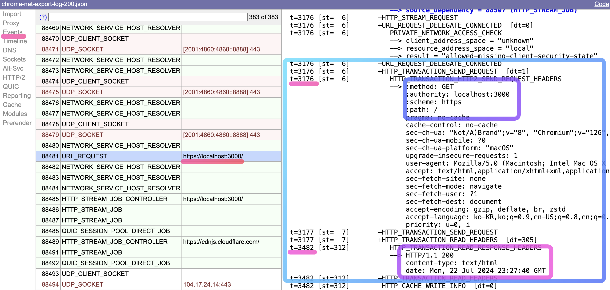

위 이미지를 보시면, 브라우저에서 `https://localhost:3000/` 엔드포인트에 요청을 하고, 응답으로 200 OK와 함께 HTML 문서만을 받아온 것을 확인할 수 있습니다.
이미지의 가운데 쯤 표시한 `t=3176`은 제가 레코딩을 누른 뒤 3.176초가 지난 시점에서 요청을 보냈다는 것을 나타냅니다.
즉 해당 요청은 `t=3176`에 시작되어 `t=3482`에 끝난 것을 확인할 수 있습니다.

그러면, 리소스는 언제 받아왔는지 볼까요?

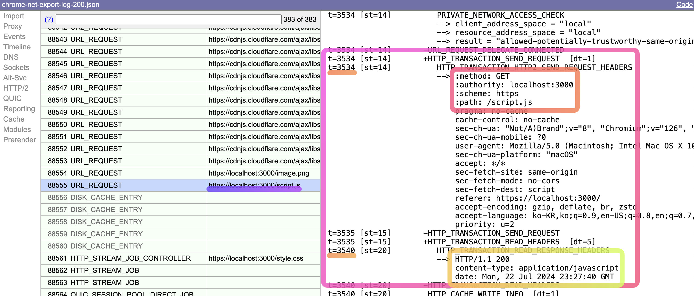

위 이미지에서는 `https://localhost:3000/script.js` 엔드포인트에 `t=3534`에 요청을 보내고, `t=3540`에 응답을 받아온 것을 확인할 수 있습니다.
즉, HTML 문서를 받은 이후에 필요한 리소스를 받아온 것을 확인할 수 있습니다. 

### '/early-hints' - 103 Early Hints 엔드포인트

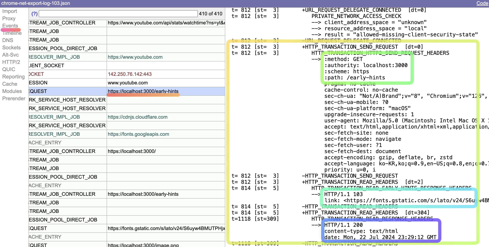

반면 위 이미지에서는 `https://localhost:3000/early-hints` 엔드포인트에 요청을 하고, 응답으로 103 Early Hints를 먼저 받고, 이어서 200 OK와 함께 HTML 문서를 받아온 것을 확인할 수 있습니다.  
103 응답의 Link 헤더가 일부 잘려 있지만, 내용은 위의 **예시 코드**에서 작성한것과 동일하고 `/script.js`에 대한 `preload`를 포함하고있습니다.  
이번에는 제가 레코딩 후 조금 빠르게 요청을 보냈나 보네요. 요청은 `t=812`에 보냈고 응답은 `t=1118`에 받았습니다.  
그리고 그 사이인 `t=814`에 **미리 103 Early Hints를 받아온 것을 확인**할 수 있습니다.

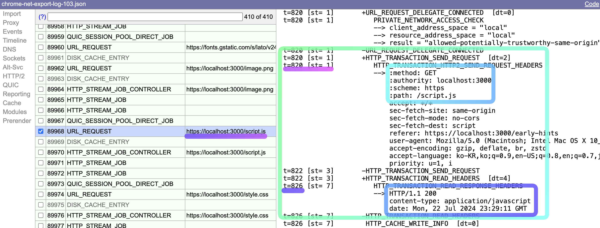

위 이미지에서는 `https://localhost:3000/script.js` 엔드포인트에 `t=820`에 요청을 보내고, `t=826`에 응답을 받아온 것을 확인할 수 있습니다.  
결과적으로 HTML 본문을 받아오기 이전에, 필요한 script.js 리소스를 먼저 받아온 것을 확인할 수 있습니다.

## 결론

~~아쉽게도 103 Early Hints를 사용한 엔드포인트에서도, 리소스를 먼저 받아오지 못했습니다.
문제점을 좀 더 찾아보고, 해결책을 찾아봐야겠습니다.~~

---
[MDN - Early Hints](https://developer.mozilla.org/en-US/docs/Web/HTTP/Status/103)  
[RFC-8297](https://datatracker.ietf.org/doc/html/rfc8297)
[Chrome for Developers - 103 Early Hints](https://developer.chrome.com/docs/web-platform/early-hints)