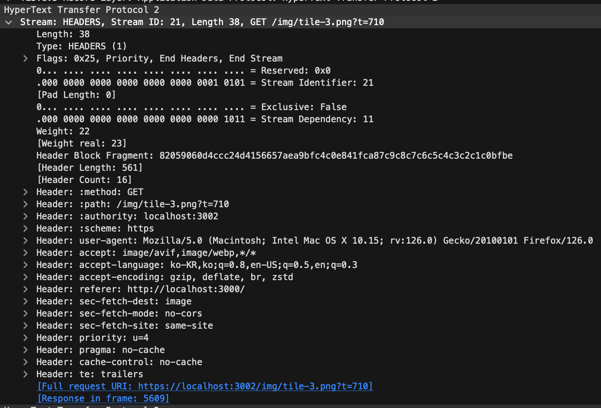

## HTTP 개요 - HTTP란 무엇일까?

HTTP는 `HyperText Transfer Protocol`의 약자이고, 말 그대로 하이퍼텍스트를 전송하는 규약입니다.
여기에서 하이퍼텍스트(HyperText)란 우리가 흔히 `링크`라고도 부르는 것인데, 어릴 때 쓰던 게시판에서 파란색 텍스트를 클릭하면 다른 문서로 이동하고 이미 한 번 클릭했던 텍스트는 보라색으로 변했던 것을 기억하실겁니다. 이것이 바로 `하이퍼텍스트`입니다.


조금 더 과거로 돌아가서 발단을 알아보자면, 사실 HTTP의 최초 목적은 연구기관(CERN)에서 연구자료를 공유하기 위한 목적으로 시작되었습니다.
이러한 연구자료, 특히 논문은 상호 참조되는 경우가 많았는데요, 이를 위해 문서에서 다른 문서를 쉽게 참조하기 위한 방법이 필요했습니다.
이러한 수요로 인해 등장한 것이 바로 `하이퍼텍스트`입니다. 그리고 이를 효율적으로 작성하고 사용 할 수 있는 `HyperText Markup Language`, 즉 `HTML`도 이 때 같이 등장하게 되었습니다.

> HTTP는 텍스트 기반의 프로토콜이다.

예전에 처음 논문을 볼 때 한글이나 워드 등의 별도의 프로그램이 없이도 브라우저에서 이를 바로 볼 수 있다는 것을 신기해했었는데, 지금 와서 생각해보니 오히려 이게 더 당연한 것이었던 것 같다는 생각이 드네요.

다시 본론으로 돌아가서 이러한 HTTP의 특징에 대해 좀 더 알아보겠습니다.

앞서말한 연구자료의 공유 측면에서 생각해볼때, 필연적으로 소비자와 공급자가 생기게 됩니다. 누군가는 연구 자료를 요청하고, 누군가는 이를 응답하는 쌍방의 관계가 생기는거죠.
즉, HTTP는 본질적으로 클라이언트와 서버의 관계를 전제로 하는 프로토콜이라고 할 수 있습니다.

> HTTP는 클라이언트와 서버의 존재를 전제로 하는 프로토콜이다.

또한, 초기 목적이 연구자료의 간단한 공유였기에 공급자들은 상태관리등의 복잡한 기능을 필요로 하지 않았습니다. 그저 요청 하나를 받으면 하나의 응답을 주는 간단한 방식이었죠. 이러한 특징으로 인해 HTTP는 무상태성(Stateless)을 가지고 있습니다. - 물론 현재는 세션과 쿠키를 통해 상태를 유지할 수도 있습니다. 이는 이후에 다루도록 하겠습니다 -

> HTTP는 무상태성(Stateless)인 성격을 가지고 있다.

'각각의 요청이 독립적이고, 서버는 클라이언트의 상태를 보존하지 않는다.'

이러한 특성에서 또다른 특징을 도출 할 수 있습니다. 바로 HTTP는 자기설명적(Self-Descriptive)이라는 것입니다. 왜냐하면 상태를 갖지 않는, 독립된 요청만으로 요구사항을 판단하여 응답해야 하기 때문이죠.
이를 위해 요청과 응답의 형식이 명확히 정의되어 있고, 설명을 위한 헤더가 추가되었습니다. 물론 이 과정이 한번에 이루어진 것은 아닙니다. 이 과정에 대해서도 후에 차차 알아보도록 하겠습니다.

> HTTP는 상태코드와 헤더를 사용하여 자기설명적(Self-Descriptive)인 성격을 가지고 있다.

이러한 특성으로 인해 HTTP는 사용하기 편하고 높은 확장성을 가진 프로토콜이 되었습니다. 이러한 특성들을 기반으로 넓은 범위의 웹 서비스에 활용되며, 이 과정에서 다양한 기능과 사용법이 추가되었습니다. 특히 단순한 클라이언트-서버 구조뿐 아니라, 프록시, 게이트웨이, 터널 등의 여러 중개자가 존재하는 복잡한 구조에서도 사용될 수 있게 되었습니다.

> HTTP에서 서버와 클라이언트 사이에는 프록시, 게이트웨이, 터널 등 여러 중개자가 존재할 수 있다.

<!-- - 클라이언트와 서버의 존재를 전제로 하는 프로토콜
- 클라이언트와 서버 사이에 프록시, 게이트웨이, 터널 등의 중개자가 존재할 수 있음
- 무상태성(Stateless): 서버는 클라이언트의 상태를 보존하지 않음
  - 세션(Session)과 쿠키(Cookie)를 통해 상태를 유지할 수 있음 -->

## HTTP 버전 - HTTP의 발전과정 톺아보기

### HTTP/0.9

사실 처음에는 '0.9'에 해당하는 버전이 존재하지 않았습니다. 단순히 HTTP였죠.
이후 좀 더 다듬어진 HTTP/1.0이 등장하면서 이와 구분하기위해 '0.9'라는 표현이 사용되었습니다.

0.9 버전의 HTTP는 처음에 언급했던 대로 굉장히 단순한 형태를 가지고 있었습니다. 
헤더가 없는 간단한 요청과 응답만을 지원하며, 메서드는 GET만 존재했습니다.
또한 응답은 오직 HTML만 전송 가능했습니다.

- HTTP/0.9의 예시
  - 요청

    ```http
    GET /index.html
    ```

  - 응답

    ```html
    <html>\nSOME HYPERTEXT DOCS\n</html>
    ```

- 위에서 볼 수 있듯이, 요청은 GET 메서드만 사용할 수 있습니다.
- 응답은 HTML만을 전송할 수 있으며, 본문만을 전송하고 헤더는 존재하지 않습니다.
- 요청과 응답 모두 단순하게 하나의 행으로 구성되어있습니다.

### HTTP/1.0

HTTP/1.0은 0.9 버전에 비해 많은 변화가 있었습니다. 먼저 그 중 가장 큰 두 가지 변화를 살펴보겠습니다.

첫째로, 요청과 응답의 형식이 좀 더 명확히 정의되었습니다. 요청에는 `메서드`, `URI`, `프로토콜 버전`이 포함되며, 메서드도 `GET`뿐만 아니라 `HEAD`, `POST` 요청이 추가되었습니다. 응답의 경우에는 `상태코드`와 `상태 메시지`가 추가되어 요청에 대한 처리 결과를 보다 명확하게 전달할 수 있게 되었습니다.

둘째로는 요청과 응답에 대한 설명, 즉 메타정보를 위한 헤더가 추가되었습니다. 따라서 요청시에 클라이언트는 `Accept` 헤더를 통해 (HTML 외에도)원하는 컨텐츠의 종류를 명시할 수 있게 되었고, 서버는 `Content-Type` 헤더를 통해 전송하는 컨텐츠의 종류를 명시할 수 있게 되었습니다.

- HTTP/1.0의 예시
  - 요청

    ```http
    GET /home HTTP/1.0\r\n
    Host: localhost:3000\r\n
    Accept: text/html,application/xhtml+xml,application/xml;q=0.9,image/avif,image/webp,image/apng,*/*;q=0.8,application/signed-exchange;v=b3;q=0.7\r\n
    Accept-Language: ko-KR,ko;q=0.9,en-US;q=0.8,en;q=0.7,ja;q=0.6\r\n
    Cache-Control: no-cache\r\n
    Connection: close\r\n
    User-Agent: Mozilla/5.0 (Macintosh; Intel Mac OS X 10_15_7) AppleWebKit/537.36 (KHTML, like Gecko) Chrome/124.0.0.0 Safari/537.36\r\n
    \r\n
    ```

  - 응답

    ```http
    HTTP/1.0 200 OK\r\n
    Content-Type: text/html\r\n
    Content-Length: 100\r\n
    Date: Fri, 10 May 2024 14:04:16 GMT\r\n
    Connection: close\r\n
    \r\n
    <!DOCTYPE html>\r\n
    <html lang="en">\r\n
    <head>\r\n
        <meta charset="UTF-8">\r\n
        <meta name="viewport" content="width=device-width, initial-scale=1.0">\r\n
        <title>Home with images</title>\r\n
    </head>\r\n
    <body>\r\n
        <div>\r\n
            \r\n
        </div>\r\n
    </body>\r\n
    </html>
    ```

HTTP/0.9와 다르게 요청과 응답이 길어졌습니다. 이제는 개행문자를 사용하여 요청과 응답 내에서 영역(행)을 구분할 수 있어졌고, 이를 통해 상태와 헤더, 본문을 구분할 수 있게 되었습니다. 그리고 `Accept` 헤더를 통해 HTML 외에 다양한 리소스를 요청 할 수 있게되었습니다. 또한 요청의 경우 개행문자를 두 번 사용하여 요청의 끝을 명시하게 되었고 응답의 경우 `Content-Length` 헤더를 통해 본문의 길이를 명시할 수 있게 되어 이를 통해 본문의 끝을 알 수 있게 되었습니다.

이러한 변화로 인해 HTTP/1.0은 좀 더 자기설명적(Self-Descriptive)인 성격을 띄게 되었을 뿐더러, 헤더를 사용해 몇 가지 추가적인 기능을 사용 할 수 있게 되었습니다.
바로 `지속적 커넥션`과 `캐싱`입니다.

먼저 `지속적 커넥션`에 대해 먼저 알아보겠습니다.
HTTP/0.9부터 모든 요청은 단기 커넥션(Short Lived Connection)을 사용했습니다. 즉, 매 요청마다 TCP 커넥션을 맺고 끊었으며 이는 오버헤드가 크고 비효율적이었습니다.
이에 HTTP/1.0에서는 `Connection: keep-alive` 헤더를 통해 지속적 커넥션을 사용할 수 있게 되었습니다. 이를 통해 하나의 TCP 커넥션을 통해 여러 요청과 응답을 주고 받을 수 있게 되었습니다.
그러나 이때까지는 기본값으로 단기 커넥션을 사용했으며 필요한 경우 `Connection: keep-alive` 헤더를 통해 지속적 커넥션을 사용할 수 있었습니다.

- 그림으로 보는 단기 커넥션과 지속적 커넥션의 차이
  

- 네트워크 분석 도구(Wireshark)를 사용해 확인한 실제 TCP 커넥션의 작동방식
  - `Connection: close`: 커넥션을 닫음
    - 

  - `Connection: keep-alive`: 커넥션을 유지 / 재활용
    - 

이어서 `캐싱`에 대해 알아보겠습니다.
인터넷이 발전함에 따라 점차 웹 컨텐츠가 증가함에 따라 한 페이지를 표시하는데에 수십개 이상의 리소스를 다운로드하는 경우가 생기기 시작했습니다. 당연히 이중에는 동일한 리소스를 다시 요청하는 경우도 많았죠. 여기서 개발자들은 굳이 동일한 리소스를 매번 받을 필요가 없다는 사실을 깨닫습니다. 여기서 먼저 `Last-Modified`헤더가 등장합니다.

```http
Last-Modified: Wed, 08 May 2024 08:00:00 GMT
```

서버는 이제 응답을 보낼 때, 위와 같은 헤더를 추가합니다. 이를 통해 해당 컨텐츠가 언제 수정되었는지를 클라이언트에게 알립니다. 이때 클라이언트는 `200 OK`를 수신하며 결과를 로컬에 저장합니다.

```http
If-Modified-Since: Wed, 08 May 2024 08:00:00 GMT
```

이제부터 클라이언트는 같은 요청을 다시 보낼 때 위와 같은 헤더를 추가합니다. 그리고 서버는 이 헤더와 자신이 가진 정보를 비교한 수 최신 정보라면 `304 Not Modified` 상태코드와 빈 본문을 응답합니다. 만약 최신이 아니라면 다시금 `200 OK`과 본문을 리턴합니다.

그런데 여기서도 뭔가 부족합니다. 왜냐하면 결국 통신은 클라이언트와 서버 사이를 수십~수백ms에 걸쳐 왕복해야 하기 때문이죠. 여기서 새로운 방법인 `Expired` 헤더가 또다시 등장합니다.

```http
Expires: Wed, 08 May 2024 08:00:00 GMT
```

이제 서버는 응답을 보낼 때 위와 같은 헤더를 추가합니다. 이를 통해 해당 컨텐츠가 언제까지 유효한지를 클라이언트에게 알립니다. 이때 클라이언트는 `200 OK`를 수신하며 결과를 로컬에 저장합니다.
그리고 이제 클라이언트는 동일한 리소스가 다시 필요할 때, `Expires` 값과 현재 시간을 비교하여 캐시가 유효한지를 판단합니다. 이 방법은 최소한의 확인 요청조차 없이 캐시를 사용할 수 있게 하여 트래픽을 줄여줍니다.

### HTTP/1.1

위처럼 HTTP/1.0에서 많은 발전이 있었습니다. 그러나 아직 부족한 점이 많았고, 이에 HTTP/1.1이 등장하면서 이러한 부족한 점을 보완하고 새로운 기능을 추가하였습니다. 그에따라 현재까지도 HTTP/1.1은 가장 널리 사용되고 있는 버전입니다.

- HTTP/1.1의 예시
  - 요청

    ```http
    GET /home HTTP/1.1\r\n
    Host: localhost:3000\r\n
    Connection: keep-alive\r\n
    Pragma: no-cache\r\n
    Cache-Control: no-cache\r\n
    sec-ch-ua: "Chromium";v="124", "Google Chrome";v="124", \r\n"Not-A.Brand";v="99"\r\n
    sec-ch-ua-mobile: ?0\r\n
    sec-ch-ua-platform: "macOS"\r\n
    Upgrade-Insecure-Requests: 1\r\n
    User-Agent: Mozilla/5.0 (Macintosh; Intel Mac OS X 10_15_7) \r\nAppleWebKit/537.36 (KHTML, like Gecko) Chrome/124.0.0.0 \r\nSafari/537.36\r\n
    Accept: text/html,application/xhtml+xml,application/xml;q=0.\r\n9,image/avif,image/webp,image/apng,*/*;q=0.8,application/\r\nsigned-exchange;v=b3;q=0.7\r\n
    Sec-Fetch-Site: none\r\n
    Sec-Fetch-Mode: navigate\r\n
    Sec-Fetch-User: ?1\r\n
    Sec-Fetch-Dest: document\r\n
    Accept-Encoding: gzip, deflate, br, zstd\r\n
    Accept-Language: ko-KR,ko;q=0.9,en-US;q=0.8,en;q=0.7,ja;q=0.6\r\n
    \r\n
    ```

  - 응답

    ```http
    HTTP/1.1 200 OK\r\n
    Content-Type: text/html\r\n
    Date: Fri, 10 May 2024 14:22:39 GMT\r\n
    Connection: keep-alive\r\n
    Keep-Alive: timeout=5\r\n
    Content-Length: 455\r\n
    \r\n
    <!DOCTYPE html>\r\n
    <html lang="en">\r\n
    <head>\r\n
        <meta charset="UTF-8">\r\n
        <meta name="viewport" content="width=device-width, \r\ninitial-scale=1.0">\r\n
        <title>Home with images</title>\r\n
    </head>\r\n
    <body>\r\n
        <div>\r\n
            \r\n
            \r\n
            \r\n
        </div>\r\n
    </body>\r\n
    </html>
    ```

HTTP/1.1에 추가된 주요 기능은 다음과 같습니다.

- 지속적 커넥션(Persistent Connection, Keep-Alive)이 기본으로 채택됨
  - 크롬 브라우저에서는 기본적으로 `Connection: Keep-Alive`를 사용합니다.
    - 
    - 위 사진의 우측 끝에서 불 수 있다시피, Request들이 Connection ID를 일부 공유하는 것을 볼 수 있습니다.
    - 또한 TCP연결을 통해 흐르는 패킷을 직접 떠보면 아래와 같이 두 가지 HTTP 요청이 하나의 커넥션 안에서 이어져있음을 확인 할 수 있습니다.
      - 
  - 서버에서 강제로 `Connection: close`를 기입하면 아래와 같은 결과를 볼 수 있습니다.
    - 
    - 이 그림의 우측에서도 매 요청마다 다른 Connection ID를 사용하는것을 볼 수 있습니다.

   
- 청크 전송 인코딩(Chunked Transfer Encoding)을 사용할 수 있음
- 기타 메서드의 추가: `OPTIONS`, `PUT`, `DELETE`
- 보다 진보된 캐시 제어 매커니즘 사용 가능: `Cache-Control`, `ETag` 등 헤더 추가
  - `Cache-Control: no-store`: 캐시를 사용하지 않음
    - `Cache-Control: no-cache`: 캐시를 사용하지 않음. 서버에 재검증 요청을 보내고 확인한 후에 응답을 사용해야 함
    - `Cache-Control: public`: 캐시를 사용할 수 있음. 공용 캐시에 저장해도 됨
    - `Cache-Control: private`: 캐시를 사용할 수 있음. 개인화 캐시에 저장해야 함
- `Host` 헤더 추가: 하나의 서버에 여러 도메인을 사용 할 수 있음

이처럼, HTTP/1.1에는 헤더를 바탕으로 수많은 기능이 추가되었습니다. 이러한 기능들은 HTTP의 확장성을 높이고, 더욱 다양한 웹 서비스를 제공할 수 있게 되었습니다. 이때문에 HTTP/2.0은 물론 HTTP/3.0이 등장한 현재까지도 HTTP/1.1은 가장 널리 사용되는 버전이 되었습니다.

---

### HTTP/2의 등장

이전 글에서 알아본 대로, HTTP/1.1은 HTTP/1이 20년 이상 사용되며 발전해온 버전이었습니다.
Host 헤더를 통해 하나의 서버에서도 여러 도메인을 서빙할 수 있게 되었고, 지속적 커넥션을 통해 TCP 연결을 재사용하여 성능과 대역폭 사용의 효율성을 크게 높일 수 있었습니다.
다만, 인터넷 생태계가 확장됨에 따라 아무리 커넥션을 유지한다 하더라도 HTTP/1은 본질적으로는 단일 요청/응답 방식을 사용하기 때문에 여전히 성능적인 한계가 존재했습니다. 일반적으로 한번의 하나의 리소스만 응답할 수 있었기 때문이죠.


  - 위 그림은 모 쇼핑몰 페이지 하나를 로딩한 결과입니다. 이 페이지는 총 500개 이상의 리퀘스트를 통해 수많은 문서와 이미지, 동영상을 보여줍니다.

#### SPDY 프로토콜의 등장

위에서 다룬 HTTP/1의 근본적인 문제를 해결하기 위해 다양한 시도가 있어왔고, 그 중 가장 유력한 것이 바로 구글에서 개발한 SPDY 프로토콜입니다. 이 프로토콜에서는 프레이밍, 멀티플렉싱, 헤더 압축이라는 세 가지 주요 개념을 도입했습니다.

#### 프레이밍(Framing)

프레이밍이란, 수신자가 보다 정확하고 빠르게 데이터를 처리 할 수 있도록 데이터를 포장하는 방식이라고 볼 수 있습니다. 이를 간단하게 예시를 들어, HTTP/1.1의 문제점을 짚어보도록 하겠습니다.

- HTTP/1.1 요청의 예시

  ```http
    GET /home HTTP/1.1\r\n
    Host: localhost:3000\r\n
    Connection: keep-alive\r\n
    Pragma: no-cache\r\n
    Cache-Control: no-cache\r\n
    Upgrade-Insecure-Requests: 1\r\n
    User-Agent: Mozilla/5.0 (Macintosh; Intel Mac OS X 10_15_7) \r\nAppleWebKit/537.36 (KHTML, like Gecko) Chrome/124.0.0.0 \r\nSafari/537.36\r\n
    Accept: text/html,application/xhtml+xml,application/xml;q=0.\r\n9,image/avif,image/webp,image/apng,*/*;q=0.8,application/\r\nsigned-exchange;v=b3;q=0.7\r\n
    Accept-Encoding: gzip, deflate, br, zstd\r\n
    Accept-Language: ko-KR,ko;q=0.9,en-US;q=0.8,en;q=0.7,ja;q=0.6\r\n
    \r\n
    ```

위와 같은 텍스트 기반의 HTTP/1.1(이하 h1) 요청을 파싱하고 이해하는 것은 크게 어려운 문제는 아닙니다.
하지만 바이너리를 직접 활용한다면 이보다 더 빠른 속도로 데이터를 처리할 수 있습니다. 
또한, h1에서는 구분자로 `\r\n`(crlf)를 사용하고 있는데, 일부 표준을 따르지 않는 사용자들이 `\n`만을 사용하는 경우도 있을 수 있습니다.
마지막으로 이러한 방식은 요청을 받는 시점에서 전체 길이를 미리 알 수도 없어 이를 메모리에 모두 올릴 수 있다는 보장도 없습니다.

이러한 문제를 해결하기 위해 HTTP/2(이하 h2)에서는 프레이밍을 도입했습니다.
정규화된 프레임 구조를 사용함으로써 요청의 길이를 미리 알 수 있게 되었고, 텍스트가 아닌 바이너리로 인코딩하여 전송함으로써 더 빠르고 안정적인 데이터 전송을 가능하게 했습니다.


> HTTP/2는 더이상 텍스트 기반의 프로토콜이 아니다.
> HTTP/2는 바이너리를 사용하여 더 빠르고 안정적인 데이터 전송을 가능하게 했다.

물론 텍스트 기반이라는 점이 h1의 큰 장점이었기에, 이러한 변화는 호환성 문제를 야기할 수 있습니다. 실제로 이러한 문제로 인해 아직까지도 많은 웹사이트들이 h1을 사용하고 있습니다.
그러나 이러한 변화로 인해 h2는 더 빠르고 안정적인 데이터 전송을 가능하게 했으며, 이는 더 빠른 웹 페이지 로딩 속도와 더 적은 대역폭 사용을 가능하게 했습니다.

#### 멀티플렉싱(Multiplexing)

이전 글에서 언급하지 않았지만, h1에는 deprecated된 `pipelining`이라는 기능이 존재했습니다. 이 기능은 하나의 TCP 연결 안에서 여러 요청을 동시에 보내 다수의 요청을 빠르게 처리하고자 하는 목적으로 등장했었습니다.
그러나 이 기능은 아래와 같은 점에서 치명적인 문제가 발생했습니다.

- 파이프라인의 설계상, 요청은 무조건 순서대로 처리되어야 한다.
- 인터넷은 불안정하다. 따라서 요청이 중간에 끊기거나, 응답이 늦어지는 경우가 발생한다.

위 두 가지 문제점으로 인해, pipelining은 `HOL(Head of Line) Blocking`이라는 문제를 야기하게 되었습니다. 이는 하나의 요청이 지연되면 그 이후의 모든 요청이 지연되는 현상을 의미합니다.

이러한 문제를 해결하기 위해 h2에서는 멀티플렉싱을 도입했습니다.
눈썰미가 좋으시다면, 이전 프레임 구조에서 `Stream Identifier`라는 필드를 보셨을 수 있습니다.
이 필드는 각각의 프레임이 어떤 요청에 대한 응답인지를 식별하기 위한 필드로, 이를 통해 h2는 하나의 TCP 연결 안에서, 순서에 구애받지 않고 여러 요청을 동시에 처리할 수 있게 되었습니다.

여기서 h1의 `keep-alive`와 h2의 멀티플렉싱을 비교해보면, 두가지 모두 TCP 연결을 재사용하여 성능을 향상시키는 목적을 가지고 있습니다. 그러나 h1의 `keep-alive`는 여러 요청을 동시에 보내더라도 하나의 TCP커넥션에 대해서는 한가지 요청씩 순차적으로 처리되었지만, h2의 멀티플렉싱은 여러 요청을 동시에 보내고 동시에 처리할 수 있게 되었습니다.
구체적으로 이야기해 보자면, TCP 커넥션을 동시에 6개 사용하는 일반적인 브라우저에서는 어떤 사정으로 인해 6개의 커넥션에서 각각 하나씩의 패킷 전송이 지연되면 모든 통신이 먹통이 됩니다. 하지만 h2의 경우, streamID를 통해 사실상 무제한의 스트림을 이용 할수 있고, 하나의 스트림이 지연되더라도 다른 스트림의 전송에는 영향을 끼치지 않습니다.

> HTTP/2는 하나의 TCP 연결 안에서 여러 요청(스트림)을 `동시에` 처리할 수 있게 되었다.

또한 추가적으로, 동시에 처리되는 요청들의 특성상 필수적인 `우선순위`를 지정하고 제어하는 기능, PUSH_PROMISE라는 프레임과 멀티플렉싱을 사용한 `서버 푸시(Server Push)` 기능을 사용할 수 있게 되었으며, 이를 통해 클라이언트가 요청하지 않았지만 필요할 것으로 예상되는 리소스를 클라이언트에게 미리 전송할 수 있게 되었습니다.

#### 헤더 압축(Header Compression)

마지막으로 h2가 해결한 문제점은 반복되는 헤더를 압축하여 제거했다는 점입니다.

- HTTP/1.1의 헤더

  ```http
    GET /home HTTP/1.1\r\n
    Host: localhost:3000\r\n
    Connection: keep-alive\r\n
    Pragma: no-cache\r\n
    Cache-Control: no-cache\r\n
    Upgrade-Insecure-Requests: 1\r\n
    User-Agent: Mozilla/5.0 (Macintosh; Intel Mac OS X 10_15_7) \r\nAppleWebKit/537.36 (KHTML, like Gecko) Chrome/124.0.0.0 \r\nSafari/537.36\r\n
    Accept: text/html,application/xhtml+xml,application/xml;q=0.\r\n9,image/avif,image/webp,image/apng,*/*;q=0.8,application/\r\nsigned-exchange;v=b3;q=0.7\r\n
    Accept-Encoding: gzip, deflate, br, zstd\r\n
    Accept-Language: ko-KR,ko;q=0.9,en-US;q=0.8,en;q=0.7,ja;q=0.6\r\n
    \r\n
    ```

다시 한 번, 위에서 다룬 h1의 헤더들을 가져와 보았습니다. 그런데 자세히 보면, 이 헤더들은 매 요청마다 반복되는 부분이 많다는 것을 알 수 있습니다.

- 반복되는 헤더들
  - `Host`, `Connection`, `Pragma`, `Cache-Control`, `Upgrade-Insecure-Requests`, `User-Agent`, `Accept`, `Accept-Encoding`, `Accept-Language`

- HTTP/2의 연속된 요청의 헤더들
  - 요청 1

    ```http
      :authority: www.akamai.com
      :method: GET
      :path: /
      :scheme: https
      accept: text/html,application/xhtml+xml,application/xml;q=0.9,image/avif,image/webp,image/apng,*/*;q=0.8,application/signed-exchange;v=b3;q=0.7
      accept-language: ko-KR,ko;q=0.9,en-US;q=0.8,en;q=0.7,ja;q=0.6
      cookie: some_cookie
      upgrade-insecure-requests: 1
      user-agent: Mozilla/5.0 (Macintosh; Intel Mac OS X 10_15_7) AppleWebKit/537.36 (KHTML, like Gecko) Chrome/
    ```
  
  - 요청 2

    ```http
      :authority: www.akamai.com
      :method: GET
      :path: /scripts/main.js  <--- 변경된 헤더
      :scheme: https
      accept: text/html,application/xhtml+xml,application/xml;q=0.9,image/avif,image/webp,image/apng,*/*;q=0.8,application/signed-exchange;v=b3;q=0.7
      accept-language: ko-KR,ko;q=0.9,en-US;q=0.8,en;q=0.7,ja;q=0.6
      cookie: some_cookie
      upgrade-insecure-requests: 1
      user-agent: Mozilla/5.0 (Macintosh; Intel Mac OS X 10_15_7) AppleWebKit/537.36 (KHTML, like Gecko) Chrome/
    ```

이러한 반복되는 헤더들은 매 요청마다 전송되어야 함에도 불구하고, 매 요청마다 변경되는 경우는 드물기 때문에 이는 매우 비효율적이라고 볼 수 있습니다.
이러한 문제를 해결하기 위해 h2에서는 헤더 압축을 도입했고 `HPACK`이라는 알고리즘을 사용하여 헤더를 압축하고 전송하게 되었습니다. 이 방식을 통해 h2에서는 대역폭을 평균적으로 30% 이상 줄일 수 있게 되었습니다.

#### +α TCP의 태생적인 한계

h2의 특징들을 다루는 과정에서 알게 된 h3가 등장하게 된 계기에는, TCP의 태생적 한계가 있습니다.
물론 TCP는 굉장히 안정적이고 신뢰도 높은 프로토콜입니다. 하지만 이런 점이 '더 빠른 속도'를 원하는 개발자들의 발목을 잡고있습니다.
TCP는 본질적으로 신뢰성 있는 데이터 전송을 보장하기 위해 설계되었습니다. 이를 위해 수많은 혼잡제어 매커니즘이 도입되었구요. 그러나 이제는, 이로 인해 최대 통신속도를 사용하지 못하게 되는 양날의 검이 되었습니다.

대표적인 혼잡 제어 알고리즘으로 TCP Reno가 있습니다. 이 알고리즘은 크게 네 가지 단계로 작동합니다.
1. 느린 시작(Slow start)
2. 혼잡 회피(Congestion Avoidance)
3. 빠른 재전송(Fast Retransmit)
4. 빠른 회복(Fast Recovery)


조금 더 자세히 다뤄보자면, TCP 연결이 맺어진 후 첫 통신은 '느린 시작'단계를 거칩니다. 이로인해 최대 속도가 아닌, 1MSS(Maximum Secment Size)로 시작하게 되고, 이후 통신이 성공할 때 마다 속도를 2배씩 늘려나갑니다.
계속해서 통신이 성공하면 이제는 '혼잡 회피' 단계에 들어섭니다. 이때부터는 속도가 2배가 아닌 1MSS씩 증가합니다. 즉, 느리게 증가합니다.
만약 통신이 제대로 이루어지지 않는다면 어떨까요? Reno는 중복된 ack를 세 번 받으면 이를 통신의 실패로 간주하고 해당 패킷을 재전송합니다. 이를 '빠른 재전송'이라고 하며 이 과정에서 '빠른 회복'을 위해 통신의 속도를 절반으로 줄입니다. 이후에는 다시 선형적으로 천천히 속도를 회복합니다.

위와 같은 혼잡 제어 매커니즘은 확실히 우리가 원하는 '빠른 통신속도'를 얻는데에는 부적절해 보입니다. 초기 전송속도도 느릴 뿐더러, 항상 문제가 있기 마련인 네트워크 상에서 문제가 발생할 때 마다 속도가 절반으로 줄어든다면 이는 확실히, 유리한 조건은 아닙니다.

#### HTTP/1.1과 HTTP/2의 비교


### HTTP/2 - 좀 더 자세히 알아보기


#### 다시 한 번, 뒤돌아보기

지난 주에 보셨던, HTTP/1.1과 HTTP/2의 속도 비교 데모입니다. 이 데모를 통해 두 가지 특징을 눈으로 확인 할 수 있습니다.

첫 번째로, HTTP2가 확연히 빠르다는 점을 알 수 있습니다. 뭐 데모의 목적상 당연하겠죠?
그리고 두 번째로는, HTTP/1.1은 랜덤한 순서로 리소스를 받아오는 반면, HTTP/2는 순차적으로 리소스를 받아온다는 점입니다. 두 번째 특징이야말로 좀 더 h2의 특징을 잘 보여준다고 할 수 있겠습니다.

다시 약간의 복습을 곁들여 알아보자면, HTTP/1.1은 `keep-alive` 헤더를 사용하긴 하지만 여전히 단일 요청/응답 방식을 사용합니다. 또한 브라우저는 동시에 오직 `6개의 TCP 커넥션`만을 사용할 수 있습니다. 따라서 1024개의 요청이 (거의) 동시에 전송되더라도 (각각의 네트워크 사정에 따라)먼저 도착한 요청이 먼저 처리되어야 합니다. 결과적으로 마치 스프레이를 뿌리듯 리소스가 랜덤하게 도착하게 됩니다.
반면에 HTTP/2의 경우에는 대개 `하나의 TCP 커넥션`이면 충분합니다. 이 커넥션 안에서, 추상화된 스트림을 통해 여러 요청을 동시에 처리할 수 있게 되었습니다. 메모리가 허락하는 한 거의 무제한의 스트림을 사용할 수 있으며, 이들은 특별한 사정이 없다면 순차적으로 처리됩니다. 따라서 HTTP/1.1에 비해 좀 더 선형적인 리소스 로딩을 확인 할 수 있습니다.

#### 좀 더 가까이서 본 HTTP/2의 모습

오늘의 메인 주제로, 위 데모 페이지에서 발생한 h2 요청을 패킷 단위로 좀 더 자세히 들여다보겠습니다.

- HTTP/1.1 요청의 패킷
  

- HTTP/2 요청의 패킷
  

현재 h1, h2 서버는 각각 3001, 3002포트에서 서빙중입니다. h1의 경우에는 메인 페이지를 서빙중인 3000번 포트의 요청이 함께 캡처되어있네요.

h1의 경우 Source Port가 거의 매 요청마다 바뀌는 것을 볼 수 있습니다. 즉 요청-응답 개념이 확실히 드러나는 것이죠. 여기서 제가 '거의'라고 표현한 이유는, 분명 `keep-alive`로 인해 재활용되는 포트(커넥션, 58155, 6, 7)이 분명하게 눈에 띄기 때문입니다. 반면 h2의 경우, 3002포트로 들어간 요청에 의해 58161포트로 새 TCP 커넥션이 생성되고, 이를 통해 h2 거의 모든 요청이 이루어지는 것을 볼 수 있습니다. 또한 h1에는 존재하지 않는 `Stream Identifier`라는 필드가 존재하는 것도 볼 수 있습니다.

이제 패킷 하나를 좀 더 자세히 열어보겠습니다.



전반적인 모습은 지난 글에서 보셨던 것과 크게 다르지 않습니다. 주요 특징으로는 아래와 같은 것들이 있습니다.

- `length` 필드가 가장 먼저 표기된다.
- `Stream Identifier` 필드가 존재한다.
- 상태줄(`HTTP/2 200 OK`)이 헤더화 되어있다.

이외에는 전반적으로 h1의 형태와 크게 다르지 않습니다. 물론, 위 이미지의 경우는 Wireshark에서 h2를 디코딩한 결과이기 때문에, 실제로 전송되는 데이터는 바이너리로 인코딩되어 있습니다.
이를 프레임의 관점에서 자세히 살펴보면 아래와 같습니다.


실제 패킷과 비교해 보시면, 각각의 프레임이 어떤 구조로 이루어져 있는지를 확인할 수 있습니다. 이러한 규격화된 프레임 구조를 통해 h2는 더 빠르고 안정적인 데이터 전송을 가능하게 해줍니다.

다만 이 케이스에서는 이미지가 1024등분되어 매우 작은 관계로, 약간 아쉽습니다. 따라서 좀 더 큰 데이터를 전송하는 경우 어떻게 될지 보기위해, 네이버 포털의 패킷을 한번 살펴보겠습니다.


위 이미지의 경우, 59503번 포트를 사용하는 TCP 커넥션을 통해 연결된 통신 중 15번 스트림의 패킷을 캡처한 것입니다. 


WINDOW_UPDATE 프레임을 통해, 클라이언트가 서버에게 전송할 수 있는 데이터의 양을 늘리고자 하는 모습을 볼 수 있습니다.(이미지 하단, 131,072 -> 12,582,912) 정말 빠르게 늘어나네요.


다음 패킷을 보니 데이터 전송량이 늘어난 모습을 볼 수 있습니다.

위와 같은 커넥션을 통해 여러 패킷이 전송되고 있으며, 이를 다시 조합해보면 결과적으로 아래와 같은 데이터가 전송되었음을 볼 수 있습니다. 


잘은 모르겠지만 네이버 쇼핑과 관련된 페이지의 리소스인것 같네요. 네이버도 역시 nextjs를 쓰는군요.

이어지는 패킷에서는 다음 스트림의 데이터를 볼 수 있습니다. 이번에는 상대적으로 더 작아 보이네요.


계속해서 같은 TCP 커넥션을 사용하고있음을 알 수 있습니다(59503 -> 443). 이를 통해 h2의 특징 중 하나인 `하나의 TCP 커넥션`을 통해 여러 요청을 동시에 처리할 수 있음을 확인할 수 있습니다.


이번에는 제가 로그인 했는지 여부를 확인하는 것 같네요.

오늘은 이렇게, HTTP/2가 어떻게 움직이는지 아주 조금 더 가까이에서 보았습니다. 이러한 특징들을 통해 h2는 더 빠르고 안정적인 데이터 전송을 가능하게 해주었습니다.

원래는 HTTP/2를 거쳐 HTTP3까지 자세하게 알아보는 시간을 가지고싶었으나, 꽤 어렵고 고단했네요. 여기까지 이 부족한 글을 읽어주셨다면 다시한번 감사드리고, 다음에는 좀 더 갈무리해서 더 좋은 글을 써보도록 하겠습니다
