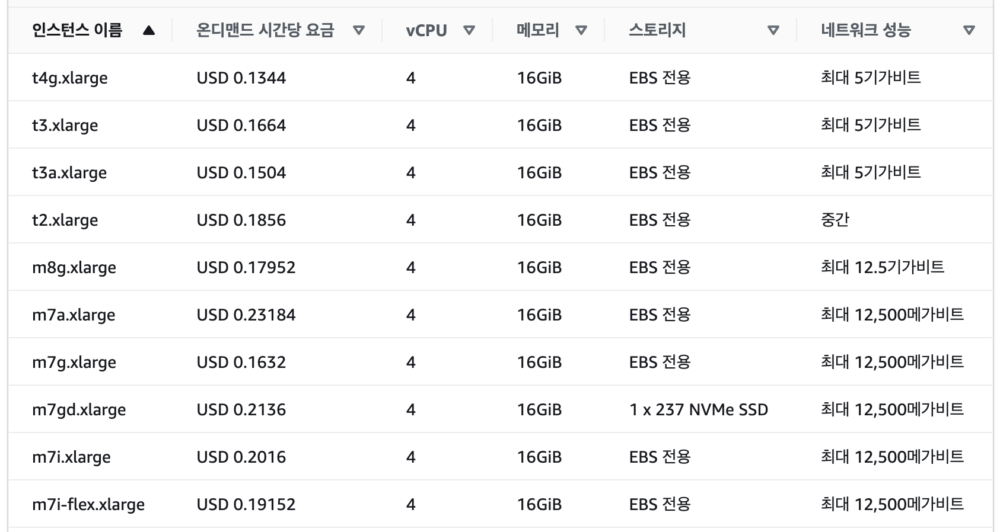
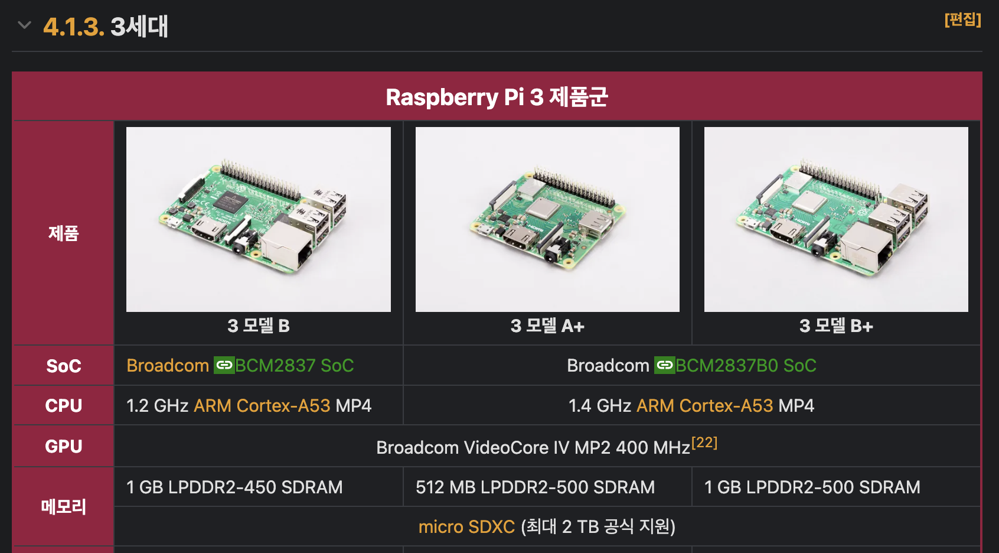
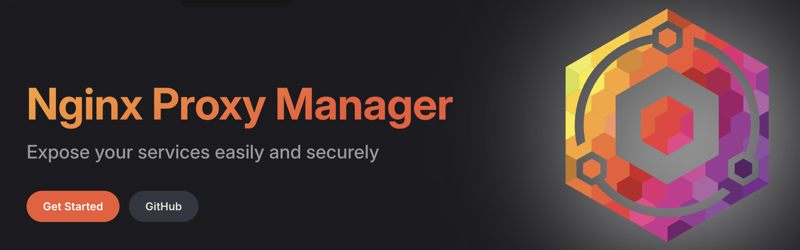
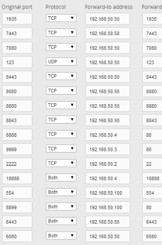
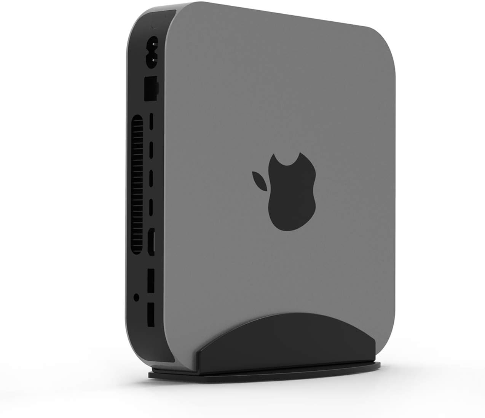
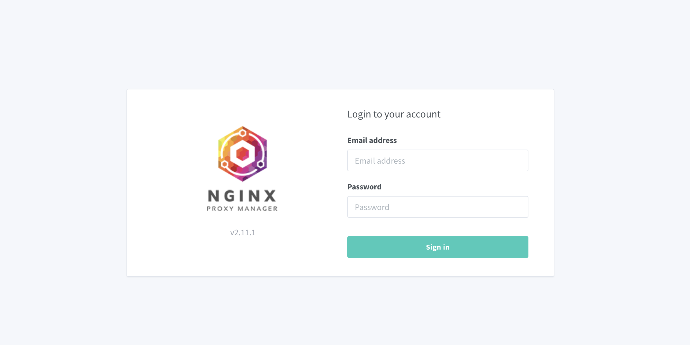
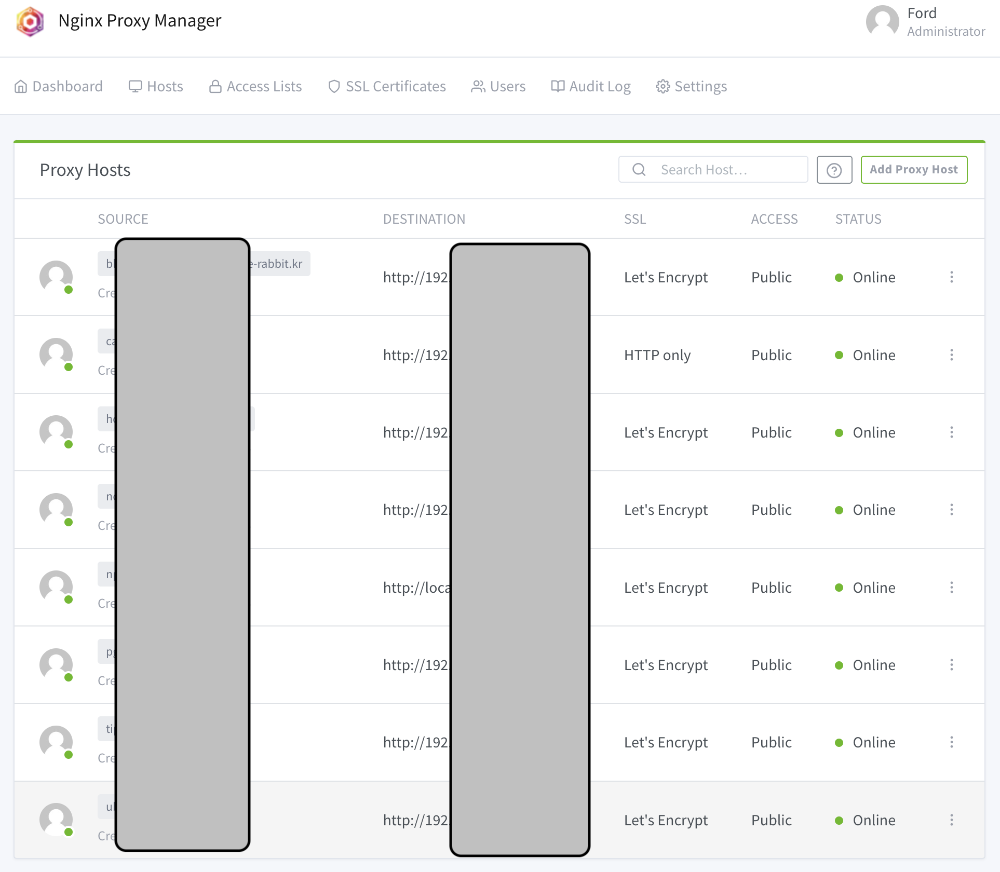
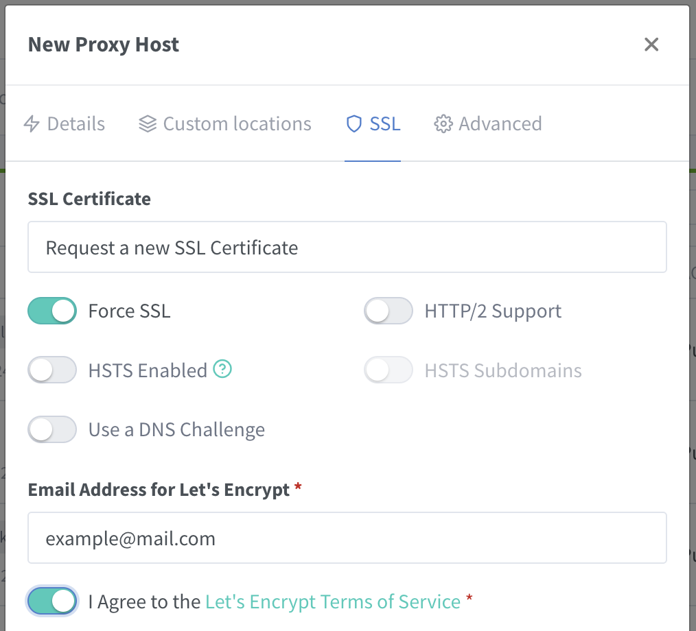
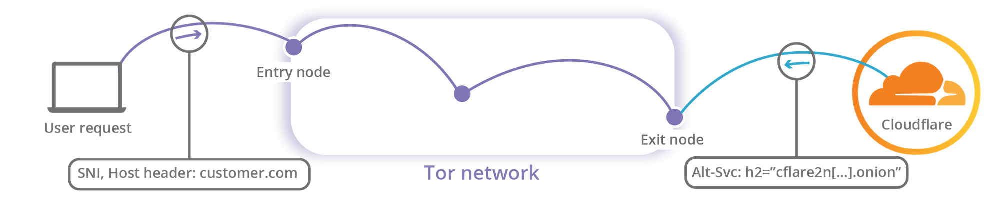
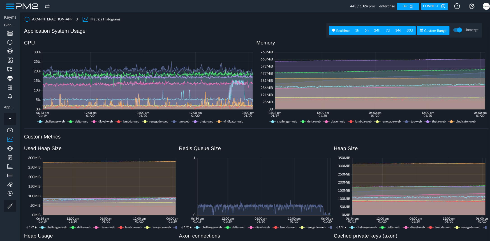

# 가장 저렴하게 개인 서버 운영하기: 홈 서버 운영기

저는 뭔가 대단하고 공개적인 서비스를 하고있는 건 아니지만, 개인적인 용도로 홈 서버를 운영하고 있습니다.  
최근까지 맥미니와 데스크탑 PC, 두 대를 사용중이었는데 최근 모종의 이유로 데스크탑이 사망했거든요. 이런 경험이 생긴김에 홈 서버 운영에 대해 글을 써보고자 합니다.

## 홈 서버 운영의 매력과 장단점

저는 개발을 막 시작했을 때 부터 홈 서버를 운영해보고 싶었습니다.  
마음 한켠에 근거없이 '모름지기 개발자라면 개인 서버정도는 있어야지!'하는 로망 측면도 있었지만, 실질적으로 개인 서버를 구축하면서 네트워크, 서버 운영, 보안 등 다양한 지식을 배울 수 있을 것이라는 생각도 있었고, 또 내가 언제든 필요한 기능을 추가할 수 있는 서버를 가지고있으면 좋겠다는 생각도 있었습니다.

실제로 학습쪽 측면에서도 실질적으로 도움이 많이 되었고, 현재도 지속적으로 홈 서버의 도움을 받고있습니다.  
예를 들면, 새로운 아이디어가 떠올랐을 때 바로 서버에 API를 하나 새로 뚫어서 빠르게 테스트 해 볼 수 있다는 점 등이 있습니다. 이게 없었다면 매번 인스턴스부터 새로 만들고 설정하고 하는 과정이 필요했을 텐데 말이죠.

### 홈 서버를 운영하는 장점

> 1. 개발자의 로망
> 2. 네트워크, 보안, 서버 운영 등 실질적인 지식을 배울 수 있음
> 3. 개인 포트폴리오로 사용하거나, 혹은 필요한 반복 작업 등 실질적인 도움을 받을 수 있음
> 4. 검증이 필요한 아이디어나 프로젝트를 빠르게 테스트 해 볼 수 있음

앞서 말씀드렸듯, 많은 개발자들이(물론 전부는 아니지만) 자신의 서비스라는 로망을 품고계시죠.
그런 측면에서 홈 서버를 운영하는 것은 개발자로서의 로망에 좀 더 가까워질 수 있는 좋은 방법이라고 생각합니다.  

또한, 학습과 자기계발의 차원에서도 홈 서버 운영은 큰 도움이 됩니다.  
최근 아무리 대부분의 서비스가 온프레미스를 떠나 클라우드로 이동하고 있다지만 그 개념적 기반은 여전히 온프레미스에 있습니다. 실제로 집에서 공유기를 관리하고, 방화벽과 서버를 운영하며 최소한의 네트워크 구성과 보안을 이해하는 것은 개발자로서 필수적인 소양이라고 생각합니다.  

더불어 실질적인 도움도 많이 받을 수 있습니다. 개인의 블로그나 포트폴리오 사이트, 혹은 자신만의 서비스를 운영하거나, 혹은 필요한 반복 작업을 자동화하거나, 혹은 검증이 필요한 아이디어나 프로젝트를 빠르게 테스트 해 볼 수 있습니다.  

예를 들어 지금처럼 서버가 항상 준비되어있지 않았던 상태에서는 어떤 아이디어가 떠오르더라도 바로 테스트해볼 수 없었습니다. 최소한의 테스트를 위해서라도 서버를 준비하는 과정이 필요했는데, 아무리 최근에 클라우드 접근성이 좋아졌다지만 그래도 외부에 공개하기위한 서버를 준비하는 과정은 꽤나 번거로운 일이죠.

하지만 홈 서버를 운영하고 있다면, 이런 과정이 필요없습니다. 언제든지 서버에 접근할 수 있고, 필요한 기능을 커밋하고 푸시만 하면 라이브 서버에서 바로 확인할 수 있습니다. 이런 점에서 홈 서버 운영은 개발자로서의 로망과 실질적인 도움을 동시에 줄 수 있는 좋은 방법이라고 생각합니다.

### 홈 서버를 운영하는 단점

> 1. 서버 운영에 대한 지식이 부족하다면, 해킹을 당할 수 있음
> 2. 예상만큼 저렴하지 않을 수 있음
> 3. 서버를 구성하고 관리하는데 시간과 자원이 소요됨
> 4. 통제 불가능한 장애요소가 있을 수 있음

하지만 어디에도 은탄환은 없듯, 홈 서버를 운영하는 것은 분명히 단점도 있습니다.  
이들중 일부는 꽤나 치명적일수도 있구요. 따라서 홈 서버를 운영하기 전에는 이러한 단점들을 충분히 고려하고 준비해야 합니다.

첫 번째로, 가장 큰 문제는 보안입니다. 내 서버를 외부에 노출시키는 것은 그만큼 해킹의 위험도 높아진다는 것을 의미합니다. 아마도 귀찮음과 더불어 홈 서버 운영을 망설이는 가장 큰 이유가 아닐까 싶습니다.  

하지만 이러한 문제는 (~~귀찮지만~~)충분한 보안 조치를 취하고, 지속적으로 관리하면서 해결할 수 있습니다.  
게다가 우리에게는 이를 편리하게 해주는 클라우드플레어와 같은 강력한 보안 서비스도 있고, 항상 집 구석에서 묵묵히 일하는 공유기도 사실 그 자체만으로도 꽤나 강력한 보안장치를 갖추고 있거든요.  
이러한 하나하나의 과정을 통해서 네트워크와 망분리, 방화벽 등의 기본적인 보안 지식을 배울 수도 있고 이는 개발자로서 꽤나 유용한 지식이 될 수 있습니다.

두 번째 단점은, 예상만큼 저렴하지 않을 수 있다는 것입니다.  
제가 홈서버를 사용하는 목적 중 하나는 바로 성능대비 매우 저렴한 가격이었습니다.  
만약 AWS의 인스턴스로 4core 16G 인스턴스를 사용한다면 아래와 같은 요금제를 사용하게 되는데요,



이를 만약 1년 내내 켜두고 사용한다면 가장 저렴한 `t4g.xlarge` 기준으로도 1년에 약 1200달러 정도의 비용이 청구됩니다. 한화로는 약 140만원 정도 되는데요, 이는 꽤나 큰 비용이죠.  
게다가 이는 단순히 인스턴스만 사용하는 비용이고, 데이터베이스나 스토리지, 네트워크 등을 사용한다면 이 비용은 더욱 높아질 수 있습니다.  
게다가 사용이 종료된 1년 이후에는 물리적으로 남는것이라고는 AWS에 지불한 영수증밖에 없습니다.

그에비해 지금 제가 사용하고있는 맥미니의 경우 16g/512g 모델을 약 60만원 가량에 구매했던것으로 기억하는데, 지금은 저렴한 제품은 40만원대로도 거래가 되는것 같네요.  
게다가 가성비를 위해 좀 더 저렴한 제품을 찾는다면 요즘 N100과 같은 미니PC가 워낙 저렴하게 잘 나오고 있어서, 이를 활용한다면 더욱 저렴하게 서버를 운영할 수 있습니다. 이 경우에는 신품도 약 10만원대로 구매할 수 있으니까요.

하지만 여기에는 몇가지 함정이 있습니다.  
첫 번째로, 개인이 AWS 서버를 365일 24시간 켜 둘 필요는 사실 거의 없습니다. 필요한 경우에만 켜서 사용하면 되니까요. 이또한 람다 등으로 자동화도 가능하구요. 게다가 포트폴리오와 같은 정적 페이지는 깃허브와 같은 무료 호스팅을 사용할 수도 있습니다.
두번째로, 이렇게 구매한 장비들의 내구도가 무한하지 않다는 문제가 있습니다. 실제로 도입부에 말씀드렸듯 얼마전에 제 데스크탑이 사망했는데, 이런 예상치 못한 문제들을 고려한다면 비용이 더욱 높아질 수 있습니다.

이런 부분을 고려한다면 홈 서버를 운영하는 것이 무조건적으로 저렴하다고 말할 수는 없겠죠.  

세 번째 단점은, 서버를 구성하고 관리하는데 시간과 자원이 소요된다는 것입니다.  
우리에게 중요한 자원은 돈만 있는게 아니죠. 시간과 노력, 퇴근하고 남은 체력도 굉장히 중요한 자원입니다.  
그런 의미에서 홈 서버를 운영한다는 것은 꽤나 많은 시간과 노력을 필요로 합니다.

특히 종종 발생하는 통신사와 연관된 제약사항이나 네트워크 문제, 또는 하드웨어 문제 등은 예상치 못한 이슈를 초래하고, 인해 더욱 많은 시간과 노력을 소모하게 될 수 있습니다.  
(~~게다가 종종 해결 할 수 없는 문제를 마주하게 되기도 합니다.~~)

네 번째 단점은, 통제 불가능한 장애요소가 있을 수 있다는 것입니다.  
이는 홈 서버를 운영하는데 있어서 가장 큰 단점이라고 생각합니다. 예를 들어 보자면, 전기가 나가거나, 공유기가 고장나거나, 혹은 인터넷이 끊기거나 하는 등의 문제가 있을 수 있습니다.  
이런 문제를 막겠다고 가정집에 UPS를 설치하거나, 통신사를 두개 사용할수는 없겠죠. 이런 문제는 언제든 발생할 수 있으며, 사실상 막을 방법이 없습니다.

제 사망한 데스크탑도 아마 건물 배선 공사로 인한 정전으로 인해 고장이 나지 않았을까 추정하고 있습니다. 전날 저녁부터 오피스텔 EPS실이 계속 열려있었거든요.  
참 억울한 일이지만 어쩔 도리가 없는 문제들입니다.  

이러한 장단점을 종합적으로 고려해 보시고, 홈 서버를 운영하실지 결정하시기 바랍니다.  
저같은 경우 아래에서 다룰 내용들을 바탕으로 이러한 단점들을 어찌어찌 극복하고 있는데요, 현 상태에서는 꽤나 만족스럽게 운영하고 있습니다.  
그러면 이제, 제가 사용했던 홈 서버의 변천사와, 겪었던 문제들을 소개해보겠습니다.

## 내 홈 서버의 변천사 - 라즈베리파이부터 맥미니까지

### 라즈베리파이 - 초기 경험



첫 시작은 호기심에 구매했던 라즈베리파이입니다.  
기억상 아마도 3세대였던것 같은데, 군대에 있을때 호기심에 장난감으로 구매했던 것으로 기억합니다.  
이래봬도 나름 컴퓨터인데 서랍 한구석에서 놀고있는것이 너무 아까워서, 공부삼아 간단한 포트폴리오 사이트나 블로그를 운영해보자는 생각으로 처음 제 개인 서버를 외부로 노출시켜보기 시작했습니다.

이때는 정말 아무것도 몰랐기에, 그냥 아파치를 설치하고 index.html을 만들어서 올려놓은것이 전부였습니다.  
SSL도 없이 http로 80포트만, 그것도 딱히 도메인도 없이 IP로만 접속할 수 있게 설정했었습니다. 정말 그냥 외부에서 내 서버에 접속할 수 있게만 해보자는 생각이었죠.

사실 이를 통해 유의미한 리소스를 서비스 하거나, 무언가 대단한 일을 할 수는 없었지만, 이러한 경험을 통해 서버를 운영하는 방법, 네트워크 설정, 포트포워딩, 방화벽 설정 등에 대해 조금씩 배워나갈 수 있었습니다.

지금와서 생각해보면 정말 무지한 시절이었지만, 그때의 경험은 지금의 저에게 큰 도움이 되었습니다.

그리고 또하나 부차적으로 느낀점은, 라즈베리파이를 관리하기가 생각보다 꽤나 귀찮다는 것이었습니다.  
크기가 작아서 관리가 편할거라 생각했는데, 결국 필요한 전원과 외부장치, 랜선과 직접적인 모니터링을 위한 모니터와 키보드, 마우스까지 생각하면 배보다 배꼽이 더 커졌습니다.  

아, 그리고 그 작은 크기와 노출된 기판은 결국 먼지와 습기에 취약하다는 것도 알게되었습니다.  
급한대로 케이스를 구매했는데, 이게 또 (~~꼴에~~) 생각보다 발열이 꽤 있더라구요.  
그래서 결국 라즈베리파이는 그냥 장난감으로 놀다가, 결국 발열로 인한 준 사망으로 끝을 맞이하게 되었습니다.

### 데스크탑 서버 - 성능 개선

라즈베리파이로 조금 경험을 쌓고 나니, 이제 개인용 서버를 외부로 노출시키는 것은 생각보다 어렵지 않게 할 수 있게 되었습니다.  

마침 그 때 즈음, 저는 한창 데이터 분석에 빠져있었는데, 매번 코랩에 의존하기에는 불편함을 느끼고 있었습니다.  
아마 기억 상 그때쯔음 코랩의 요금제 비용도 올랐던 것으로 기억하구요. 그래서 이번에는 데스크탑을 활용해보기로 결정했습니다. 그 때 당시 나름 괜찮은 GPU였던 3060을 구할 수 있었거든요.

이때부터는 이제 보안에 대한 고민도 좀 더 하게되어 드디어 HTTPS도 적용하기 시작했습니다.  
이렇게 한동안 데스크탑으로 주피터를 열어두고 학습용도나 일종의 NAS 처럼도 꽤나 잘 사용했습니다.  

라즈베리파이보다 사양도 훨씬 넉넉했기에 DB도 설치하고, 더 많은 서비스를 설치해서 서빙 할 수 있었습니다.  
컴퓨팅 파워가 차고넘치니 필요한 경우 XRDP등의 툴을 사용해서 원격으로 접속해서 모니터링을 할 수 있게 되었는데요, 이게 정말 최고였습니다.  

물론 초기 세팅에는 당연히 모니터와 키보드, 마우스가 필요했지만, 이후에는 이를 제거하고 원격으로 접속해서 사용 할 수 있다는게 생각보다 정말 삶의 질이 달라집니다. 아무리 CLI가 익숙해져도 GUI는 GUI인것이죠.  

특히 컴퓨터 비전 관련 프로젝트시에 대용량 이미지, 영상 데이터를 다룰 때는 GUI가 필수적이었습니다. 매번 다운받아서 확인하는것도 시간 낭비가 심했거든요.

그리고 이 장점을 통해, 이전에 말씀드린 그 귀찮은 포트포워딩을 해결할 수 있는 방법도 생겼습니다.  



그건 바로 전 회사 동료분이 추천해준 [Nginx Proxy Manager(NPM)](https://nginxproxymanager.com/)입니다. 이는 아래에서 자세히 다루겠습니다.

하지만 이런 데스크탑도 여러가지 문제가 있습니다.  


라즈베리파이의 정리되지 않은 난잡함과 발열 문제는 데스크탑으로 넘어가면서 어느정도 해결이 되었지만, 그 대신 전력 소모와 소음,(잘못 구매한 쿨러로 인한 **빛 공해**까지) 그리고 공간 문제가 생겼습니다.  


먼지에 대한 문제도 여전했구요.  

이게 사소한 문제처럼 보일 수 있지만, 이는 결국 서버를 운영하는데 있어서 꽤나 큰 문제였습니다.

이전에는 겪지 못한 새로운 문제도 있었습니다.  
라즈베리는 워낙 사양이 낮아 포트 한두개만 사용했지만, 데스크탑의 경우에는 DB등도 활용하면서 더 많은 포트를 사용하게 되었습니다.  

  
참고를 위한 이미지입니다.

이게 문제가 되는 부분은 바로 포트포워딩과 방화벽 설정이었는데요, 당시에 다른 방법을 모르던 저는 이를 공유기에서 설정해야 한다고 생각했고 하나하나의 포트를 일일이 설정해주는 작업은 꽤나 번거로웠습니다. 왜 공유기를 매번 껐다 켜야하는 건지..  
그리고 도메인도 별도로 사용하지 않았기에, 외부에서 사용하려면 포트 번호까지 직접 입력해야했죠.  
다행히 사용자가 저와 몇몇 친구들 뿐이라 그냥저냥 사용했지만 지금 생각해보면 참 미련한 짓이었죠.  

### 맥미니 - 현재까지 최선의 선택



이렇게 돌고 돌아 현재는 맥미니를 사용하고 있습니다.  
적당히 작아서 선반 한컨에 올려둘 수 있고, 스탠드로 세워두면 공간도 아낄 수 있습니다.  
게다가 패키징도 깔끔하고 크게 먼지가 쌓이지 않아서 관리하기도 편한데다, 거의 모든 무선 기기와 호환되어서 더욱 편리하게 사용할 수 있죠.
M1칩이라서 전력소모도 적고, 컴퓨팅 파워도 넘치는데 불구하고 소음도 거의 없어서 무엇보다도 가장 만족스러운 서버입니다.

게다가 맥 자체가 자주 재부팅이 필요없어서, 서버를 계속 켜두고 사용할 수 있어서 윈도우에 비해 훨씬 안정적이고 편리하다고 느껴졌습니다.

IOS 생태계에 살고있는 저같은 사람에게는 맥미니를 사용하는 것이 정말 최고의 선택이지 않을까 싶습니다.

유일한 단점은 종종 집에서 통화할 때 이친구가 전화를 받아버리는 경우가 있는데, 이것도 뭐 크게 문제가 되지는 않습니다.

굳이 주의사항을 꼽자면 꼭 잠자기 설정을 해제해주셔야 한다는것? 정도가 있겠네요. 그 외에는 정말 완벽하다고 생각합니다.

## 부록 - NPM

이전에 간단하게만 다루었던 NPM에 대해 좀 더 소개해드리고자 합니다.  

NPM은 Nginx를 기반으로 오픈소스 프록시 관리자를 제공하는 툴입니다.

데스크탑부터는 어차피 컴퓨팅 자원이 빵빵하니까, 이제는 NPM을 사용해서 프록시 서버를 구축하고, 이를 통해 다양한 서비스를 운영할 수 있었습니다.  



이처럼 자체적인 웹 인터페이스를 제공하며, 이를 통해 간단하게 프록시 서버를 설정할 수 있습니다.  
계정 기반 관리자 패널을 제공하므로, 필요시 이 자체를 공개해두고 외부에서 접속할 수 있게 설정할 수도 있습니다.



NPM만 80포트로 연결해놓으면, 이후에는 NPM에서 각 서비스에 대한 포트포워딩을 설정할 수 있습니다.  
사실상 내부에 매우 간편하고 파워풀한 가상의 공유기를 하나 더 둔것과 같은 효과를 얻을 수 있죠.  

// 이미지 사이즈 조정 300x300으로


게다가 위처럼 SSL도 클릭 한두번으로 쉽게 적용할 수 있습니다.

도커를 사용하신다면 이런 툴을 아래와 같이 정말 간단하게 사용할 수 있습니다.

```dockerfile
# docker-compose.yml
services:
  app:
    image: 'jc21/nginx-proxy-manager:latest'
    restart: unless-stopped
    ports:
      - '80:80'
      - '81:81'
      - '443:443'
    volumes:
      - ./data:/data
      - ./letsencrypt:/etc/letsencrypt
```

그리고 `docker-compose up -d` 명령어로 실행하면 됩니다.
DB가 필요하긴 하지만, 복잡한 데이터를 다룰 것도 아니니 sqlite를 사용하면 되기에 굳이 별도의 DB를 설치할 필요도 없습니다.

## 부록 - 기타 소소한 팁

### 기본포트 사용하지 않기

이건 정말 기본적인 것이지만, 기본 포트를 사용하지 않는 것은 정말 중요합니다.
최소한 외부 접속을 위한 ssh 포트는 꼭 변경하시길 바랍니다.

### 클라우드플레어로 보안 강화하기



저도 언제인지는 정확히 모르겠는데, 어느순간 개인의 IP가 노출되는 것은 그리 좋은 일이 아니라는 사실을 배웠습니다.  
그래서 이를 해결하기 위해 클라우드플레어를 사용하기 시작했습니다.

클라우드플레어는 DNS 서비스를 제공하는 회사인데요, 이를 통해 DNS 서비스를 제공받으면서 동시에 CDN, 방화벽, DDoS 방어, SSL 등의 서비스를 무료로 제공받을 수 있습니다.  
가비아등 다른 서비스에서 구매한 도메인이라도 클라우드플레어로 연결하면 이러한 서비스를 무료로 사용할 수 있습니다.  
특히 다른것보다도 어니언 라우팅을 통해 IP를 숨길 수 있어서, 개인의 IP를 노출시키지 않고 서버를 운영할 수 있습니다.

### 레이트 리미트 설정하기

홈 서버도 나름 온프레미스 서버이기에, 스케일링을 할 수 없다는 단점이 있습니다. 따라서 레이트 리미트를 설정해주는 것이 좋습니다.

이를 통해 서버에 부하가 걸리는 것을 방지할 수 있고, 또한 DDoS 공격 등으로부터 서버를 보호할 수 있습니다.

### 파이프라인 구축하기 - Github Actions

홈 서버는 AWS나 Azure와 같은 클라우드 서비스와는 다르게, 자동화된 파이프라인을 제공받기 어렵습니다.  

이러한 점을 해결하기 위해 저는 Github Actions를 사용하고 있습니다.  
그중에서도 self-hosted runner를 사용하면, 홈 서버에서도 좀 더 효율적으로 파이프라인을 구축할 수 있습니다.

### pm2.io로 모니터링하기



프로세스 관리자인 pm2를 사용하고 있다면, [pm2.io](https://pm2.io/)를 사용하면 좀 더 간편하게 서버를 외부에서 모니터링하고, 관리 할 수 있습니다

## 마치며

이렇게 제가 홈 서버를 약 4년간 운영하면서 겪었던 변천사를 소개해보았습니다.  

대단한 서비스를 하는게 아니라도, 이렇게 홈 서버를 운영하면서 겪은 크고작은 삽질과 경험들은 저에게 큰 도움이 되었고 현재까지도 아이디어를 빠르게 실현하고 테스트 할 수 있는 좋은 환경을 제공해주고 있습니다.  

다른 분들께서 이런 불필요한(?) 시행착오를 최소화하며 바로 좋은 서비스를 운영하실 수 있게, 조금이나마 도움이 되었으면 좋겠습니다.
