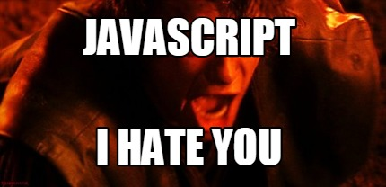
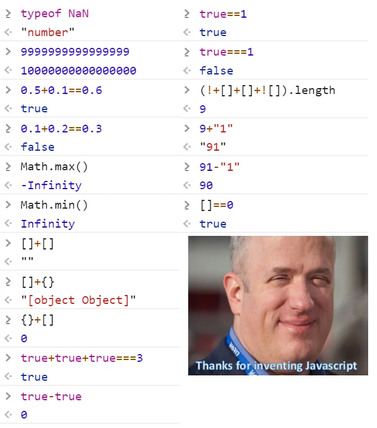

# Javascript와 우리네 인생살이

안녕하세요!  
오늘은 또다시 `Javascript`에 대해 이야기를 해볼까 합니다. 그중에서도 지금의 제가 `JS`를 좋아하게 된 이유에 대해 이야기해보려고 하는데요, 재미있게 읽어주시면 좋겠습니다.

## Javascript의 첫인상? 난해하고 화가난다!

제가 프로그래밍을 처음 시작할때 사용했던 언어는 `Python`이었습니다.  
단순하고 빠르게 무언가를 만들어낼 수 있는 정말 생산적인 언어죠. "하나의 올바른 방법"이라는 철학은 지금도 마음에 들고, 이때문에 현재까지도 좋아하는 언어 중 하나입니다.  

그런데, 당시 정말 싫어했던 언어가 있었습니다. 바로 `Javascript`입니다.



왜인지를 물어보신다면, 꽤나 여러가지 이유가 있습니다.  

예를 들어, `JS`는 위에서 제가 좋아한다고 언급한 철학인 "하나의 올바른 방법"에 정면으로 반하는 언어이죠.  
(장점이기도 한)멀티패러다임 언어이면서, 함수 하나를 선언하려고 해도 수도 없이 많은 방법이 존재합니다.  

처음 배우는 입장에서는 매번 '그래서 이중에 뭘 쓰라는거야?' 라는 생각이 들었죠.  

그리고 또 무슨 버전이 그렇게나 많은지, `CommonJS`는 뭐고, `ES6`, `ES2015`는 또 뭐고... 몇 버전 부터는 어떤게 지원되고 어떤게 안되고, 이런것도 정말 싫었습니다.  

또 하나의 큰 이유로 들 수 있는 것은 개발자라면 한번쯤 보셨을 아래와 같은 밈때문입니다.



```js
// 그 유명한 바나나 문제
('b'+'a'+ +'a'+'a').toLowerCase() // banana
```

~~뭐, 이건 지금 봐도 조금 어이없긴 하네요..ㅎ~~  

하지만 당시에는 정말 이해도 안되고 화까지 났었습니다. 이렇게까지 신뢰도가 떨어지는 언어가 있을까? 라는 생각이 들었죠.  
**'대체 무슨 생각으로 언어를 이렇게 설계한 거지?', '쓰는 사람들에 대한 배려가 전혀 없는거 아니야?'** 라는 생각도 수도없이 들었습니다.

## 조금씩 알아가다 보니, Javascript에서 우리 인생이 보인다.

처음에는 단순히 '이상하고 대충 만든 언어'로만 보였던 `JS`에 대해 조금씩 알아가면서, 점차 그 안의 재미있는 사실들을 하나하나 알게 되었습니다.  

그리고 그런 사실들을 하나하나 생각하다보니, 마치 우리네 인생살이와도 비슷하다는 생각이 들었습니다.  
그리고 지금은 `JS`라는 언어가 꽤나 '사람냄새'가 나는 인간적인 언어라고 생각하게 되었고 가장 즐겨쓰고 좋아하는 언어 중 하나가 되었죠.~~(냄새나는 언어)~~

### 우리는 종종 돌이킬 수 없는 실수를 한다. 그래도 어떻게든 살아가잖아?


저도 그렇고 여러분도 그렇고, 누구나 그렇듯 우리는 살아가면서 수도없이 많은 실수를 하게 됩니다.  
어떤 실수는 금방 깨닫고 만회할 수 있지만 어떤 실수는 그렇게 쉽게 만회할 수 없는 경우도 있죠.  

`JS`도 그 탄생부터 수많은 실수가 있었고 이는 아직까지도 영향을 미치고 있습니다.

```js
[] + []       // ""
[] + {}       // "[object Object]"
{} + []       // 0
{} + {}       // NaN
false + []    // "false"(string)
false - []    // 0
"123" + 1     // "1231"
"123" - 1     // 122
"123" - "abc" // NaN
typeof null   // object
0.1 + 0.2     // 0.30000000000000004
```

하지만 수많은 개발자들이 이러한 돌이킬 수 없는 실수와 함께 살아가는 법을 배워가면서, 이러한 실수들을 어떻게든 만회하고자 노력해왔습니다.  

```js
// 안전한 형변환과 연산을 위한 방법들
Number(SOME_STRING) || 0

function safeAdd(a, b) {
    return (a * 100 + b * 100) / 100;
}
```

또다른 사례로 이런 것도 있을수 있겠네요.

```js
var x = 1;
if (true) {
  var x = 2;
}
console.log(x); // 2

let y = 1;
if (true) {
  let y = 2;
}
console.log(y); // 1
```

초기 스펙인 `var`는 여러 가지 문제를 야기시켰고, 이를 해결하기 위해 `let`과 `const`가 등장했죠. 하지만 여전히 `var`는 호환성을 위해 계속 남아있습니다.  

이런 문제에도 불구하고 `JS`는 항상 프로그래밍 언어 세계 사용률 최상위권에 머물고있죠.

우리도 살면서 뭔가 사고를 쳤을 때, 그것을 없던 일로 만들수는 없기는 하죠?  
하지만 그렇다고해서 그 실수로 인해 여태까지 이뤄온 모든게 끝나는것도 아니죠.
그저 거기서 뭔가를 배우고 다음부터는 그런 일을 막을 수 있도록 노력하며 다시 조금씩 더 발전적인 방향으로 나아가면 되는 것이죠.


이처럼 우리 인생살이와 `JS`는 모두 완벽하지 않은 선택들과 돌이킬 수 없는 실수들이 난무하지만, 그럼에도 불구하고 어떻게든 함께 살아가고자 노력해서 어떻게들 다들 나름의 인생을 잘 살아가고 있습니다.

적어도 아직까지는 꽤나 성공적으로 살아가고 있는 것 같지 않나요?

### 우리는 누구나 성장하고자 노력한다. 그리고 조금씩 성장..하지?

여기서는 바로 사례를 보는게 나을 것 같네요.

```js
// ES5에서 클래스를 사용하는 방법
function Person(name, age) {
    this.name = name;
    this.age = age;
}
Person.prototype.sayHello = function() {
    console.log(`Hello, my name is ${this.name}, I'm ${this.age} years old.`);
}
```

ES5 이전에는 클래스를 사용하기 위해 위와 같이 함수와 프로토타입을 사용해야 했습니다.  
익숙하신 분들이야 문제가 없겠지만, 다른 언어에서 클래스를 사용하던 사람들에게는 조금 생소하고 어려울 수 있습니다.

```js
// ES6에서 클래스를 사용하는 방법
class Person {
    constructor(name, age) {
        this.name = name;
        this.age = age;
    }
    sayHello() {
        console.log(`Hello, my name is ${this.name}, I'm ${this.age} years old.`);
    }
}
```

누군가는 이런 클래스를 단순한 문법적 설탕일 뿐이고 실상은 진정한 클래스가 아니라고 할 수 있습니다. 하지만, 사용하는 입장에서는 꽤나 큰 변화이고 발전이라고 생각합니다.  

이를 통해 좀 더 명확하게 `OOP`를 사용할 수 있게 되었고, 이를 통해 더 많은 사람들이 자신의 취향대로 `JS`를 사용할 수 있게 되었습니다.

그리고 이런 변화는 아직까지도 이어지고 있습니다.

```js
const data = [1, 2, 3, 4, 5];
const grouped = Object.groupBy(data, x => (x % 2 === 0 ? 'even' : 'odd'));
console.log(grouped); // { odd: [1, 3, 5], even: [2, 4] }
```

`ES2024`에서는 위와같이 함수형 프로그래밍을 위한 `Object.groupBy`와 같은 메소드가 추가되기도 했죠.

이렇게 완벽하진 않더라도 조금씩 변화하면서 성장하는 것도 우리가 사는 모습과 비슷하지 않나요?

### 우리는 언제나 주변 환경과 타협하고 적응하며 살아간다.

과거에 `JS`에서는 비교 연산자로 `==`만을 사용했었습니다. `===`는 ES5에서 등장했죠.  

```js
0 == false;    // true
0 === false;   // false
" " == false;  // true
" " === false; // false
```

왜 처음부터 `===`를 사용하지 않았을까요?  
아니 애초에 왜 비교를 하면서 형변환을 했을까요?  

`JS`는 원래 웹을 위한 언어로 탄생했기 때문에, 웹에서 사용되는 데이터들이 모두 문자열로 변환되어 전달되기 때문입니다.  
게다가 초기 웹 환경은 대부분 텍스트에 기반한 간단한 정적 페이지들이었기 때문에 `JS`로 뭔가를 할 일도 그리 많지 않았습니다.  
그런 점에서는 오히려 자동으로 문자열 형변환을 해주는 `==`가 더 편리했던 것이죠.  

다만 웹에서 사용되는 데이터가 점점 복잡해지고 `JS`로 해야하는 일이 많아지면서, `==`의 문제점이 드러나게 되었습니다.  

문제가 확인되고 `JS`는 `===`를 스펙에 추가하여 이러한 소요를 해결하였습니다.

## 마치며: 적당히 대충 사는것도 나쁘지 않은것 같다.

이렇게 저는 `JS`가 우리 인생과 닮았다는 생각을 갖게 되었습니다.  

열심히 살아보려고 노력은 하지만 어쩔 수 없이 실수도 하고, 때로는 어려운 선택을 해야하고.. 특히 한국 사람들은 다들 하루하루 힘들고 일상을 살아가고 있죠.  


그치만 너무 완벽하게 살려고 하면 오히려 더 힘들고 피곤해지는 것 같습니다.  
가끔은 `JS`처럼 어깨와 목에 힘 빼고, 적당히 흘러흘러 살아가는 것도 나쁘지 않은 것 같다는 생각이 듭니다.
