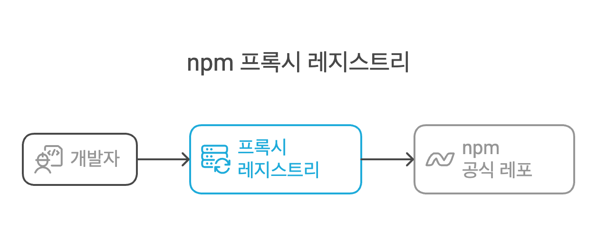
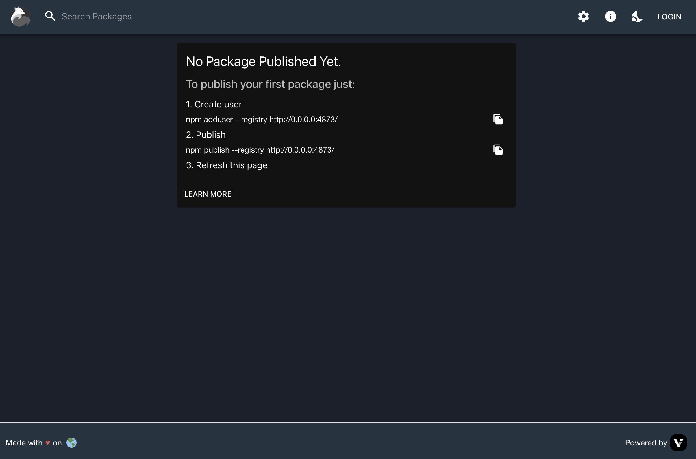

# Verdaccio로 사내 프록시 레지스트리 구축하기 - 커스텀 모듈 사용을 위한 프록시 레지스트리 구축

## 0. 발단

현재 업무에서 사용하는 라이브러리 중, 몇몇 라이브러리는 도메인에 맞도록 혹은 성능 개선을 위해 커스텀해서 사용중인데요.   
이러한 모듈이 점차 많아지면서 전체 node_modules를 관리하기가 어려워졌습니다.  

이 문제를 해결하기 위해 아래와 같은 방법들을 고려해 보았습니다.

### 고려한 방법들

1. 압축파일로 관리한다.
2. GitHub에 올려 Git Dependencies로 관리한다.
3. 프라이빗 프록시 레지스트리를 구축한다.

이 중 마지막 세번째 방법을 선택했습니다.  
이유는 아래와 같습니다.

1. 압축파일로 관리하는 경우
   1. 모듈을 추가하거나 삭제할 때마다 압축파일을 수정해야 하는 번거로움이 있습니다.  
   2. 특히 수정이 가해질수록 버전 관리가 어렵고, '내가 설치한 모듈이 정확히 어느 버전인지' 파악하기 어렵습니다.  
2. GitHub에 올려 Git Dependencies로 관리하는 경우
   1. 버전 관리가 상대적으로 명확하지만, 지속적으로 레포지토리와 브랜치를 관리해야 하는 추가 작업이 발생합니다.
   2. 무엇보다 프라이빗 레포에서 패키지를 설치하기 위해 인증 및 권한 관리 등 별도의 설정이 필요합니다.  
3. 프라이빗 프록시 레지스트리를 구축하는 경우
   1. 프록시 서버에 대한 관리소요가 발생하긴 하지만, 한번 구축된 후에는 복잡한 관리 없이 패키지를 간편하게 배포할 수 있습니다.
   2. 기존에 사용하던 npm과 완전히 동일한 방식으로 사용하기에, 다른 개발자들이 쉽게 적응할 수 있습니다.
   3. 또한 사내망을 사용하므로, 프록시 서버에 대한 별도의 인증 및 권한 관리가 필요하지 않습니다.
   4. 더불어 각종 모듈에 대한 캐싱 효과도 있습니다.

### 최종 선택 및 기대 효과

이러한 이유로 세 번째 방법인 **프라이빗 프록시 레지스트리 구축(Verdaccio)**을 선택했습니다.  

이 선택을 통해 다음과 같은 기대 효과를 얻고자 합니다.  

1. 모듈 관리를 단순화하여 개발자의 생산성 향상
2. 명확한 버전 관리와 손쉬운 배포 환경 구축
3. npm 생태계와 동일한 방식으로 운영하여 협업 과정에서의 혼란 최소화
4. 모듈 캐싱을 통한 개발자 작업 효율 향상

이 글에서는 Verdaccio를 사용하여 사내 프록시 레지스트리를 구축한 과정과 경험을 공유하고자 합니다.  

## 1. 프록시 레지스트리

### 1.1 프록시 레지스트리란?



npm의 프록시 레지스트리는 우리가 흔히 사용하는 npm의 공식 레포와 개발자 사이에 위치하는 프록시입니다.  
개발자의 패키지의 다운로드 요청을 먼저 받아 특정한 처리를 한 후, 필요시 공식 레포에 요청을 전달하는 방식으로 동작합니다.  

이러한 프록시는 보통 아래와 같은 목적으로 사용됩니다.

1. 프라이빗 패키지: 사내에서만 비공개로 사용하는 패키지를 관리하기 위해 사용됩니다.
2. 캐싱: 자주 사용되는 패키지를 로컬에 저장하여 빠른 다운로드를 위해 사용됩니다.
3. 가용성: 공식 레포가 다운되거나 네트워크 장애가 발생할 경우, 프록시 레지스트리를 통해 다운로드를 받을 수 있습니다.

## 2. Verdaccio

### 2.1 Verdaccio란?

Verdaccio는 Node.js로 작성된 경량 프록시 레지스트리입니다.  
물론 오픈소스이고, 몇 개의 파일만으로도 간단히 설정하고 빠른 배포가 가능합니다.  

### 2.2 Verdaccio의 주요 특징

1. 오픈소스: 무료로 사용 가능
2. 간단한 설정: config.yaml 파일 하나로 쉽게 설정 가능
3. 웹 UI 제공: 배포 후 웹 브라우저에서 쉽게 사용 가능
4. 도커 이미지 제공: 도커 이미지를 통해 쉽게 배포 가능

### 2.3 설치 및 기본설정

저는 개인적으로 로컬에 뭔가를 설치하는 것을 굉장히 꺼리는데요.  
그래서 어지간한 것들은 도커 이미지를 통해 배포하는 것을 좋아합니다. 이래야 나중에 탈도 없고 제거도 깨끗하게 되니까요.  
그중에서도 특히 도커 컴포즈를 통해 쉽게 배포하는 것을 선호합니다. 컴포즈 yaml만으로도 충분한 문서화가 가능하기 때문입니다.  

```yaml
version: '3.8'

services:
  verdaccio:
    image: verdaccio/verdaccio
    container_name: verdaccio
    ports:
      - "4873:4873"
    volumes:
      - ./storage:/verdaccio/storage
      - ./conf:/verdaccio/conf
      - ./plugins:/verdaccio/plugins
    environment:
      - VERDACCIO_PORT=4873
    restart: unless-stopped
```

위 설정은 도커 컴포즈를 통해 verdaccio 컨테이너를 배포하기 위한 설정입니다.  
보시다시피 3개의 볼륨을 사용하는데요, 이를 위해 아래와 같은 디렉토리 구조가 필요합니다.

```bash
.
├── conf/
│   ├── config.yaml
│   └── htpasswd
├── docker-compose.yaml
├── storage/
└── plugins/
```

여기서 우리가 작성해줄 파일은 오직 `conf/config.yaml` 파일 뿐입니다.  
(~~당연히 docker-compose.yaml 파일은 있어야겠죠..?~~)  
이 파일은 `verdaccio` 컨테이너의 설정 파일이며, 아래와 같은 내용을 포함합니다.

```yaml
# 저장소 경로
storage: ./storage

# 플러그인 경로
plugins:
  - ./plugins/

# 인증 설정
auth:
  htpasswd:
    file: ./htpasswd
    max_users: 1000

# 업스트림 레지스트리 설정
uplinks:
  npmjs:
    url: https://registry.npmjs.org/
    timeout: 30s # 요청 타임아웃
    max_fails: 5 # 최대 실패 횟수
    cache: true # 캐시 사용 여부


# 웹 UI 관련 설정
web:
  title: "사내 패키지 레지스트리"
  logo: logo.png
  primary_color: "#4b5e40"
  darkMode: true
  enable_theme_selector: true

# 패키지 설정
packages:
  '@SOME_PRIVATE/*':
    access: $all
    publish: $authenticated
    proxy: false # npm에 등록되지 않은 경우 false로 설정

  '**':
    access: $all
    publish: $authenticated
    proxy: npmjs
```

위 파일들을 생성하고 나면 아래와 같은 명령어로 배포할 수 있습니다.

```bash
docker-compose up -d
```

이렇게 하면 도커 컴포즈를 통해 verdaccio 컨테이너가 배포됩니다.  
이제 웹 브라우저에서 `http://localhost:4873`으로 접속하면 아래와 같이 우리의 프록시 레지스트리를 확인할 수 있습니다.  



이제 우리는 이 프록시 레지스트리를 사용하여 패키지를 관리할 수 있게 되었습니다.  

이후에는 사용자를 등록하고, 패키지를 배포하면 됩니다.  

## 3. 사용자 관리

사용자 관리는 아래와 같은 명령어로 진행할 수 있습니다.

```bash
npm adduser --registry http://localhost:4873
```

이렇게 하면 사용자를 등록할 수 있습니다.  

이후에는 사용자를 등록하고, 패키지를 배포하면 됩니다.  

```bash
npm publish --registry http://localhost:4873
```

이렇게 하면 패키지를 배포할 수 있습니다.  

