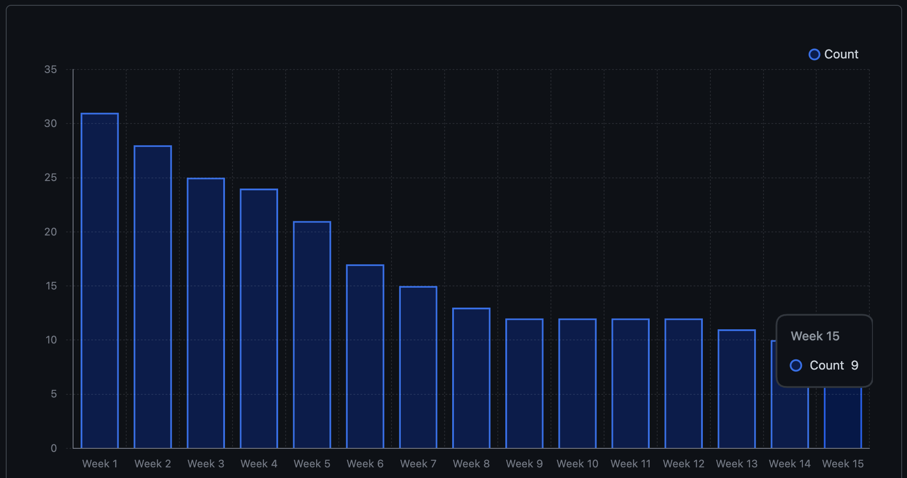
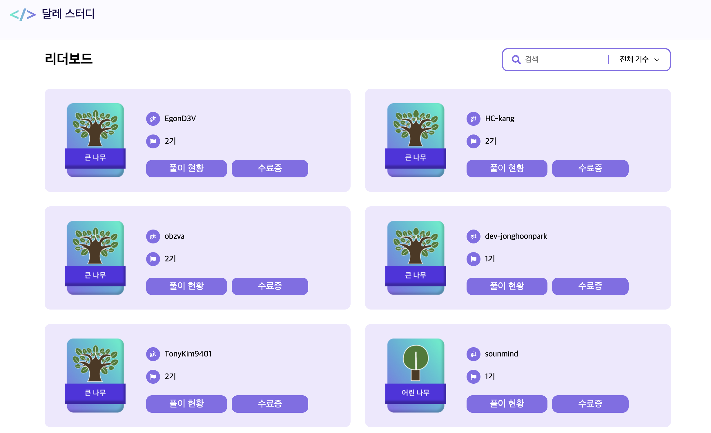

# LeetCode Blind 75 스터디 후기

## 1. 스터디 소개

- **스터디명**: 리트코드 스터디(leetcode-study)
  - 🛫 해외취업을 위한 오픈소스 기반 알고리즘 스터디
- **기간**: 2024.08.11 ~ 2024.11.17 / 15주
- **인원**: 50명 / 9명(시작 / 완료)
- **목표**: LeetCode Blind 75 문제 풀이 및 상호 피드백
- **방식**: 매주 5문제씩 풀이 후 코드 리뷰 및 피드백
- **언어**: 자율(JS, Python, Java, C++, ...)
- **특징**
  - 문제 유형과 난이도에 따른 주차별 큐레이션
  - 열려있는 상호 리뷰와 화상미팅을 통한 모의면접/**피드백**
  - 다른 언어 사용자와의 코드 리뷰 및 피드백
  - 영미권 등 해외 취업을 위한 정보 공유 등
- **상세**
  - 위키: [리트코드 스터디 위키](https://github.com/DaleStudy/leetcode-study/wiki)
  - 공지: [리트코드 스터디 공지](https://github.com/DaleStudy/leetcode-study/discussions)
  - 리포지토리: [리트코드 스터디 리포지토리](https://github.com/DaleStudy/leetcode-study)

## 2. 스터디 후기

벌써 거의 4개월 전이네요. 아마 8월 초 쯤이었던 것 같습니다.
이직한 회사에서도 어느정도 적응도 해가고, 이전부터 미뤄왔던 알고리즘 공부를 시작하는 찰나에 링크드인에서 이 스터디를 보게 되었습니다.

마침 당시에 또 요즘 관심있게 보던 리트코드의 문제 풀이를 위한 스터디이기도 했고, 평소 유튜브나 블로그를 통해 자주 접했던 '달레'님께서 직접 운영하시는 것이라 더 관심이 가기도 했죠.
게다가 당장은 아니지만, '언젠가 해외 취업도 해보고싶다'라는 생각도 있었기에 더 끌렸던 것 같습니다.

그렇게 갑작스럽게 스터디를 신청하고, 결국 8월 11일부터 약 4개월간 이 스터디에 참여하게 되었습니다.

### 2.1. 스터디의 가장 큰 매력

제가 느낀 이 스터디의 가장 큰 매력은 크게 세 가지 정도로 꼽을 수 있을 것 같습니다.

#### 2.1.1. 자율적인 꾸준함

가장 먼저 첫번째로 꼽고싶은 장점은, 바로 **'자율적인 꾸준함'을 기를 수 있다는 점**입니다.

여타 스터디와는 다르게, 이 스터디는 강제력이 거의 없습니다. 주차별로 풀어야 할 문제와, 서로의 풀이에 대한 리뷰를 해야한다는 큰 틀만 제공되고, 나머지는 모두 자율적으로 진행됩니다.  
시간이 부족하다면 해당 주차에 있는 5문제를 모두 풀 필요도 없습니다. 그리고 사실, 다른 사람의 코드를 리뷰하는것도 완전한 강제는 아닙니다.(이 부분은 강하게 권장드리고싶은 부분이긴 하지만요)

이런 특징으로 인해, ~~뭔가 강제로 하라고 하면 하기 싫어지는~~ 강제성이 없어지고, 자연스럽게 자신의 페이스에 맞게 계속해서 공부하는 습관을 이어 갈 수 있는 꾸준함을 기를 수 있었습니다.

#### 2.1.2. 체계적인 커리큘럼

두번째 장점은, 바로 **체계적인 커리큘럼**이었습니다.  
모든 문제를 직접 풀고 그 풀이법과 최적화 과정까지 블로그에 정리해두신 달레님께서 직접 큐레이션을 해주신 과정이기 때문에, 코딩 테스트 준비과정에서 자주 접하는 DFS/BFS, DP, 투포인터 등의 주요 알고리즘을 점진적으로 익힐 수 있었습니다.  
또한 만약 스스로 풀지 못한 문제가 있더라도 [알고달레](https://www.algodale.com/)에서 제공되는 이해하기 쉽게 정리된 문제 풀이를 참고할 수 있었기 때문에 더욱 효율적으로 공부할 수 있었습니다.

#### 2.1.3. 상호 리뷰와 피드백 (+ 모의면접?)

세번째 장점은 다른 사람들과의 **상호 리뷰와 피드백**이었습니다.
이 부분은 다른 스터디에서도 느낄 수 있는 장점일 수 있지만, 이 스터디에서는 다른 언어를 사용하는 사람들의 코드를 리뷰하고 다른 사람들의 코드를 리뷰받는 과정을 통해 다양한 관점과 접근법을 익힐 수 있었습니다.  
물론 자신의 주력 언어가 아닌 다른 언어들을 리뷰하는 것은 쉽지 않았지만, 그만큼 다양한 언어별 한계와 장단점을 알아가고 더 많은 관점에서 문제를 바라볼 수 있었던 것 같습니다.  
그리고 이런 리뷰 과정에서 다른 스터디에 비해 특히나 더 좋았던 점은 매주 정기적으로 진행되는 화상 미팅을 통한 풀이 공유와 모의면접(?)이었습니다.  
자신의 풀이를 설명하고 이를 통해 다른 사람들의 풀이를 직접 듣고 이해하며 더욱 깊이 있는 이해를 할 수 있었는데, 정말 '자신이 이해했다고 생각하는 것'과 '다른 사람들이 이해 할 수 있도록 설명하는 것' 사이에는 큰 간극이 있음을 정말 뼈저리게 느낄 수 있었습니다... 😅

이밖에도 오픈소스 프로젝트처럼 운영된다는 점도 꽤나 큰 매력이 있다고 생각되는데요. 그 중 하나가 `github`의 기능을 하나 하나 활용 해볼 수 있었다는 점입니다. 최근에 업무용으로 `bitbucket`과 `jira`만을 주로 사용하다보니, `github`의 기능들을 제대로 활용해볼 기회가 많지 않았는데, 이 스터디를 통해 `github`의 다양한 기능들을 실제로 활용해볼 수 있었던 것도 좋았습니다.

아, 또하나의 장점을 하나 더 꼽자면, 부제가 '해외취업을 위한 오픈소스 기반 알고리즘 스터디'인 만큼 실제로 영미권에서 일하고계신, 혹은 취업을 준비하시는 분들과의 정보 공유도 가능했기에 그런 부분도 좋았던 것 같습니다.

### 2.2. 아쉬웠던 점

물론, 이 스터디를 진행하면서 아쉬웠던 점도 있었습니다.

#### 2.2.1. 양날의 검 - 강제력의 부재

앞서 말했듯, 이 스터디는 강제력이 거의 없습니다. 이 부분이 장점이자 단점이기도 한데요, 이런 특징으로 인해 자율적인 꾸준함을 기를 수 있지만, 반대로 자신의 페이스를 잡지 못하고 중도 하차하는분들도 많았던 것 같습니다.

최초 모집인원은 약 50명으로, 디스코드 유료 계정까지 사용해서 채널 인원을 늘린 것으로 알고 있습니다. 하지만, 첫 주차부터 실제 풀이를 제출한 사람이 30명대로 줄어들었고, 15주차까지 완주한 사람은 9명에 그쳤습니다.

이런 부분은 어쩔 수 없는 부분이기도 하지만, 끝으로 갈수록 매번 보는 사람들만 보게 되고 코드나 풀이 스타일에 다양성도 그만큼 줄어들다보니 그런 부분이 조금 아쉬웠습니다.  
하지만 이런 부분이야 지금으로서는 어쩔 수 없는 부분이기도 하고, 장차 더 많은 사람들이 참여하게 된다면 이런 부분도 해결될 수 있지 않을까 싶습니다.

#### 2.2.2. 개인적인 어려움

뭐 이건 단점이라고 하긴 어렵지만, 개인적으로는 매일 한 문제씩 풀이하는 것이 생각보다 쉽지 않았습니다.  
초반에야 쉬운 문제들 위주로 편성되어있어 괜찮았지만, 주차가 올라갈수록 문제 난이도와 풀이 시간이 증가하면서 직장생활 및 다른 스터디와 병행하기에 부담이 있던것도 사실입니다.  

그렇다보니 후반에 가서는 주말 직전에 닥쳐서야 5문제를 한꺼번에 풀어야하는 경우도 있었고, 그로인해 좀 더 밀도있는 리뷰와 피드백을 주고받지 못한 것이 아쉬웠습니다.

하지만 이런 부분이야 뭐, 위에서 말씀드린대로 참여하시는 분들께서 페이스를 조절하실 수 있으니 극복할 수 있는 부분이라고 생각하구요.  

- 현재 작업중인 스터디 리더보드. 총 문제(75)중 완료한 문제 수에 따라 등급(나무, 열매, 씨앗 등)이 표시됩니다.

또한 하나의 기수를 마친 후에도 다른 기수에로 다시 참여가 가능한 만큼, 결국에는 모든 문제를 풀어보실 수 있을 것 같습니다.  
위 이미지는 현재 개발중인 리더보드 현황인데요, 혹시나 참여하시는 분들이 계시다면 모두 꼭 풀이에 성공하셔서 다들 큰 나무를 기를 수 있기를 바랍니다!

### 2.3. 마치며

이번에는 제 15주간의 리트코드 스터디 후기를 남겨보았는데요.
알고리즘이나 해외 취업을 준비하시는 분들에게는 꼭 추천하고 싶은 스터디였습니다. 필요하신 분들께서는 [여기](https://www.dalestudy.com/)를 통해 참여 신청을 하실 수 있습니다.

비록 제가 수료한 2기 종료 후, 3기는 벌써 모집이 마감되어 곧 시작을 앞두고 있지만, 4기 이후로도 계속해서 진행될 예정이니, 관심있으신 분들은 꼭 참여해보시길 바랍니다!
