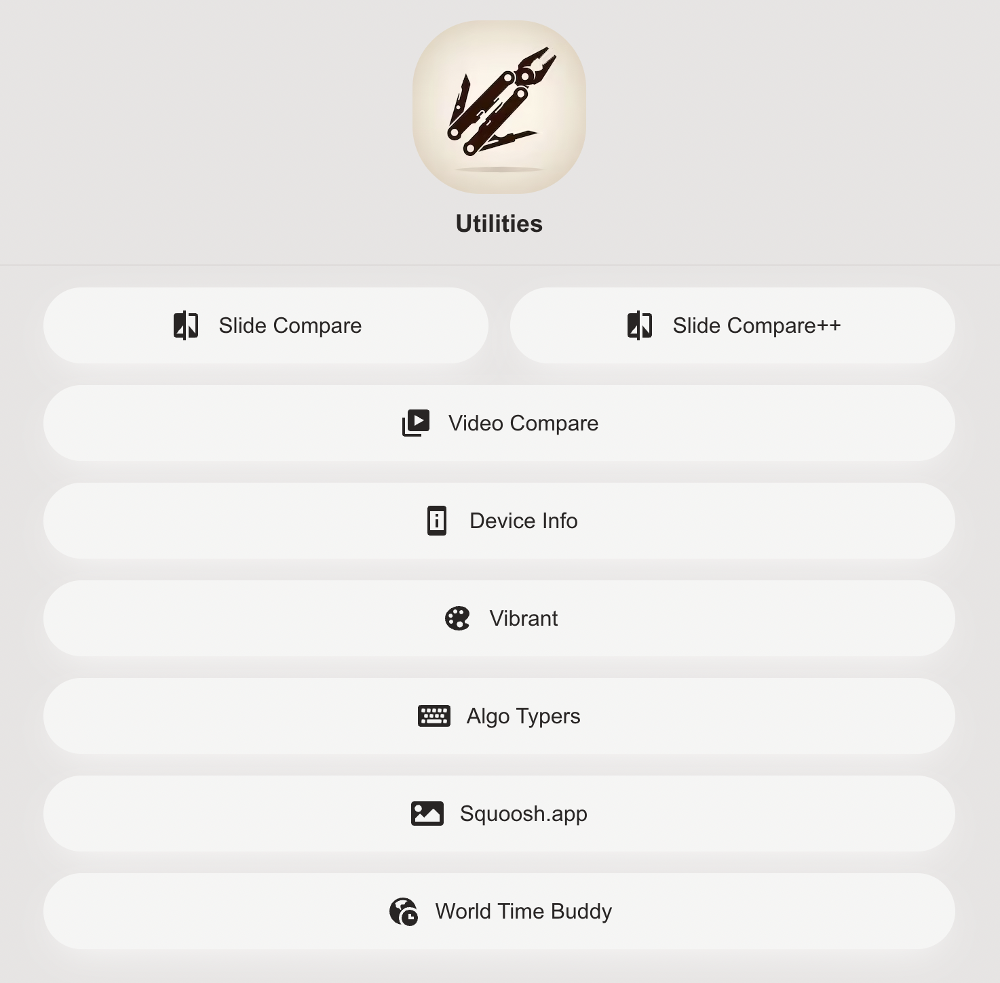
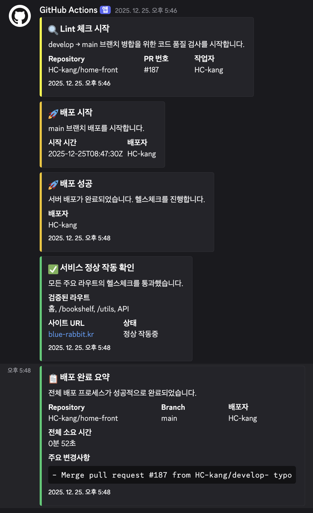
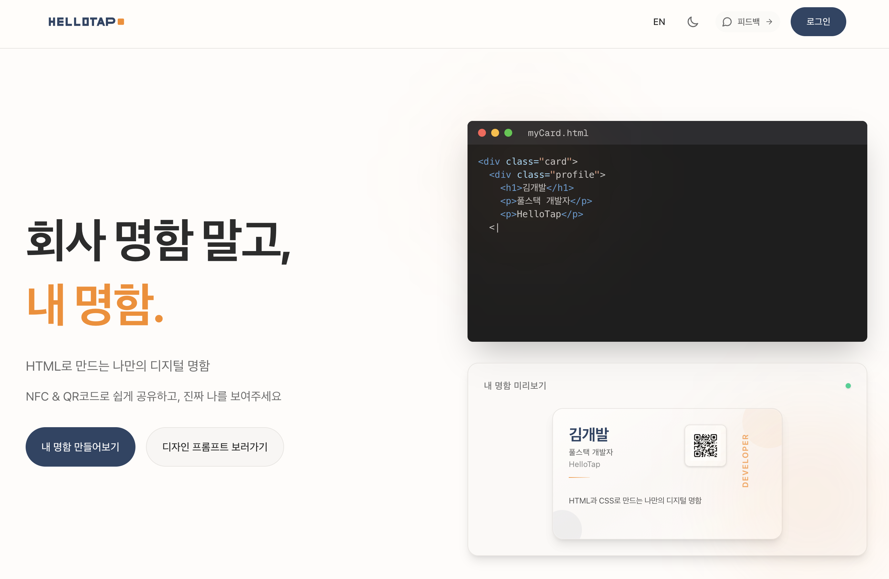
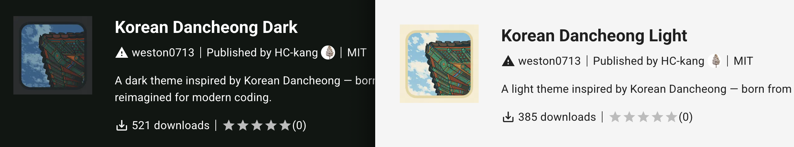
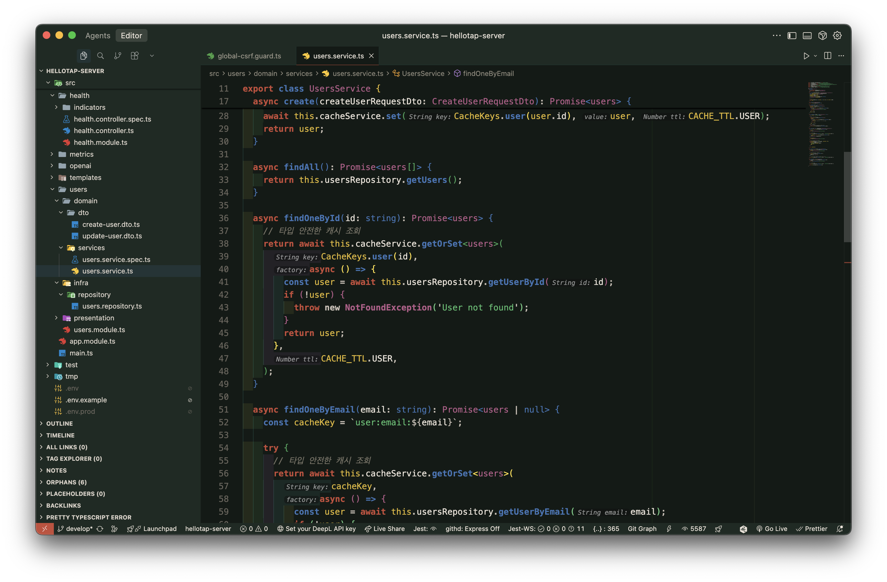

# 2025년 회고

아직 25년이 이틀 정도 남기는 했지만 조금 이른 시점에 올 한해를 돌아보며 회고를 작성하고자 합니다.

크게 업무와 개인, 두 축에서 간략하게 분기별로 정리해보면 다음과 같습니다.

## 업무

### 1분기

1분기는 작년과 거의 비슷했는데요. 이때까지가 딱 이직 후, 현 회사에서 1년차가 된 시점이었습니다.  
저희 회사는 웹 리소스(HTML 문서와 이미지, 비디오)에 대한 캐싱과 최적화 솔루션을 주요 제품으로 제공하고있고 저는 그중에서도 문서와 이미지 리소스 최적화 부분을 담당하고 있습니다.  
이러한 이유로 대부분의 시간을 문서와 이미지 최적화 엔진의 성능개선 및 기능추가, 버그픽스에 할애했습니다.  
그러던 중, 사내 검수 시스템과 관련해서 몇가지 이슈를 확인하고 이를 보고했는데요, 이 이슈가 2분기에서 이어질 작업의 계기가 되었습니다.

### 2분기

2분기에는 1분기부터 진행하던 단위 기능에 대한 업무와 더불어, 사내 테스트 인프라 이전 작업을 주도했습니다.  

당시 회사의 테스트 인프라는 [Linode](https://www.linode.com/ko/)와 [Vultr](https://www.vultr.com/) 라는 클라우드 벤더를 사용하고 있었는데요, 회사가 성장함에 따라 아래와 같은 몇가지 문제를 직면하게 되었습니다.

첫째로, 초기 구축 당시 리노드와 벌쳐는 한국, 혹은 동북아시아 리전을 지원하지 않았기에 미국 리전을 사용해야만 했습니다.  
이렇게 서버와 물리적으로 멀리 떨어져있다보니, 단순한 API요청 조차도 800ms 이상의 시간이 소요되는 경우가 왕왕 발생하고 있었습니다.

둘째로, 두 클라우드 서비스는 직관적이고 단순면서도 저렴하지만, 그만큼 제공하는 기능이 제한적이고 인스턴스에 문제가 발생하는 빈도가 높았습니다.  
특히나 사내 검수 시스템의 테스트케이스(TC) 규모가 커져가면서 인스턴스에 부하가 증가하면서 이러한 문제가 점점 더 심각해졌는데요.  
`Noisy Neighbor` 현상으로 인해, 테스트 중 뚜렷한 이유 없이 실패하고 단순 인스턴스 재시동시 성공하는 등 재현 불가능한 실패 사례가 점점 더 많아졌습니다.

무엇보다 심각한것은, 위 두 문제점의 시너지로 제품의 데일리 테스트 소요시간도 급격히 증가하고, 간헐적으로 '이유없이 데일리 테스트 자체가 실패하는 상황'도 발생하기 시작했습니다.  
이런 상황은 개발자들의 개발 효율성을 떨어뜨릴 뿐더러 무엇보다도 검수 시스템 전체의 신뢰성을 떨어뜨리는 원인이 되었습니다.

이외에도 두 벤더로 흩어진 인프라를 하나로 통합하고, 추후 확장성을 고려해 단순히 가상서버(VPS)만 제공하는 것이 아니라, 전반적인 클라우드 환경 전체를 제공할 수 있는 클라우드 서비스로 이전할 필요가 있었습니다.

이러한 이유로, 비용과 규모, 벤더의 신뢰성 등 여러 요소를 고려하여 회사는 테스트를 포함한 전체 인프라를 OCI(Oracle Cloud Infrastructure)로 이전하게 되었습니다.  

### 3분기

3분기에는 다시 리소스 최적화 엔진의 기능 추가에 집중해서, iOS에서의 AV1 기반 비디오 최적화 작업, PNG 이미지에 대한 최적화 성능 개선 등의 작업을 주로 진행했습니다.  
그리고 9월부터는 이전한 OCI 클라우드 환경을 기반으로 SaaS 서비스 구축을 위한 초기 작업을 시작했습니다.  
이는 기존에 제공하던 설치형 솔루션인 저희 제품에 대한 고객사/사용자의 접근성을 높이기 위한 초기 작업이었습니다.
처음 다뤄보는 Keycloak을 활용한 인증 서버 구축과, 요구사항 및 사내 구성원들의 기술 스택을 고려한 개발 환경 구축 등의 작업을 진행했습니다.

### 4분기

4분기에 들어 본격적으로 SaaS 서비스 구축을 진행했습니다.  
소규모 팀으로 구성된 회사에서 SaaS 서비스 구축을 진행하는 것은 처음이었는데요, 초기 요구사항 정의부터 개발 환경 구축, 서비스 개발, 테스트 및 배포 등 정말이지 모든 사이클을 직접 경험할 수 있었습니다.  
특히 워터폴이 아닌 짧은 주기의 스프린트 방식으로 RBAC 권한 관리, 모니터링 및 정산/대사 시스템 등의 기능을 개발하는것은 정말 새로운 경험이었습니다. 마치 군시절 혼란하고 예측불가했던 경험처럼, 매 스프린트마다 예상치 못한 요구사항이 등장하고, 그에 대응하는 개발을 진행하는 것은 정말 쉽지 않은 경험이었고, 그 과정에서 '개발도 중요하지만, 커뮤니케이션이 훨씬 중요하다'라는 생각을 사무치도록 정말 많이 하게 되었습니다.

## 개인

### 1분기

1분기에는 24년 4분기에 이어서 개인 프로젝트로 [제 프로필 사이트](https://www.blue-rabbit.kr/)를 구축하고 개선했습니다.  


아무래도 홈 서버를 사용하고 있기에, 내년 초 이사 기간에는 페이지가 내려가있을지도 모르겠네요.  

여하튼, 초기에는 저라는 사람과 최근 관심사를 효과적으로 전하기 위해 상용 서비스인 링크트리나 리틀리를 활용하려고 했는데요, 생각보다 번거롭기도 하고 제가 원하는 디자인과 기능을 찾기가 쉽지 않았습니다.  
그리고 뭐.. 서비스 할 게 아니라, 제가 필요한 기능만 작성한다면 그리 어렵지도 않겠다는 생각에 직접 구현해보기로 했습니다.  

그렇게 구현한 프로필 사이트는 초기에는 단순히 제 블로그나 깃허브, 링크드인 바로가기 정도만을 포함했었는데요, 이후에는 저만의 개인 서재나, 업무나 일상생활등에 자주 사용하는 도구 모음을 하나씩 추가하면서, 실무나 일상생활에서 알뜰하게 사용하고 있습니다.



무엇보다도 아래 두 가지 장점으로 인해 만족도가 매우 큰데요

1. 테스트와 CI/CD 파이프라인이 완벽하게 구축되어있어, 필요한 기능을 수 분 이내에 배포하고 결과를 확인할 수 있습니다. 즉, POC, MVP성 기능 개발에서 초기 장벽이 매우 낮아졌습니다. 언제든지 새로운 아이디어에 대한 검증용 API를 추가해서 배포 할 수 있고, 지금도 아래 예시와 같은 API를 ~~비밀리에~~ 제공하고있습니다.
   1. `https://www.blue-rabbit.kr/api/holiday`
      1. 오늘이 휴일인가?: 자동화 일일 보고서 작성시 봇이 공휴일에도 뻘하게 메시지를 보내는 것을 방지하기 위해 사용 가능합니다
        ```json
        {
            "today": {
                "date": "2025-12-29",
                "isHoliday": false,
                "name": null,
                "dayOfWeek": "월요일"
            },
            "nextHoliday": {
                "date": "2026-01-01",
                "name": "1월1일",
                "daysFromToday": 3
            },
            "weekRange": [
                ...
                {
                "date": "2026-01-01",
                "isHoliday": true,
                "name": "1월1일",
                "dayOfWeek": "목요일"
                },
                ...
            ]
        }
        ```
2. 홈 서버를 사용하기에 비용 부담 없이 백엔드의 컴퓨팅 파워를 어디서든 활용할 수 있습니다. 이미지나 동영상 분석 등의 꽤나 비싼 작업도 부담없이 처리 가능합니다.



이런 과정을 하나씩 거치면서, 기본적인 네트워크 구성과 보안, 파이프라인의 본질적인 중요성(직접 할 수 있지만 굳이 할 필요 없는 일을 덜어내는 과정)을 깊이 있게 느끼게 되었습니다.

### 2분기

2분기에는 [헬로탭](https://www.hellotap.me/)이라는 사이드 프로젝트를 시작했습니다.  

저는 이전부터 각종 세미나나 커뮤니티 행사에 가는 걸 즐겼는데요, 명함을 두고 왔거나, 준비한 명함보다 사람이 많은 경우 등 비상사태가 종종 있더라구요. 그리고 간혹 명함이 없거나, 명함이 없다는 사실 자체에 주눅드는 분들도 있다는 걸 알게 되었습니다. 그래서 '회사 명함'이 아닌 '내 명함'을 만들 수 있으면 좋겠다는 생각을 어렴풋이 하고 있었습니다.

그러던 중, 아두이노 키트 안에서 우연히 NFC 카드를 발견했는데요. 카드에 저장된 정보를 읽어서 특정 액션을 취하는 게 가능하더라구요. 신기해서 이것저것 알아보니, 실제로 NFC로 명함을 대체하려는 시도가 꽤 있었습니다. 심지어 제가 사용 중인 `hellotap.me` 도메인의 전 주인도 이런 사업 목적으로 도메인을 썼던 것 같더라구요.

하지만 기존 서비스들은 대부분 단순한 정보 전달에 그치는 것 같았습니다. 여기에 뭔가 재밌는 인터랙션을 추가하면 어떨까 싶어서, 예전에 봤던 [CSS Pokemon](https://poke-holo.simey.me/) 프로젝트를 참고해 홀로그램 효과가 있는 '진짜 명함같은 디지털 명함'을 만들어보기로 했습니다.

[명함 예제1 - 디자이너 박나고](https://www.hellotap.me/c/예절바른-검둥오리-7940)
[명함 예제2 - 프론트 개발자 신보리](https://www.hellotap.me/c/사적인-미노타우르스-1244)

그래서 뭐.. 다들 하시듯 무턱대고 도메인부터 하나 사고 Nest + Next 조합으로 서비스를 구축했습니다.  
혼자 기획부터 디자인, 프론트와 백엔드, 배포까지 하려니 조금 고생하긴 했지만 그만큼 자유롭고 재미있게 개발할 수 있었습니다.

재밌는 점은, 혼자 작업하면 막연히 '하고 싶은 대로 다 할 수 있으니 좋겠다'라고 생각하기 쉬운데, 실제로 그렇게 진행하면 기술부채가 엄청난 속도로 쌓인다는 걸 체감했습니다. 오히려 혼자 일할 때 협업 못지않게 엄격한 규칙을 적용하고 정리하는 게 중요하더라구요.



이 과정에서 '사람이 읽을 수 있는 ID'를 만들기 위해 간단한 npm 패키지도 만들어봤는데, ~~아무도 쓰진 않지만..~~ 재밌는 경험이었습니다.

[ko-unique-name-generator](https://www.npmjs.com/package/ko-unique-name-generator)

헬로탭은 홈 서버 덕분에 비용 부담 없이 아직도 운영 중이고, 조금씩 개선을 이어가고 있습니다.

### 3분기

3분기에는 1, 2분기에 이어서 개인 프로젝트의 서재를 카드 UI로 변경하고, 이런저런 기능을 추가했습니다.  


그리고 여름 휴가로 다녀온 경주 여행에서 본 불국사와 월정교가 너무 멋져서, 이 색감을 `VSCode`와 `Cursor` 테마로 만들어보았습니다. 밤에 본 월정교와, 처마 사이로 본 밤하늘이 정말 예뻤거든요.



물론 시작은 색감이었지만, 더 신경 쓴 건 '개발에 얼마나 쓸만한가'였습니다. 이런저런 테마를 써보면서 '예쁜 쓰레기'를 꽤 마주쳤었거든요. 군시절부터 계속 생각해온 건데, 이런 소소한 도구와 환경이 생산성에 꽤 큰 영향을 준다고 봅니다. 즉 누구나 하루에 발휘할 수 있는 주의력에는 한계가 있고, 따라서 그 한계를 시간으로 메우기보다는 주의력을 효율적으로 쓰는 게 낫다고 생각하거든요. 그래서 각 토큰별 색상을 '오방색을 활용하되 가독성을 해치지 않는' 방향으로 잡았습니다.

작업하면서 디자이너분들의 고충을 조금이나마 느껴볼 수 있었고, 꽤 재밌는 경험이었습니다.

결과물은 [Korean Dancheong Dark](https://open-vsx.org/extension/weston0713/korean-dancheong-dark), [Korean Dancheong Light](https://open-vsx.org/extension/weston0713/korean-dancheong-light)에서 보실 수 있는데요. 라이트 테마는 솔직히 그저 그렇지만, 다크 테마는 정말 만족스럽고 지금도 가장 애용하는 테마입니다.



### 4분기

4분기에는 개인 프로젝트보다는 공부와 정리에, 그리고 개인사에 시간을 더 많이 썼습니다.

우선 Java와 Spring Boot를 조금씩 들여다보기 시작했는데요.  
노드 개발자이긴 하지만, 현실적으로 업계 대다수를 차지하는 Java 개발자들의 사고방식과 Spring Boot라는 거대한 프레임워크에서 배울 점이 분명히 있을 거라는 생각이 들기도 했고, 그 다수의 개발자들과의 원활한 커뮤니케이션을 위해 필요한 지식이 있을 거라는 생각이 들었거든요.  

그리고 무엇보다 내년 초 이사를 앞두고 부동산과 인테리어 탐방에 시간을 많이 쏟고 있는데 예상은 했지만 생각보다 더 힘들고 시간이 많이 드네요.  
이런저런 준비 때문에 개인 프로젝트는 거의 진행하지 못했습니다.

하지만 그래도 이제 얼추 마무리 단계인 만큼, 빠르게 정리하고 다시 재밌는 아이디어들을 꺼내보려고 합니다.

앞으로도 꾸준히 공부하고 정리하면서, 개발자로서 좀 더 단단해져 보려고 합니다
