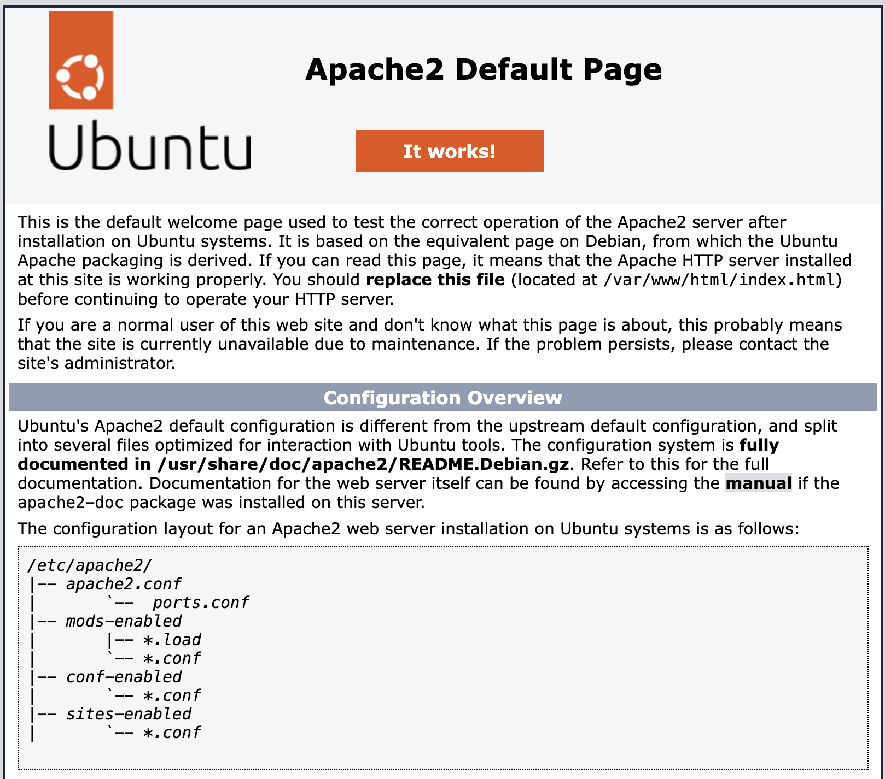
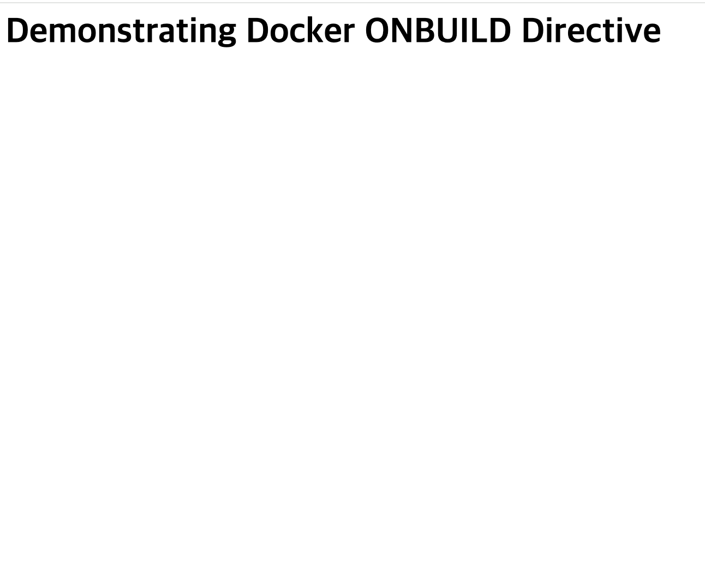

# 고급 도커파일 지시어


> 원문: [Advanced Dockerfile Directives](https://dev.to/kalkwst/advanced-dockerfile-directives-193f?utm_source=oneoneone)

이 글에서는 `Dockerfile`에서 쓰이는 고급 지시어들에 대해 알아보겠습니다. 이러한 지시어들을 활용해 좀 더 고급지게 `Dockerfile`을 작성 할 수 있습니다.

예를 들어, 호스트 머신과 컨테이너의 파일 시스템을 바인딩하기 위해 `VOLUME` 지시어를 사용 할 수 있고, 이를 통해 컨테이너의 데이터를 호스트 머신에 저장할 수 있습니다.

이 포스트에서는 아래의 열 가지 지시어에 대해 알아보겠습니다.

1. `ENV`
2. `ARG`
3. `WORKDIR`
4. `COPY`
5. `ADD`
6. `USER`
7. `VOLUME`
8. `EXPOSE`
9. `HEALTHCHECK`
10. `ONBUILD`

## `ENV` 지시어

`ENV` 지시어는 환경 변수를 설정하는 데 사용됩니다. 아시다시피 환경변수는 key-value로 이루어진 쌍으로, 컨테이너 내에서 어플리케이션이 사용할 정보를 제공해 줍니다.
이러한 환경변수는 프로그램의 동작방식을 동적으로 변경할 수 있게 해줍니다.

환경변수는 아래와 같은 형태로 사용됩니다.

```Dockerfile
ENV <key> <value>
```

좀 더 실제적인 예시를 들자면, 아래와 같습니다.
    
```Dockerfile
ENV PATH $PATH:/usr/local/app/bin/
```

아래와 같이 한 줄에 여러 개의 환경변수를 선언할 수도 있으며, 이때는 공백(` `)으로 각각을 구분하고, 키와 값을 `=`로 구분합니다.

```Dockerfile
ENV <key1>=<value1> <key2>=<value2> ...
```

이또한 좀 더 자세한 예시로 들자면, 아래와 같고 `PATH` 환경변수에는 `$PATH:/usr/local/app/bin/`가 추가되고, `VERSION` 환경변수에는 `1.0.0`이 할당됩니다.

```Dockerfile
ENV PATH $PATH:/usr/local/app/bin/ VERSION=1.0.0
```

이렇게 한 번 ENV 지시어로 선언된 환경변수는 이후로 이어지는 모든 도커 이미지 레이어에도 적용되고, 해당 이미지로 실행된 컨테이너에서도 사용할 수 있습니다.

## `ARG` 지시어

`ARG` 지시어는 빌드 타임에 사용되는 변수를 설정하는 데 사용됩니다. 즉, 사용자가 `docker build` 명령어를 실행할 때 전달할 변수를 설정할 수 있습니다.
이 변수는 환경변수와 비슷하게 동작하고 `Dockerfile` 내에서 전역적으로 사용 할 수 있지만, `ENV`와 다르게 최종 이미지에는 포함되지 않습니다.

`ARG` 지시어는 아래와 같은 형태로 사용됩니다.

```Dockerfile
ARG <varname>
```

`ARG` 지시어를 아래처럼 여러 번 사용 할 수도 있습니다.

```Dockerfile
ARG USER
ARG VERSION
```

이렇게 선언된 `ARG` 변수는 기본값을 가질 수도 있으며, 형태는 아래와 같습니다.
    
```Dockerfile
ARG USER=TestUser
ARG VERSION=1.0.0
```

`ENV`로 선언된 변수와는 다르게, `ARG`로 선언된 변수는 컨테이너에서 사용 할 수는 없습니다. 이 변수는 오직 빌드 타임에만 사용 할 수 있습니다.

### `Dockerfile`에서 `ENV`와 `ARG` 지시어 사용해보기

이제 Dockerfile을 직접 만들어 보겠습니다. Ubuntu를 베이스 이미지로 사용할것이고, 빌드타임에서 우분투의 버전을 변경 할 수 있도록 해보겠습니다.
또한 환경변수를 사용해서 우분투 내에서 작동할 어플리케이션의 경로를 지정해보도록 하겠습니다.

가장 먼저, 디렉토리를 생성 해 주고, 그 디렉토리로 이동합니다.

```bash
mkdir env-arg-example
cd env-arg-example
```
그리고 vscode를 사용해서 `Dockerfile`을 생성해 보겠습니다. 편집기는 vscode가 아니더라도 자유롭게 사용하셔도 됩니다.

```bash
code Dockerfile
```

그리고 아래와 같이 도커파일

```Dockerfile
ARG TAG=latest
FROM ubuntu:$TAG
LABEL maintainer=ananalogguyinadigitalworld@example.com
ENV ENVIRONMENT=dev APP_DIR=/usr/local/app/bin
CMD ["env"]
```

위의 도커파일에서는 가장먼저 `TAG`라는 이름의 `ARG` 변수를 선언하고, 기본값으로 `latest`를 할당합니다. 그리고 `FROM` 지시어를 통해 우분투 이미지를 베이스 이미지로 사용하며, 결과적으로 `ubuntu:latest` 이미지를 사용하게 됩니다.

`LABEL` 지시어는 이미지에 메타데이터를 추가하는 데 사용되며, 여기서는 이미지를 유지보수하는 사람의 이메일 주소를 추가하였습니다. 그리고 `ENV` 지시어를 통해 `ENVIRONMENT`를 `dev`로, `APP_DIR`를 `/usr/local/app/bin`으로 설정하였습니다. 이러한 `환경변수`들은 컨테이너에서 작동할 어플리케이션에서 사용할 수 있습니다.

마지막으로 `CMD` 지시어를 통해 해당 이미지로부터 컨테이너가 실행 될 때 실행할 명령어를 지정하였습니다. 여기서는 `env` 명령어를 실행하며 우리가 지정한 모든 환경변수를 출력하게 됩니다.

이제 도커 이미지를 빌드 해 보겠습니다.

```bash
docker image build -t env-arg --build-arg TAG=23.10 .
```

실행 결과는 대략 아래와 비슷하게 생겼을 것입니다.

```bash
[+] Building 5.4s (5/5) FINISHED                                              
 => [internal] load build definition from Dockerfile                     0.0s
 => => transferring dockerfile: 191B                                     0.0s
 => [internal] load metadata for docker.io/library/ubuntu:23.10          3.3s
 => [internal] load .dockerignore                                        0.1s
 => => transferring context: 2B                                          0.0s
 => [1/1] FROM docker.io/library/ubuntu:23.10@sha256:fd7fe639db24c4e005  2.0s
 => => resolve docker.io/library/ubuntu:23.10@sha256:fd7fe639db24c4e005  0.0s
 => => sha256:fd7fe639db24c4e005643921beea92bc449aac4f4 1.13kB / 1.13kB  0.0s
 => => sha256:72c9c923b9807a752ba9c8ba41432e62bb88312de9d15 424B / 424B  0.0s
 => => sha256:e9ba2bc085030d6d70a7361cd2dcbfa62d90628bd 2.31kB / 2.31kB  0.0s
 => => sha256:9610c9b6cbed27d1798b34c30c1a9db4755a2ed 26.42MB / 26.42MB  1.2s
 => => extracting sha256:9610c9b6cbed27d1798b34c30c1a9db4755a2ede67a8f5  0.7s
 => exporting to image                                                   0.0s
 => => exporting layers                                                  0.0s
 => => writing image sha256:4dd0af92fe1310adb69285bb1fae77ff0b847eb7675  0.0s
 => => naming to docker.io/library/env-arg:latest                        0.0s
```

 이제 방금 빌드한 이미지를 바탕으로 컨테이너를 실행해 보겠습니다.

```bash
 docker container run env-arg
```

 결과는 아래와 비슷하게 나올 것입니다.

```bash
PATH=/usr/local/sbin:/usr/local/bin:/usr/sbin:/usr/bin:/sbin:/bin
HOSTNAME=b3025a2889f1
ENVIRONMENT=dev
APP_DIR=/usr/local/app/bin
HOME=/root
```

## `WORKDIR` 지시어

`WORKDIR` 지시어는 `Dockerfile` 내에서 작업 디렉토리를 설정하는 데 사용되며, 이는 도커파일 내에서 후속되는 모든 명령어가 실행될 디렉토리를 지정합니다.
다시말해 이 지시어는 컨테이너 내에서 `ADD`, `CMD`, `COPY`, `ENTRYPOINT`, `RUN` 지시어 등이 실행될 디렉토리를 설정합니다.

`WORKDIR` 지시어는 아래와 같은 형태로 사용됩니다.

```Dockerfile
WORKDIR /path/to/workdir
```

만약 해당 디렉토리가 존재하지 않는다면, 빌드타임에 도커가 해당 디렉토리를 생성합니다. 다시말하자면 `WORKDIR` 지시어는 `mkdir`, `cd` 명령어를 조합했다고 보면 됩니다.

그리고 `WORKDIR` 지시어는 하나의 도커파일에서 여러번 사용 할 수도 있으며, 만약 상대경로를 사용한다면 이전 `WORKDIR` 지시어에서 지정한 디렉토리를 기준으로 상대경로를 사용합니다.

```Dockerfile
WORKDIR /one
WORKDIR two
WORKDIR three
WORKDIR drink
```

처음 사용된 `WORKDIR /one` 지시어를 통해 `/one` 디렉토리로 이동하고, 이후 `WORKDIR two` 지시어를 통해 `/one/two` 디렉토리로 이동하게 됩니다. 이후 `WORKDIR three` 지시어를 통해 `/one/two/three` 디렉토리로 이동하게 되고, 마지막으로 `WORKDIR drink` 지시어를 통해 `/one/two/three/drink` 디렉토리로 이동하게 됩니다.

## `COPY` 지시어

도커 이미지를 만들 때, 로컬 개발환경의 파일을 이미지에 직접 포함시켜야 하는 경우가 흔히 있습니다. 이런 파일은 어플리케이션의 소스코드부터 어플리케이션 구동에 필요한 설정이나 리소스 파일일수도 있죠. 이때 `COPY` 지시어를 사용하면 이미지를 빌드하는 시점에서 우리 로컬 파일시스템의 어떤 파일 혹은 디렉토리를 이미지에 포함시킬 수 있습니다.

`COPY` 지시어는 아래와 같은 형태로 사용됩니다.

```Dockerfile
COPY <source> <destination>
```

`source`는 도커의 `build context`를 바탕으로 로컬 파일시스템의 파일이나 디렉토리를 가리키고, `destination`은 도커 이미지의 파일시스템상에서 해당 파일이나 디렉토리가 위치할 경로를 가리킵니다.

아래의 예시에서 `COPY` 지시어를 사용해 `index.html` 파일을 이미지의 `/var/www/html/index.html` 경로로 복사 할 수 있습니다.

```Dockerfile
COPY index.html /var/www/html/index.html
```

이 때 와일드카드를 사용하여 다수의 파일을 한번에 복사할 수도 있습니다.

```Dockerfile
COPY *.html /var/www/html/
```

`COPY` 지시어를 사용 할 때, `--chown` 옵션을 사용하여 복사된 파일의 소유자나 그룹을 변경할 수도 있습니다.

```Dockerfile
COPY --chown=myuser:mygroup *.html /var/www/html/
```

위 예시에서는 `--chown=myuser:mygroup` 옵션을 사용하여 `.html`로 끝나는 모든 파일을 `/var/www/html/` 디렉토리로 복사하며, 복사된 파일의 소유자와 그룹을 `myuser`와 `mygroup`으로 변경합니다.

## `ADD` 지시어

`ADD` 지시어는 `COPY` 지시어와 비슷하지만 추가적인 기능이 있습니다.

```Dockerfile
ADD <source> <destination>
```

여기서 `<source>`는 파일이나 디렉토리를 가리키는 경로를 가리키거나, **원격지의 URL도 가리킬 수 있습**니다. `<destination>`은 동일하게 이미지의 파일시스템상에서 해당 파일이나 디렉토리가 위치할 경로를 가리킵니다.

아래의 예제를 통해 `ADD` 지시어를 사용해 `index.html` 파일을 이미지의 `/var/www/html/index.html` 경로로 복사 할 수 있습니다.

```dockerfile
ADD index.html /var/www/html/index.html
```

위 예시에서는 `COPY` 지시어와 동일하게 `index.html` 파일을 `/var/www/html/index.html` 경로로 복사합니다.

아래의 예시에서는 `ADD` 지시어를 사용해 원격지의 URL을 통해 파일을 다운로드 받아 이미지에 포함시킬 수 있습니다.

```Dockerfile
ADD http://example.com/test-data.csv /tmp/test-data.csv
```

`COPY` 지시어와는 달리 `ADD` 지시어는 URL(`http://example.com/test-data.csv`)을 사용해서 `<source>`를 지정 할 수 있으며, 이를 `/tmp/test-data.csv` 경로로 다운로드 받아 이미지에 포함시킵니다.

`ADD` 지시어는 단순히 파일을 다운로드 받아 해당 경로에 저장하는것 외에도, 특정 파일에 대해서 자동으로 압축을 풀어주는 기능도 제공합니다.(`.`tar, `.tar``.gz`, `.tgz`, `.bz2`, `.tbz2`, `.txz`, `.zip`)

예를 들어

```Dockerfile
ADD myapp.tar.gz /opt/myapp/
```

위의 예시에서는 `myapp.tar.gz` 파일을 다운받아 `/opt/myapp/` 경로에 압축을 풀어줍니다.

### Best Practices: `COPY` vs `ADD`

`Dockerfile`을 작성 할 때, `COPY`와 `ADD` 지시어 중 하나를 선택하는것은 이미지를 빌드하는 과정에서 명확성과 보안, 신뢰성을 유지하기 위해 중요한 결정입니다.

#### 명확성(Clearness)과 의도(Intent)

`COPY` 지시어는 로컬 파일시스템의 파일이나 디렉토리를 도커 이미지에 복사하고자 할 때 직관적이고 명확합니다. 이런 명확성은 도커파일의 목적을 이해하기 쉽게하고, 차후에 유지보수가 쉽게 만들어줍니다.

반면에 `ADD` 지시어는 `COPY` 지시어와 달리 URL을 통해 파일을 다운로드하고 자동으로 압축을 풀어주는 기능을 제공합니다. 이러한 기능은 특정 시나리오에서는 유용할 수 있지만, 단순히 파일을 복사하는게 목적이라면 이를 오히려 모호하게 만들 수 있습니다. 이러한 불투명성이 잘 관리되지 않으면 의도치 않은 동작이나 보안상 위협을 초해할 수 있습니다.

#### 보안(Security)과 예측가능성(Predictability)

`COPY` 지시어를 사용하는것은 URL을 통한 다운로드를 막는다는 점에서 잠재적인 보안상의 위협을 줄일 수 있습니다. 도커 이미지는 의도하지 않은 악성코드가 포함되지 않아야 하므로, 최대한 통제되고 검증된 환경에서 빌드되어야 합니다. 따라서 `COPY` 지시어를 사용하여, 이미지를 외부 환경으로부터의 다운로드를 차단하는것이 빌드환경을 안전하고 예측 가능하게 만들어줍니다.

### 도커파일에서 `WORKDIR`, `COPY`, `ADD` 지시어 사용해보기

이번 예제에서는 HTML 파일을 아파치 웹 서버로 배포하는 도커 이미지를 만들어 보겠습니다. 이를 위해 `Apache`가 설치된 `ubuntu` 이미지를 활용할 것이고, `index.html` 파일을 이미지에 복사하고, 도커 로고를 다운로드 받아 이미지에 포함시켜 보겠습니다.

```bash
mkdir workdir-copy-add-example
cd workdir-copy-add-example
```

위 디렉토리 안에서 `index.html`이라는 파일을 만들겠습니다. 이 파일이 빌드타임에 도커의 이미지 내부로 복사될 겁니다. 저는 vscode를 사용하지만, 다른 편집기를 사용하셔도 무방합니다.

```bash
code index.html
```

아래와 같은 내용을 `index.html`에 포함시켜 줍니다.

```html
<html>
    <body>
        <h1>
            Welcome to Docker!
        </h1>
        
    </body>
</html>
```

이 `index.html` 파일은 방문자에게 환영 인사를 하는 간단한 웹 페이지입니다. 또한 `Welcome to Docker!`이라는 인사말 아래에 도커 로고를 보여주는 이미지를 포함하고 있습니다.(`src="logo.png"`)

다음으로 도커파일을 작성 해 보겠습니다.

```bash
code Dockerfile
```

아래와 같은 내용을 `Dockerfile`에 포함시켜 줍니다.

```Dockerfile
FROM ubuntu:latest
RUN apt-get update -y && apt-get upgrade -y
RUN apt-get install apache2 -y
WORKDIR /var/www/html/
COPY index.html .
ADD https://upload.wikimedia.org/wikipedia/commons/4/4e/Docker_%28container_engine%29_logo.svg ./logo.png
CMD ["ls"]
```

위의 도커파일에서는 `FROM ubuntu:latest`를 통해 우분투 이미지를 베이스 이미지로 사용한다는 것을 선언하고, `RUN` 지시어를 통해 `apt-get update`와 `apt-get upgrade` 명령어를 실행하여 우분투 패키지를 업데이트합니다. 그리고 `apache2` 패키지를 설치합니다.
`WORKDIR /var/www/html/` 지시어를 통해 작업 디렉토리를 `/var/www/html/`로 설정합니다.

이제 그 디렉토리 안에, `COPY index.html .` 지시어를 통해 로컬의 `index.html` 파일을 이미지의 `/var/www/html/` 경로로 복사합니다. 그리고 `ADD https://upload.wikimedia.org/wikipedia/commons/4/4e/Docker_%28container_engine%29_logo.svg ./logo.png` 지시어를 통해 원격지의 URL을 통해 `logo.png` 파일을 다운로드 받아, 같은 경로로 복사합니다.

마지막으로 `CMD ["ls"]` 지시어를 통해 컨테이너가 실행 될 때 `ls` 명령어를 실행하도록 하여 현재 디렉토리의 파일 목록을 출력하게 합니다.

이제 이미지를 빌드 해보겠습니다.

```bash
docker build -t workdir-copy-add .
```

아래와 비슷한 결과를 보실 수 있을겁니다.

```bash
[+] Building 138.8s (12/12) FINISHED                                          
 => [internal] load build definition from Dockerfile                     0.0s
 => => transferring dockerfile: 296B                                     0.0s
 => [internal] load metadata for docker.io/library/ubuntu:latest         0.9s
 => [internal] load .dockerignore                                        0.0s
 => => transferring context: 2B                                          0.0s
 => CACHED [1/6] FROM docker.io/library/ubuntu:latest@sha256:2e863c44b7  0.0s
 => CACHED [6/6] ADD https://upload.wikimedia.org/wikipedia/commons/4/4  0.0s
 => [internal] load build context                                        0.0s
 => => transferring context: 32B                                         0.0s
 => [2/6] RUN apt-get update -y && apt-get upgrade -y                   93.8s
 => [3/6] RUN apt-get install apache2 -y                                43.5s
 => [4/6] WORKDIR /var/www/html/                                         0.1s 
 => [5/6] COPY index.html .                                              0.0s 
 => [6/6] ADD https://upload.wikimedia.org/wikipedia/commons/4/4e/Docke  0.0s 
 => exporting to image                                                   0.4s 
 => => exporting layers                                                  0.4s 
 => => writing image sha256:1f892b8767da393a36d16d66730f56c0b7fc0806763  0.0s 
 => => naming to docker.io/library/workdir-copy-add:latest               0.0s
```

아래와 같이 컨테이너를 실행 해 보겠습니다.

```bash
docker run workdir-copy-add
```

아래와 같은 결과를 보실 수 있을겁니다.

```bash
index.html
logo.png
```

## `USER` 지시어

도커에서는 기본적으로, 광범위한 권한을 가진 `root` 사용자로 컨테이너가 실행됩니다. 따라서 보안 위협을 줄이기 위해서 도커는 `USER` 지시어를 통해 `root`가 아닌 다른 사용자로 컨테이너를 실행할 수 있도록 지원합니다.
이 지시어는 컨테이너의 기본 사용자를 변경하는 데 사용되며, 도커파일에서 이어지는 `RUN`, `CMD`, `ENTRYPOINT` 지시어 등이 실행될 때 해당 사용자로 실행됩니다.

도커의 보안을 위해 `USER` 지시어를 사용하는것이 최소 권한의 원칙에 부합하는 best practice이며, 전반적인 시스템의 보안성을 강화하고 컨테이너의 공격당할 범위를 줄일 수 있습니다.

`USER` 지시어는 아래와 같은 형태로 사용됩니다.

```Dockerfile
USER <user>
```

`username`외에, 아래와 같이 `group`도 명시 할 수 있습니다.

```Dockerfile
USER <user>:<group>
```

`<user>`와 `<group>`이 명확하게 지정되었는지 확인해야 합니다. 그렇지 않으면 도커 데몬은 에러를 발생시키며 이미지를 빌드하는 과정을 중단할 수 있습니다.

### 도커파일에서 `USER` 지시어 사용해보기

이번 예제에서는 `USER` 지시어를 사용하여 기본 유저를 변경해보겠습니다. 이를 위해 아파치를 설치하고, 기본 유저를 `www-data`로 변경해보겠습니다. 그리고 `whoami` 명령어를 통해 현재 사용자를 확인해보겠습니다.

```bash
mkdir user-example
cd user-example
```

해당 디렉토리 안에서 `Dockerfile`을 생성해보겠습니다.

```bash
code Dockerfile
```

그리고 내용물은 아래와 같이 작성해줍니다.

```Dockerfile
FROM ubuntu:latest
RUN apt-get update -y && apt-get upgrade -y
RUN apt-get install apache2 -y
USER www-data
CMD ["whoami"]
```

위의 도커파일에서는 우분투를 베이스로 사용하고, 아파치를 설치합니다. 웹서버 운영시 주로 사용되는 `www-data`로 기본 유저를 변경하는것은 보안성을 높여주고 잠재적인 취약성을 줄여줍니다. 마지막으로 `CMD ["whoami"]` 지시어를 통해 컨테이너가 실행 될 때 `whoami` 명령어를 실행하여 현재 사용자(`www-data`)를 확인합니다.

이제 이미지를 빌드 해보겠습니다.

```bash
docker build -t user .
```

아래와 같은 결과를 보실 수 있을겁니다.

```bash
[+] Building 1.9s (7/7) FINISHED                                              
 => [internal] load build definition from Dockerfile                     0.0s
 => => transferring dockerfile: 165B                                     0.0s
 => [internal] load metadata for docker.io/library/ubuntu:latest         1.7s
 => [internal] load .dockerignore                                        0.0s
 => => transferring context: 2B                                          0.0s
 => [1/3] FROM docker.io/library/ubuntu:latest@sha256:2e863c44b718727c8  0.0s
 => CACHED [2/3] RUN apt-get update -y && apt-get upgrade -y             0.0s
 => CACHED [3/3] RUN apt-get install apache2 -y                          0.0s
 => exporting to image                                                   0.0s
 => => exporting layers                                                  0.0s
 => => writing image sha256:21f27a40e4c04e3a5108f40e9260ae77d6dc3d3133e  0.0s
 => => naming to docker.io/library/user:latest                           0.0s
```

이제 도커 컨테이너를 실행해보겠습니다.

```bash
docker container run user
```

그러면 아래와 같은 결과를 볼 수 있습니다.

```bash
www-data
```

## `VOLUME` 지시어

도커 컨테이너는 애플리케이션과 그 종속성을 포터블하고 경량화된 방식으로 캡슐화하도록 설계되어 있습니다. 그러나 기본적으로 도커 컨테이너는 임시적이므로 데이터는 런타임에만 존재하며, 컨테이너가 종료되거나 대체되면 데이터는 사라집니다. 이러한 특성은 데이터베이스나 파일시스템과 같은 데이터를 영구적으로 저장해야 하는 애플리케이션에서 문제가 될 수 있습니다.

이러한 문제를 해결하기 위해 도커는 `VOLUME` 지시어를 통해 컨테이너의 라이프사이클과는 독립적인, 데이터를 영속적으로 저장할 수 있는 볼륨을 제공합니다. 볼륨은 컨테이너와 호스트 사이에서 브릿지 역할을 하며, 컨테이너가 정지, 대체 및 삭제되는 경우에도 데이터를 보존할 수 있습니다. 이런 이유로 정보를 영구적으로 저장해야 하는 데이터베이스, 설정파일이나 로그 등을 사용하는 애플리케이션에게 볼륨은 필수적입니다.

도커파일에서 `VOLUME` 지시어를 사용하면, 도커는 컨테이너의 파일시스템에 관리되는 디렉토리를 생성합니다. 이 디렉토리는 볼륨을 위한 마운트 포인트로 사용됩니다. 결정적으로, Docker는 호스트 머신에 볼륨의 실제 데이터가 저장되는 해당 디렉터리도 설정합니다. 이러한 매핑이 호스트와 컨테이너 사이의 즉각적인 볼륨 동기화를 보장합니다.

도커의 볼륨은 네임드 볼륨과 호스트 마운트 볼륨을 포함한 다양한 유형을 지원합니다. 네임드 볼륨은 도커에서 생성 및 관리하므로 볼륨 수명 주기 및 스토리지 관리에 대한 제어와 유연성이 더 뛰어납니다. 반면 호스트 마운트 볼륨을 사용하면 호스트 파일 시스템에서 컨테이너로 디렉터리를 직접 마운트할 수 있으므로 호스트 리소스에 바로 액세스할 수 있습니다.

`VOLUME` 지시어는 주로 JSON 배열 형태의 파라미터를 사용합니다.

```Dockerfile
VOLUME ["path/to/volume"]
```

혹은 다수의 일반적인 문자열 형태로도 가능합니다.

```Dockerfile
VOLUME /path/to/volume1 /path/to/volume2
```

`docker container inspect <container>` 명령어를 통해 컨테이너의 볼륨 정보를 확인할 수 있습니다. 이는 아래와 비슷한 형태로 정보를 제공해줍니다.

```bash
[
   {
      "CreatedAt":"2024-06-21T22:52:52+03:00",
      "Driver":"local",
      "Labels":null,
      "Mountpoint":"/var/lib/docker/volumes/f46f82ea6310d0db3a13897a0c3ab45e659ff3255eaeead680b48bca37cc0166/_data",
      "Name":"f46f82ea6310d0db3a13897a0c3ab45e659ff3255eaeead680b48bca37cc0166",
      "Options":null,
      "Scope":"local"
   }
]
```

### 도커파일에서 `VOLUME` 지시어 사용해보기

이번 예제에서는 도커 컨테이너로 아파치 웹 서버를 띄워 보겠습니다. 다만, 아파치에 문제가 생겼을 때 로그를 볼 수 있도록 로그를 볼륨으로 지정해보겠습니다.

```bash
mkdir volume-example
cd volume-example
code Dockerfile
```

그리고 도커파일은 아래와 같이 작성해줍니다.

```Dockerfile
FROM ubuntu:latest
RUN apt-get update -y && apt-get upgrade -y
RUN apt-get install apache2 -y
VOLUME ["/var/log/apache2"]
```

이 도커파일은 우분투에서 아파치를 설치 및 실행하고, `/var/log/apache2` 디렉토리를 볼륨으로 지정합니다. 이 디렉토리는 아파치 웹 서버의 로그 파일을 저장하는 디렉토리이며, 이를 볼륨으로 지정함으로써 컨테이너가 종료되어도 로그 파일이 보존됩니다.

이제 이미지를 빌드 해보겠습니다.

```bash
docker build -t volume .
```

아래와 같은 결과를 볼 수 있습니다.

```bash
[+] Building 4.3s (7/7) FINISHED                                              
 => [internal] load build definition from Dockerfile                     0.0s
 => => transferring dockerfile: 164B                                     0.0s
 => [internal] load metadata for docker.io/library/ubuntu:latest         4.2s
 => [internal] load .dockerignore                                        0.0s
 => => transferring context: 2B                                          0.0s
 => [1/3] FROM docker.io/library/ubuntu:latest@sha256:2e863c44b718727c8  0.0s
 => CACHED [2/3] RUN apt-get update -y && apt-get upgrade -y             0.0s
 => CACHED [3/3] RUN apt-get install apache2 -y                          0.0s
 => exporting to image                                                   0.0s
 => => exporting layers                                                  0.0s
 => => writing image sha256:a29fd78292c08b4b91a6547aac578f1b69f41bcaf03  0.0s
 => => naming to docker.io/library/volume:latest                         0.0s
 ```

 이번에도 컨테이너를 실행하는데, 이번에는 `--interactive`와 `--tty` 플래그를 사용하여 컨테이너 내부에서 작업을 할 수 있도록 해보겠습니다. 그리고 `--name` 플래그를 사용하여 컨테이너의 이름을 `volume-container`로 지정해보겠습니다.

```bash
 docker container run --interactive --tty --name volume-container volume /bin/bash
```

그러면 아래와 같은 결과를 볼 수 있습니다.

```bash
root@38d4fb19abc7:/#
```

이제 컨테이너 내부에서 `cd /var/log/apache2` 명령어를 통해 `/var/log/apache2` 디렉토리로 이동해보겠습니다.

```bash
cd /var/log/apache2
```

이제 아마 이런 모습이 보일겁니다.

```bash
root@38d4fb19abc7:/var/log/apache2#
```

이제 `ls -l` 명령어를 통해 디렉토리 내부의 파일 목록을 확인해보겠습니다.

```bash
total 0
-rw-r----- 1 root adm 0 Jul 27 13:33 access.log
-rw-r----- 1 root adm 0 Jul 27 13:33 error.log
-rw-r----- 1 root adm 0 Jul 27 13:33 other_vhosts_access.log
```

이들은 아파치 웹 서버의 로그 파일들입니다. 동일한 파일들이 호스트 마운트 볼륨에도 존재할 것입니다. `exit`으로 컨테이너를 종료해줍니다.

그리고 `volume-container` 컨테이너를 `inspect` 해보겠습니다.

```bash
docker container inspect volume-container
```

그러면 `Mounts` 항목에서 아래와 같은 결과를 볼 수 있습니다.

```bash
"Mounts": [
    {
        "Type": "volume",
        "Name": "2cd07da869e5142b69cc0d49cafcb6337e064c9afbd9afcd2d26968bd2d93bfa",
        "Source": "/var/lib/docker/volumes/2cd07da869e5142b69cc0d49cafcb6337e064c9afbd9afcd2d26968bd2d93bfa/_data",
        "Destination": "/var/log/apache2",
        "Driver": "local",
        "Mode": "",
        "RW": true,
        "Propagation": ""
    }
],
```

이제 볼륨을 직접 `inspect` 해보겠습니다. 볼륨의 이름은 이전 결과의 `Name` 항목에 나와있습니다.

```bash
docker volume inspect 2cd07da869e5142b69cc0d49cafcb6337e064c9afbd9afcd2d26968bd2d93bfa
```

그러면 아래와 같은 결과를 볼 수 있습니다.

```bash
[
    {
        "CreatedAt": "2024-07-27T23:16:25+09:00",
        "Driver": "local",
        "Labels": {
            "com.docker.volume.anonymous": ""
        },
        "Mountpoint": "/var/lib/docker/volumes/2cd07da869e5142b69cc0d49cafcb6337e064c9afbd9afcd2d26968bd2d93bfa/_data",
        "Name": "2cd07da869e5142b69cc0d49cafcb6337e064c9afbd9afcd2d26968bd2d93bfa",
        "Options": null,
        "Scope": "local"
    }
]
```

이제 `Mountpoint` 항목을 통해 볼륨이 호스트의 어떤 경로에 마운트되어 있는지 확인할 수 있고, 이를 통해 파일의 목록을 확인할 수 있습니다.

```
ls -l /var/lib/docker/volumes/2cd07da869e5142b69cc0d49cafcb6337e064c9afbd9afcd2d26968bd2d93bfa/_data
```

## `EXPOSE` 지시어

`EXPOSE` 지시어는 도커 컨테이너가 런타임에 수신할 포트를 Docker에게 알리는데에 사용됩니다. 이 지시어는 주로 정보제공을 위한것으로, 실제로 호스트 시스템에 포트를 열거나 연결하지는 않습니다. 대신, 이 지시어는 도커 환경에서 컨테이너간 통신 혹은 네트워크 서비스에 사용할 포트들을 명시하는데 사용됩니다.

`EXPOSE` 지시어는 TCP와 UDP 프로토콜을 모두 지원하므로 다양한 네트워크 요구사항에 맞게 유연하게 사용할 수 있습니다. 이 지시어는 런타임중에 실제로 포트를 매핑하는 `-p` 혹은 `-P` 옵션을 위한 원재료라고 생각하면 됩니다.

`EXPOSE` 지시어는 아래와 같은 형태로 사용됩니다.

```Dockerfile
EXPOSE <port>
```

## `HEALTHCHECK` 지시어

헬스체크는 컨테이너가 정상적으로 운영되는지 확인하기 위한 매우 중요한 메커니즘입니다. 이는 컨테이너 내에서 어플리케이션이 정상적으로 작동중인지 확인할 수단을 제공합니다.
헬스체크가 없다면 도커는 컨테이너의 상태를 판단 할 수 없게되며, 이는 특히 안정적인 가동이 중요한 프로덕션 환경에서 특히 중요합니다.

`HEALTHCHECK` 지시어는 개발자들이 커스텀한 헬스체크를 구현할 수 있도록 해주는데, 일반적으로는 주기적으로 컨테이너의 상태를 확인하고 이를 리포트하는 명령어나 스크립트 형태로 작성됩니다.
이 지시문은 사전 모니터링을 보장해주고 도커의 오케스트레이션 도구들이 이 정보를 바탕으로 결정할 수 있도록 해 줍니다.

하나의 도커파일에는 오직 하나의 `HEALTHCHECK` 지시어만 사용할 수 있습니다. 만약 둘 이상의 `HEALTHCHECK` 지시어가 존재한다면, 마지막에 선언된 `HEALTHCHECK` 지시어만 유효합니다.

예를 들어, 다음 지시어를 사용하여 컨테이너가 `http://localhost/` 엔드포인트에서 트래픽을 수신할 수 있도록 할 수 있습니다

```Dockerfile
HEALTHCHECK CMD curl -f http://localhost/ || exit 1
```

마지막에 있는 `|| exit 1`은 `curl` 명령어가 실패하면 컨테이너가 `unhealthy` 상태로 표시되도록 하는 부분입니다. 여기서 유효한 값은 `0`과 `1`이며, `0`은 `healthy` 상태를, `1`은 `unhealthy` 상태를 나타냅니다.

`HEALTHCHECK` 지시어를 사용할때에는 추가적인 설정을 위한 파라미터를 사용 할 수 있습니다.

- `--interval`: 헬스체크를 수행하는 주기를 설정합니다. 기본값은 30초입니다.
- `--timeout`: 헬스체크 명령어가 실행되는 최대 시간을 설정합니다. 해당 시간 내에 제대로 응답이 오지 않으면 헬스체크는 실패한 것으로 간주됩니다. 기본값은 30초입니다.
- `--start-period`: 컨테이너가 시작된 후에 헬스체크를 시작하는 시간을 설정합니다. 이 시간 이전에는 헬스체크가 실행되지 않습니다. 기본값은 0초입니다.
- `--retries`: 헬스체크가 실패한 경우 재시도 횟수를 설정합니다. 기본값은 3회입니다.

아래와 같은 방식으로 `HEALTHCHECK` 지시어를 사용할 수 있습니다.

```Dockerfile
HEALTHCHECK \
    --interval=1m \
    --timeout=2s \
    --start-period=2m \
    --retries=3 \
    CMD curl -f http://localhost/ || exit 1
```

### 도커파일에서 `EXPOSE`와 `HEALTHCHECK` 지시어 사용해보기

이번에는 아파치 웹서버를 도커라이즈 해서, 브라우저로 직접 접근해 봅시다. 추가적으로, 아파치 웹 서버의 상태 확인을 위한 헬스체크도 추가 해 볼겁니다.

```bash
mkdir expose-healthcheck-example
cd expose-healthcheck-example
code Dockerfile
```

그리고 도커파일은 아래와 같이 작성해줍니다.

```Dockerfile
FROM ubuntu:latest

RUN apt-get update -y && apt-get upgrade -y

RUN apt-get install apache2 curl -y

HEALTHCHECK CMD curl -f http://localhost/ || exit 1

EXPOSE 80

ENTRYPOINT ["apache2ctl", "-D", "FOREGROUND"]
```

위의 도커파일은 우분투를 베이스로 아파치 웹 서버를 설치하고, 로컬호스트와 통신해서 컨테이너의 상태를 확인하기 위해 `HEALTHCHECK` 지시어를 통해 `curl -f http://localhost/ || exit 1` 명령어를 통해 아파치 웹 서버의 상태를 확인합니다. 노출된 80포트를 사용해서 외부에서 아파치 웹서버에 접근 할 수있습니다. 마지막으로 `ENTRYPOINT ["apache2ctl", "-D", "FOREGROUND"]`를 통해 아파치 웹 서버를 포그라운드로 실행하여 컨테이너가 종료되지 않도록 합니다. 이런 구성을 통해 아파치 웹 서버(80포트)를 도커 컨테이너로 실행할 수 있습니다.

이제 이미지를 빌드 해보겠습니다.

```bash
docker image build -t expose-healthcheck-example .
```

아래와 같은 결과가 보이면 됩니다.

```bash
[+] Building 38.4s (7/7) FINISHED                                             
 => [internal] load build definition from Dockerfile                     0.0s
 => => transferring dockerfile: 256B                                     0.0s
 => [internal] load metadata for docker.io/library/ubuntu:latest         2.2s
 => [internal] load .dockerignore                                        0.0s
 => => transferring context: 2B                                          0.0s
 => [1/3] FROM docker.io/library/ubuntu:latest@sha256:2e863c44b718727c8  0.0s
 => CACHED [2/3] RUN apt-get update -y && apt-get upgrade -y             0.0s
 => [3/3] RUN apt-get install apache2 curl -y                           35.6s
 => exporting to image                                                   0.4s
 => => exporting layers                                                  0.4s
 => => writing image sha256:40636f4aadb6c1aa5fc005e10aa5d61ae7a65107731  0.0s 
 => => naming to docker.io/library/expose-healthcheck-example:latest     0.0s 
```

이제 컨테이너를 실행해보겠습니다.
이번에는 `-p` 옵션을 사용하여 호스트의 8080포트와 컨테이너의 80포트를 연결해보겠습니다.  추가적으로, `--name` 옵션을 사용하여 컨테이너의 이름을 `expose-healthcheck-container`로 지정하고 `-d` 옵션을 사용하여 디테치드 모드(백그라운드)로 실행해보겠습니다.

```bash
docker container run -p 8080:80 --name expose-healthcheck-container -d expose-healthcheck-example
```

아래의 명령어로 현재 가동중인 컨테이너를 볼 수 있습니다

```bash
docker container list
# or
docker container ls
# or
docker ps
```

아래와 같은 형태를 보실 수 있을것이고, `STATUS`가 `healthy`로 표시되어야 합니다.

```bash
CONTAINER ID   IMAGE                        COMMAND                  CREATED          STATUS                    PORTS                                       NAMES
eb26cb696dac   expose-healthcheck-example   "apache2ctl -D FOREG…"   42 seconds ago   Up 41 seconds (healthy)   0.0.0.0:8080->80/tcp, :::8080->80/tcp       expose-healthcheck-container
```

이제 브라우저를 열고 아파치 웹 서버에 접근 할 수 있습니다. 브라우저로 `http://localhost:8080`으로 접속해보시면 아파치 웹 서버의 기본 페이지가 보일겁니다.



### `ONBUILD` 지시어

도커파일에서 `ONBUILD` 지시어는 후속되는 이미지 빌드에서 재사용 가능한 이미지를 만들 수 있도록 해 줍니다. 이 지시어를 통해 개발자는 '다른 이미지가 현재 이미지를 베이스 이미지로 사용할 때'에만 실행되는 명령어를 정의할 수 있습니다. 예를 들자면, 애플리케이션을 실행하는데 필요한 모든 전제조건과 구성을 포함하는 도커 이미지를 구성할 수 있습니다.

이런 '전제가 되는' 이미지에 `ONBUILD` 지시어를 사용하면, 해당 이미지가 다른 도커 이미지의 베이스 이미지로 사용될 때까지 특정 명령어의 실행을 유보 할 수 있습니다. 이런 지연된 명령어들은 현재 이미지의 빌드 타임에는 사용되지 않으나, 후속되는 자식 이미지들의 빌드 타임에 실행됩니다. 이런 접근방식은 환경 설정의 프로세스를 간소화하고 기본 이미지에서 파생된 여러 프로젝트의 종속성 관리를 일관되게 처리 할 수 있게 보장해 줍니다.

`ONBUILD` 지시어는 아래와 같은 형태로 사용됩니다.

```Dockerfile
ONBUILD <instruction>
```

예를 들어, 다음과 같은 `ONBUILD` 지시어를 사용하는 도커파일을 생각해 보겠습니다.

```Dockerfile
ONBUILD ENTRYPOINT ["echo", "Running an ONBUILD Directive"]
```

위에 표기된 'RUNNING AN ONBUILD DIRECTIVE'는 우리가 이 이미지로 컨테이너를 만들때에는 출력되지 않을 것이고, 이를 베이스 이미지로 하는 다른 컨테이너를 만들 때에만 출력될 것입니다.

### 도커파일에서 `ONBUILD` 지시어 사용해보기

이번에는 `ONBUILD` 지시어를 사용하여 부모가 될 베이스 이미지를 만들어보겠습니다. 동일하게 아파치 웹 서버를 사용하되, `ONBUILD` 지시어를 통해 `index.html` 파일을 복사하는 이미지를 만들어보겠습니다.

```bash
mkdir onbuild-parent-example
cd onbuild-parent-example
code Dockerfile
```

도커파일은 아래와 같이 작성해줍니다.

```Dockerfile
FROM ubuntu:latest

RUN apt-get update -y && apt-get upgrade -y

RUN apt-get install apache2 -y

ONBUILD COPY *.html /var/www/html

EXPOSE 80

ENTRYPOINT ["apache2ctl", "-D", "FOREGROUND"]
```

아래의 명령어로 도커파일을 빌드 해 줍니다

```bash
docker image build -t onbuild-parent-example .
```

이런 결과를 보실 수 있습니다.

```bash
[+] Building 1.9s (7/7) FINISHED                                              
 => [internal] load build definition from Dockerfile                     0.0s
 => => transferring dockerfile: 233B                                     0.0s
 => [internal] load metadata for docker.io/library/ubuntu:latest         1.8s
 => [internal] load .dockerignore                                        0.0s
 => => transferring context: 2B                                          0.0s
 => [1/3] FROM docker.io/library/ubuntu:latest@sha256:2e863c44b718727c8  0.0s
 => CACHED [2/3] RUN apt-get update -y && apt-get upgrade -y             0.0s
 => CACHED [3/3] RUN apt-get install apache2 -y                          0.0s
 => exporting to image                                                   0.0s
 => => exporting layers                                                  0.0s
 => => writing image sha256:7701b7f68f927796188e6670593b125000a7afdf70e  0.0s
 => => naming to docker.io/library/onbuild-parent-example:latest         0.0s
```

이제 `onbuild-parent-example` 이미지를 가지고 컨테이너를 만들어보겠습니다.

> (역자) 참고로, 이전부터 이어서 진행하고 있으시다면, 이전에 사용한 컨테이너를 종료해주셔야 합니다.
> `docker container stop <container_id>` 명령어를 통해 컨테이너를 종료 할 수 있습니다.
> 혹은 간단하게 `docker stop <container_id의 앞 3글자>` 도 가능합니다.
> 이어서 `docker container rm <container_id>` 명령어를 통해 컨테이너를 제거해주시면 됩니다.
> 이또한 간단하게 `docker rm <container_id의 앞 3글자>` 도 가능합니다.

```bash
docker container run -p 8080:80 --name onbuild-parent-container -d onbuild-parent-example
```

이번에도 브라우저를 통해 `http://localhost:8080`으로 접속해보시면 아파치 웹 서버의 기본 페이지가 보일겁니다.


이제 이 이미지를 사용한 자식 이미지를 만들어보겠습니다.
그 전에, 포트가 중복되지 않도록 이전 이미지를 제거해 줍니다.

```bash
docker container stop onbuild-parent-container
docker container rm onbuild-parent-container
```

이제 `onbuild-parent-example` 이미지를 베이스로 사용하는 자식 이미지를 만들어보겠습니다.
이를 위해 새로운 `onbuild-child-example` 디렉토리를 만들어주시고, 그 안에 새로운 `index.html` 파일과 `Dockerfile`을 만들어줍니다.

```bash
cd ..
mkdir onbuild-child-example
cd onbuild-child-example
```

```
code index.html
```

그리고 `index.html` 파일에 아래와 같은 내용을 작성해줍니다.

```html
<html>

    <body>

        <h1>Demonstrating Docker ONBUILD Directive</h1>

    </body>

</html>
```

이제 `Dockerfile`을 만들어줍니다.

```bash
code Dockerfile
```

그리고 `Dockerfile`에 아래와 같은 내용을 작성해줍니다.

```Dockerfile
FROM onbuild-parent-example
```

이 도커파일은 한줄의 지시어만 가지고있습니다. `onbuild-parent-example` 이미지를 베이스로 사용하겠다는 내용입니다.

이제 이미지를 빌드 해보겠습니다.

```bash
docker image build -t onbuild-child-example .
```

아래의 결과를 보실수 있을겁니다.

```bash
[+] Building 0.3s (7/7) FINISHED                                              
 => [internal] load build definition from Dockerfile                     0.0s
 => => transferring dockerfile: 70B                                      0.0s
 => [internal] load metadata for docker.io/library/onbuild-parent-examp  0.0s
 => [internal] load .dockerignore                                        0.0s
 => => transferring context: 2B                                          0.0s
 => [internal] load build context                                        0.0s
 => => transferring context: 134B                                        0.0s
 => [1/1] FROM docker.io/library/onbuild-parent-example:latest           0.0s
 => [2/1] COPY *.html /var/www/html                                      0.1s
 => exporting to image                                                   0.0s
 => => exporting layers                                                  0.0s
 => => writing image sha256:69b6764629f22f8811bebd41d0ec4f19d3132e94690  0.0s
 => => naming to docker.io/library/onbuild-child-example:latest          0.0s
 ```

이제 `onbuild-child-example` 이미지를 가지고 컨테이너를 만들어보겠습니다.

```bash
docker container run -p 8080:80 --name onbuild-child-container -d onbuild-child-example
```

이번에도 브라우저를 통해 `http://localhost:8080`으로 접속해보시면 웹 서버에 접근 하실 수 있을텐데, 이전과는 다르게 아래와 같은 페이지가 보일겁니다.
만약 보이지 않으신다면 새로고침/강력 새로고침을 해보세요.



## 요약 정리

이번 글에서는 도커 이미지를 만들어보는데에 집중했고, `ENV`, `ARG`, `WORKDIR`, `COPY`, `ADD`, `USER`, `VOLUME`, `EXPOSE`, `HEALTHCHECK`, 그리고 `ONBUILD`까지 다양한 고급 지시어를 사용해 보았습니다. 다음 글에서는 도커 레지스트리가 무엇인지, 프라이빗/퍼블릭 레지스트리가 무엇인지, 그리고 어떻게 이미지를 배포하는지에 대해 알아보겠습니다.

> 이 글은 [Advanced Dockerfile Directives](https://dev.to/kalkwst/advanced-dockerfile-directives-193f?utm_source=oneoneone) 글을 번역(의역)한 글입니다.
