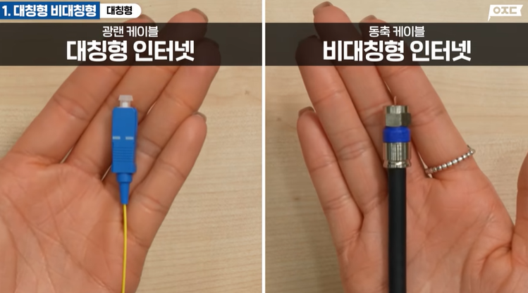
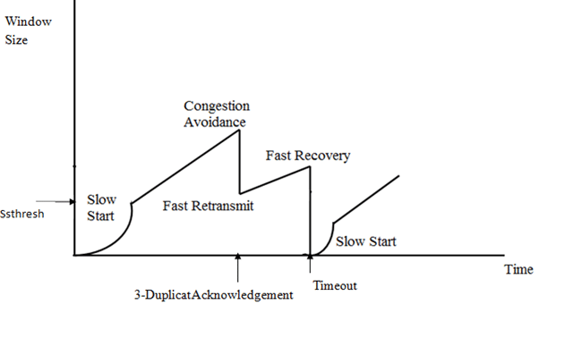

# 왜 비오는날 인터넷이 느려지지?

요즘 날씨가 참 이상하죠?  
정말 말그대로 40도를 찍어버리더니 며칠 전까지는 정말 미친듯이 비를 또 쏟아내렸죠.  

그리고 지난 주 일요일, 천둥번개치고 비오는 날 밤 디스코드로 밋업을 했는데요, 유난히 사람들이 인터넷이 자꾸 끊긴다는 이야기들을 많이 하시더라구요.  

그런데 생각해보면 우리 모두 한번쯤은 이런 경험을 하지 않았을까? 하는 생각이 들었어요.  

특히 저는 장교로 복무하면서, 비가 심하게 오는 날엔 정말 인트라넷이 거의 마비되는 경우도 많았죠.(~~일은 안해서 좋았지만, 통신장교들 RIP~~)  
그래서 한번 찾아보기로 했죠. 과연 이게 정말일까? 아니면 다들 그냥 나빴던 기억만 나는걸까?  

제 몇가지 가설은 이렇습니다.

> 1. 비오는 날에는 사람들이 다들 외출을 안하고 집에서 인터넷을 쓴다. 이로인해 트래픽이 증가하여 인터넷이 느려진다.  
> 2. 비(낙뢰)로 인해 물리적인 네트워크 장비의 성능이 저하(혹은 손상)되어 인터넷이 느려진다.  
> 3. 사실 느려지는게 아니라 그냥 사람들이 부정성 편향으로 인해(비오는 날씨 + 순간 느린 인터넷) 착각하는 것이다.  

그래서 저는 이 가설들을 검증하기 위해 관련 자료들을 찾아보기로 했어요.

## 가설 1. 비오는 날에는 사람들이 다들 외출을 안하고 집에서 인터넷을 쓴다. 이로인해 트래픽이 증가하여 인터넷이 느려진다.  

이 가설은 직관적으로는 말이 되는 것 같은데, 좀 더 생각해보니 허점이 꽤 있더라구요.  

우선 검색해보니 비오는날 실제로 트래픽이 평소보다 약 3~5% 정도 늘어난다고 합니다. 하지만 그렇게 큰 차이는 아니죠?  
그리고 우리나라의 인터넷 인프라는 그렇게 나약하지 않아서 그 정도 부하 증가는 티도 나지 않을거에요.  

그리고 보통 사람들이 '인터넷이 느려진다'는걸 느끼는건 퇴근 후 저녁시간대인데, 이 시간대에 날씨가 좋다고 더 많은 사람들이 나가서 논다..? 는 생각하기 어렵죠.

## 가설 2. 비(낙뢰)로 인해 물리적인 네트워크 장비의 성능이 저하(혹은 손상)되어 인터넷이 느려진다.

아마 이 가설이 정답에 가장 가깝지 않을까 싶어요.  

우선 여기서는 사람들이 집에서 흔히 사용하는 유선 인터넷에 대해서만 이야기 해볼게요.  

위 이미지처럼, 우리나라의 광섬유 보급률은 꽤나 높은 편이라고 해요. 하지만 남은 10%는 아직도 동축 케이블(구리선)을 사용하고 있어요.  

이런 구리선은, 손상된 부분이나 접점에 물이 닿게되어 전도율이 꽤나 떨어진다고 해요.  
따라서 전송속도도 떨어지고 에러율도 높아지죠.  

여기부터는 이제 제 **뇌피셜**인데요. 이전에 공부했던 내용을 바탕으로 약간의 추측을 해 봤어요.  

앞서 이야기 한 것 처럼 물리 레이어에 문제가 생긴다면 비트 에러의 발생빈도가 증가할 것 같아요. 물론 작은 오류들이라면 체크섬으로 잡아내거나 직접 복구하는 것도 가능하겠지만, 그 빈도가 평소보다 높아진다면 직접 복구할 수 없는 오류의 빈도도 그만큼 높아질거라고 생각해요. 그렇다면 자연스럽게 패킷의 재전송 요청도 증가할 겁니다.  

여기서 TCP의 속도 제어 기능이 작동하게 되면 더 문제가 생길거에요.  

TCP는 기본적으로, 처음부터 최고 속도로 동작하지 않습니다. 처음엔 느리게 시작해서 요청이 성공하면 속도를 지수적으로 증가시키는 방식이죠.  
그런데 한가지 문제는, TCP에서는 전송 중 실패를 감지하면 전송속도를 절반씩 줄여버립니다.(TCP 혼잡 제어)  
하지만 이러한 상황에서는 속도를 줄인들 혼잡이 해결되지 않을겁니다. 물리적인 장비가 오동작 하고있는 상태이니까요. - 그사이에 물기가 말랐다면 몰라도요 -

정리해 보면 이렇게 되겠네요.

> **1. 비트 에러율 증가**
>   - 신호 품질 저하 -> 비트 에러 발생
>   - CRC(Cyclic Redundancy Check) 체크 실패 -> 패킷 재전송 요청
> 
> **2. 혼잡 제어의 오인 동작**
>   - (정상 케이스): 패킷 손실 -> 네트워크 혼잡 -> 전송 속도 감소 -> 혼잡 해소
>   - (문제 케이스): 패킷 손실 -> (그냥 느림..) -> 전송 속도 감소 -> 여전히 느림 -> 계속 감소
> 
> **3. 지연 시간 증가**
>   - 재전송 타임아웃(RTO; Retransmission Timeout) 증가
>   - 지수적 백오프(Exponential Backoff) 작동
>   - Round Trip Time(RTT) 증가

이처럼 아직 국내 회선의 약 10%는 구리선을 사용하고 있으니, 사용자 10명 중 한명은 문제가 생길 수 있겠네요.  
그런데 이런 사용자가 화상회의나 게임에서 한명씩만 있더라도 해당 그룹에서는 전체적인 지연을 체감 할 수 있겠구나 싶지 않나요?

## 가설 3. 사실 느려지는게 아니라 그냥 사람들이 부정성 편향으로 인해(비오는 날씨 + 순간 느린 인터넷) 착각하는 것이다.

이것도 꽤나 그럴싸한 가설이라고 생각해요.  

결국 비오는 날에도 인터넷 속도는 전혀 느려지지 않지만, 단지 사람들이 그렇게 착각할 뿐이다! 라는 내용이에요.  

사람들은 부정적인 상황을 더 잘 기억한다고 하잖아요?  
그래서 똑같이 답답했던 경험이라도 날씨까지 안좋다면 더 심하게 느끼지 않을까 싶어요.  
이로인해 더 부정적인 기억이 강화되고 결국은 이걸 많은 사람들이 공유까지 하면서 이러한 인식을 만들지 않았을까 싶습니다

## 결론

결론적으로 가설 2가 가장 그럴싸하고, 과거의 이야기이지만 직접 경험에서 비롯한 꽤나 신뢰할 수 있는 가설이라고 생각해요.  
특히 인프라가 노후한 주택가나 오래된 아파트 단지라면, 마치 제가 군대에서 겪었던 것처럼 더 큰 체감을 하실지도 몰라요.  

오늘은 이렇게, 개발과는 조금 멀어진 그냥 궁금한 이야기를 정리해 봤습니다.
사실 여러 방면으로 검색해봐도 정말 명확한 결론이나 참고 자료가 없다는 점에서 정말 아쉽네요.

추측 과정에서 제가 놓치거나 헛다리를 짚은 부분이 있을 수도 있어요.  
혹시 전문가분이 있으시다면 틀린 부분을 댓글로 공유해주시면 정말 감사하겠습니다!  
