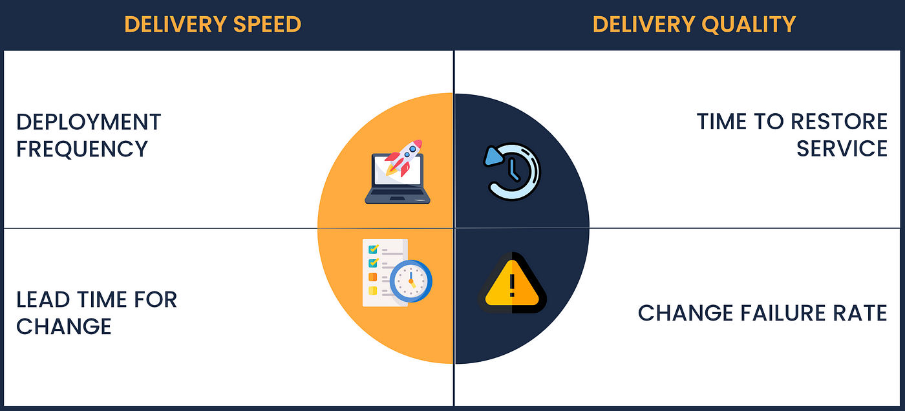

# Dev lab

## AI로 주니어 키우기 - 인프랩, 향로

- 일반적으로 최근 사이클은 2~3년 이내 이직
- 1년 간의 적응 시간, 길어야 1~2년 간의 업무 수행
  - 1년 간의 적응 시간을 단축시키자

### 구체적인 실행 방안

- 미션과 가치를 공유
  - [인프랩 개발팀의 미션과 가치](https://tech.inflab.com/20231117-devteam-value/)
- '일 잘하는 사람': 미션과 가치를 공유하고, 미션과 가치에 부합하는 일을 하는 사람
- 코드 리뷰를 통해 잦은 피드백: **결과적으로 서포터가 필요 없는 환경을 구성하기 위함. 문서화**
  - 소나큐브 사용
    - 코드 스멜, 테스트 커버리지, 라이브러리 취약점, 잘못된 패턴 등
  - [codeRabbit.ai](https://coderabbit.ai/)
    - AI 코드리뷰
      - ❓ 보안은? ✅ 내부 벡터 DB에 대해서는 탐색하는 AI를 별도로 사용하고있음.
      - ❓ 신뢰할만 한가?
    - 테스트 코드
    - DORA 메트릭, 대시보드
      - 
      - 절대적인 값은 아니지만, 회고시에 주요한 지표로 사용 할 수는 있음.
    - `grafana` 대시보드
      - 브랜치 분리 후 PR 리뷰 소요시간
      - PR 평균 일수
      - 병합 수
      - jenkins 빌드 수, 시간, 결과 분포, 평균 빌드 시간, 성공률
    - 언제든지 답변을 받을 수 있는 환경: `metasearch`
      - 오픈소스
      - jira, confluence, github, slack 등 모든 데이터를 가지고 통합 검색 할 수 있음.
      - mongo 벡터 db를 사용한 slack bot
      - **상배봇**
        - 간단한 답변과 참고한 문서 목록을 제공
          - ❓ 이것도 보안은? 사내에서 서빙중인것인지.
        - 개발뿐 아닌, 마케팅 등에도 활용 가능한 데이터 지표 분석이 가능함
          - 핵심 지표 요약 등
    - 문서화
      - 문서화를 강조하는것을 넘어, 직원들이 '문서화를 하면 내가 귀찮게 답변하지 않아도 되는구나' 라는 것을 느끼게 하는것이 중요
      - 또한 동일한 질문을 자주 하는것에 대한 부담감도 줄일 수 있음.
      - 신입 개발자도 문서화를 하게끔 유도: 신입의 눈으로 보는게 더 좋을 수 도 있음.
        - 혹은 최신화를 신입이 발견하는 경우도 많음.
        - 순환 사이클 - 자동답변 -> 문서화 -> 더 많은 참여와 AI 학습
    - 정확한 용어 정리
      - 공감대 구성
      - 의사소통 비용 감소
      - 이를 **시트로 정리하고 AI bot이 학습토록** 함. ❗**이건 바로 적용 가능할듯**
        - 컨텍스트까지 알 수 있도록 함.
    - 구두로 논의한 내용도 모두 기록
      - 별도의 구두 논의 슬랙 채널(**구두 논의**)을 만들어서, 그곳에 기록하도록 유도
        - 화이트보드, 작은 의사결정 등등 모두 포함
        - 당연히 이또한 AI가 학습하고 알려줄 수 있음.
        - 사소한 의사결정도 아카이빙 할수 있고, 추후 신입 개발자등도 히스토리를 추적하기 쉬움.
    - 직접 구축보다는 오픈소스 적극 사용
      - `Mantine`, `gluestack ui`
      - 자체개발도 시도했으나, 결국 그걸 구축/운영하기 위한 리소스가 별도로 필요해짐.
      - 오픈소스는 큰 버전업도 알아서 따라가고, 문서화도 알아서 해준다.
      - GPT, stackoverflow에서도 답변을 찾을 수 있음.

- Q. AI를 사용하는건 좋은데, 보안성은?
  - 표면적으로는 상배봇 하나이지만, 내부적으로는 사내 문서를 활용하는 내부 모델과 오픈소스를 참고하는 외부 모델로 나뉘어 있음.
- Q. 2년~3년이라는 사이클을 늘리기 위한 노력은?
  - 리텐션 등이 제도적으로는 없으나, **좋은 팀 경험, 문화**을 주고자 노력함.
---

참고 문서 - [Hiring ONLY seniors is the worst policy in the software industry](https://zaidesanton.substack.com/p/hiring-only-seniors-is-worst-policy)

## 프론트엔드 개발자에게 필요한 .. 아키텍처? - 테오

### 개요

- 프론트엔드 개발자는 언어를 3개 다룬다.
  - HTML: 구조
  - CSS: 스타일
  - JS: 동작
- 각자의 방식대로 관심사를 분리 할 수 있음.

### 빨간색 사각형 찾기

- 선택지가 하나라면, 의사결정에 대한 부담이 적음.
- 다만 조건이 많아질수록 의사결정에 대한 부담은 급격히 커짐.
  - 비슷한 것들이 섞여있을때, 부담이 매우 커짐
- 즉, 관심사의 분리를 통해 하나의 명확한 기능만 수행하도록 하는것이 중요함.
  - 유지보수에 굉장한 도움이 됨.
- 혹은 하나의 기준으로 구분만 해주더라도 도움이 됨.

### 컴포넌트 - 희망편

- 계층과 역할의 분리를 통해 관심사를 분리
  - 좋긴 한데, 하나의 기능 수정을 위해 HTML, CSS, JS를 모두 수정해야 하는 경우가 생김.
- 이 문제를 해결하기 위해 컴포넌트를 사용
  - 하나의 파일로 묶어서 HTML + JS = JSX로 통합
- 수평적(HTML, CSS, JS)가 아닌 수직적(컴포넌트)로 관심사를 분리
  - 층층이 쌓인 레이어가 아닌 모듈 단위로 관심사를 분리를
  - 이런 기능중심의 개발을 통해 독립적 테스트, 기능 추가, 수정이 가능해짐.

### 컴포넌트 - 절망편

- 컴포넌트간의 데이터 전달이 필요함.
  - 이를 위해 `props`를 사용
    - 이렇게 전달하면 각각의 데이터때문에 독립적인 존재가 아니게 됨.
- 문제점
  - 컴포넌트의 비대화
  - 상호간의 높은 결합도
  - 관리의 어려움

- 컴포넌트가 커지는걸 막을 수 없음.
  - 컴포넌트 내부에서 다시 한번 수평적 관심사 분리: 아토믹 디자인 패턴
  - **디자인 토큰**

- HTML, CSS의 문제점
  - 둘 다 독립적인척 하지만, 상호 영향을 까침.
  - 의존성을 단방향으로 만들자
    - CSS는 HTML을 따라가야 한다.
  
- 비즈니스와 뷰 로직의 분리
  - entity, view는 확실히 분리되어야 한다.
  - entity: 데이터는 바꾸기 어려움.
  - view는 바꾸기 쉬워야 함.
  - 즉, 데이터 => 화면이라는 흐름을 유지해야 함.

### 현대의 프론트엔드 폴더 구조

- 예시

  ```bash
  - `src`
    - `components`
      - `atoms`
      - `molecules`
      - `organisms`
      - `templates`
      - `pages`
    - `hooks`
    - `utils`
    - `styles`
    - `assets`
    - `types`
    - `services`
    - `contexts`
    - `config`
    - `constants`
    - `routes`
    - `store`
    - `i18n`
    - `test`
    - `public`
    - `index.tsx`
    - `App.tsx`
    - `react-app-env.d.ts`
    - `setupTests.ts`
    - `tsconfig.json`
    - `package.json`
    - `README.md`
    - `yarn.lock`
    - `node_modules`
  ```

- 관심사의 방향은 관점에 따라 달라진다.
  - 모듈(수직), 레이어(수평)
  - 이 둘로 나누는것을 기본으로 하되, 모듈 내에서도 레이어를 나누는 것이 필요해짐.
    - 두 가지 장점을 모두 취해야 함.

- 데이터 흐름에 대한 새로은 계층이 생김
  - event, update /  state, view
  - 클린 아키텍처

- 여기서 발생하는 고민
  - **/cart/api** vs **/api/cart**
  - 위의 예시로 든 폴더구조에서 만약 cart를 찾는다면, 모두 파편화 되어있는 것을 볼 수 있음.
    - service에도 있고, page에도 있고...

- FSD 아키텍처(Feature Slice Domain)
  - layer, slices, segments
  - layer: presentation, domain, data
  - slices: feature, shared
  - segments: module, component, page

- 이러한 FSD를 도입하기 위해서는 개인의 의견으로 남겨두기보다는 문서화를 하는 것이 유리함.
  - 오히려 너무 많이 쪼개는것 같아서 어려울 수 있다..

- 폴더 구조는 프로젝트가 커질수록 같이 성장함.
  - 프로젝트 초창기: 단순히 페이지를 추가
    - /pages
    - /shared -> /apis, /components..
  
  - 프로젝트가 조금씩 커진 후: 페이지가 많아지고, 공통 컴포넌트가 생김
    - **/pages** -> /main, 
  
  - 프로젝트 성숙기: 데이터의 중요성이 커짐
    - /pages -> /main
    - **/entities** -> /item -> /api, /ui, /model
  
  - 프로젝트 릴리즈 이후: 기존 프로젝트에 새로운 기능을 여기저기 추가하지 않고, features로 분리
    - /main -> /main
    - /entities -> /item -> /api, /ui, /model
    - **/features** -> /report -> /api, /ui, /model

- 단일 책임 원칙
- OCP(Open Closed Principle)
  
- 흔히 하는 실수
  - 모양이 같으면 같은 컴포넌트로 만든다?
    - 컴포넌트에 if가 들어가면 안된다.. 지금은 같아도 나중에 다를 수 있다.
    - 데이터가 다르면 다른 컴포넌트로 만들어야 한다.
    - 모양이 같아 재활용 하고자 한다면
      - Title, Card, Price, DescTitle 등으로 분리해두고 이걸 조합해서 컴포넌트로 만들어야 함.
  - 만능 게시판?
    - Board는 항상 같은 인터페이스를 유지해야 한다.
      - 데이터에 의존해야 함.

- 결론
  - 관심사의 분리
  - 의존성 최소의 원칙
  - 결합도와 응집도
  - 모듈과 레이어
  - 데이터 흐름과 아키텍처

Q. 의존성 관리 없에 Props만 사용하는 수많은 400줄 이상의 코드가 나열되어있음.. 어떻게 하는게 좋을까
  - 간단한 상태관리 패턴을 전역으로 하나 만들고(zustand 등) 이를 사용하도록 유도
  - 별로 중요하지 않은 config 등의 데이터를 중심으로 하나의 상태관리를 만들어서 사용하도록 유도
  - 잘못된 props와 괜찮은 props를 구분하는 개인의 룰을 세워볼것.
  - 컴포넌트가 entity 인지 UI인지 확실히 알 수 있어야 함.

---

# 클린 아키텍처 - 무한 성자하는 시스템의 비밀

- 남의 집을 따라하면 그 끝은 남의 집이다.
- 우리가 생각하는 좋은 코드: 해리포터 드래곤?
- 우리가 실제 작성하는 코드: 키메라

- 기획자들의 질문: ~~ 해주세요. 안되겠죠?
  - 이전 개발자들이 그런 분위기를 만들어둠.
  - 개선이 어려운 코드를 만들어왔기 때문임.

- 좋은 설계: 미래를 멀리 보지 마라.

- 비즈니스를 보호하는 아키텍처
  - 도메인을 보호하자.

- 제안하는 구조
  - Funnel
    - Interface
    - Application
    - Service
    - Infra

- 남에 관계 없이 독립적으로 동작 할 수있는 비즈니스 로직이 필요함.
  - Infra 등을 분리하자.
  - 인터페이스를 분리하자.
  - Application, Service 계층을 분리하자.

- Application 계층은 Service 계층을 합쳐서 만들 수 있음.

- Interface: 외부의 표현 계층. 진입접 / 진출점
  - Kafka 등..
- Use-case: 사용자가 가져가는 실제 기능
- Domain: 대부분 재활용이 불가능.. Service. 이게 일종의 Component에 대한 진입점
- Component: 도메인을 활용하는 최소한의 기능 / 실제 구현
- Infrastructure: 

- 숙성
  - 충분히 독립할만한 가치가 있는 도메인만 분리해야 함.

- 책임
  - Domain: 예약 서비스
  - Components: 사용자 정보, 예약 키 생성, 예약 생성, 예약 부가정보 추가
